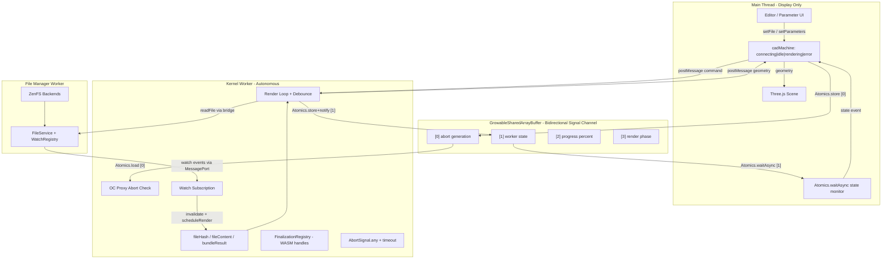

# Autonomous Kernel Topology -- Final Plan

## Current State Assessment

### Filesystem Overhaul: COMPLETE

All 15 todos verified in codebase. Key infrastructure in place:

- `WatchRequest`/`WatchEvent` types, `WatchRegistry` with dedup/ref-counting, `EventCoalescer` with semantic collapse rules
- Bridge watch protocol (`watch`/`unwatch` control messages, `proxy.watch()`)
- Kernel `updateWatchSet` with incremental dependency diffing
- `filesChanged` response type, `kernelFilesChanged` event in cadMachine
- `use-build.tsx` fileWritten fanout relay removed
- `@taucad/filesystem` standalone package with 120 passing tests

**One deviation**: `fileChanged` command retained in protocol for inline code mode -- this is correct and intentional.

### Gap to Target (runtime-topology.md)

```mermaid
flowchart LR
  subgraph done [Completed Foundation]
    WatchInfra["Watch infra"]
    BridgeProtocol["Bridge watch protocol"]
    EventPipeline["Event pipeline"]
    KernelWatch["updateWatchSet"]
    FilesChanged["filesChanged response"]
  end

  subgraph gap [Remaining Work]
    TransferFix["Export transfer bugfix"]
    RenderLoop["Worker render loop"]
    AbortInfra["GrowableSharedArrayBuffer channel"]
    AtomicsAsync["Atomics.waitAsync state"]
    OCAbort["OC Proxy abort check"]
    SetFileCmd["setFile/setParameters commands"]
    StateChanged["stateChanged response"]
    NativeHandleGC["FinalizationRegistry handles"]
    MachineCollapse["kernelMachine elimination"]
    CadSimplify["cadMachine simplification"]
  end

  done --> gap
```




| Component                | Current                                              | Target                                       |
| ------------------------ | ---------------------------------------------------- | -------------------------------------------- |
| Worker render scheduling | Main thread drives via `render()` command            | Worker self-schedules with internal debounce |
| File change debounce     | cadMachine `bufferingFile` (500ms)                   | Worker-internal timer (500ms)                |
| Parameter debounce       | cadMachine `bufferingParameters` (50ms)              | Worker-internal timer (50ms)                 |
| Render cancellation      | `RenderSupersededError` (client-side promise reject) | `Atomics.load` abort + generation counter    |
| Protocol commands        | `render`, `cancel`, `fileChanged`                    | `setFile`, `setParameters`, `export`         |
| Protocol responses       | `geometryComputed`, `parametersResolved`             | + `stateChanged`                             |
| cadMachine states        | 7 states, ~761 lines                                 | 4 states, ~150 lines                         |
| kernelMachine            | ~458 lines, pass-through middleman                   | Eliminated                                   |
| OC Proxy                 | Tracing + exception handling                         | + cooperative abort via `Atomics.load`       |
| SharedArrayBuffer        | Only `assertCrossOriginIsolated()` check             | Bidirectional GrowableSharedArrayBuffer      |
| Export transfer          | Structured clone (no transferables)                  | Zero-copy via transfer list                  |
| WASM handle cleanup      | Manual only, no safety net                           | FinalizationRegistry fallback                |
| Watch set diffing        | Manual iteration                                     | Native `Set.difference()`                    |
| Render timeout           | cadMachine timer                                     | `AbortSignal.timeout()` in worker            |


---

## Architectural Critique and Refinements

### 1. Debounce belongs in the worker (confirmed)

The worker has full context: dependency graph, cache state, in-flight render status. The main thread has none of this. Moving debounce to the worker eliminates a round-trip per file change and lets the worker make informed decisions (e.g., skip re-render if changed file isn't in dependency graph -- already handled by watch scope).

### 2. Watch events cannot use SharedArrayBuffer abort (by design)

Watch events originate from the file manager worker, not the main thread. They arrive as MessagePort messages that queue behind synchronous WASM. The 500ms debounce timer starts only after the event is processed, so the abort latency concern is moot. `Atomics.store` is reserved for main-thread-originated signals (`setFile`/`setParameters`) where the user expects immediate responsiveness.

### 3. Inline code mode coexistence

The inline code path (`RuntimeClient.render({ code })`) uses an in-memory FS and explicit `notifyFileChanged`. This path must continue working. The solution: keep `render()` on `RuntimeClient` for inline mode, add `setFile()`/`setParameters()` for filesystem mode. The worker dispatcher handles both command shapes.

### 4. OpenSCAD abort gap

OpenSCAD's `callMain()` is a single synchronous WASM invocation with no JS/WASM boundaries to intercept. Neither the Proxy abort nor async boundary checks help. The generation counter discards stale results, but the user waits for the full computation. Acceptable until JSPI ships in Safari (2027+). No special handling needed now.

### 5. Export during render

If export is requested while a render is in-progress, the worker should either: (a) queue the export until the current render completes, or (b) export from the last completed native handle. Option (b) is better UX -- the user sees the last geometry and can export it immediately. The worker stores the last native handle and exports from it regardless of render state.

### 6. Multiple compilation units with overlapping dependencies

Each compilation unit has its own cadMachine + runtime worker. Overlapping file watches are deduplicated by `WatchRegistry` at the FileService level. A single file edit fires one watch event to the FileService, which fans out to all matching subscriptions. Each runtime worker independently debounces and re-renders. This is correct and efficient.

### 7. `scheduler.yield()` for worker responsiveness

Between heavy async phases (bundle, execute, tessellate), `await scheduler.yield()` allows the worker to process queued messages (watch events, abort signals) without the priority inversion of `setTimeout(0)`. Available in workers in Chrome 129+ and Firefox 142+.

**Safari does NOT support `scheduler.yield()` as of March 2026.** The worker must use a fallback:

```typescript
const yieldToEventLoop = globalThis.scheduler?.yield
  ?? (() => new Promise<void>(resolve => setTimeout(resolve, 0)));
```

### 8. Bidirectional SharedArrayBuffer protocol

The original plan allocated `SharedArrayBuffer(4)` for a single abort flag. This underutilizes the shared memory channel. Expanding to a bidirectional protocol eliminates postMessage overhead for high-frequency signals:

```
SharedArrayBuffer layout (Int32Array view):
  [0] abort generation   (main -> worker, Atomics.store/load)
  [1] worker state enum   (worker -> main, Atomics.store + Atomics.notify)
  [2] progress percent    (worker -> main, Atomics.store, no notify)
  [3] render phase        (worker -> main, Atomics.store, no notify)
```

Main thread monitors slot [1] via `Atomics.waitAsync(view, 1, currentValue)` for state change notifications. This avoids postMessage for the highest-frequency signal during slider drags. Research shows Atomics.notify/waitAsync achieves sub-microsecond wakeup vs ~1.5ms postMessage round-trip, yielding 37-60% throughput improvement for frequent small messages.

Using `GrowableSharedArrayBuffer` (`new SharedArrayBuffer(16, { maxByteLength: 64 })`) allows adding future signal slots without worker restart. Baseline July 2024: Chrome 111+, Firefox 128+, Safari 16.4+.

Geometry data (large payloads) still uses postMessage with transfer list -- Atomics is only for small scalar signals.

### 9. Export transfer bug (pre-existing)

The render path in [runtime-worker-dispatcher.ts](packages/runtime/src/framework/runtime-worker-dispatcher.ts) correctly transfers geometry `ArrayBuffer`s via `extractGltfTransferables()`. The export path does NOT -- export payloads (`ExportFile[]` with `bytes: Uint8Array`) are structured-cloned. For a 30MB STEP file, this is ~302ms clone vs ~6.6ms transfer (45x penalty). Must be fixed.

### 10. FinalizationRegistry for WASM handle safety

The worker stores the "last native handle" for export-during-render. If the handle leaks on error/abort paths, WASM memory grows unbounded. The codebase has zero usage of `FinalizationRegistry` despite managing OpenCASCADE Emscripten objects that require explicit `delete()` calls.

`FinalizationRegistry` provides a non-deterministic safety net for leaked WASM handles. It does NOT replace deterministic cleanup (the worker must still call `handle.delete()` on render completion/abort). It catches the edge cases where cleanup is missed.

Baseline since 2021. Zero adoption risk.

### 11. Modern JS primitives (ECMA 2024-2026) available for use

The following primitives are Baseline and should be used throughout the implementation:

- `**Set.difference()`, `Set.intersection()**` (Baseline June 2024) -- for `updateWatchSet` dependency diffing. Replaces manual iteration.
- `**Promise.withResolvers()**` (Baseline March 2024) -- for deferred promise patterns in inline-mode response correlation.
- `**ArrayBuffer.prototype.transfer()**` (Baseline March 2024) -- for explicit zero-copy buffer moves within the worker before dispatch. Prevents use-after-transfer bugs.
- `**AbortSignal.any()**` (Baseline March 2024) -- combines render cancellation signal with timeout. Replaces cadMachine's `renderTimeout` timer.
- `**AbortSignal.timeout()**` (Baseline April 2024) -- automatic render timeout without manual timer management.
- **Iterator helpers** (`Iterator.from().filter().map()`) (Baseline March 2025) -- lazy processing of bundler metafile import graphs without intermediate array allocations.
- `**Atomics.waitAsync()`** (Baseline November 2025) -- non-blocking wait for shared memory changes on main thread. Chrome 90+, Firefox 145+, Safari 16.4+.

Not yet available (Safari missing): `using`/`await using` (explicit resource management), `scheduler.yield()`. Use fallbacks.

---

## Implementation Phases

### Phase 0: Export Transfer Bugfix (independent, do first)

**[runtime-worker-dispatcher.ts](packages/runtime/src/framework/runtime-worker-dispatcher.ts):**

The render path correctly uses `extractGltfTransferables()` to transfer geometry `ArrayBuffer`s. The export path does NOT -- export payloads (`ExportFile[]` with `bytes: Uint8Array`) are structured-cloned. For a 30MB STEP file this is ~302ms clone vs ~6.6ms transfer (45x penalty).

- Add `extractExportTransferables(result: ExportFile[])` that collects `file.bytes.buffer` for each export file
- Wire into the `exported` response: `respond({ type: 'exported', requestId, result: exportResult }, transferables)`
- Matches existing pattern from `extractGltfTransferables()`

### Phase 1: Protocol Evolution (non-breaking additions)

Add new command/response types alongside existing ones. No behavioral changes yet.

**[runtime-protocol.types.ts](packages/runtime/src/types/runtime-protocol.types.ts):**

- Add `SetFileCommand = { type: 'setFile'; file: GeometryFile; parameters: Record<string, unknown>; tessellation?: Tessellation }`
- Add `SetParametersCommand = { type: 'setParameters'; parameters: Record<string, unknown> }`
- Add `StateChangedResponse = { type: 'stateChanged'; state: 'idle' | 'rendering' | 'error'; detail?: string }`
- Add `RenderAbortedError` class to [runtime-worker-client.ts](packages/runtime/src/framework/runtime-worker-client.ts)
- Keep existing `render`, `cancel`, `fileChanged` commands for backward compatibility during migration

### Phase 2: GrowableSharedArrayBuffer Bidirectional Channel

**[runtime-worker-client.ts](packages/runtime/src/framework/runtime-worker-client.ts):**

- Allocate `GrowableSharedArrayBuffer`:

```typescript
const signalBuffer = new SharedArrayBuffer(16, { maxByteLength: 64 });
const signalView = new Int32Array(signalBuffer);
```

- Memory layout (Int32Array indices):

```
[0] abortGeneration     main -> worker    Atomics.store / Atomics.load
[1] workerState          worker -> main    Atomics.store + Atomics.notify / Atomics.waitAsync
[2] progressPercent      worker -> main    Atomics.store (no notify, polled)
[3] renderPhase          worker -> main    Atomics.store (no notify, polled)
```

- Worker state enum values: `0 = idle, 1 = rendering, 2 = error`
- Transfer `signalBuffer` to worker during `initialize()` command
- Add `incrementGeneration()` method: `Atomics.store(signalView, 0, ++generation)`
- Add `monitorWorkerState()` using `Atomics.waitAsync(signalView, 1, currentState)` -- resolves when worker writes a new state, re-arms automatically. Falls back to polling via `stateChanged` postMessage if `Atomics.waitAsync` is unavailable.

**[runtime-worker-dispatcher.ts](packages/runtime/src/framework/runtime-worker-dispatcher.ts):**

- Receive `signalBuffer` from `initialize` command
- Create `Int32Array` view, pass to `KernelWorker` constructor/init

**[kernel-worker.ts](packages/runtime/src/framework/kernel-worker.ts):**

- Store `signalView: Int32Array` and `renderGeneration: number`
- Expose `getSignalView()` for OC Proxy consumption
- Add `pushState(state: number)`: `Atomics.store(signalView, 1, state); Atomics.notify(signalView, 1)`
- Add `pushProgress(percent: number)`: `Atomics.store(signalView, 2, percent)`
- Add `pushPhase(phase: number)`: `Atomics.store(signalView, 3, phase)`
- Continue sending `stateChanged` postMessage as fallback (for environments without `Atomics.waitAsync`)

### Phase 3: OC Proxy Cooperative Abort

**[oc-tracing.ts](packages/runtime/src/kernels/replicad/oc-tracing.ts):**

- Add `signalView: Int32Array | null` and `currentGeneration: number` to the proxy closure
- In `wrapOcForExceptions` and `wrapOcWithTracing` function wrappers, before `Reflect.apply`/`Reflect.construct`:

```typescript
if (signalView && Atomics.load(signalView, 0) !== currentGeneration) {
  throw new RenderAbortedError();
}
```

- Overhead: one `Atomics.load` per OC call (~1ns vs microsecond-millisecond OC calls)
- Add `setAbortContext(view, generation)` to configure before each render
- Add `clearAbortContext()` for cleanup

### Phase 4: Worker-Internal Render Loop

**[kernel-worker.ts](packages/runtime/src/framework/kernel-worker.ts):**

- Add internal state: `currentFile`, `currentParameters`, `currentTessellation`, `renderGeneration`, `fileDebounceTimer`, `paramDebounceTimer`

**WASM handle lifecycle with FinalizationRegistry:**

- Add `FinalizationRegistry` safety net for leaked native handles:

```typescript
const handleRegistry = new FinalizationRegistry<{ delete: () => void }>((handle) => {
  handle.delete();
});
```

- On successful render: store `lastNativeHandle` for export, register with `FinalizationRegistry`
- On render abort/error: deterministically call `handle.delete()` in catch block (primary cleanup)
- `FinalizationRegistry` is the safety net for edge cases where deterministic cleanup is missed
- Unregister previous handle from registry when a new render completes

**Render scheduling:**

- Add `handleSetFile(file, params, tessellation)`:
  - Store file + params
  - Abort any in-progress render (increment generation)
  - Call `executeRender()` immediately (first render, no debounce)
  - After render: discover deps, `updateWatchSet`
- Add `handleSetParameters(params)`:
  - Store params
  - Abort any in-progress render
  - Schedule render with 50ms debounce
- Add `scheduleRender(delayMs)`:
  - Clear existing timer
  - Set new timer -> `executeRender()`

**Render execution with modern primitives:**

- Add `executeRender()`:
  - Increment `renderGeneration`
  - Set abort context on OC Proxy
  - Create cancellation signal: `AbortSignal.any([abortController.signal, AbortSignal.timeout(30_000)])`
  - Push state via `Atomics.store(signalView, 1, RENDERING); Atomics.notify(signalView, 1)`
  - Run: bundle -> (abort check) -> execute -> (abort check) -> computeGeometry -> (abort check) -> push result
  - At each `await` boundary: `signal.throwIfAborted()` + `if (gen !== this.renderGeneration) return`
  - Use `await yieldToEventLoop()` between phases (Safari-safe fallback for `scheduler.yield()`)
  - On success:
    - Use `ArrayBuffer.transfer()` on result buffers before dispatching to prevent use-after-transfer
    - Push `geometryComputed` with transferred buffers
    - Update watch set using `Set.difference()`: `const toAdd = newDeps.difference(currentWatches); const toRemove = currentWatches.difference(newDeps);`
    - Push state idle via `Atomics.store + Atomics.notify`
  - On `RenderAbortedError` or `AbortError`: swallow, push state idle (new render will follow)
  - On error: push `error`, push state error

`**scheduler.yield()` fallback:**

```typescript
const yieldToEventLoop = globalThis.scheduler?.yield
  ?? (() => new Promise<void>(resolve => setTimeout(resolve, 0)));
```

**Watch event handler (already exists in `updateWatchSet`):**

- Invalidate caches (already done)
- Call `scheduleRender(500)` instead of `onFilesChanged`
- Still push `filesChanged` response for backward compat during migration

**[runtime-worker-dispatcher.ts](packages/runtime/src/framework/runtime-worker-dispatcher.ts):**

- Handle `setFile` -> `worker.handleSetFile()`
- Handle `setParameters` -> `worker.handleSetParameters()`
- Results pushed via callbacks (not request/response): `onGeometryComputed`, `onStateChanged`, `onParametersResolved`, `onProgress`, `onError`

### Phase 5: RuntimeClient API Modernization

**[runtime-worker-client.ts](packages/runtime/src/framework/runtime-worker-client.ts):**

- Add `setFile(file, params, tessellation?)`:
  - `Atomics.store(signalView, 0, ++generation)` (abort in-flight render instantly)
  - `transport.send({ type: 'setFile', ... })`
- Add `setParameters(params)`:
  - `Atomics.store(signalView, 0, ++generation)`
  - `transport.send({ type: 'setParameters', ... })`
- Add event emitter: `on('geometry', cb)`, `on('state', cb)`, `on('parameters', cb)`, `on('progress', cb)`, `on('error', cb)`
- **State monitoring via `Atomics.waitAsync`** (primary path, replaces postMessage for state changes):

```typescript
const monitorState = async () => {
  let currentState = Atomics.load(signalView, 1);
  while (!terminated) {
    const result = Atomics.waitAsync(signalView, 1, currentState);
    if (result.async) await result.value;
    const newState = Atomics.load(signalView, 1);
    if (newState !== currentState) {
      currentState = newState;
      this.emit('state', STATE_NAMES[newState]);
    }
  }
};
```

- Handle `stateChanged` postMessage response as fallback for environments without `Atomics.waitAsync`
- **Use `Promise.withResolvers()`** for inline-mode response correlation:

```typescript
const { promise, resolve, reject } = Promise.withResolvers<GeometryResult>();
this.pendingRequests.set(requestId, { resolve, reject });
return promise;
```

- Keep `render()` for inline code mode backward compat

**[kernel-client.ts](packages/runtime/src/client/runtime-client.ts):**

- Add `setFile()` and `setParameters()` methods that delegate to the worker client
- Keep `render()` for inline code mode
- Add event emitter surface: `on('geometry')`, `on('state')`, etc.

### Phase 6: Machine Consolidation

**[cad.machine.ts](apps/ui/app/machines/cad.machine.ts) -- rewrite to ~150 lines:**

```
states: connecting | idle | rendering | error
```

- `connecting`: Invoke promise actor that creates `RuntimeClient`, creates filesystem bridge, connects, subscribes to events, returns `{ client, cleanups }`
- `idle`: Waiting. On `setFile` -> `client.setFile()` (no state change until `stateChanged('rendering')` arrives). On `setParameters` -> `client.setParameters()`. On `exportGeometry` -> `client.export()`.
- `rendering`: Display state only. Reflects `stateChanged('rendering')` from worker (via `Atomics.waitAsync` or postMessage fallback). On `geometryComputed` -> update context + transition to `idle`. On `setFile`/`setParameters` -> forward to client (worker handles abort internally).
- `error`: Reflects `stateChanged('error')` or `error` event. Recovery via `setFile`.
- Events from worker (`geometry`, `parameters`, `state`, `progress`, `error`, `log`, `telemetry`) handled via `client.on(...)` subscriptions, forwarded to React via context.
- No `bufferingFile`, `bufferingParameters`, `createGeometry`, `kernelFilesChanged`, `renderTimeout` timer. Render timeout is now `AbortSignal.timeout()` inside the worker.

**Delete [kernel.machine.ts](apps/ui/app/machines/kernel.machine.ts)** (~458 lines eliminated).

**Update [use-build.tsx](apps/ui/app/hooks/use-build.tsx):**

- Compilation unit creation passes `fileManagerRef` and `kernelOptions` to cadMachine (same as today)
- Remove references to `kernelMachine` types
- `initializeModel` -> `setFile` on cadMachine

**Update [use-cad-preview.tsx](apps/ui/app/hooks/use-cad-preview.tsx):**

- Update state derivation for new 4-state model
- `setParameters` -> `cadRef.send({ type: 'setParameters', ... })`

### Phase 7: Dead Code Cleanup

- Remove `render` command from dispatcher filesystem-mode path (keep for inline mode)
- Remove `cancel` command (no-op today, unnecessary with generation counter)
- Remove `RenderSupersededError` (replaced by `RenderAbortedError` + generation counter)
- Remove `bufferingFile`, `bufferingParameters` states and associated actions/guards from cadMachine
- Remove `createGeometry` action
- Remove `kernelFilesChanged` event (worker debounces internally; no main-thread relay)
- Remove `renderTimeout` timer from cadMachine (replaced by `AbortSignal.timeout()` in worker)
- Clean up `RuntimeWorkerClient.render()` to only be used for inline code mode
- Remove old `pendingRender` promise tracking for filesystem mode (replaced by `Promise.withResolvers` pattern)

### Phase 8: Tests

**Unit tests (new file: `runtime-render-loop.test.ts`):**

- Worker `handleSetFile` -> immediate render -> `geometryComputed` pushed
- Worker `handleSetParameters` -> 50ms debounce -> render
- Watch event -> cache invalidation -> 500ms debounce -> render
- Rapid `setParameters` -> only last render executes
- `setFile` during render -> abort + new render
- Generation counter discards stale results
- `RenderAbortedError` swallowed cleanly
- `AbortSignal.timeout()` fires after 30s -> render aborted, state = error
- `FinalizationRegistry` cleans up leaked WASM handle (mock GC trigger)

**Unit tests (new file: `oc-abort.test.ts`):**

- `Atomics.load` mismatch throws `RenderAbortedError`
- `Atomics.load` match proceeds normally
- Abort overhead measurement (should be < 1% of OC call time)

**Unit tests (new file: `signal-channel.test.ts`):**

- `Atomics.waitAsync` resolves on state change notification
- `Atomics.waitAsync` fallback to postMessage when unavailable
- Progress and phase values readable via `Atomics.load` polling
- `GrowableSharedArrayBuffer` correctly shared between main/worker threads

**Integration tests (extend existing):**

- File edit -> watch event -> worker re-render -> `geometryComputed` (no main thread relay)
- `setFile` -> render -> `setParameters` during render -> abort -> new render with latest params
- Export during render -> uses last completed geometry
- Export response uses transferables (buffer detached after transfer)
- Watch set diffing via `Set.difference()` adds/removes correct subscriptions

**Stress tests:**

- 100 rapid `setParameters` calls -> worker renders only the last state
- `setFile` + concurrent file edits -> correct final geometry
- SharedArrayBuffer abort latency: < 1ms from `Atomics.store` to `RenderAbortedError`
- `Atomics.waitAsync` state notification latency: < 0.1ms from `Atomics.store + notify` to callback

---

## Thread Topology (Final State)




**Data flow summary:**

- **Abort signal** (main -> worker): `Atomics.store` on slot [0], read by OC Proxy via `Atomics.load`. Sub-millisecond latency, bypasses blocked event loop.
- **State changes** (worker -> main): `Atomics.store + Atomics.notify` on slot [1], consumed by `Atomics.waitAsync` on main thread. Sub-microsecond wakeup vs ~1.5ms postMessage. Falls back to postMessage `stateChanged` response.
- **Progress/phase** (worker -> main): `Atomics.store` on slots [2-3], polled by main thread on animation frame. No notify needed (lossy polling is acceptable for progress bars).
- **Geometry data** (worker -> main): postMessage with `ArrayBuffer.transfer()` in transfer list. Zero-copy for large GLB payloads.
- **Export data** (worker -> main): postMessage with transfer list (Phase 0 bugfix). Previously structured-cloned.

---

## Modern JS Primitives Summary


| Primitive                   | Phase   | Purpose                                      | Browser Baseline |
| --------------------------- | ------- | -------------------------------------------- | ---------------- |
| `GrowableSharedArrayBuffer` | 2       | Expandable bidirectional signal channel      | July 2024        |
| `Atomics.waitAsync`         | 2, 5    | Non-blocking state monitoring on main thread | Nov 2025         |
| `Atomics.store/load/notify` | 2, 3, 4 | Abort signal + state push                    | ES2017           |
| `FinalizationRegistry`      | 4       | Safety net for leaked WASM handles           | 2021             |
| `ArrayBuffer.transfer()`    | 0, 4    | Explicit zero-copy buffer moves              | March 2024       |
| `Set.difference()`          | 4       | Watch subscription diffing                   | June 2024        |
| `AbortSignal.any()`         | 4       | Combine cancel + timeout signals             | March 2024       |
| `AbortSignal.timeout()`     | 4       | Automatic render timeout                     | April 2024       |
| `Promise.withResolvers()`   | 5       | Deferred promise for inline-mode correlation | March 2024       |
| Iterator helpers            | 4       | Lazy bundler metafile processing             | March 2025       |
| `scheduler.yield()`         | 4       | Worker event loop yielding (with fallback)   | NOT Safari       |


---

## Risk Assessment

- **Inline code mode regression**: Mitigated by keeping `render()` method on RuntimeClient for inline mode. Filesystem mode uses `setFile()`/`setParameters()`.
- **OpenSCAD uninterruptible render**: Mitigated by generation counter (correctness guaranteed, UX suboptimal). JSPI is the long-term fix.
- **SharedArrayBuffer COOP/COEP**: Already required for OpenCASCADE pthreads. No new requirements. GrowableSharedArrayBuffer inherits the same COOP/COEP requirement.
- **cadMachine rewrite scope**: Large but mechanical. The new machine is dramatically simpler (4 states vs 7, ~150 lines vs ~761).
- **Breaking changes to `@taucad/runtime` public API**: `render()` kept for backward compat. `setFile()`/`setParameters()` are additive. Non-breaking.
- `**Atomics.waitAsync` availability**: Baseline November 2025 (Chrome 90+, Firefox 145+, Safari 16.4+). Fallback to postMessage `stateChanged` response if unavailable. The `monitorWorkerState()` loop checks for `Atomics.waitAsync` support at startup.
- `**scheduler.yield()` Safari gap**: Safari does not support it. Fallback to `setTimeout(0)` -- slightly worse priority inversion but functionally equivalent.
- `**FinalizationRegistry` non-determinism**: GC timing varies across engines. It is a safety net, NOT the primary cleanup path. Deterministic `handle.delete()` in catch/finally blocks handles the normal case.
- **GrowableSharedArrayBuffer + Emscripten**: No conflict. The GrowableSharedArrayBuffer is allocated by JavaScript, not Emscripten. Emscripten manages its own WASM linear memory independently.

---

## Tracked but NOT Adopted (Future)

- **WebGPU compute shaders for tessellation**: BRep tessellation is inherently serial; GPU readback overhead (~1ms fixed) negates compute gains. Consider for post-tessellation operations (edge detection, normal recalculation) when Three.js WebGPU renderer matures.
- **Float16Array**: Baseline April 2025. Half-precision insufficient for CAD coordinate precision (>100mm models). Consider for preview-only tessellation quality.
- `**using`/`await using` (explicit resource management)**: Safari does NOT support `Symbol.dispose`/`Symbol.asyncDispose`. Would replace `FinalizationRegistry` for deterministic WASM handle cleanup. Track for 2027+.
- **OffscreenCanvas + Three.js**: Move rendering off main thread. Stability concerns with `transferControlToOffscreen()` and GC. Separate initiative.
- **JSPI (WebAssembly JS Promise Integration)**: Mid-WASM abort for OpenCASCADE meshing. Safari not supported, Emscripten ASYNCIFY=2 experimental. Track for 2027+.

