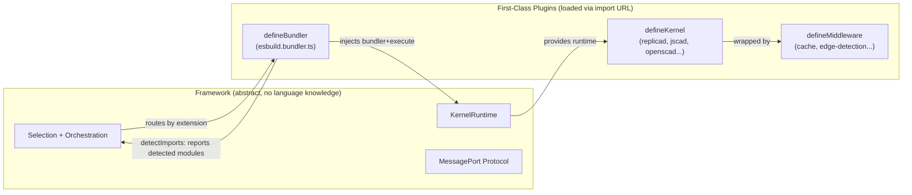
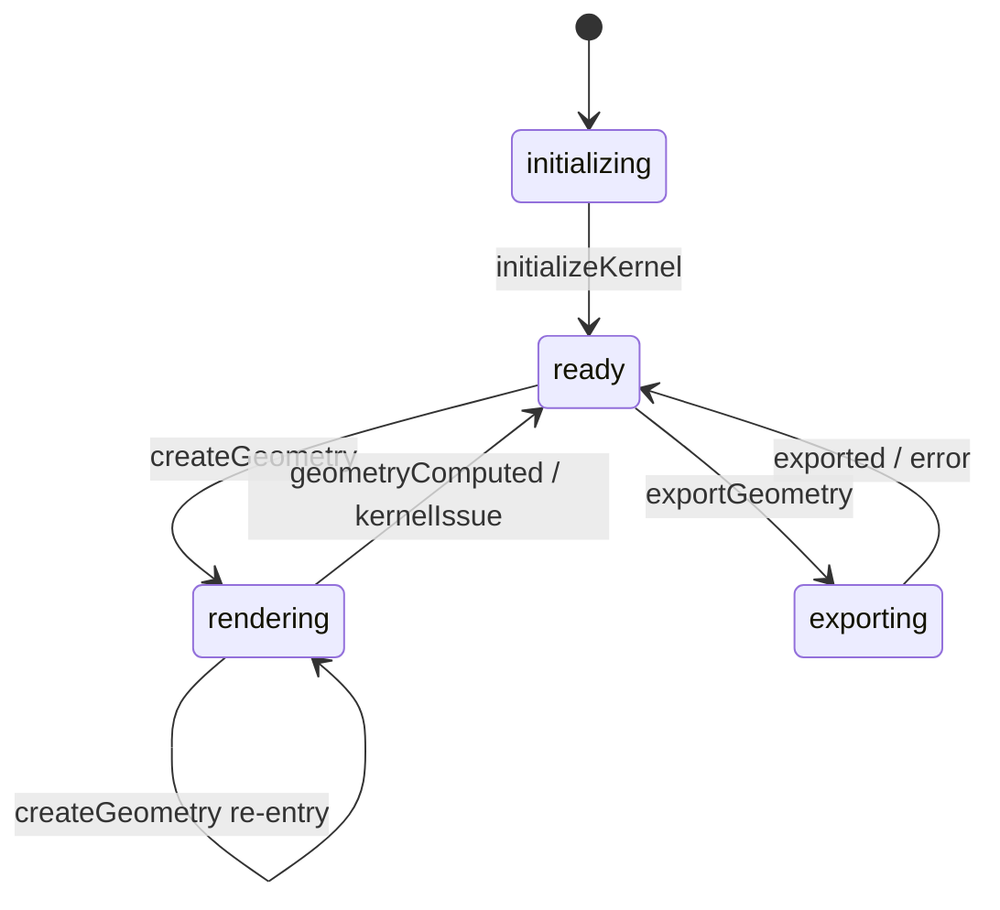

# Complete Kernel Architecture

## Problem Statement

The kernel framework embeds language-specific logic (esbuild bundler, JS dynamic import executor, CommonJS conventions, library-specific detection regexes) directly into its core. This prevents the framework from being a clean, abstract orchestrator and blocks high-performance rendering for multi-file assemblies where transitive imports are not detected. Additionally, the protocol lacks request correlation and cancellation, the kernel machine carries legacy multi-worker code, and caches are invalidated too aggressively.

This plan creates a capability-injected architecture where:

- `**defineKernel**` — geometry computation (existing)
- `**defineMiddleware**` — operation wrapping (existing)
- `**defineBundler**` — file bundling, execution, and module registry (NEW)

All non-generic capabilities (bundling, code execution, module registry) are provided by injectable plugins, not hardcoded in the framework.




---

## Phase 1: First-Class Capability Contracts

**Goal**: Define all type contracts before any implementation changes. This phase is types-only.

### 1A. `BundlerDefinition` and `defineBundler` API

New types in [runtime-kernel.types.ts](libs/types/src/types/runtime-kernel.types.ts):

```typescript
export type BundlerInitOptions = {
  filesystem: RuntimeFileSystem;
  projectPath: string;
};

export type BundleInput = {
  entryPath: string;
};

/**
 * Result of detectImports() — a lightweight pass that discovers which
 * external modules are imported transitively without resolving them.
 */
export type DetectImportsResult = {
  /** Bare specifiers imported transitively (e.g., 'replicad', '@jscad/modeling') */
  detectedModules: string[];
  /** Project file dependencies discovered during detection (reusable by getDependencies) */
  dependencies: string[];
};

export type BundlerDefinition<Ctx = unknown> = {
  name: string;
  version: string;

  initialize(options: BundlerInitOptions): Promise<Ctx>;

  /**
   * Detect which bare-specifier modules are imported transitively.
   * Resolves relative imports normally but marks bare specifiers as external.
   * Returns detected modules and project dependencies without producing runnable code.
   * This is the primary mechanism for kernel selection — no module stubs required.
   */
  detectImports(input: BundleInput, ctx: Ctx): Promise<DetectImportsResult>;

  /**
   * Produce runnable code with all registered modules resolved.
   * Called AFTER kernel selection and initialization (modules are registered).
   */
  bundle(input: BundleInput, ctx: Ctx): Promise<BundleResult>;

  /** Execute bundled code (tied to this bundler's output format). */
  execute(code: string, ctx: Ctx): Promise<ExecuteResult>;

  /** Register a builtin module for resolution during bundle(). */
  registerModule(name: string, module: BuiltinModuleEntry, ctx: Ctx): void;

  /**
   * Optional fast-path dependency resolution without full bundling.
   * Falls back to bundle().dependencies when not implemented.
   */
  resolveDependencies?(input: BundleInput, ctx: Ctx): Promise<string[]>;

  cleanup?(ctx: Ctx): Promise<void>;
};

export function defineBundler<Ctx>(
  def: BundlerDefinition<Ctx>,
): BundlerDefinition<Ctx> {
  return def;
}
```

**Design rationale**:

- The bundler owns bundling AND execution because the execution model is inherently tied to the bundler's output format (esbuild produces JS -> dynamic import runs it).
- `detectImports` and `bundle` are separate operations with different requirements. Detection needs to know *what* was imported (bare specifiers as externals). Production needs to *resolve* those imports into runnable code (modules must be registered). Separating them eliminates the chicken-and-egg problem that would otherwise require module stubs: detection runs without any modules registered, then the framework selects and initializes the kernel (which registers real modules), then `bundle()` produces runnable code.
- `resolveDependencies` is an optional fast-path for `getDependencies()`. When not implemented, the framework falls back to `(await bundle(entryPath)).dependencies`. The esbuild bundler can implement a lightweight pass (~5-10ms vs ~50-100ms for full bundle). Additionally, `detectImports` also returns `dependencies`, which the framework can cache and reuse for `getDependencies()` on the first render — making the detection pass double as a free dependency resolution.

### 1B. `BundlerConfig` type

New type in [kernel.types.ts](libs/types/src/types/runtime.types.ts), parallel to `KernelConfig` and `MiddlewareConfig`:

```typescript
export type BundlerEntry = {
  bundlerModuleUrl: string;
  extensions: string[];
};

export type BundlerConfig = BundlerEntry[];
```

### 1C. `BundleResult` (no changes)

`BundleResult` in [runtime-kernel.types.ts](libs/types/src/types/runtime-kernel.types.ts) stays as-is — `builtinImports` is NOT needed on `BundleResult` because kernel detection uses the dedicated `detectImports()` method. The `bundle()` method is only called after kernel selection, when modules are already registered.

### 1D. `builtinModuleNames` on `KernelWorkerEntry`

Extend in [kernel.types.ts](libs/types/src/types/runtime.types.ts):

```typescript
export type KernelWorkerEntry = {
  // ... existing fields
  builtinModuleNames?: string[];  // declares which builtin modules this kernel provides
};
```

### 1E. Request-scoped protocol types

Update [runtime-protocol.types.ts](libs/types/src/types/runtime-protocol.types.ts):

```typescript
export type RuntimeCommand =
  | { type: 'initialize'; requestId: string; /* ... existing fields */ }
  | { type: 'render'; requestId: string; file: GeometryFile; params: Record<string, unknown> }
  | { type: 'canHandle'; requestId: string; file: GeometryFile }
  | { type: 'export'; requestId: string; format: ExportFormat; meshConfig?: /* ... */ }
  | { type: 'cancel'; requestId: string }  // NEW: cancel in-flight operation
  | { type: 'fileChanged'; paths: string[] }  // fire-and-forget, no requestId
  | { type: 'configureMiddleware'; config: MiddlewareConfig }  // fire-and-forget
  | { type: 'cleanup' };

export type RuntimeResponse =
  | { type: 'initialized'; requestId: string }
  | { type: 'canHandleResult'; requestId: string; result: boolean }
  | { type: 'parametersResolved'; requestId: string; result: GetParametersResult }
  | { type: 'geometryComputed'; requestId: string; result: CreateGeometryResultCompleted }
  | { type: 'exported'; requestId: string; result: ExportGeometryResult }
  | { type: 'error'; requestId: string; issues: KernelIssue[] }
  | { type: 'progress'; requestId: string; phase: RenderPhase; detail?: Record<string, unknown> }
  | { type: 'log'; /* ... existing */ }
  | { type: 'logBatch'; /* ... existing */ }
  | { type: 'telemetry'; entries: PerformanceEntryData[] };
```

### 1F. Extensible `RenderPhase`

Change from a fixed union to a string type so bundler/kernel modules can emit custom phases:

```typescript
export type RenderPhase = string;
```

Framework-defined phases (`resolvingDeps`, `bundling`, `extractingParams`, `computingGeometry`, `postProcessing`) become conventions, not fixed protocol.

---

## Phase 2: `defineBundler` — Extract Esbuild as Plugin

**Goal**: Move all esbuild-specific, JS-specific, and execution-specific code out of the framework into a self-contained `defineBundler` module.

### 2A. Create `esbuild.bundler.ts`

New file: [esbuild.bundler.ts](apps/ui/app/components/geometry/kernel/bundlers/esbuild.bundler.ts)

This module:

- Imports and wraps the existing `EsbuildBundler` class
- Owns `executeCode()` (moved from `kernel-worker.ts`)
- Owns CommonJS auto-export names (`main`, `defaultParams`, `getParameterDefinitions`)
- Owns `globalThis.__KERNEL_MODULES__` banner generation
- Implements `detectImports` via esbuild externals mode (no module stubs needed)
- Exposes `registerModule()` for live module updates

```typescript
export default defineBundler({
  name: 'EsbuildBundler',
  version: '1.0.0',

  async initialize({ filesystem, projectPath }) {
    // Load esbuild-wasm, create EsbuildBundler instance
    // Return context with bundler instance, builtinModules map
  },

  async detectImports({ entryPath }, ctx) {
    // Run esbuild with a detection plugin that marks ALL bare specifiers
    // as external instead of resolving via builtinModules or CDN.
    // Relative imports are still resolved normally via zenfs.
    // ~20-40ms — cheaper than full bundle since no module resolution or codegen for externals.
    const result = await esbuild.build({
      entryPoints: [entryPath],
      bundle: true, write: false, metafile: true,
      plugins: [createDetectionPlugin({ filesystem: ctx.filesystem, projectPath: ctx.projectPath })],
      logLevel: 'silent',
    });

    // External imports appear in metafile.outputs[chunk].imports with external: true
    const detectedModules = new Set<string>();
    for (const output of Object.values(result.metafile!.outputs)) {
      for (const imp of output.imports) {
        if (imp.external) detectedModules.add(imp.path);
      }
    }

    return {
      detectedModules: [...detectedModules],
      dependencies: extractDependencies(result.metafile),
    };
  },

  async bundle({ entryPath }, ctx) {
    // Full production bundle — all registered modules are resolved
    return ctx.bundler.bundle(entryPath);
  },

  async execute(code, ctx) {
    // Moved from kernel-worker.ts executeCode()
    // Blob URL (browser) or data URL (Node.js) dynamic import
  },

  registerModule(name, module, ctx) {
    ctx.builtinModules.set(name, module);
    ctx.bundler.registerModule(name, module);
  },

  async resolveDependencies({ entryPath }, ctx) {
    // Fast-path: run esbuild with metafile:true but skip codegen
    // Returns only the dependency list (~5-10ms vs ~50-100ms for full bundle)
    const result = await ctx.bundler.bundle(entryPath);
    return result.dependencies;
  },
});
```

### 2B. Detection plugin

The detection plugin is a simplified version of the production zenfs plugin. The key difference: bare specifiers are marked as `external` instead of being resolved via `builtinModules` or CDN. This means esbuild reports what was imported without needing modules registered:

```typescript
// Detection-only onResolve handler
build.onResolve({ filter: /.*/ }, (args) => {
  if (isBareSpecifier(args.path)) {
    return { path: args.path, external: true };  // report but don't resolve
  }
  return resolveRelativePath(args);  // resolve local imports normally via zenfs
});
```

No `builtinModules` map, no CDN fetching, no banner injection — just import tree walking with bare specifier recording.

### 2C. URL import for config

In [kernel.constants.ts](apps/ui/app/constants/kernel.constants.ts):

```typescript
import esbuildBundlerUrl from '#components/geometry/kernel/bundlers/esbuild.bundler.js?url';

export const defaultBundlerConfig: BundlerConfig = [
  { bundlerModuleUrl: esbuildBundlerUrl, extensions: ['ts', 'js', 'tsx', 'jsx'] },
];
```

And add `builtinModuleNames` to kernel entries:

```typescript
{ id: 'replicad', builtinModuleNames: ['replicad'], /* ... */ },
{ id: 'jscad', builtinModuleNames: ['@jscad/modeling'], /* ... */ },
```

---

## Phase 3: Framework Decoupling

**Goal**: Remove all bundler/executor/language-specific code from [kernel-worker.ts](apps/ui/app/components/geometry/kernel/utils/kernel-worker.ts) and inject capabilities from the loaded bundler module.

### 3A. Remove from `KernelWorker` base class

Delete these methods and fields:

- `ensureBundler()` (~20 lines) — hardcoded `EsbuildBundler` import and instantiation
- `createBundlerFacade()` (~35 lines) — wraps esbuild as `KernelBundler`
- `executeCode()` (~45 lines) — Blob URL / data URL JS execution
- `getAutoExportNames()` (~3 lines) — `['main', 'defaultParams', 'getParameterDefinitions']`
- `getBuiltinModules()` (~3 lines) — returns `pendingBuiltinModules`
- `pendingBuiltinModules` field
- `_bundler` field
- `cachedBundlerFacade` field
- Import of `EsbuildBundler` type

### 3B. Add bundler loading to framework

The framework loads the bundler module via `import(url)`, same pattern as kernel/middleware loading. In `KernelWorker`:

```typescript
private loadedBundler?: { definition: BundlerDefinition; ctx: unknown };

private async ensureLoadedBundler(bundlerConfig: BundlerEntry): Promise<void> {
  if (this.loadedBundler) return;
  const mod = await import(/* @vite-ignore */ bundlerConfig.bundlerModuleUrl);
  const definition = mod.default as BundlerDefinition;
  const ctx = await definition.initialize({
    filesystem: this.filesystem,
    projectPath: this.getProjectRootPath(),
  });
  this.loadedBundler = { definition, ctx };
}
```

### 3C. Inject bundler/executor into `KernelRuntime`

`createRuntime()` builds `KernelRuntime` using the loaded bundler:

```typescript
private createRuntime(): KernelRuntime {
  return {
    filesystem: this.filesystem,
    logger: this.logger,
    tracer: this.tracer,
    fileContentCache: this.fileContentCache,
    bundler: this.createBundlerFacade(),  // delegates to loadedBundler
    execute: (code) => this.loadedBundler!.definition.execute(code, this.loadedBundler!.ctx),
  };
}
```

The `KernelBundler` facade wraps the loaded bundler's methods with caching and progress emission, just as it does today — but the implementation comes from the plugin, not hardcoded esbuild.

The facade's `resolveDependencies` delegates to the bundler's fast-path when available:

```typescript
resolveDependencies: async (entryPath: string): Promise<string[]> => {
  const { definition, ctx } = this.loadedBundler!;
  if (definition.resolveDependencies) {
    return definition.resolveDependencies({ entryPath }, ctx);
  }
  const result = await this.bundlerFacade.bundle(entryPath);
  return result.dependencies;
},
```

### 3D. Framework-level configuration validation

During worker initialization, validate that bundler/kernel configs are consistent:

- If any `KernelWorkerEntry` in the config has `builtinModuleNames` set, verify that a `BundlerConfig` entry exists whose `extensions` overlap with that kernel's `extensions`. If not, throw a clear error: `"Kernel 'replicad' declares builtinModuleNames but no bundler is configured for extensions [ts, js]"`.
- This catches misconfiguration at init time rather than failing silently at detection time.

### 3E. Thread `BundlerConfig` through the stack

- [kernel.constants.ts](apps/ui/app/constants/kernel.constants.ts): export `defaultBundlerConfig`
- [cad.machine.ts](apps/ui/app/machines/cad.machine.ts): accept `bundlerConfig` in input, forward to kernel machine
- [kernel.machine.ts](apps/ui/app/machines/kernel.machine.ts): accept `bundlerConfig`, pass to `ensureRuntimeWorkerClient()`
- [kernel-runtime-worker.ts](apps/ui/app/components/geometry/kernel/kernel-runtime-worker.ts): receive in options, pass to base class
- Worker `initialize` command: include `bundlerConfig`

---

## Phase 4: Bundle-Based Kernel Detection

**Goal**: Fix "No kernel can handle file" for multi-file assemblies using the new `defineBundler` architecture. The framework remains fully abstract — no JS/TS knowledge.

### 4A. Framework-level detection orchestration

In [kernel-runtime-worker.ts](apps/ui/app/components/geometry/kernel/kernel-runtime-worker.ts), `selectKernel()` becomes:

1. **Check selection cache** — hit? return immediately
2. **Pass 1: extension + regex** — try each kernel config's `detectImport` regex against the entry file (existing fast path)
3. **Pass 2: bundler-assisted detection** — if no kernel matched AND a bundler handles this extension:
  - Call `bundler.detectImports(entryPath)` — no modules need to be registered, no stubs
  - Returns `{ detectedModules: ['replicad', ...], dependencies: [...] }`
  - Match `detectedModules` against each kernel config's `builtinModuleNames`
  - Select the **highest-priority** matching kernel for geometry computation
  - Cache the `dependencies` from detection for reuse by `getDependencies()` (zero additional work)
4. **Pass 3: catch-all fallback** — try any `extensions: ['*']` config

The framework has ZERO language-specific knowledge. It just matches data: "bundler reports module X was imported" vs "kernel Y declares it provides module X." No stubs, no chicken-and-egg — `detectImports` runs without modules registered because it marks bare specifiers as external.

### 4A-ii. Multi-module registration

When detection finds `detectedModules` matching **multiple** kernel configs (e.g., both `replicad` and `@jscad/modeling`), the framework:

1. **Selects** the highest-priority kernel for geometry computation (the first match in config order)
2. **Initializes ALL matching kernels** so their `initialize()` calls `runtime.bundler.registerModule()` with real module code

This ensures that all detected library modules are available at `bundle()` time, even if only one kernel handles geometry conversion. For example, a file that uses `@jscad/modeling/primitives` for helper geometry and `replicad` for the main shape will have both module sets registered, but replicad handles the `createGeometry()` call.

This is the pragmatic short-term approach. A full composite kernel with return-type inspection is deferred to a future phase.

### 4B. Detection-to-render lifecycle (no stubs)

The clean lifecycle, enabled by separating `detectImports` from `bundle`:

```
detectImports(entry)        → discovers ['replicad'] + project deps (no modules needed)
  ↓
selectKernel('replicad')    → matches detectedModules against kernel builtinModuleNames
  ↓
initializeKernels(matching) → kernel.initialize() registers REAL modules via registerModule()
  ↓
getDependencies(entry)      → reuses deps cached from detectImports (zero cost)
  ↓
bundle(entry)               → full production bundle with real modules registered
  ↓
execute(code)               → run the bundled code
```

No stubs, no stub-to-real replacement, no cache invalidation dance. Detection and production are cleanly separated operations on the bundler interface.

### 4C. Selection cache invalidation

Override `notifyFileChanged` in `KernelRuntimeWorker` to also clear `selectionCache`, since changed imports may shift which kernel handles the file.

### 4D. Full-path cache keys

Use the full project-relative file path as the selection cache key (not just the basename), preventing collisions for files with the same name in different directories.

---

## Phase 5: Request-Scoped Protocol

**Goal**: Add request correlation, cancellation, and per-request telemetry to the MessagePort protocol for correct behavior under rapid edits.

### 5A. Request ID generation

In [runtime-worker-client.ts](apps/ui/app/components/geometry/kernel/utils/runtime-worker-client.ts):

```typescript
private nextRequestId = 0;
private generateRequestId(): string {
  return String(this.nextRequestId++);
}
```

### 5B. Per-request pending tracking

Replace single pending slots with a `Map`:

```typescript
private pendingRequests = new Map<string, PendingRequest>();

type PendingRequest = {
  type: 'init' | 'canHandle' | 'render' | 'export';
  resolve: (result: unknown) => void;
  reject: (error: Error) => void;
  onParametersResolved?: (result: GetParametersResult) => void;
  onProgress?: OnProgressCallback;
};
```

`handleMessage` routes responses by `requestId` to the correct pending request.

### 5C. Cancel command

When a new `render()` call is made while a previous one is in flight:

1. Client sends `{ type: 'cancel', requestId: previousId }` to the worker
2. Client rejects the previous pending promise
3. Worker checks cancellation at async boundaries (between pipeline phases)

### 5D. Dispatcher cancellation support

In [runtime-worker-dispatcher.ts](apps/ui/app/components/geometry/kernel/utils/runtime-worker-dispatcher.ts):

- Maintain a `Set<string>` of cancelled request IDs
- On `cancel` command, add the ID to the set
- Check the set between pipeline phases in `renderEntry`; if cancelled, stop processing early

### 5E. Request-tagged telemetry

Include `requestId` in the telemetry span detail so the kernel panel can correlate spans to specific renders:

```typescript
const detail = {
  spanId: id,
  parentSpanId: parentId,
  requestId: currentRequestId,  // NEW
  ...attributes,
};
```

---

## Phase 6: Kernel Machine Simplification

**Goal**: Remove all legacy multi-worker routing from [kernel.machine.ts](apps/ui/app/machines/kernel.machine.ts).

### 6A. Delete legacy actors

- `determineWorkerActor` (lines 26-64)
- `createWorkersActor` (lines 127-181)

### 6B. Remove legacy context fields

From `KernelContext`:

- `workerClients: Map<string, RuntimeWorkerClient>` — remove
- `workerSelectionCache: Map<string, string>` — remove
- `selectedWorker?: string` — remove

Keep only `runtimeWorkerClient`, `kernelConfig`, `middlewareConfig`, `bundlerConfig`.

### 6C. Simplify state machine

Remove `creatingWorkers` and `determiningWorker` states:




The `renderActor` calls `ensureRuntimeWorkerClient()` (lazy creation), then `client.canHandle()` + `client.render()`. If `canHandle` returns false, emit `kernelIssue` immediately.

### 6D. Update actions

- `destroyWorkers`: only clean up `runtimeWorkerClient`
- `configureMiddleware`: use `context.runtimeWorkerClient?.configureMiddleware()` directly

---

## Phase 7: Cache and Runtime Fixes

**Goal**: Eliminate unnecessary work on the hot path.

### 7A. Guard `setBasePath` against redundant invalidation

In [kernel-worker.ts](apps/ui/app/components/geometry/kernel/utils/kernel-worker.ts), `renderEntry()` calls `setBasePath()` which clears `cachedRuntime` and `cachedProjectRoot` even when unchanged:

```typescript
private setBasePath(file: GeometryFile): void {
  if (this.basePath === file.path && this.activeFilePath === file.filename) return;
  // ... existing invalidation ...
}
```

### 7B. Dependency-aware bundle cache invalidation

Currently `renderEntry()` clears `bundleResultCache` on every render. Change to only clear entries whose dependencies include a changed file, using the information from `notifyFileChanged`:

```typescript
public async notifyFileChanged(changedPaths: string[]): Promise<void> {
  // ... existing hash/content cache invalidation ...
  // Only clear bundle cache entries whose dependencies overlap with changedPaths
  for (const [entryPath, result] of this.bundleResultCache) {
    if (result.dependencies.some(dep => changedPaths.includes(dep))) {
      this.bundleResultCache.delete(entryPath);
    }
  }
}
```

And remove the blanket `this.bundleResultCache.clear()` from `renderEntry()`.

---

## Phase 8: Documentation and CI

### 8A. Update architecture policy

Rewrite [docs/policy/runtime-architecture-policy.md](docs/policy/runtime-architecture-policy.md) to reflect:

- Single worker per CU with `defineKernel` API
- `defineBundler` plugin model (no hardcoded esbuild)
- MessagePort protocol with request IDs and cancellation
- Bundle-based transitive kernel detection
- Three-pillar plugin model: `defineKernel`, `defineMiddleware`, `defineBundler`

### 8B. Run CI and fix failures

Run `pnpm nx run-many -t typecheck,test,lint` and fix all failures, including updating existing tests to work with the new bundler injection pattern.
