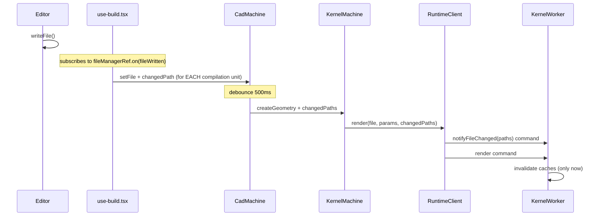
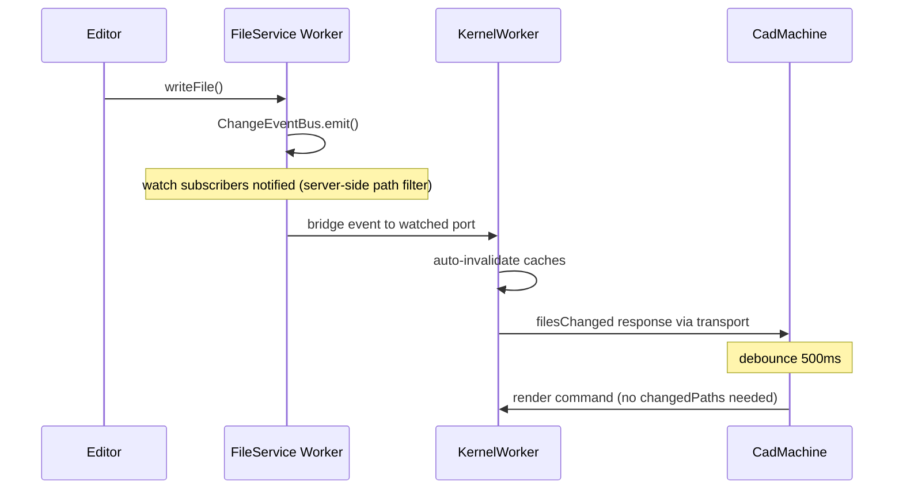
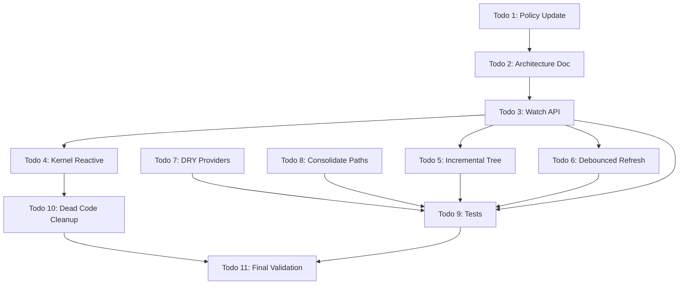

# Filesystem 100% Overhaul

## Core Insight

ZenFS has a built-in watcher system: every VFS mutation (`writeFile`, `rename`, `unlink`, etc.) calls `emitChange()` which fires registered `FSWatcher` instances. Our `ChangeEventBus` already captures these mutations at the `FileService` level. By exposing a first-class `watch(paths, handler)` method on `FileService` and bridging it over `MessagePort`, kernel workers can directly watch their dependency graph and react to changes -- no main thread relay needed.

This is the Vite pattern adapted for browser-based CAD: **file watcher + dependency graph + selective invalidation + push-based re-render**.

| Concept | Vite | Tau (target) |
|---------|------|-------------|
| File watcher | chokidar (OS-level) | `FileService.watch()` (VFS-level via ChangeEventBus) |
| Dependency graph | Module graph (import analysis) | Bundle deps (esbuild metafile) + kernel resolvers (OpenSCAD use/include, KCL imports) |
| Selective invalidation | `moduleGraph.invalidateModule()` | `bundleResultCache.delete()`, `fileHashCache.delete()` |
| Rebuild trigger | HMR update to browser | `filesChanged` response to CadMachine |
| Debounce | HMR batching | CadMachine 500ms `bufferingFile` state |

---

## Architecture: Watch-Based Kernel Integration

### Current: 6-hop command relay



### Target: Direct watch (1-hop push)



The runtime worker is **directly wired to the filesystem**. No main thread involvement in the change detection path.

---

## Kernel Dependency Graphs (from exploration)

Each kernel already knows its dependencies. The watch set is derived from these:

| Kernel | Resolution method | Watch target |
|--------|------------------|--------------|
| Replicad, JSCAD, Manifold, OpenCascade | esbuild metafile `inputs` | `bundleResult.dependencies` (all `zenfs:` inputs) |
| OpenSCAD | `use`/`include` regex parsing | `getReferencedScadFiles()` result paths |
| KCL/Zoo | KCL AST import resolution | `discoverKclDependencies()` result paths |
| Tau (converter) | Main file + siblings | `[filePath]` + `readdir(directory)` entries |

After each render, the runtime worker knows exactly which files it depends on. It watches those paths. When a watched file changes, caches are invalidated and the main thread is notified to trigger a re-render.

---

## Todo 1: Update Filesystem Policy

Update [`docs/policy/filesystem-policy.md`](docs/policy/filesystem-policy.md) with new watcher rules:

### Rule 18: First-class watch API

Provide `watch(paths, handler)` on `FileService` and expose it over the filesystem bridge. Watchers are server-side filtered -- only events matching watched paths are forwarded to the subscribing port. This eliminates client-side event filtering overhead.

```typescript
// CORRECT: Watch specific dependency paths
const unwatch = proxy.watch(dependencies, (event) => {
  invalidateCache(event.path);
});

// INCORRECT: Listen to all events and filter client-side
proxy.listen('changeEvent', (event) => {
  if (myDeps.includes(event.path)) { ... } // Wasteful for large dep sets
});
```

### Rule 19: Dependency-driven watching

Kernel workers must watch only the files they depend on (entry file + resolved imports). The watch set must be updated after each render when the dependency graph changes (new imports added, old ones removed).

### Rule 20: Watch lifecycle management

Watch subscriptions must be cleaned up on:
- Kernel worker disposal (port disconnect)
- Backend reconfiguration (all watches cleared)
- Watch set update (old subscription replaced with new one)

Following library-api-policy Section 17: `watch()` returns `() => void` unsubscribe function; use `toDisposable()` at storage sites.

### Rule 21: Watch vs poll

| Source | Mechanism | Use case |
|--------|-----------|----------|
| In-app writes (FileService) | `watch()` via ChangeEventBus | Primary: all mutation-driven updates |
| External changes (webaccess) | `fileWatcherActor` polling | WebAccess backend only: OS-level edits |
| Future: native browser | `FileSystemObserver` API | Chrome 133+: replaces polling for webaccess |

Document `FileSystemObserver` (Chrome 133+, Edge 133+) as the future replacement for `fileWatcherActor` polling on the `webaccess` backend. It provides push-based notifications for user-visible filesystem changes without polling.

---

## Todo 2: Architecture Document

Create [`docs/architecture/runtime-editor.md`](docs/architecture/runtime-editor.md) documenting:

1. **System overview**: Editor, filesystem worker, kernel workers as a reactive system
2. **Watch-based dependency graph**: How kernels discover deps, set watches, react to changes
3. **Event pipeline**: `FileService.watch()` -> ChangeEventBus -> bridge event -> runtime worker
4. **Kernel rendering lifecycle**: init -> first render -> resolve deps -> watch deps -> file change -> invalidate -> re-render -> update watch set
5. **Incremental tree model**: Per-directory cache, on-demand loading, push updates
6. **Compilation unit lifecycle**: How builds manage multiple entry files and their kernel workers
7. **Comparison to Vite HMR**: Architectural parallels and differences

---

## Todo 3: First-class Watch API

### 3a. `FileService.watch()` method

Add to [`file-service.ts`](apps/ui/app/filesystem/file-service.ts):

```typescript
/**
 * Watch specific file paths for changes.
 * Only events affecting watched paths are forwarded to the handler.
 *
 * @param paths - Absolute paths to watch
 * @param handler - Called when a watched file changes
 * @returns Unsubscribe function
 */
public watch(paths: string[], handler: (event: WatchEvent) => void): () => void {
  const pathSet = new Set(paths.map(normalizePath));

  return this._eventBus.subscribe((event) => {
    if (event.type === 'backendChanged') {
      handler({ type: 'reset' });
      return;
    }

    const affectedPaths: string[] = [];
    if (event.type === 'fileRenamed') {
      if (pathSet.has(normalizePath(event.oldPath))) affectedPaths.push(event.oldPath);
      if (pathSet.has(normalizePath(event.newPath))) affectedPaths.push(event.newPath);
    } else if ('path' in event && pathSet.has(normalizePath(event.path))) {
      affectedPaths.push(event.path);
    }

    for (const path of affectedPaths) {
      handler({ type: event.type === 'fileDeleted' ? 'delete' : 'change', path });
    }
  });
}
```

Add `WatchEvent` type to [`types.ts`](apps/ui/app/filesystem/types.ts):

```typescript
export type WatchEvent =
  | { type: 'change'; path: string }
  | { type: 'delete'; path: string }
  | { type: 'reset' };
```

### 3b. Bridge watch/unwatch protocol

Extend the wire schema in [`runtime-filesystem-bridge.ts`](packages/runtime/src/framework/runtime-filesystem-bridge.ts):

```typescript
type BridgeWatch = { type: 'watch'; watchId: string; paths: string[] };
type BridgeUnwatch = { type: 'unwatch'; watchId: string };
type BridgeWatchEvent = { type: 'event'; event: 'watch'; data: { watchId: string } & WatchEvent };
```

**Server side** ([`filesystem-bridge.ts`](packages/runtime/src/filesystem/filesystem-bridge.ts)):

In `exposeFileSystem`, when a `watch` message arrives on a port:
1. Call `fileService.watch(paths, handler)` (the handler is FileService's, not the port's)
2. The handler calls `serverHandle.emit('watch', { watchId, ...event })` to push to the port
3. Store the unsubscribe function keyed by `watchId`
4. On `unwatch`, call the stored unsubscribe
5. On port disconnect, unsubscribe all watches for that port

**Client side** (proxy):

Add `watch()` to the proxy returned by `createBridgeProxy`:

```typescript
async watch(paths: string[], handler: (event: WatchEvent) => void): Promise<() => void> {
  const watchId = crypto.randomUUID();
  await call('_watch', [watchId, paths]);  // RPC to register watch
  const unsub = listen('watch', (data: { watchId: string } & WatchEvent) => {
    if (data.watchId === watchId) handler(data);
  });
  return () => {
    unsub();
    void call('_unwatch', [watchId]);
  };
}
```

### 3c. Add `watch` to `RuntimeFileSystemBase`

Update [`runtime-kernel.types.ts`](packages/runtime/src/types/runtime-kernel.types.ts) to include `watch`:

```typescript
export type RuntimeFileSystemBase = {
  // ... existing 11 primitives ...

  /** Watch paths for changes. Returns unsubscribe function. */
  watch(paths: string[], handler: (event: WatchEvent) => void): Promise<() => void>;
};
```

Also add `watch` to `FileManagerProtocol` in [`file-manager.machine.types.ts`](apps/ui/app/machines/file-manager.machine.types.ts) for the main thread proxy.

---

## Todo 4: Kernel Reactive Rendering

### 4a. Kernel worker watches dependencies after render

In [`kernel-worker.ts`](packages/runtime/src/framework/kernel-worker.ts), after `render()` completes:

```typescript
// After render resolves dependencies, update the watch set
private async updateWatchSet(dependencies: string[]): Promise<void> {
  this._watchUnsubscribe?.();

  if (!this.fileSystem || dependencies.length === 0) return;

  this._watchUnsubscribe = await this.fileSystem.watch(dependencies, (event) => {
    if (event.type === 'reset') {
      this.clearAllCaches();
      this.onFilesChangedCallback?.([]);
      return;
    }

    // Invalidate caches for the changed file
    this.fileHashCache.delete(event.path);
    this.fileContentCache.delete(event.path);
    this.fileContentCache.delete(`utf8:${event.path}`);

    for (const [entryPath, result] of this.bundleResultCache) {
      if (result.dependencies.includes(event.path)) {
        this.bundleResultCache.delete(entryPath);
      }
    }

    this.onFileChanged([event.path]);
    this.onFilesChangedCallback?.([event.path]);
  });
}
```

Call `updateWatchSet()` after every successful render with the resolved dependency list:
- esbuild kernels: `bundleResult.dependencies`
- OpenSCAD: result of `getReferencedScadFiles()`
- KCL: result of `discoverKclDependencies()`
- Tau: `[filePath]` + sibling paths

### 4b. Kernel protocol: `filesChanged` response

Add to `RuntimeResponse` in [`runtime-protocol.types.ts`](packages/runtime/src/types/runtime-protocol.types.ts):

```typescript
| { type: 'filesChanged'; paths: string[] }
```

The `onFilesChangedCallback` is passed via `initialize()` input (following the `onLog` pattern). In [`runtime-worker-dispatcher.ts`](packages/runtime/src/framework/runtime-worker-dispatcher.ts):

```typescript
const onFilesChanged = (paths: string[]) => {
  respond({ type: 'filesChanged', paths });
};
```

### 4c. RuntimeClient and machine handling

In [`runtime-worker-client.ts`](packages/runtime/src/framework/runtime-worker-client.ts), handle `filesChanged`:

```typescript
case 'filesChanged':
  this.emit('filesChanged', response.paths);
  break;
```

In [`kernel.machine.ts`](apps/ui/app/machines/kernel.machine.ts), subscribe in `initKernelActor`:

```typescript
cleanups.push(
  client.on('filesChanged', (paths: string[]) => {
    if (context.parentRef) {
      context.parentRef.send({ type: 'kernelFilesChanged', paths });
    }
  }),
);
```

In [`cad.machine.ts`](apps/ui/app/machines/cad.machine.ts), handle `kernelFilesChanged` -- triggers the existing debounce:

```typescript
kernelFilesChanged: {
  target: 'bufferingFile',
},
```

### 4d. Remove the relay chain

- **Remove** `use-build.tsx` `useEffect` (lines 148-167) that forwards `fileWritten` to compilation units
- **Remove** `notifyFileChanged(changedPaths)` call in `kernel-client.ts` render path (lines 462-464) -- caches are now invalidated reactively by the watch handler
- **Remove** `changedPaths` from `createGeometry` event, `renderActor` input, and `CadMachine` context -- no longer needed for cache invalidation
- **Remove** `fileChanged` command type from `RuntimeCommand` (replaced by watch)

---

## Todo 5: Incremental Per-Directory Tree Cache

**No full directory scans for refreshes.** The tree cache is an incremental per-directory lookup. The main-thread `FileManagerMachine` uses it for the `fileTree` context.

### 5a. `readDirectory(path)` with cache read-through

Add to [`file-service.ts`](apps/ui/app/filesystem/file-service.ts). Checks `DirectoryTreeCache` first, falls back to provider on miss, populates cache.

### 5b. Incremental refresh on mutation

On write operations, after invalidating the parent directory cache entry: re-read only that parent directory from the provider, populate cache with `set()`, emit `directoryChanged` event.

### 5c. Machine-side incremental tree updates

The `FileManagerMachine` also uses `watch()` to watch the build's root directory. On `directoryChanged` events, it calls `proxy.readDirectory(changedPath)` and patches `fileTree` incrementally, instead of full recursive `getDirectoryStat('')`.

Startup hydration via `getDirectoryStat` is preserved for the initial load (builds are small). The watch-based approach handles all subsequent updates.

---

## Todo 6: Debounced Background Refresh

Replace dead `scheduleDebouncedRefresh` with XState v5 `raise(delay)` + `cancel` pattern:

```typescript
cancelPendingRefresh: cancel('debouncedRefresh'),
scheduleRefresh: raise({ type: 'pollFileSystem' }, { delay: debounceRefreshMs, id: 'debouncedRefresh' }),
```

Update all mutation transitions to use `cancelPendingRefresh` + `scheduleRefresh` instead of immediate `spawnBackgroundRefresh`.

---

## Todo 7: DRY Providers (library-api-policy compliant)

Following [`docs/policy/library-api-policy.md`](docs/policy/library-api-policy.md):

- `createZenFsProvider()` factory function returning opaque `FileSystemProvider`
- `Disposable` cleanup pattern
- JSDoc on all exports
- Self-contained under `apps/ui/app/filesystem/` for future extraction to `@taucad/filesystem`
- Create [`apps/ui/app/filesystem/providers/create-zenfs-provider.ts`](apps/ui/app/filesystem/providers/create-zenfs-provider.ts)
- Each provider becomes a thin factory wrapper

---

## Todo 8: Consolidate Path Utilities

Import `joinPath`, `normalizePath` from `#utils/path.utils.js`. Move `parentDirectory()` to `path.utils.ts`. Remove duplicates from `file-service.ts` and `directory-tree-cache.ts`.

---

## Todo 9: Tests

- **Watch API unit tests** (`file-service.test.ts`): `watch()` fires for matching paths, ignores non-matching, handles rename/delete/reset, unsubscribe works
- **Bridge watch integration tests** (`runtime-filesystem-bridge-events.test.ts`): Watch registration over MessagePort, event delivery, unwatch cleanup, disconnect cleanup
- **Kernel watch integration tests**: Worker subscribes to deps, cache invalidation on change, `filesChanged` response sent, watch set updated after re-render
- **Provider integration tests** (`memory-provider.test.ts`): Full CRUD lifecycle
- **FileService unit tests** (`file-service.test.ts`): `readDirectory` cache read-through, incremental invalidation
- **ProviderRegistry unit tests** (`provider-registry.test.ts`): Caching, switch, dispose
- **Debounce tests** (`file-manager.machine.test.ts`): 300ms coalescing, cancel+raise pattern

---

## Todo 10: Dead Code Cleanup

- Remove `scheduleDebouncedRefresh` assign action, `refreshTimer` from context
- Remove `toProviderStat` duplication (moved to factory)
- Remove `notifyFileChanged` from kernel render path
- Remove `changedPaths` tracking from `CadMachine` context
- Remove `use-build.tsx` `fileWritten` -> compilation unit forwarding `useEffect`
- Remove `fileChanged` command from `RuntimeCommand` type
- Clean up `eventCleanups: (() => void)[]` in kernel machine -> `DisposableStore` per library-api-policy

---

## Todo 11: Final Validation

- `pnpm nx test ui --watch=false`
- `pnpm nx test runtime --watch=false`
- `pnpm nx lint ui`
- `pnpm nx lint runtime`
- `pnpm nx typecheck ui`
- `pnpm nx typecheck runtime`

---

## Dependency Graph



---

## Research Notes

### ZenFS Watch Internals

ZenFS's `emitChange(context, eventType, filename)` (in `vfs/watchers.js`) is called on every VFS mutation:
- `writeFile` -> `emitChange(this, 'change', path)`
- `rename` -> `emitChange(this, 'rename', oldPath)` + `emitChange(this, 'change', newPath)`
- `unlink` -> `emitChange(this, 'rename', path)`
- `mkdir`/`rmdir` -> `emitChange(this, 'rename', path)`

The `emitChange` function walks up the directory tree from the changed file to `/`, notifying registered `FSWatcher` instances at each level. This means a watcher on `/builds/123/` would fire for changes to `/builds/123/main.ts`.

Our `FileService.watch()` uses `ChangeEventBus` (which fires after the full FileService operation completes, including cache invalidation) rather than ZenFS watchers directly, because:
1. Richer event data (includes `backend`, full path, event type with `fileWritten`/`fileDeleted`/`fileRenamed` semantics)
2. Fires after the operation is fully committed (not during)
3. Consistent across all backends

### Browser FileSystemObserver API

Chrome 133+ / Edge 133+ support `FileSystemObserver` for push-based change notifications on the user-visible filesystem. This is the future replacement for our `fileWatcherActor` polling (webaccess backend only). Not yet supported in Firefox/Safari.

Change record types: `appeared`, `disappeared`, `modified`, `moved`, `errored`, `unknown`.

### Vite Module Graph Pattern

Vite maintains a `ModuleGraph` that maps files to their dependents. On file change:
1. Chokidar fires change event
2. Vite looks up the file in `fileToModulesMap`
3. Calls `moduleGraph.invalidateModule()` for affected modules (supports soft invalidation for static imports)
4. Sends HMR update to browser with affected module boundaries

Our pattern mirrors this:
1. `FileService.watch()` fires for watched paths (replaces chokidar)
2. Kernel worker checks dependency graph (bundle cache, dependency list)
3. Invalidates affected caches (file hash, content, bundle result)
4. Sends `filesChanged` to main thread (replaces HMR update)
