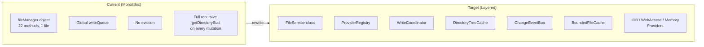
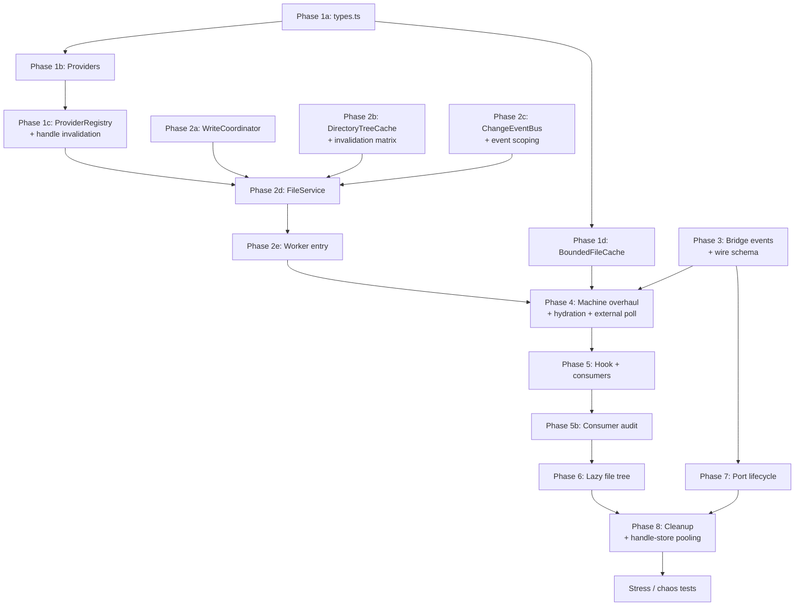

# Filesystem Architecture Overhaul

## Current vs Target




## Files to Create (New)

All new filesystem files live under `apps/ui/app/filesystem/`:

- `types.ts` — `FileSystemProvider`, `ProviderCapabilities`, `FileStat`, `ChangeEvent` types
- `providers/indexeddb-provider.ts` — IndexedDB via ZenFS
- `providers/webaccess-provider.ts` — File System Access API via ZenFS
- `providers/memory-provider.ts` — In-memory via ZenFS
- `provider-registry.ts` — Creates, caches, and routes to providers
- `file-service.ts` — Orchestration class (replaces `fileManager` object)
- `write-coordinator.ts` — Serialization queue (extracted + improved from `file-manager.ts`)
- `directory-tree-cache.ts` — In-memory tree with incremental invalidation
- `change-event-bus.ts` — Notifies connected ports of file changes
- `bounded-file-cache.ts` — LRU cache with max entries + max bytes

Test files alongside each:

- `providers/indexeddb-provider.test.ts`
- `providers/webaccess-provider.test.ts`
- `providers/memory-provider.test.ts`
- `provider-registry.test.ts`
- `file-service.test.ts`
- `write-coordinator.test.ts`
- `directory-tree-cache.test.ts`
- `change-event-bus.test.ts`
- `bounded-file-cache.test.ts`

## Files to Rewrite (Existing)

- `apps/ui/app/machines/file-manager.ts` — Replace monolithic object with `FileService` instantiation
- `apps/ui/app/machines/file-manager.worker.ts` — Update to use `FileService`
- `apps/ui/app/machines/file-manager.machine.ts` — Debounced refresh, BoundedFileCache, tree event subscription
- `apps/ui/app/machines/file-manager.machine.types.ts` — Add `readShallowDirectory`, update protocol
- `apps/ui/app/hooks/use-file-manager.tsx` — Expose `readShallowDirectory`, remove `readBackendFileTree`
- `apps/ui/app/routes/files/route.tsx` — Lazy loading with VS Code patterns
- `apps/ui/app/components/magicui/file-tree.tsx` — Add `onExpand` callback
- `apps/ui/app/filesystem/zenfs-config.ts` — Simplify; backend-specific logic moves to providers

## Files to Update (Consumer Migration)

- `apps/ui/app/lib/monaco-model-service.ts` — Subscribe to `treeChanged` events instead of calling `getDirectoryStat`
- `apps/ui/app/hooks/use-monaco-model-service.tsx` — Pass new tree subscription
- `apps/ui/app/hooks/rpc-handlers.ts` — Update `readdir`/`exists` to use hook instead of `fileTree` context
- All `useSelector` consumers of `fileTree` and `openFiles` — update selectors for new context shape

---

## Phase 1: Foundation — Provider Abstraction + Utilities

### 1a. Define `FileSystemProvider` interface

**File:** `apps/ui/app/filesystem/types.ts`

```typescript
type ProviderCapabilities = {
  readonly persistent: boolean;
  readonly writable: boolean;
  readonly quotaBased: boolean;
};

type FileStat = {
  readonly size: number;
  readonly mtimeMs: number;
  readonly isDirectory: boolean;
  readonly isFile: boolean;
};

type FileSystemProvider = {
  readonly id: string;
  readonly capabilities: ProviderCapabilities;
  readFile(path: string): Promise<Uint8Array>;
  readFile(path: string, encoding: 'utf8'): Promise<string>;
  writeFile(path: string, data: Uint8Array | string): Promise<void>;
  readdir(path: string): Promise<string[]>;
  stat(path: string): Promise<FileStat>;
  mkdir(path: string, options?: { recursive?: boolean }): Promise<void>;
  unlink(path: string): Promise<void>;
  rmdir(path: string): Promise<void>;
  rename(from: string, to: string): Promise<void>;
  exists(path: string): Promise<boolean>;
  lstat(path: string): Promise<FileStat>;
  dispose(): void;
};
```

Also define `ChangeEvent`, `FileTreeNode` (move from `file-manager.ts`), and `FileSystemBackend` (move from current location).

### 1b. Implement providers

Each provider wraps ZenFS with a specific backend. The ZenFS `configure()` call moves inside the provider constructor/`create()` factory.

`**providers/indexeddb-provider.ts`:**

- Factory: `createIndexedDBProvider(databasePrefix: string): Promise<FileSystemProvider>`
- Calls `resolveMountConfig({ backend: IndexedDB, storeName })` internally
- Implements all methods via ZenFS `fs.promises`
- Also supports creating standalone read-only instances for the files route

`**providers/webaccess-provider.ts`:**

- Factory: `createWebAccessProvider(handle: FileSystemDirectoryHandle): Promise<FileSystemProvider>`
- Wraps ZenFS `WebAccess` backend

`**providers/memory-provider.ts`:**

- Factory: `createMemoryProvider(): Promise<FileSystemProvider>`
- Wraps ZenFS `InMemory` backend
- Used for tests and ephemeral previews

### 1c. ProviderRegistry

**File:** `apps/ui/app/filesystem/provider-registry.ts`

```typescript
class ProviderRegistry {
  private readonly providers = new Map<string, FileSystemProvider>();
  private readonly standaloneProviders = new Map<string, FileSystemProvider>();

  async getProvider(backend: FileSystemBackend): Promise<FileSystemProvider>;
  async getStandaloneProvider(backend: FileSystemBackend): Promise<FileSystemProvider>;
  async switchActiveProvider(backend: FileSystemBackend, handle?: FileSystemDirectoryHandle): Promise<void>;
  disposeAll(): void;
}
```

- Caches provider instances per backend (fixes Known Issue #5: standalone FS created per call)
- `getStandaloneProvider` returns cached read-only instances for the files route
- `switchActiveProvider` replaces `reconfigureFileSystem`
- **Handle invalidation**: Standalone WebAccess provider cache must be invalidated when the `FileSystemDirectoryHandle` changes (user picks a new directory) or permission is re-granted. Cache key should incorporate handle identity (e.g., `${backend}:${handle.name}`) so a handle swap produces a cache miss rather than returning a stale provider.
- `invalidateStandaloneProvider(backend)` method — called by `switchActiveProvider` and `setDirectoryHandle`

### 1d. BoundedFileCache

**File:** `apps/ui/app/filesystem/bounded-file-cache.ts`

```typescript
class BoundedFileCache {
  constructor(options: { maxEntries: number; maxTotalBytes: number; maxSingleFileBytes: number });
  get(path: string): Uint8Array | undefined;
  set(path: string, data: Uint8Array): void;
  delete(path: string): void;
  rename(oldPath: string, newPath: string): void;
  has(path: string): boolean;
  clear(): void;
  readonly size: number;
  readonly totalBytes: number;
  entries(): IterableIterator<[string, Uint8Array]>;
}
```

- LRU eviction when `maxEntries` or `maxTotalBytes` exceeded
- Files > `maxSingleFileBytes` (1 MB) are not cached (skip large binaries)
- Replaces unbounded `openFiles: Map<string, Uint8Array>` in XState context (fixes Known Issue #2)

---

## Phase 2: Core — FileService + WriteCoordinator + DirectoryTreeCache

### 2a. WriteCoordinator

**File:** `apps/ui/app/filesystem/write-coordinator.ts`

Extracted from the current global `writeQueue` + `serialized()` in [file-manager.ts](apps/ui/app/machines/file-manager.ts) (lines 37-66).

```typescript
class WriteCoordinator {
  async serialized<T>(operation: () => Promise<T>): Promise<T>;
  readonly depth: number;
}
```

- Same global serialization for now (ZenFS TOCTOU still open)
- Clean extraction makes future per-directory queues a drop-in replacement
- Removes dead `serializedQueueDepth` counter (Known Issue #10)

### 2b. DirectoryTreeCache

**File:** `apps/ui/app/filesystem/directory-tree-cache.ts`

```typescript
type TreeEntry = { name: string; type: 'file' | 'directory'; size: number; mtimeMs: number };

class DirectoryTreeCache {
  get(path: string): Map<string, TreeEntry> | undefined;
  set(path: string, entries: Map<string, TreeEntry>): void;
  invalidate(path: string): void;
  invalidateSubtree(path: string): void;
  getFullTree(): Map<string, TreeEntry>;
  clear(): void;
}
```

- In-memory cache of directory listings (names + types + sizes + mtimes)
- `invalidate(parentPath)` clears a single directory — called after writes
- `invalidateSubtree` clears a directory and all descendants — called after rename/rmdir
- Replaces polling-based `getDirectoryStat` (fixes Known Issue #1, #6)

**Canonical invalidation matrix** (must be documented in code and tested):

- `writeFile(path)` — invalidate parent directory of `path`; update/add entry in file cache
- `mkdir(path)` — invalidate parent directory of `path`
- `rename(from, to)` — invalidate parent of `from` AND parent of `to`; if directories differ, both parents invalidated; `invalidateSubtree(from)` to clear cached children; update file cache keys (prefix rename)
- `unlink(path)` — invalidate parent directory of `path`; delete from file cache
- `rmdir(path)` — `invalidateSubtree(path)`; invalidate parent directory; delete all file cache entries under `path/`
- `reconfigure(backend)` — `clear()` entire tree cache AND entire file cache (backend switch = full reset)
- `writeFiles(files)` — collect unique parent directories, invalidate each once (deduplicated)
- `copyDirectory(src, dest)` — invalidate parent of `dest`; `invalidateSubtree(dest)` to clear any stale entries

### 2c. ChangeEventBus

**File:** `apps/ui/app/filesystem/change-event-bus.ts`

```typescript
type ChangeEvent =
  | { type: 'fileWritten'; path: string; backend: FileSystemBackend }
  | { type: 'fileDeleted'; path: string; backend: FileSystemBackend }
  | { type: 'fileRenamed'; oldPath: string; newPath: string; backend: FileSystemBackend }
  | { type: 'directoryChanged'; path: string; backend: FileSystemBackend };

class ChangeEventBus {
  subscribe(port: MessagePort, handler: (event: ChangeEvent) => void): () => void;
  emit(event: ChangeEvent): void;
  dispose(): void;
}
```

- Emits change events to all connected ports
- Main thread subscribes to get tree change notifications (fixes Known Issue #7 by enabling push-based updates)
- Replaces the need for explicit `spawnBackgroundRefresh` after every mutation
- **Event scoping**: All events include `path` (absolute) and `backend`. The machine-side listener filters events by `rootDirectory` prefix — a machine scoped to `/projects/abc` ignores events for `/projects/xyz`. This prevents cross-build tree churn when a shared worker serves multiple `FileManagerProvider` instances.
- Edge case: `reconfigure` emits a special `{ type: 'backendChanged'; backend }` event so all listeners know to full-reset their tree state

### 2d. FileService

**File:** `apps/ui/app/filesystem/file-service.ts`

The central orchestration class. Replaces the monolithic `fileManager` object in [file-manager.ts](apps/ui/app/machines/file-manager.ts).

```typescript
class FileService {
  constructor(options: {
    providerRegistry: ProviderRegistry;
    writeCoordinator: WriteCoordinator;
    treeCache: DirectoryTreeCache;
    eventBus: ChangeEventBus;
  });

  // Read operations (direct to provider, no serialization)
  readFile(path: string): Promise<Uint8Array>;
  readFile(path: string, encoding: 'utf8'): Promise<string>;
  readFiles(paths: string[]): Promise<Record<string, Uint8Array>>;
  readdir(path: string): Promise<string[]>;
  stat(path: string): Promise<FileStat>;
  lstat(path: string): Promise<FileStat>;
  exists(path: string): Promise<boolean>;
  batchExists(paths: string[]): Promise<Record<string, boolean>>;

  // Write operations (serialized via WriteCoordinator)
  writeFile(path: string, data: Uint8Array | string): Promise<void>;
  writeFiles(files: Record<string, { content: Uint8Array | string }>): Promise<void>;
  mkdir(path: string, options?: { recursive?: boolean }): Promise<void>;
  rename(from: string, to: string): Promise<void>;
  unlink(path: string): Promise<void>;
  rmdir(path: string): Promise<void>;

  // Higher-level operations
  ensureDirectoryExists(path: string): Promise<void>;
  duplicateFile(sourcePath: string, destPath: string): Promise<void>;
  copyDirectory(sourcePath: string, destPath: string): Promise<void>;
  getDirectoryContents(path: string): Promise<Map<string, Uint8Array>>;
  getZippedDirectory(path: string): Promise<Uint8Array>;

  // Tree operations (via DirectoryTreeCache + standalone providers)
  getDirectoryStat(path: string): Promise<FileStatEntry[]>;
  readShallowDirectory(path: string, backend: FileSystemBackend, handle?: FileSystemDirectoryHandle): Promise<FileTreeNode[]>;

  // Backend management
  reconfigure(backend: FileSystemBackend): Promise<void>;
  setDirectoryHandle(handle: FileSystemDirectoryHandle): void;

  dispose(): void;
}
```

Write operations:

1. Acquire serialized lock via `WriteCoordinator`
2. Execute on active provider
3. Invalidate affected path in `DirectoryTreeCache`
4. Emit change event via `ChangeEventBus`

`readShallowDirectory` uses `ProviderRegistry.getStandaloneProvider()` — cached per backend (fixes Known Issue #5).

### 2e. Worker entry rewrite

**File:** `apps/ui/app/machines/file-manager.worker.ts`

```typescript
import { exposeFileSystem } from '@taucad/runtime/filesystem';
import { FileService } from '#filesystem/file-service.js';
import { ProviderRegistry } from '#filesystem/provider-registry.js';
import { WriteCoordinator } from '#filesystem/write-coordinator.js';
import { DirectoryTreeCache } from '#filesystem/directory-tree-cache.js';
import { ChangeEventBus } from '#filesystem/change-event-bus.js';

const providerRegistry = new ProviderRegistry();
const writeCoordinator = new WriteCoordinator();
const treeCache = new DirectoryTreeCache();
const eventBus = new ChangeEventBus();

const fileService = new FileService({
  providerRegistry, writeCoordinator, treeCache, eventBus,
});

exposeFileSystem(fileService);
```

### 2f. Update `file-manager.ts`

The current [file-manager.ts](apps/ui/app/machines/file-manager.ts) (542 lines) is replaced. The `fileManager` object's methods are now in `FileService`. The file becomes a thin re-export or is removed entirely since the worker entry now instantiates `FileService` directly.

---

## Phase 3: Bridge Event Channel Extension

**File:** `packages/runtime/src/framework/runtime-filesystem-bridge.ts`

Extend the existing bridge with a `listen()` mechanism alongside `call()`:

```typescript
// In createBridgeCall, add event listener support:
function createBridgeCall(port: MessagePort): {
  call: (method: string, args: unknown[]) => Promise<unknown>;
  listen: (event: string, handler: (data: unknown) => void) => () => void;
  dispose: () => void;
};

// Server side: add emit capability
function createBridgeServer(handlers, port): {
  emit: (event: string, data: unknown) => void;
};
```

**Formal wire schema** — all messages on the port are one of four discriminated types:

```typescript
// Request: client → server (existing)
type BridgeRequest = { type?: undefined; id: number; method: string; args: unknown[] };

// Response: server → client (existing)
type BridgeResponse = { type?: undefined; id: number; result?: unknown; error?: BridgeError };

// Event: server → client (new, no response expected)
type BridgeEvent = { type: 'event'; event: string; data: unknown };

// Control: bidirectional (new)
type BridgeControl = { type: 'disconnect' };

type BridgeMessage = BridgeRequest | BridgeResponse | BridgeEvent | BridgeControl;
```

The `createBridgeServer` `onmessage` handler discriminates on `type`:

- `undefined` (no `type` field) — existing request/response path
- `'event'` — ignored server-side (events flow server→client only)
- `'disconnect'` — clean up port from active set

The `createBridgeCall` `onmessage` handler discriminates on `type`:

- `undefined` — existing response resolution
- `'event'` — dispatch to registered `listen()` handlers
- `'disconnect'` — dispose the call instance

The `ChangeEventBus` in `FileService` uses the server `emit()` to push `treeChanged` events.

**Interleaving safety**: Events can arrive while RPC calls are pending. The client handler must process both without interference. Tests must cover:

- Event received between request send and response receive
- Multiple events during a single long-running RPC call
- Disconnect message received while calls are pending (must reject all pending)
- Rapid `listen()` subscribe/unsubscribe cycles

Tests: Extend `runtime-filesystem-bridge.test.ts` with event channel + interleaving + disconnect tests.

---

## Phase 4: XState Machine Overhaul

**File:** `apps/ui/app/machines/file-manager.machine.ts`

Key changes from current implementation (840 lines):

- **Context**: Replace `openFiles: Map<string, Uint8Array>` with `fileCache: BoundedFileCache` instance (created in machine context factory). `fileTree` stays as `Map<string, FileEntry>`.
- **Debounced refresh**: Replace `spawnBackgroundRefresh` (current: immediate spawn on every mutation) with debounced approach:
  - New action `scheduleDebouncedRefresh` — sets a 300ms timer, resets on each mutation
  - After debounce, spawns the refresh actor (fixes Known Issue #1, #7)
  - Guard prevents spawning if one is already in flight
- **Incremental refresh**: `replaceFileTreeFromBackgroundRefresh` should only update the changed parent directory, not replace the entire tree
- **Tree event subscription**: When bridge supports `listen()`, subscribe to `treeChanged` events and update `fileTree` incrementally instead of polling
- **Startup tree hydration**: The current `loadingRootDirectory` state performs a full recursive `getDirectoryStat` before entering `ready`. Several subsystems depend on a populated `fileTree` at startup:
  - `rpc-handlers.ts` `createBrowserRpcFileSystem` uses `fileTree` for `readdir`/`exists` — empty tree means AI tools see no files
  - `use-chat-snapshot.ts` sends `fileTree` to the LLM for project context
  - `chat-editor-file-tree.tsx` builds the sidebar tree from `fileTree`
  - `chat-viewer.tsx`, `chat-viewer-dockview.tsx`, `dockview-open-file-action.tsx` all read `fileTree`
  **Resolution**: Replace full recursive `getDirectoryStat` with a single-level `readShallowDirectory` for the root (e.g., `/projects/{id}/`) at startup, then subscribe to `treeChanged` events for incremental updates. The machine should NOT skip initial tree loading entirely — it must hydrate at least the root level before entering `ready`. Add a `hydrateTreeSnapshot` action that performs one shallow read + sets `fileTree` context.
  - Test: "startup with zero writes" — machine enters `ready` with a populated `fileTree` containing at least root-level entries
  - Test: "startup with empty filesystem" — machine enters `ready` with empty `fileTree`, no errors
- **External change detection (webaccess)**: The current `fileWatcherActor` polls `getDirectoryStat` every 2s (focused) / 10s (blurred) to detect changes made outside the app (e.g., user edits a file in VS Code while the directory is mounted via File System Access API). The push-based `ChangeEventBus` only captures writes that go through `FileService` — it cannot detect external OS-level changes. **The polling actor must be preserved for the `webaccess` backend**, adapted to use incremental tree diffing instead of full recursive `getDirectoryStat`. When the poll detects changes, it should emit synthetic `ChangeEvent`s so the rest of the pipeline (machine, Monaco) reacts consistently.
  - Test: "file changed outside app" — external write detected by poll, `fileTree` updated, `fileWritten` event emitted
  - Test: "file deleted outside app" — external delete detected, entry removed from tree
- **Simplify states**: Merge `loadingRootDirectory` into `creatingWorker` completion — after worker init succeeds, perform the initial shallow hydration read as part of the same transition (or as an `entry` action on `ready`), rather than a separate blocking state. This eliminates the race where events are dropped during `loadingRootDirectory`.

**File:** `apps/ui/app/machines/file-manager.machine.types.ts`

- Add `readShallowDirectory` to `FileManagerProtocol`
- Update `FileManagerApi` to include tree subscription
- Remove `readBackendFileTree` from protocol (replaced by `readShallowDirectory`)

### Machine tests

**File:** `apps/ui/app/machines/file-manager.machine.test.ts` (new)

Test the XState machine in isolation:

- State transitions: `initializing` → `creatingWorker` → `ready`
- `fileWritten` → debounced refresh (verify 300ms debounce)
- `fileDeleted` → optimistic delete + debounced refresh
- `fileRenamed` → optimistic rename + debounced refresh
- `BoundedFileCache` integration: eviction after max entries
- Error state recovery
- Multiple rapid mutations coalesce into single refresh
- Background refresh doesn't start during `creatingWorker`
- **Startup hydration**: machine enters `ready` with populated `fileTree` (at least root-level entries)
- **Event scoping**: machine ignores `ChangeEvent`s whose `path` does not start with `rootDirectory`
- **External poll**: webaccess backend starts `fileWatcherActor` on `ready` entry, poll triggers incremental diff
- **Rapid `setRoot`**: two rapid `setRoot` calls with different `projectId` — first init is aborted, second completes cleanly

Mock the worker proxy via `vi.fn()` for all RPC methods.

---

## Phase 5: Hook + Consumer Updates

### 5a. Update `useFileManager` hook

**File:** `apps/ui/app/hooks/use-file-manager.tsx`

- Add `readShallowDirectory(path, backend)` to context
- Remove `readBackendFileTree` (breaking change — files route migrated in Phase 6)
- Update `openFiles` selector to read from `BoundedFileCache` (via `fileCache.entries()`)
- `fileTree` selector unchanged (still reads from machine context)

### 5b. Update consumers

Every consumer that currently uses `readBackendFileTree` or accesses `openFiles` directly needs updating.

**Full consumer audit** (all files that read `fileTree` or `openFiles` from machine context):

`fileTree` consumers (read via `useSelector(fileManagerRef, state => state.context.fileTree)`):

- `apps/ui/app/routes/builds_.$id/chat-editor-dockview.tsx` (lines 127, 263) — builds inline file tree for dockview panels
- `apps/ui/app/routes/builds_.$id/chat-editor-file-tree.tsx` (line 396+) — builds headless-tree sidebar from flat `fileTree`
- `apps/ui/app/routes/builds_.$id/chat-viewer.tsx` (line 51) — reads file tree for viewer file list
- `apps/ui/app/routes/builds_.$id/chat-viewer-dockview.tsx` (line 62) — reads file tree for viewer dockview
- `apps/ui/app/components/panes/dockview-open-file-action.tsx` (line 43) — reads file tree for open-file action
- `apps/ui/app/hooks/use-chat-rpc-socket.tsx` (line 139) — passes `fileTree` to `RpcHandlerDependencies` for AI tool `readdir`/`exists`
- `apps/ui/app/hooks/rpc-handlers.ts` (lines 45, 58, 83, 97) — `createBrowserRpcFileSystem` iterates `fileTree` entries for `readdir`/`exists`
- `apps/ui/app/hooks/use-chat-snapshot.ts` (line 28) — sends `fileTree` array to LLM via `useFileTree()`
- `apps/ui/app/hooks/use-file-manager.tsx` (line 585) — `useFileTree()` hook converts Map to array
- `apps/ui/app/routes/builds_.$id_.preview/preview-files.tsx` (line 112) — preview route file tree
- `apps/ui/app/routes/files/route.tsx` — NOT a `fileTree` consumer (uses `readBackendFileTree` separately)

`openFiles` consumers (read from `file-manager.machine.ts` context):

- `apps/ui/app/routes/builds_.$id/chat-editor.tsx` (line 63) — `useSelector(fileManagerRef, state => state.context.openFiles)` to get active file content
- `apps/ui/app/routes/builds_.$id/chat-editor-dockview.tsx` (lines 572-601) — reads `openFiles` from editor machine (different — `editorRef` not `fileManagerRef`)
- `apps/ui/app/routes/builds_.$id/chat-editor-file-tree.tsx` (line 344) — reads `openFiles` from editor machine
- `apps/ui/app/routes/builds_.$id/chat-editor-tabs.tsx` (line 15) — reads `openFiles` from editor machine
- `apps/ui/app/hooks/use-chat-snapshot.ts` (line 40) — reads `openFiles` from editor machine for snapshot

**Important distinction**: Most `openFiles` references are to the **editor machine** (`editor.machine.ts` context, type `OpenFile[]`), NOT the file manager machine. Only `chat-editor.tsx` line 63 reads `openFiles` from `fileManagerRef` (the `Map<string, Uint8Array>` being replaced by `BoundedFileCache`). The editor machine's `openFiles: OpenFile[]` is a separate concept (open tabs) and is NOT affected by this migration.

Migration actions:

- `apps/ui/app/routes/files/route.tsx` — Complete rewrite in Phase 6
- `apps/ui/app/lib/monaco-model-service.ts` — Replace `getDirectoryStat('')` background sync with tree change event subscription
- `apps/ui/app/hooks/use-monaco-model-service.tsx` — Wire up tree event subscription
- `apps/ui/app/routes/builds_.$id/chat-editor.tsx` — Update `openFiles` selector to read from `fileCache` accessor (only consumer of `fileManagerRef.context.openFiles`)
- `apps/ui/app/hooks/rpc-handlers.ts` — Verify `fileTree` shape is unchanged; add test for empty-tree `readdir`/`exists` behavior
- `apps/ui/app/hooks/use-chat-rpc-socket.tsx` — No change needed if `fileTree` shape is preserved
- All other `fileTree` selectors — No change needed if `Map<string, FileEntry>` shape is preserved
- **Signoff**: Each file above must be verified working after migration (manual or automated test)

---

## Phase 6: Lazy File Tree Loading (Files Route)

This phase implements the plan from [lazy_file_tree_loading.plan.md](/Users/rifont/.cursor/plans/lazy_file_tree_loading_c9a75907.plan.md) using the new `FileService.readShallowDirectory`.

### 6a. Tree component `onExpand`

**File:** `apps/ui/app/components/magicui/file-tree.tsx`

Add `onExpand?: (id: string) => void` prop. Detect newly expanded items via `useEffect` + ref diff (per the existing plan).

### 6b. Files route rewrite

**File:** `apps/ui/app/routes/files/route.tsx`

Complete rewrite per the lazy loading plan:

- Replace `columnTrees` / `columnLoading` with `loadedDirs` Map + `inflightRef` dedup
- `loadDirectory` with synchronous deduplication via `inflightRef`
- `reloadDirectory` for mutation invalidation
- `buildTreeFromDirs` pure function for derived tree
- `handleRefresh` re-fetches only loaded paths
- `invalidateParentDirectory` for targeted mutation response
- Inline loading indicators per folder
- Remove `readBackendFileTree`, `loadColumnTree`, `toTreeViewElements`, recursive `countBuilds`

---

## Phase 7: Worker Port Lifecycle

### 7a. Port tracking in worker

**File:** `packages/runtime/src/filesystem/filesystem-bridge.ts`

Modify `exposeFileSystem` to track active ports:

```typescript
function exposeFileSystem(handlers, options?): { cleanup: () => void; activePorts: Set<MessagePort> } {
  const activePorts = new Set<MessagePort>();
  // On connect: add to set
  // On port close/error: remove from set
  // On cleanup: close all ports
}
```

### 7b. Disconnect protocol

**File:** `packages/runtime/src/framework/runtime-filesystem-bridge.ts`

- `createBridgeProxy.dispose()` sends `{ type: 'disconnect' }` before closing port
- Server side listens for disconnect and removes port from active set
- Fallback: heartbeat timeout (30s) for unclean disconnects

Tests: Add port lifecycle tests to `runtime-filesystem-bridge.test.ts`.

---

## Phase 8: Cleanup + Dead Code Removal

- Remove `serializedQueueDepth` dead code (Known Issue #10)
- Remove `readBackendFileTree` from `FileManagerProtocol` and worker
- Simplify `zenfs-config.ts` — backend-specific config moves to providers; `zenfs-config.ts` becomes a thin coordinator or is absorbed into `ProviderRegistry`
- Remove `ensureReady()` from every method — providers handle their own initialization
- Fix `ensureReady` always passing `'indexeddb'` (Known Issue #11) — provider init is explicit
- Clean up diagnostic logging added during debugging
- **Handle-store connection pooling (Known Issue #9)**: `handle-store.ts` currently calls `openHandleDb()` (which opens IndexedDB) and then `db.close()` on every single operation. Refactor to a ref-counted singleton pattern — open once, close when ref count hits zero after a debounced idle timeout (e.g., 5s). This eliminates repeated open/close overhead during rapid operations like batch build creation. Optional improvement — skip if profiling shows negligible impact.

---

## Testing Strategy

### Unit tests (per component)


| Component                                  | File                           | Key test cases                                                                                                          |
| ------------------------------------------ | ------------------------------ | ----------------------------------------------------------------------------------------------------------------------- |
| `BoundedFileCache`                         | `bounded-file-cache.test.ts`   | LRU eviction, max bytes, skip large files, rename, delete                                                               |
| `WriteCoordinator`                         | `write-coordinator.test.ts`    | Serialization order, error recovery, concurrent ops                                                                     |
| `DirectoryTreeCache`                       | `directory-tree-cache.test.ts` | Set/get/invalidate, subtree invalidation, getFullTree                                                                   |
| `ChangeEventBus`                           | `change-event-bus.test.ts`     | Subscribe/emit, multiple subscribers, dispose cleanup                                                                   |
| `MemoryProvider`                           | `memory-provider.test.ts`      | All CRUD ops, exists, stat, readdir                                                                                     |
| `ProviderRegistry`                         | `provider-registry.test.ts`    | Caching, standalone instances, switch active, dispose, handle swap invalidation                                         |
| `FileService`                              | `file-service.test.ts`         | Read/write routing, serialization, tree invalidation, change events                                                     |
| `DirectoryTreeCache` (invalidation matrix) | `directory-tree-cache.test.ts` | Canonical invalidation per operation (write, mkdir, rename, unlink, rmdir, reconfigure, writeFiles, copyDirectory)      |
| `fileManagerMachine`                       | `file-manager.machine.test.ts` | State transitions, debounced refresh, BoundedFileCache, error recovery, startup hydration, event scoping, rapid setRoot |


### Integration tests


| Test                                                   | Scope                                                                   |
| ------------------------------------------------------ | ----------------------------------------------------------------------- |
| Bridge + FileService                                   | End-to-end RPC over MessageChannel with MemoryProvider                  |
| Bridge event channel                                   | Server emit → client listener over MessageChannel                       |
| Bridge interleaving                                    | Event received during pending RPC call; disconnect mid-call             |
| FileService write → tree invalidation → event emission | Full write pipeline                                                     |
| Event scoping                                          | Two machines with different rootDirectory; verify cross-build isolation |
| Startup hydration                                      | Machine init → ready with populated fileTree (zero-write startup)       |
| WebAccess external change detection                    | External file mutation detected by poll → tree updated → event emitted  |


### Stress / chaos tests

- **Large tree**: 1000+ files across 50+ directories — verify tree cache, file cache eviction, and lazy loading all perform within acceptable bounds
- **Large binary**: 50 MB STL file — verify skip-large-binary in BoundedFileCache, transfer semantics (zero-copy), no OOM
- **Rapid `setRoot` toggling**: 10 rapid `setRoot` calls alternating between two builds — verify no leaked workers, no stale proxies, final state is correct
- **Dispose/reconnect soak**: Create bridge → call methods → dispose → create new bridge → repeat 50 times — verify no port/memory leaks
- **Concurrent read+write+event**: Simultaneous `readFile`, `writeFile`, and event subscription — verify no deadlocks, no lost events, serialization queue drains correctly
- **Event flood**: 100 rapid `fileWritten` events — verify debounce coalesces to minimal refresh calls

### Existing tests to update

- `apps/ui/app/machines/file-manager.test.ts` — Update to test `WriteCoordinator` directly
- `packages/runtime/src/framework/runtime-filesystem-bridge.test.ts` — Add event channel + interleaving + port lifecycle tests
- `packages/runtime/src/filesystem/filesystem-wrappers.test.ts` — Update if `exposeFileSystem` signature changes

---

## Dependency Graph




