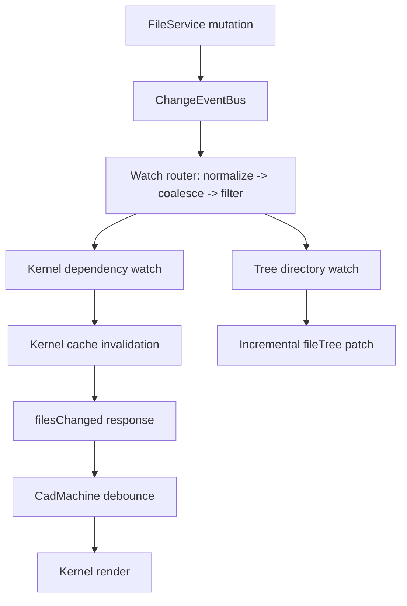
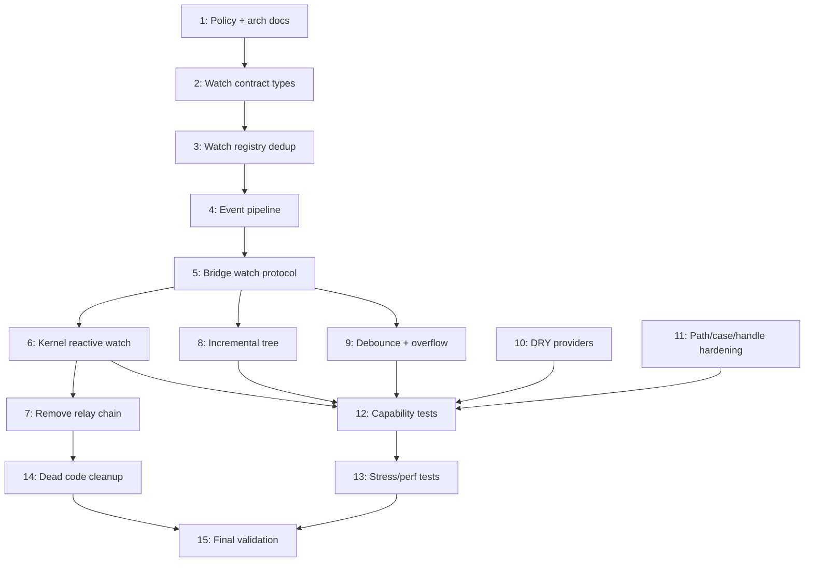

# Filesystem Watch-Based Architecture Overhaul

## Core Insight

ZenFS has a built-in watcher system: every VFS mutation (`writeFile`, `rename`, `unlink`) calls `emitChange()` which fires registered watchers. Our `ChangeEventBus` already captures these mutations at the `FileService` level. By exposing a first-class `watch(request)` method on `FileService` with dedup/coalescing/overflow semantics and bridging it over `MessagePort`, kernel workers can directly watch their dependency graph and react to changes -- **no main thread relay needed**.

This is the **Vite pattern adapted for browser-based CAD**: file watcher + dependency graph + selective invalidation + push-based re-render.


| Concept                | Vite                             | Tau (target)                                           |
| ---------------------- | -------------------------------- | ------------------------------------------------------ |
| File watcher           | chokidar (OS-level)              | `FileService.watch()` (VFS-level via ChangeEventBus)   |
| Dependency graph       | Module graph (import analysis)   | Bundle deps (esbuild metafile) + kernel resolvers      |
| Selective invalidation | `moduleGraph.invalidateModule()` | `bundleResultCache.delete()`, `fileHashCache.delete()` |
| Rebuild trigger        | HMR update to browser            | `filesChanged` response to CadMachine                  |
| Debounce               | HMR batching                     | CadMachine 500ms `bufferingFile` state                 |


---

## Architecture: Current vs Target

### Current: 6-hop command relay

```
Editor -> use-build.tsx (subscribes fileWritten) -> CadMachine (debounce) -> KernelMachine -> RuntimeClient.render(changedPaths) -> KernelWorker.notifyFileChanged() -> invalidate caches -> render
```

`use-build.tsx` manually forwards `fileWritten` events to every compilation unit. `RuntimeClient` sends a `notifyFileChanged` command before every render. Main thread is heavily involved.

### Target: Direct watch with hardened event pipeline




Two watch planes: **kernel fast path** (dependency-scoped, low-latency cache invalidation) and **UI tree path** (directory-scoped, incremental tree updates). No main thread involvement in the kernel change detection path.

---

## Kernel Dependency Graphs (exploration findings)

Each kernel already knows its dependencies. The watch set is derived from these:

- **Replicad, JSCAD, Manifold, OpenCascade**: esbuild metafile `inputs` -> `bundleResult.dependencies` (all `zenfs:` project files in the bundle). Deep import trees.
- **OpenSCAD**: `use`/`include` regex parsing via `getReferencedScadFiles()`. Tree of `.scad` files.
- **KCL/Zoo**: KCL AST import resolution via `discoverKclDependencies()`. Tree of `.kcl` files.
- **Tau (converter)**: Main file + siblings via `readdir(directory)`. Star shape.

All kernels use the framework's `fileHashCache` and `fileContentCache`. esbuild-based kernels also use `bundleResultCache`. The existing `notifyFileChanged(changedPaths)` method in `kernel-worker.ts` already handles cache invalidation -- the change is making it fire reactively from a watch subscription instead of from a command.

---

## Research: ZenFS Watch Internals

From `node_modules/@zenfs/core/dist/vfs/watchers.js`: ZenFS maintains a global `watchers: Map<string, Set<FSWatcher>>`. The `emitChange(context, eventType, filename)` function walks up the directory tree from the changed file to `/`, notifying registered `FSWatcher` instances. Every VFS mutation (write, rename, unlink, mkdir, rmdir) calls this.

Our `FileService.watch()` uses `ChangeEventBus` rather than ZenFS watchers directly because:

1. Richer event data (includes backend, full path, semantic event type)
2. Fires after the operation is fully committed (not during)
3. Consistent across all backends
4. Server-side path filtering (only watched paths forwarded to port)

## Research: Browser FileSystemObserver API

Chrome 133+ / Edge 133+ support `FileSystemObserver` for push-based change notifications on the user-visible filesystem. Change record types: `appeared`, `disappeared`, `modified`, `moved`, `errored`, `unknown`. Future replacement for `fileWatcherActor` polling (webaccess backend only). Not yet in Firefox/Safari -- treat as progressive enhancement.

## Research: VS Code Watcher Lessons

VS Code's `FileService` (repos/vscode) uses battle-tested patterns we adopt:

- **Ref-counted watch dedup**: `activeWatchers` keyed by `hash([resource, options])` with `count` inc/dec; dispose only when count reaches zero.
- **Event coalescing**: `EventCoalescer` normalizes bursts -- `ADDED -> DELETED` cancels out, `DELETED -> ADDED` flattens to `UPDATED`, parent delete suppresses child spam.
- **Session + request IDs**: `diskFileSystemProviderClient` uses `sessionId` + per-watch `req` UUID for correlation and lifecycle management over IPC.
- **Throttled workers + restart/suspend**: bounded event queues with backpressure, automatic restart up to 5x, suspended-request recovery via polling.
- **Browser provider reality**: IndexedDB provider returns `Disposable.None` for `watch()` (no native watching); HTML provider uses `FileSystemObserver` as best-effort.
- **Two event planes**: `onDidChangeFile` (raw watcher events) vs `onDidRunOperation` (semantic operation events).

---

## Implementation Plan (15 todos)

### Todo 1: Policy and Architecture Documents

Ensure [docs/policy/filesystem-policy.md](docs/policy/filesystem-policy.md) Rules 18-30 (already written) are complete. Create [docs/architecture/runtime-editor.md](docs/architecture/runtime-editor.md) documenting:

1. System overview (editor, filesystem worker, kernel workers as reactive system)
2. Two watch planes (kernel fast path + UI tree path)
3. Watch request contract and event pipeline (normalize -> coalesce -> filter -> deliver)
4. Kernel rendering lifecycle (init -> render -> resolve deps -> watch -> change -> invalidate -> re-render -> update watch set)
5. Incremental tree model (startup hydration + incremental patches)
6. Compilation unit lifecycle
7. Overflow/resync protocol
8. Comparison to Vite HMR and VS Code watcher architecture

### Todo 2: Watch Contract and Types

Add to [apps/ui/app/filesystem/types.ts](apps/ui/app/filesystem/types.ts):

```typescript
type WatchRequest = {
  paths: string[];
  recursive?: boolean;
  includes?: string[];
  excludes?: string[];
  filter?: WatchEventFilter;
  correlationId?: string;
};

type WatchEventFilter = {
  added?: boolean;
  updated?: boolean;
  deleted?: boolean;
  renamed?: boolean;
};

type WatchEvent =
  | { type: 'change'; path: string; correlationId?: string }
  | { type: 'delete'; path: string; correlationId?: string }
  | { type: 'rename'; oldPath: string; newPath: string; correlationId?: string }
  | { type: 'reset'; correlationId?: string }
  | { type: 'overflow'; correlationId?: string };
```

Add `{ type: 'filesChanged'; paths: string[] }` to `RuntimeResponse` in [runtime-protocol.types.ts](packages/runtime/src/types/runtime-protocol.types.ts).

Add `watch` method signature to `RuntimeFileSystemBase` in [runtime-kernel.types.ts](packages/runtime/src/types/runtime-kernel.types.ts) and `FileManagerProtocol` in [file-manager.machine.types.ts](apps/ui/app/machines/file-manager.machine.types.ts).

### Todo 3: Watch Registry with Dedup

Implement in [file-service.ts](apps/ui/app/filesystem/file-service.ts):

- Request hash -> `{ unsubscribe, refCount }` map for dedup
- Per-port session -> owned watch IDs set for lifecycle tracking
- `watch(request, handler)` returns `() => void`; identical requests share one ChangeEventBus subscription
- Unsubscribe decrements ref count; actual disposal when count reaches zero
- On port disconnect: cleanup all watches owned by that port
- On backend reconfigure: invalidate all watch subscriptions, emit `reset` event

### Todo 4: Event Pipeline Hardening

Implement in [change-event-bus.ts](apps/ui/app/filesystem/change-event-bus.ts) and [file-service.ts](apps/ui/app/filesystem/file-service.ts):

Worker-side pipeline before delivery:

1. **Normalize** paths (canonical absolute, separator normalization)
2. **Coalesce** within short window (~50ms): `added -> deleted` cancels out; `deleted -> added` collapses to `updated`; parent directory delete suppresses child delete spam; rename emits both old/new path semantics
3. **Filter** by path scope (exact or recursive), include/exclude glob patterns, and event type mask
4. **Deliver** only matched events to subscribed ports with correlation IDs

### Todo 5: Bridge Watch Protocol

Extend [runtime-filesystem-bridge.ts](packages/runtime/src/framework/runtime-filesystem-bridge.ts) wire protocol:

- `{ type: 'watch', watchId, request: WatchRequest }` -- client registers watch
- `{ type: 'unwatch', watchId }` -- client unregisters
- `{ type: 'event', event: 'watch', data: { watchId } & WatchEvent }` -- server pushes to client

Server side in [filesystem-bridge.ts](packages/runtime/src/filesystem/filesystem-bridge.ts): On `watch` message, call `fileService.watch(request, handler)` where handler emits via bridge to port. Store unsubscribe keyed by watchId per port. On port disconnect, cleanup all watches.

Client side: `proxy.watch(request, handler)` -> sends watch message, listens for matching events, returns unsubscribe function.

### Todo 6: Kernel Reactive Watch

In [kernel-worker.ts](packages/runtime/src/framework/kernel-worker.ts):

After `render()` completes, call `updateWatchSet(dependencies)`:

- Diff new deps against previous set: add newly required, remove stale, keep unchanged (no full resubscribe churn)
- Watch request uses `excludes: ['.tau/cache/**']` to avoid self-churn from cache writes
- Handler: invalidate `fileHashCache`, `fileContentCache`, `bundleResultCache` for changed path; call `onFilesChanged(paths)` callback
- On `overflow`/`reset` event: clear all dependency caches and set flag for fresh dependency pass on next render

In [runtime-worker-dispatcher.ts](packages/runtime/src/framework/runtime-worker-dispatcher.ts): Pass `onFilesChanged` callback that calls `respond({ type: 'filesChanged', paths })` following existing `log`/`telemetry` fire-and-forget pattern.

In [runtime-worker-client.ts](packages/runtime/src/framework/runtime-worker-client.ts): Handle `filesChanged` response -> emit event.

In [kernel.machine.ts](apps/ui/app/machines/kernel.machine.ts): Subscribe `client.on('filesChanged')` -> send `kernelFilesChanged` to parent.

In [cad.machine.ts](apps/ui/app/machines/cad.machine.ts): Handle `kernelFilesChanged` -> enter `bufferingFile` (existing debounce).

### Todo 7: Remove Relay Chain

- Remove `use-build.tsx` lines 148-167 (fileWritten forwarding useEffect)
- Remove `notifyFileChanged(changedPaths)` command call in kernel-client render path
- Remove `changedPaths` from CadMachine context and `createGeometry` event type
- Remove `fileChanged` command type from `RuntimeCommand` in runtime-protocol.types.ts
- Verify all compilation unit re-rendering now flows through kernel watch -> `filesChanged` -> `kernelFilesChanged` -> `bufferingFile`

### Todo 8: Incremental Tree Cache

No full directory scans for refreshes:

- Add `readDirectory(path)` to [file-service.ts](apps/ui/app/filesystem/file-service.ts) with [directory-tree-cache.ts](apps/ui/app/filesystem/directory-tree-cache.ts) read-through
- On mutations, re-read only the parent directory from the provider, update cache, emit `directoryChanged`
- Machine uses `watch()` on build root directory, patches `fileTree` incrementally on `directoryChanged` events
- `getDirectoryStat` preserved for startup-only hydration (builds are small)
- `readBackendFileTree` removed (all callers migrated to `readShallowDirectory`)

### Todo 9: Debounce and Overflow/Resync

Replace dead `scheduleDebouncedRefresh` with XState `raise({ type: 'pollFileSystem' }, { delay: 300, id: 'debouncedRefresh' })` + `cancel('debouncedRefresh')` pattern.

Implement overflow/resync behavior:

- On `overflow`/`reset` watch event in file manager machine: trigger targeted parent/subtree rescan (not blind full tree)
- On `overflow`/`reset` in runtime worker: clear dependency caches, request fresh dep pass on next render
- No silent event drops allowed -- every drop path must emit an explicit overflow event

### Todo 10: DRY Providers

Create [providers/create-zenfs-provider.ts](apps/ui/app/filesystem/providers/create-zenfs-provider.ts):

- Factory function returning opaque `FileSystemProvider`
- `Disposable` cleanup, JSDoc, flat options
- Self-contained under `filesystem/` for future `@taucad/filesystem` extraction
- Each existing provider becomes a thin wrapper calling the factory with backend-specific config

### Todo 11: Path/Case and Handle-Store Hardening

- Consolidate `parentDirectory`, `joinPath`, `normalizePath` into [path.utils.ts](apps/ui/app/utils/path.utils.ts); remove duplicates from filesystem/ modules
- Add canonical path normalization for watch matching (separator normalization, duplicate slash removal)
- Define case-sensitivity handling per backend capability for watch path comparison
- Complete handle-store connection pooling in [handle-store.ts](apps/ui/app/filesystem/handle-store.ts) (ref-counted singleton pattern with debounced idle close)

### Todo 12: Capability Tests

Write unit/integration tests covering **every filesystem capability**:

**FileService CRUD** in `file-service.test.ts`:

- `readFile` (binary/utf8), `readFiles`, `readdir`, `stat`, `lstat`, `exists`, `batchExists`
- `writeFile`, `writeFiles`, `mkdir`, `rename`, `unlink`, `rmdir`
- `ensureDirectoryExists`, `duplicateFile`, `copyDirectory`, `getDirectoryContents`, `getZippedDirectory`
- `reconfigure`, `readShallowDirectory`, startup-only `getDirectoryStat`, incremental `readDirectory`

**Watcher contract tests**:

- Recursive/non-recursive matching
- Includes/excludes/filter/correlationId behavior
- Dedup/ref-count semantics (N identical requests -> 1 underlying subscription; proper ref-count disposal)
- Disconnect/reconfigure cleanup (no leaked watches)

**Watcher event semantics tests**:

- Add-delete cancelation
- Delete-add collapse to `updated`
- Rename old/new invalidation
- Parent delete child suppression

**Overflow/resync tests**:

- Forced queue overflow emits reset event
- Kernel cache reset/recovery path
- Tree resync path without silent drops

**Bridge tests** in `runtime-filesystem-bridge.test.ts`:

- RPC/event interleaving
- Watch/unwatch routing with correlation
- Pending-call disconnect behavior

**Kernel integration tests**:

- Worker watch subscription and dependency watch-set diffing
- `filesChanged` propagation to CAD machine
- No `use-build.tsx` relay dependence

**Provider/registry tests**:

- Backend-specific provider capabilities
- Standalone provider reuse and invalidation
- WebAccess handle swap behavior

**Machine tests** in `file-manager.machine.test.ts`:

- Debounce coalescing (300ms window)
- Incremental tree patching
- Startup hydration vs post-start incremental updates

### Todo 13: Stress and Performance Tests

- **Edit storm**: 100+ rapid `fileWritten` events -> 0 silent drops, coalescing produces minimal refresh calls
- **Large tree**: 1000+ files across 50+ directories -> verify incremental load performance
- **Long-lived session**: create/dispose 50 watch cycles -> verify no port/memory leaks
- **Watch latency gate**: watch event -> kernel invalidate < 25ms p95
- **UI tree latency gate**: watch event -> UI tree patch < 75ms p95

### Todo 14: Dead Code Cleanup

Remove:

- `scheduleDebouncedRefresh` assign action + `refreshTimer` from context
- `toProviderStat` duplication (moved to factory)
- `readBackendFileTree` from FileService and FileManagerProtocol (all callers use `readShallowDirectory`)
- Old `notifyFileChanged` command path remnants
- Any remaining `changedPaths` threading through machine context

### Todo 15: Final Validation

```bash
pnpm nx test ui --watch=false
pnpm nx test runtime --watch=false
pnpm nx lint ui && pnpm nx lint runtime
pnpm nx typecheck ui && pnpm nx typecheck runtime
```

Verify Remix -> editor file loading scenario works (previously broken by `openFiles` -> `fileCache` migration).

---

## Dependency Graph




---

## Completion Criteria

- All 15 todos completed in order.
- No remaining command-driven kernel invalidation path (`use-build.tsx` relay removed, `changedPaths` removed).
- No mutation-triggered full recursive tree refresh path (`spawnBackgroundRefresh` replaced, `readBackendFileTree` removed).
- Watch API includes dedup, coalescing, overflow/resync, and lifecycle safety.
- All filesystem capabilities have direct unit tests and pass.
- Performance gates met (watch -> kernel < 25ms p95, watch -> tree < 75ms p95, 0 silent drops under 100-event burst).
- `pnpm nx test/lint/typecheck` passes for both `ui` and `kernels`.
- Remix -> editor file loading scenario verified.

## Execution Directive

Implementation must continue sequentially until all todos are complete and all validation gates pass. Do not stop at partial milestones; resolve blockers and continue until the architecture, test matrix, and performance gates are fully implemented.

## Policy Reference

All implementation must conform to [docs/policy/filesystem-policy.md](docs/policy/filesystem-policy.md) Rules 1-32, with particular attention to the Watcher Architecture Rules (18-30), Plan Update Requirements, and Required Watch Test Matrix sections.
