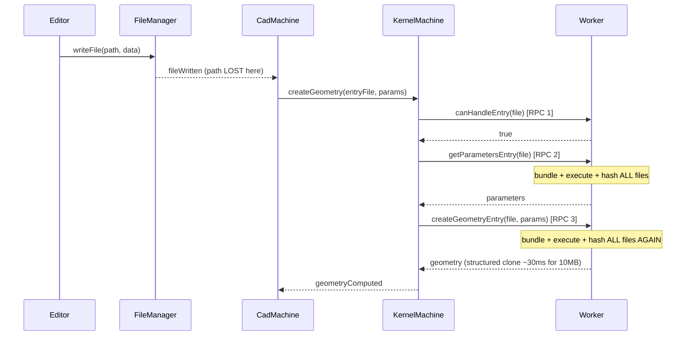
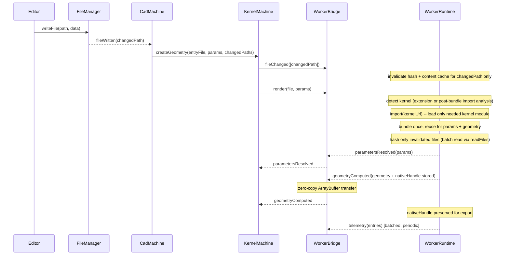
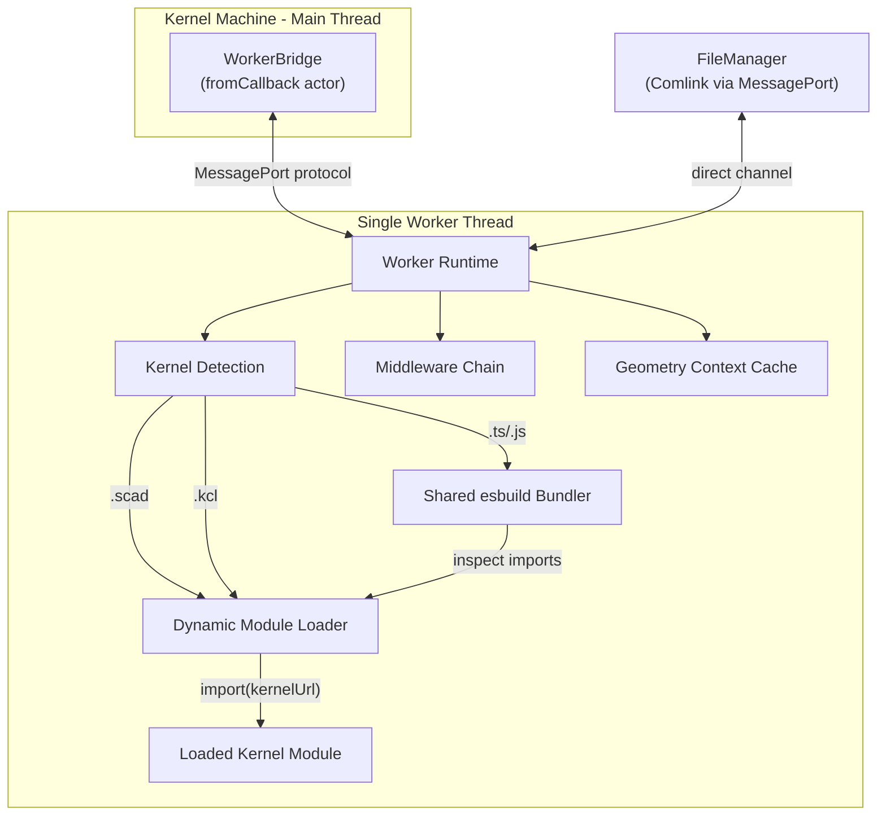
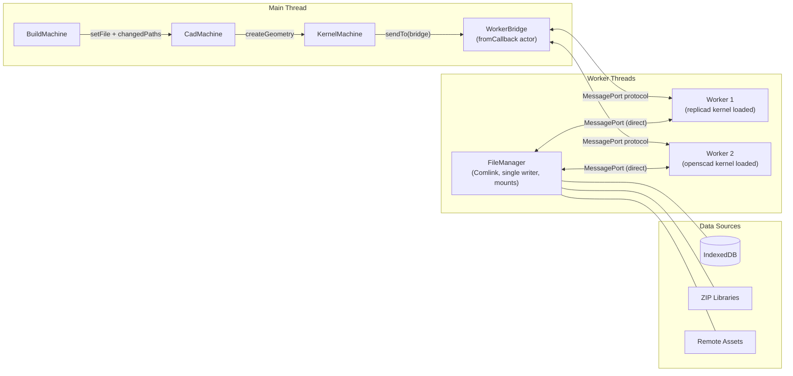
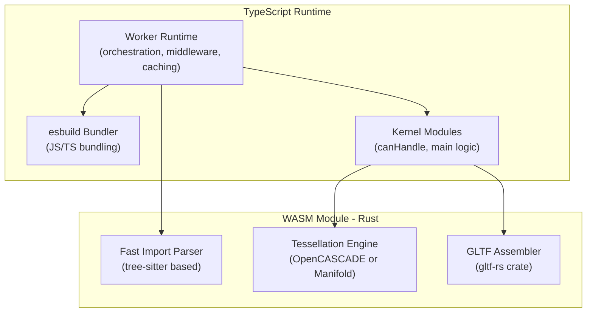

# Kernel Runtime Architecture: Next-Generation Design

## Status Quo: Why Change

The current pipeline processes a single user edit through **7 sequential stages** with **5-7 Comlink RPCs** per render cycle, **duplicate bundling/execution** across getParameters and createGeometry, and **zero cross-cycle caching** of file hashes. The file manager knows which files changed, but this information is discarded before reaching the kernel workers.




**Critical problems:**

- **5 workers created eagerly, only 1 used**: Every kernel machine spins up 5 separate `Worker()` threads (replicad, jscad, openscad, zoo, tau) with full WASM initialization, then only one ever handles any given file. An editor with 3 compilation units creates 15 worker threads
- **3 sequential RPCs** per render (canHandle + getParams + createGeometry), each involving structured clone serialization
- **Comlink per-request overhead**: creates a fresh function per RPC that V8 cannot JIT-optimize (see [Comlink issue #647](https://github.com/GoogleChromeLabs/comlink/issues/647))
- **Changed file identity is lost**: `use-build.tsx` (L156-165) receives `fileWritten` but sends `setFile` with the *entry file path*, not the changed file -- so workers cannot know what actually changed
- **JS kernels bundle 3-4x per cycle**: `getDependencies` bundles (L241 in `javascript-worker.ts`), then both `getParameters` and `createGeometry` bundle again (confirmed in replicad L456/495, jscad L185/284)
- **All file hashes discarded between cycles**: `setBasePath` would clear the hash cache even though most files haven't changed
- **Zero transfer optimization**: All binary data (geometry GLTF, file contents) is structured-cloned through every pipeline layer -- 3-5x memory duplication for each geometry result
- **WASM recompilation on every page load**: All kernel workers use `fetch()` + `arrayBuffer()` instead of `WebAssembly.instantiateStreaming()`, bypassing V8's automatic compiled-code caching. OpenCASCADE recompiles ~48MB of WASM from scratch on every load
- **Filesystem reads are unbatched and unoptimized**: Each `readFile()` is a separate Comlink RPC with structured cloning. A 10-file dependency resolution triggers 10 round-trips with 10 copies
- **Broken geometry export on cache hit**: Every worker independently manages a `*Memory` record (`shapesMemory`, `offDataMemory`, `gltfDataMemory`, `glbDataMemory`). When geometry is cached at the framework level, `createGeometry` is never called, the memory record is never populated, and export fails with "Geometry not computed yet"
- **OpenSCAD copies ALL project files on every render**: `mountFileSystem()` calls `getDirectoryContents()` which bulk-reads every file in the project via Comlink, then copies them all into Emscripten MEMFS with `FS.writeFile()` -- and creates a fresh WASM instance per operation, so this happens twice per cycle
- **Eager trace logging on every filesystem operation**: `createFileSystem()` eagerly allocates timing strings and `performance.now()` for every read/exists/readdir, even at trace level

---

## Target Architecture




**Key changes:**

- **1 worker per compilation unit** instead of 5 (kernel loaded as ES module on demand)
- **1 command in, 2 events out** (vs 3 sequential RPCs)
- **Framework-managed geometry lifecycle** -- nativeHandle ensures export always works, including on cache hit
- **File change identity preserved** end-to-end with content + hash cache
- **Single bundle per cycle** for JS kernels, reused for detection + params + geometry
- **MessagePort event protocol** replaces Comlink for the hot path
- **Zero-copy geometry transfer** via ArrayBuffer.transfer()
- **Streaming WASM compilation** with V8 code caching (instant reload)
- **Batched filesystem reads** reduce RPC count by 10x
- **Content-cache-backed Emscripten FS** for Emscripten kernels (reads from worker memory, no file copying, no ZenFS coherency issues)
- **Mountable data sources** (zip libraries, remote assets) via `MountConfig` -- file manager resolves transparently
- **Structured telemetry** via Performance API (zero overhead, DevTools integration)

---

## Phase 0: Tactical Performance (Execute First)

Execute items P2-P5 from the [existing performance plan](kernel_worker_performance_d871ae34.plan.md), plus new tactical optimizations. These are low-risk, high-impact changes within the current architecture.

### 0A. Existing P2-P5

- **P2**: Active-only middleware runtimes, logger cache, runtime cache, single getMiddleware() call, reverse-index loop
- **P3**: Module-level TextEncoder, lookup-table hex conversion, URL-based asset hashing
- **P4**: Structured log data instead of template literals
- **P5**: Bounded concurrency for file reads, parallel middleware imports

### 0B. WASM Streaming Compilation

All kernel workers use `fetch()` + `arrayBuffer()` to load WASM, bypassing V8's automatic code caching. This means every page load recompiles WASM from scratch -- for OpenCASCADE (~48MB uncompressed), this can take 10-30 seconds of TurboFan compilation that should be instant on subsequent loads.

#### Shared utility

**New: [wasm-loader.ts](apps/ui/app/components/geometry/kernel/utils/wasm-loader.ts)** -- Replaces the duplicated `loadWasmBinary()` functions in [init-open-cascade.ts](apps/ui/app/components/geometry/kernel/replicad/init-open-cascade.ts) and [kcl-utils.ts](apps/ui/app/components/geometry/kernel/zoo/kcl-utils.ts):

```typescript
export async function compileWasmStreaming(url: string): Promise<WebAssembly.Module> {
  try {
    return await WebAssembly.compileStreaming(fetch(url));
  } catch {
    const response = await fetch(url);
    const bytes = await response.arrayBuffer();
    return WebAssembly.compile(bytes);
  }
}

export async function loadWasmBinary(url: string): Promise<ArrayBuffer> {
  // Existing fetch + arrayBuffer pattern with Node.js file:// fallback
  // Kept for libraries that require wasmBinary (some Emscripten builds)
}
```

`compileStreaming` enables two critical V8 optimizations:

1. **Streaming compilation**: Liftoff (baseline) compilation begins while bytes are still downloading
2. **Code caching**: After TurboFan (optimizing) completes, V8 caches the native code to disk. Subsequent loads skip both Liftoff and TurboFan entirely -- instant startup for modules >= 128KB

#### Per-kernel changes

**OpenCASCADE** ([init-open-cascade.ts](apps/ui/app/components/geometry/kernel/replicad/init-open-cascade.ts)): Emscripten supports an `instantiateWasm` callback that receives a compiled `WebAssembly.Module`. Use `compileWasmStreaming()` to get the module, then pass it via this callback instead of `wasmBinary`:

```typescript
const compiledModule = await compileWasmStreaming(opencascadeWasmUrl);
const instance = await opencascade({
  instantiateWasm(imports, successCallback) {
    WebAssembly.instantiate(compiledModule, imports).then(inst => successCallback(inst));
    return {};
  },
  print: options?.print ?? noop,
  printErr: options?.printErr ?? noop,
});
```

**KCL/Zoo** ([kcl-utils.ts](apps/ui/app/components/geometry/kernel/zoo/kcl-utils.ts)): wasm-bindgen's `default()` init function accepts a `WebAssembly.Module` directly. Use `compileWasmStreaming()` instead of `loadWasmBinary()`:

```typescript
const compiledModule = await compileWasmStreaming(kclWasmUrl);
await wasmModule.default({ module_or_path: compiledModule });
```

**OpenSCAD** ([openscad.worker.ts](apps/ui/app/components/geometry/kernel/openscad/openscad.worker.ts)): Currently creates a fresh WASM instance per operation (no reuse, recompiles each time). The `openscad-wasm-prebuilt` package controls WASM loading internally. Investigate whether it accepts a pre-compiled module. If yes, compile once with `compileWasmStreaming()` and pass to each `createOpenSCAD()` call. If no, this is a package limitation to accept or fork.

**esbuild** ([esbuild-bundler.ts](apps/ui/app/components/geometry/kernel/utils/esbuild-bundler.ts)): Already uses `esbuild.initialize({ wasmURL })` which handles its own loading. Verify whether esbuild uses streaming internally (it likely does). No change needed unless profiling shows otherwise.

**Impact**: Second page load WASM initialization drops from 10-30s to near-instant for OpenCASCADE. Streaming compilation reduces first-load time by overlapping download and compilation.

### 0C. Zero-Copy Transfers

Currently, **zero** transfer optimization exists. All binary data is structured-cloned:


| Transfer                 | Current (clone) | With transfer | Savings |
| ------------------------ | --------------- | ------------- | ------- |
| 500KB geometry           | ~1.5ms          | ~0.08ms       | 19x     |
| 10MB geometry            | ~30ms           | ~1.6ms        | 19x     |
| 50MB geometry            | ~150ms          | ~8ms          | 19x     |
| 10 file reads (1MB each) | ~30ms           | ~1ms          | 30x     |


#### Geometry result transfer

**[kernel-worker.ts](apps/ui/app/components/geometry/kernel/utils/kernel-worker.ts)**: Wrap geometry return values with `Comlink.transfer()` in `createGeometryEntry`:

```typescript
import { transfer } from 'comlink';

const transferables = result.success
  ? result.data
      .filter((g): g is GeometryGltf => g.format === 'gltf')
      .map(g => g.content.buffer)
  : [];

return transfer(result, transferables);
```

This moves ArrayBuffer ownership to the main thread with near-zero cost. The worker loses access to the buffer, which is correct since the worker is done with it.

#### Filesystem read transfer

**[file-manager.ts](apps/ui/app/machines/file-manager.ts)**: Wrap binary `readFile` responses with `Comlink.transfer()`:

```typescript
async function readFile(filepath: string, options?: 'utf8' | { encoding: 'utf8' } | {}): Promise<...> {
  // ... existing logic ...
  const buffer = await fsp.readFile(filepath);
  const result = new Uint8Array(asBuffer(buffer.buffer), buffer.byteOffset, buffer.byteLength);
  return transfer(result, [result.buffer]);
}
```

ZenFS creates a new buffer per read, so transferring ownership is safe.

**Impact**: Eliminates 3-5x memory duplication for geometry results. A 10MB GLTF currently consumes ~30-50MB across the pipeline; with transfer it stays at ~10MB.

### 0D. Filesystem Batch Reads

Each `readFile()` is a separate Comlink RPC over the MessagePort to the file manager worker. During `computeDependencies`, 10 dependency files trigger 10 round-trips.

#### Add batch read method

**[file-manager.ts](apps/ui/app/machines/file-manager.ts)**: Add a batch read method:

```typescript
async function readFiles(paths: string[]): Promise<Map<string, Uint8Array<ArrayBuffer>>> {
  await ensureReady();
  const entries = await Promise.all(
    paths.map(async (path) => {
      const buffer = await fsp.readFile(path);
      return [path, new Uint8Array(asBuffer(buffer.buffer), buffer.byteOffset, buffer.byteLength)] as const;
    }),
  );
  const result = new Map(entries);
  const transferables = [...result.values()].map(v => v.buffer);
  return transfer(result, transferables);
}
```

**[runtime-kernel.types.ts](libs/types/src/types/runtime-kernel.types.ts)**: Add to `RuntimeFileSystem`:

```typescript
export type RuntimeFileSystem = {
  readFile(path: string, encoding: 'utf8'): Promise<string>;
  readFile(path: string): Promise<Uint8Array<ArrayBuffer>>;
  readFiles(paths: string[]): Promise<Map<string, Uint8Array<ArrayBuffer>>>; // NEW
  // ... rest
};
```

**[kernel-worker.ts](apps/ui/app/components/geometry/kernel/utils/kernel-worker.ts)**: Use in `computeDependencies`:

```typescript
const contentMap = await this.filesystem.readFiles(absolutePaths);
const fileDeps: FileDependency[] = await Promise.all(
  absolutePaths.map(async (absolutePath) => {
    const content = contentMap.get(absolutePath)!;
    const contentHash = await this.hashContent(content);
    return { type: 'file' as const, path: absolutePath, contentHash };
  }),
);
```

**Impact**: 10-file dependency resolution drops from ~~10 RPCs (~~50ms) to 1 RPC (~2ms).

### 0E. Replace Eager Filesystem Timing with Performance Marks

The current `createFileSystem()` eagerly calls `performance.now()` and constructs timing strings on every `readFile`, `exists`, and `readdir` -- even at trace level. This adds ~40 string allocations per dependency resolution.

Replace with `performance.mark()` / `performance.measure()` which the browser manages internally with zero allocation overhead, and which appear automatically in Chrome DevTools Performance panel:

**[kernel-worker.ts](apps/ui/app/components/geometry/kernel/utils/kernel-worker.ts)**: Update `createFileSystem()`:

```typescript
async function readFile(path: string, encoding?: 'utf8'): Promise<string | Uint8Array<ArrayBuffer>> {
  const markName = `tau:fs:read:${path}`;
  performance.mark(markName);
  const data = await fileManager.readFile(path, encoding);
  performance.measure('tau:fs:read', {
    start: markName,
    detail: { path, binary: encoding !== 'utf8' },
  });
  return data;
}
```

Apply the same pattern to `exists`, `readdir`, and all kernel-level operations. Use the naming convention `tau:<subsystem>:<operation>`:


| Prefix             | Example                                   | Where                  |
| ------------------ | ----------------------------------------- | ---------------------- |
| `tau:fs:*`         | `tau:fs:read`, `tau:fs:readdir`           | Filesystem operations  |
| `tau:kernel:*`     | `tau:kernel:bundle`, `tau:kernel:compute` | Kernel pipeline stages |
| `tau:hash:*`       | `tau:hash:file`, `tau:hash:dep`           | Hashing operations     |
| `tau:middleware:*` | `tau:middleware:wrap`                     | Middleware execution   |
| `tau:wasm:*`       | `tau:wasm:init`, `tau:wasm:compile`       | WASM loading           |


**Impact**: Eliminates ~40 string allocations per dependency resolution. Timing data automatically visible in DevTools. Zero overhead when DevTools is closed.

### 0F. OpenSCAD Targeted Filesystem Mounting

OpenSCAD's `mountFileSystem()` currently calls `getDirectoryContents(basePath)` which reads **every file** in the project, then copies all of them into MEMFS. For a project with 50 files where OpenSCAD uses 5, this is 10x more I/O than necessary.

**[openscad.worker.ts](apps/ui/app/components/geometry/kernel/openscad/openscad.worker.ts)**: Replace the bulk mount with targeted mounting using the dependency list from `getReferencedScadFiles()`:

```typescript
private async mountFileSystem(instance: OpenSCAD, options: MountOptions): Promise<void> {
  const { basePath, filesystem, logger } = options;
  instance.FS.chdir('/');
  instance.FS.mkdir('/locale');

  // Only mount files OpenSCAD actually references
  const deps = await this.getReferencedScadFiles(mainFile, basePath, filesystem, logger);
  for (const relativePath of deps) {
    const absolutePath = KernelWorker.resolveFromRoot(relativePath, basePath);
    const content = await filesystem.readFile(absolutePath);
    this.ensureDirectoryForFile(instance, relativePath);
    instance.FS.writeFile(relativePath, content);
  }
}
```

Combined with Phase 1D's file content cache, most files would be served from cache on subsequent renders.

**Impact**: For a 50-file project where OpenSCAD uses 5 files, reduces file reads from 50 to 5 per mount operation. Combined with content caching, subsequent mounts read only changed files.

---

## Phase 1: File Change Tracking Pipeline

### Problem

When the user edits `utils.ts` in a project with `main.ts` (the entry file), the pipeline currently:

1. `use-build.tsx` L156-165: receives `fileWritten` event but sends `setFile` with `filename: entryFile` (the entry file, NOT the changed file)
2. Kernel worker receives no information about which file changed
3. Worker re-reads and re-hashes ALL dependency files on every render

### Design

Propagate changed file paths from the file manager through to kernel workers, enabling granular cache invalidation.

#### 1A. Propagate changed file path through the event chain

**[use-build.tsx](apps/ui/app/hooks/use-build.tsx) L156-165**: Include the changed file path in the `setFile` event:

```typescript
fileManager.fileManagerRef.on('fileWritten', (event) => {
  for (const [entryFile, unit] of units) {
    unit.send({
      type: 'setFile',
      file: { path: `/projects/${projectId}`, filename: entryFile },
      changedPath: event.path, // NEW: the actual file that changed
    });
  }
});
```

#### 1B. Thread changed paths through CAD and kernel machines

**[cad.machine.ts](apps/ui/app/machines/cad.machine.ts)**: Add `changedPaths: string[]` to context, accumulated during debounce, forwarded with `createGeometry`:

```typescript
type CadContext = {
  // ... existing
  changedPaths: string[]; // accumulated during debounce window
};
```

On `setFile`: push `changedPath` to `changedPaths`. On `createGeometry`: send accumulated paths and clear.

**[kernel.machine.ts](apps/ui/app/machines/kernel.machine.ts)**: Forward `changedPaths` to the active worker before render operations.

#### 1C. Add `notifyFileChanged` to KernelWorker

**[kernel-worker.ts](apps/ui/app/components/geometry/kernel/utils/kernel-worker.ts)**: Add a persistent file hash cache and a method to selectively invalidate entries:

```typescript
private fileHashCache = new Map<string, string>();

public async [kernelSymbols.notifyFileChanged](changedPaths: string[]): Promise<void> {
  for (const path of changedPaths) {
    this.fileHashCache.delete(path);
    this.fileContentCache.delete(path); // Also invalidate content cache (Phase 1D)
  }
}
```

In `computeDependencies`, check cache before reading + hashing:

```typescript
let contentHash = this.fileHashCache.get(absolutePath);
if (!contentHash) {
  const content = await this.filesystem.readFile(absolutePath);
  contentHash = await this.hashContent(content);
  this.fileHashCache.set(absolutePath, contentHash);
}
```

**Impact**: After the first render cycle, subsequent cycles only re-read files that actually changed. For a 10-file project where 1 file changed, this eliminates 9 file reads + 9 SHA-256 hashes per cycle.

This replaces Plan P1A's "clear on setBasePath" approach with granular invalidation, preserving hashes across cycles.

#### 1D. Worker-local file content cache

Extend the hash cache to also cache file contents. This eliminates duplicate reads within a single render cycle (getDependencies reads files to parse imports, then computeDependencies reads the same files to hash them, then getParameters/createGeometry reads the entry file again).

```typescript
private fileContentCache = new Map<string, Uint8Array<ArrayBuffer> | string>();

private async readFileWithCache(path: string): Promise<Uint8Array<ArrayBuffer>>;
private async readFileWithCache(path: string, encoding: 'utf8'): Promise<string>;
private async readFileWithCache(path: string, encoding?: 'utf8'): Promise<Uint8Array<ArrayBuffer> | string> {
  const cacheKey = encoding === 'utf8' ? `utf8:${path}` : path;
  const cached = this.fileContentCache.get(cacheKey);
  if (cached !== undefined) {
    return cached;
  }
  const content = await this.filesystem.readFile(path, encoding as 'utf8');
  this.fileContentCache.set(cacheKey, content);
  return content;
}
```

The content cache is invalidated alongside the hash cache in `notifyFileChanged` (1C). For files not in `changedPaths`, cached content is reused across render cycles, making subsequent reads free.

Combined with the batch read from Phase 0D, the flow becomes:

1. First render: batch-read all deps (1 RPC), cache all contents + hashes
2. Subsequent render with 1 file changed: read only the changed file (1 RPC), reuse 9 cached entries

**Impact**: Eliminates 2-3x duplicate reads per cycle. Combined with hash caching, a steady-state render of a 10-file project with 1 changed file performs 1 file read instead of 20-30.

---

## Phase 2: Unified Render Command

### Problem

The kernel machine currently executes 3 sequential Comlink RPCs per render: `canHandleEntry` (worker determination), `getParametersEntry`, `createGeometryEntry`. Each involves structured clone serialization and V8 de-optimization from Comlink's per-call function creation.

### Design

Consolidate `getParameters` + `createGeometry` into a single `render` command. Worker determination remains separate (it's a one-time check, cached thereafter).

#### 2A. Add `renderEntry` to KernelWorker

**[kernel-worker.ts](apps/ui/app/components/geometry/kernel/utils/kernel-worker.ts)**: Add a unified method that runs the full pipeline internally:

```typescript
public async [kernelSymbols.renderEntry](
  file: GeometryFile,
  parameters: Record<string, unknown>,
  onParametersResolved?: (result: GetParametersResult) => void,
): Promise<CreateGeometryResultCompleted> {
  this.setBasePath(file);

  // 1. Compute dependencies (once, cached across getParams + createGeometry)
  const resolvedArray = this[kernelSymbols.getMiddleware]();
  const basename = KernelWorker.getBasename(file.filename);
  const fileDeps = await this.computeFileDependencies(basename);

  // 2. Get parameters
  const paramsResult = await this.runGetParameters(file, fileDeps, resolvedArray);
  onParametersResolved?.(paramsResult);

  // 3. Create geometry (reuses file deps, bundle cache)
  return this.runCreateGeometry(file, parameters, fileDeps, resolvedArray);
}
```

The `onParametersResolved` callback enables streaming the intermediate result back to the main thread while the geometry computation continues.

#### 2B. Simplify kernel machine state flow

**[kernel.machine.ts](apps/ui/app/machines/kernel.machine.ts)**: Collapse `parsing` + `evaluating` into a single `rendering` state:

```
Before: ready -> determiningWorker -> parsing -> evaluating -> ready  (3 actor invocations)
After:  ready -> determiningWorker -> rendering -> ready              (2 actor invocations)
```

The `rendering` state invokes `renderEntry` which sends back `parametersResolved` as an intermediate event (via Comlink callback proxy) and `geometryComputed` as the final result.

**Impact**: Eliminates 1 Comlink RPC round-trip per render cycle. Combined with worker determination caching, the hot path becomes 1 RPC (cache hit) or 2 RPCs (cache miss).

---

## Phase 3: Event-Driven Worker Protocol

### Problem

Comlink adds measurable overhead: per-request function creation, Proxy wrapping, and structured clone serialization for every call. For the runtime worker hot path (render, fileChanged, configureMiddleware), this overhead is avoidable because the protocol is small and well-defined.

### Design

Replace Comlink with a typed MessagePort event protocol for the runtime worker hot path. Keep Comlink for the file manager (complex API with many overloaded methods, not on the hot path).

#### 3A. Define the protocol

**New file: [runtime-protocol.ts](libs/types/src/types/runtime-protocol.ts)**:

```typescript
export type RuntimeCommand =
  | { type: 'initialize'; options: Record<string, unknown>; middlewareConfig: MiddlewareConfig }
  | { type: 'render'; file: GeometryFile; params: Record<string, unknown> }
  | { type: 'fileChanged'; paths: string[] }
  | { type: 'canHandle'; file: GeometryFile }
  | { type: 'configureMiddleware'; config: MiddlewareConfig }
  | { type: 'export'; format: ExportFormat; meshConfig?: MeshConfig }
  | { type: 'cleanup' };

export type RuntimeResponse =
  | { type: 'initialized' }
  | { type: 'canHandleResult'; result: boolean }
  | { type: 'parametersResolved'; result: GetParametersResult }
  | { type: 'geometryComputed'; result: CreateGeometryResultCompleted }
  | { type: 'exported'; result: ExportGeometryResult }
  | { type: 'error'; issues: KernelIssue[] }
  | { type: 'log'; log: WorkerLogEntry }
  | { type: 'telemetry'; entries: PerformanceEntryData[] };
```

#### 3B. Worker-side message handler

**[kernel-worker.ts](apps/ui/app/components/geometry/kernel/utils/kernel-worker.ts)**: Add a message dispatcher that routes commands to the appropriate methods. The worker entrypoint uses this dispatcher instead of the Comlink interface:

```typescript
export function createWorkerDispatcher(worker: KernelWorker): void {
  self.onmessage = async (e: MessageEvent<RuntimeCommand>) => {
    const respond = (response: RuntimeResponse, transferables?: Transferable[]) =>
      self.postMessage(response, { transfer: transferables ?? [] });

    switch (e.data.type) {
      case 'render': {
        const result = await worker[kernelSymbols.renderEntry](
          e.data.file,
          e.data.params,
          (paramsResult) => respond({ type: 'parametersResolved', result: paramsResult }),
        );
        const transferables = result.success
          ? result.data.filter((g): g is GeometryGltf => g.format === 'gltf').map(g => g.content.buffer)
          : [];
        respond({ type: 'geometryComputed', result }, transferables);
        break;
      }
      case 'fileChanged':
        await worker[kernelSymbols.notifyFileChanged](e.data.paths);
        break;
      // ... other commands
    }
  };
}
```

#### 3C. Main-thread bridge using XState `fromCallback`

**[kernel.machine.ts](apps/ui/app/machines/kernel.machine.ts)**: Replace Comlink `wrap()` with a `fromCallback` actor that bridges MessagePort events to XState events:

```typescript
const workerBridge = fromCallback<RuntimeResponse, { worker: Worker; fileManagerPort: MessagePort }>(
  ({ input, sendBack, receive }) => {
    const { worker } = input;

    worker.onmessage = (e: MessageEvent<RuntimeResponse>) => {
      sendBack(e.data); // Forward worker events as XState events
    };

    receive((command: RuntimeCommand) => {
      worker.postMessage(command); // Forward XState events as worker commands
    });

    return () => worker.terminate();
  },
);
```

This creates a **true XState actor representing the worker** -- the kernel machine can `sendTo` the bridge actor, and the bridge forwards to the worker. Worker responses come back as XState events. No Comlink, no Proxy, no per-call function creation.

#### 3D. Transfer binary data

For `geometryComputed` responses containing GLTF `Uint8Array` data, use `postMessage` with transferable `ArrayBuffer` (handled in the dispatcher above, 3B). This achieves **zero-copy transfer** -- near-instant regardless of payload size.

#### 3E. Isomorphic message adapter

**New: [runtime-message-adapter.ts](apps/ui/app/components/geometry/kernel/utils/runtime-message-adapter.ts)**: Create a unified message interface for browser and Node.js, equivalent to what `comlink-worker.utils.ts` does for Comlink:

```typescript
export type RuntimeMessagePort = {
  postMessage(message: RuntimeCommand | RuntimeResponse, transferables?: Transferable[]): void;
  onMessage(handler: (data: RuntimeCommand | RuntimeResponse) => void): void;
  close(): void;
};

export function getWorkerMessagePort(): RuntimeMessagePort {
  if (isBrowserWorkerContext()) {
    return {
      postMessage: (msg, t) => self.postMessage(msg, { transfer: t ?? [] }),
      onMessage: (handler) => { self.onmessage = (e) => handler(e.data); },
      close: () => self.close(),
    };
  }
  // Node.js worker_threads
  const parentPort = getNodeParentPort()!;
  return {
    postMessage: (msg, t) => parentPort.postMessage(msg, t),
    onMessage: (handler) => parentPort.on('message', handler),
    close: () => parentPort.close(),
  };
}
```

**Impact**: Eliminates Comlink overhead (~function creation + Proxy wrapping per call), enables zero-copy geometry transfer, creates a clean actor boundary, and works in both browser and Node.js.

---

## Phase 4: Worker Telemetry System

### Problem

After Phase 3, the worker has `performance.mark()`/`performance.measure()` recording (from Phase 0E) but no way to surface this data to the main thread for aggregation, visualization, or monitoring.

### Design

Add a `PerformanceObserver`-based collection layer inside each worker that batches entries and flushes them via the MessagePort protocol. The main thread aggregates data from all workers with timestamp correlation.

#### 4A. Worker-side telemetry collector

**[kernel-worker.ts](apps/ui/app/components/geometry/kernel/utils/kernel-worker.ts)**: Add a collector that observes performance entries and batches them:

```typescript
type PerformanceEntryData = {
  name: string;
  startTime: number;
  duration: number;
  detail?: Record<string, unknown>;
  workerTimeOrigin: number; // for cross-worker correlation
};

class WorkerTelemetryCollector {
  private pending: PerformanceEntryData[] = [];
  private observer: PerformanceObserver;
  private flushTimer: ReturnType<typeof setInterval> | undefined;

  constructor(private readonly send: (entries: PerformanceEntryData[]) => void) {
    this.observer = new PerformanceObserver((list) => {
      for (const entry of list.getEntries()) {
        this.pending.push({
          name: entry.name,
          startTime: entry.startTime,
          duration: entry.duration,
          detail: (entry as PerformanceMeasure).detail as Record<string, unknown>,
          workerTimeOrigin: performance.timeOrigin,
        });
      }
    });
    this.observer.observe({ type: 'measure', buffered: true });
    this.flushTimer = setInterval(() => this.flush(), 2000);
  }

  flush(): void {
    if (this.pending.length === 0) return;
    const batch = this.pending.splice(0);
    this.send(batch);
  }

  dispose(): void {
    this.observer.disconnect();
    if (this.flushTimer) clearInterval(this.flushTimer);
    this.flush();
  }
}
```

#### 4B. Main-thread telemetry aggregator

Receives telemetry batches from all workers, correlates timestamps using `workerTimeOrigin`:

```typescript
function toAbsoluteTime(entry: PerformanceEntryData): number {
  return entry.workerTimeOrigin + entry.startTime;
}
```

The aggregator can log to console in structured format for development, feed into a future dashboard/profiling UI, or export to external monitoring systems via an adapter.

#### 4C. Naming conventions

All marks/measures follow the hierarchical scheme from Phase 0E:


| Phase                 | Marks                             | Detail metadata               |
| --------------------- | --------------------------------- | ----------------------------- |
| WASM init             | `tau:wasm:init`                   | `{ kernel, wasmSize }`        |
| Dependency resolution | `tau:kernel:deps`                 | `{ fileCount }`               |
| Bundling              | `tau:kernel:bundle`               | `{ entryPath }`               |
| Hashing               | `tau:hash:deps`                   | `{ fileCount, cachedCount }`  |
| Parameter extraction  | `tau:kernel:params`               | `{ paramCount }`              |
| Geometry computation  | `tau:kernel:compute`              | `{ vertexCount, faceCount }`  |
| Middleware execution  | `tau:middleware:wrap`             | `{ middlewareName, phase }`   |
| Export                | `tau:kernel:export`               | `{ format, outputSize }`      |
| Filesystem reads      | `tau:fs:read`, `tau:fs:readBatch` | `{ path, binary, fileCount }` |


**Impact**: Zero-overhead production telemetry. Marks appear in Chrome DevTools Performance panel. Batched flush adds ~0.01ms overhead per collection cycle. Full pipeline visibility for performance regression detection.

---

## Phase 5: Single Worker Runtime

This phase is the architectural centrepiece. It merges and replaces the previous concepts of "stateful worker runtime", "defineKernel ES modules", and "lazy worker instantiation" into a unified model: **one worker per compilation unit** that dynamically loads the appropriate kernel module and manages the full geometry lifecycle with zero wasted computation.

### 5A. The core problem with the current architecture

Currently, `createWorkersActor` creates **5 separate Worker threads** (replicad, jscad, openscad, zoo, tau), each loading its full WASM runtime. Only 1 ever handles a given file. An editor with 3 compilation units creates 15 worker threads, loading OpenCASCADE (~48MB), KCL WASM, OpenSCAD WASM, esbuild WASM, and converter WASM -- most of which will never be used.

Additionally, every worker independently manages its own geometry memory (`shapesMemory`, `offDataMemory`, `gltfDataMemory`, `glbDataMemory`) with its own LRU cleanup logic. When geometry is cached at the framework level, `createGeometry` is skipped, the memory record is never populated, and **export silently breaks**.

### 5B. Single worker per compilation unit

Replace 5 eager workers with **1 worker per compilation unit**. The worker is a generic runtime that dynamically loads the appropriate kernel module:




#### Detection logic

- **Extension-based** (trivial, no I/O): `.scad` -> OpenSCAD module, `.kcl` -> KCL module
- **JS/TS files** (post-bundle import analysis): The runtime bundles the entry file with esbuild (this bundle is reused for params + geometry anyway, so it costs nothing extra). It then inspects the bundle's import graph:
  - Contains `'replicad'` import -> load replicad kernel module
  - Contains `'@jscad/modeling'` import -> load jscad kernel module
  - Neither -> fall through to Tau converter (catch-all for other formats)

This replaces the current regex-based `canHandle` (which only inspects the entry file and misses transitive imports) with post-bundle analysis that sees the full dependency tree.

#### Dynamic kernel loading

Kernel implementations are ES modules loaded via dynamic `import()`, using the same `?url` import pattern as middleware:

```typescript
// In kernel configuration (main thread)
import replicadKernelUrl from '#components/geometry/kernel/replicad/replicad-kernel.js?url';
import openscadKernelUrl from '#components/geometry/kernel/openscad/openscad-kernel.js?url';

const kernelConfig: KernelConfig = [
  { url: replicadKernelUrl, extensions: ['ts', 'js'], options: { withExceptions: false } },
  { url: openscadKernelUrl, extensions: ['scad'] },
  { url: zooKernelUrl, extensions: ['kcl'] },
  { url: jscadKernelUrl, extensions: ['ts', 'js'], options: {} },
  { url: tauKernelUrl, extensions: ['*'] }, // catch-all converter
];
```

The worker runtime receives this config and loads the appropriate module:

```typescript
// Worker side
const kernelModule = await import(kernelUrl);
const kernel = kernelModule.default as KernelDefinition;
const ctx = await kernel.initialize(options, runtime);
```

Only the needed WASM runtime loads. An editor with 3 replicad compilation units creates 3 workers, each loading only OpenCASCADE -- not KCL, OpenSCAD, or converter WASM.

**Memory impact**: 3 compilation units drop from 15 worker threads to 3. Each loads only the WASM it needs (~80% memory reduction).

### 5C. `defineKernel` API with nativeHandle

The kernel ES module API enforces a contract where `createGeometry` returns both the display format and a kernel-specific "native handle" that the framework stores for export:

```typescript
export type CreateGeometryOutput<NativeHandle = unknown> = {
  geometry: GeometryResponse[];
  nativeHandle: NativeHandle;
};

export type KernelDefinition<Ctx = unknown, NativeHandle = unknown> = {
  name: string;
  version: string;

  initialize(options: Record<string, unknown>, runtime: KernelRuntime): Promise<Ctx>;

  canHandle?(input: CanHandleInput, runtime: KernelRuntime, ctx: Ctx): Promise<boolean>;

  getDependencies(input: GetDependenciesInput, runtime: KernelRuntime, ctx: Ctx): Promise<string[]>;
  getParameters(input: GetParametersInput, runtime: KernelRuntime, ctx: Ctx): Promise<GetParametersResult>;
  createGeometry(input: CreateGeometryInput, runtime: KernelRuntime, ctx: Ctx): Promise<CreateGeometryOutput<NativeHandle>>;
  exportGeometry(input: ExportGeometryInput, runtime: KernelRuntime, ctx: Ctx, nativeHandle: NativeHandle): Promise<ExportGeometryResult>;

  cleanup?(ctx: Ctx): Promise<void>;
};

export function defineKernel<Ctx, NativeHandle>(def: KernelDefinition<Ctx, NativeHandle>): KernelDefinition<Ctx, NativeHandle> {
  return def;
}
```

Example replicad kernel:

```typescript
export default defineKernel({
  name: 'ReplicadKernel',
  version: '1.0.0',

  async initialize(options, runtime) {
    const oc = await initOpenCascade(options);
    const replicad = await import('replicad');
    replicad.setOC(oc);
    return { oc, replicad };
  },

  async getDependencies(input, runtime, ctx) {
    return runtime.bundler.resolveDependencies(input.filePath);
  },

  async getParameters(input, runtime, ctx) {
    const bundle = await runtime.bundler.bundle(input.filePath);
    const module = await runtime.execute(bundle.code);
    return extractParameters(module);
  },

  async createGeometry(input, runtime, ctx) {
    const bundle = await runtime.bundler.bundle(input.filePath);
    const module = await runtime.execute(bundle.code);
    const shapes = await runMain(module, input.parameters);
    const gltf = renderToGltf(shapes, ctx.oc);
    return {
      geometry: [{ format: 'gltf', content: gltf }],
      nativeHandle: shapes, // Framework stores this for export
    };
  },

  async exportGeometry(input, runtime, ctx, nativeHandle) {
    // nativeHandle is always the shapes array from createGeometry
    // Framework guarantees it is populated, even on cache hit
    switch (input.format.type) {
      case 'step': return ctx.replicad.exportSTEP(nativeHandle);
      case 'stl': return meshToStl(nativeHandle, ctx.oc);
      case 'glb': return renderToGltf(nativeHandle, ctx.oc, 'glb');
    }
  },
});
```

### 5D. Framework-managed geometry context

The framework owns the geometry lifecycle, eliminating the per-kernel `*Memory` boilerplate and fixing the broken-export-on-cache-hit bug:

```typescript
type GeometryContext = {
  nativeHandle: unknown;
  geometryResult: CreateGeometryResultCompleted;
  dependencyHash: string;
};

// In the worker runtime:
private geometryContextCache = new Map<string, GeometryContext>();

async handleRender(file, params): Promise<void> {
  const depHash = await this.computeDependencyHash(file);

  // Check cache
  const cached = this.geometryContextCache.get(depHash);
  if (cached) {
    // Cache hit: return stored geometry, nativeHandle preserved for export
    this.respond({ type: 'geometryComputed', result: cached.geometryResult });
    return;
  }

  // Cache miss: compute geometry
  const output = await kernel.createGeometry(input, runtime, ctx);

  // Store context: both geometry (for cache) and nativeHandle (for export)
  this.geometryContextCache.set(depHash, {
    nativeHandle: output.nativeHandle,
    geometryResult: { success: true, data: output.geometry },
    dependencyHash: depHash,
  });

  // Transfer geometry to main thread (zero-copy)
  this.respondWithTransfer({ type: 'geometryComputed', result: ... }, transferables);
}

async handleExport(format): Promise<void> {
  // Find the most recent geometry context
  const context = this.getActiveGeometryContext();
  if (!context) {
    this.respond({ type: 'error', issues: [{ message: 'No geometry computed' }] });
    return;
  }

  // Export using stored nativeHandle -- always works regardless of cache state
  const result = await kernel.exportGeometry(input, runtime, ctx, context.nativeHandle);
  this.respond({ type: 'exported', result });
}
```

**"No wasted computation" principles enforced by the framework:**

1. **Bundle once per cycle**: The `runtime.bundler` caches its result in session state. Both detection and getParameters/createGeometry reuse the same bundle
2. **Hash once per file**: File hash cache persists across cycles, invalidated only by `fileChanged` events (Phase 1)
3. **Read once per file**: File content cache prevents duplicate reads within and across cycles (Phase 1D)
4. **Compute geometry once**: The framework checks dependency hash before calling `createGeometry`. On cache hit, stored result + nativeHandle returned
5. **Export from memory**: `exportGeometry` always receives the nativeHandle from the last `createGeometry`, never re-executes the geometry pipeline

**Impact**: Eliminates all per-kernel memory management boilerplate. Fixes broken export on cache hit. Export works for all kernels without each one having to independently manage memory.

### 5E. Runtime-provided services

The worker runtime provides shared services to all kernel modules:

```typescript
type KernelRuntime = {
  filesystem: RuntimeFileSystem;
  logger: RuntimeLogger;
  bundler: {
    bundle(entryPath: string): Promise<BundleResult>;
    resolveDependencies(entryPath: string): Promise<string[]>;
  };
  execute(code: string): Promise<ModuleExports>;
  fileHashCache: ReadonlyMap<string, string>;
  fileContentCache: ReadonlyMap<string, Uint8Array | string>;
};
```

The bundler and execute services are optional -- non-JS kernels (OpenSCAD, KCL, Tau) don't use them. The caches are read-only from the kernel's perspective; the runtime manages them.

### 5F. Content-cache-backed Emscripten FS backend

#### Why not ZenFS Emscripten mount

The original idea was to create a ZenFS instance in the runtime worker sharing the same IndexedDB store as the file manager, then mount it into Emscripten via the `@zenfs/emscripten` plugin. Deep analysis of ZenFS internals reveals this is **unsafe**:

1. **Stale cache**: ZenFS's IndexedDB backend pre-loads ALL data into an in-memory `Map<number, Uint8Array>` at init time ([IndexedDB.ts:196-200](repos/zenfs/dom/src/IndexedDB.ts)). Synchronous reads (`getSync`) serve from this map, **never re-reading from IndexedDB**. Files written by the file manager worker after runtime worker init would be invisible.
2. **No cross-worker sync**: ZenFS's `MutexedFS` lock ([mutexed.ts:97-126](repos/zenfs/core/src/mixins/mutexed.ts)) is per-instance only. Two ZenFS instances in different workers have no coordination -- concurrent writes corrupt directory listings (zen-fs/core#256, mitigated in the file manager by a serialization queue but not enforceable cross-worker).
3. **Async mixin snapshot**: The `Async()` mixin maintains a separate in-memory `_sync` filesystem cache that is populated once at `ready()` ([async.ts:82-99](repos/zenfs/core/src/mixins/async.ts)). External writes never reach it.

#### Design: Emscripten FS backed by the worker content cache

Instead of a separate ZenFS instance, create a lightweight custom Emscripten FS backend that serves reads directly from the worker's existing `fileContentCache` (Phase 1D). This cache is already populated by the framework's file read pipeline and invalidated by `fileChanged` events.

```typescript
export function createContentCacheFS(
  contentCache: ReadonlyMap<string, Uint8Array | string>,
  basePath: string,
): EmscriptenFSBackend {
  return {
    node_ops: {
      getattr(node) {
        const path = realPath(node);
        const content = contentCache.get(joinPath(basePath, path));
        if (content === undefined) throw new FS.ErrnoError(ENOENT);
        return {
          mode: isDirectory(path) ? S_IFDIR | 0o755 : S_IFREG | 0o644,
          size: typeof content === 'string' ? new TextEncoder().encode(content).length : content.byteLength,
          // ... timestamps
        };
      },
      lookup(parent, name) { /* resolve from cache keys */ },
      readdir(node) { /* derive directory listing from cache keys */ },
    },
    stream_ops: {
      read(stream, buffer, offset, length, position) {
        const path = realPath(stream.node);
        const content = contentCache.get(joinPath(basePath, path));
        if (!content) throw new FS.ErrnoError(ENOENT);
        const data = typeof content === 'string' ? new TextEncoder().encode(content) : content;
        const slice = data.subarray(position, position + length);
        buffer.set(slice, offset);
        return slice.length;
      },
      // write is not needed -- Emscripten kernels write output to MEMFS, not back to project files
    },
  };
}
```

The kernel module mounts this at a project-specific path while keeping MEMFS at `/` for output files, fonts, and scratch space:

```typescript
// In the OpenSCAD defineKernel module:
async createGeometry(input, runtime, ctx) {
  const instance = await createOpenSCAD();

  // Mount content cache as Emscripten FS at /project (read-only, instant)
  const cacheFS = createContentCacheFS(runtime.fileContentCache, input.basePath);
  instance.FS.mount(cacheFS, {}, '/project');

  // Mount fonts to MEMFS (kept separate)
  mountFonts(instance);

  // OpenSCAD reads files via use/include -- served from content cache
  instance.callMain(['/project/main.scad', '-o', '/output.off']);
  const output = instance.FS.readFile('/output.off', { encoding: 'utf8' });
  // ...
}
```

#### Why this is better

1. **No cache coherency problem**: The content cache is the single source of truth, maintained by the framework, invalidated by `fileChanged` events
2. **Zero file copying**: Emscripten reads directly from the `Map` in worker memory -- no `FS.writeFile()` loop
3. **Instant mount**: No I/O at mount time -- the cache is already populated from prior render cycles
4. **Consistent with framework principles**: Uses the same content cache that all other kernel operations use
5. **No ZenFS dependency in runtime worker**: No need to configure, initialize, or manage a second ZenFS instance

#### Applicability beyond OpenSCAD

Any Emscripten-compiled kernel that needs filesystem access can use this pattern. The `createContentCacheFS` utility is generic -- it only needs a `ReadonlyMap<string, Uint8Array | string>` and a base path.

**Impact**: Eliminates the `mountFileSystem()` bulk copy entirely. For a 50-file project where OpenSCAD uses 5, the content cache already has those 5 files from dependency resolution. Mount is instant.

### 5G. Mountable data sources

Beyond project files, kernel workers need access to additional data sources: CAD part libraries (zip archives), remote asset repositories, and shared component libraries. The framework provides a `MountConfig` API for this, following the same pattern as `kernelConfig` and `middlewareConfig`.

#### Developer-facing API

```typescript
// In the React layer (e.g., use-build.tsx)
const projectRef = useProject({
  kernelConfig: [...],
  middlewareConfig: [...],
  mountConfig: [
    { type: 'zip', url: '/assets/mcmaster-carr-library.zip', mountPoint: '/libs/mcmaster' },
    { type: 'zip', url: '/assets/gears-library.zip', mountPoint: '/libs/gears' },
    { type: 'url', baseUrl: 'https://cdn.example.com/parts/', mountPoint: '/libs/remote' },
  ],
});
```

#### File manager integration

The file manager worker handles mount resolution. When a runtime worker reads `/libs/mcmaster/bolt-m6.step`, the file manager:

1. Recognizes the path falls under a mounted data source
2. Resolves the file from the appropriate source (zip entry, remote fetch)
3. Returns the content through the normal `RuntimeFileSystem` interface

Kernel workers don't need to know whether a file came from IndexedDB, a zip archive, or a remote URL -- the `RuntimeFileSystem` interface is the same regardless.

#### Mount types


| Type        | Source                    | Caching                                        | Use case                              |
| ----------- | ------------------------- | ---------------------------------------------- | ------------------------------------- |
| `zip`       | URL to zip archive        | Decompressed on first access, cached in memory | Part libraries, component collections |
| `url`       | Base URL for remote files | Fetched on demand, cached with TTL             | CDN-hosted assets, remote repos       |
| `directory` | FileSystemDirectoryHandle | Direct access via WebAccess API                | Local reference libraries             |


#### Runtime reconfiguration

Mounts can be added/removed at runtime, similar to middleware reconfiguration:

```typescript
projectRef.send({
  type: 'configureMounts',
  mountConfig: [
    { type: 'zip', url: '/assets/updated-library.zip', mountPoint: '/libs/parts' },
  ],
});
```

The file manager invalidates cached data for affected mount points, and kernel workers see updated files on the next render.

**Impact**: Enables rich ecosystem of shareable CAD libraries without kernel-level complexity. Developers mount data sources with a single config entry; the framework handles resolution, caching, and lifecycle.

### 5H. Worker session state

The worker runtime maintains state that persists across render cycles:

```typescript
type WorkerSessionState = {
  fileHashCache: Map<string, string>;
  fileContentCache: Map<string, Uint8Array | string>;
  bundleCache: BundleResult | undefined;
  geometryContextCache: Map<string, GeometryContext>;
  loadedKernel: { module: KernelDefinition; ctx: unknown } | undefined;
  resolvedMiddleware: ResolvedMiddleware[];
  middlewareLoggers: Map<string, RuntimeLogger>;
  emscriptenCacheFS: EmscriptenFSBackend | undefined; // For Emscripten kernels (backed by fileContentCache)
};
```

---

## Phase 5 Architecture Summary




**Key architectural decisions:**

1. **One worker per compilation unit**: Dynamic kernel loading via `import(url)` eliminates unused WASM runtimes
2. **Comlink retained for FileManager**: Complex API, not on the hot path. Single writer prevents ZenFS race conditions (zen-fs/core#256)
3. **MessagePort protocol for kernels**: Typed dispatcher, zero-copy transfers
4. **Framework-managed geometry context**: `nativeHandle` pattern ensures export always works
5. **FileManager-to-Worker direct channel**: Kernel workers talk to file manager without main thread mediation
6. **Content-cache-backed Emscripten FS**: Emscripten kernels read from the worker's content cache -- no ZenFS in the runtime worker, no file copying, no cache coherency problem
7. **Post-bundle kernel detection**: For JS/TS files, bundle first (reused anyway), inspect imports to determine kernel
8. **Mountable data sources**: File manager resolves reads from project files, zip archives, and remote URLs transparently via `MountConfig`

---

## Phase 6: Future Research -- Native Performance Extensions

### Where native code wins

Based on research into Figma (C++WASM), Manifold (C++ WASM, 100-1000x faster CSG), and Truck (Rust B-Rep kernel):


| Hot Path              | Current                         | Native Gain                         | Approach                                      |
| --------------------- | ------------------------------- | ----------------------------------- | --------------------------------------------- |
| Dependency resolution | Full esbuild bundle (~50-100ms) | Custom parser in Rust (~1-5ms)      | Parse import/require/include without bundling |
| SHA-256 hashing       | Web Crypto API                  | None (Web Crypto is already native) | Keep as-is                                    |
| Geometry tessellation | OpenCASCADE WASM (~200-500ms)   | Already WASM                        | Optimize OC build flags                       |
| CSG operations        | JSCAD pure JS (~100-500ms)      | Manifold WASM (0.1-5ms)             | Replace JSCAD CSG with Manifold               |
| GLTF assembly         | Three.js JS (~10-50ms)          | Rust GLTF crate (~1-5ms)            | Compile to WASM                               |
| Import/export parsing | Regex in JS                     | Tree-sitter Rust (~0.1ms)           | Language-aware fast parsing                   |


### Architecture for native integration




**Distribution strategy:**

- **Browser**: Rust compiled to WASM via `wasm-pack`, loaded as ES module in worker
- **Node.js/Electron**: Native binary via `napi-rs` for faster startup and threading
- **Same codebase**: Single Rust crate with `#[cfg(target_arch = "wasm32")]` conditional compilation

### Dependency resolution without bundling

The single biggest optimization opportunity: currently `getDependencies` runs a **full esbuild bundle** just to extract the import graph. A purpose-built Rust parser could resolve imports in <5ms by:

1. Parsing import/require/include statements (tree-sitter or custom PEG parser)
2. Resolving paths relative to project root
3. Returning the dependency list without generating any output code

This would be compiled to WASM and called from the worker runtime. It doesn't replace esbuild for bundling (which is still needed for code execution), but it eliminates the duplicate bundle for dependency discovery.

### Benchmarking framework

Use the telemetry data from Phase 4 to establish automated performance benchmarks:

1. **Dependency resolution**: Time from file path to import list (current esbuild vs hypothetical Rust parser)
2. **Render cycle latency**: Time from user edit to geometry appearing (end-to-end, `tau:kernel:compute`)
3. **Per-component breakdown**: Bundle time, execution time, tessellation time, transfer time (`tau:kernel:`* measures)
4. **Memory profile**: Per-worker memory usage, peak during render, GC pressure
5. **Regression detection**: Compare `tau:`* measure durations across commits to catch performance regressions

The telemetry system (Phase 4) provides all the raw data; this phase builds the analysis and reporting layer.

---

## Implementation Sequence

The phases are designed to be executed incrementally. Each phase delivers measurable value independently.

```mermaid
gantt
    title Implementation Sequence
    dateFormat X
    axisFormat %s

    section Tactical
    Phase 0 - Tactical + WASM + transfers     :p0, 0, 5

    section Architecture
    Phase 1 - File tracking + content cache    :p1, 5, 8
    Phase 2 - Unified render command           :p2, 8, 10
    Phase 3 - MessagePort protocol             :p3, 10, 14
    Phase 4 - Worker telemetry                 :p4, 14, 16
    Phase 5 - Single worker runtime            :p5, 16, 24

    section Future
    Phase 6 - Benchmarking framework           :p6a, 24, 25
    Phase 6 - Rust dep parser                  :p6b, 25, 28
    Phase 6 - Native kernel bindings           :p6c, 28, 33
```




**Phase 0** (immediate): Execute P2-P5 from the tactical plan + WASM streaming compilation + zero-copy transfers + filesystem batch reads + performance.mark/measure telemetry + OpenSCAD targeted mounting. No architectural change, ~50% render cycle improvement + instant WASM reload on subsequent visits.

**Phase 1** (file change tracking + content cache): Thread `changedPath` through the event chain, add `notifyFileChanged` to worker, add worker-local file content cache. ~80% reduction in file I/O for subsequent renders, eliminates duplicate reads.

**Phase 2** (unified render): Add `renderEntry` combining getParams + createGeometry. Eliminate 1 RPC round-trip. Collapse kernel machine states.

**Phase 3** (MessagePort protocol): Replace Comlink with typed MessagePort events for kernel workers. Eliminate per-call V8 de-optimization. Enable zero-copy geometry transfer natively. Add isomorphic message adapter for browser/Node.js compatibility.

**Phase 4** (worker telemetry): PerformanceObserver collection in worker, batched flush via MessagePort protocol, main-thread aggregator with cross-worker timestamp correlation.

**Phase 5** (single worker runtime): One worker per compilation unit with dynamic kernel module loading. `defineKernel` ES module API with `nativeHandle` for framework-managed geometry lifecycle. Post-bundle kernel detection for JS/TS. Content-cache-backed Emscripten FS for Emscripten kernels (no separate ZenFS instance, no cache coherency issues). `MountConfig` API for zip libraries and remote assets. Eliminates 5-workers-per-machine overhead, fixes broken export on cache hit, removes per-kernel memory management boilerplate.

**Phase 6** (future): Benchmarking framework built on Phase 4 telemetry data, then targeted native extensions based on profiling.
