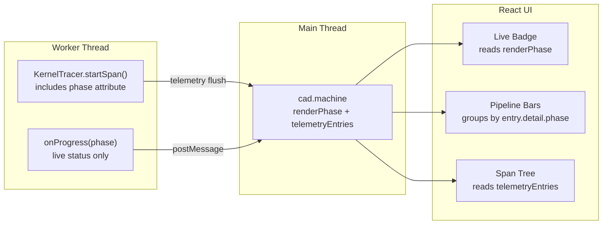

# Pipeline Timing via Phase Attributes

## Architecture

The pipeline bars and the telemetry tree are two views of the same data. Rather than maintaining a separate phase-tracking system, we tag telemetry spans with a `phase` attribute at creation time. The UI groups by `phase` to produce the pipeline summary. The `onProgress` callback remains solely for the live status badge (no timing).



## Phase Attribution Rules

Tag only non-overlapping leaf operations so the UI can sum by phase without self-time calculations:

- `kernel.resolve-deps` -> `phase: 'resolvingDeps'`
- `kernel.bundle` -> `phase: 'bundling'`
- `kernel.extract-params` -> `phase: 'extractingParams'` (when ParameterCache is absent)
- `middleware.wrap(ParameterCache)` -> `phase: 'extractingParams'` (wraps the params chain; subsumes `kernel.extract-params`)
- `kernel.execute` -> `phase: 'computingGeometry'`
- Kernel-specific compute spans (`replicad.run-main`, `replicad.mesh-to-gltf`, `openscad.call-main`, `openscad.convert-geometry`) -> `phase: 'computingGeometry'`
- `postProcessing` = `kernel.render` duration minus sum of all phase-tagged spans (computed in the UI as the remainder)

Note: `kernel.compute` is NOT tagged -- it contains `kernel.bundle` + `kernel.execute` + kernel spans, which are individually tagged to avoid overlap.

## Changes

### 1. Update spans in [kernel-worker.ts](apps/ui/app/components/geometry/kernel/utils/kernel-worker.ts)

**Remove the existing `phase` attribute** from all middleware `wrap` spans (~lines 484-486 and 589-591). The `phase: 'getParameters'` / `phase: 'createGeometry'` values are redundant -- the lifecycle context is already evident from the span's position in the tree. Keep only `middleware`:

```typescript
// getParametersEntry middleware chain (~line 484)
const span = tracer.startSpan(`middleware.wrap(${middlewareName})`, {
  middleware: middlewareName,
});

// createGeometryEntry middleware chain (~line 590)
const span = tracer.startSpan(`middleware.wrap(${middlewareName})`, {
  middleware: middlewareName,
});
```

No middleware wrapper carries a pipeline `phase` -- middleware is infrastructure, not work. This applies to ALL middleware (ParameterCache, GeometryCache, GltfCoordinateTransform, GltfEdgeDetection, etc.).

**Add `phase` attributes** to the innermost framework/kernel operation spans only:

- `kernel.resolve-deps` in `getParametersEntry` (~line 441): add `{ phase: 'resolvingDeps' }`
- `kernel.resolve-deps` in `createGeometryEntry` (~line 547): add `{ phase: 'resolvingDeps' }`
- `kernel.bundle` in `createBundlerFacade` (~line 1231): add `phase: 'bundling'` (merge with existing `{ entryPath }`)
- `kernel.execute` in `createRuntime` (~line 1282): add `{ phase: 'computingGeometry' }`
- `kernel.extract-params` (~line 469): add `{ phase: 'extractingParams' }` (unconditionally)

### 2. Add `phase` attributes to kernel-specific spans

In [replicad.kernel.ts](apps/ui/app/components/geometry/kernel/replicad/replicad.kernel.ts):

- `replicad.run-main` (~line 366) -> add `{ phase: 'computingGeometry' }`
- `replicad.mesh-to-gltf` (~line 412) -> add `{ phase: 'computingGeometry' }` (merge with existing `{ shapeCount }`)

In [openscad.kernel.ts](apps/ui/app/components/geometry/kernel/openscad/openscad.kernel.ts):

- `openscad.call-main` (~line 515) -> add `{ phase: 'computingGeometry' }`
- `openscad.convert-geometry` (~line 534) -> add `{ phase: 'computingGeometry' }`

### 3. No double-counting concern

By tagging only the innermost operations (never middleware wrappers), double-counting is impossible by design:

- **No ParameterCache**: `kernel.extract-params` fires with `phase: 'extractingParams'`. Correct.
- **ParameterCache cache miss**: `kernel.extract-params` fires inside the middleware chain. Only it carries the phase. The middleware wrapper overhead (cache check + write) falls into `postProcessing` as remainder. Correct.
- **ParameterCache cache hit**: the middleware short-circuits, `kernel.extract-params` never fires, so no `extractingParams` phase appears. The small cache lookup time (~3ms) falls into `postProcessing`. Accurate -- no parameter extraction actually happened.

The same pattern applies to the geometry side: when GeometryCache hits, `kernel.compute` never fires, so no `computingGeometry`/`bundling` phases appear. No special-casing needed anywhere.

### 4. Replace brittle derivation in [chat-kernel.tsx](apps/ui/app/routes/builds_.$id/chat-kernel.tsx)

Delete the entire brittle classification block (lines 177-322, ~145 lines):

- `computeBundleChildrenDuration`
- `ClassifiedDurations` type
- `classifySpanDurations`
- `buildPhaseDurationMap`
- `derivePhaseDurations`

Replace with a simple function that groups by `entry.detail?.phase`:

```typescript
function derivePhaseDurations(entries: PerformanceEntryData[]): PipelineData {
  if (entries.length === 0) {
    return emptyPipelineData;
  }

  let renderDuration = 0;
  const phaseDurations = new Map<RenderPhase, number>();

  for (const entry of entries) {
    if (entry.name === 'kernel.render') {
      renderDuration = entry.duration;
    }

    const phase = entry.detail?.['phase'] as RenderPhase | undefined;
    if (phase) {
      phaseDurations.set(phase, (phaseDurations.get(phase) ?? 0) + entry.duration);
    }
  }

  if (renderDuration === 0) {
    return emptyPipelineData;
  }

  const classified = [...phaseDurations.values()].reduce((sum, d) => sum + d, 0);
  const postProcessing = Math.max(0, renderDuration - classified);
  if (postProcessing > 0) {
    phaseDurations.set('postProcessing', postProcessing);
  }

  return { phaseDurations, totalDuration: renderDuration };
}
```

This is ~20 lines replacing ~145 lines, with zero string matching on span names and zero parent-child relationship logic. The `selectPipelineData` selector and `WeakMap` cache remain unchanged.

### 5. No changes to `cad.machine.ts`

The current simplified state is correct:

- `renderPhase: RenderPhase | undefined` for live badge
- `telemetryEntries: PerformanceEntryData[]` for everything else
- `trackProgress` only sets `renderPhase`
- `storeTelemetry` appends entries

No changes needed.
