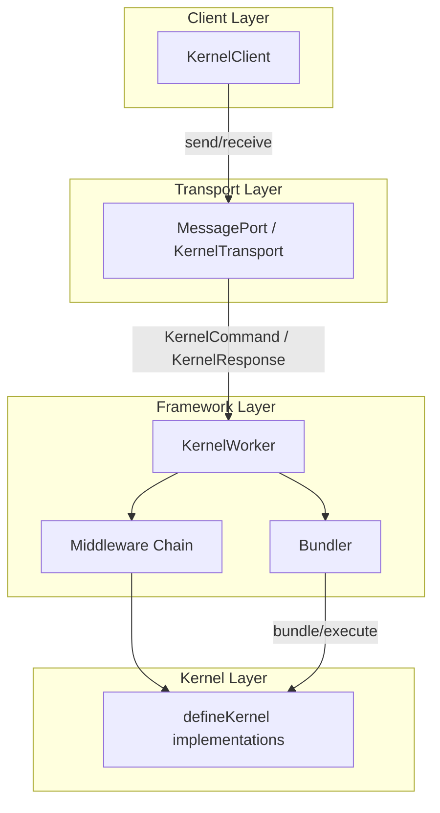
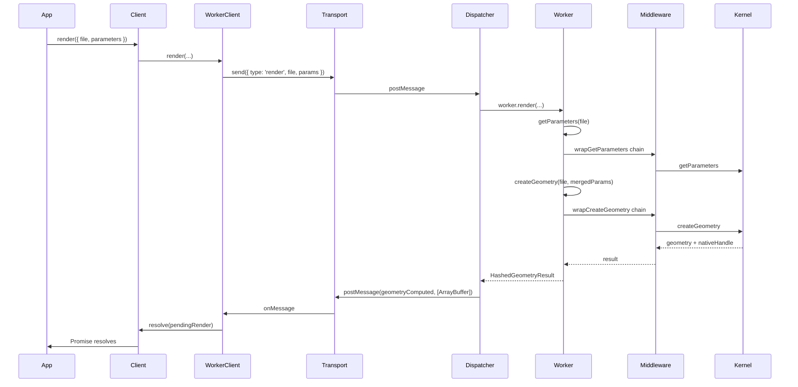

# Architecture

The @taucad/kernels runtime is built as a layered architecture. Each layer has a single responsibility, and data flows unidirectionally from the consumer-facing API down to the CAD engine. Understanding this structure explains why the package supports multiple kernels, middleware, and transport backends without coupling.

## Context and Motivation

CAD kernels (Replicad, OpenSCAD, JSCAD, Zoo) have different execution models: some run in WASM, some call external processes, some connect to remote APIs. A unified API must abstract these differences while preserving isolation (heavy computation must not block the main thread) and extensibility (new kernels and features must plug in without modifying core code). The layered design achieves both.

## How It Works

The runtime has four layers stacked vertically. Each layer depends only on the one below it.

### Client Layer (KernelClient)

The [KernelClient](/docs/api/client) is the primary consumer API. It exposes Promise-based methods (`render()`, `export()`, `connect()`) and event subscription (`on('log')`, `on('progress')`). It does not know about workers or message protocols; it delegates to `KernelWorkerClient`, which wraps the transport. The client lazily initializes the worker and transport on first `connect()` or `render()`.

### Transport Layer (MessagePort)

The [KernelTransport](/docs/api/transport) is a low-level interface: `send(message, transferables?)` and `onMessage(handler)`. The default implementation uses a Web Worker and `postMessage`. The protocol is defined by `KernelCommand` and `KernelResponse` types. This abstraction allows swapping in WebSocket, HTTP, or native FFI without changing the client or framework.

### Framework Layer (KernelWorker, Middleware, Bundler)

The framework runs inside the worker. [KernelWorker](/docs/api/kernels) is the base class that orchestrates:

- **Middleware chain** — Onion-model wrappers around `createGeometry`, `getParameters`, and `exportGeometry`. Middleware runs in registration order (first registered = outermost).
- **Bundler** — Lazy-loaded for JS/TS kernels. Bundles entry files and dependencies, executes code, and supports `detectImports` for kernel selection.
- **Lifecycle** — `initialize()`, `cleanup()`, `notifyFileChanged()` for cache invalidation.

`KernelRuntimeWorker` extends `KernelWorker` and dynamically loads kernel modules via `defineKernel()`. It selects the active kernel per file and delegates to the kernel definition.

### Kernel Layer (defineKernel implementations)

Kernels are plain objects returned by [defineKernel](/docs/api/kernels). They implement `getDependencies`, `getParameters`, `createGeometry`, and `exportGeometry`. No inheritance; state lives in a context returned by `initialize()`. The framework invokes these methods through the middleware chain.

## Data Flow for a render() Call

1. **Client** receives `render()`, calls `ensureConnected()` if needed, then `KernelWorkerClient.render()`.
2. **WorkerClient** sends a `render` command with `requestId` and awaits the matching `geometryComputed` response.
3. **Transport** delivers the command to the worker via `postMessage`. Transferables (e.g., glTF `ArrayBuffer`) are passed for zero-copy.
4. **Dispatcher** routes the command to `worker.render()`, which runs `getParameters` then `createGeometry` through the middleware chain.
5. **Middleware** wraps the kernel; each layer can short-circuit, transform input, or transform output.
6. **Kernel** performs the actual CAD computation and returns geometry plus a native handle for export.
7. The result flows back through middleware, the dispatcher, and the transport. The client resolves the Promise.

## Key Relationships

- **Client and Transport**: The client creates or receives a transport and passes it to `KernelWorkerClient`. Custom transports enable testing (mock transport) or non-browser environments (Node.js worker threads, HTTP).
- **Framework and Kernel**: The framework loads kernel modules by URL, initializes them, and invokes their methods. Kernels receive `KernelRuntime` (filesystem, logger, bundler, execute) and their own context.
- **Middleware and Kernel**: Middleware sits between the framework entry points and the kernel. It has no direct reference to the kernel; it receives a `handler` that continues the chain.

## Implications

- **Testability**: Each layer can be tested in isolation. Mock transports, in-process workers, and kernel stubs are straightforward.
- **Extensibility**: New kernels, middleware, and bundlers plug in via factory functions. No core code changes.
- **Performance**: Transferables avoid copying large geometry buffers. Lazy bundler initialization means non-JS kernels pay no bundling cost.
- **Single worker**: One `KernelRuntimeWorker` hosts all registered kernels. Selection happens per file; only the matching kernel runs.

## Further Reading

- [Plugin System](./plugin-system) — How `defineKernel`, `defineMiddleware`, and `defineBundler` compose
- [Worker Model](./worker-model) — Why Web Workers and the MessagePort protocol
- [API: Client](/docs/api/client) — `createKernelClient` and `KernelClient` types
- [API: Transport](/docs/api/transport) — `KernelTransport` and `createWorkerTransport`
- [Quick Start](/docs/getting-started/quick-start) — End-to-end setup
