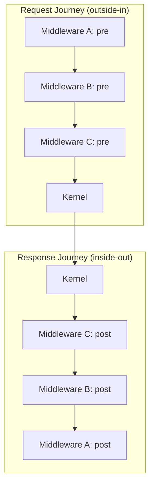

# Middleware Model

Middleware in @taucad/kernels uses the onion model: each layer wraps the next, and code after the inner call runs on the return journey. This pattern enables caching, transformation, and cross-cutting concerns without modifying kernel code.

## Context and Motivation

Kernel operations (getParameters, createGeometry, exportGeometry) often need cross-cutting behavior: caching results, transforming coordinates, adding edge data for rendering. Hard-coding these into each kernel would duplicate logic and couple kernels to UI concerns. Middleware provides a single interception point where such behavior can be composed declaratively. The onion model ensures that even short-circuited results flow through upstream middleware for consistent post-processing.

## How It Works

Each middleware can define wrap-style hooks: `wrapGetParameters`, `wrapCreateGeometry`, and `wrapExportGeometry`. A hook receives `(input, handler, runtime)` and must call `handler(input)` to continue the chain. Code before `handler()` runs on the way down; code after runs on the way back up.

Execution order for `[A, B, C]` with A outermost:

1. A pre → B pre → C pre → kernel
2. kernel returns
3. C post → B post → A post → result to caller

### wrapCreateGeometry, wrapGetParameters, wrapExportGeometry

The three hooks mirror the three kernel operations:

- **wrapCreateGeometry** — Wraps geometry computation. Use for caching (short-circuit on hit), coordinate transforms, or edge detection. Receives `CreateGeometryInput`; returns `CreateGeometryResult`.
- **wrapGetParameters** — Wraps parameter extraction. Use for parameter caching or schema transformation. Receives `GetParametersInput`; returns `GetParametersResult`.
- **wrapExportGeometry** — Wraps export. Use for format conversion or post-processing of export blobs. Receives `ExportGeometryInput`; returns `ExportGeometryResult`.

A middleware can implement any subset. Unimplemented hooks are skipped; the chain passes through directly to the kernel (or the next middleware that implements the hook).

### State Management with Zod stateSchema

Middleware that needs to persist data during an operation can define `stateSchema` (a Zod object schema). The framework creates a `state` object per operation with `state.value` and `state.update(partial)`. Updates are validated against the schema. State is scoped to a single operation; it does not persist across renders.

Example: a cache middleware uses `dependencyHash` as the cache key. It can store `{ cacheKey, cacheHit }` in state before and after calling `handler()`. The state is available on both the request and response journey.

### Comparison to Express/Koa Middleware

Express and Koa use a similar pattern: `(req, res, next) => { ...; next(); ... }`. The @taucad/kernels model differs in two ways:

1. **Wrap style** — Instead of `next()`, you receive `handler` and call `handler(input)`. The return value flows back through the chain. This makes async composition and result transformation natural.
2. **Typed input/output** — Each hook has a specific input and output type. No generic request/response object; the types reflect the operation.

The wrap style is inspired by LangChain's wrap-style middleware hooks and fits Promise-based APIs well.

## Key Relationships

- **Middleware and Kernel**: Middleware never calls the kernel directly. It calls `handler(input)`, which eventually reaches the kernel. The kernel is unaware of middleware.
- **Middleware and Runtime**: Each middleware receives a `KernelMiddlewareRuntime` with `logger`, `filesystem`, `state`, `options`, `dependencies`, and `dependencyHash`. The dependency hash is useful for cache keys.
- **Middleware Order**: Registration order determines wrapping order. First registered = outermost. For caching, put caches early (outer) so they wrap the expensive inner computation.

## Implications

- **Short-circuiting** — A cache hit can return without calling `handler()`. The result still flows through upstream middleware post-processing, so coordinate transforms and edge detection apply to cached results too.
- **No shared mutable state** — State is per-operation. For cross-operation caches, use the filesystem or an external store.
- **Error handling** — If middleware throws, the framework catches it and returns a structured error. Upstream middleware does not run post-processing for that path.

## Further Reading

- [Architecture](./architecture) — Where middleware sits in the stack
- [Plugin System](./plugin-system) — How middleware plugins register
- [Using Middleware](/docs/guides/using-middleware) — Add built-in middleware to your client
- [Create Custom Middleware](/docs/guides/custom-middleware) — Implement middleware with `defineMiddleware`
- [API: Middleware](/docs/api/middleware) — `defineMiddleware`, `KernelMiddleware`, and wrap hook types
