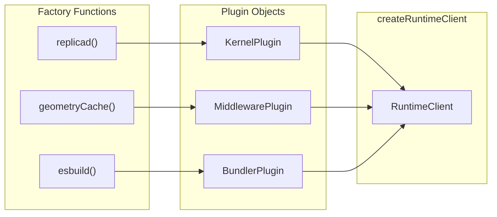

# Plugin System

The @taucad/runtime runtime is extensible through a plugin system. Instead of inheritance hierarchies or configuration files, three plugin types compose via factory functions. This design keeps the core small, enables tree-shaking, and makes the extension surface explicit.

## Context and Motivation

CAD runtimes must support multiple engines (Replicad, Manifold, OpenSCAD, JSCAD, Zoo), multiple preprocessing steps (caching, coordinate transforms), and multiple bundling strategies (esbuild for JS/TS, none for OpenSCAD). Inheritance would force a rigid class hierarchy; configuration files would push logic into strings. Plugins offer a middle path: typed, composable extensions that the framework discovers at runtime through explicit registration.

## How It Works

Three plugin types exist: `KernelPlugin`, `MiddlewarePlugin`, and `BundlerPlugin`. Each is a plain object returned by a factory function. The factory pattern allows options validation and lazy URL resolution.

### KernelPlugin

A [KernelPlugin](/docs/api/kernels) describes a CAD engine. Factory functions like `replicad()`, `manifold()`, `openscad()`, and `zoo()` return a registration object:

- `id` — Unique identifier (e.g., `'replicad'`)
- `moduleUrl` — URL of the `defineKernel` module (resolved via `import.meta.url`)
- `extensions` — File extensions this kernel handles (`['ts', 'js']`, `['scad']`, or `['*']` for catch-all)
- `detectImport` — Optional regex for content-based selection (e.g., `import.*from\s+['"]replicad['"]`)
- `builtinModuleNames` — Module names for bundler-assisted transitive import detection
- `options` — Kernel-specific options passed to `initialize()`

The factory accepts options and merges them into the plugin. For example, `replicad({ withBrepEdges: true })` produces a plugin with `options: { withBrepEdges: true }`.

### MiddlewarePlugin

A [MiddlewarePlugin](/docs/api/middleware) describes an interceptor. Factory functions like `geometryCache()` and `parameterCache()` return:

- `id` — Unique identifier
- `moduleUrl` — URL of the `defineMiddleware` module
- `options` — Middleware-specific options

Middleware order matters: first registered is the outermost layer in the onion model. See [Middleware Model](./middleware-model) for details.

### BundlerPlugin

A [BundlerPlugin](/docs/api/bundler) describes a bundler for specific file extensions. The built-in `esbuild()` handles `['ts', 'js', 'tsx', 'jsx']`:

- `id` — Unique identifier
- `moduleUrl` — URL of the `defineBundler` module
- `extensions` — File extensions this bundler handles
- `options` — Bundler-specific options (e.g., esbuild target)

Multiple bundlers can be registered; the framework routes by extension. A kernel that does not use the bundler (e.g., OpenSCAD) never loads it.

### Composition in createRuntimeClient

When you call `createRuntimeClient({ kernels, middleware, bundlers })`, the client does not instantiate plugins immediately. It stores the plugin objects and passes them to the worker during `initialize()`. The worker then:

1. Loads kernel modules from `moduleUrl` and registers them in `KernelRuntimeWorker`
2. Loads middleware modules and builds the onion chain
3. Loads bundler modules and registers them by extension

Plugins are plain data; no class instances cross the main-thread/worker boundary. Only URLs and options are serialized.

## The Factory Function Pattern

Each plugin type uses a factory rather than a constructor or static method. Benefits:

- **Options validation** — Factories can validate and default options before returning the plugin. Zod schemas (when used) run at factory call time.
- **URL resolution** — `import.meta.url` is resolved in the factory's module context, so each plugin knows its own script location.
- **Immutability** — The returned object is a snapshot. Callers cannot mutate shared state.
- **Tree-shaking** — Unused plugins are never imported; the factory is the single entry point.

Example: `replicad({ withBrepEdges: true })` returns `{ id: 'replicad', moduleUrl: '...', extensions: ['ts','js'], detectImport: /.../, builtinModuleNames: ['replicad'], options: { withBrepEdges: true } }`. The options flow to the kernel's `initialize(options, runtime)` after Zod validation (if `optionsSchema` is defined).

## Why Zod Schemas for Validation

Kernels, middleware, and bundlers can define `optionsSchema` (a Zod object schema). When provided:

- **Type safety** — `z.infer<typeof optionsSchema>` gives TypeScript the options type.
- **Runtime validation** — Invalid options throw at initialization, not during a render.
- **Defaults** — `.default()` on schema fields supplies missing values.

The framework calls `optionsSchema.parse(rawOptions)` before passing options to `initialize()`. This keeps validation in one place and avoids scattered `if (typeof x !== 'string')` checks.

## Key Relationships

- **Plugins and Client**: The client aggregates plugins and forwards them to the worker. The client does not interpret plugin contents.
- **Plugins and Worker**: The worker dynamically imports modules from `moduleUrl` and instantiates them. Kernel definitions implement `KernelDefinition`; middleware implements `KernelMiddleware`; bundlers implement `BundlerDefinition`.
- **Plugins and Selection**: Kernel plugins drive [kernel selection](./kernel-selection). Extension lists, `detectImport`, and `builtinModuleNames` determine which kernel runs for a given file.

## Implications

- **No inheritance** — Kernel authors use `defineKernel`, not `extends KernelWorker`. This reduces coupling and simplifies testing.
- **Lazy loading** — Modules load on first use. A client with Replicad and OpenSCAD only loads the kernel for the file being rendered.
- **Explicit dependencies** — Plugins declare what they need. The framework wires them together; there is no magic injection.

## Further Reading

- [Architecture](./architecture) — How layers compose
- [Middleware Model](./middleware-model) — How middleware wraps kernel operations
- [Kernel Selection](./kernel-selection) — How plugins influence selection
- [API: Kernels](/docs/api/kernels) — `defineKernel` and `KernelDefinition`
- [API: Middleware](/docs/api/middleware) — `defineMiddleware` and `KernelMiddleware`
- [API: Bundler](/docs/api/bundler) — `defineBundler` and `BundlerDefinition`
- [Create Custom Kernel](/docs/guides/custom-kernel) — Implement a kernel with `defineKernel`
- [Create Custom Middleware](/docs/guides/custom-middleware) — Implement middleware with `defineMiddleware`
