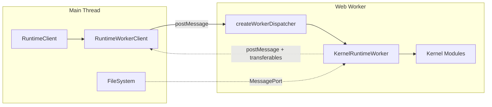

# Worker Model

All kernel computation runs in Web Workers. The main thread stays responsive while CAD operations execute in isolation. Communication uses the MessagePort protocol with transferable support for zero-copy binary data. This design avoids main-thread blocking and enables the same API in browser and Node.js.

## Context and Motivation

CAD kernels perform heavy work: WASM-based geometry computation, bundling, tessellation. Running this on the main thread would freeze the UI. Web Workers provide a separate thread with their own event loop. The challenge is communication: the main thread and worker must exchange commands and results efficiently. Structured clone (the default for `postMessage`) copies data; for multi-megabyte geometry buffers, that is costly. Transferables allow zero-copy transfer of `ArrayBuffer` and `MessagePort` across the boundary. The protocol is kept simple so it can map to other channels (WebSocket, HTTP) if needed.

## How It Works

### Why Web Workers

- **Isolation** — The worker has its own global scope and event loop. Crashes or infinite loops in kernel code do not freeze the main thread.
- **No main-thread blocking** — Geometry computation, bundling, and WASM execution run off the main thread. The UI remains responsive.
- **Memory separation** — Large allocations (WASM heaps, geometry buffers) live in the worker. The main thread can stay lean.

### KernelRuntimeWorker as Multi-Kernel Host

A single worker instance hosts all registered kernels. The `KernelRuntimeWorker` extends `KernelWorker` and dynamically loads kernel modules via `defineKernel()`. When a render is requested, it selects the appropriate kernel (see [Kernel Selection](./kernel-selection)) and delegates to that kernel's methods. This avoids one worker per kernel, which would multiply memory and startup cost.

### MessagePort-Based Communication Protocol

The [RuntimeTransport](/docs/api/transport) interface abstracts the channel: `send(message, transferables?)` and `onMessage(handler)`. The default implementation uses `worker.postMessage()` and `worker.addEventListener('message')`. Messages are typed as `RuntimeCommand` (main → worker) and `RuntimeResponse` (worker → main). Each request/response pair carries a `requestId` for correlation.

Commands include `initialize`, `render`, `export`, `fileChanged`, `configureMiddleware`, `cleanup`. Responses include `initialized`, `geometryComputed`, `exported`, `parametersResolved`, `progress`, `log`, `logBatch`, `telemetry`, `error`.

### Why Not Comlink for the Hot Path

Comlink and similar RPC libraries simplify worker communication by exposing remote objects as proxies. For the kernel hot path, the framework uses a simpler request/response protocol:

- **Explicit transferables** — Geometry buffers must be transferred, not copied. The dispatcher explicitly extracts `ArrayBuffer`s from results and passes them in the `postMessage` transfer list. Comlink's automatic serialization would copy.
- **Batch semantics** — Logs and telemetry are batched and flushed at the end of a render. A proxy-based approach would send many small messages.
- **Control over lifecycle** — The client manages initialization, connection, and termination. A transparent proxy can obscure when the worker is ready or when resources are released.

The protocol is intentionally low-level so that performance-critical paths stay predictable.

### Transferable Support for Zero-Copy Binary Data

When the worker returns geometry (e.g., glTF as `ArrayBuffer`), the dispatcher calls `port.postMessage(response, [buffer])`. The second argument is the transfer list. The buffer is transferred to the main thread; the worker can no longer access it. No copy occurs. For large meshes, this significantly reduces latency and memory pressure.

The framework extracts transferables from `HashedGeometryResult` when the format is `gltf` and the content is an `ArrayBuffer`. The filesystem bridge also uses `extractTransferables()` to transfer `Uint8Array` buffers for file read/write operations, ensuring large CAD files are moved zero-copy between the filesystem worker and kernel workers.

### Generic Bridge Proxy

For application-level RPC (e.g., the `FileManager` protocol), `createBridgeProxy<T>(port)` provides a generic `Proxy`-based client that auto-dispatches method calls over the MessagePort bridge. This eliminates hand-written per-method stubs while preserving full type safety and control over transferables.

## Key Relationships

- **Transport and Client** — The client creates or receives a transport and passes it to `RuntimeWorkerClient`. Custom transports enable testing (mock) or alternative channels (WebSocket for remote workers).
- **Dispatcher and Worker** — The dispatcher is the worker-side message handler. It receives `RuntimeCommand`, invokes `KernelWorker` methods, and sends `RuntimeResponse`. It runs inside the worker.
- **FileSystem and MessagePort** — The filesystem is often in a separate worker or the main thread. A `MessagePort` bridges the runtime worker to the filesystem. The client creates this port via `createBridgePort(fileSystem)` (which returns a `BridgeHandle` with `{ port, dispose() }`) and transfers it during `initialize`. For worker-to-worker bridges, `createFileSystemBridge(worker)` similarly returns a `BridgeHandle`. Call `dispose()` when the bridge is no longer needed to close the underlying ports.

## Implications

- **Async by design** — All kernel operations are async. The client API is Promise-based.
- **Single-threaded worker** — The worker runs one render at a time. Concurrent renders would require multiple workers or a queue.
- **Transfer semantics** — Transferred buffers are moved, not copied. The worker must not retain references after transfer.

## Further Reading

- [Architecture](./architecture) — How the transport fits in the layered design
- [Kernel Selection](./kernel-selection) — How the runtime worker selects kernels
- [API: Transport](/docs/api/transport) — `RuntimeTransport` and `createWorkerTransport`
- [Bundler Configuration](/docs/guides/bundler-configuration) — Worker and bundler setup
- [Filesystem Setup](/docs/guides/filesystem-setup) — Connecting a filesystem to the worker
