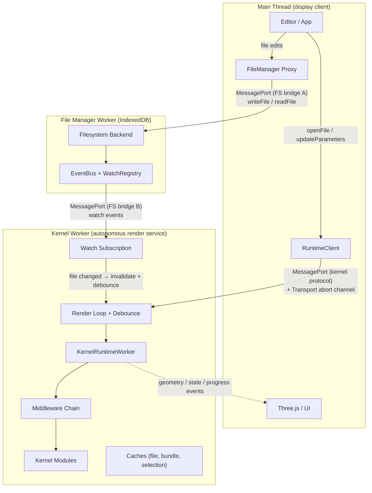
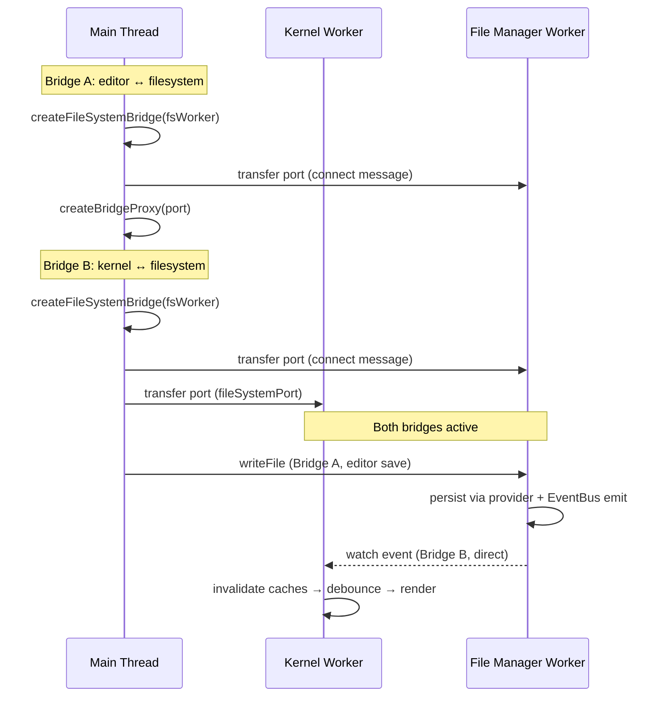
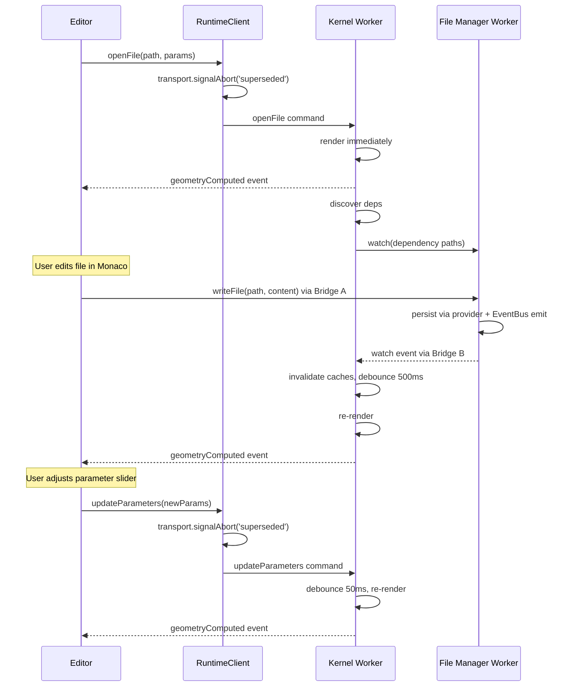

# Architecture

The `@taucad/runtime` is an autonomous reactive render service built on a three-thread topology. The kernel worker watches file dependencies, debounces changes, renders geometry, and pushes results to the main thread -- without the main thread telling it when to act. This mirrors the Language Server Protocol: the worker is a "geometry server" and the main thread is a "display client."

## Context and Motivation

CAD kernels perform heavy computation: WASM-based geometry, bundling, tessellation. Running this on the main thread would freeze the UI. Beyond isolation, the worker owns the dependency graph, cache state, and scheduling decisions. A traditional command-driven model forces the main thread to orchestrate renders without this context, adding round-trip latency and complexity. The autonomous model pushes all scheduling to the worker and reduces the main-thread API to two commands: "here is a file" and "here are new parameters."

## Thread Topology

The runtime spans three threads connected by MessagePort channels and a transport-owned abort signal (backed by `SharedArrayBuffer` on SAB-capable transports):

**Main Thread** -- display and user input. Houses the editor, Three.js renderer, parameter UI, and progress indicators. The editor writes files to the File Manager Worker through a bridge proxy (`createFileSystemBridge` + `createBridgeProxy<FileManagerProtocol>`). The `RuntimeClient` sends `openFile`/`updateParameters`/`setOptions`/`export` commands to the kernel worker and subscribes to geometry, state, and progress events.

**Kernel Worker** -- the autonomous render service. Holds the current file, parameters, watch subscriptions, debounce timers, render generation counter, all caches (file hash, file content, bundle result, kernel selection), and the render loop. Runs middleware and kernel code. Pushes results to the main thread via events.

**File Manager Worker** -- hosts the virtual filesystem (multi-provider backend: DirectIdbProvider, OPFSProvider, FileSystemAccessProvider), an EventBus, and a WatchRegistry. Accepts **two** MessagePort bridge connections: one from the main thread (editor file writes, tree operations) and one from the kernel worker (file reads, watch subscriptions). When a file write lands, the EventBus emits a change event, the WatchRegistry matches it against the kernel worker's subscriptions, and pushes a watch event directly to the kernel worker -- no main-thread relay.

## Filesystem Bridge

The File Manager Worker is the single owner of the virtual filesystem. Other threads access it through `createFileSystemBridge`, which creates a `MessageChannel` and transfers one port to the worker. The worker-side `exposeFileSystem` listens for incoming bridge connections and serves filesystem operations over each port. Two bridges are established at startup:

**Bridge A (main thread → File Manager Worker):** The editor writes files (`writeFile`), reads directory trees, and performs file management operations. When a file is written, the worker's `FileService` persists it via the active provider and emits a `fileWritten` event on the EventBus.

**Bridge B (kernel worker → File Manager Worker):** The kernel worker reads files, resolves dependencies, and subscribes to watch events. The `WatchRegistry` matches EventBus change events against watch subscriptions and pushes watch events directly to the kernel worker over this bridge.

This topology has two important properties: the editor's file writes reach the filesystem without kernel worker involvement, and the kernel worker's watch events arrive without main-thread relay. The main thread never sits on the hot path between a file change and a re-render.

## Protocol

The protocol is asymmetric: few commands in, many event types out, plus a transport-owned abort channel.

### Commands (main thread -> worker)

| Command            | Trigger                          | Worker Behavior                                            |
| ------------------ | -------------------------------- | ---------------------------------------------------------- |
| `openFile`         | User opens file                  | Render immediately, discover deps, start watching          |
| `updateParameters` | User adjusts slider/input        | Store params, debounce 50ms, re-render                     |
| `setOptions`       | User changes tessellation/format | Store options, re-render                                   |
| `export`           | User clicks export               | Export from the last native handle (or self-render inline) |
| `abort`            | Transport without shared memory  | Wire-format equivalent of the transport's abort signal     |

### Events (worker -> main thread, pushed reactively)

| Event                | Trigger              | Main Thread Behavior         |
| -------------------- | -------------------- | ---------------------------- |
| `geometryComputed`   | Render completes     | Update 3D scene              |
| `parametersResolved` | Parameters extracted | Update parameter UI controls |
| `stateChanged`       | Worker state changes | Update progress indicator    |
| `progress`           | During render        | Progress bar                 |
| `error`              | Render fails         | Diagnostics panel            |
| `log` / `telemetry`  | Ongoing              | Console, performance panel   |

### Transport abort channel (out-of-band)

The active [transport](../api/client) owns the abort channel end-to-end. The runtime client calls `transport.signalAbort('superseded')` **before** posting `openFile`/`updateParameters`/`setOptions`; the transport bumps its abort generation (backed by `SharedArrayBuffer` + `Atomics` on SAB-capable transports, or serialised as a wire-format `'abort'` command on SAB-less transports) and the worker's OC Proxy observes the new generation at the next WASM call boundary. The stale render throws an internal abort marker — never surfaced as a consumer-visible error. The runtime client itself never reads `Atomics` or touches a SAB. See [Worker Model](./worker-model) for details.

### One-shot Export Mode

For programmatic one-shot pipelines, `client.export(format, input)` self-renders and resolves a single `ExportResult`. The client sends the command, the worker renders, exports the geometry, and returns the bytes. The single-argument form `client.export(format)` reuses the most recent render result — calling it without one throws `NoRenderOutcomeError`.

## Autonomous Data Flow

The primary interaction pattern. After `openFile`, the worker manages its own render lifecycle. When the user edits a file, the editor writes to the filesystem, the kernel worker detects the change via its watch subscription, and re-renders autonomously:

The main thread sends `openFile` and `updateParameters`. File edits flow through the filesystem bridge. Everything else -- scheduling, dependency watching, cache invalidation, abort, and result delivery -- happens inside the worker.

## Layer Responsibilities

Within the thread topology, four layers stack vertically. Each layer depends only on the one below it.

### Client Layer (RuntimeClient)

The [`RuntimeClient`](../api/client) is the consumer-facing API. `createRuntimeClient(options)` returns a client whose transport handle is materialized during construction (`TransportPlugin.materialize()`); worker spawn and the transport handshake remain lazy until `connect()` or an auto-connect command (`openFile` / `export`). Inline `code:` input runs in an in-memory filesystem. Hosts that own a filesystem supply a wired transport plugin at construction (`transport: webWorkerTransport({ fileSystem: fromChannelFs(...) })`) and call `client.connect()` (no arguments); see [Embedding in a Host](../guides/embedding-in-a-host). `client.on(event, handler)` consumes the event stream, and the active transport owns the abort channel and `postMessage` event delivery — the client itself never touches `SharedArrayBuffer` or `Atomics`. See [Client API](../api/client) for the full reference.

### Transport Layer (MessagePort)

The [`RuntimeTransport`](../api/client) is a low-level interface: `send(message, transferables?)` and `onMessage(handler)`. The default implementation uses a Web Worker and `postMessage`. For testing or Node.js, `createInProcessTransport()` provides an in-process alternative.

### Framework Layer (KernelRuntimeWorker)

The framework runs inside the kernel worker. [`KernelRuntimeWorker`](./worker-model) orchestrates:

- **Kernel selection** -- selects the active kernel per file via extension, regex, or bundler-assisted detection. See [Kernel Selection](./kernel-selection).
- **Middleware chain** -- onion-model wrappers around `createGeometry`, `getParameters`, and `exportGeometry`. See [Middleware Model](./middleware-model).
- **Bundler** -- lazy-loaded for JS/TS kernels. Bundles entry files and dependencies, executes code.
- **Autonomous render loop** -- `openFile` renders immediately; file changes debounce at 500ms; parameter changes debounce at 50ms. See [Render Lifecycle](./render-lifecycle).
- **Abort infrastructure** -- Cooperative abort delivered via the transport's abort channel (SAB-backed where available, wire-format elsewhere) for cancelling superseded renders. The framework never owns the SAB itself.

### Kernel Layer (defineKernel)

Kernels are plain objects returned by `defineKernel`. They implement `getDependencies`, `getParameters`, `createGeometry`, and `exportGeometry`. No inheritance; state lives in a context returned by `initialize()`. The framework invokes these methods through the middleware chain. See [Plugin System](./plugin-system).

## Key Relationships

- **Editor and FileSystem**: The editor writes files to the File Manager Worker through Bridge A (`createBridgeProxy<FileManagerProtocol>`). This is the write path that triggers autonomous re-renders. The main thread never writes files through the kernel worker.
- **Client and Worker**: The client creates or receives a transport and passes it to `RuntimeWorkerClient`. The transport carries `RuntimeCommand` and `RuntimeResponse` messages. Custom transports enable testing or non-browser environments.
- **Worker and FileSystem**: The kernel worker accesses the filesystem through Bridge B. In autonomous mode, it subscribes to file change events scoped to the current file's dependency graph. Watch events flow directly from the File Manager Worker -- they never pass through the main thread.
- **Framework and Kernel**: The framework loads kernel modules by URL, initializes them, and invokes their methods. Kernels receive `KernelRuntime` (filesystem, logger, bundler, execute, tracer) and their own context.
- **Middleware and Kernel**: Middleware sits between the framework and the kernel. It has no direct reference to the kernel; it calls `handler(input)` to continue the chain.

## Implications

- **Testability**: Each layer can be tested in isolation. Mock transports, in-process workers, and kernel stubs are straightforward.
- **Extensibility**: New kernels, middleware, and bundlers plug in via factory functions. No core code changes.
- **Performance**: Transferables avoid copying large geometry buffers. The filesystem bridge eliminates main-thread relay for watch events. The transport-owned abort channel avoids wasting CPU on superseded renders.
- **Single worker**: One `KernelRuntimeWorker` hosts all registered kernels. Selection happens per file; only the matching kernel runs.

## Further Reading

- [Worker Model](./worker-model) -- Web Workers, transport abort channel, and the autonomous render service
- [Render Lifecycle](./render-lifecycle) -- Detailed render loop, cancellation strategies, and signal channel
- [Plugin System](./plugin-system) -- How `defineKernel`, `defineMiddleware`, and `defineBundler` compose
- [API: Client](../api/client) -- `createRuntimeClient` and `RuntimeClient` types
- [API: Transport](../api/client) -- `RuntimeTransport` and `createWorkerTransport`
- [Set Up the Filesystem](../guides/filesystem-setup) -- Connecting a filesystem to the worker
- [Quick Start](../getting-started/quick-start) -- End-to-end setup
