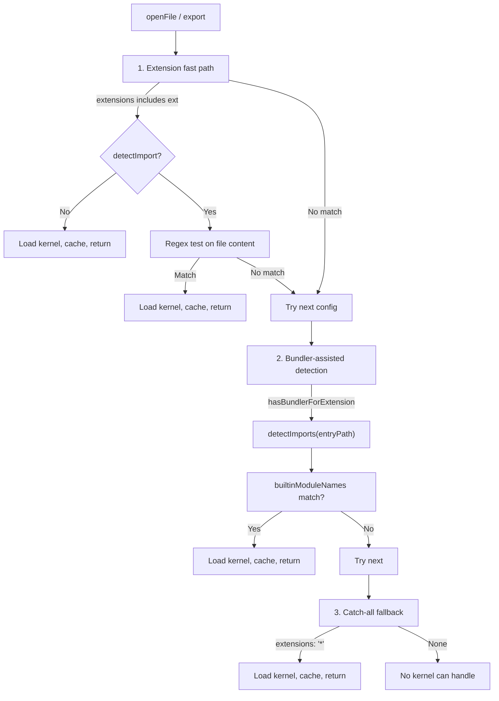

# Kernel Selection

When you call `openFile({ file })` or `export(format, { file })`, the runtime must choose which kernel handles the file. Extension alone is insufficient: `.ts` files might use Replicad, OpenCASCADE, or JSCAD depending on imports. The selection cascade uses three strategies in order, with caching to avoid repeated work.

## Context and Motivation

Different CAD kernels handle different file types: OpenSCAD for `.scad`, Zoo for `.kcl`, Replicad, OpenCASCADE, and JSCAD for `.ts`/`.js`. For JS/TS, the same extension can map to multiple kernels; the decision depends on which library the file imports (e.g., `replicad` vs `@jscad/modeling` vs `opencascade.js`). The selection logic must be fast for common cases (extension match) and accurate for ambiguous cases (bundler-assisted import analysis). Caching ensures that repeated renders of the same file skip detection.

## How It Works

The selection runs inside [`KernelRuntimeWorker`](./worker-model)`.selectKernel()`. It tries three passes in order; the first match wins.

### Pass 1: Extension Fast Path

For each kernel config in registration order:

1. Check if the file extension is in `config.extensions` (or config has `extensions: ['*']`).
2. If `extensions: ['*']`, store as catch-all and continue (defer to pass 3 if nothing else matches).
3. If no `detectImport`, select this kernel immediately. Examples: `.scad` -> OpenSCAD, `.kcl` -> Zoo.
4. If `detectImport` exists, read the file and run the regex. On match, select this kernel. Example: `.ts` with `import ... from 'replicad'` -> Replicad.

This pass is fast: at most one file read when regex detection is needed. No bundling.

### Pass 2: Bundler-Assisted Transitive Import Analysis

When the file extension has a registered bundler (e.g., `.ts` with esbuild):

1. Call `bundler.detectImports({ entryPath })`. This uses the bundler in a lightweight mode to discover transitive imports without full bundling.
2. Compare detected bare-specifier imports to each kernel's `builtinModuleNames`. A kernel matches if any of its builtin names appear (e.g., `replicad` or `replicad/utils`).
3. The first matching kernel wins. Dependencies from the detection pass are cached for the subsequent `getDependencies` call to avoid re-running the bundler.

This pass handles cases where the entry file does not directly import the kernel (e.g., it imports a local module that imports `replicad`). The regex in pass 1 would miss this; the bundler traces the full import graph.

### Pass 3: Catch-All Fallback

If a kernel registered with `extensions: ['*']` was found in pass 1, select it now. The Tau converter kernel uses this to handle STEP, STL, 3MF, and other import formats that have no dedicated kernel.

If no kernel matches at all, selection returns `undefined`. The framework reports that no kernel can handle the file.

## Why This Layered Approach

- **Performance** -- Extension and regex are cheap. Bundler detection is more expensive; it runs only when extension/regex fail or when multiple kernels share an extension.
- **Correctness** -- Regex can only see the entry file. Transitive imports require the bundler. Catch-all ensures a fallback for unknown formats.
- **Priority** -- Kernel order in `createRuntimeClient({ kernels: [...] })` matters. When multiple kernels match, the first wins. Put specific kernels before catch-all.

## Caching of Selection Results

Selection results are cached in `selectionCache` keyed by file path. On a cache hit, the same kernel is used without re-running detection.

In autonomous rendering mode (the default), the worker's filesystem watch subscription handles cache invalidation automatically when files change. When inline code is supplied via `openFile({ code, file, parameters })`, the runtime client notifies the worker about the inline file paths so the bundler/selection caches re-resolve on the next render.

## Key Relationships

- **Selection and Plugins** -- Kernel plugins supply `extensions`, `detectImport`, and `builtinModuleNames`. These drive all three passes.
- **Selection and Bundler** -- The bundler plugin must implement `detectImports` for pass 2. The esbuild bundler does this via a lightweight build with externals extraction.
- **Selection and Worker** -- Selection runs inside the worker. The client sends `openFile`/`export` and the worker selects the kernel before calling `getParameters` or `createGeometry`.

## Implications

- **Order matters** -- Register kernels in priority order. Put Replicad before JSCAD if both match `.ts` and you prefer Replicad for ambiguous cases.
- **Catch-all last** -- The Tau kernel (`extensions: ['*']`) should typically be last so specific kernels get first chance.
- **Automatic invalidation** -- In autonomous mode, file changes trigger re-selection automatically through the worker's watch subscription.

## Further Reading

- [Architecture](./architecture) -- Where selection runs in the worker
- [Plugin System](./plugin-system) -- How kernel plugins declare extensions and detection
- [Worker Model](./worker-model) -- How the runtime worker hosts multiple kernels
- [Render Lifecycle](./render-lifecycle) -- How file changes trigger re-renders and re-selection
- [Choose a Kernel](../guides/choosing-a-kernel) -- Practical guide to kernel selection
- [API: Kernels](../api/kernels) -- `KernelPlugin` and kernel factory functions
