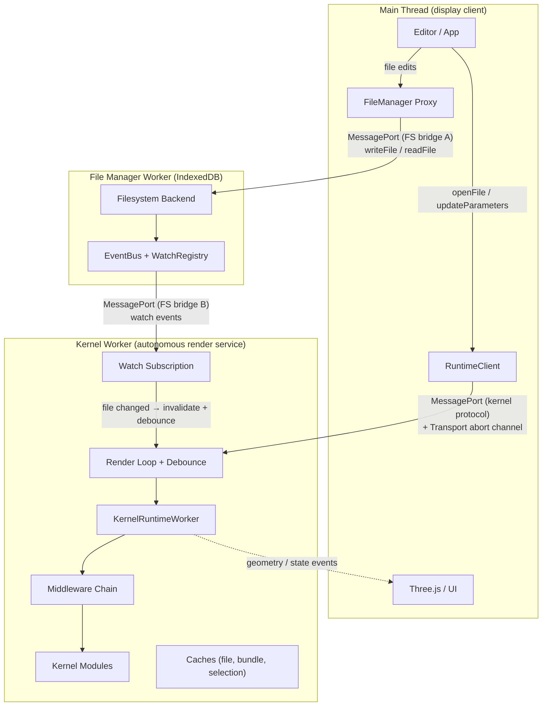
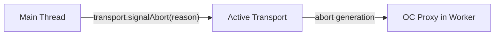

# Worker Model

The runtime worker is an **autonomous reactive render service**. It watches file dependencies, debounces changes, renders geometry, and pushes results -- without the main thread telling it when to act. Communication uses MessagePort for commands/events and a transport-owned abort channel (backed by `SharedArrayBuffer` on SAB-capable transports) for instant render abort. This design mirrors the Language Server Protocol pattern: the worker is a "geometry server" and the main thread is a display client.

## Context and Motivation

CAD kernels perform heavy work: WASM-based geometry computation, bundling, tessellation. Running this on the main thread would freeze the UI. Web Workers provide a separate thread with their own event loop. Beyond isolation, the worker owns scheduling decisions: it knows the dependency graph, cache state, and which renders are stale. Pushing this intelligence to the worker eliminates unnecessary main-thread round-trips and enables instant abort of superseded renders.

## How It Works



### Why Web Workers

- **Isolation** -- The worker has its own global scope and event loop. Crashes or infinite loops in kernel code do not freeze the main thread.
- **No main-thread blocking** -- Geometry computation, bundling, and WASM execution run off the main thread. The UI remains responsive.
- **Memory separation** -- Large allocations (WASM heaps, geometry buffers) live in the worker. The main thread can stay lean.

### KernelRuntimeWorker as Multi-Kernel Host

A single worker instance hosts all registered kernels. The `KernelRuntimeWorker` dynamically loads kernel modules via `defineKernel()`. When a render is requested, it selects the appropriate kernel (see [Kernel Selection](./kernel-selection)) and delegates to that kernel's methods. This avoids one worker per kernel, which would multiply memory and startup cost.

### Autonomous Render Loop

After receiving `openFile`, the worker manages its own render lifecycle:

1. **openFile(file, params)** -- Store file and params. Render immediately (aborting any in-progress render). Discover dependencies. Set up filesystem watch subscription. Push `geometryComputed`.

2. **Watch event (file in dependency graph changed)** -- Invalidate caches. Start/reset 500ms debounce timer. On timer fire: render (aborting any in-progress render). Discover new deps and diff watch set. Push `geometryComputed`.

3. **updateParameters(params)** -- Store new params. Start/reset 50ms debounce timer. On timer fire: render (aborting any in-progress render). Push `geometryComputed`.

4. **setOptions(options)** -- Store new render options for the active file (e.g. tessellation tolerances). Re-render with the same supersession semantics as `updateParameters`.

5. **export(format)** -- Export from the last native handle. Push exported result.

### Filesystem Bridge

The File Manager Worker is the single owner of the virtual filesystem. It accepts multiple MessagePort bridge connections via `exposeFileSystem(handlers, { watchHandler })`. Two bridges are established at startup:

**Bridge A (main thread):** The editor and file manager UI use `createFileSystemBridge(fsWorker)` + `createBridgeProxy<FileManagerProtocol>(port)` to write files, read directory trees, and perform file management operations. When a file is written, `FileService` persists it via the active provider and emits a `fileWritten` event on the EventBus.

**Bridge B (kernel worker):** The active [transport](../api/client) owns the kernel-worker bridge end-to-end. Consumers pass an opaque `RuntimeFileSystem` to the transport at construction — `fromChannelFs(fsWorker)` for the worker arm, `fromMemoryFs()`/`fromFsLike()`/`fromNodeFs()`/`fromBrowserFs()` for inline arms — and the transport constructs the `MessagePort` internally, transferring it to the kernel worker as part of `initialize`. The kernel worker creates a `createBridgeProxy<RuntimeFileSystemBase>(port)` for file reads, dependency resolution, and watch subscriptions. Bridge ports are disposed automatically when the runtime client terminates; consumers never call `createFileSystemBridge` themselves.

This dual-bridge design means editor writes (Bridge A) trigger watch events to the kernel worker (Bridge B) without any main-thread relay. The main thread never sits on the hot path between a file change and a re-render.

For environments without a separate filesystem worker (e.g., Node.js or testing), the inline arms wire `createBridgePort(fileSystem)` internally and use the same protocol — `watch` is auto-propagated when the inlined object exposes a `watch` method.

### Transport Abort Channel

The abort signal must be readable during **synchronous WASM execution**, when the worker's event loop is blocked and cannot process messages. The active [transport](../api/client) owns this channel end-to-end — on SAB-capable transports it backs the channel with a `SharedArrayBuffer` so the kernel can see the abort generation while the event loop is blocked; on transports without shared memory (e.g. a future websocket transport) the same `signalAbort(reason)` API instead serialises a wire-format `'abort'` command. Either way, the runtime client and worker client never read `Atomics` or touch a SAB directly:



When the main thread calls `openFile()`, `updateParameters()`, or
`setOptions()`:

1. The active [transport](../api/client) raises the abort generation via `signalAbort('superseded')` **before** posting the wire-format command.
2. The worker may be mid-WASM. Its event loop is blocked. The message queues.
3. The next OC Proxy call observes the new abort generation -- throws an internal abort marker (never surfaced to consumers; supersession is observed via `RenderOutcome.superseded`).
4. The render aborts. The worker's event loop resumes and processes the queued message.
5. New render starts.

The transport-owned signal channel uses two `Int32` slots — every other worker-to-main signal flows through the single ordered `postMessage` event channel. The slot layout is `@internal` to the transport implementations; consumers of `RuntimeTransport` only see the `signalAbort(reason)` API:

| Slot                  | Direction      | Owner                  | Purpose                                                              |
| --------------------- | -------------- | ---------------------- | -------------------------------------------------------------------- |
| `abortGeneration` (0) | main -> worker | Transport (SAB-backed) | Bumped whenever the main thread supersedes/timeouts the render.      |
| `abortReason` (1)     | main -> worker | Transport (SAB-backed) | Carries `superseded` vs `timeout` so the worker can route the abort. |

Worker-to-main events (state transitions, progress, geometry, telemetry,
parameters) are delivered via the transport's `postMessage` channel and
fanned out by `RuntimeTransport.onWorkerStateChange` and `client.on(...)`.

### Per-Kernel Abort Capabilities

| Kernel          | Proxy abort | Async abort | Mid-WASM abort? | Worst-case latency   |
| --------------- | ----------- | ----------- | --------------- | -------------------- |
| **Replicad**    | Yes         | Yes         | Yes             | < 1ms (next OC call) |
| **OpenCASCADE** | Yes         | Yes         | Yes             | < 1ms (next OC call) |
| **JSCAD**       | N/A         | Yes         | N/A             | < 10ms (next await)  |
| **Manifold**    | Possible    | Yes         | Possible        | < 10ms               |
| **Zoo/KCL**     | N/A         | Yes         | N/A             | < 50ms               |
| **OpenSCAD**    | N/A         | No          | No              | Full render duration |
| **Tau**         | N/A         | Yes         | N/A             | < 10ms               |

### MessagePort-Based Communication Protocol

The [RuntimeTransport](../api/client) interface abstracts the channel: `send(message, transferables?)` and `onMessage(handler)`. The default implementation uses `worker.postMessage()` and `worker.addEventListener('message')`. Messages are typed as `RuntimeCommand` (main -> worker) and `RuntimeResponse` (worker -> main).

### Transferable Support for Zero-Copy Binary Data

When the worker returns geometry (e.g., glTF as `ArrayBuffer`), the dispatcher calls `port.postMessage(response, [buffer])`. The buffer is transferred to the main thread; the worker can no longer access it. No copy occurs. For large meshes, this significantly reduces latency and memory pressure.

The filesystem bridge also uses `extractTransferables()` to transfer `Uint8Array` buffers for file read/write operations, ensuring large CAD files are moved zero-copy between workers.

### Comparison to Prior Art

**VS Code Language Server Protocol:**

| Concept         | LSP                           | Tau Runtime                                  |
| --------------- | ----------------------------- | -------------------------------------------- |
| Server role     | Autonomous analysis service   | Autonomous render service                    |
| Client role     | Display + user input          | Display + user input                         |
| Communication   | JSON-RPC events               | MessagePort events + transport abort channel |
| File watching   | Server watches workspace      | Worker watches dependency graph              |
| Result delivery | Push diagnostics, completions | Push geometry, parameters, errors            |
| Lifecycle       | Client starts/stops server    | Main thread creates/terminates worker        |

**Vite HMR:**

| Concept          | Vite                           | Tau Runtime                                       |
| ---------------- | ------------------------------ | ------------------------------------------------- |
| File watcher     | chokidar (OS-level)            | FileSystem watch (VFS-level)                      |
| Dependency graph | Module graph (import analysis) | Bundle deps (esbuild metafile) + kernel resolvers |
| Debounce         | HMR batching                   | Worker-internal 500ms/50ms timers                 |
| Rebuild trigger  | HMR update pushed to browser   | `geometryComputed` pushed to main thread          |

## Key Relationships

- **Transport and Client** -- The client creates or receives a transport and passes it to `RuntimeWorkerClient`. Custom transports enable testing (mock) or alternative channels.
- **Dispatcher and Worker** -- The dispatcher is the worker-side message handler. It receives `RuntimeCommand`, invokes worker methods, and sends `RuntimeResponse`.
- **Editor and FileSystem** -- The editor writes files to the File Manager Worker through Bridge A. These writes trigger EventBus emissions that feed the kernel worker's watch subscriptions, closing the loop between user edits and autonomous re-renders.
- **FileSystem and Worker** -- The kernel worker accesses the filesystem through Bridge B. Watch events flow directly between the File Manager Worker and the kernel worker without main-thread relay. In autonomous mode, the kernel worker subscribes to file change events scoped to the current file's dependency graph.

## Topology Recipes

The runtime architecture exposes two orthogonal planes — **transport** (the wire plus execution location) and **filesystem** (the source of truth for files). Each topology resolves to one config object on each side; the table below shows the canonical recipes that ship today (T1, T2) plus the Phase 1 / Phase 2 targets (T3, T4) that the same primitives unlock without core changes. Every variation in [Architecture](./architecture) is a re-combination of these two planes.

### T1 — Browser UI (Tau today)

The host page owns a kernel `Worker` and a file-manager `Worker`. The transport runs the wire in the kernel worker; the runner hosts kernel modules in the same worker; the filesystem lives in the FM worker, accessed over a `MessagePort` bridge.

```typescript
import { createRuntimeClient, presets } from '@taucad/runtime';
import { webWorkerTransport } from '@taucad/runtime/transport/web';
import { fromChannelFs } from '@taucad/runtime/filesystem';

const fmWorker = new Worker(new URL('./fm-worker.ts', import.meta.url), { type: 'module' });

const client = createRuntimeClient({
  ...presets.all(),
  transport: webWorkerTransport({
    fileSystem: fromChannelFs(fmWorker),
  }),
});
await client.connect();
```

The transport defaults to its bundled worker entry; pass an explicit `url:` only when hosting a custom worker module that composes `KernelRuntimeWorker` with **`webWorkerHost`** (imported from `@taucad/runtime/transport/web-worker-host` or via the bundled worker entry) directly.

### T2 — In-process Node CLI / tests

A single Node process owns everything. The transport bridges main thread ⇄ in-process dispatcher; the runner hosts the kernel in the same V8 isolate; the filesystem is a `RuntimeFileSystemBase` on a local directory. The TR16 fast path skips the `MessagePort` round-trip and hands the FS to the kernel directly.

```typescript
import { createNodeClient } from '@taucad/runtime/node';

const client = await createNodeClient('/path/to/project');
// under the hood: presets.all() + inProcessTransport({ fileSystem: fromNodeFs('/path/to/project') })
```

### T3 — Electron renderer + main + worker_thread kernel (Phase 1)

The main process owns the FS authority and a `worker_threads.Worker` kernel host. The renderer is purely a display client — it speaks the kernel protocol over an Electron `MessagePortMain` pair. No kernel code, no FS access, and no bundler ever runs in the renderer.

```typescript
import { createRuntimeClient, presets } from '@taucad/runtime';
import type { TransportPlugin } from '@taucad/runtime/transport';

/** Electron apps supply a wired transport plugin (e.g. app-local `electronUtilityTransport` — see `examples/electron-tau`). */
export function createElectronRendererClient(transport: TransportPlugin): ReturnType<typeof createRuntimeClient> {
  return createRuntimeClient({
    ...presets.all(),
    transport,
  });
}
```

On the main / utility-process side, pair this with `createRuntimeHost` from `@taucad/runtime/host` and the worker transport host factory that matches your topology (`nodeWorkerHost` wiring lives next to the Node worker entry — follow `examples/electron-tau` for a complete IPC host).

### T4 — Multi-window Electron (single source of truth)

Same shape as T3 with one main-process `createRuntimeHost(...)` shared across every window. Each window opens its own `MessageChannelMain` and connects through the renderer recipe above; the host multiplexes on the channel and serves the same `fileSystem` instance. Per-window draft isolation routes through subdirectory mounts in Phase 1 and through a per-window `OverlayFileSystem` in Phase 2 — the runner / transport / FS shape does not change.

### Why three planes (rather than three transports)

A topology is `{ transport, fileSystem }`. The transport knows about the wire and execution location. The FS service knows about authority. Mixing them — for example a `'sharedWorkerTransport'` that also assumes a same-isolate FS — produces N transports instead of `N + M` plug points and silently regresses cross-process topologies. T1–T4 share the same primitives; only the bindings change.

## Implications

- **Async by design** -- All kernel operations are async. The client API is Promise-based or event-driven.
- **Single-threaded worker** -- The worker runs one render at a time. Abort ensures stale renders are cancelled quickly so the latest render starts with minimal delay.
- **Transfer semantics** -- Transferred buffers are moved, not copied. The worker must not retain references after transfer.
- **Cross-origin isolation** -- The default in-process and worker transports back the abort channel and geometry pool with `SharedArrayBuffer`, which requires COOP + COEP headers. This is already a prerequisite for OpenCASCADE's pthread support via `assertCrossOriginIsolated()`. Consumers never touch SAB directly; only the transport sees it.

## Further Reading

- [Architecture](./architecture) -- How the transport fits in the layered design
- [Render Lifecycle](./render-lifecycle) -- Detailed render loop, cancellation strategies, and concurrency model
- [Kernel Selection](./kernel-selection) -- How the runtime worker selects kernels
- [API: Transport](../api/client) -- `RuntimeTransport` and `createWorkerTransport`
- [Configure the Bundler](../guides/bundler-configuration) -- Worker and bundler setup
- [Set Up the Filesystem](../guides/filesystem-setup) -- Connecting a filesystem to the worker
