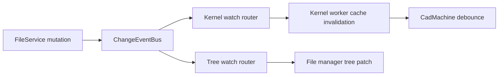

# Filesystem Policy

Internal reference for filesystem access, data transfer, caching, and concurrency in the Tau application. Applies to all code that reads or writes user project data, cache files, or metadata through ZenFS.

## Rationale

A single-writer topology with zero-copy binary transfer and bounded caches prevents ZenFS directory corruption and memory bloat. Separate kernel and UI watch planes avoid coupling render invalidation to tree refresh, and explicit overflow handling ensures deterministic behavior under load.

## Core Principles

1. **Single writer, many readers** — all mutating FS operations flow through one worker with one serialization queue
2. **Zero-copy binary transfer** — `Uint8Array` payloads must use `postMessage` transfer lists, never structured clone alone
3. **Lazy loading over eager recursion** — never traverse a directory tree deeper than the consumer needs
4. **Bounded caches** — every in-memory cache must have an eviction policy (TTL, max size, or LRU)
5. **Debounce refresh, don't spam** — background tree refreshes must be debounced; rapid mutations must coalesce
6. **Kernel watcher fast path first** — file change -> kernel invalidation must not route through `use-build.tsx` fanout
7. **Server-side watch filtering** — path/include/exclude/event filtering happens in the worker, not in clients
8. **Loss-aware event streams** — watcher overflow/dropped-event conditions must trigger explicit resync behavior

## Access Topology

```
Main Thread                       File Manager Worker              Kernel Worker
     │                                   │                               │
     │◄── createBridgeProxy             │              createBridgeProxy ──►│
     │    <FileManagerProtocol>         │              <RuntimeFileSystemBase>│
     │    (MessagePort)                  │              (MessagePort)        │
     │   readFile, writeFile, stat       │   readFile, readFiles, stat   │
     │   readShallowDirectory            │   exists, readdir             │
     │   reconfigure, readBackendFileTree│   writeFile (cache only)      │
     │                                   │                               │
     │                                   │         ZenFS                 │
     │                                   │   IndexedDB / WebAccess /    │
     │                                   │   OPFS / Memory              │
```

All filesystem I/O runs on the file manager worker. The main thread and kernel workers access it exclusively via MessagePort RPC using the **same bridge mechanism** (`createFileSystemBridge` → `MessageChannel` → `createBridgeProxy`). The only difference is the TypeScript type used for the proxy:

- **Main thread**: `createBridgeProxy<FileManagerProtocol>` — full API including worker management (`reconfigure`, `setDirectoryHandle`), diagnostics (`readBackendFileTree`), and higher-level operations (`copyDirectory`, `getZippedDirectory`)
- **Kernel worker**: `createBridgeProxy<RuntimeFileSystemBase>` — 11 base primitives only (`readFile`, `writeFile`, `stat`, `readdir`, `exists`, etc.)

This is the Interface Segregation Principle (ISP): kernels receive a narrow API surface matching their needs. Both proxies talk to the same worker, same `fileManager` object, same bridge server. No thread may import or use ZenFS directly outside the worker.

## Read Rules

### Rule 1: Shallow reads by default

Always read a single directory level unless the consumer provably needs deep recursion.

```typescript
// CORRECT: Shallow read for tree display
readShallowDirectory(path, backend);

// INCORRECT: Full recursive read for tree display
readBackendFileTree(backend); // Traverses entire FS depth-first
```

Deep reads are permitted only for: `getDirectoryContents` (ZIP/copy), startup-only `getDirectoryStat` hydration, and `readFiles` (kernel dependency batch). Deep reads are forbidden in mutation-triggered refresh paths.

### Rule 2: Parallel stat, sequential traversal

When listing a single directory, `readdir` + parallel `Promise.all(stat(...))` is preferred over sequential `stat` calls. Recursive traversal (when needed) should be sequential at the directory level to avoid overwhelming the storage backend.

```typescript
// CORRECT: Parallel stat for one directory
const entries = await fs.readdir(path);
const stats = await Promise.all(entries.map((e) => fs.stat(joinPath(path, e))));

// INCORRECT: Sequential stat for one directory
for (const entry of entries) {
  const stat = await fs.stat(joinPath(path, entry)); // Unnecessary serialization
}
```

### Rule 3: Read caching expectations

| Layer                    | Cache                          | Eviction                      | Notes                                  |
| ------------------------ | ------------------------------ | ----------------------------- | -------------------------------------- |
| File manager `openFiles` | `Map<path, Uint8Array>`        | Must have max size + TTL      | Stores recently accessed file contents |
| Monaco `syncedPaths`     | Internal set                   | TTL 1h, max 200               | Background-synced JS/TS models         |
| Kernel geometry cache    | `.tau/cache/geometry/*.bin`    | Max age + max entries         | MessagePack serialized meshes          |
| Kernel parameter cache   | `.tau/cache/parameters/*.json` | None currently                | JSON parameter snapshots               |
| Standalone FS instances  | Per-backend                    | Must be reused, not recreated | One per backend, cached in worker      |

### Rule 4: File size awareness

Source files are typically <100 KB. Binary CAD files (STL, STEP, glTF) can be 10-100 MB. All read paths must handle large binaries without blocking the event loop:

- Kernel file reads transfer via `ArrayBuffer` transfer lists (zero-copy)
- Main thread reads should avoid storing large binaries in `openFiles`
- Future: streaming reads for files > 1 MB

## Write Rules

### Rule 5: Write serialization scope

All mutating operations (`writeFile`, `writeFiles`, `mkdir`, `rename`, `unlink`, `rmdir`) must be serialized through the global write queue to prevent ZenFS directory listing corruption (zen-fs/core#256).

Future optimization: per-directory serialization when ZenFS fixes the TOCTOU bug. Until then, global serialization is required.

### Rule 6: Transfer, don't clone

Binary data sent to the worker for writes must use `extractTransferables` to build a transfer list. The sender's buffer is detached after transfer — do not reference it after `postMessage`.

```typescript
// CORRECT: Transfer
port.postMessage(response, extractTransferables(response));

// INCORRECT: Structured clone (double memory, double copy)
port.postMessage(response);
```

### Rule 7: Mutation → targeted invalidation

After a mutation (delete, rename, upload), invalidate only the parent directory of the affected path, not the entire tree. The caller must provide the affected path so the UI can selectively refresh.

```typescript
// CORRECT: Invalidate parent
const parentPath = path.substring(0, path.lastIndexOf('/')) || '/';
reloadDirectory(parentPath, backend);

// INCORRECT: Reload entire tree
loadColumnTree(backend); // Full recursive traversal
```

## Tree Refresh Rules

### Rule 8: Debounce background refresh

The `spawnBackgroundRefresh` actor (triggered by `fileWritten`, `fileRenamed`, `fileDeleted`) must be debounced. Rapid mutations (AI code streaming, batch imports) should coalesce into a single refresh after the burst settles.

Recommended debounce: 300-500ms after the last mutation event. VS Code uses 500ms.

### Rule 9: Deduplication via in-flight map

Use a synchronous `Map<key, Promise>` (not React state) to deduplicate concurrent requests for the same directory. This prevents race conditions across render cycles.

```typescript
// CORRECT: Synchronous dedup via ref
const inflightRef = useRef(new Map<string, Promise>());
if (inflightRef.current.has(key)) return inflightRef.current.get(key);
const promise = readShallowDirectory(path, backend);
inflightRef.current.set(key, promise);

// INCORRECT: React state check (async, racy)
if (loadingPaths.has(path)) return; // State may be stale
```

### Rule 10: Error recovery on expand

If a directory load fails, do not cache the failure. Allow retry on the next expand attempt. Optionally collapse the failed node (VS Code pattern).

## Backend & Provider Rules

### Rule 11: Backend isolation

Each backend (`indexeddb`, `webaccess`, `opfs`, `memory`) is an independent storage system. Operations on one backend must not affect another. The files route shows backends side-by-side; each column maintains its own state.

### Rule 12: Standalone FS instance safety and reuse

Standalone `FileSystem` instances (created via `resolveMountConfig`) are used to read from specific backends without affecting the main mount (e.g., the files route grid showing all backends side-by-side).

**Safety**: Standalone read-only instances are safe to use alongside the main mounted FS. ZenFS's TOCTOU bug (zen-fs/core#256) only affects concurrent _writers_ — the read-modify-write cycle on directory listings. A standalone instance that only calls `readdir` + `stat` cannot trigger this corruption. The main risk is stale reads (file deleted between `readdir` and `stat`), which is handled by try/catch around individual stat calls.

**Reuse**: Cache the standalone `FileSystem` instance per backend in the worker. Each `resolveMountConfig` call creates a new `IDBDatabase` connection and preloads the entire store into memory. Creating one per call is wasteful.

```typescript
// CORRECT: Cache and reuse
const standaloneInstances = new Map<string, FileSystem>();
function getStandaloneFs(backend): FileSystem {
  /* create or reuse */
}

// INCORRECT: Create per call
const fs = await resolveMountConfig({ backend: IndexedDB, storeName }); // New connection + full preload
```

**Write prohibition**: Standalone instances must never be used for writes. All writes must go through the main mounted FS and its serialization queue.

### Rule 13: WebAccess handle lifecycle

`FileSystemDirectoryHandle` is structured-clonable (not transferable). It must be explicitly passed from the main thread to the worker via `setDirectoryHandle` before `reconfigure('webaccess')`. Permission must be re-requested from a user gesture after page reload.

## RPC Pattern Rules

### Rule 14: Promise-based RPC for filesystem operations

Use `await proxy.method()` (promise-based RPC) for all standard filesystem operations. This is the correct pattern because FS operations are inherently request/response: one call, one result, no intermediate state.

VS Code confirms this — `DiskFileSystemProviderClient` uses `channel.call()` (returns `Promise<T>`) for `stat`, `readFile`, `readdir`, `writeFile`, and all other one-shot operations. Event-driven patterns (`channel.listen()`) are reserved for streaming and subscriptions.

Do not convert FS RPC to fire-and-forget or event-driven patterns unless the operation has intermediate results (streaming) or is a long-lived subscription (file watching).

```typescript
// CORRECT: Promise-based for one-shot operations
const stat = await proxy.stat(path);
const content = await proxy.readFile(path, 'utf8');
await proxy.writeFile(path, data);

// CORRECT: Event-driven for push notifications (future)
bridge.listen('treeChanged', (event) => {
  /* update UI */
});

// INCORRECT: Event-driven for simple reads (unnecessary complexity)
bridge.send({ type: 'readFile', requestId, path });
bridge.onMessage((msg) => {
  if (msg.requestId === requestId) resolve(msg.result);
});
```

### Rule 15: Event channels for push notifications (target)

For worker-to-main-thread push notifications (directory tree changes, file watching events), extend the bridge with an event channel alongside the existing RPC. This is a `listen()`-style subscription, not a replacement for `call()`.

Use cases: `treeChanged` events, batch operation progress, large file streaming.

## Watcher Architecture Rules

### Rule 18: Two watch planes with different goals

Implement and maintain two distinct watch planes:

- **Kernel fast path (primary)**: dependency-scoped file watchers used by kernel workers to invalidate render caches and emit `filesChanged`.
- **UI tree path (secondary)**: directory-scoped watchers used to incrementally update tree state.

Do not mix these planes into a single coarse "watch everything" stream.



### Rule 19: Watch API contract is first-class and explicit

`FileService.watch(...)` must support an explicit request contract:

- `paths`: absolute normalized watch roots
- `recursive`: default `false`
- `includes`: optional include patterns
- `excludes`: optional exclude patterns
- `filter`: optional event type mask (`added|updated|deleted|renamed`)
- `correlationId`: optional identifier echoed in outgoing events

`watch()` must return an unsubscribe function (`() => void`) and be wrappable into `Disposable` via `toDisposable`, per `library-api-policy.md`.

### Rule 20: Watch requests must be deduplicated and ref-counted

Identical watch requests must share one underlying subscription. Keep:

- request hash -> `{ subscription, refCount }`
- port/session -> watch IDs owned by that port

Unsubscribe decrements ref count. Actual disposal happens only when ref count reaches zero.

### Rule 21: Event pipeline requires normalize -> coalesce -> filter -> deliver

Before delivery, watcher events must pass this worker-side pipeline:

1. **Normalize** paths and event shapes.
2. **Coalesce** short bursts into canonical events.
3. **Filter** by path scope, include/exclude globs, and event type mask.
4. **Deliver** only matched events to subscribed ports.

Coalescing requirements:

- `added -> deleted` within the same window cancels out.
- `deleted -> added` within the same window collapses to `updated`.
- Parent directory delete suppresses child delete spam.
- Rename emits both old/new path invalidation semantics.

### Rule 22: Kernel path is direct and low-latency

For render reactivity, use this path only:

`FileService change event -> runtime worker watch handler -> worker cache invalidation -> worker emits filesChanged -> CadMachine debounce -> render`

INCORRECT:

- `use-build.tsx` relaying `fileWritten` to all compilation units
- Sending `changedPaths` on each render command as the primary invalidation mechanism
- A separate `fileChanged` command from main thread to worker for every edit

### Rule 23: Watch set updates must be incremental

After each successful render/compile, compute the dependency set and diff it against the previous set:

- add newly required paths
- remove stale paths
- keep unchanged paths subscribed

Avoid full unsubscribe/resubscribe when only a small subset changed.

### Rule 24: Overflow and dropped-event handling is mandatory

Watcher streams are not lossless under all conditions. Define explicit overflow behavior:

- emit an overflow/reset event to subscribers
- kernel subscribers clear dependency-related caches and request a fresh dependency pass on next render
- tree subscribers trigger targeted parent/subtree resync (not blind full tree unless required)

No silent event drop is allowed.

### Rule 25: External change detection uses capability fallback

External changes (outside Tau writes) are handled in this order:

1. `FileSystemObserver` when available and stable for the active backend/browser
2. visibility-aware polling fallback when observer is unavailable
3. periodic reconcile scan only when event quality is uncertain (`unknown`/overflow paths)

Treat `FileSystemObserver` as progressive enhancement, not a universal baseline.

### Rule 26: Exclude self-generated churn from kernel watch streams

Kernel watchers must exclude non-user-source churn paths, at minimum:

- `.tau/cache/**`
- other generated internal artifacts

`node_modules/**` may be excluded from kernel watch streams when dependency resolution does not require runtime file-level invalidation there.

### Rule 27: Path canonicalization and case behavior must be explicit

All watch matching must use canonical absolute paths:

- normalize separators and duplicate slashes
- define case handling by backend capability (case-sensitive vs insensitive)
- preserve old/new path semantics for case-only renames on insensitive backends

Do not compare raw incoming paths directly.

### Rule 28: Lifecycle safety for ports and watches

On port disconnect/dispose:

- remove all watch registrations owned by that port
- decrement shared ref-counted subscriptions
- clear pending delivery queues for that port

On backend reconfigure:

- invalidate watch subscriptions tied to old backend
- emit backend reset events so clients can resync

### Rule 29: Tree refresh remains incremental after startup

`getDirectoryStat` may be used for initial hydration only. Post-startup updates must use:

- parent-directory re-read on file create/delete/write
- subtree invalidation on directory rename/remove
- incremental patching of `fileTree` rather than full replacement

### Rule 30: Watch observability is part of correctness

Expose watcher diagnostics from worker internals:

- active watch count
- deduped subscription count
- queue depth and coalescing window stats
- dropped/overflow event counters
- average and p95 delivery latency

A watcher path that cannot be observed cannot be trusted at scale.

## Plan Update Requirements (for next implementation plan)

The next implementation plan is incomplete unless all of the following are explicitly covered:

1. **Watch contract upgrade**: request shape includes `recursive/includes/excludes/filter/correlationId`.
2. **Ref-counted watch dedup**: identical requests share one subscription.
3. **Event coalescer**: canonicalization rules for add/delete/update/rename bursts.
4. **Overflow protocol**: explicit reset/resync event and consumer behavior.
5. **Kernel fast-path migration**: remove `use-build.tsx` relay and render-time `changedPaths` dependency.
6. **Incremental dependency watch set diffing**: avoid full resubscribe churn.
7. **Incremental tree patching**: no mutation-triggered full recursive tree scans.
8. **Self-churn exclusion**: explicit ignore patterns for generated cache paths.
9. **Lifecycle cleanup guarantees**: disconnect/reconfigure cleanup of watches and queues.
10. **Performance acceptance gates**: concrete watch latency/throughput/flood tests.

If one of these items is absent, the plan is not ready for "best-in-class" watcher implementation.

## Required Watch Test Matrix

Minimum required test coverage for watcher correctness and performance:

- **Contract tests**: `watch` request parsing, include/exclude/filter matching, recursive behavior.
- **Dedup tests**: N identical requests -> 1 underlying subscription; proper ref-count disposal.
- **Coalescing tests**: add-delete, delete-add, rename bursts, parent delete child suppression.
- **Overflow tests**: forced queue overflow emits reset and triggers deterministic resync path.
- **Kernel integration tests**: file change invalidates caches and emits `filesChanged` without main-thread relay.
- **Tree integration tests**: mutation updates only affected directory/subtree entries.
- **Disconnect tests**: no leaked watches after proxy dispose/port disconnect.
- **Cross-backend tests**: indexeddb/webaccess/memory behavior parity where applicable.
- **Stress tests**: rapid edit storm, large directory, and long-lived session leak checks.

## Port & Bridge Rules

### Rule 31: Port cleanup

When a bridge proxy is disposed, the main-thread port (`port2`) is closed. The worker-side port (`port1`) should also be cleaned up. Each `exposeFileSystem` handler should track active ports and close them when the counterpart disconnects.

### Rule 32: Timeout awareness

All bridge calls have a 30-second timeout. Long-running operations (large file writes, directory copies) should not exceed this. If they might, the operation should be split into chunks or the timeout extended per-call.

## Performance Budget

| Operation                           | Target              | Current                     |
| ----------------------------------- | ------------------- | --------------------------- |
| Shallow directory read (20 entries) | < 50ms              | ~30ms (IndexedDB)           |
| Single file read (source, <100KB)   | < 20ms              | ~10ms (IndexedDB)           |
| File tree initial load (root only)  | < 100ms             | ~2s (full recursive)        |
| Background refresh after mutation   | < 200ms (debounced) | ~500ms-5s (immediate, full) |
| Folder expand (lazy load)           | < 100ms perceived   | N/A (not implemented)       |
| Watch event -> kernel invalidate    | < 25ms p95          | N/A (not implemented)       |
| Watch event -> UI tree patch        | < 75ms p95          | N/A (not implemented)       |
| Sustained edit burst (100 events)   | 0 silent drops      | N/A (not implemented)       |
