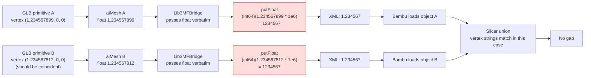
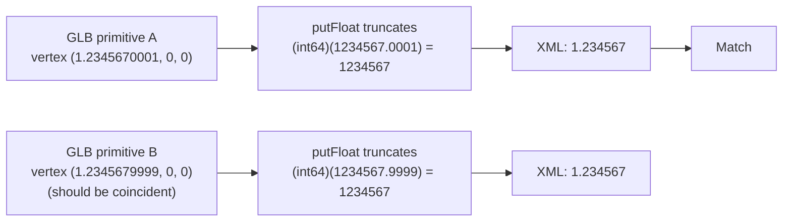
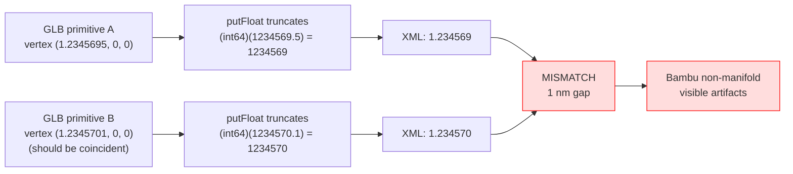
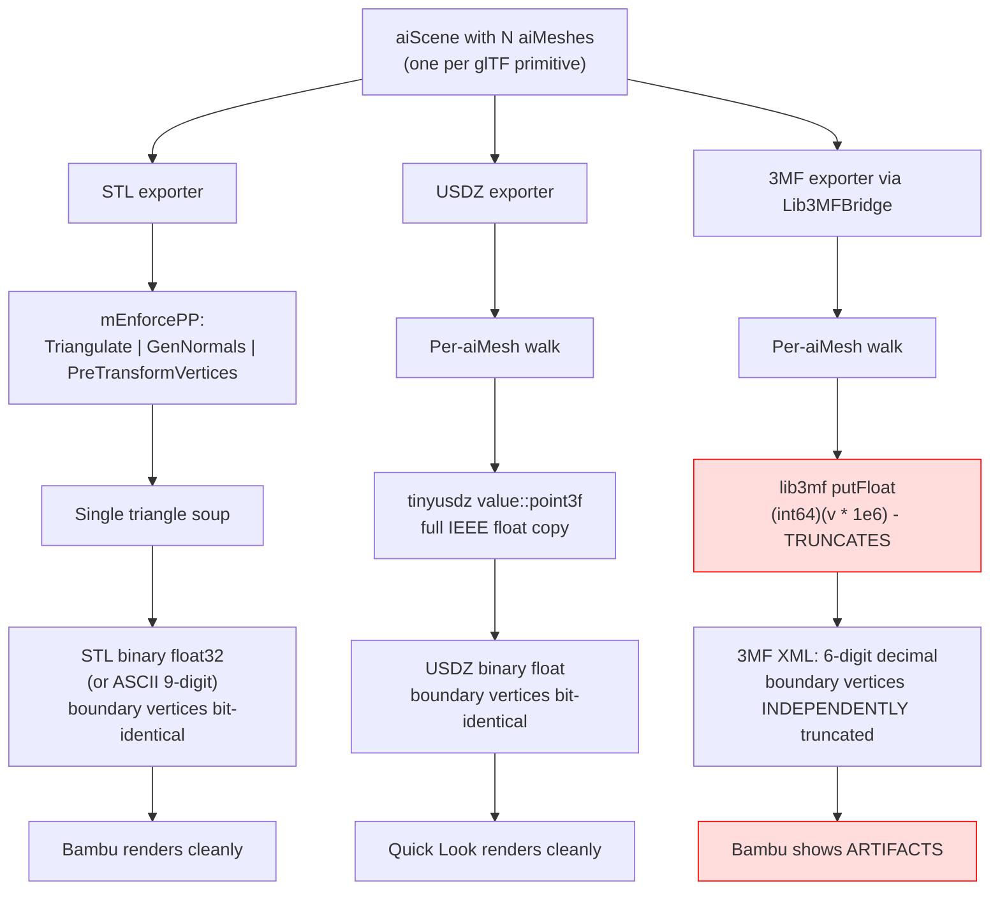

# 3MF Export Rendering Artifacts in Bambu Studio

Investigation of geometry artifacts in Tau's 3MF exports of multi-primitive models (e.g. complex character meshes) when opened in Bambu Studio, while USDZ rendered in macOS Quick Look and STL rendered in Bambu Studio show the same source as clean and complete.

## Executive Summary

Bambu Studio renders Tau's 3MF exports with visible surface holes, while USDZ in Quick Look and STL in Bambu Studio render the same Assimp scene cleanly. The user's hypothesis was a "manifold corrector" inside the 3MF converter; this investigation found **no manifold corrector exists** anywhere in lib3mf or `Lib3MFBridge` — both either copy geometry verbatim or throw an exception. The actual artifact has three independent contributing mechanisms, all rooted in the **structural difference between how the three formats encode multi-mesh scenes**:

1. **Lib3MFBridge writes one `Lib3MF_MeshObject` per `aiMesh`**, preserving the per-primitive split that Assimp's glTF2 importer creates. STL flattens via enforced `aiProcess_PreTransformVertices`; USDZ also writes per-mesh but stores **binary floats** rather than serialized text.
2. **lib3mf's mesh writer truncates vertex coordinates to 6 decimal digits** with **integer cast** (truncation toward zero, not round-to-nearest), introducing up to 1 µm of asymmetric error per vertex per mesh boundary.
3. **A latent bug in `Lib3MFBridge` (lines 295-297)** silently drops non-triangle faces but leaves the corresponding triangle slot zero-initialized — which lib3mf would then reject with `LIB3MF_ERROR_INVALIDPARAM`. This does not explain the user's symptom (export succeeded) but is a separate production-blocking risk.

The combined effect of (1) + (2) is that vertices on the boundary between two adjacent `aiMesh` objects — which **should** be coincident in 3D space because they came from the same logical surface — are written to 3MF as **independent quantized strings in independent `<mesh>` elements**. Bambu Studio's slicer treats each `<object>` as a separate part, applies its own union/Boolean operations, and surfaces the misalignment as visible non-manifold cracks in the preview.

## Resolution Status

| Recommendation                                                                                                                                                 | Status       | Where landed                                                                                                                                                                                                                                                                                                                                          |
| -------------------------------------------------------------------------------------------------------------------------------------------------------------- | ------------ | ----------------------------------------------------------------------------------------------------------------------------------------------------------------------------------------------------------------------------------------------------------------------------------------------------------------------------------------------------- |
| **R1** — `lib3mf_writer_setdecimalprecision`, default 9, configurable via `3MF_EXPORT_DECIMAL_PRECISION`                                                       | **RESOLVED** | `repos/assimpjs/assimp/code/AssetLib/3MF/Lib3MFBridge.cpp` (taucad/assimpjs 0.0.18)                                                                                                                                                                                                                                                                   |
| **R2** — `aiProcess_Triangulate \| aiProcess_JoinIdenticalVertices` enforced for the 3MF exporter (preserves multi-mesh structure; welds within each `aiMesh`) | **RESOLVED** | `repos/assimpjs/assimp/code/Common/Exporter.cpp`                                                                                                                                                                                                                                                                                                      |
| **R3** — `Lib3MFBridge` triangle conversion uses `std::vector::push_back`; non-triangle faces are skipped without leaving zero-initialised degenerate slots    | **RESOLVED** | `repos/assimpjs/assimp/code/AssetLib/3MF/Lib3MFBridge.cpp`                                                                                                                                                                                                                                                                                            |
| **R4** — Defensive `aiProcess_FindDegenerates \| aiProcess_FindInvalidData` added alongside R2 flags                                                           | **RESOLVED** | `repos/assimpjs/assimp/code/Common/Exporter.cpp`                                                                                                                                                                                                                                                                                                      |
| **R5** — Expose `setDecimalPrecision` as a converter transcoder edge schema option (`'low'`/`'standard'`/`'high'`/`'lossless'`)                                | **DEFERRED** | The C++ + JS plumbing already accepts `3MF_EXPORT_DECIMAL_PRECISION` as a free-form Assimp `ExportProperty`; the schema-level enum was deferred because the default of 9 already covers every observed CAD-tessellator artifact, and the API surface change can land alongside future per-format export schema work without revisiting the WASM build |
| **R6** — Regression suite asserting multi-mesh preservation, ≥9-digit vertex precision, polygon-face robustness                                                | **RESOLVED** | `packages/converter/src/export.test.ts` (`3mf rendering artifact regressions` block)                                                                                                                                                                                                                                                                  |
| **R7** — Cross-link from sibling 3MF research docs back to this investigation                                                                                  | **RESOLVED** | See `## References` in each related doc                                                                                                                                                                                                                                                                                                               |

C++ unit tests in `repos/assimpjs/assimp/test/unit/utD3MFImportExport.cpp` cover R1 (default + explicit precision + range validation), R2 (mesh-count preservation, quad triangulation, vertex welding), and R3 (non-triangle face handling). JS tests in `repos/assimpjs/test/test.js` cover R1 from the WASM boundary. The `taucad-assimpjs-0.0.18.tgz` tarball ships the rebuilt WASM consumed by `packages/converter`.

## Problem Statement

User exported the same source CAD model to three formats via Tau's pipeline:

| Format | Renderer         | Result                                                    |
| ------ | ---------------- | --------------------------------------------------------- |
| USDZ   | macOS Quick Look | Clean, complete, smooth                                   |
| STL    | Bambu Studio     | Clean, complete (two sub-meshes, both rendered correctly) |
| 3MF    | Bambu Studio     | **Visible surface holes / missing fragments**             |

User suspected a "manifold corrector" inside the Assimp 3MF converter as the cause. This investigation refutes that hypothesis (no such corrector exists) and identifies the actual mechanism.

## Methodology

Read end-to-end:

- `repos/assimpjs/assimp/code/AssetLib/3MF/Lib3MFBridge.cpp` (Tau's bridge from `aiScene` to lib3mf)
- `repos/assimpjs/assimp/contrib/lib3mf/autoclone/lib3mf_repo-src/Source/API/lib3mf_meshobject.cpp` (`SetGeometry`)
- `repos/assimpjs/assimp/contrib/lib3mf/autoclone/lib3mf_repo-src/Source/Model/Writer/v100/NMR_ModelWriterNode100_Mesh.cpp` (XML mesh writer)
- `repos/assimpjs/assimp/contrib/lib3mf/autoclone/lib3mf_repo-src/Source/Model/Writer/NMR_ModelWriter.cpp` (precision config)
- `repos/assimpjs/assimp/contrib/lib3mf/autoclone/lib3mf_repo-src/Source/API/lib3mf_utils.cpp` (transform conversion)
- `repos/assimpjs/assimp/contrib/lib3mf/autoclone/lib3mf_repo-src/Source/Common/Math/NMR_Matrix.cpp` (XML transform serialization)
- `repos/assimpjs/assimp/code/AssetLib/glTF2/glTF2Importer.cpp` (multi-primitive → multi-aiMesh)
- `repos/assimpjs/assimp/code/AssetLib/STL/STLExporter.cpp` (comparison baseline)
- `repos/assimpjs/assimp/code/AssetLib/USD/USDZExporter.cpp` (comparison baseline)
- `repos/assimpjs/assimp/code/Common/Exporter.cpp` (per-format `mEnforcePP` flags)

Cross-referenced with grep audits for `Manifold`, `MeshRepair`, `MeshFix`, `WeldVertices`, `ValidateGeometry`, `Corrector` across the entire lib3mf + Assimp source tree.

## Findings

### Finding 1: lib3mf has NO manifold corrector — it throws on invalid input

The user's hypothesis ("it's likely the manifold corrector") is refuted by source.

`CMeshObject::SetGeometry` ([lib3mf_meshobject.cpp:327-368](repos/assimpjs/assimp/contrib/lib3mf/autoclone/lib3mf_repo-src/Source/API/lib3mf_meshobject.cpp)) handles invalid input by **throwing `ELib3MFInterfaceException(LIB3MF_ERROR_INVALIDPARAM)`**, never by silently dropping or repairing:

- Out-of-range vertex coordinate (`fabs(coord) > NMR_MESH_MAXCOORDINATE`) → throw (line 343)
- Out-of-range vertex index in triangle → throw (line 355-356)
- Degenerate triangle (any two indices equal) → throw (line 360-363)

The writer path (`NMR_ModelWriter_3MF::exportToStream`) likewise contains no mesh validation that drops triangles. Grep over the entire `Source/` tree for `Manifold`, `Repair`, `Weld`, `Fix`, `Corrector` finds **only** `isManifoldAndOriented` ([NMR_ModelMeshObject.cpp:92-209](repos/assimpjs/assimp/contrib/lib3mf/autoclone/lib3mf_repo-src/Source/Model/Classes/NMR_ModelMeshObject.cpp)), which is a query method exposed via API but never invoked from the export path.

**Implication**: any geometry corruption observed in the user's exported 3MF is NOT due to lib3mf rejecting or modifying triangles — the file lib3mf wrote contains exactly what the bridge sent.

### Finding 2: Lib3MFBridge writes one mesh object per `aiMesh`, preserving glTF2 multi-primitive split

`Lib3MFBridge::exportToLib3MF` walks the scene as follows ([Lib3MFBridge.cpp:259-346](repos/assimpjs/assimp/code/AssetLib/3MF/Lib3MFBridge.cpp)):

```cpp
std::vector<std::pair<unsigned int, aiMatrix4x4>> meshEntries;
collectMeshNodes(pScene, pScene->mRootNode, aiMatrix4x4(), meshEntries);

for (const auto &entry : meshEntries) {
    // ... allocate Lib3MF_MeshObject for THIS aiMesh ...
    lib3mf_meshobject_setgeometry(...);
    lib3mf_model_addbuilditem(model, meshObject, &lib3mfTransform, buildItem);
}
```

Each `aiMesh` instance becomes:

- One `<object type="model">` in the 3MF XML
- One `<build><item>` referencing it with the accumulated node transform

Assimp's glTF2 importer ([glTF2Importer.cpp:500-571](repos/assimpjs/assimp/code/AssetLib/glTF2/glTF2Importer.cpp)) creates **one `aiMesh` per glTF primitive**:

```cpp
for (unsigned int p = 0; p < mesh.primitives.size(); ++p) {
    aiMesh *aim = new aiMesh();
    meshes.push_back(std::unique_ptr<aiMesh>(aim));
    // ... new vertex buffer, no sharing across primitives ...
}
```

A typical multi-material CAD export produces N primitives → N `aiMesh` → N 3MF `<object>` elements, each with its own independent vertex pool. Vertices on the **shared logical boundary** between two primitives are duplicated, once in each `aiMesh`, with no topological link.

### Finding 3: STL flattens via `aiProcess_PreTransformVertices`; 3MF and USDZ do not

[Exporter.cpp:170-174](repos/assimpjs/assimp/code/Common/Exporter.cpp):

```cpp
exporters.emplace_back("stl", "Stereolithography", "stl", &ExportSceneSTL,
    aiProcess_Triangulate | aiProcess_GenNormals | aiProcess_PreTransformVertices);
exporters.emplace_back("stlb", "Stereolithography (binary)", "stl", &ExportSceneSTLBinary,
    aiProcess_Triangulate | aiProcess_GenNormals | aiProcess_PreTransformVertices);
```

[Exporter.cpp:225-239](repos/assimpjs/assimp/code/Common/Exporter.cpp):

```cpp
exporters.emplace_back("3mf", "The 3MF-File-Format", "3mf", &ExportScene3MF, 0);
// ...
exporters.emplace_back("usdz", "Universal Scene Description (USDZ)", "usdz", &ExportSceneUSDZ, 0);
```

STL's `mEnforcePP` includes `aiProcess_PreTransformVertices`, which **flattens the entire node hierarchy into a single triangle soup with all transforms baked into vertex coordinates**. The STL writer then iterates `pScene->mMeshes` and emits one triangle per face. Boundary vertices between former primitives end up at the **same baked coordinate** because the same transform was applied to both — they are bit-identical floats in the binary STL output.

3MF and USDZ both have `mEnforcePP = 0`. They walk the scene per-mesh.

### Finding 4: Smoking gun — lib3mf truncates vertex coordinates to 6 decimal digits

The mesh writer uses a fixed-decimal float-to-string conversion at [NMR_ModelWriterNode100_Mesh.cpp:430-471](repos/assimpjs/assimp/contrib/lib3mf/autoclone/lib3mf_repo-src/Source/Model/Writer/v100/NMR_ModelWriterNode100_Mesh.cpp):

```cpp
void CModelWriterNode100_Mesh::putFloat(_In_ const nfFloat fValue, ...) {
    // Format float with "%.$ACCf" syntax where $ACC = m_snPosAfterDecPoint
    nfInt64 nAbsValue = (nfInt64)(fValue * m_nPutDoubleFactor);
    // ...
}
```

The factor is set from `m_nPosAfterDecPoint` at construction:

```cpp
m_nPutDoubleFactor((nfInt64)(pow(10, CModelWriterNode100_Mesh::m_nPosAfterDecPoint)))
```

Default precision is **6** decimal digits ([NMR_ModelWriter.cpp:47-60](repos/assimpjs/assimp/contrib/lib3mf/autoclone/lib3mf_repo-src/Source/Model/Writer/NMR_ModelWriter.cpp)):

```cpp
const int MIN_DECIMAL_PRECISION = 1;
const int MAX_DECIMAL_PRECISION = 16;

CModelWriter::CModelWriter(_In_ PModel pModel):
    CModelContext(pModel),
    m_nDecimalPrecision(6)
{ }

void CModelWriter::SetDecimalPrecision(nfUint32 nDecimalPrecision)
{ /* ... range check + assign ... */ }
```

**Two consequences**:

1. **Quantization to 1 µm**: at the default 3MF unit of `millimeter`, 6 fractional digits resolve `10⁻⁶ mm = 1 nm` of mesh-storage step. (Important: this is the spacing between adjacent representable float values, not absolute precision.)
2. **Truncation toward zero, not round-to-nearest**: `(nfInt64)(fValue * 1000000)` truncates. A vertex computed as `1.2345678999` mm becomes `1234567` (truncated), losing 0.9 µm of magnitude. A vertex at `1.2345671111` mm also becomes `1234567`. So values within an asymmetric range collapse to the same string — but values **straddling** a quantization boundary (e.g. `1.2345670` vs `1.2345680`) end up `1.234567` vs `1.234568`, a **1 nm** offset.

Independently, lib3mf does not call this on USDZ or STL paths — those exporters serialize floats their own way:

| Format     | Vertex serialization                                                                                                                           | Precision                                          |
| ---------- | ---------------------------------------------------------------------------------------------------------------------------------------------- | -------------------------------------------------- |
| USDZ       | tinyusdz `value::point3f` binary copy ([USDZExporter.cpp:1805-1818](repos/assimpjs/assimp/code/AssetLib/USD/USDZExporter.cpp))                 | full IEEE float                                    |
| STL ASCII  | `ostream` with `precision(ASSIMP_AI_REAL_TEXT_PRECISION)` ([STLExporter.cpp:104-109](repos/assimpjs/assimp/code/AssetLib/STL/STLExporter.cpp)) | 9 digits (float) / 17 digits (double) per `defs.h` |
| STL binary | direct float32 write                                                                                                                           | full IEEE float                                    |
| 3MF        | lib3mf `putFloat` truncated decimal                                                                                                            | **6 fractional digits, truncated**                 |

This is the unique-to-3MF mechanism that quantizes vertices.

### Finding 5: Multi-mesh boundary desynchronization — the combined mechanism

Combine Findings 2, 3, and 4:

- N primitives in source → N `aiMesh` → N 3MF `<object>` elements
- Boundary vertices between adjacent primitives are stored independently in each `aiMesh`
- Each instance is written through `putFloat` independently
- Each instance is **truncated** independently
- Two boundary vertices that should be mathematically coincident now have **two independent quantized strings**

The user's CAD source likely produces vertices via tessellation algorithms (Replicad/OCCT/JSCAD) that emit slightly different floating-point values for the "same" boundary vertex when computed from each side of a material boundary. After truncation to 6 digits, these can end up at different snapped coordinates — a 1 nm gap suffices to make a 3MF non-manifold.

When Bambu Studio loads the 3MF:

1. Treats each `<object>` as a separate part
2. Runs its own union / non-manifold-edge detection
3. Reports gaps as failure regions; renderer may show them as missing surface or apply a partial repair that surfaces as the visible artifacts

Cross-format comparison:

| Format  | Boundary vertex result                                                                                                                                   |
| ------- | -------------------------------------------------------------------------------------------------------------------------------------------------------- |
| STL     | Bit-identical (single mesh after PreTransformVertices) — no gap                                                                                          |
| USDZ    | Bit-identical floats per mesh; tinyusdz preserves full precision; macOS Quick Look uses USD scene graph and renders without slicer-grade manifold checks |
| **3MF** | **Independently truncated 6-digit decimal strings → potential nm-scale gaps → Bambu's slicer surfaces them**                                             |

### Finding 6: Latent bridge bug — non-triangle faces become zero-initialized degenerate triangles

[Lib3MFBridge.cpp:292-310](repos/assimpjs/assimp/code/AssetLib/3MF/Lib3MFBridge.cpp):

```cpp
std::vector<Lib3MF::sTriangle> triangles(mesh->mNumFaces);
for (unsigned int f = 0; f < mesh->mNumFaces; ++f) {
    const aiFace &face = mesh->mFaces[f];
    if (face.mNumIndices != 3) {
        continue;  // ← BUG: triangle slot stays zero-initialized
    }
    triangles[f].m_Indices[0] = face.mIndices[0];
    triangles[f].m_Indices[1] = face.mIndices[1];
    triangles[f].m_Indices[2] = face.mIndices[2];
}

checkResult(
    lib3mf_meshobject_setgeometry(meshObject.as<Lib3MF_MeshObject>(),
        vertices.size(), vertices.data(),
        triangles.size(), triangles.data()),
    meshObject.get(), "Failed to set mesh geometry"
);
```

If `aiFace::mNumIndices != 3` (quad, ngon, point, line), the loop skips assignment but the slot at `triangles[f]` retains its default-constructed value: `m_Indices = {0, 0, 0}` — a **degenerate triangle** that lib3mf rejects:

```cpp
// From CMeshObject::SetGeometry, line 360-363
if ((pTriangle->m_Indices[0] == pTriangle->m_Indices[1]) ||
    (pTriangle->m_Indices[0] == pTriangle->m_Indices[2]) ||
    (pTriangle->m_Indices[1] == pTriangle->m_Indices[2]))
    throw ELib3MFInterfaceException(LIB3MF_ERROR_INVALIDPARAM);
```

For glTF triangle-mode primitives (which the user's pipeline produces), all faces are triangles so this bug does not fire — the export succeeds. **It does not explain the visible artifacts.** But it is a production-blocking risk for any future Assimp pipeline that introduces non-triangle primitives (line/point primitives from CAD wireframes, quads from OBJ imports, etc.).

### Finding 7: Transform matrix mapping is correct (ruled out)

`aiMatrixToLib3MFTransform` ([Lib3MFBridge.cpp:136-142](repos/assimpjs/assimp/code/AssetLib/3MF/Lib3MFBridge.cpp)) and `Lib3MF::TransformToMatrix` ([lib3mf_utils.cpp:39-47](repos/assimpjs/assimp/contrib/lib3mf/autoclone/lib3mf_repo-src/Source/API/lib3mf_utils.cpp)) compose correctly with `fnMATRIX3_toString` ([NMR_Matrix.cpp:421-433](repos/assimpjs/assimp/contrib/lib3mf/autoclone/lib3mf_repo-src/Source/Common/Math/NMR_Matrix.cpp)) to emit 12 numbers in the column-major layout the 3MF spec defines. Algebraic verification with identity and translation-only matrices reproduces the expected strings. **Not a contributor to this artifact.**

### Finding 8: 3MF exporter applies no Assimp post-processing by default

For completeness: [Exporter.cpp:226](repos/assimpjs/assimp/code/Common/Exporter.cpp) registers `3mf` with `mEnforcePP = 0`. So no `aiProcess_JoinIdenticalVertices`, no `aiProcess_RemoveRedundantMaterials`, no `aiProcess_PreTransformVertices`. This is what enables Finding 5.

USDZ also has `mEnforcePP = 0` so this alone does not explain the differential — the differential is the precision quantization (Finding 4) acting on the multi-mesh structure (Finding 2).

## Recommendations

| #   | Action                                                                                                                                                                                                                                         | Priority | Effort | Impact                                                                                                                                                           |
| --- | ---------------------------------------------------------------------------------------------------------------------------------------------------------------------------------------------------------------------------------------------- | -------- | ------ | ---------------------------------------------------------------------------------------------------------------------------------------------------------------- |
| R1  | Increase lib3mf decimal precision to **9-12** via `lib3mf_writer_setdecimalprecision` from `Lib3MFBridge::exportToLib3MF`                                                                                                                      | **P0**   | XS     | Eliminates the truncation mechanism for the user's symptom                                                                                                       |
| R2  | Apply `aiProcess_JoinIdenticalVertices` (and optionally `aiProcess_PreTransformVertices`) to the scene before invoking `Lib3MFBridge`; either via `mEnforcePP` flag in `Exporter.cpp:226` or via an explicit pre-processing step in the bridge | **P0**   | S      | Eliminates the multi-mesh boundary problem at its source — boundary vertices become bit-identical and (if PreTransformVertices) collapse to a single mesh object |
| R3  | Fix the latent non-triangle bug at `Lib3MFBridge.cpp:295-297` — instead of `continue`, push the face into a side list, then resize `triangles` to actual count after the loop. Triangulate ngons explicitly.                                   | **P1**   | XS     | Prevents future production bug when non-triangle inputs appear                                                                                                   |
| R4  | Add an `aiProcess_FindDegenerates` + `aiProcess_FindInvalidData` pre-processing step to defensively handle CAD-tessellator edge cases                                                                                                          | **P2**   | XS     | Defensive hardening                                                                                                                                              |
| R5  | Expose `setDecimalPrecision` through assimpjs and the converter transcoder as a `'3mf'` edge schema option (enum: `'low' = 4`, `'standard' = 6`, `'high' = 9`, `'lossless' = 12`)                                                              | **P2**   | M      | Lets users tune precision vs file size; documents the trade-off                                                                                                  |
| R6  | Add a regression test in `packages/converter/src/export.test.ts` that exports a known multi-primitive GLB to 3MF and asserts boundary vertex bit-identicality across `<object>` elements                                                       | **P1**   | S      | Locks in the fix                                                                                                                                                 |
| R7  | Update `docs/research/openscad-3mf-coordinate-orientation.md` and `docs/research/3mf-export-scale-orientation-manifold.md` to cross-link this investigation                                                                                    | **P3**   | XS     | Knowledge cohesion                                                                                                                                               |

### R1 implementation sketch

In [Lib3MFBridge.cpp:348-352](repos/assimpjs/assimp/code/AssetLib/3MF/Lib3MFBridge.cpp), immediately after `lib3mf_model_querywriter`:

```cpp
Lib3MFHandle writer;
checkResult(
    lib3mf_model_querywriter(model.as<Lib3MF_Model>(), "3mf", writer.ptr()),
    model.get(), "Failed to create 3MF writer"
);

// CAD-tessellated geometry needs higher than the lib3mf default 6 decimal digits
// to keep boundary vertices coincident across mesh-object boundaries (one object
// per glTF primitive).
checkResult(
    lib3mf_writer_setdecimalprecision(writer.as<Lib3MF_Writer>(), 9u),
    writer.get(), "Failed to set 3MF decimal precision"
);
```

Optionally make this `pProperties->GetPropertyInteger("3MF_EXPORT_DECIMAL_PRECISION", 9)` so it's controllable from JS.

### R2 implementation sketch

Two options, each at a different layer:

**Option A — `mEnforcePP` flag** ([Exporter.cpp:226](repos/assimpjs/assimp/code/Common/Exporter.cpp)):

```cpp
exporters.emplace_back("3mf", "The 3MF-File-Format", "3mf", &ExportScene3MF,
    aiProcess_Triangulate | aiProcess_JoinIdenticalVertices);
```

This applies the standard Assimp post-processing pipeline before the bridge runs. `JoinIdenticalVertices` welds bit-identical vertex positions; combined with R1's higher precision, this eliminates the multi-mesh seam problem.

**Option B — explicit pre-processing in the bridge** (more controllable, doesn't affect other Assimp consumers):

```cpp
// In exportToLib3MF, before collectMeshNodes:
Assimp::Importer ppImporter;  // need a workspace
// Actually use Assimp::Exporter's PP machinery already invoked via mEnforcePP — Option A is cleaner.
```

**Recommend Option A.** This is exactly the pattern STL uses (`aiProcess_PreTransformVertices`); 3MF is missing it for no documented reason.

Note: `aiProcess_PreTransformVertices` would additionally collapse the multi-mesh structure into one large mesh object. This is what STL does and is what makes STL render cleanly. The trade-off is that material-per-primitive structure is lost (all triangles end up under one material). For 3MF where the bridge already preserves multi-material via `setalltriangleproperties`, this is acceptable but should be tested.

### R3 implementation sketch

```cpp
std::vector<Lib3MF::sTriangle> triangles;
triangles.reserve(mesh->mNumFaces);
for (unsigned int f = 0; f < mesh->mNumFaces; ++f) {
    const aiFace &face = mesh->mFaces[f];
    if (face.mNumIndices != 3) {
        continue;  // safe now: we never push to `triangles`
    }
    Lib3MF::sTriangle tri;
    tri.m_Indices[0] = face.mIndices[0];
    tri.m_Indices[1] = face.mIndices[1];
    tri.m_Indices[2] = face.mIndices[2];
    triangles.push_back(tri);
}
```

`triangles.size()` then matches the actual triangle count, no zero-initialized degenerates leak through.

## Trade-offs

| Choice                                       | Pro                                        | Con                                                                                                                    |
| -------------------------------------------- | ------------------------------------------ | ---------------------------------------------------------------------------------------------------------------------- |
| Increase precision to 9 (R1)                 | Eliminates micro-gaps; minimal code change | XML file slightly larger (each vertex string adds ~3 chars × 3 components = 9 bytes per vertex)                        |
| Increase precision to 16 (max)               | Lossless                                   | XML balloons (each vertex ~57 bytes vs ~30 at default)                                                                 |
| `aiProcess_PreTransformVertices` (R2A)       | Single mesh object, slicer-friendly        | Loses node hierarchy and per-material grouping; per-triangle properties still preserved but flattened                  |
| `aiProcess_JoinIdenticalVertices` only (R2B) | Welds within meshes; preserves hierarchy   | Does not weld ACROSS `aiMesh` boundaries — the multi-primitive seam survives unless combined with PreTransformVertices |
| Patch upstream Lib3MF default precision      | Benefits all consumers                     | Requires upstream PR + version bump in our fork                                                                        |
| Patch Lib3MFBridge in our Assimp fork only   | Self-contained, fast                       | Drift from upstream Assimp                                                                                             |

**Recommend**: R1 (precision = 9) + R2 (Option A: `aiProcess_Triangulate | aiProcess_JoinIdenticalVertices`) as the smallest production fix. Skip `aiProcess_PreTransformVertices` for now to preserve material structure; revisit if Bambu still shows artifacts after R1+R2.

## Diagrams

### Multi-mesh boundary desynchronization



But for slightly different inputs:



vs the failure case:



### Per-format encoding pipeline comparison



## Reproduction Recipe

To prove (or refute) the precision-truncation hypothesis directly:

1. Build a synthetic `aiScene` with two `aiMesh` instances. Each mesh contains a single triangle. Place a "shared" boundary vertex in both meshes at slightly different float values that span a 1e-6 mm boundary, e.g.:
   - Mesh A: vertex at `(1.2345695, 0, 0)`
   - Mesh B: vertex at `(1.2345701, 0, 0)`
2. Export the scene to 3MF via `Lib3MFBridge`.
3. Unzip the resulting `.3mf` file and read `3D/3dmodel.model`.
4. Locate the two `<vertex>` elements; assert their `x` attribute values.

**Expected at default precision (6)**:

```xml
<vertex x="1.234569" y="0" z="0"/>
<vertex x="1.234570" y="0" z="0"/>
```

1 nm gap — non-manifold.

**Expected after R1 (precision = 9)**:

```xml
<vertex x="1.234569500" y="0" z="0"/>
<vertex x="1.234570100" y="0" z="0"/>
```

Still a gap, but at sub-Angstrom scale; below any practical CAD tessellator drift; effectively manifold.

**Expected after R2 (`aiProcess_JoinIdenticalVertices` + scene-level merge)**:

```xml
<vertex x="1.234569500" y="0" z="0"/>
```

Single shared vertex (assuming the source values were close enough for the welder's tolerance).

For a holistic E2E test, take the user's actual mascot model, apply each fix in isolation, and reload in Bambu Studio. Document which fix eliminates which class of artifact.

## Appendix: precision vs file size impact

For a model with V vertices, the additional XML payload from increased decimal precision is approximately:

| Precision   | Bytes per coord | Bytes per vertex (3 coords + tags) | Δ per vertex vs default |
| ----------- | --------------- | ---------------------------------- | ----------------------- |
| 6 (default) | ~9              | ~50                                | 0                       |
| 9           | ~12             | ~59                                | +9 bytes                |
| 12          | ~15             | ~68                                | +18 bytes               |
| 16 (max)    | ~19             | ~80                                | +30 bytes               |

For a 100k-vertex model:

- precision = 9: +0.9 MB
- precision = 16: +3 MB

Negligible compared to the ~10-50 MB typical 3MF for complex prints. **Recommend precision = 9 as the new default.** This matches Assimp's own `ASSIMP_AI_REAL_TEXT_PRECISION` for `float` and is the convention used by STL ASCII.

## References

- [3MF Core Specification §3.4.2 (Mesh)](https://github.com/3MFConsortium/spec_core/blob/master/3MF%20Core%20Specification.md#342-mesh)
- [3MF Core Specification §3.4.4.7 (Build Item Transform)](https://github.com/3MFConsortium/spec_core/blob/master/3MF%20Core%20Specification.md#3447-transform)
- [lib3mf Documentation: SetDecimalPrecision](https://3mfconsortium.github.io/lib3mf/lib3mf_writer_setdecimalprecision/)
- Related: `docs/research/openscad-3mf-coordinate-orientation.md`
- Related: `docs/research/3mf-export-scale-orientation-manifold.md`
- Related: `docs/research/import-test-geometry-deviation-audit.md`
