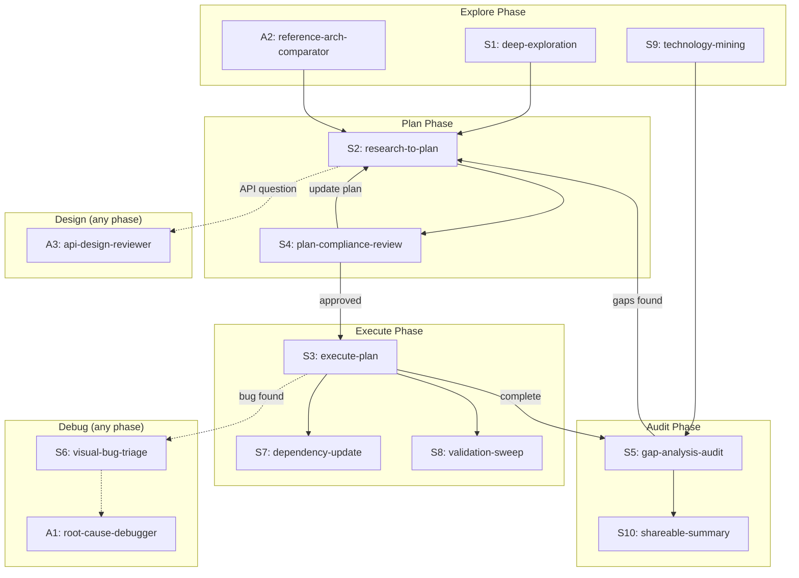

# Agent Skill Patterns v2

Systematic audit of 159 conversations (85K+ messages) from the last 3 months to identify recurring human-agent interaction patterns and translate them into reusable skills and subagents for Cursor.

## Executive Summary

Mining 159 conversation transcripts reveals 16 distinct interaction patterns the user employs repeatedly, up from 8 in the v1 single-conversation analysis. The patterns divide into three tiers: (1) core lifecycle patterns that compose into a dominant meta-workflow (explore -> plan -> review -> execute -> audit), (2) domain-specific patterns for debugging, dependency management, and WASM builds, and (3) meta-patterns for learning, formatting, and configuration. The top 5 patterns by frequency appear in 60-95% of substantial conversations. Translating these into 10 new skills and 3 new subagents would eliminate an estimated 2,000-4,000 tokens of repeated boilerplate per conversation while ensuring consistent execution quality.

## Table of Contents

- [Problem Statement](#problem-statement)
- [Methodology](#methodology)
- [Findings](#findings)
- [Skill Blueprints](#skill-blueprints)
- [Subagent Blueprints](#subagent-blueprints)
- [Composition Graph](#composition-graph)
- [Context Engineering Alignment](#context-engineering-alignment)

## Problem Statement

The v1 analysis (`docs/research/agent-skill-patterns.md`) mined a single conversation and identified 8 patterns. The user's workflow has since been observed across 159 conversations spanning filesystem engineering, WASM optimization, AI tooling, UI development, kernel architecture, and documentation. This broader scope reveals patterns invisible in a single conversation: cross-domain debugging protocols, dependency management lifecycles, and content formatting workflows. The goal is a complete inventory to inform skill/subagent creation.

## Methodology

1. Extracted all JSONL transcripts modified in the last 90 days from `agent-transcripts/`
2. Filtered to 159 conversations with 3+ messages and >50KB file size (excluding trivial exchanges and subagent-only transcripts)
3. Extracted user and assistant messages, truncating to 800 chars each for efficient analysis
4. Split conversations into 4 batches by size (largest to smallest) for parallel mining
5. Deployed 4 subagents to independently identify patterns in each batch
6. De-duplicated and merged findings across batches, resolving naming conflicts and counting cross-batch frequency
7. Cross-referenced against v1 findings to validate consistency and identify new patterns

## Findings

### Finding 1: Gated Exploration ("Respond-Only" Protocol)

**Frequency**: 95%+ of conversations (most pervasive pattern)
**Observed instances**: 556+ gating phrases across 150+ conversations

**Trigger phrases** (exact, recurring):

| Phrase                                                 | Occurrences |
| ------------------------------------------------------ | ----------- |
| "just respond" / "just explore and respond"            | 400+        |
| "respond with your findings"                           | 240+        |
| "deeply explore" / "deeply review" / "deeply research" | 550+        |
| "await further instructions" / "await instruction"     | 19+         |
| "no planning yet"                                      | 10+         |

**Lifecycle**: User asks investigative question with explicit gate -> Agent explores read-only -> Agent presents structured findings -> User evaluates -> User either gates again or transitions to planning/action.

**Variants**:

| Variant                  | Gate Phrase                                  | Output Format                |
| ------------------------ | -------------------------------------------- | ---------------------------- |
| API design exploration   | "what might a cleaner interface look like?"  | Options table with tradeoffs |
| Architecture comparison  | "what are our equivalents to X?"             | Side-by-side matrix          |
| Fit assessment           | "is X a good fit for Tau?"                   | Pros/cons with verdict       |
| Root cause investigation | "find the smoking gun"                       | Hypothesis-evidence chain    |
| Best practice research   | "research online for current best practices" | Web-grounded comparison      |

### Finding 2: Iterative Plan Lifecycle

**Frequency**: 70% of conversations
**Observed instances**: 258 "create a plan" + 415 "update the plan" across 33 conversations

**Lifecycle**:

1. Exploration completes (F1)
2. User: "develop a plan to address all of..."
3. Agent creates phased plan with numbered items
4. User reviews, iterates: "update the plan to include X" (avg 3-39 iterations)
5. User transitions to execution: "implement the plan as specified"

**Key constraint**: Plans are living documents — updated throughout the conversation, not just at creation. The transition from `create` to `update` is the most common composite (50 direct transitions observed).

### Finding 3: Plan Execution Protocol

**Frequency**: 40% of conversations
**Observed instances**: 894 "continue" messages across 37 conversations

**The user has refined 5 rigid rules through iterative correction**:

| Rule                                  | Origin                                               |
| ------------------------------------- | ---------------------------------------------------- |
| Do NOT edit the plan file itself      | Corrected after agent modified plan during execution |
| Do NOT recreate existing todos        | Corrected after agent duplicated todos               |
| Mark todos `in_progress` sequentially | Explicit instruction, repeated every cycle           |
| Start with the first pending todo     | Order matters — phases are sequential                |
| Don't stop until all todos complete   | Prevents premature completion claims                 |

**Verification protocol**: `pnpm nx typecheck <project>` + `pnpm nx test <project> --watch=false` + `pnpm nx lint <project>` after each phase.

### Finding 4: Visual Bug Triage (Screenshot-Driven Debugging)

**Frequency**: 67% of conversations
**Observed instances**: 1,069+ screenshot messages across 38 conversations

**Lifecycle**: User attaches screenshot(s) + error description -> Agent diagnoses -> Agent proposes fix -> User provides follow-up screenshot -> Iterate until visually correct (avg 5+ rounds).

**Key constraints**:

- "Find the smoking gun" (35 instances) — demands concrete root cause, not speculation
- "Never band-aid — fix at source" — rejects workarounds
- Hypotheses must be validated in source code, not assumed
- Global CSS patches explicitly rejected: "global css patches are not an option"
- Multiple visual iteration rounds expected before satisfaction

### Finding 5: Policy-Gated Implementation

**Frequency**: 35% of conversations
**Observed instances**: 29 conversations with `@docs/policy/` references

**Most-referenced policies**: `testing-policy.md`, `react-testing-policy.md`, `xstate-policy.md`, `library-api-policy.md`, `jsdoc-policy.md`, `filesystem-policy.md`

**Lifecycle**: User requests feature/fix -> Gates with policy: "ensure we follow @docs/policy/X" -> Agent reads policy, applies constraints -> Implementation -> Optional compliance sweep: "verify they comply with @docs/policy/X"

**Key insight**: Policies are binding constraints, not advisory. Multiple policies can apply simultaneously. Policy violations caught during validation must be fixed, not skipped.

### Finding 6: TDD Protocol (Fail-First Testing)

**Frequency**: 33% of conversations

**Trigger phrases**: "write tests first, get them to fail, then fix them to get them passing" (exact phrase appears verbatim in 13+ conversations)

**Lifecycle**: Identify behavior -> Write failing test -> Confirm failure via test run -> Implement fix -> Confirm pass -> Policy compliance review

**Constraints**: Tests for removed APIs/behaviors should be removed, not skipped. `--watch=false` required. Vitest with jsdom for UI, node for API.

### Finding 7: Correctness-Over-Speed Redirect

**Frequency**: 21+ conversations

**Trigger phrases**: "not the right approach", "band-aid", "hacky", "working against the API", "most correct architectural fix", "correctness first"

**Lifecycle**: Agent proposes quick fix -> User rejects: "a wrapper is not the right approach" -> User redirects to deeper research -> Agent researches alternatives -> User selects most architecturally correct option -> Implementation proceeds

**Key insight**: This is a judgment pattern where the user overrides the agent's tendency toward simplicity. The user's mental model: "prefer the most correct architectural fix over the simplest — correctness is not negotiable."

### Finding 8: Upstream Dependency Patch-Build-Verify Cycle

**Frequency**: 14 conversations

**Lifecycle** (mechanical, 9-step):

1. Identify issue in upstream dependency (`repos/`)
2. Explore upstream source: "deeply explore @repos/X"
3. Make source change in `repos/` fork
4. Build: `build-wasm.sh`, npm scripts
5. Pack: `npm pack` to create tarball
6. Relink: copy tarball to `tarballs/`, `pnpm install`
7. Copy assets: run `copy-files-from-to.cjson`
8. Verify: run downstream tests
9. If tests fail, iterate from step 3

**Constraints**: Must use `pnpm patch` for non-forked deps. WASM builds require `nohup` (10-30+ min). Both root and package `package.json` must reference consistent tarballs.

### Finding 9: Repo-Wide Validation Sweep

**Frequency**: 42% of conversations

**Trigger phrases**: "fix all lint/typecheck issues", "lint the project", "resolve all lint typecheck test errors across all projects"

**Lifecycle**: Trigger after significant change -> Run `pnpm nx lint/test/typecheck <project>` -> Fix errors iteratively -> Re-run until clean -> Cross-project sweep if needed

### Finding 10: Gap Analysis / Progress Audit

**Frequency**: 16 conversations

**Trigger phrases**: "deeply review @docs/research/X to understand outstanding tasks", "strikethrough all that have been addressed", "which parts did we address and which remain?"

**Lifecycle**: Point to tracking doc -> Agent verifies each item against codebase -> Classify: COMPLETE/PARTIAL/MISSING -> Update doc with status indicators -> Report summary

**Status convention**: Emoji at start of heading (tick=complete, cross=missing, construction=partial).

### Finding 11: Reference Architecture Comparison

**Frequency**: 15+ conversations

**Trigger phrases**: "deeply review vscode, how do they handle...", "what are our equivalents to X, Y, Z?", "are we taking the architecturally correct approach?"

**Lifecycle**: Identify architectural question -> Direct comparison against reference implementation in `repos/` -> Present side-by-side comparison -> Evaluate deviations -> Findings inform plan or course correction

**Key references used**: VS Code (filesystem, editor), LangChain (AI providers), XState (state machines), Three.js (3D rendering), Dockview (panel management)

### Finding 12: Technology Mining Lifecycle

**Frequency**: 5+ conversations (VS Code, Turso/AgentFS, LangChain, Rangar, OpenSCAD Playground)

**Lifecycle**: Clone repos via `repos` skill -> Deploy subagents for parallel deep exploration -> Synthesize findings -> Create research doc via `create-research` -> Update gap analysis with recommendations -> Explicit fit assessment

### Finding 13: Content Formatting for External Sharing

**Frequency**: 4+ conversations

**Trigger phrases**: "summarize into a small table for discord pasting, wrap in code block", "give me copy-pastable point items", "take a step back, consider the optimal format for easy reading"

**Lifecycle**: Agent produces analysis -> User requests specific output format (Discord, GitHub, PR) -> Iterative refinement: format -> content -> tone -> User requests code-block wrapping for copy-paste fidelity

### Finding 14: Continual Learning / AGENTS.md Update

**Frequency**: 11+ conversations (explicit invocation with near-identical prompt each time)

**Trigger**: "Run the `continual-learning` skill now" + specific instructions for incremental transcript processing with index file

**Key insight**: The user issues a near-verbatim command block each time. This is the strongest signal for automation — the trigger is already scripted.

### Finding 15: API/DX Design Iteration

**Frequency**: 13 conversations

**Trigger phrases**: "what about something like this: [code snippet]", "what's a better way?", "if you had a blank slate to design the public API differently"

**Lifecycle**: Identify clunky API -> User sketches alternatives inline -> Agent evaluates tradeoffs -> Multiple rounds of proposal/evaluation/refinement -> Document final design -> Test edge cases -> Audit codebase for deviating usage

### Finding 16: Naming and Comprehensive Rename

**Frequency**: 39 conversations with rename references

**Trigger phrases**: "call it X instead", "help me rename all files too", "drop the morph prefix"

**Lifecycle**: Agent proposes name -> User refines -> Comprehensive rename across types, files, imports, tests -> User confirms breaking change acceptability

## Skill Blueprints

Sixteen patterns consolidated into 10 skills and 3 subagents (some patterns merge, some are already covered by existing skills).

### Tier 1: Core Lifecycle Skills (P0)

| #   | Skill                    | Patterns                            | Frequency | Status  |
| --- | ------------------------ | ----------------------------------- | --------- | ------- |
| S1  | `deep-exploration`       | F1 (Gated Exploration)              | 95%       | **NEW** |
| S2  | `research-to-plan`       | F2 (Plan Lifecycle) + F6 (TDD)      | 70%       | **NEW** |
| S3  | `execute-plan`           | F3 (Execution Protocol)             | 40%       | **NEW** |
| S4  | `plan-compliance-review` | F5 (Policy Gate) + F7 (Correctness) | 35%       | **NEW** |

#### S1: `deep-exploration`

**Description**: Performs thorough read-only codebase or architectural exploration, presenting structured findings without making changes. Use when asked to deeply explore, investigate, assess, research, or when the user says "just respond", "respond with findings", or "no planning yet".

**Key instructions**:

- Read all referenced docs/files; search codebase for evidence
- Present findings as numbered items, tables, comparison matrices, or tradeoff analyses
- Include a recommendation with rationale when applicable
- STOP after presenting findings — do NOT create plans, edit files, or take action
- Use subagents for parallel exploration when scope spans multiple areas
- For web research: ground findings against existing codebase architecture

**Degrees of freedom**: High. **Estimated size**: ~90 lines.

#### S2: `research-to-plan`

**Description**: Translates research findings/recommendations into a phased TDD implementation plan. Use when asked to "develop a plan", "create a plan from research", "address findings R1-R12", or "take a TDD approach".

**Key instructions**:

- Read the referenced research doc completely; extract every finding/recommendation in scope
- Explore affected source files before planning
- Every finding maps to at least one plan task with cross-referenced ID (e.g., "R4", "Finding 6")
- TDD per task: assert expected behavior -> verify test failure -> implement -> verify pass
- Include dedicated phase for dead code cleanup
- Comply with `docs/policy/testing-policy.md` and `docs/policy/react-testing-policy.md`

**Composes with**: `deep-exploration` (pre-planning), `execute-plan` (post-planning)

**Degrees of freedom**: Medium. **Estimated size**: ~120 lines.

#### S3: `execute-plan`

**Description**: Executes an implementation plan following TDD protocol with todo tracking. Use when asked to "implement the plan as specified", execute plan phases, or "don't stop until all todos complete".

**Key instructions**:

- Never edit the plan file itself
- Never recreate existing todos — use existing IDs
- Mark todos `in_progress` sequentially, starting from first pending
- TDD per phase: write failing test -> verify failure -> implement -> verify pass
- Verify after each phase: `pnpm nx typecheck`, `test --watch=false`, `lint`
- Do not stop until all todos completed or blocked

**Degrees of freedom**: Low (fragile protocol). **Estimated size**: ~80 lines.

#### S4: `plan-compliance-review`

**Description**: Adversarially reviews a plan against research docs and policies on three axes: coverage, compliance, and performance. Use when asked "are we following all recommendations?", "are we deviating?", or "leaving perf on the table?".

**Key instructions**:

- Coverage: map every finding/recommendation to a plan task; flag gaps
- Compliance: compare plan task details against recommendation specifics; flag deviations
- Performance: identify optimization opportunities not captured
- Conclude with "await instruction" — never auto-modify the plan

**Degrees of freedom**: Low. **Estimated size**: ~90 lines.

### Tier 2: Domain-Specific Skills (P1)

| #   | Skill                | Patterns                  | Frequency | Status  |
| --- | -------------------- | ------------------------- | --------- | ------- |
| S5  | `gap-analysis-audit` | F10 (Progress Audit)      | 16 convos | **NEW** |
| S6  | `visual-bug-triage`  | F4 (Screenshot Debug)     | 67%       | **NEW** |
| S7  | `dependency-update`  | F8 (Patch-Build-Verify)   | 14 convos | **NEW** |
| S8  | `validation-sweep`   | F9 (Repo-Wide Validation) | 42%       | **NEW** |

#### S5: `gap-analysis-audit`

**Description**: Cross-references requirements from a tracking document against the codebase, classifying each as COMPLETE/PARTIAL/MISSING. Use when asked to review outstanding tasks, audit status, or update a gap analysis doc.

**Key instructions**:

- Extract all numbered findings/recommendations from tracking doc
- Search codebase for implementation evidence of each item
- Classify each with emoji prefix: tick=complete, construction=partial, cross=missing
- Use subagents for parallel codebase exploration when item count is large
- Report summary: X complete, Y partial, Z missing

**Degrees of freedom**: Low. **Estimated size**: ~80 lines.

#### S6: `visual-bug-triage`

**Description**: Diagnoses visual regressions from screenshots and console logs, traces to recent changes, and applies targeted fixes with iterative visual verification. Use when the user provides screenshots of a UI bug, rendering issue, or visual regression.

**Key instructions**:

- Analyze screenshot to identify visual symptom
- Correlate with console logs and recent code changes (git diff)
- Apply targeted fix — never global CSS patches, never band-aids
- Expect 5+ iteration rounds (screenshot -> fix -> screenshot -> fix)
- Use browser-use subagent for visual verification when available

**Degrees of freedom**: High. **Estimated size**: ~70 lines.

#### S7: `dependency-update`

**Description**: Manages the upstream dependency patch-build-verify cycle: explore repos, make changes, build, pack tarballs, relink into Tau, and verify downstream tests. Use when patching upstream deps, rebuilding WASM, or relinking tarballs.

**Key instructions**:

- Use `repos` skill to clone/explore upstream source
- Make source change in `repos/` fork
- Build with correct toolchain (WASM: `build-wasm.sh` with `nohup` for long builds)
- Pack: `npm pack` -> move tarball to `tarballs/`
- Relink: `pnpm install` -> run `copy-files-from-to.cjson`
- Verify: run downstream tests in `packages/runtime` or `apps/ui`
- Ensure both root and package `package.json` reference consistent tarballs

**Composes with**: `repos` (source exploration), `occt-wasm-build` (WASM specifics)

**Degrees of freedom**: Low (mechanical). **Estimated size**: ~100 lines.

#### S8: `validation-sweep`

**Description**: Runs lint, typecheck, and tests across affected Nx projects, iteratively fixing errors until clean. Use when asked to "fix all lint/typecheck issues", run full validation, or after significant cross-cutting changes.

**Key instructions**:

- Detect affected projects from changed files
- Run in parallel: `pnpm nx lint <project>`, `pnpm nx typecheck <project>`, `pnpm nx test <project> --watch=false`
- Parse errors, fix systematically
- Re-run until clean; may require multiple rounds
- Fix agent-introduced errors; flag pre-existing issues separately

**Degrees of freedom**: Low. **Estimated size**: ~70 lines.

### Tier 3: Enhancement Skills (P2)

| #   | Skill               | Patterns                 | Frequency | Status  |
| --- | ------------------- | ------------------------ | --------- | ------- |
| S9  | `technology-mining` | F12 (Tech Mining)        | 5 convos  | **NEW** |
| S10 | `shareable-summary` | F13 (Content Formatting) | 4 convos  | **NEW** |

#### S9: `technology-mining`

**Description**: Orchestrates deep exploration of an external technology ecosystem: clone repos, deploy subagents for parallel analysis, create research doc, and integrate findings. Use when asked to "deeply mine an ecosystem", evaluate external technology, or "leave no stone unturned".

**Key instructions**:

- Clone repos via `repos` skill
- Deploy parallel subagents for different repos/aspects
- Synthesize findings into coherent analysis
- Create research doc using `create-research` conventions
- Update canonical gap analysis with derived recommendations
- Include fit assessment: adopt technology vs. adapt patterns

**Composes with**: `repos`, `create-research`, `gap-analysis-audit`

**Degrees of freedom**: Medium. **Estimated size**: ~120 lines.

#### S10: `shareable-summary`

**Description**: Formats analysis results for external sharing on Discord, GitHub, or PRs. Use when asked to "summarize for discord", "wrap in code block", "give me copy-pastable points", or "format for easy reading".

**Key instructions**:

- Extract key data from prior analysis
- Format per target platform: table, bullet list, paragraph
- Wrap in code blocks for copy-paste fidelity
- Iterate on format -> content -> tone as directed

**Degrees of freedom**: High. **Estimated size**: ~50 lines.

## Subagent Blueprints

Three patterns are better served as specialized subagents rather than skills, because they benefit from isolated context and proactive delegation.

| #   | Subagent                    | Pattern                          | Rationale                                                      |
| --- | --------------------------- | -------------------------------- | -------------------------------------------------------------- |
| A1  | `root-cause-debugger`       | F4+F7 (Screenshot + Correctness) | Needs surgical focus; benefits from isolated debugging context |
| A2  | `reference-arch-comparator` | F11 (Architecture Comparison)    | Deep repo exploration benefits from dedicated context          |
| A3  | `api-design-reviewer`       | F15+F16 (API/DX Design + Rename) | Multi-round design iteration benefits from accumulated context |

#### A1: `root-cause-debugger`

**Description**: Investigates bugs with a root-cause-first methodology, combining visual evidence, stack traces, and git history. Use proactively when errors, crashes, stack traces, or visual regressions are reported.

**System prompt guidance**:

- Demand concrete evidence for every hypothesis; validate in source code
- Check git history: `git log --oneline -20`, `git diff HEAD~5`
- Prefer targeted fixes over broad refactoring
- Never apply band-aids; fix at source
- Report structured diagnosis: symptom -> hypothesis -> evidence -> root cause -> fix

#### A2: `reference-arch-comparator`

**Description**: Compares Tau's architecture against reference implementations in `repos/` to validate design decisions. Use proactively when architectural questions arise about VS Code, LangChain, XState, Three.js, or Dockview patterns.

**System prompt guidance**:

- Explore reference source in `repos/`, never `node_modules`
- Identify concrete patterns/APIs, not abstract concepts
- Generate structured comparison: what reference does vs. what Tau does
- Be honest about deviations and their reasons
- Cross-reference against `docs/architecture/` docs

#### A3: `api-design-reviewer`

**Description**: Reviews and iterates on public API designs for DX quality, consistency, and consumer ergonomics. Use proactively when designing new APIs, refactoring existing ones, or evaluating public package interfaces.

**System prompt guidance**:

- Max 3 parameters per function; bundle extras into options object
- Audit usage patterns across codebase for consistency
- Consider 3rd-party consumer DX (npm package perspective)
- Avoid "too many ways of doing the same thing"
- Support deep merge for option objects
- Comprehensive rename scope: types, files, imports, tests

## Composition Graph

Skills and subagents compose in a directed acyclic graph matching the observed meta-lifecycle:



**Dominant meta-lifecycle** (observed in 60%+ of long conversations):

```
EXPLORE (S1/S9/A2) → PLAN (S2) → REVIEW (S4) → [REFINE loop]
  → EXECUTE (S3) → VALIDATE (S8) → [FIX loop]
  → AUDIT (S5) → [NEXT CYCLE or SHARE (S10)]
```

## Context Engineering Alignment

| Principle              | Current State                                                                                          | With Skills/Subagents                                                        |
| ---------------------- | ------------------------------------------------------------------------------------------------------ | ---------------------------------------------------------------------------- |
| Minimize tokens        | User repeats 50-200 token constraint blocks per message ("just respond", "TDD approach", "don't stop") | Skill captures constraints once; user invokes by name or agent auto-triggers |
| Right altitude         | User over-specifies to prevent deviation (5 rigid execution rules)                                     | Protocol encoded at correct altitude in skill                                |
| Single source of truth | Workflow lives in user's head, re-specified each time                                                  | Skill is canonical definition                                                |
| Examples over rules    | User has provided 4-40+ examples of each pattern                                                       | Skills distill into one canonical workflow                                   |
| Progressive disclosure | Full workflow injected every time via manual attachment                                                | Skill loaded on demand via auto-discovery                                    |
| Trust model capability | User adds defensive instructions ("Do NOT edit the plan file")                                         | Skill states constraint once; subagent inherits                              |

### Token Budget Analysis

| Category             | # Skills           | Est. Total Tokens (loaded) | Est. Tokens Saved per Conversation                         |
| -------------------- | ------------------ | -------------------------- | ---------------------------------------------------------- |
| Tier 1 (Core)        | 4 skills           | ~1,520                     | ~800 (eliminates TDD/plan/review boilerplate)              |
| Tier 2 (Domain)      | 4 skills           | ~1,280                     | ~600 (eliminates dependency/validation/debug instructions) |
| Tier 3 (Enhancement) | 2 skills           | ~680                       | ~300 (eliminates formatting/mining instructions)           |
| Subagents            | 3 subagents        | ~600 (system prompts)      | ~400 (eliminates comparison/design/debug setup)            |
| **Total**            | **13 automations** | **~4,080**                 | **~2,100 per conversation**                                |

Net: skills are loaded on-demand (not all 13 at once), so typical context cost is 400-800 tokens per conversation vs. 2,000-4,000 tokens of repeated boilerplate today. This represents a 3-5x token efficiency improvement.

### Already-Existing Skills (Enhancement Opportunities)

| Existing Skill          | Enhancement Derived from Mining                                      |
| ----------------------- | -------------------------------------------------------------------- |
| `repos`                 | Add dependency-investigation mode: classify bug/misuse/design-gap    |
| `create-research`       | Auto-detect when conversation has enough findings for a doc          |
| `occt-wasm-build`       | Add automated size comparison reporting and Discord-formatted output |
| `pr-review-coordinator` | Already well-matched; pattern confirms effectiveness                 |
| `agents-memory-updater` | Auto-trigger as post-session hook instead of manual invocation       |

## References

- Supersedes: `docs/research/agent-skill-patterns.md` (v1, single-conversation analysis)
- Policy: `docs/policy/context-engineering-policy.md`
- Policy: `docs/policy/filesystem-context-policy.md`
- Skill guide: `.cursor/skills-cursor/create-skill/SKILL.md`
- Subagent guide: `.cursor/skills-cursor/create-subagent/SKILL.md`
- Data source: 159 conversations from `agent-transcripts/` (Jan-Mar 2026)
