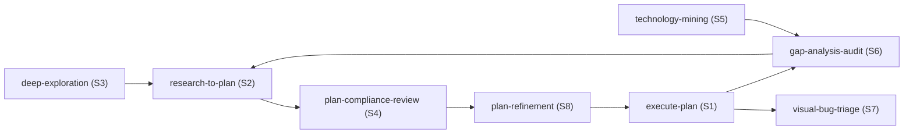

# Agent Skill Patterns

Systematic audit of 120+ user messages across a multi-week filesystem engineering conversation to identify recurring interaction patterns and translate them into reusable agent skills.

## Executive Summary

Analysis of a sustained conversation spanning research, planning, implementation, and review cycles reveals 8 distinct interaction patterns the user employs repeatedly. Each pattern follows a predictable lifecycle with consistent trigger phrases, input/output expectations, and composition relationships. The user currently re-specifies the full workflow on each invocation — codifying these as skills would eliminate repetitive instruction while ensuring consistent execution. Context engineering alignment analysis shows the current approach wastes tokens on repeated workflow boilerplate; skills would shift that budget toward domain-specific context.

## Problem Statement

Over 120+ messages, the user repeatedly provides detailed procedural instructions that follow the same structural patterns. Key symptoms:

1. **Instruction repetition**: The same workflow constraints appear verbatim across multiple messages (e.g., "take a TDD approach", "don't stop until all todos complete", "deeply explore and respond with findings, await instruction")
2. **Skill attachment overhead**: The user manually attaches `create-research` and `repos` skills on nearly every message, consuming context tokens even when the skill content is unchanged
3. **Implicit lifecycle protocol**: The user has iteratively refined a multi-phase lifecycle (explore -> plan review -> plan update -> execute) that is never explicitly documented

These patterns represent stable, repeatable workflows that satisfy the context engineering policy's "examples over rules" principle — each skill captures a proven interaction protocol rather than prescriptive rules.

## Methodology

1. Extracted all 122 user messages from the conversation transcript at `agent-transcripts/d32dc5e2-b087-4c5d-927c-75dc4100e137/`
2. Classified each message by intent type (explore, plan, execute, review, debug, research)
3. Grouped messages into recurring patterns by trigger phrases and structural similarity
4. Cross-referenced patterns against `docs/policy/context-engineering-policy.md` to identify token optimization opportunities
5. Designed skill blueprints using `create-skill` conventions, targeting under 150 lines per skill

## Findings

### Finding 1: Research-to-Plan Lifecycle

**Frequency**: 4+ complete cycles observed
**Trigger phrases**: "develop a plan to implement all of RX-RY", "create a comprehensive plan that tackles ALL PX items", "take a TDD approach"

The user follows a rigid lifecycle when translating research findings into implementation work:

| Phase      | User Action                                          | Expected Agent Behavior                                       |
| ---------- | ---------------------------------------------------- | ------------------------------------------------------------- |
| 1. Read    | Points to numbered recommendations in a research doc | Read the full doc, extract every referenced finding           |
| 2. Explore | "deeply explore to get a complete understanding"     | Search codebase for affected files, assess current state      |
| 3. Plan    | "develop a plan"                                     | Create phased plan with todos, cross-referencing research IDs |
| 4. Review  | "are we following all recommendations?"              | Adversarial plan review against research docs                 |
| 5. Update  | "update the plan"                                    | Revise plan incorporating review findings                     |
| 6. Execute | "implement the plan as specified"                    | TDD execution with progress tracking                          |

Key constraints the user always specifies:

- TDD: write failing test first, verify failure, implement, verify pass
- Every research finding maps to a plan task (systematic coverage)
- Cross-reference research recommendation IDs (e.g., R4, R12) in plan tasks
- Clean up all unused code as a dedicated phase
- Tests comply with `docs/policy/testing-policy.md` and `docs/policy/react-testing-policy.md`

### Finding 2: Plan Execution Protocol

**Frequency**: 4+ invocations with identical constraints
**Trigger phrases**: "Implement the plan as specified", "Do NOT edit the plan file itself", "Don't stop until you have completed all the to-dos"

The user has refined a precise execution protocol through iterative corrections:

| Rule                                | Origin                                               |
| ----------------------------------- | ---------------------------------------------------- |
| Do NOT edit the plan file           | Corrected after agent modified plan during execution |
| Do NOT recreate todos               | Corrected after agent duplicated existing todos      |
| Mark todos in_progress as you work  | Explicit instruction, repeated each cycle            |
| Start with the first todo           | Order matters — phases are sequential                |
| Don't stop until all todos complete | Prevents premature completion claims                 |

Verification protocol after each phase: `pnpm nx typecheck <project>`, `pnpm nx test <project> --watch=false`, `pnpm nx lint <project>`.

### Finding 3: Deep Exploration with Deferred Action

**Frequency**: 6+ occurrences
**Trigger phrases**: "deeply explore and respond with your findings", "no planning yet, deeply explore now", "respond with findings and await instruction"

The user consistently separates exploration from action. The agent is expected to:

1. Perform thorough research (read source, search codebase, reference research docs)
2. Present findings in structured format (tables, numbered items, tradeoff matrices)
3. Make a recommendation with rationale
4. Explicitly stop and await instruction — no planning or code changes

This pattern appears in two variants:

| Variant                 | Example                                         | Output Format                                           |
| ----------------------- | ----------------------------------------------- | ------------------------------------------------------- |
| API design exploration  | "what might a cleaner interface look like?"     | Options table with tradeoffs, recommended approach      |
| Architecture comparison | "What are our equivalents to VSCode's X, Y, Z?" | Side-by-side comparison matrix, deviation justification |

### Finding 4: Plan Compliance Review

**Frequency**: 3+ occurrences
**Trigger phrases**: "are we following all recommendations?", "are we deviating from finer-grained recommendations?", "are we leaving perf on the table?"

The user invokes adversarial review of plans against multiple research documents on three axes:

| Axis        | Question                                            | Evidence Required                                        |
| ----------- | --------------------------------------------------- | -------------------------------------------------------- |
| Coverage    | Is every finding/recommendation addressed?          | Mapping table: finding ID -> plan task                   |
| Compliance  | Do plan tasks faithfully implement recommendations? | Diff between recommendation specifics and plan approach  |
| Performance | Are there optimization opportunities not captured?  | Cite specific research findings with unaddressed details |

The review always concludes with "respond and await instruction" — never auto-apply corrections.

### Finding 5: Technology Mining Lifecycle

**Frequency**: 2 complete cycles (VS Code filesystem, Turso/AgentFS)
**Trigger phrases**: "deeply mine the entire X ecosystem", "clone the repos using /repos", "leave no stone unturned", "document this research with /create-research"

Orchestrated multi-step workflow:

```
Clone repos -> Deploy subagents for parallel exploration -> Synthesize findings
-> Create research doc -> Update gap analysis with derived recommendations
```

Composition chain: `repos` (clone) -> subagent exploration -> `create-research` (document) -> gap analysis update.

Key characteristics:

- Always uses subagents for parallel deep-dive into multiple repos/aspects
- Requires explicit "fit assessment" (adopt technology vs. adapt its patterns)
- Findings feed back into the canonical gap analysis document
- Creates new numbered recommendations (e.g., R16-R24 from Turso mining)

### Finding 6: Gap Analysis Audit

**Frequency**: 3+ occurrences
**Trigger phrases**: "deeply review X to understand outstanding tasks", "cross-reference against source code", "strikethrough all that have been addressed"

The user points to a tracking document (typically `filesystem-gap-analysis.md`) and asks the agent to verify implementation status of every item:

| Step | Action                                                      |
| ---- | ----------------------------------------------------------- |
| 1    | Read the tracking doc, extract all findings/recommendations |
| 2    | Search codebase for evidence of each item's implementation  |
| 3    | Classify: COMPLETE / PARTIAL / MISSING                      |
| 4    | Update the document with status indicators                  |

Status convention established by the user: tick emoji = complete, cross emoji = not complete, construction emoji = partial. Emoji placed at start of the finding heading.

### Finding 7: Visual Bug Triage

**Frequency**: 3 occurrences
**Trigger phrases**: `[Image]` + "find the issue and fix it", "see imgs", combined with console log output

The user provides screenshots showing a visual regression, often with console logs pasted inline. The agent is expected to:

1. Analyze the screenshot to identify the visual symptom
2. Correlate with console output to narrow the root cause
3. Trace to recent code changes (the user assumes the regression was introduced by recent work)
4. Fix directly rather than planning (these are focused, surgical fixes)
5. Verify the fix works

### Finding 8: Incremental Plan Refinement

**Frequency**: 3+ occurrences
**Trigger phrases**: "excellent, update the plan", "Yes, update the plan to use X", "call it `ResourceQueue` instead"

Short directive messages that refine an existing plan based on exploration findings or naming preferences. The agent is expected to:

1. Incorporate the specific feedback into the existing plan
2. Not restart from scratch — modify in place
3. Maintain plan structure and todo IDs where possible
4. Acknowledge the change concisely

## Recommendations

### Skill Blueprints

Eight skills derived from the observed patterns. Ordered by impact (frequency x token savings).

| #   | Skill Name               | Pattern                                   | Priority | Estimated Token Savings                                                  |
| --- | ------------------------ | ----------------------------------------- | -------- | ------------------------------------------------------------------------ |
| S1  | `execute-plan`           | F2: Plan Execution Protocol               | P0       | High — eliminates 5+ repeated constraints per invocation                 |
| S2  | `research-to-plan`       | F1: Research-to-Plan Lifecycle            | P0       | High — eliminates full TDD/coverage specification                        |
| S3  | `deep-exploration`       | F3: Deep Exploration with Deferred Action | P0       | Medium — enforces explore-only mode without repeated "await instruction" |
| S4  | `plan-compliance-review` | F4: Plan Compliance Review                | P1       | Medium — standardizes the three-axis review protocol                     |
| S5  | `technology-mining`      | F5: Technology Mining Lifecycle           | P1       | Medium — orchestrates clone/explore/document/integrate chain             |
| S6  | `gap-analysis-audit`     | F6: Gap Analysis Audit                    | P1       | Medium — standardizes status classification and update format            |
| S7  | `visual-bug-triage`      | F7: Visual Bug Triage                     | P2       | Low — infrequent, but establishes screenshot correlation protocol        |
| S8  | `plan-refinement`        | F8: Incremental Plan Refinement           | P2       | Low — short interactions, but codifies in-place update semantics         |

### S1: `execute-plan`

**Description**: Executes an implementation plan following TDD protocol with todo tracking. Use when asked to implement a plan, execute plan phases, or when the user says "implement the plan as specified".

**Trigger terms**: implement, execute, plan as specified, don't stop, all todos

**Key instructions**:

- Never edit the plan file itself
- Never recreate existing todos — use existing IDs
- Mark todos `in_progress` sequentially, starting from the first pending
- TDD per phase: write failing test, verify failure, implement fix, verify pass
- Run verification after each phase: typecheck, test (--watch=false), lint
- Do not stop until all todos are completed or blocked
- Tests must comply with `docs/policy/testing-policy.md` and `docs/policy/react-testing-policy.md`

**Degrees of freedom**: Low — this is a fragile protocol where deviation causes user frustration.

**Estimated size**: ~80 lines

### S2: `research-to-plan`

**Description**: Translates numbered research findings/recommendations into a phased implementation plan with TDD methodology. Use when asked to "develop a plan to implement" specific findings, create a plan from research recommendations, or address audit items.

**Trigger terms**: develop a plan, implement R1-R12, address findings, TDD approach, plan from research

**Key instructions**:

- Read the referenced research doc completely; extract every finding/recommendation in scope
- Deeply explore affected source files before planning
- Every research finding/recommendation maps to at least one plan task
- Plan tasks cross-reference the source recommendation ID (e.g., "R4", "Finding 6")
- TDD approach: each task starts with asserting expected behavior, validating test failure, then fixing
- Include a dedicated phase for dead code cleanup
- Comply with `docs/policy/testing-policy.md` and `docs/policy/react-testing-policy.md`
- Use CreatePlan tool for output

**Composes with**: `deep-exploration` (pre-planning research), `execute-plan` (post-planning execution)

**Degrees of freedom**: Medium — plan structure varies by domain, but coverage and TDD constraints are rigid.

**Estimated size**: ~120 lines

### S3: `deep-exploration`

**Description**: Performs thorough codebase or architectural exploration and presents findings without making changes. Use when asked to deeply explore, investigate, assess, or when the user says "no planning yet" or "respond with findings and await instruction".

**Trigger terms**: deeply explore, deeply review, respond with findings, await instruction, no planning yet, assess, investigate

**Key instructions**:

- Read all referenced docs/files thoroughly
- Search codebase for evidence and affected code
- Present findings in structured format: tables, numbered items, comparison matrices
- Include a recommendation with rationale when applicable
- Explicitly stop after presenting findings — do NOT create plans, make edits, or take action
- Use subagents for parallel exploration when scope spans multiple areas

**Variants**:

- API design exploration: present options table with tradeoffs, recommend one
- Architecture comparison: side-by-side matrix against reference implementation, justify deviations
- Fit assessment: evaluate technology/approach against Tau's architecture and vision

**Degrees of freedom**: High — output format adapts to the question.

**Estimated size**: ~100 lines

### S4: `plan-compliance-review`

**Description**: Adversarially reviews an implementation plan against research documents and policies on three axes: coverage, compliance, and performance. Use when asked if the plan follows all recommendations, whether anything is left on the table, or if the plan is in compliance with research/policy docs.

**Trigger terms**: following all recommendations, deviating, leaving perf on the table, in compliance with, deeply review the plan

**Key instructions**:

- Read the plan and all referenced research/policy documents
- Coverage check: map every research finding/recommendation to a plan task; flag gaps
- Compliance check: compare plan task details against recommendation specifics; flag deviations
- Performance check: identify optimization opportunities in research docs not captured in plan
- Present findings as a structured report
- Conclude with "await instruction" — never auto-modify the plan

**Degrees of freedom**: Low — the three-axis framework is rigid; findings presentation is flexible.

**Estimated size**: ~90 lines

### S5: `technology-mining`

**Description**: Orchestrates deep exploration of an external technology ecosystem: clone repos, deploy subagents for parallel source analysis, create research documentation, and integrate findings into gap analysis. Use when asked to mine, deeply explore an ecosystem, or evaluate an external technology for Tau.

**Trigger terms**: deeply mine, ecosystem, clone repos, leave no stone unturned, document research

**Key instructions**:

- Use the `repos` skill to clone all relevant repos
- Deploy multiple subagents in parallel for deep source exploration of different repos/aspects
- Synthesize subagent findings into a coherent analysis
- Create a formal research doc using `create-research` skill conventions
- Update the canonical gap analysis doc with derived findings and recommendations
- Include explicit "fit assessment": adopt the technology vs. adapt its patterns

**Composes with**: `repos` (cloning), `create-research` (documentation), `gap-analysis-audit` (integration)

**Degrees of freedom**: Medium — exploration scope varies, but the lifecycle (clone -> explore -> document -> integrate) is fixed.

**Estimated size**: ~130 lines

### S6: `gap-analysis-audit`

**Description**: Cross-references requirements from a tracking document against the actual codebase, classifying each as COMPLETE, PARTIAL, or MISSING. Use when asked to review outstanding tasks, audit implementation status, or update a gap analysis document with current status.

**Trigger terms**: deeply review to understand outstanding, cross-reference against source, strikethrough addressed items, audit status

**Key instructions**:

- Read the tracking document; extract all numbered findings/recommendations
- Search the codebase for evidence of each item's implementation
- Classify each: COMPLETE (tick), PARTIAL (construction), MISSING (cross)
- Update the tracking document with status indicators (emoji at start of heading)
- Use subagents for parallel codebase exploration when the item count is large
- Report summary: X complete, Y partial, Z missing

**Degrees of freedom**: Low — classification scheme and emoji convention are fixed.

**Estimated size**: ~80 lines

### S7: `visual-bug-triage`

**Description**: Diagnoses visual regressions from screenshots and console logs, traces to recent code changes, and applies surgical fixes. Use when the user provides screenshots showing a UI bug, visual regression, or rendering issue alongside log output.

**Trigger terms**: screenshot, see imgs, find the issue, visual regression, UI bug with image

**Key instructions**:

- Analyze screenshot to identify the visual symptom
- Correlate with provided console logs
- Check recent code changes (git diff, recent conversation context) for likely cause
- Apply a targeted fix rather than broad refactoring
- Verify: typecheck, test, request visual confirmation from user

**Degrees of freedom**: High — diagnosis approach depends entirely on the symptom.

**Estimated size**: ~60 lines

### S8: `plan-refinement`

**Description**: Applies incremental refinements to an existing plan based on user feedback (naming changes, approach adjustments, scope additions). Use when the user says "update the plan", "call it X instead", or provides short directive feedback on an existing plan.

**Trigger terms**: update the plan, call it X instead, yes update, incorporate

**Key instructions**:

- Modify the existing plan in place; do not rebuild from scratch
- Preserve plan structure, todo IDs, and completed items
- Incorporate the specific feedback precisely
- Acknowledge the change concisely

**Degrees of freedom**: High — changes are user-directed and surgical.

**Estimated size**: ~40 lines

## Context Engineering Alignment

Analysis of how these skills align with `docs/policy/context-engineering-policy.md`:

| Principle              | Current State                                                  | With Skills                                            |
| ---------------------- | -------------------------------------------------------------- | ------------------------------------------------------ |
| Minimize tokens        | User repeats 50-100 token constraint blocks per message        | Skill captures constraints once; user invokes by name  |
| Right altitude         | User over-specifies to prevent agent deviation                 | Skill encodes the refined protocol at correct altitude |
| Single source of truth | Workflow lives in user's head, re-specified each time          | Skill is the canonical definition                      |
| Examples over rules    | User has implicitly provided 4+ examples of each pattern       | Skills distill these into one canonical workflow       |
| Progressive disclosure | Full workflow injected every time                              | Skill loaded on demand via skill discovery             |
| Trust model capability | User adds defensive instructions ("Do NOT edit the plan file") | Skill states the constraint once                       |

### Composition Graph

Skills compose in a directed acyclic graph matching the observed lifecycle:



### Token Budget Estimate

| Skill                     | Lines | Est. Tokens | Invocations Saved | Net Savings per Cycle                                    |
| ------------------------- | ----- | ----------- | ----------------- | -------------------------------------------------------- |
| S1 execute-plan           | ~80   | ~400        | 4+                | ~200 tokens (eliminates 5 constraint sentences)          |
| S2 research-to-plan       | ~120  | ~600        | 4+                | ~400 tokens (eliminates full TDD specification)          |
| S3 deep-exploration       | ~100  | ~500        | 6+                | ~300 tokens (eliminates "await instruction" boilerplate) |
| S4 plan-compliance-review | ~90   | ~450        | 3+                | ~250 tokens (eliminates three-axis specification)        |
| S5 technology-mining      | ~130  | ~650        | 2+                | ~500 tokens (eliminates full orchestration instructions) |
| S6 gap-analysis-audit     | ~80   | ~400        | 3+                | ~200 tokens (eliminates classification scheme)           |
| S7 visual-bug-triage      | ~60   | ~300        | 3+                | ~100 tokens (lightweight pattern)                        |
| S8 plan-refinement        | ~40   | ~200        | 3+                | ~50 tokens (already concise interactions)                |

## References

- Policy: `docs/policy/context-engineering-policy.md`
- Policy: `docs/policy/filesystem-context-policy.md`
- Conversation transcript: `agent-transcripts/d32dc5e2-b087-4c5d-927c-75dc4100e137/`
- Skill guide: `.cursor/skills-cursor/create-skill/SKILL.md`
