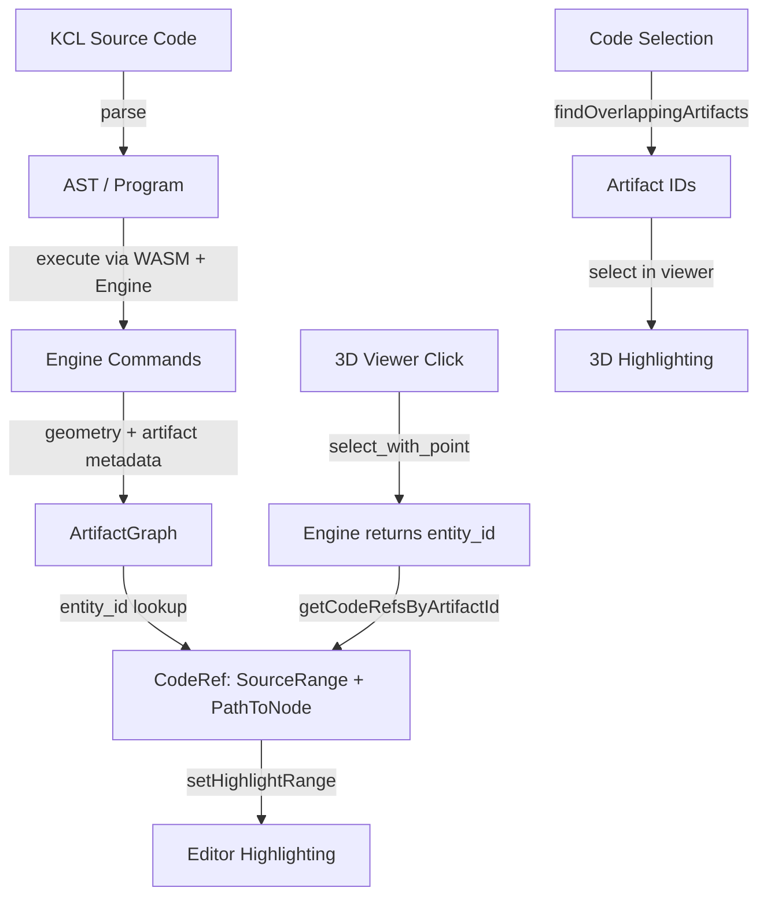
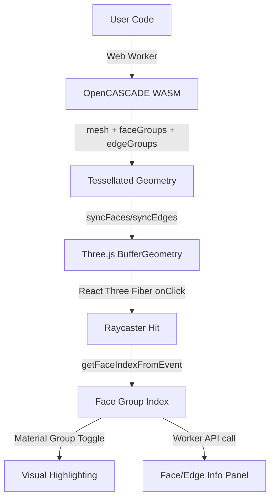
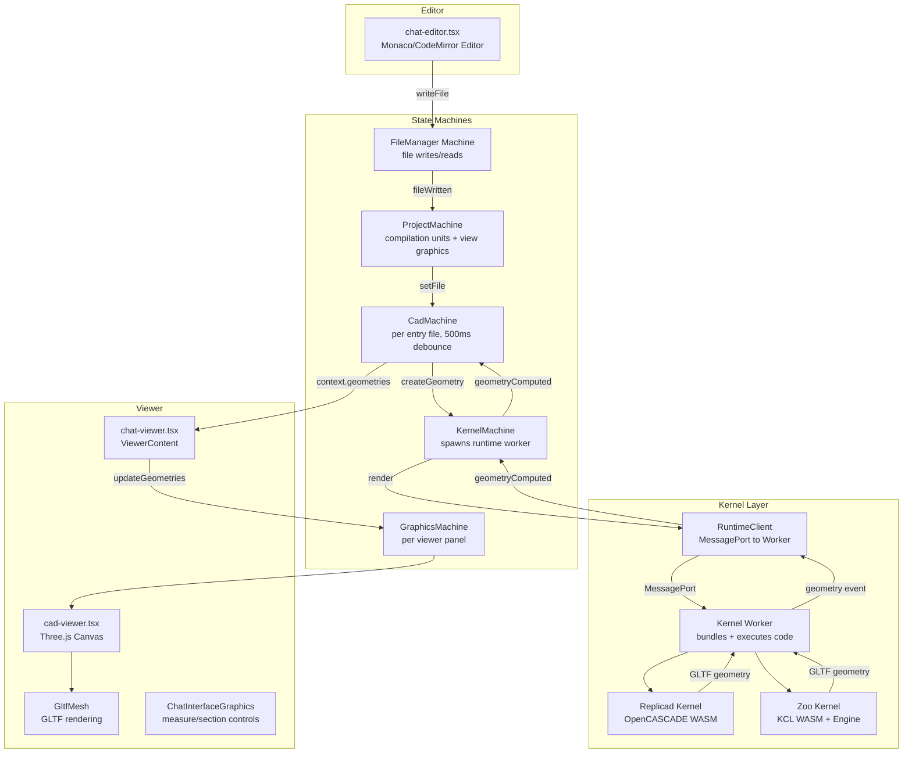
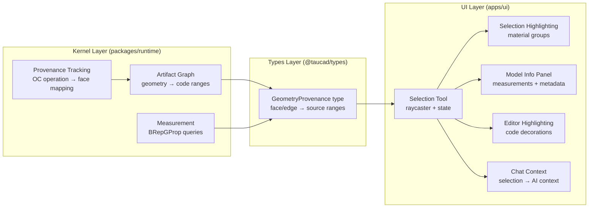

# Code ↔ Geometry Correlation: Research & Architecture

## Table of Contents

1. [Feature Overview](#1-feature-overview)
2. [Zoo (KittyCAD/KCL) Analysis](#2-zoo-kittycadkcl-analysis)
3. [Replicad Studio Analysis](#3-replicad-studio-analysis)
4. [Tau Architecture Trace](#4-tau-architecture-trace)
5. [Existing Infrastructure](#5-existing-infrastructure)
6. [Architectural Design](#6-architectural-design)
7. [Implementation Strategy](#7-implementation-strategy)
8. [Key Features List](#8-key-features-list)
9. [Open Questions & Risks](#9-open-questions--risks)

---

## 1. Feature Overview

### Target Experience

1. **Click/hover a face or edge** in the 3D viewer → the code responsible for that geometry highlights in the editor
2. **A selection panel** (`chat-model-info.tsx`) appears above `ChatInterfaceGraphics` showing measurements (edge length, face area, surface type, normal vector)
3. **One geometry element maps to multiple code ranges** (e.g., a face produced by an extrusion maps to both the sketch line and the extrude call)
4. **Bidirectional**: selecting code highlights corresponding geometry
5. **Agentic integration**: selected geometry context is fed into the AI chat for precise code edits

### Reference Implementation

Zoo Modeling App achieves this for KCL code via their artifact graph system. See attached screenshots - the prosthetic hip model demonstrates face/edge selection with multi-line code highlighting (one edge hover maps to several code regions).

---

## 2. Zoo (KittyCAD/KCL) Analysis

### 2.1 Architecture Overview

Zoo's approach relies on the **artifact graph** - a Map of geometry IDs to artifact objects, each carrying a `codeRef` linking geometry back to source code.



### 2.2 Core Data Structures

#### ArtifactGraph

```typescript
type ArtifactGraph = Map<ArtifactId, Artifact>;
```

Each artifact has:

- `id: ArtifactId` - unique identifier (matches engine entity IDs)
- `type` - one of: `wall`, `cap`, `segment`, `sweepEdge`, `edgeCut`, `path`, `sweep`, `solid2d`, `plane`, `compositeSolid`, `sketchBlock`
- `codeRef: CodeRef` - link to source code

#### CodeRef

```typescript
interface CodeRef {
  range: SourceRange; // [start, end, moduleId]
  pathToNode: PathToNode; // AST navigation path
}

type SourceRange = [number, number, number]; // [charStart, charEnd, fileId]
type PathToNode = [string | number, string][]; // AST path segments
```

#### Artifact Hierarchy

```
path (sketch path)
  └── segment (individual edge in sketch)
        └── sweep (extrusion/revolution)
              ├── wall (side face from extrusion)
              ├── cap (top/bottom face)
              └── sweepEdge (edge from sweep operation)
                    └── edgeCut (chamfer/fillet applied to edge)
```

### 2.3 Selection Flow

#### Geometry → Code (Click/Hover)

1. **Mouse event**: `ConnectionStream.tsx` sends `select_with_point` command to engine
2. **Engine response**: Returns `{ entity_id: string }` identifying clicked geometry
3. **Artifact lookup**: `getCodeRefsByArtifactId(entity_id, artifactGraph)` returns `CodeRef[]`
4. **Multi-range resolution**: A wall returns TWO code refs (the segment's sketch line + the sweep/extrude call)
5. **Editor highlight**: `kclManager.setHighlightRange(ranges)` applies CodeMirror decorations

```typescript
// Key function - returns multiple code ranges per artifact
function getCodeRefsByArtifactId(id: string, artifactGraph: ArtifactGraph): CodeRef[] | null {
  const artifact = artifactGraph.get(id);
  if (artifact?.type === 'wall') {
    const extrusion = getSweepFromSuspectedSweepSurface(id, artifactGraph);
    const codeRef = getWallCodeRef(artifact, artifactGraph); // → segment codeRef
    return err(extrusion) ? [codeRef] : [codeRef, extrusion.codeRef];
    //                       ↑ sketch line     ↑ extrude call
  }
  // ... similar for cap, sweepEdge, edgeCut
}
```

#### Code → Geometry (Editor Selection)

1. **ArtifactIndex**: Sorted array of `{ range: SourceRange, entry: ArtifactEntry }` by start position
2. **Binary search**: `findLastRangeStartingBefore()` finds starting point in O(log n)
3. **Linear overlap scan**: Finds all artifacts overlapping the selected code range
4. **Best candidate**: Priority ordering `sketchBlock > segment > path > plane/cap/wall/sweep`

### 2.4 Editor Integration

Zoo uses CodeMirror with a custom `StateField`:

```typescript
// StateEffect for adding highlight ranges
const addLineHighlight = StateEffect.define<Array<[number, number]>>();

// StateField managing decorations
const lineHighlightField = StateField.define({
  update(lines, tr) {
    for (let e of tr.effects) {
      if (e.is(addLineHighlight)) {
        for (let index = 0; index < e.value.length; index++) {
          const [from, to] = e.value[index];
          // First range = primary color, subsequent = secondary
          const deco = index === 0 ? matchDeco : matchDeco2;
          lines = lines.update({ add: [deco.range(from, to)] });
        }
      }
    }
    return lines;
  },
});
```

### 2.5 How Artifacts Are Populated

The artifact graph is built **during KCL execution in Rust/WASM**:

1. Rust KCL executor sends modeling commands to the engine
2. Each command carries the AST node's source range
3. Engine returns geometry entities with IDs
4. Rust execution context builds the `ArtifactGraph` mapping entity IDs → code refs
5. `artifactGraphFromRust()` converts to TypeScript Map with `PathToNode` resolution

**Critical insight**: The artifact graph is produced by the **language runtime**, not the geometry engine. The runtime knows which AST node triggered which engine command, so it can tag each resulting entity with its source location.

### 2.6 Key Files

| File                                            | Purpose                                                  |
| ----------------------------------------------- | -------------------------------------------------------- |
| `src/lang/std/artifactGraph.ts`                 | Artifact types, graph traversal, codeRef resolution      |
| `src/lib/selections.ts`                         | Selection processing, code↔artifact bidirectional lookup |
| `src/lib/artifactIndex.ts`                      | Binary search index for fast code→artifact               |
| `src/components/ConnectionStream.tsx`           | Mouse click → engine `select_with_point`                 |
| `src/hooks/useEngineConnectionSubscriptions.ts` | Engine hover events → code highlighting                  |
| `src/editor/highlightextension.ts`              | CodeMirror StateField for range decorations              |
| `src/lang/KclManager.ts`                        | Editor state, highlight ranges, artifact graph storage   |
| `src/lang/wasm.ts`                              | `artifactGraphFromRust()` - Rust→TS conversion           |

---

## 3. Replicad Studio Analysis

### 3.1 Architecture Overview

Replicad Studio provides face/edge selection purely in JavaScript/Three.js with no code mapping, but has valuable lessons for the 3D interaction layer.



### 3.2 Face/Edge Identification

#### Mesh Generation with Groups

Replicad generates tessellated meshes from OpenCASCADE shapes with face/edge group metadata:

```typescript
// From replicad/src/shapes.ts - mesh() method
mesh(): ShapeMesh {
  const faceGroups: { start: number; count: number; faceId: number }[] = [];

  for (const face of this.faces) {
    const tri = face.triangulation(vertices.length / 3);
    faceGroups.push({
      start: triangles.length,          // start index in triangle array
      count: trianglesIndexes.length,   // number of triangles in this face
      faceId: face.hashCode,            // OpenCASCADE shape hash
    });
    // ... accumulate triangles, vertices, normals
  }

  return { triangles, vertices, normals, faceGroups };
}
```

The `faceId` uses `OCJS_ShapeHasher.HashCode()` - a stable identifier for each topological face in the B-Rep.

#### Click → Face Index

```typescript
// React Three Fiber provides faceIndex (triangle index) in click event
function getFaceIndex(triangleIndex: number, geometry: BufferGeometry): number {
  return geometry.groups.findIndex(
    ({ start, count }) => triangleIndex * 3 >= start && triangleIndex * 3 < start + count,
  );
}
```

### 3.3 Highlighting Mechanism

Two-material approach using Three.js material groups:

```jsx
<mesh>
  <bufferGeometry groups={faceGroups} />
  <meshStandardMaterial attach='material-0' color='default' /> {/* Normal */}
  <meshStandardMaterial attach='material-1' color='selected' /> {/* Highlighted */}
</mesh>
```

Highlighting toggles `group.materialIndex` between 0 and 1:

```typescript
function highlightInGeometry(elements: number[], geometry: ThreeGeometry): void {
  geometry.groups.forEach((group, groupIndex) => {
    group.materialIndex = elements.includes(groupIndex) ? 1 : 0;
    geometry.groupsNeedUpdate = true;
  });
}
```

### 3.4 Measurement Capabilities

Replicad has measurement functions using `BRepGProp` but doesn't display them in the selection panel:

```typescript
// From replicad/src/measureShape.ts
function measureArea(shape: Face | Shape3D): number {
  const properties = new oc.GProp_GProps_1();
  oc.BRepGProp.SurfaceProperties_1(shape.wrapped, properties, false, false);
  return properties.Mass(); // GProp reports area as "mass" for surface props
}

function measureLength(shape: AnyShape): number {
  const properties = new oc.GProp_GProps_1();
  oc.BRepGProp.LinearProperties(shape.wrapped, properties, false, false);
  return properties.Mass();
}
```

### 3.5 Face/Edge Info Display

The studio shows basic metadata (not measurements):

- Face: type (PLANE, CYLINDER, etc.), center point, normal vector
- Edge: type, start point, end point, tangent direction

### 3.6 Geometry → Code Mapping Gap

**Replicad Studio does NOT map geometry back to code.** This is the key gap we need to fill for the Replicad kernel.

### 3.7 Key Lessons

1. **`faceGroups`/`edgeGroups` are essential** - they map triangles back to topological faces/edges
2. **hashCode provides stable face IDs** - but these change with topology changes
3. **Material group toggling is efficient** for highlighting (no geometry recreation)
4. **Worker API pattern works well** - compute in worker, display in main thread
5. **Face info is cheap to compute** - type, center, normal are fast OC queries
6. **Measurements exist but need wiring** - `BRepGProp` functions are available

---

## 4. Tau Architecture Trace

### 4.1 Complete Data Flow



### 4.2 Key Components

| Component                    | Location                                                | Role                                                    |
| ---------------------------- | ------------------------------------------------------- | ------------------------------------------------------- |
| `chat-editor.tsx`            | `apps/ui/app/routes/projects_.$id/`                     | Code editor with Monaco                                 |
| `chat-viewer.tsx`            | `apps/ui/app/routes/projects_.$id/`                     | 3D viewer container                                     |
| `chat-interface-desktop.tsx` | `apps/ui/app/routes/projects_.$id/`                     | Panel layout (Allotment)                                |
| `cad.machine.ts`             | `apps/ui/app/machines/`                                 | Per-file CAD state (debounce, render, geometry storage) |
| `kernel.machine.ts`          | `apps/ui/app/machines/`                                 | Kernel worker lifecycle                                 |
| `graphics.machine.ts`        | `apps/ui/app/machines/`                                 | Per-viewer state (measure, section-view, camera)        |
| `cad-viewer.tsx`             | `apps/ui/app/components/geometry/cad/`                  | Three.js Canvas + GltfMesh                              |
| `gltf-mesh.tsx`              | `apps/ui/app/components/geometry/graphics/three/react/` | GLTF loading and rendering                              |
| `measure-tool.tsx`           | `apps/ui/app/components/geometry/graphics/three/react/` | Point-to-point measurement (raycaster)                  |
| `snap-detection.utils.ts`    | `apps/ui/app/components/geometry/graphics/three/utils/` | Face detection, snap points                             |
| `chat-context-actions.tsx`   | `apps/ui/app/components/chat/`                          | Context injection into AI chat                          |
| `use-chat.tsx`               | `apps/ui/app/hooks/`                                    | Chat state management                                   |

### 4.3 Where New Components Fit

```
chat-viewer.tsx (ViewerContent)
├── CadViewer
│   ├── GltfMesh (existing)
│   ├── SelectionTool (NEW - raycaster for face/edge picking)
│   └── SelectionHighlight (NEW - visual highlighting)
├── ChatModelInfo (NEW - face/edge info panel, above ChatInterfaceGraphics)
├── ChatInterfaceGraphics (existing)
├── ChatStackTrace (existing)
└── ChatViewerControls (existing)
```

---

## 5. Existing Infrastructure

### 5.1 What Already Exists

| Capability                            | Status         | Location                                               |
| ------------------------------------- | -------------- | ------------------------------------------------------ |
| Three.js Raycaster                    | ✅ Implemented | `measure-tool.tsx`                                     |
| Face detection from triangle hit      | ✅ Implemented | `snap-detection.utils.ts`                              |
| `faceGroups`/`edgeGroups` in geometry | ✅ In types    | `replicad.types.ts`                                    |
| GLTF loading and rendering            | ✅ Implemented | `gltf-mesh.tsx`                                        |
| Graphics state machine                | ✅ Implemented | `graphics.machine.ts` with measure/section-view states |
| OC Proxy tracing                      | ✅ Implemented | `oc-tracing.ts`                                        |
| OC Exception proxy                    | ✅ Implemented | `oc-exceptions.ts`                                     |
| Source map support                    | ✅ In bundler  | esbuild generates source maps for user code            |
| Zoo artifact graph (types)            | ✅ Available   | `@taucad/kcl-wasm-lib/bindings/Artifact`               |
| Chat context injection                | ✅ Implemented | `chat-context-actions.tsx`                             |

### 5.2 What's Missing

| Capability                                              | Priority | Complexity |
| ------------------------------------------------------- | -------- | ---------- |
| Face/edge selection state in GraphicsMachine            | High     | Low        |
| Visual highlighting of selected faces/edges             | High     | Medium     |
| Geometry provenance metadata (which op made which face) | High     | High       |
| Code range mapping for Replicad kernel                  | High     | High       |
| Artifact graph exposure from Zoo kernel                 | Medium   | Low        |
| Editor highlight decorations for selections             | Medium   | Low        |
| Measurement computation (area/length)                   | Medium   | Low        |
| Selection info panel (`ChatModelInfo`)                  | Medium   | Low        |
| AI chat context from selections                         | Medium   | Low        |

### 5.3 OC Tracing Proxy (Current State)

The existing tracing proxy at `oc-tracing.ts` wraps the OpenCASCADE instance to measure performance:

```typescript
// Current: wraps oc class access for timing
const tracedInstance = new Proxy(oc, {
  get(target, property) {
    // Wraps functions with timing via Proxy construct/apply traps
    return wrapFunction(value, className);
  },
});
```

This same pattern can be **extended** to capture operation provenance - tracking which OC operations produced which shapes/faces.

---

## 6. Architectural Design

### 6.1 Where Does This Capability Live?

After analyzing the architecture, this capability spans **three layers**:



**Recommendation**: This is a **kernel capability** that extends `CreateGeometryOutput`:

```typescript
type CreateGeometryOutput<NativeHandle = unknown> = {
  geometry: GeometryResponse[];
  nativeHandle: NativeHandle;
  issues?: KernelIssue[];
  provenance?: GeometryProvenance; // NEW: face/edge → code mapping
};
```

Rationale:

- The kernel is where code executes and geometry is produced - it's the only place with access to both
- Different kernels (Replicad, Zoo, OpenSCAD) will have different provenance mechanisms
- The UI layer consumes provenance data uniformly regardless of kernel
- Measurements (area/length) require access to the B-Rep which only the kernel has
- It fits the existing `defineKernel` pattern as an optional return field

### 6.2 Provenance Data Model

```typescript
/** Maps geometry elements (faces/edges) back to source code locations */
type GeometryProvenance = {
  /** Per-face provenance: maps face group index → code ranges */
  faces: FaceProvenance[];
  /** Per-edge provenance: maps edge group index → code ranges */
  edges: EdgeProvenance[];
};

type FaceProvenance = {
  /** Index into the geometry's faceGroups array */
  faceGroupIndex: number;
  /** OpenCASCADE shape hash (stable within one computation) */
  faceId: number;
  /** Code locations that produced this face (may be multiple) */
  codeRanges: SourceRange[];
  /** Optional: pre-computed measurements */
  measurements?: FaceMeasurements;
};

type EdgeProvenance = {
  edgeGroupIndex: number;
  edgeId: number;
  codeRanges: SourceRange[];
  measurements?: EdgeMeasurements;
};

type SourceRange = {
  fileName: string;
  startLine: number;
  startColumn: number;
  endLine: number;
  endColumn: number;
};

type FaceMeasurements = {
  area: number;
  surfaceType: string; // PLANE, CYLINDER, CONE, SPHERE, TORUS, BSPLINE, etc.
  center: [number, number, number];
  normal: [number, number, number];
};

type EdgeMeasurements = {
  length: number;
  curveType: string; // LINE, CIRCLE, ELLIPSE, BSPLINE, etc.
  startPoint: [number, number, number];
  endPoint: [number, number, number];
};
```

### 6.3 Kernel-Specific Strategies

#### Zoo Kernel: Artifact Graph Exposure

The Zoo kernel already has access to `executionResult.artifactGraph` but currently discards it. The fix is straightforward:

```typescript
// In zoo.kernel.ts createGeometry():
const executionResult = await utils.executeProgram(modifiedProgram, 'main.kcl');
// Currently: only exports GLTF
// Proposed: also return artifact graph as provenance
return {
  geometry: [gltfGeometry],
  nativeHandle: gltf.contents,
  provenance: convertArtifactGraphToProvenance(executionResult.artifactGraph, code),
};
```

The `artifactGraph` from KCL execution contains:

- `operations: Operation[]` - ordered list of operations
- `artifactGraph: ArtifactGraph` - map of entity IDs to artifacts with `codeRef`
- Each artifact's `codeRef` has `range: [charStart, charEnd, fileId]`

This is the **easiest path to a working prototype** since the data is already computed.

#### Replicad Kernel: Operation Provenance Tracking

This is harder because Replicad/OpenCASCADE doesn't natively track provenance. We need to build it.

**Approach: Replicad API Proxy + Source Map Correlation**

```mermaid
graph TD
    A[User Code<br/>import { draw } from 'replicad'] -->|esbuild bundle| B[Bundled Code + Source Map]
    B -->|execute| C[Replicad API Calls]
    C -->|Proxy intercept| D[Operation Log<br/>method, args, callsite, result shape]
    D -->|Source map resolve| E[Original Code Ranges]

    F[Result Shape] -->|mesh()| G[faceGroups with faceIds]

    D -->|Shape tracking| H[Shape → Operations Map]
    G -->|faceId → shape| I[Face → Operations Map]
    H --> I
    I --> J[Face → Code Ranges]
    E --> J
```

**Key challenge**: Mapping OpenCASCADE topological faces to the operations that created them.

**Strategy 1: Replicad API-Level Tracking (Recommended)**

Wrap Replicad's high-level API (not OC directly) to track shape transformations:

```typescript
// Conceptual: wrap replicad methods to track provenance
function wrapReplicadForProvenance(replicad, sourceMap) {
  const operationLog = [];

  return new Proxy(replicad, {
    get(target, prop) {
      if (prop === 'draw' || prop === 'drawRoundedRectangle' || ...) {
        return (...args) => {
          const callsite = captureCallsite(); // from Error().stack
          const resolvedLocation = resolveSourceMap(callsite, sourceMap);
          const result = target[prop](...args);

          operationLog.push({
            operation: prop,
            args,
            resultShapeHash: result.hashCode,
            sourceRange: resolvedLocation,
          });

          return result; // could also wrap the result to track chained operations
        };
      }
    }
  });
}
```

**Strategy 2: OpenCASCADE Shape History (Advanced)**

OpenCASCADE's `BRepBuilderAPI_MakeShape` has `Generated()`, `Modified()`, `IsDeleted()` methods that track how faces/edges transform through operations. This could be used to trace face provenance through boolean operations.

```
Shape A (box) has faces [f1, f2, f3, f4, f5, f6]
Shape B (cylinder) has faces [f7, f8, f9]
Union(A, B) produces Shape C with faces [f1', f2', f3', f10, f11, ...]
  → Modified(f1) = f1' (face was trimmed)
  → Generated(f7_edge) = f10 (new face from intersection)
  → IsDeleted(f4) = true (face was consumed)
```

This is what we'd eventually need for full provenance through complex boolean operations.

### 6.4 Source Map Integration

User code is bundled by esbuild which produces source maps. We already use these for error reporting (`oc-exceptions.ts`). The same mechanism can resolve runtime callsites back to original code:

```typescript
// Existing in oc-exceptions.ts:
formatRuntimeErrorWithOc({
  parseStackTrace, // Error.stack → structured frames
  applySourceMaps, // frames → resolved source locations
  deriveLocation, // frames → ErrorLocation
  sourceMap, // esbuild source map JSON
});
```

For provenance tracking, we'd capture `new Error().stack` at each Replicad API call, then resolve through the source map to get original file/line/column.

### 6.5 UI Architecture

#### Selection State (GraphicsMachine Extension)

```typescript
// New context fields for graphics.machine.ts
type SelectionState = {
  selectedFaces: Array<{
    geometryIndex: number; // which geometry in the array
    faceGroupIndex: number; // which face group
    provenance?: FaceProvenance;
  }>;
  selectedEdges: Array<{
    geometryIndex: number;
    edgeGroupIndex: number;
    provenance?: EdgeProvenance;
  }>;
  hoveredFace?: { geometryIndex: number; faceGroupIndex: number };
  hoveredEdge?: { geometryIndex: number; edgeGroupIndex: number };
  isSelectionMode: boolean;
};

// New events
type SelectionEvents =
  | { type: 'selectFace'; geometryIndex: number; faceGroupIndex: number }
  | { type: 'selectEdge'; geometryIndex: number; edgeGroupIndex: number }
  | { type: 'setHoveredFace'; geometryIndex: number; faceGroupIndex: number }
  | { type: 'clearHover' }
  | { type: 'clearSelection' }
  | { type: 'toggleSelectionMode' };
```

#### Selection Tool Component

Follow the existing `measure-tool.tsx` pattern:

```typescript
// selection-tool.tsx (conceptual)
function SelectionTool({ geometries, provenance }) {
  const raycaster = useRef(new THREE.Raycaster());
  const meshes = useMemo(() => collectMeshes(scene), [scene]);

  useEffect(() => {
    function onMouseMove(e) {
      const intersection = raycast(e, raycaster, meshes);
      if (intersection) {
        const faceIndex = getFaceGroupIndex(intersection);
        graphicsActor.send({ type: 'setHoveredFace', faceIndex });
        // Highlight code in editor
        const ranges = provenance?.faces[faceIndex]?.codeRanges;
        if (ranges) editorActor.send({ type: 'highlightRanges', ranges });
      }
    }
    // ... attach listeners
  }, [meshes]);
}
```

#### Model Info Panel

```
┌─────────────────────────────────────┐
│ Selected Face #3                     │
│                                     │
│ Type: CYLINDER                      │
│ Area: 125.66 mm²                    │
│ Center: (10.0, 0.0, 15.0)         │
│ Normal: (1.0, 0.0, 0.0)           │
│                                     │
│ Source:                             │
│   box.ts:12  |> fillet(5)          │
│   box.ts:8   |> extrude(30)        │
└─────────────────────────────────────┘
```

#### Chat Context Integration

```typescript
// In chat-context-actions.tsx
{
  id: 'geometry-selection',
  label: 'Selected Geometry',
  icon: <CursorClick />,
  disabled: !hasSelection,
  action: () => {
    const context = formatSelectionForAI(selectedFaces, selectedEdges);
    addText(context);
    // Format example:
    // "The user has selected Face #3 (cylinder, area=125.66mm²)
    //  produced by fillet(5) at box.ts:12 and extrude(30) at box.ts:8.
    //  Please modify this face/feature."
  }
}
```

---

## 7. Implementation Strategy

### 7.1 Phase 1: Zoo Kernel Proof of Concept (Lowest Risk)

**Goal**: Get artifact graph data flowing from Zoo kernel to the UI.

1. **Expose artifact graph from Zoo kernel** - Return `executionResult.artifactGraph` alongside GLTF
2. **Add provenance field to `CreateGeometryOutput`** - Extend the kernel types
3. **Convert artifact graph to provenance format** - Map KCL artifacts to our `GeometryProvenance` type
4. **Pass provenance through CadMachine → GraphicsMachine** - Wire through state machines
5. **Display in a basic `ChatModelInfo` panel** - Show code ranges for hovered/selected geometry

This validates the end-to-end architecture with minimal risk since Zoo already computes the artifact graph.

### 7.2 Phase 2: Replicad Provenance Tracking (Core Challenge)

**Goal**: Build operation-to-face tracking for OpenCASCADE geometry.

1. **Prove concept in kernel tests** - Write tests that:
   - Execute a simple Replicad script (box → fillet → extrude)
   - Track which Replicad API calls were made and their callsites
   - Map resulting faces back to API calls via shape hash tracking
   - Verify face→code mapping through source maps

2. **Implement Replicad API wrapper** - Proxy that logs operations with callsites
3. **Implement shape history tracking** - Track how faces transform through operations
4. **Source map resolution** - Map callsites to original user code locations
5. **Measurement computation** - Use `BRepGProp` for area/length before GLTF conversion

### 7.3 Phase 3: UI Integration

**Goal**: Full interactive experience.

1. **Selection state in GraphicsMachine** - New state/events/actions
2. **SelectionTool component** - Raycaster-based face/edge picking
3. **Visual highlighting** - Material group toggling or outline effect
4. **Editor code highlighting** - Monaco/CodeMirror decorations
5. **ChatModelInfo panel** - Measurements and metadata display
6. **Chat context injection** - Selection → AI prompt context

### 7.4 Phase 4: Bidirectional & Advanced

**Goal**: Code selection highlights geometry; advanced provenance.

1. **Code → geometry direction** - Select code, highlight produced faces
2. **Boolean operation tracking** - Track face provenance through unions/differences
3. **Feature tree UI** - Visual tree of operations with face associations
4. **Multi-file provenance** - Track across imported modules

### 7.5 Proof-of-Concept Test Plan (for `replicad.kernel.test.ts`)

```typescript
describe('Geometry Provenance Tracking', () => {
  it('should track which API call produced which faces', async () => {
    // Code that creates a box and fillets one edge
    const code = `
      import { draw } from 'replicad';
      export default function main() {
        return draw()
          .hLine(10)      // line 4
          .vLine(10)      // line 5
          .hLine(-10)     // line 6
          .close()        // line 7
          .sketchOnPlane()
          .extrude(5)     // line 9
          .fillet(2, e => e.inDirection('Z'));  // line 10
      }
    `;

    const result = await kernel.createGeometry({ code, provenance: true });

    // Verify face provenance
    expect(result.provenance.faces).toBeDefined();
    for (const face of result.provenance.faces) {
      expect(face.codeRanges.length).toBeGreaterThan(0);
      // Each face should map to at least one code line
      // Fillet faces should map to line 10
      // Extruded side faces should map to both a sketch line AND line 9
    }
  });

  it('should compute face measurements', async () => {
    const code = `
      import { drawRoundedRectangle } from 'replicad';
      export default function main() {
        return drawRoundedRectangle(10, 20).sketchOnPlane().extrude(5);
      }
    `;

    const result = await kernel.createGeometry({ code, provenance: true });

    const topFace = result.provenance.faces.find(
      (f) => f.measurements?.surfaceType === 'PLANE' && Math.abs(f.measurements.normal[2]) > 0.9,
    );
    expect(topFace).toBeDefined();
    // Top face area should be approximately 10 * 20 = 200 (minus rounded corners)
    expect(topFace.measurements.area).toBeCloseTo(200, -1);
  });
});
```

---

## 8. Key Features List

### Must Have (MVP)

- [ ] Face/edge click selection in 3D viewer
- [ ] Selection highlighting (visual feedback in viewer)
- [ ] Basic model info panel (face type, area, edge length)
- [ ] Provenance data from at least one kernel (Zoo or Replicad)
- [ ] Code range highlighting in editor on face/edge hover

### Should Have (V1)

- [ ] Multi-selection (shift-click)
- [ ] One-to-many code range mapping (multiple highlights per face)
- [ ] Bidirectional: code selection → geometry highlight
- [ ] AI chat context injection from selection
- [ ] Edge measurements (length, curve type)
- [ ] Face measurements (area, surface type, center, normal)

### Nice to Have (V2+)

- [ ] Boolean operation face tracking (provenance through CSG)
- [ ] Feature tree visualization
- [ ] Selection persistence across rebuilds (via stable IDs)
- [ ] Selection filtering (only faces, only edges, by surface type)
- [ ] Distance/angle between selected faces/edges
- [ ] Volume/mass computation for selected solid

---

## 9. Open Questions & Risks

### Technical Risks

| Risk                                                                                                                                                                 | Impact                                                        | Mitigation                                                                                                          |
| -------------------------------------------------------------------------------------------------------------------------------------------------------------------- | ------------------------------------------------------------- | ------------------------------------------------------------------------------------------------------------------- |
| **Face hash instability** - OpenCASCADE hash codes change when topology changes (e.g., adding a fillet changes all face hashes)                                      | High - selection breaks on rebuild                            | Use face group indices (stable within one computation); for cross-rebuild correlation, compare geometric properties |
| **Source map accuracy** - esbuild source maps may not perfectly align callsites to API calls, especially with chained methods                                        | Medium - code ranges may be imprecise                         | Test extensively; consider AST parsing of user code alongside source maps                                           |
| **GLTF face group preservation** - face groups may not be preserved through GLTF export/import round-trip                                                            | High - need face IDs in viewer                                | Investigate GLTF extras/extensions; may need to pass provenance as sidecar data, not embedded in GLTF               |
| **Boolean operation provenance** - tracking faces through `union()`, `cut()`, `fuse()` requires OpenCASCADE shape history API (`Generated`, `Modified`, `IsDeleted`) | High for complex models - many faces will be "unknown origin" | Start with simple extrusion/revolution provenance; add CSG tracking incrementally                                   |
| **Performance** - provenance tracking adds overhead to every Replicad API call                                                                                       | Medium - may slow computation                                 | Make provenance opt-in via `createGeometry` input flag; cache aggressively                                          |

### Architecture Questions

1. **Should provenance be computed eagerly or lazily?**
   - Eagerly: compute during `createGeometry`, return with geometry → simpler UI, slightly slower builds
   - Lazily: compute on-demand when user selects → faster builds, requires keeping native shapes alive
   - **Recommendation**: Eagerly for Zoo (free - artifact graph already computed), lazily for Replicad (keep native handles for on-demand queries)

2. **How to handle face groups in GLTF?**
   - Option A: Embed as GLTF extras (custom extensions) → survives round-trip, but may not work with all viewers
   - Option B: Pass as sidecar metadata alongside GLTF → more flexible, requires parallel data channel
   - Option C: Don't use GLTF for internal rendering, pass raw mesh data → most control, more work
   - **Recommendation**: Option B (sidecar) - pass `GeometryProvenance` alongside `GeometryGltf` through the same channel

3. **Should measurements be computed in the kernel or the viewer?**
   - Kernel: has access to B-Rep → accurate, but requires native shape retention
   - Viewer: only has triangulated mesh → approximate, but no kernel dependency
   - **Recommendation**: Kernel computes measurements during provenance generation; viewer displays them

4. **How does this interact with the feature tree panel?**
   - The provenance data essentially IS a feature tree
   - Consider building toward a full feature tree UI from the start
   - The `ChatModelInfo` panel could evolve into a feature tree browser

### Replicad-Specific Challenges

- **Chained API calls**: `draw().hLine(10).vLine(10).close()` - each method call returns a new shape; need to track the chain
- **Method-level vs OC-level tracking**: Replicad wraps many OC calls per high-level method; tracking at Replicad level is more meaningful
- **Dynamic dispatch**: Replicad uses `getOC()` internally; need to wrap before Replicad initializes
- **Worker execution**: User code runs in a worker via dynamic import; need to inject provenance tracking into the execution context

### Zoo-Specific Considerations

- **Artifact graph completeness**: The KCL WASM artifact graph may not have 1:1 correspondence with GLTF mesh faces; need to verify mapping
- **Entity ID → GLTF face**: The artifact graph uses entity IDs from the engine, but GLTF export may not preserve these; need to investigate how Zoo's viewer correlates them
- **Engine dependency**: Full artifact graph requires WebSocket connection to Zoo engine; mock execution may not produce it
