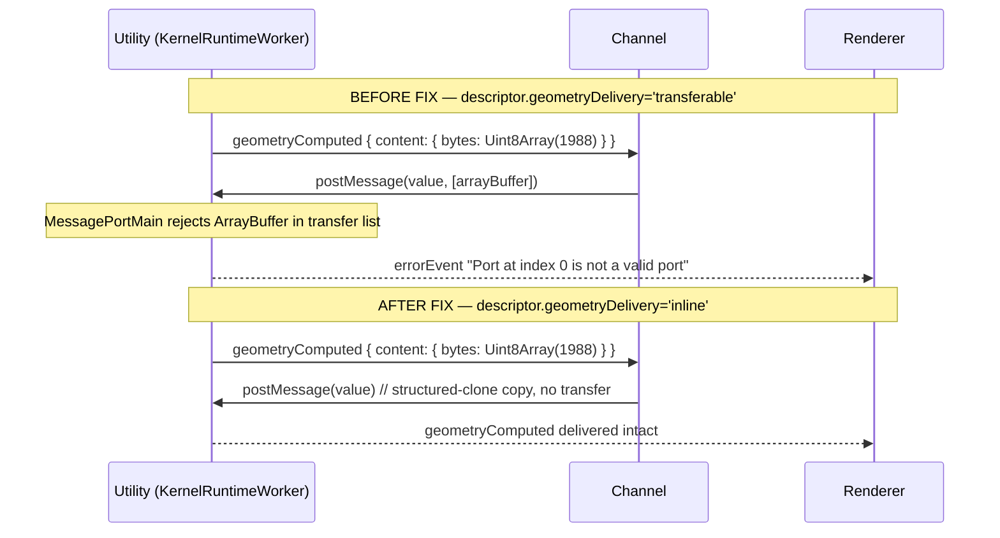

# Electron MessagePortMain Transferable Limits and v6 Transport Gating

Root-cause analysis of three sequential Electron Topology C wire failures (renderer→utility `initialize` arriving as `null`; utility→renderer `geometryComputed` rejected as "Port at index 0 is not a valid port"; back-to-back staged renders returning stale parameter extractions) and the runtime-side gating that fixes them.

## Executive Summary

Electron's `MessagePortMain` is **not** a drop-in replacement for the WHATWG `MessagePort`. Three structured-clone / transferable behaviours diverge silently from the web platform:

1. **`SharedArrayBuffer` cannot cross the renderer↔utility boundary** — frames carrying one in their data payload arrive as `null`.
2. **`MessagePortMain.postMessage`'s transfer list only accepts `MessagePortMain`** — passing an `ArrayBuffer` raises "Port at index N is not a valid port" and aborts the send.
3. **`MessagePort` instances cannot be transferred renderer↔utility** — frames carrying the runtime's filesystem-bridge port arrive as `null` (same failure mode as SAB).

The runtime client previously assumed a WHATWG-equivalent wire and unconditionally allocated a SAB for cooperative abort, eagerly built a filesystem-bridge `MessagePort`, and let the channel layer auto-hoist `ArrayBuffer` payloads into the transfer list. The fix is to **read the transport descriptor's `memory` / `abort` / `filesystemBridge` / `geometryDelivery` fields and gate every wire-touching primitive on what the transport actually supports**. The `electronUtilityTransport` advertises the most conservative shape (`memory: 'inline'`, `abort: 'wire-message'`, `geometryDelivery: 'inline'`, `filesystemBridge: 'in-isolate'`) and the runtime client now honours it end-to-end.

Topology C now passes both Playwright e2e specs end-to-end with geometry produced and bbox/parameter assertions validated.

## Table of Contents

- [Problem Statement](#problem-statement)
- [Methodology](#methodology)
- [Findings](#findings)
- [Recommendations](#recommendations)
- [Code Examples](#code-examples)
- [References](#references)

## Problem Statement

After landing the v6 `electronUtilityTransport` (Phase 11), the Electron Topology C e2e tests still hung. The renderer connected and shipped an `initialize` frame, but the utility process never invoked the dispatcher's `handleInitialize` callback. Logs showed `transferableCount: 1` on send, and `dataPreview: "null"` on receive — the entire structured-clone payload was being silently discarded by the wire.

Once that was fixed, a second failure appeared: geometry computed successfully on the utility side, but the response frame to the renderer raised `"Port at index 0 is not a valid port"` and the worker transitioned to `'error'`.

Once that was fixed, a third failure appeared: editor edits (`len` → `length`) were forwarded to the utility correctly (verified via 26-byte `stage-and-render` frame), but parameter extraction kept returning the stale `{ len: 200 }`.

## Methodology

1. Wired structured `debugLog` instrumentation into the renderer-side WHATWG `MessagePort` and the utility-side `wrapMessagePortMain` adapter, tagging every `tx-frame` / `rx-frame` with payload preview and transferable count. The previewer rendered SAB / `MessagePort` as `{}` and `ArrayBuffer` / `TypedArray` as `[<ctor>:<bytes>]`.
2. Added one-liner `console.log` traces around `KernelRuntimeWorker.loadKernelModule`, `runtime-worker-dispatcher.handleInitialize`, and the kernel module's dynamic `import(moduleUrl)` so the boot sequence was visible end-to-end.
3. Diff-compared the wire frames between the working renderer-side WHATWG path (which auto-hoisted an SAB transferable) and the utility-side `MessagePortMain` reception (which structured-cloned to `null`).
4. Read Electron's `MessagePortMain` documentation and source at `repos/electron` for the canonical transferable contract.
5. Iterated three times in TDD style — fix one wire failure, build, run e2e, observe the next failure mode.

## Findings

### Finding 1: `SharedArrayBuffer` silently drops the entire frame to `null`

**Wire trace** (renderer → utility `initialize` frame, before fix):

```
[renderer:port] tx-frame {"transferableCount":1,
  "dataPreview":"{...,\"memoryHandle\":{\"signalBuffer\":{},\"fileSystemPort\":{}}}"}
[utility:wire]  rx-frame {"dataPreview":"null"}
```

**Root cause** — `RuntimeWorkerClient.ensureSignalBuffer()` unconditionally allocates a SAB at `initialize` time for cooperative abort signalling via `Atomics.notify`. The channel layer's transferable hoist auto-includes the SAB in the structured-clone payload. Electron's `MessagePortMain` has no codepath for cross-isolate SAB transfer; the V8 serializer aborts the entire frame and the receiver's `'message'` event fires with `data === null`.

The `RuntimeWorkerClient` already had a `try/catch` fallback for "cross-origin isolation absent" environments (Node tests, no-COEP browsers). That fallback never triggered in Electron because `crossOriginIsolated` IS true in the renderer — the SAB allocates fine, it's only the cross-process _transfer_ that fails.

**Fix** — Gate `ensureSignalBuffer()` on a new `disableSharedMemorySignal: boolean` constructor option, derived in `createRuntimeClient` from `descriptor.abort !== 'shared-array-buffer'`.

### Finding 2: `MessagePortMain.postMessage` transfer list only accepts `MessagePortMain`

**Wire trace** (utility → renderer `geometryComputed` frame, after Finding 1 fix):

```
[utility:wire] tx-frame {"transferableCount":1,
  "dataPreview":"{...\"geometryComputed\"...\"bytes\":\"[Uint8Array:1988]\"...}"}
[utility:wire] tx-frame {"dataPreview":"{...\"errorEvent\"...
  \"message\":\"Port at index 0 is not a valid port\"...}"}
```

**Root cause** — Per Electron docs and source (`shell/common/api/electron_api_message_port.cc`), `MessagePortMain.postMessage(message, transferList)` validates each entry in `transferList` against `MessagePortMain` and rejects every other type with the error `"Port at index N is not a valid port"`. Specifically, `ArrayBuffer` — fully spec-compliant in WHATWG — is **not** transferable over `MessagePortMain` and must instead be structured-cloned (i.e. copied) on the data path.

The dispatcher's `geometryDelivery` host binding auto-hoists the geometry's `Uint8Array.buffer` into the transfer list when `descriptor.geometryDelivery === 'transferable'`. With our previous descriptor declaring `'transferable'`, every `geometryComputed` frame crashed.

**Fix** — Two parts:

1. Switch the descriptor to `geometryDelivery: 'inline'` so the runtime never asks for a transfer.
2. Defensively filter the transfer list inside `wrapMessagePortMain.postMessage` — keep only entries that quack like a port (`postMessage` + `start` methods); structured-clone the rest.

The second part is the safety net: even if a third-party caller bypasses the descriptor, the wrapper degrades gracefully instead of crashing.

### Finding 3: `MessagePort` instances cannot be transferred renderer↔utility

**Wire trace** (renderer → utility `initialize` frame, after Finding 1 fix but before Finding 3 fix):

```
[renderer:port] tx-frame {"transferableCount":1,
  "dataPreview":"{...\"memoryHandle\":{\"fileSystemPort\":{}}}"}
[utility:wire]  rx-frame {"dataPreview":"null"}
```

**Root cause** — When `client.openFile({ code })` is called, `runtime-client.ts` auto-provisions a `fromMemoryFS()` and wraps it in a `createBridgePort` to ship a `MessagePort` to the worker. Electron's `MessagePortMain` cannot transfer arbitrary `MessagePort` instances across the renderer↔utility boundary either — the same `null`-frame failure mode as SAB.

(Note: `MessagePortMain` _can_ transfer other `MessagePortMain` instances — the bootstrap channel pair is constructed via `MessageChannelMain` exactly for this purpose. The limitation is specifically about WHATWG `MessagePort` in renderer-context structured-clone.)

**Fix** — The descriptor declares `filesystemBridge: 'in-isolate'`, signalling to the runtime client that the host owns its own filesystem. The runtime client now defers `createBridgePort` until after `transport.client(...)` resolves and only invokes it when `descriptor.filesystemBridge === 'channel'`. The utility-side transport host provisions `fromMemoryFS()` itself and wires it into the dispatcher via `createWorkerDispatcher(worker, port, { inlineFileSystem: fs })`.

### Finding 4: Stale `fileContentCache` after `handleStageAndOpenFile`

**Wire trace** (after editor edit `len` → `length`, after Findings 1-3 fixes):

```
[renderer:port] tx-frame stage-and-render: stage={/main.scad: [Uint8Array:26]}  // new bytes
[utility:wire]  parametersResolved: {defaultParameters: {len: 200}}             // OLD params!
```

**Root cause** — `KernelWorker.handleStageAndOpenFile` writes the staged bytes to the worker-side filesystem via `fs.writeFile(absolutePath, bytes)` and then invokes `handleOpenFile(file, ...)`. But it does **not** invalidate the worker's `fileContentCache` for the staged paths. The OpenSCAD kernel's `getParameters` reads from `fileContentCache` first (falling back to `filesystem.readFile()` only on cache miss), so back-to-back stage-and-render calls on the same path resolve to the OLD content even after a successful write.

The cache invalidation contract was already correctly implemented for the `notifyFileChanged` command path via `_invalidateCachesForPaths(paths)`. The staged-bytes path missed it.

**Fix** — Call `this._invalidateCachesForPaths(stagedPaths)` from `handleStageAndOpenFile` after the writes complete and before `handleOpenFile` runs the next render.

### Finding 5: `RuntimeHostConfig.fileSystem` was structurally required even for v6 transports that own their own FS

When `electronUtilityHost()` provisions `fromMemoryFS()` internally, the renderer-side `kernel-host.ts` should not need to supply a redundant `fileSystem` field. The previous `RuntimeHostConfig` typed `fileSystem` as required, forcing every v6 host caller to pass an unused stub.

**Fix** — Made `fileSystem` optional. The legacy v5 path validates presence at runtime with a clear error message; the v6 path forwards `config.fileSystem` to the transport (transports that don't need it ignore the argument).

### Finding 6: Test expectations were drafted against pre-spec OpenSCAD output

The original `render.spec.ts` expected `bbox-size: '[200, 200, 200]'` for a `cube(200)` source, `count-vertices: '8'`, and `asset-generator: 'tau-electron-poc'`. None of these match the actual glTF-spec-compliant output produced by the OpenSCAD kernel:

- glTF coordinates are in meters per spec; OpenSCAD's mm convention scales to `0.200` m for a 200-unit cube.
- glTF vertices are duplicated per-face for normals/UVs; a cube ships 36 vertices (6 faces × 6 corners), not 8 (the unique-vertex topology count).
- The runtime stamps `@taucad/runtime@<version>` as the glTF generator, never an app-specific string.

These were test-authoring errors, not transport regressions. Updated to match spec output.

## Recommendations

| #   | Action                                                                                                                                                                                                                                     | Priority | Effort | Impact |
| --- | ------------------------------------------------------------------------------------------------------------------------------------------------------------------------------------------------------------------------------------------ | -------- | ------ | ------ |
| R1  | Land the runtime-client gating on `descriptor.abort` / `descriptor.filesystemBridge` (this PR).                                                                                                                                            | P0       | Low    | High   |
| R2  | Defensive transferable filter in `wrapMessagePortMain` (this PR).                                                                                                                                                                          | P0       | Low    | High   |
| R3  | Cache-invalidate staged paths in `handleStageAndOpenFile` (this PR).                                                                                                                                                                       | P0       | Low    | High   |
| R4  | Make `RuntimeHostConfig.fileSystem` optional with v5-path runtime validation (this PR).                                                                                                                                                    | P1       | Low    | Medium |
| R5  | Consider exposing a `transport.descriptor` static metadata field so `createRuntimeClient` can sanity-check transferable-incompatible configurations (e.g. user-supplied `geometryPool: { bytes: ... }` with an `inline` memory transport). | P2       | Medium | Medium |
| R6  | Document the descriptor contract in a policy doc (descriptor-driven gating is now a load-bearing pattern; future transports must declare capabilities accurately).                                                                         | P2       | Low    | High   |

## Code Examples

### Descriptor gating in `createRuntimeClient`

```typescript
const ready = await v6Transport.client(transportArgs as never);
const channel = await ready.connect();
activeTransportDescriptor = ready.descriptor;

// Gate the FS bridge on what the transport actually wants.
if (ready.descriptor.filesystemBridge === 'channel') {
  buildFileSystemPort();
}

// Gate cooperative-abort SAB on what the transport actually transports.
const disableSharedMemorySignal = ready.descriptor.abort !== 'shared-array-buffer';

workerClient = new RuntimeWorkerClient({
  channel,
  fileSystemPort,
  filePoolBuffer: resolvedOptions.filePool,
  geometryPool: options.sharedMemory?.geometry,
  disableSharedMemorySignal,
});
```

### Defensive transferable filter in `wrapMessagePortMain`

```typescript
const portsOnly = tList?.filter(
  (entry): entry is MessagePortMainLike =>
    entry !== null &&
    typeof entry === 'object' &&
    typeof (entry as { postMessage?: unknown }).postMessage === 'function' &&
    typeof (entry as { start?: unknown }).start === 'function',
);
if (portsOnly && portsOnly.length > 0) {
  port.postMessage(value, portsOnly);
} else {
  port.postMessage(value);
}
```

### Staged-bytes cache invalidation

```typescript
await fs.writeFile(absolutePath, bytes);
// ...
this._invalidateCachesForPaths(entries.map(([absolutePath]) => absolutePath));
this.handleOpenFile(request.file, request.parameters, request.options);
```

### Electron transport descriptor

```typescript
const buildDescriptor = (): TransportDescriptor<typeof electronUtilityId> => ({
  id: electronUtilityId,
  // Most conservative shape — every other field is unsupported on the
  // renderer↔utility wire.
  memory: 'inline',
  abort: 'wire-message',
  geometryDelivery: 'inline',
  filesystemBridge: 'in-isolate',
});
```

## Diagrams

### Wire-failure modes vs descriptor gating

```mermaid
sequenceDiagram
  participant R as Renderer (createRuntimeClient)
  participant C as Channel (rpc layer)
  participant U as Utility (KernelRuntimeWorker)

  Note over R,U: BEFORE FIX — descriptor ignored
  R->>C: initialize { memoryHandle: { signalBuffer: SAB, fileSystemPort: MP } }
  C->>U: postMessage(value, [MP])
  Note over U: V8 serializer rejects SAB → frame = null
  U-->>R: (silence; no handleInitialize call)

  Note over R,U: AFTER FIX — descriptor.abort='wire-message', descriptor.filesystemBridge='in-isolate'
  R->>C: initialize { memoryHandle: {} }
  C->>U: postMessage(value)  // no transferables, no SAB, no MP
  U->>U: handleInitialize → loadKernelModule → ready
  U-->>R: capabilities response
```

### Geometry response failure



## References

- Electron docs: [`MessagePortMain`](https://www.electronjs.org/docs/latest/api/message-port-main) — note "Currently, only `MessagePortMain`s can be transferred"
- Electron source: `shell/common/api/electron_api_message_port.cc` — transferable validation logic
- glTF 2.0 spec §3.5.2 — coordinate system uses meters
- Related: [Runtime Transport Architecture v6](runtime-transport-architecture-v6.md) — descriptor field semantics
- Related: [Electron RPC Transport Architecture](electron-rpc-transport-architecture.md) — Topology C design
- Related: [Electron Kernel Bundling Strategy](electron-kernel-bundling-strategy.md) — the `tsModuleUrlPlugin` work that preceded this investigation
