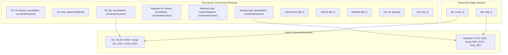
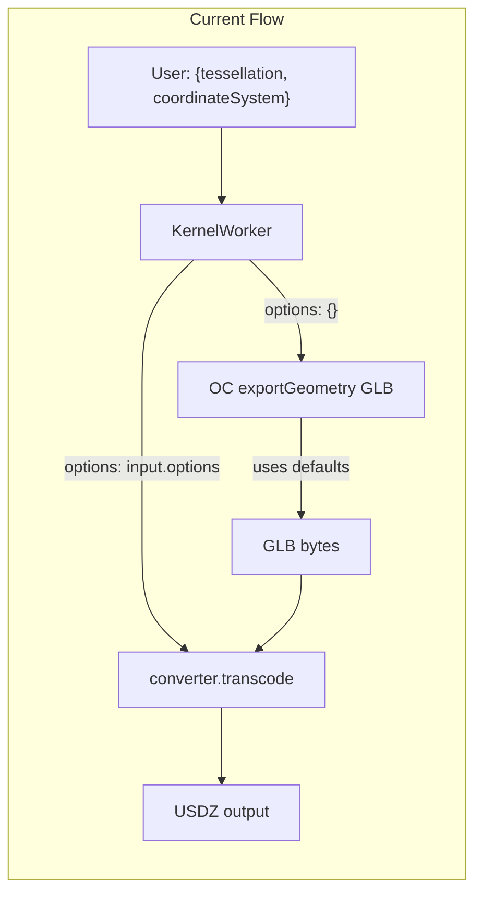
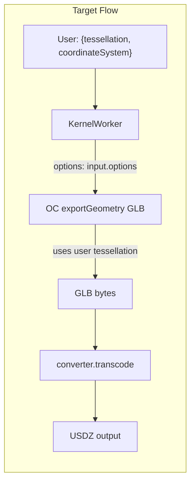
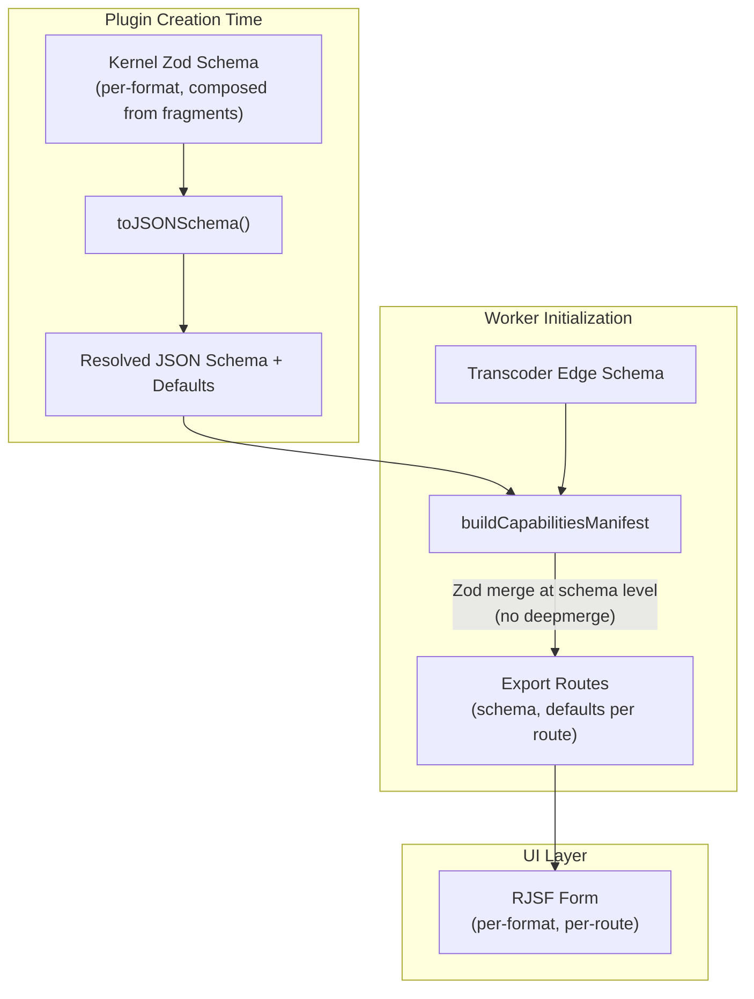

# Export Option Schema Architecture

Audit of the export option pipeline — schema definitions, merging strategy, per-kernel accuracy, and end-to-end type safety — to identify architectural shortcomings and recommend a path toward canonical per-format, per-kernel export options with strong typing from consumer API through to kernel implementation.

## Executive Summary

The current export pipeline has two systemic problems. First, a universal Zod schema (`tessellation` + `coordinateSystem`) is merged into every kernel and every format via `deepmerge`, showing options where they have no effect, forcing OCCT-centric concepts onto kernels with different models, and creating schema-merging complexity. Second, type safety is strong only inside `defineKernel` implementations — every other layer in the chain (`RuntimeClient.export()`, wire protocol, `KernelWorker`, React hooks) uses `Record<string, unknown>`, meaning consumers get zero compile-time checking of export options and kernel authors use escape hatches for universal options. We recommend canonical per-format, per-kernel Zod schemas composed from shared fragments, with type-safe generics threaded from `createKernelPlugin` through `RuntimeClient.export()` to give consumers compile-time format-specific option checking.

## Table of Contents

- [Problem Statement](#problem-statement)
- [Methodology](#methodology)
- [Findings](#findings)
- [Type-Safety Architecture](#type-safety-architecture)
- [Target Architecture](#target-architecture)
- [Recommendations](#recommendations)
- [Code Examples](#code-examples)
- [Diagrams](#diagrams)
- [Appendix: Kernel Export Inventory](#appendix-kernel-export-inventory)

## Problem Statement

Three issues triggered this investigation:

1. **Tessellation controls appear for STEP export** (see screenshot evidence). STEP is a BRep format that preserves exact analytical geometry — mesh tessellation parameters are meaningless and misleading.

2. **OpenSCAD uses a fundamentally different tessellation model** (`$fn`, `$fa`, `$fs`) that cannot be mapped to the universal `linearTolerance`/`angularTolerance` model borrowed from OpenCASCADE. The current code has a commented-out TODO acknowledging this.

3. **Schema merging uses `deepmerge` on raw JSON Schema objects** with a custom `deduplicateArrayMerge` helper to prevent enum value duplication. This complexity may be replaceable with native Zod schema composition.

## Methodology

Source analysis of:

- All 7 kernel implementations (`exportGeometry` methods) and their plugin definitions
- The `universalExportSchema` and `buildCapabilitiesManifest` in `kernel-worker.ts`
- The `resolveExportOptionSchemas` in `plugin-helpers.ts`
- The converter transcoder definition and its edge configuration
- The `ExportGeometryInput` type and its discriminated union behavior
- The `deepmerge` usage patterns across the manifest builder
- Full type-safety trace from `RuntimeClient.export()` → wire protocol → `KernelWorker` → kernel `exportGeometry`
- Generic type parameter flow through `createKernelPlugin` → `KernelPlugin` → `RuntimeClientOptions` → `RuntimeClient`
- Type-level test coverage in `define-plugin.test-d.ts` and `render-input.test-d.ts`

## Findings

### Finding 1: Universal Tessellation Is Shown for Formats Where It Has No Effect

The `universalExportSchema` defines a nested `tessellation` object with `linearTolerance` and `angularTolerance`. This schema is merged into **every** kernel export format via `deepmerge(universalJsonSchema, resolved?.schema ?? {})` in `buildCapabilitiesManifest`.

This means tessellation options appear for:

| Format   | Kernel                | Tessellation Effect         | Should Show Tessellation? |
| -------- | --------------------- | --------------------------- | ------------------------- |
| STL      | OpenCascade, Replicad | Controls mesh density       | Yes                       |
| GLB/GLTF | OpenCascade, Replicad | Controls mesh density       | Yes                       |
| STEP     | OpenCascade, Replicad | None (BRep, exact geometry) | No                        |
| GLB/GLTF | OpenSCAD              | None (baked at render time) | No                        |
| GLB      | JSCAD                 | None (internal meshing)     | No                        |
| GLB      | Manifold              | None (internal meshing)     | No                        |
| GLB/GLTF | Tau                   | None (pass-through)         | No                        |
| All      | Zoo                   | None (engine-controlled)    | No                        |

Evidence: the user-provided screenshot shows `Linear Tolerance: 0.1` and `Angular Tolerance: 15` controls visible in the STEP export panel. These values have zero effect on the exported STEP file.

### Finding 2: OpenSCAD Tessellation Model Is Fundamentally Different

OpenSCAD controls mesh resolution through three parameters:

| Parameter | Description                         | OpenSCAD Default |
| --------- | ----------------------------------- | ---------------- |
| `$fn`     | Number of fragments for full circle | 0 (auto)         |
| `$fa`     | Minimum fragment angle (degrees)    | 12               |
| `$fs`     | Minimum fragment size (mm)          | 2                |

These are **not equivalent** to OpenCASCADE's `linearTolerance`/`angularTolerance`:

- `$fn` overrides `$fa`/`$fs` and sets an exact fragment count (no OCCT analog)
- `$fa`/`$fs` are minimum thresholds, not maximum deviation targets
- OpenSCAD tessellation is baked at render time — export tessellation overrides are explicitly ignored with a warning

The kernel source confirms this at `openscad.kernel.ts` line 493:

```typescript
// TODO: Re-enable default tessellation
// if (tessellation) {
//   args.push(`-D$fn=48`, `-D$fa=...`, `-D$fs=...`);
// }
```

Attempting to map linear/angular tolerance to `$fn/$fa/$fs` conflates two different mesh resolution models. Each should be exposed natively.

### Finding 3: coordinateSystem Has No Effect on STEP Export

The OpenCascade kernel's STEP export path passes shapes directly to `STEPControl_Writer` without any coordinate system transformation:

```typescript
// opencascade.kernel.ts — STEP export branch
const writer = new oc.STEPControl_Writer();
writer.Transfer(entry.shape, oc.STEPControl_StepModelType.STEPControl_AsIs, true, progress);
writer.Write(filePath);
```

No `coordinateSystem` handling. Yet the UI shows `coordinateSystem` as a selectable option for STEP because the universal schema is merged into all formats.

Replicad's STEP export does apply the coordinate rotation because it transforms the shape _before_ choosing the export branch, but this is inconsistent — the option should only appear for formats and kernels where it actually has an effect.

### Finding 4: Type-Safety Escape Hatch for Universal Options

Both OpenCascade and Replicad kernels read `coordinateSystem` from `input.options` using an escape hatch:

```typescript
const rawOptions = input.options as Record<string, unknown> | undefined;
const coordinateSystem = (rawOptions?.['coordinateSystem'] as string | undefined) ?? 'y-up';
```

This bypasses the discriminated union type system. The `ExportGeometryInput` type resolves `input.options` for STL as `{ binary: boolean } | undefined` — there is no `coordinateSystem` property. The escape hatch exists because universal options are not part of per-format Zod schemas.

### Finding 5: tessellation Lives at the Wrong Level in ExportGeometryInput

`ExportGeometryInput` has `tessellation` as a sibling of `format` and `options`:

```typescript
{
  format: K;
  tessellation?: Tessellation;    // top-level
  options?: z.infer<ExportSchemas[K]>;  // per-format
  nativeHandle: NativeHandle;
}
```

This separates tessellation from `coordinateSystem` (which lives in `options`), even though both are export quality/convention parameters. The `KernelWorker.exportGeometry` method destructures tessellation out of the flat options bag and reconstructs this split:

```typescript
const { tessellation, ...formatOptions } = options ?? {};
const input: ExportGeometryInput = {
  format,
  tessellation: tessellation as Tessellation | undefined,
  options: formatOptions,
  nativeHandle: this.nativeHandle,
};
```

### Finding 6: deepmerge Creates Fragile Schema Composition

Schema composition in `buildCapabilitiesManifest` uses three layers of `deepmerge`:

1. `deepmerge(universalJsonSchema, resolved?.schema ?? {})` — merges universal into kernel export
2. `deepmerge(universalJsonSchema, edgeSchema)` — merges universal into transcoder edge
3. `deepmerge(cap.schema, edge.schema, { arrayMerge: deduplicateArrayMerge })` — merges kernel+universal with edge+universal for transcoded routes

The third merge requires `deduplicateArrayMerge` because both `cap.schema` and `edge.schema` already contain the universal layer, producing duplicated `enum` arrays (e.g., `['y-up', 'z-up', 'y-up', 'z-up']`). This deduplication is a symptom of the architectural problem: merging the same universal schema at multiple layers.

Zod's `.merge()` operates at the schema level before JSON Schema conversion, avoiding duplicate entries entirely:

```typescript
const merged = universalSchema.merge(formatSchema);
const jsonSchema = toJSONSchema(merged);
```

### Finding 7: Transcoded Routes Need Source-Format Options, Not Target-Format Options

When a replicad GLB is transcoded to USDZ, the tessellation settings control the GLB mesh quality (the source format). The USDZ transcoder receives already-meshed data and cannot improve tessellation. The current architecture merges source kernel schema with transcoder edge schema via `deepmerge`, which is directionally correct but conflates "options that affect the source kernel" with "options that affect the transcoder."

In `executeExportWithRoute` (line 2003), the source kernel export is called with `options: {}`, discarding all user options:

```typescript
const sourceInput: ExportGeometryInput = {
  ...input,
  format: route.sourceFormat,
  options: {},
};
```

This means tessellation settings from the user are **not forwarded** to the source kernel export. The `tessellation` field is forwarded via spread from `input`, but only because it's a top-level field. If tessellation moves into `options`, this forwarding breaks.

### Finding 8: Zoo Kernel Declares Unused Schema Fields

The Zoo plugin declares `stepExportSchema` with `assemblyMode`, but the kernel's `exportGeometry` does not read or use `assemblyMode`:

```typescript
// zoo.kernel.ts — STEP export
const stepResult = await utilities.exportFromMemory({ type: 'step' });
```

The `assemblyMode` option is shown in the UI but has no effect. This is a schema-implementation mismatch.

### Finding 9: Five Kernels Have No Export Options at All

JSCAD, Manifold, Tau, OpenSCAD, and (partially) Zoo declare `exportFormats` but no `exportOptionSchemas` for their mesh formats. The manifest fills these with the universal schema, which is incorrect:

- **JSCAD**: GLB only. Mesh is controlled by JSCAD internals. No user-facing tessellation knobs.
- **Manifold**: GLB only. Mesh is controlled by manifold-3d. No user-facing knobs.
- **Tau**: GLB/GLTF. Pass-through of converter output. No user-facing knobs.
- **OpenSCAD**: GLB/GLTF. Tessellation baked at render via `$fn/$fa/$fs`. Export re-tessellation is impossible.

These kernels should declare empty format schemas (no options) to signal "no user-controllable options for this format."

### Finding 10: CreateGeometryInput Tessellation Is a Separate Concern

The render/preview path uses `CreateGeometryInput.tessellation` to control preview mesh quality. This is used by the `render` and `setFile` protocol commands and has nothing to do with export options. Any refactoring of export tessellation should leave `CreateGeometryInput.tessellation` unchanged. The two share the same `Tessellation` type but serve different purposes (preview quality vs. export quality).

### Finding 11: Type Safety Ends at the Kernel Boundary

A full trace of the export option type chain reveals that strong typing exists only inside `defineKernel` implementations. Every other layer uses `Record<string, unknown>`:

| Layer                                                  | Type of export options                                      | Type-safe?                  |
| ------------------------------------------------------ | ----------------------------------------------------------- | --------------------------- |
| `RuntimeClient.export()`                               | `Record<string, unknown> & { tessellation?: Tessellation }` | No                          |
| `useRender().exportGeometry`                           | `Record<string, unknown>`                                   | No                          |
| Wire protocol (`RuntimeCommand.export`)                | `options?: Record<string, unknown>`                         | No (serialization boundary) |
| `KernelWorker.exportGeometry()`                        | `Record<string, unknown>`                                   | No                          |
| `KernelWorker` → `ExportGeometryInput` construction    | Default generics (`ExportSchemas = {}`) → loose branch      | No                          |
| `KernelDefinition.exportGeometry()` via `defineKernel` | `z.infer<ExportSchemas[K]>` after format narrowing          | **Yes**                     |

The consumer calls `client.export('stl', { binary: true })` with zero compile-time validation. A typo like `{ bianry: true }` compiles without error. The strong typing in `defineKernel` ensures kernel _implementations_ are correct, but _consumers_ of the runtime client get no help.

### Finding 12: KernelPlugin Erases Zod Type Information

`createKernelPlugin` accepts Zod schemas via `KernelPluginConfig.exportOptionSchemas: Record<string, z.ZodType>` but resolves them to `Record<string, ExportOptionSchema>` (JSON Schema + defaults) on the returned `KernelPlugin`. The Zod type information is erased:

```typescript
// plugin-helpers.ts — createKernelPlugin implementation
return (options) => {
  const resolved = typeof config === 'function' ? config(options) : config;
  const { exportOptionSchemas: zodSchemas, ...rest } = resolved;
  const exportOptionSchemas = resolveExportOptionSchemas(zodSchemas, resolved.exportFormats);
  return { ...rest, ...(exportOptionSchemas ? { exportOptionSchemas } : {}), options };
};
```

`KernelPlugin` has no generic type parameters. `exportOptionSchemas` is typed as `Record<string, ExportOptionSchema>` — there is no way to recover per-format option types from a `KernelPlugin` at compile time. This means `RuntimeClientOptions.kernels: KernelPlugin[]` carries no format-specific type information, and `createRuntimeClient` cannot return a typed client.

### Finding 13: RuntimeClient Is Not Generic

`createRuntimeClient(options: RuntimeClientOptions): RuntimeClient` returns a non-generic `RuntimeClient`. The `export()` method accepts `format: string` (not a string literal union) and `callOptions?: Record<string, unknown>`. Even if `KernelPlugin` carried type information, the `RuntimeClient` type has no generic parameters to thread it through.

For comparison, `RuntimeClient.render()` uses a generic `<T extends Record<string, string>>` for the code map, proving the pattern is feasible — it simply was not applied to export.

### Finding 14: No Runtime Validation of Export Options

Even at the serialization boundary (wire protocol), there is no runtime validation of export options. The worker receives `options: Record<string, unknown>` and forwards it to the kernel without checking against the kernel's Zod schema. Invalid options (wrong types, unknown keys) pass through silently. Since the wire protocol inherently erases types, runtime Zod validation at the worker boundary is the correct complement to compile-time type safety on the client.

### Finding 15: Middleware Layer Uses Loose ExportGeometryInput

The middleware type `ExportGeometryHandler` and `wrapExportGeometry` use `ExportGeometryInput` without generic parameters, defaulting to the loose branch (`format: string`, `options?: Record<string, unknown>`). This is correct — middleware is kernel-agnostic and should not be parameterized by a specific kernel's schemas. However, `input.tessellation` on the middleware type should follow whatever decision is made for the kernel layer.

## Type-Safety Architecture

### Current State


### Target State

```mermaid
flowchart LR
  subgraph mainThread [Main Thread]
    Consumer2["consumer code"] -->|"format: 'stl'\noptions: StlOptions"| Client2["RuntimeClient.export()"]
    Client2 -->|"Record (wire payload)"| WorkerClient2["RuntimeWorkerClient"]
  end

  subgraph wire2 [MessagePort]
    WorkerClient2 -->|"Record serialized"| Protocol2["RuntimeCommand"]
  end

  subgraph workerThread2 [Worker Thread]
    Protocol2 -->|"Record"| KernelWorker2["KernelWorker"]
    KernelWorker2 -->|"Zod.parse() validation"| Validated["validated options"]
    Validated -->|"ExportGeometryInput\n(typed per-format)"| Kernel2["kernel.exportGeometry()"]
    Kernel2 -->|"STRONG"| Impl2["kernel implementation"]
  end
```



The wire protocol is an inherent serialization boundary — `Record<string, unknown>` is correct there. Type safety belongs at the two endpoints: compile-time on the client (consumer DX) and runtime validation on the worker (correctness guarantee).

## Target Architecture



The target architecture eliminates the universal schema entirely. Each kernel declares the exact options for each format it supports:

1. **OCCT-based kernels** (OpenCascade, Replicad): Declare `tessellation` and `coordinateSystem` on mesh formats (STL, GLB/GLTF). Declare `assemblyMode` on STEP. Declare `coordinateSystem` on STEP only if the kernel actually transforms coordinates for STEP.

2. **OpenSCAD**: Declares `$fn`, `$fa`, `$fs` as render-time parameters. Export options for GLB/GLTF are empty (mesh is baked).

3. **JSCAD, Manifold, Tau**: Empty export schemas for all formats. No misleading controls.

4. **Zoo**: Declares only options the KCL engine actually consumes (`binary` for STL). Remove `assemblyMode` from STEP until the kernel implements it.

5. **Transcoded routes**: The manifest builder merges the source kernel format schema with the transcoder edge schema using Zod `.merge()` at schema build time, not `deepmerge` on JSON Schema objects. The source kernel's tessellation options flow through correctly because they are part of the source format's schema.

## Recommendations

### Schema Correctness

| #   | Action                                                                                                                                                                  | Priority | Effort  | Impact                                                                                                                 |
| --- | ----------------------------------------------------------------------------------------------------------------------------------------------------------------------- | -------- | ------- | ---------------------------------------------------------------------------------------------------------------------- |
| R1  | Remove `universalExportSchema` and replace with per-format schemas on each kernel                                                                                       | P0       | Medium  | High — eliminates phantom options for STEP, JSCAD, Manifold, Tau, Zoo                                                  |
| R2  | Create shared Zod schema fragments (`tessellationSchema`, `coordinateSystemSchema`) that kernels compose via `.merge()` / `.extend()` instead of inheriting universally | P0       | Low     | High — preserves DRY without forcing irrelevant options                                                                |
| R3  | Replace `deepmerge` on JSON Schema objects with Zod `.merge()` at schema definition time in `resolveExportOptionSchemas`                                                | P0       | Medium  | High — eliminates `deduplicateArrayMerge`, simplifies manifest builder                                                 |
| R4  | Move `tessellation` from top-level `ExportGeometryInput` into `options` (per-format, only on formats that support it)                                                   | P0       | Medium  | High — co-locates tessellation with coordinateSystem, eliminates the destructure/reconstruct split in `KernelWorker`   |
| R5  | Declare OpenSCAD-native render options (`$fn`, `$fa`, `$fs`) on the OpenSCAD kernel as render-time parameters, not export options                                       | P1       | Low     | Medium — gives OpenSCAD users native controls                                                                          |
| R6  | Fix `executeExportWithRoute` to forward source-format options from the user's export request to the source kernel                                                       | P0       | Low     | High — without this, transcoded exports ignore tessellation                                                            |
| R7  | Add empty Zod schemas for all formats without user-controllable options (JSCAD GLB, Manifold GLB, Tau GLB/GLTF, OpenSCAD GLB/GLTF)                                      | P0       | Low     | High — ensures discriminated union covers all formats, eliminates the loose `options?: Record<string, unknown>` branch |
| R8  | Remove `assemblyMode` from Zoo's `stepExportSchema` until the kernel implements it                                                                                      | P2       | Trivial | Low — removes misleading control                                                                                       |
| R9  | Add `coordinateSystem` to Replicad's STEP schema (it transforms shapes), remove from OpenCascade STEP (it does not)                                                     | P2       | Trivial | Low — schema accuracy                                                                                                  |

### Type Safety: Kernel Authoring Layer

| #   | Action                                                                                                                                                                                                                                                                                   | Priority | Effort | Impact                                                                 |
| --- | ---------------------------------------------------------------------------------------------------------------------------------------------------------------------------------------------------------------------------------------------------------------------------------------- | -------- | ------ | ---------------------------------------------------------------------- |
| R10 | With R1-R4+R7, `defineKernel` provides full type safety — `input.options` for each format includes tessellation and coordinateSystem directly. No `as Record<string, unknown>` escape hatches needed. Remove existing escape hatches from OpenCascade and Replicad kernels.              | P0       | Low    | High — kernel authors get compile-time checking for all export options |
| R11 | Update type-level tests in `define-plugin.test-d.ts` to verify: (a) mesh format options include tessellation+coordinateSystem after Zod composition, (b) BRep format options do NOT include tessellation, (c) formats with empty schemas produce `Record<string, never>` or `{}` options | P0       | Low    | High — prevents type regressions                                       |

### Type Safety: Consumer Client Layer

| #   | Action                                                                                                                                                                                                                                                                                           | Priority | Effort | Impact                                                                                   |
| --- | ------------------------------------------------------------------------------------------------------------------------------------------------------------------------------------------------------------------------------------------------------------------------------------------------ | -------- | ------ | ---------------------------------------------------------------------------------------- |
| R12 | Make `KernelPlugin` carry format-to-options type information via a phantom generic type parameter. `createKernelPlugin` preserves the Zod-inferred format→options mapping as a compile-time-only branded type on the returned plugin                                                             | P1       | Medium | High — enables typed client                                                              |
| R13 | Make `createRuntimeClient` generic on its kernel plugins, inferring a union of all supported formats and their option types from the registered kernels. Return a `RuntimeClient` whose `export()` method is generic: `export<F extends SupportedFormat>(format: F, options?: FormatOptions[F])` | P1       | Medium | High — consumers get compile-time validation of `client.export('stl', { binary: true })` |
| R14 | Update `useRender().exportGeometry` in the React hook to mirror the client's typed `export()` signature, so React consumers also get format-specific option types                                                                                                                                | P1       | Low    | Medium — React consumer DX                                                               |
| R15 | Update `render-input.test-d.ts` to verify that `client.export('stl', { bianry: true })` fails to compile (typo detection)                                                                                                                                                                        | P1       | Low    | Medium — validates consumer type safety                                                  |

### Type Safety: Worker Boundary

| #   | Action                                                                                                                                                                                                                                                                                               | Priority | Effort | Impact                                                     |
| --- | ---------------------------------------------------------------------------------------------------------------------------------------------------------------------------------------------------------------------------------------------------------------------------------------------------- | -------- | ------ | ---------------------------------------------------------- |
| R16 | Add runtime Zod validation in `KernelWorker.exportGeometry()` before forwarding to the kernel. Look up the active kernel's Zod schema for the requested format and call `.parse()` on the options. Invalid options produce a clear `ExportGeometryResult` error instead of silently passing through. | P1       | Low    | High — correctness guarantee at the serialization boundary |
| R17 | The wire protocol (`RuntimeCommand.export.options`) correctly uses `Record<string, unknown>` — this is a serialization boundary and should remain untyped. Do not attempt to thread generics across `MessagePort`.                                                                                   | N/A      | N/A    | Architectural constraint                                   |

## Code Examples

### R2: Shared Schema Fragments

Instead of a monolithic universal schema, create composable fragments:

```typescript
// packages/runtime/src/types/export-option-schemas.ts

export const tessellationSchema = z.object({
  tessellation: z
    .object({
      linearTolerance: z.number().positive().default(0.1),
      angularTolerance: z.number().positive().default(15),
    })
    .default({ linearTolerance: 0.1, angularTolerance: 15 }),
});

export const coordinateSystemSchema = z.object({
  coordinateSystem: z.enum(['y-up', 'z-up']).default('y-up'),
});
```

Kernels compose only what each format actually supports:

```typescript
// opencascade.plugin.ts
export const stlExportSchema = z
  .object({
    binary: z.boolean().default(true),
  })
  .merge(tessellationSchema)
  .merge(coordinateSystemSchema);

export const stepExportSchema = z.object({
  assemblyMode: z.enum(['single', 'assembly']).default('single'),
});

export const glbExportSchema = tessellationSchema.merge(coordinateSystemSchema);
export const gltfExportSchema = tessellationSchema.merge(coordinateSystemSchema);
```

All four schemas are wired into `exportOptionSchemas`:

```typescript
export const opencascade = createKernelPlugin<OpenCascadeOptions>({
  id: 'opencascade',
  exportFormats: ['stl', 'step', 'glb', 'gltf'],
  exportOptionSchemas: { stl: stlExportSchema, step: stepExportSchema, glb: glbExportSchema, gltf: gltfExportSchema },
  // ...
});
```

Kernels with no export options declare empty schemas:

```typescript
// jscad.plugin.ts
export const jscad = createKernelPlugin({
  id: 'jscad',
  exportFormats: ['glb'],
  exportOptionSchemas: { glb: z.object({}) },
  // ...
});
```

### R3: Zod Merge Instead of deepmerge

```typescript
// buildCapabilitiesManifest — before
schema: deepmerge(universalJsonSchema, resolved?.schema ?? {});

// after (in resolveExportOptionSchemas, at plugin build time)
const merged = formatHasSchema
  ? toJSONSchema(zodSchema) // schema already contains everything
  : {}; // no options for this format
```

The manifest builder no longer needs to merge anything — each format's schema is fully resolved at plugin creation time.

### R6: Forward Source Options in Transcoded Routes

```typescript
// kernel-worker.ts — executeExportWithRoute
const sourceInput: ExportGeometryInput = {
  ...input,
  format: route.sourceFormat,
  options: input.options, // forward user options to source kernel
};
```

The source kernel reads the options relevant to its format (tessellation, coordinateSystem) and ignores keys it doesn't recognize.

### R10: Kernel Author Type Safety (After R1-R4+R7)

With all format schemas composed from fragments and every format covered, kernel authors get full type safety with no escape hatches:

```typescript
// opencascade.kernel.ts — AFTER
async exportGeometry(input, _runtime, context) {
  if (input.format === 'stl') {
    // input.options is now: { binary: boolean; tessellation: {...}; coordinateSystem: 'y-up' | 'z-up' } | undefined
    const binary = input.options?.binary ?? true;
    const linearTolerance = input.options?.tessellation?.linearTolerance ?? 0.01;
    const coordinateSystem = input.options?.coordinateSystem ?? 'y-up';
    // ^ all fully type-safe, no escape hatches
  }
  if (input.format === 'step') {
    // input.options is: { assemblyMode: 'single' | 'assembly' } | undefined
    // No tessellation, no coordinateSystem — because STEP doesn't support them
  }
}
```

### R12-R13: Typed Consumer Client

The phantom type pattern carries format information through the plugin boundary without adding runtime cost:

```typescript
// plugin-types.ts
declare const __exportSchemas: unique symbol;

type KernelPlugin<FormatMap extends Record<string, unknown> = Record<string, unknown>> = {
  id: string;
  moduleUrl: string;
  extensions: string[];
  exportFormats?: readonly string[];
  exportOptionSchemas?: Record<string, ExportOptionSchema>;
  readonly [__exportSchemas]?: FormatMap;
  // ... rest
};
```

```typescript
// createKernelPlugin infers FormatMap from Zod schemas
function createKernelPlugin<Options, ExportSchemas extends Record<string, z.ZodType>>(
  config: KernelPluginConfig & { exportOptionSchemas: ExportSchemas },
): () => KernelPlugin<{ [K in keyof ExportSchemas]: z.infer<ExportSchemas[K]> }>;
```

```typescript
// createRuntimeClient aggregates format maps from all plugins
type CollectFormatMap<Plugins extends KernelPlugin[]> =
  Plugins[number] extends KernelPlugin<infer M> ? M : Record<string, unknown>;

function createRuntimeClient<K extends KernelPlugin[]>(
  options: RuntimeClientOptions & { kernels: K },
): TypedRuntimeClient<CollectFormatMap<K>>;

type TypedRuntimeClient<Formats extends Record<string, unknown>> = Omit<RuntimeClient, 'export'> & {
  export<F extends string & keyof Formats>(format: F, options?: Formats[F]): Promise<ExportResult>;
  export(format: string, options?: Record<string, unknown>): Promise<ExportResult>;
};
```

Consumer usage:

```typescript
import { replicad } from '@taucad/runtime/kernels';
import { esbuild } from '@taucad/runtime/bundler';

const client = createRuntimeClient({
  kernels: [replicad()],
  bundlers: [esbuild()],
});

// Compile-time checked — 'bianry' would be a type error
await client.export('stl', { binary: true, tessellation: { linearTolerance: 0.01, angularTolerance: 5 } });

// Unknown formats fall through to the loose overload
await client.export('custom-format', { anyKey: 'value' });
```

### R16: Worker-Boundary Runtime Validation

```typescript
// kernel-worker.ts — exportGeometry, after constructing input
const activeSchemas = this.kernelExportOptionSchemasMap.get(this.activeKernelId);
const formatZodSchema = activeSchemas?.[format];
if (formatZodSchema) {
  const parseResult = formatZodSchema.safeParse(input.options ?? {});
  if (!parseResult.success) {
    return createKernelError([
      {
        message: `Invalid export options for ${format}: ${parseResult.error.message}`,
        type: 'runtime',
        severity: 'error',
      },
    ]);
  }
  input.options = parseResult.data; // validated + defaults applied
}
```

## Diagrams

### Current vs Target: Option Flow for GLB-to-USDZ Transcoding





### Schema Resolution Pipeline



## Appendix: Kernel Export Inventory

| Kernel      | Format   | Tessellation Model                            | Coord System                                 | Per-Format Options          | Has exportOptionSchemas? | Type-safe? (current)                        | Type-safe? (after R1-R17)                    |
| ----------- | -------- | --------------------------------------------- | -------------------------------------------- | --------------------------- | ------------------------ | ------------------------------------------- | -------------------------------------------- |
| OpenCascade | STL      | `linearTolerance` + `angularTolerance` (OCCT) | Y-up rotation via `BRepBuilderAPI_Transform` | `{ binary }`                | Yes                      | Partial — escape hatch for coordinateSystem | Full                                         |
| OpenCascade | STEP     | None (BRep)                                   | Not applied                                  | `{ assemblyMode }`          | Yes                      | Yes                                         | Yes                                          |
| OpenCascade | GLB/GLTF | `linearTolerance` + `angularTolerance` (OCCT) | Via `RWMesh_CoordinateSystemConverter`       | None                        | No (should add)          | No — loose branch                           | Full                                         |
| Replicad    | STL      | `linearTolerance` + `angularTolerance` (OCCT) | Pre-export rotation                          | `{ binary }`                | Yes                      | Partial — escape hatch for coordinateSystem | Full                                         |
| Replicad    | STEP     | None (BRep)                                   | Pre-export rotation                          | `{ assemblyMode }`          | Yes                      | Yes                                         | Yes                                          |
| Replicad    | GLB/GLTF | `linearTolerance` + `angularTolerance` (OCCT) | Pre-export rotation                          | None                        | No (should add)          | No — loose branch                           | Full                                         |
| OpenSCAD    | GLB/GLTF | `$fn/$fa/$fs` (baked at render)               | Not supported                                | None                        | No                       | No — loose branch                           | Full (empty schema)                          |
| JSCAD       | GLB      | Internal (jscadToGltf)                        | Not supported                                | None                        | No                       | No — loose branch                           | Full (empty schema)                          |
| Manifold    | GLB      | Internal (manifold-3d)                        | Not supported                                | None                        | No                       | No — loose branch                           | Full (empty schema)                          |
| Tau         | GLB/GLTF | N/A (converter pass-through)                  | Not supported                                | None                        | No                       | No — loose branch                           | Full (empty schema)                          |
| Zoo         | STL      | N/A (KCL engine)                              | Not supported                                | `{ binary }`                | Yes                      | Yes                                         | Yes                                          |
| Zoo         | STEP     | N/A (KCL engine)                              | Not supported                                | `{ assemblyMode }` (unused) | Yes                      | Yes                                         | Yes (schema matches implementation after R8) |
| Zoo         | GLB/GLTF | N/A (KCL engine)                              | Not supported                                | None                        | No                       | No — loose branch                           | Full (empty schema)                          |

## Appendix: Type-Safety Trace (Post-Recommendations)

After applying R1-R17, the following `Record<string, unknown>` usages remain and are architecturally justified:

| Location                                            | Type                                  | Justification                                                                                                      |
| --------------------------------------------------- | ------------------------------------- | ------------------------------------------------------------------------------------------------------------------ |
| `RuntimeCommand.export.options`                     | `Record<string, unknown>`             | Wire protocol serialization boundary — types cannot cross `MessagePort`. Runtime Zod validation (R16) compensates. |
| `RuntimeWorkerClient.exportGeometry` params         | `Record<string, unknown>`             | Internal plumbing to wire protocol. Not consumer-facing.                                                           |
| `KernelWorker.exportGeometry` params                | `Record<string, unknown>`             | Framework layer receives from wire. Zod validation (R16) runs before forwarding to kernel.                         |
| Middleware `ExportGeometryInput` (default generics) | `Record<string, unknown>` for options | Middleware is kernel-agnostic by design — it must handle any kernel's options generically.                         |
| `RuntimeClient.export()` loose overload             | `Record<string, unknown>`             | Fallback for unknown/dynamic formats. The typed overload handles known formats.                                    |

**No `Record<string, unknown>` remains** at:

- Kernel `exportGeometry` implementations (R10)
- `RuntimeClient.export()` for known formats (R13)
- `useRender().exportGeometry` for known formats (R14)
- Type-level tests (R11, R15)
