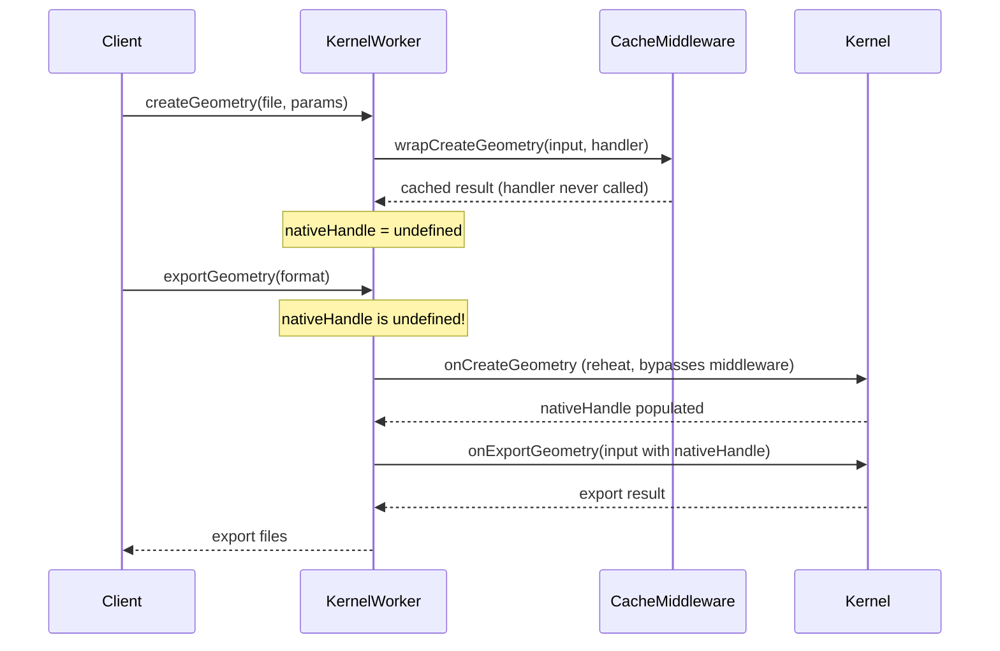
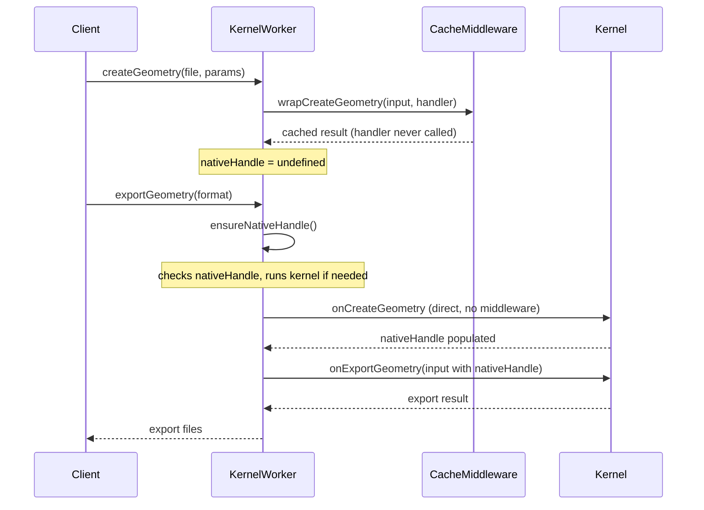
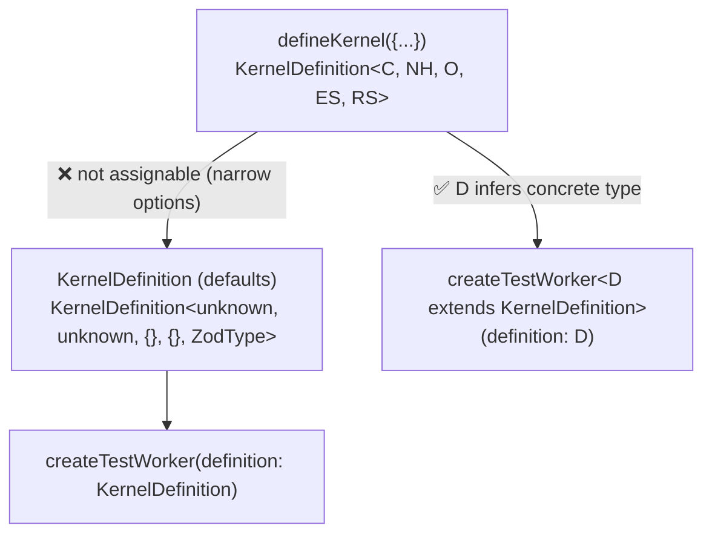

# Export Pipeline v5 Implementation Audit

Audit of the remaining architectural issues in the export pipeline after the roll-forward refactor that made `options` required on `CreateGeometryInput` and `ExportGeometryInput`, renamed `renderOptions` to `options` at the kernel boundary, and introduced `renderSchema` on `KernelDefinition`.

## Executive Summary

Three interrelated problems remain: (1) structural assignability failures when passing concrete `KernelDefinition` instances to test utilities that accept the default-parameterized type, (2) the reheat mechanism for populating `nativeHandle` after cache hits is a framework workaround that belongs in the middleware layer, and (3) `nativeHandle` typing at the framework boundary is `unknown`, losing the kernel-specific type. Additionally, discriminated union narrowing for export options needs a clear pattern and type-level tests. This document maps all outstanding errors, analyzes root causes, and recommends a unified fix strategy.

## Problem Statement

After the roll-forward refactor:

1. **48+ typecheck errors** remain in test files across the runtime package, falling into three categories.
2. **Reheat** — when the geometry cache middleware serves a cached `CreateGeometryResult`, the kernel's `createGeometry` never runs, so `nativeHandle` is never populated. The framework currently has a manual reheat block in `exportGeometry` that calls `onCreateGeometry` directly, bypassing middleware. This is fragile: it couples the framework to a problem introduced by the cache middleware, and any future middleware that short-circuits `createGeometry` will trigger the same issue.
3. **`nativeHandle` typing** — the framework stores `nativeHandle` as `unknown`, which erases kernel-specific types at the boundary between framework and kernel.
4. **Discriminated union narrowing** — kernels destructure `options` from `input` before switching on `format`, which loses the discriminated union correlation. The pattern needs to be fixed and tested.

## Methodology

- Static analysis of `tsgo` typecheck output after the roll-forward refactor
- Source code analysis of `kernel-worker.ts`, `kernel-runtime-worker.ts`, `geometry-cache.middleware.ts`, and all kernel test files
- Type-level reasoning about structural assignability of `KernelDefinition` generics

## Findings

### Finding 1: Structural Assignability — Concrete KernelDefinition vs Default KernelDefinition

The root cause of most typecheck errors. When a concrete `KernelDefinition<Context, NativeHandle, Options, ExportSchemas, RenderSchema>` is passed to `createTestWorker(definition: KernelDefinition)` or `createTestGeometry({ definition: KernelDefinition })`, TypeScript checks whether the concrete type extends the default-parameterized type.

**Why it fails:** `CreateGeometryInput` now has `options` as a required field. When `RenderSchema` is concrete (e.g., `z.object({ tessellation: ... })`), `options` becomes `{ tessellation: { linearTolerance: number; angularTolerance: number } }`. When `RenderSchema` is the default `z.ZodType`, `options` becomes `Record<string, unknown>`. The concrete `createGeometry` method accepts the narrow `options`, but the default expects the wide `Record<string, unknown>`. Method parameter contravariance means the concrete method is **more restrictive** than the default, breaking assignability.

The same issue exists for `ExportGeometryInput` — concrete schemas produce `{ format: 'stl'; options: { binary: boolean }; ... }` while the default produces `{ format: FileExtension; options: Record<string, unknown>; ... }`. The concrete `exportGeometry` is more restrictive on both `format` and `options`.

**Affected files (Category A — 38 errors):**

| File                               | Lines                                                                                          | Pattern                                                                              |
| ---------------------------------- | ---------------------------------------------------------------------------------------------- | ------------------------------------------------------------------------------------ |
| `cross-kernel-mesh-parity.test.ts` | 108, 123, 207, 222, 275, 290                                                                   | `createTestWorker(replicadKernel, ...)` / `createTestWorker(opencascadeKernel, ...)` |
| `replicad.kernel.test.ts`          | 29, 38, 53, 2993, 3396, 3424, 3452, 3477, 3537, 3550, 3564, 3571, 3610, 3685, 3763, 3833, 3910 | `createTestWorker(replicadKernel, ...)` / `createTestGeometry(...)`                  |
| `opencascade.kernel.test.ts`       | 23                                                                                             | `createTestWorker(opencascadeKernel, ...)`                                           |
| `openscad.kernel.test.ts`          | 23, 32, 41                                                                                     | `createTestWorker(openscadKernel, ...)`                                              |
| `jscad.kernel.test.ts`             | 20, 29, 37                                                                                     | `createTestWorker(jscadKernel, ...)` / `createTestGeometry(...)`                     |
| `manifold.kernel.test.ts`          | 15, 23, 31                                                                                     | `createTestWorker(manifoldKernel, ...)`                                              |
| `zoo.kernel.test.ts`               | 20                                                                                             | `createTestWorker(zooKernel, ...)`                                                   |
| `edge-detection.test.ts`           | 15                                                                                             | `createTestWorker(openscadKernel, ...)`                                              |

**Root cause:** `createTestWorker` and `createTestGeometry` accept `KernelDefinition` (default generics). Concrete kernel exports are `KernelDefinition<..., specific types>`. Method bivariance in TypeScript normally allows this, but the new required `options` field on input types creates a structural mismatch that bivariance cannot resolve — the method parameter types are not structurally compatible.

### Finding 2: Missing Required `options` on CreateGeometryInput Construction (Category B)

Three sites in `runtime-middleware.test.ts` construct `CreateGeometryInput` objects without the now-required `options` field:

| File                         | Lines   | Fix               |
| ---------------------------- | ------- | ----------------- |
| `runtime-middleware.test.ts` | 347–351 | Add `options: {}` |
| `runtime-middleware.test.ts` | 389–393 | Add `options: {}` |
| `runtime-middleware.test.ts` | 454–458 | Add `options: {}` |

### Finding 3: Wrong Property Name at Client-Facing Boundary (Category C)

Test files pass `options` to `worker.createGeometry()` (the public KernelWorker method), which expects `renderOptions` at the client-facing boundary:

| File                      | Lines                  | Fix                                |
| ------------------------- | ---------------------- | ---------------------------------- |
| `openscad.kernel.test.ts` | 2175, 2182, 2202, 2226 | Rename `options` → `renderOptions` |
| `replicad.kernel.test.ts` | 3656, 3663             | Rename `options` → `renderOptions` |

### Finding 4: Reheat is a Framework Workaround for a Middleware Problem

The current reheat mechanism in `kernel-worker.ts` (lines 913–952):

```
if ((this.nativeHandle === undefined || this.nativeHandle === null) && this.currentFile) {
  // Re-run onCreateGeometry directly, bypassing middleware
  await this.onCreateGeometry({ ... }, this.createRuntime());
}
```

**Problems with this approach:**

1. **Wrong layer:** The geometry cache middleware introduced the problem (short-circuiting `createGeometry` without populating `nativeHandle`), but the framework fixes it. Every future middleware that short-circuits `createGeometry` will create the same issue.
2. **Bypasses middleware:** Reheat calls `onCreateGeometry` directly, skipping the entire middleware chain. This means middleware state, logging, and dependency tracking are inconsistent.
3. **Fragile parameter reconstruction:** Reheat reconstructs parameters from `lastRenderParameters` or `currentParameters` and render options from `currentRenderOptions`. These are stale if parameters changed since the last render.
4. **No timeout protection:** Unlike `executeRender`, reheat has no timeout mechanism.
5. **Silent failures:** If reheat fails, the code continues to export with a missing/null `nativeHandle`, which each kernel must individually guard against.

**Architecturally correct approach — middleware-level preheat:**

The eigenquestion is: "Who should ensure `nativeHandle` is available for export?" The answer: the same layer that caused it to be unavailable — the middleware system. Two strategies:

**Strategy A: Cache middleware stores `nativeHandle`**

The geometry cache could serialize and cache `nativeHandle` alongside the geometry response. On cache hit, both geometry and `nativeHandle` would be restored.

Pros: No reheat needed at all — exports work immediately after cache hits.
Cons: `nativeHandle` is kernel-specific (BRep trees, WASM pointers, etc.) and often not serializable. OCCT shapes contain WASM heap pointers. Replicad shapes are JavaScript wrapper objects around WASM. Only kernels that produce serializable handles (like Tau kernel's `Uint8Array`) could use this.

**Strategy B: Framework provides `ensureNativeHandle` as a first-class API**

The framework exposes a method on `KernelMiddlewareRuntime` (or a new `ExportMiddlewareRuntime`) that middleware or the export chain can call to ensure `nativeHandle` is populated. This method would:

1. Check if `nativeHandle` is populated
2. If not, run `onCreateGeometry` (the kernel directly, not through middleware — since the geometry cache already has the result)
3. Store `nativeHandle` as a framework side-effect

The export path in `kernel-worker.ts` would call this automatically before building `ExportGeometryInput`, making reheat a first-class framework primitive rather than a workaround.

**Strategy C: Invert the responsibility — `CreateGeometryResult` includes `nativeHandle`**

Change the contract so `CreateGeometryResult` (and `CreateGeometryHandler`) returns `nativeHandle` alongside geometry. The middleware chain would then propagate `nativeHandle` through, and the geometry cache would need to handle it (either by caching it, or by marking that it's not available and the framework should re-derive it).

This is the most architecturally pure approach but requires changing the middleware contract, which affects all existing middleware.

**Recommendation:** Strategy B — the framework provides `ensureNativeHandle()` as a lifecycle hook that runs before export. It keeps the existing middleware contract unchanged, moves the reheat logic to a clean abstraction, and eliminates the manual workaround. The geometry cache middleware doesn't need to know about `nativeHandle` at all.

### Finding 5: `nativeHandle` Typing at Framework Boundary

`KernelWorker.nativeHandle` is `protected nativeHandle: unknown`. This is intentional — the framework is kernel-agnostic — but it creates two problems:

1. **`ExportGeometryInput` at the framework boundary uses `unknown`:** When `kernel-worker.ts` builds `ExportGeometryInput` (line 975), `nativeHandle` is `unknown`. The `onExportGeometry` abstract method also takes `ExportGeometryInput` (no type arguments), which resolves to `nativeHandle: unknown`. `KernelRuntimeWorker` then passes this to `kernel.definition.exportGeometry(input, ...)`, where the concrete kernel expects a specific `NativeHandle` type. This works at runtime because the actual value is correct, but the types are erased.

2. **Structural assignability:** The `unknown` nativeHandle contributes to the Category A assignability failures. The default `KernelDefinition.exportGeometry` accepts `ExportGeometryInput<unknown, {}>`, while concrete kernels accept `ExportGeometryInput<SpecificHandle, SpecificSchemas>`. Since `nativeHandle` is in a covariant position (input to the method), `unknown` is wider than any specific type, and the method parameter is contravariant — so a method accepting `unknown` is more permissive than one accepting `SpecificHandle`, which means the concrete kernel is MORE restrictive. This breaks assignability.

**Recommendation:** Use a generic type parameter on `createTestWorker` / `createTestGeometry` that propagates the definition's generics, rather than erasing to defaults:

```typescript
export async function createTestWorker<D extends KernelDefinition>(
  definition: D,
  files: Record<string, string>,
  options?: CreateTestWorkerOptions,
): Promise<KernelRuntimeWorker> { ... }
```

This makes `D` infer the full `KernelDefinition<...>` type without requiring it to be assignable to `KernelDefinition` (default). The runtime behavior is unchanged — the function still treats `definition` as opaque.

### Finding 6: Discriminated Union Narrowing for Export Options

Kernels currently destructure `options` from `input` before the `switch (format)`:

```typescript
const { format, nativeHandle, options } = input;
switch (format) {
  case 'stl': {
    options.binary; // options is still the full union — not narrowed
  }
}
```

TypeScript 4.6+ supports destructured discriminated union narrowing, but only when both the discriminant and the correlated variable are destructured from the same object. The pattern above should work in theory, but:

1. The `ExportGeometryInput` type is constructed via a mapped type + indexed access, which may not be recognized as a standard discriminated union by all checkers.
2. `tsgo` (the Go-based TypeScript compiler used by this project) may have different narrowing behavior than `tsc`.
3. The existing type tests only verify narrowing via `input.format` checks (not destructured `format`).

**Recommendation:** Test both patterns in `define-plugin.test-d.ts`:

1. **`input.format` + `input.options`** (guaranteed to work — existing test)
2. **Destructured `const { format, options } = input` + `switch (format)`** (needs verification with `tsgo`)

If destructured narrowing works with `tsgo`, keep the current kernel pattern. If not, change kernels to use `input.format`/`input.options` and add a type test documenting why.

## Recommendations

| #   | Action                                                                                                  | Priority | Effort | Impact                                    |
| --- | ------------------------------------------------------------------------------------------------------- | -------- | ------ | ----------------------------------------- |
| R1  | Fix Category A: Make `createTestWorker`/`createTestGeometry` generic (`<D extends KernelDefinition>`)   | P0       | Low    | Fixes 38 typecheck errors                 |
| R2  | Fix Category B: Add `options: {}` to `CreateGeometryInput` construction in `runtime-middleware.test.ts` | P0       | Low    | Fixes 3 typecheck errors                  |
| R3  | Fix Category C: Rename `options` → `renderOptions` in test calls to `worker.createGeometry()`           | P0       | Low    | Fixes 6 typecheck errors                  |
| R4  | Implement `ensureNativeHandle()` as a framework lifecycle hook before export                            | P1       | Medium | Replaces fragile reheat workaround        |
| R5  | Add discriminated union narrowing type tests for both patterns                                          | P1       | Low    | Validates DX and catches tsgo regressions |
| R6  | Evaluate whether `ExportGeometryInput` mapped type is recognized as a discriminated union by tsgo       | P1       | Low    | Determines kernel code pattern            |
| R7  | Consider making `nativeHandle` on `KernelWorker` generic in the future                                  | P2       | High   | Improves framework type safety            |

## Diagrams

### Current Reheat Flow (Fragile)



### Proposed ensureNativeHandle Flow



### Type Assignability Chain



## Outstanding Work Integration

This audit consolidates the following incomplete items from the roll-forward refactor:

1. **Category A fixes** (R1) — unblocks all kernel test files
2. **Category B fixes** (R2) — `runtime-middleware.test.ts`
3. **Category C fixes** (R3) — rename `options` → `renderOptions` at client boundary in tests
4. **Discriminated union pattern** (R5, R6) — export option type safety and DX
5. **Reheat architecture** (R4) — `ensureNativeHandle()` replaces manual reheat
6. **nativeHandle typing** (R7) — future improvement

Items R1–R3 must be completed before typecheck passes. R4–R6 are architectural improvements. R7 is a longer-term consideration.
