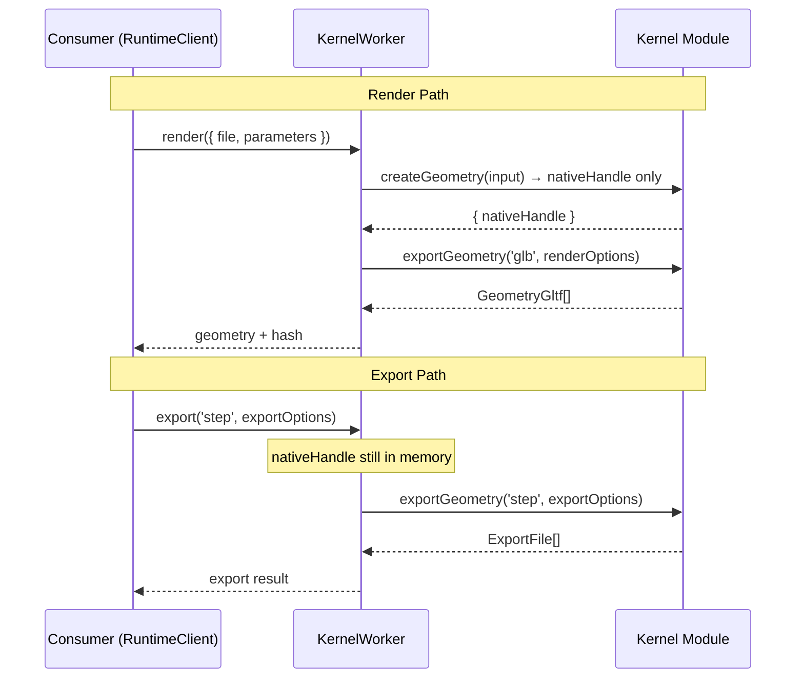
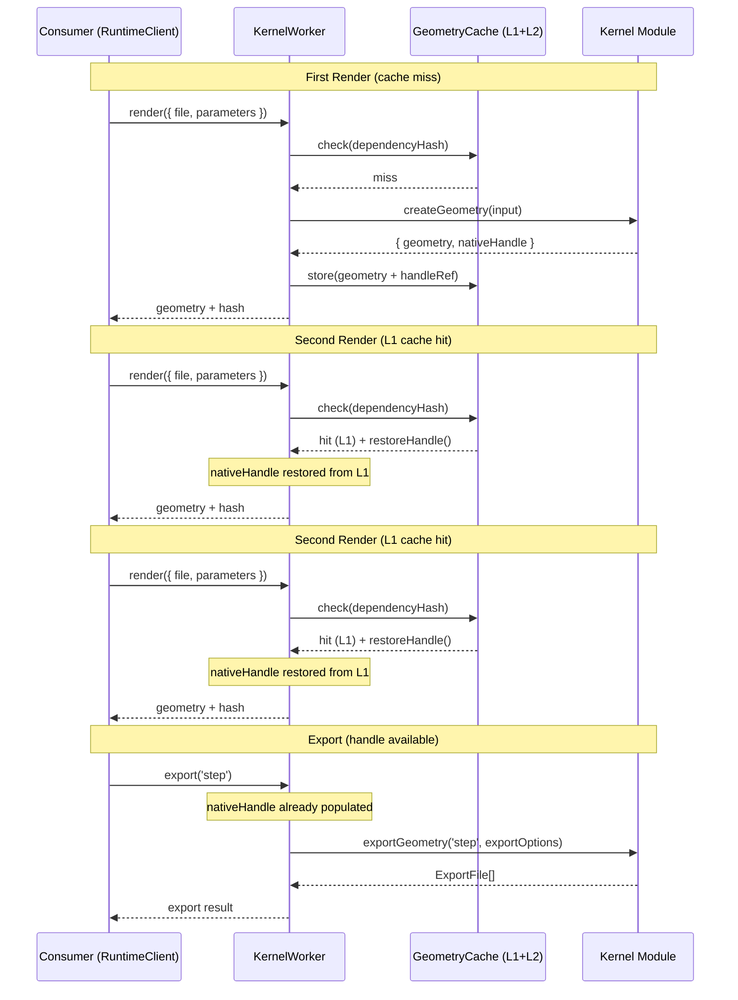
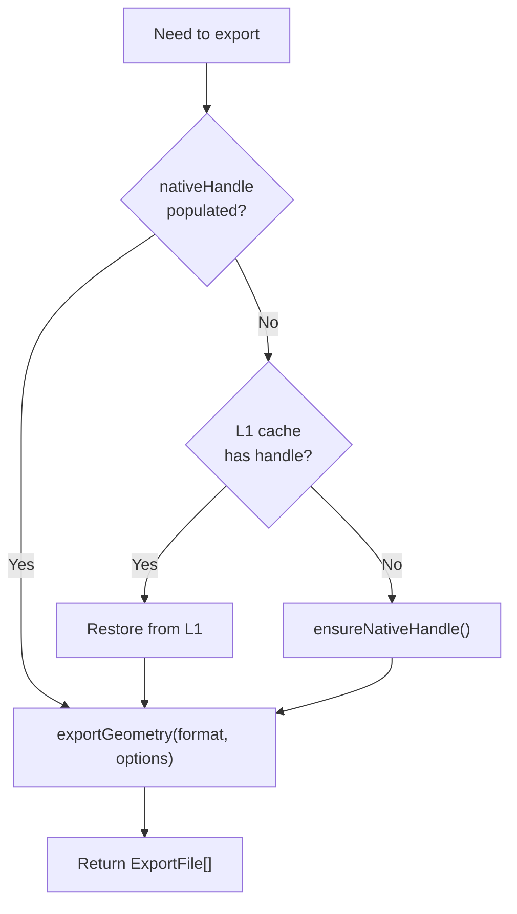

# Export Pipeline v6: Handle-First Architecture Evaluation

Critical evaluation of the "handle-first" proposal: separating `createGeometry` (native handle creation) from visualization (format conversion), making `exportGeometry` the sole format-production pathway for both rendering and export.

## Executive Summary

The handle-first proposal decouples native geometry handle creation from format-specific visualization, yielding a clean single-responsibility `createGeometry` and a unified `exportGeometry` pathway for both rendering and export. The architecture is elegant and aligns with library-api-policy principles. However, deep analysis reveals a fundamental tension with the geometry cache: BRep nativeHandles (replicad, opencascade) are WASM heap objects that cannot be serialized, and the cache is the runtime's primary performance optimization. We evaluate five strategies for reconciling this tension, present a modified proposal that preserves the architectural purity while maintaining caching, and map all outstanding implementation requirements.

## Table of Contents

- [Problem Statement](#problem-statement)
- [The Proposal](#the-proposal)
- [Methodology](#methodology)
- [Findings](#findings)
- [Assumptions](#assumptions)
- [Eigenquestions](#eigenquestions)
- [Recommendations](#recommendations)
- [Diagrams](#diagrams)
- [Outstanding Implementation Requirements](#outstanding-implementation-requirements)
- [References](#references)

## Problem Statement

The current architecture couples three concerns inside `createGeometry`:

1. **Code evaluation** — execute user code, run BRep operations, produce native shapes
2. **Tessellation** — convert BRep to triangle mesh (kernel-specific tolerances)
3. **Encoding** — convert meshes to GLTF for wire transfer to the viewer
   This coupling creates:

- **Reheat fragility**: The geometry cache caches `GeometryResponse[]` (GLTF/SVG) but not the nativeHandle. Cache hits bypass the kernel, leaving nativeHandle unpopulated. The framework works around this with a manual reheat block that calls `onCreateGeometry` directly, bypassing middleware.
- **Inflexible render format**: GLTF is hardcoded as the 3D visualization format. Supporting alternative render formats (USDZ, WebGPU scene graphs) would require changing every kernel's `createGeometry`.
- **Duplicated tessellation logic**: Kernels duplicate tessellation code between `createGeometry` (render tessellation) and `exportGeometry` (export tessellation with different tolerances).
  The handle-first proposal asks: what if `createGeometry` only did concern #1 — producing the native handle — and concerns #2 and #3 were handled by `exportGeometry` for both render and export?

## The Proposal

**Core idea**: `createGeometry` returns only the nativeHandle (no `GeometryResponse[]`). Rendering becomes `exportGeometry('glb', renderOptions)` and export becomes `exportGeometry('step', exportOptions)`. Both flows share the same pipeline.

```
Current:                           Proposed:
┌──────────────┐                   ┌──────────────┐
│createGeometry│→ GLTF + handle    │createGeometry│→ handle only
└──────────────┘                   └──────────────┘
       ↓                                  ↓
┌──────────────┐                   ┌──────────────┐
│exportGeometry│→ STEP/STL/etc     │exportGeometry│→ ANY format
└──────────────┘                   └──────────────┘
                                   (render = glb with coarse tess)
                                   (export = step with fine tess)
```

**Claimed benefits**:

1. `createGeometry` has a single responsibility — code evaluation and BRep construction
2. Render format is consumer-configurable (GLTF, USDZ, etc.)
3. Export is just "a different format with different options"
4. Reheat is eliminated — `createGeometry` always runs, `exportGeometry` always has a handle
5. Tessellation logic lives in one place (exportGeometry), not duplicated across render/export

## Methodology

- Source analysis of `kernel-worker.ts`, `kernel-runtime-worker.ts`, `runtime-client.ts`, `runtime-worker-dispatcher.ts`, all kernel implementations, geometry cache middleware, and transcoder types
- Type-level analysis of `CreateGeometryOutput`, `ExportGeometryInput`, `GeometryResponse`, protocol types, and transport types
- Evaluation against `docs/policy/library-api-policy.md` principles
- Performance analysis of cache hit/miss paths across the render cycle

## Findings

### Finding 1: The nativeHandle Serializability Wall

The proposal's fundamental assumption is that `createGeometry` can be cheap enough to always run (no caching needed), or that its result can be cached. Neither holds for BRep kernels.
| Kernel | nativeHandle type | Serializable? | Typical evaluation time |
|--------|-------------------|---------------|------------------------|
| Replicad | `InputShape[]` (WASM BRep wrappers) | No — WASM heap pointers | 100ms–10s+ |
| OpenCascade | `OcctShapeEntry[]` (WASM BRep wrappers) | No — WASM heap pointers | 100ms–10s+ |
| OpenSCAD | `string` (OFF geometry text) | Yes | 200ms–30s+ |
| Tau | `Uint8Array` (GLB bytes) | Yes | 50ms–5s |
| JSCAD | geometry objects | Partially — no WASM | 50ms–5s |
| Manifold | mesh objects | Partially — no WASM | 50ms–5s |
For replicad and opencascade — the two primary BRep kernels — `createGeometry` performs expensive boolean operations on WASM-allocated shapes. The resulting nativeHandle contains live references to the WASM heap that cannot be serialized to disk.
**Impact**: If `createGeometry` always runs (no caching), every re-render triggered by user edits would re-evaluate the full BRep pipeline. For complex models, this means seconds to minutes of computation on every keystroke — a performance regression that would make the editor unusable.
**The current geometry cache provides 100ms re-render on cache hits vs. seconds without it.** Removing this cache path is not viable for interactive editing.

### Finding 2: Moving Caching to exportGeometry Creates a Combinatorial Problem

If `createGeometry` is uncacheable and `exportGeometry` becomes the cached step, the cache key must include the export format and options:

```
cache key = hash(source deps + format + tessellation options)
```

This means:

- **Render cache**: `hash(deps + 'glb' + renderTessellation)`
- **Export STEP cache**: `hash(deps + 'step' + {})`
- **Export STL cache**: `hash(deps + 'stl' + exportTessellation)`
  Each format × options combination is a separate cache entry. Changing render tessellation settings invalidates the render cache but not export caches. This is manageable but adds cache management complexity.
  More critically, a cache hit for the export-STEP entry still requires the nativeHandle — and if `createGeometry` was skipped (its result isn't cached), the handle doesn't exist. The reheat problem resurfaces at a different layer.

### Finding 3: SVG/2D Output Breaks the Clean Split

Replicad's `createGeometry` produces both 3D geometry (GLTF) and 2D projections (SVG). The viewer needs both simultaneously — the 3D viewport and 2D sketch views render from the same `createGeometry` result.

```typescript
// Current: returns both 3D and 2D in one pass
return { geometry: [...gltfShapes, ...shapes2d], nativeHandle };
```

In the handle-first model:

- `createGeometry` returns only nativeHandle (no SVG, no GLTF)
- Render would call `exportGeometry('glb', renderOptions)` for 3D
- But SVG 2D output needs a separate `exportGeometry('svg', ...)` call
  This raises questions: Does the SVG export need the nativeHandle? Yes — 2D projections are derived from the 3D BRep shapes. So both 3D and 2D exports need the same nativeHandle, but produce different formats. This would require two `exportGeometry` calls for every render, adding protocol complexity and latency.

### Finding 4: Protocol and Transport Layer Assumptions

The worker↔main-thread protocol has specific assumptions baked into the transport layer:

1. `RuntimeCommand.render` produces `RuntimeResponse.geometryComputed` containing `HashedGeometryResultTransport`
2. `HashedGeometryResultTransport` is `KernelResult<GeometryTransport[]>` — always `GeometryGltfTransport | GeometrySvg | GeometryWebRtc`
3. `GltfContentDelivery` supports pooled delivery via `SharedPool` for zero-copy GLTF transfer
4. `RuntimeClient.resolveGeometry()` resolves pooled GLTF bytes from `SharedArrayBuffer`
5. The `geometry` event on `RuntimeClient` emits `HashedGeometryResult` (resolved GLTF/SVG)
   The handle-first model would need to either:
   **(a)** Keep `render` as a compound command (internally: createGeometry → exportGeometry('glb')) — preserving the protocol but hiding the two-step process. The consumer API remains unchanged.
   **(b)** Expose the two-step process in the protocol — adding a `createHandle` command and changing `render` to return only a handle reference, followed by a `convertHandle` command. Major protocol change affecting consumer API, events, and pooled delivery.
   Option (a) preserves backward compatibility but means the "purity" of the split only exists inside the worker. The consumer never sees it. Option (b) is a breaking protocol change with unclear benefit to consumers.

### Finding 5: Library API Policy Alignment

Evaluating against `library-api-policy.md`:
**§1 Factory Functions**: Unaffected — `createRuntimeClient()` doesn't change.
**§3 Flat Options**: The proposal improves this — render tessellation would be passed the same way as export tessellation, via `exportGeometry` options.
**§4 Parameter Design / Consistency Principle**: The current contract is `createGeometry(input, runtime, context)` and `exportGeometry(input, runtime, context)`. The handle-first model changes the `input` shapes:

- `createGeometry` input: loses `options` (tessellation moves to exportGeometry)
- `exportGeometry` input: gains render responsibility
  This is a valid evolution — both methods still follow `(input, runtime, context)`. But the semantic meaning shifts: `createGeometry` becomes "evaluate code" and `exportGeometry` becomes "produce format-specific output."
  **§5 Naming**: Under the proposal, `createGeometry` no longer creates displayable geometry — it creates an opaque handle. The name becomes misleading. A more accurate name would be `evaluateModel()` or `buildGeometry()`. However, renaming is a breaking API change for all kernel authors.
  **§9 Lazy Initialization**: The two-step render adds one deferred step internally, which is acceptable if hidden behind `render()`.
  **§11 No Optional Interface Methods**: Both methods remain required. Positive.
  **§12 TypeScript-First Design**: The handle-first model strengthens typing — `createGeometry` returns `{ nativeHandle: NativeHandle }` (no geometry to type), and `exportGeometry` is the sole geometry-producing method.
  **Overall assessment**: The proposal is consistent with the policy. The naming concern (§5) is the most significant friction point.

### Finding 6: The Transcoder System Already Provides Render Format Flexibility

The runtime already has a transcoder plugin system that provides format conversion as an injectable pipeline. The `ConverterTranscoder` converts `glb → {stl, step, obj, ...}`. A hypothetical `USDZTranscoder` could convert `glb → usdz`.
This means render format flexibility is already architecturally possible without restructuring `createGeometry`:

1. Kernel produces GLB (current behavior)
2. Consumer requests `export('usdz', renderOptions)`
3. Framework routes through: kernel `exportGeometry('glb')` → transcoder `glb → usdz`

Step 3 still requires a full WASM re-execution, meaning the handle-first model doesn't eliminate OpenSCAD's re-render — it just moves it from `exportGeometry` to another `exportGeometry` call with different options. The nativeHandle (OFF string from step 1) is discarded in step 3.
This reveals that the handle-first model assumes nativeHandle is format-agnostic — that the same handle works for all export qualities. For OpenSCAD, this is false: different tessellation settings require a full re-computation, not just a re-encoding of the same handle.

### Finding 8: Strategy B (ensureNativeHandle) Solves the Eigenquestion Without Restructuring

The v5 audit proposed Strategy B: `ensureNativeHandle()` as a framework lifecycle hook. This approach:

1. Keeps `createGeometry` producing both geometry and nativeHandle (current behavior)
2. The geometry cache caches `GeometryResponse[]` (current behavior)
3. Before export, the framework calls `ensureNativeHandle()` which checks if nativeHandle is populated
4. If not (cache hit bypassed createGeometry), runs `onCreateGeometry` to repopulate it
5. `exportGeometry` proceeds with a guaranteed nativeHandle
   This preserves the geometry cache's performance benefits, doesn't change the protocol, doesn't change the consumer API, and cleanly addresses the reheat problem. The cost is that export after a cache hit requires one additional `createGeometry` call — but this happens only when exporting, not on every render.
   **Comparison**:
   | Dimension | Handle-First | Strategy B (ensureNativeHandle) |
   |-----------|-------------|-------------------------------|
   | Performance impact | Removes geometry caching for BRep kernels | Zero — caching preserved |
   | Protocol changes | Possible (option b) or hidden (option a) | None |
   | Consumer API changes | None if hidden | None |
   | Kernel author impact | All kernels must restructure `createGeometry` | No kernel changes |
   | Reheat elimination | Yes, but nativeHandle caching problem resurfaces | Yes, formalized as framework hook |
   | Naming accuracy | `createGeometry` misnomer | No naming issue |
   | Render format flexibility | Native | Achievable via transcoders |
   | SVG/2D handling | Requires separate export call | Current behavior preserved |
   | OpenSCAD re-render | Still required | Still required |

## Assumptions

The handle-first proposal rests on the following assumptions. Each is evaluated:
| # | Assumption | Valid? | Evidence |
|---|-----------|--------|----------|
| A1 | `createGeometry` can run without caching and remain performant | **No** | BRep evaluation takes 100ms–10s+; cache provides 100ms re-render |
| A2 | nativeHandle can be cached as a fallback | **No** for BRep kernels | WASM heap pointers are not serializable |
| A3 | All render formats can be produced from the same nativeHandle | **Mostly yes** | But OpenSCAD requires re-computation for different tessellation |
| A4 | SVG/2D output fits the exportGeometry model | **Partially** | Requires separate export call, complicates render path |
| A5 | The consumer benefits from render format configurability | **Speculative** | No current consumer requests for non-GLTF render |
| A6 | Tessellation is always a format-specific concern | **Yes** | STEP needs no tessellation; GLB/STL need different levels |
| A7 | The protocol can be preserved (option a) | **Yes** | `render` command internally does both steps |
| A8 | `exportGeometry` can serve as both render and export | **Yes** | Same code path, different options |

## Eigenquestions

### EQ1: What is the irreducible cost of interactive rendering?

The render path must be fast enough for keystroke-triggered updates (~100ms target). If `createGeometry` cannot be cached (BRep handles are not serializable), every render re-evaluates the full pipeline. Is there a way to make BRep evaluation fast enough to skip caching? Answer: No — complex models with boolean operations can take seconds to minutes. Caching is essential.

### EQ2: Can nativeHandle be cached in-memory without serialization?

The L1 geometry cache (`LruMap`) holds results in memory. Could it also hold the nativeHandle? If the nativeHandle is a live WASM object, it stays valid as long as the WASM module is alive (which it is — the worker keeps it loaded). So **in-memory caching of nativeHandle is feasible for L1 cache hits**. The challenge is L2 (disk) cache hits where the WASM objects don't survive serialization.
This suggests a **hybrid approach**: cache geometry + nativeHandle in L1 (memory), cache only geometry in L2 (disk). L1 hits → no reheat needed. L2 hits → reheat via ensureNativeHandle.

### EQ3: Does rendering actually need to be GLTF?

GLTF is the interchange format for the Three.js viewer. Unless the viewer changes to support other formats, GLTF remains the only useful render format for 3D. USDZ is relevant for AR Quick Look (iOS) but not for interactive viewport rendering. The "render in any format" benefit has no current consumer.

### EQ4: Is the architectural purity worth the migration cost?

The handle-first model requires:

- Restructuring all 7 kernels' `createGeometry` methods
- Adding a "render format" step to the worker pipeline
- Updating the protocol or hiding the two-step process
- Handling SVG/2D as separate export calls
- Removing or restructuring the geometry cache
- Updating all tests
  Strategy B requires:
- Adding `ensureNativeHandle()` to `kernel-worker.ts`
- Removing the manual reheat block
- No kernel changes, no protocol changes, no consumer API changes

### EQ5: Could a phased approach work?

Could we implement Strategy B now (fixing reheat) and evolve toward handle-first later if the consumer need arises? Yes — Strategy B doesn't preclude future restructuring. The `ensureNativeHandle()` hook could be the stepping stone: it already separates "ensure handle exists" from "produce visualization."

### EQ6: What about `CreateGeometryOutput.geometry` for non-GLTF kernels?

Some future kernels might produce geometry in formats other than GLTF (e.g., a WebGPU scene graph). In the current model, `GeometryResponse` is a discriminated union of `GeometrySvg | GeometryGltf | GeometryWebRtc`. New formats require extending this union. In the handle-first model, any render format goes through `exportGeometry`, so `GeometryResponse` would be replaced by `ExportFile[]` at the protocol level — a more fundamental change.

## Recommendations

| #   | Action                                                                         | Priority | Effort | Impact                                        |
| --- | ------------------------------------------------------------------------------ | -------- | ------ | --------------------------------------------- |
| R1  | Implement Strategy B (`ensureNativeHandle`) from v5 audit as the immediate fix | P0       | Medium | Eliminates reheat fragility, unblocks exports |
| R2  | Extend L1 geometry cache to store nativeHandle alongside geometry              | P0       | Low    | Eliminates reheat for in-memory cache hits    |
| R3  | Fix structural assignability errors (v5 R1–R3) to unblock typecheck            | P0       | Low    | Unblocks 48 typecheck errors                  |
| R4  | Add discriminated union narrowing type tests (v5 R5–R6)                        | P1       | Low    | Validates export DX                           |
| R5  | Evaluate handle-first as a v2 evolution after Strategy B ships                 | P2       | N/A    | Architectural option preserved                |
| R6  | Do NOT implement handle-first as the immediate refactor                        | —        | —      | Performance risk too high                     |

### R1 Detail: ensureNativeHandle Implementation

```typescript
// In kernel-worker.ts
private async ensureNativeHandle(): Promise<void> {
  if (this.nativeHandle !== undefined && this.nativeHandle !== null) {
    return;
  }
  if (!this.currentFile) {
    throw new Error('Cannot ensure nativeHandle: no current file');
  }
  const parameters =
    Object.keys(this.lastRenderParameters).length > 0
      ? this.lastRenderParameters
      : this.currentParameters;
  this.logger.debug('Ensuring nativeHandle via createGeometry replay');
  await this.onCreateGeometry(
    {
      filePath: this.activeFileAbsolutePath,
      basePath: this.getProjectRootPath(),
      parameters,
      options: this.validateRenderOptions(this.currentRenderOptions),
    },
    this.createRuntime(),
  );
}
```

Replace the manual reheat block (lines 913–952) with a single call:

```typescript
await this.ensureNativeHandle();
```

### R2 Detail: L1 Cache nativeHandle Storage

The geometry cache middleware's L1 `LruMap` could be extended to store a callback that restores the nativeHandle:

```typescript
type CacheEntryWithHandle = {
  result: KernelSuccessResult<GeometryResponse[]>;
  restoreHandle?: () => void;
};
```

On cache write, the framework passes a `restoreHandle` closure that re-assigns `this.nativeHandle`. On L1 cache hit, the middleware calls `restoreHandle()` so the framework's nativeHandle is populated without re-running the kernel. L2 (disk) hits cannot restore the handle (WASM pointers don't survive serialization), so `ensureNativeHandle()` covers that case.
This eliminates reheat for the common case (L1 hits during interactive editing) and falls back to `ensureNativeHandle` for the uncommon case (L2 disk cache hits, typically after worker restart).

## Diagrams

### Handle-First Architecture (Proposed)



### Strategy B + L1 Handle Cache (Recommended)



### Decision Matrix



## Outstanding Implementation Requirements

All items from v5 audit plus the recommended additions:
| # | Requirement | Source | Status |
|---|------------|--------|--------|
| 1 | Generic `createTestWorker<D extends KernelDefinition>` to fix 38 assignability errors | v5 R1 | Pending |
| 2 | Add `options: {}` to `CreateGeometryInput` in `runtime-middleware.test.ts` (3 sites) | v5 R2 | Pending |
| 3 | Rename `options` → `renderOptions` in test calls to `worker.createGeometry()` (6 sites) | v5 R3 | Pending |
| 4 | Implement `ensureNativeHandle()` framework hook | v5 R4 / v6 R1 | Pending |
| 5 | Remove manual reheat block from `exportGeometry` (lines 913–952) | v6 R1 | Pending |
| 6 | Extend L1 geometry cache to co-store nativeHandle reference | v6 R2 | Pending |
| 7 | Add discriminated union narrowing type tests (`define-plugin.test-d.ts`) | v5 R5 | Pending |
| 8 | Verify `ExportGeometryInput` mapped type narrowing with `tsgo` | v5 R6 | Pending |
| 9 | Run typecheck, test, and lint validation across runtime package | v5 verify | Pending |
| 10 | Propagate `options` rename in UI layer (`cad.machine.ts`, `chat-converter.tsx`, etc.) | v5 rollout | Partially done |

## References

- Research: `docs/research/export-pipeline-v5-implementation-audit.md`
- Research: `docs/research/export-pipeline-v5.md`
- Research: `docs/research/unified-export-pipeline-architecture.md`
- Policy: `docs/policy/library-api-policy.md`
- Source: `packages/runtime/src/framework/kernel-worker.ts` (reheat: lines 913–952)
- Source: `packages/runtime/src/middleware/geometry-cache.middleware.ts` (L1+L2 cache)
- Source: `packages/runtime/src/types/runtime-kernel.types.ts` (CreateGeometryOutput, ExportGeometryInput)
- Source: `packages/runtime/src/types/runtime-transcoder.types.ts` (transcoder plugin system)
