# Filesystem Architecture Blueprint

## 1. Problem Domain

Tau is a web-based code-CAD editor. The filesystem must serve three distinct access patterns simultaneously:

1. **Interactive editing** — sub-50ms reads/writes for source files (<100 KB), real-time model sync with Monaco, optimistic UI updates
2. **Kernel computation** — batch reads of project dependencies, geometry/parameter cache I/O, esbuild bundling, all running in dedicated worker threads
3. **Asset management** — import/export of binary CAD files (STL, STEP, glTF up to 100 MB), ZIP operations, cross-backend directory browsing

The architecture must work entirely in the browser with no server-side storage, support multiple storage backends (IndexedDB, File System Access API, OPFS, in-memory), and maintain high throughput under concurrent access from multiple workers.

## 2. Target Architecture

### 2.1 System overview

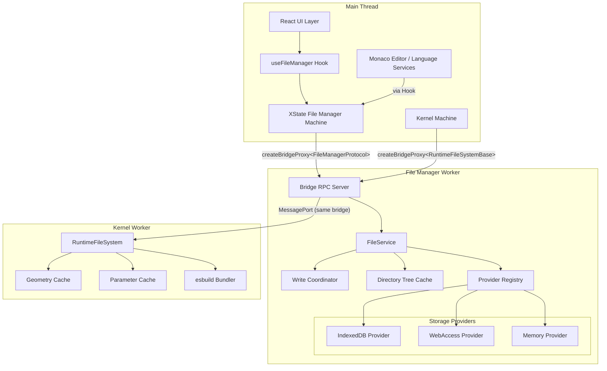

### 2.2 Core design decisions

**Single worker, multiple ports.** One file manager worker serves all consumers. Each consumer (main thread, runtime worker) gets its own MessagePort via `createFileSystemBridge` → `MessageChannel` → `createBridgeProxy`. The worker maintains a single ZenFS instance and serialization queue, eliminating cross-worker corruption.

**Unified bridge, narrowed types (ISP).** Both the main thread and kernel workers use the exact same bridge mechanism (`createBridgeProxy` over `MessagePort`). The only difference is the TypeScript type parameter:

- Main thread: `createBridgeProxy<FileManagerProtocol>` — full API (reconfigure, diagnostics, higher-level ops)
- Kernel worker: `createBridgeProxy<RuntimeFileSystemBase>` — 11 base primitives only

Both talk to the same worker, same `fileManager` object, same bridge server. The kernel's narrower type enforces ISP — kernels cannot call `reconfigure()` or `getZippedDirectory()` even though the underlying handler would accept it.

**Promise-based RPC for one-shot operations.** All standard FS operations (`readFile`, `writeFile`, `stat`, `readdir`) use `await proxy.method()` — one request, one response. This matches VS Code's `channel.call()` pattern for filesystem IPC. Event-driven patterns are reserved for push notifications (tree changes) and streaming (large file reads), implemented as a `listen()` extension to the bridge.

**XState for lifecycle orchestration, not data storage.** The `fileManagerMachine` manages the worker lifecycle (create → init → ready → error), shared worker coordination, and per-build backend configuration. Caches like `openFiles` should be extracted into dedicated bounded classes (LRU with max entries/bytes) referenced from machine context but managed independently. XState is the right tool for the coordination problem; it should not double as an unbounded data store.

**Provider abstraction (inspired by VS Code).** The worker's `FileService` routes operations to backend-specific providers. Each provider encapsulates its storage mechanics (IndexedDB transactions, File System Access API handles, in-memory maps). This enables:

- Adding new backends without modifying the service layer
- Per-backend caching and optimization strategies
- Clean testing via the `Memory` provider

**Read-only standalone FS instances are safe.** For cross-backend browsing (files route), standalone `FileSystem` instances created via `resolveMountConfig` share the same underlying IndexedDB database as the main mount but have independent in-memory caches. ZenFS's TOCTOU bug (zen-fs/core#256) only affects concurrent writers — read-only standalone instances cannot trigger corruption. They must be cached per backend (not recreated per call) to avoid connection and cache preload overhead.

**Event-driven tree management.** Directory metadata is maintained as a cached tree in the worker, invalidated by write operations. Consumers subscribe to change events rather than polling. This replaces the current pattern of full recursive `getDirectoryStat` after every mutation.

## 3. Layers in Detail

### 3.1 Layer 1: React / Main Thread

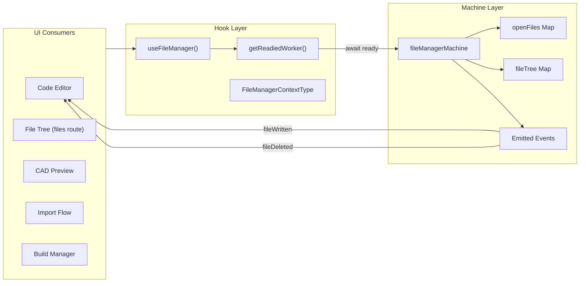

**Responsibilities:**

- `useFileManager` hook provides the public API to React components
- `fileManagerMachine` manages worker lifecycle (create → init → ready → error) and per-build backend configuration
- `openFiles` caches recently read/written file contents (must be bounded)
- `fileTree` stores flat metadata for the build's project files
- Emitted events notify Monaco and editors of changes

**Key rules:**

- The hook awaits `getReadiedWorker()` before any RPC call
- Write operations call the worker directly, then send a consolidated event to the machine
- The machine never performs I/O — it only reacts to events and manages state
- `openFiles` must implement LRU eviction (max entries, max total bytes)
- **Architectural recommendation:** Extract `openFiles` from XState context into a dedicated `BoundedFileCache` class with LRU eviction, max entry count, max total bytes, and skip-large-binary logic. XState context should hold a reference to the cache instance, not own the raw Map. This keeps the machine focused on lifecycle coordination (its strength) and avoids unbounded cache growth in machine snapshots.

### 3.2 Layer 2: RPC Bridge

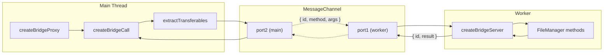

**Protocol:** `{ id, method, args }` → `{ id, result | error }`. Each call gets a monotonic ID. Pending calls have a 30-second timeout. This is deliberately promise-based — all standard FS operations are one-shot request/response, matching VS Code's `channel.call()` pattern.

**Why `await` is correct here:** Unlike the kernel transport (where `render()` produces intermediate progress events and the result arrives much later), FS operations are fast, bounded, and produce exactly one result. Wrapping them in an event-driven system (fire-and-forget + callback) would add complexity without performance benefit. VS Code's `DiskFileSystemProviderClient` confirms this — every FS method (`stat`, `readFile`, `readdir`, `writeFile`, `rename`, `delete`) uses `await this.channel.call()`.

**Extension point: Event channels.** For push notifications (directory tree changes, file watching, batch progress), the bridge should be extended with a `listen()` channel alongside `call()`. This mirrors VS Code's hybrid approach where `IPC` supports both `call()` (Promise) and `listen()` (Event streams). The FS bridge currently lacks this — tree refresh uses polling via `getDirectoryStat`.

```
call()   ←→ one request, one response (readFile, writeFile, stat)
listen() ←→ zero requests, many events (treeChanged, watchEvent)
```

**Transfer semantics:** `extractTransferables` walks nested objects to collect `ArrayBuffer` instances. These are transferred (zero-copy), not cloned. After transfer, the sender's buffer is detached.

**Safety traps (Comlink-inspired):**

- `then` → `undefined` (prevents thenable coercion)
- `toJSON` → `undefined` (prevents serialization accidents)
- Symbols → `undefined`
- Disposed proxy → synchronous throw

### 3.3 Layer 3: FileService (Worker)

The FileService is the orchestration layer inside the worker. It does not perform storage I/O directly — it delegates to providers.

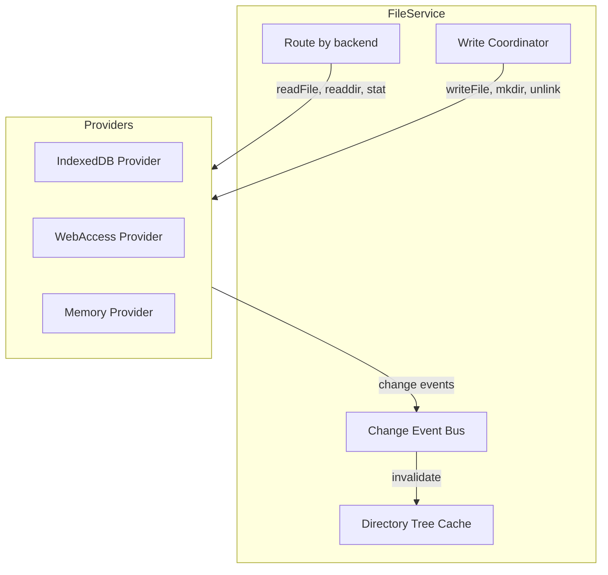

**Write Coordinator:** Serializes mutating operations. Current: global queue (prevents ZenFS TOCTOU). Target: per-directory queues when ZenFS fixes the underlying race condition.

**Directory Tree Cache:** Maintains an in-memory representation of the directory structure (names, types, sizes, mtimes). Invalidated incrementally by write operations — only the affected parent directory is re-read. Consumers query this cache instead of performing full recursive traversals.

**Change Event Bus:** Notifies connected ports of file changes. Main thread machine subscribes to refresh `fileTree` context. Eliminates the need for polling-based refresh.

### 3.4 Layer 4: Storage Providers

Each provider implements a minimal interface:

```typescript
type FileSystemProvider = {
  readonly capabilities: ProviderCapabilities;
  readFile(path: string): Promise<Uint8Array>;
  readFile(path: string, encoding: 'utf8'): Promise<string>;
  writeFile(path: string, data: Uint8Array | string): Promise<void>;
  readdir(path: string): Promise<string[]>;
  stat(path: string): Promise<FileStat>;
  mkdir(path: string): Promise<void>;
  unlink(path: string): Promise<void>;
  rmdir(path: string): Promise<void>;
  rename(from: string, to: string): Promise<void>;
  exists(path: string): Promise<boolean>;
};
```

| Provider      | Backend                          | Persistence                           | Size limit                      | Notes                                  |
| ------------- | -------------------------------- | ------------------------------------- | ------------------------------- | -------------------------------------- |
| **IndexedDB** | IndexedDB via ZenFS              | Persistent, survives reload           | ~quota (typically 50%+ of disk) | Primary storage for builds             |
| **WebAccess** | File System Access API via ZenFS | Persistent, user-controlled directory | Unlimited (native FS)           | Local directory sync                   |
| **Memory**    | In-memory via ZenFS              | Session only                          | RAM-limited                     | Tests, ephemeral previews              |
| **OPFS**      | Origin Private FS via ZenFS      | Persistent                            | Quota-based                     | Currently disabled (corruption issues) |

**Provider lifecycle:** Created once per backend, cached in a `Map<backend, FileSystem>`. Destroyed on backend switch or worker termination. This applies to both the main mounted FS and standalone instances used by the files route.

**Standalone instance safety:** Standalone `FileSystem` instances (via `resolveMountConfig`) share the same underlying IndexedDB database as the main mount but have independent in-memory caches. Read-only usage is safe — ZenFS's TOCTOU bug (zen-fs/core#256) only affects the read-modify-write cycle in concurrent _writes_ to the same directory. A standalone instance performing `readdir` + `stat` (as the files route does) cannot trigger this corruption. The only risk is stale reads (a file deleted between `readdir` and `stat`), which is benign and handled by try/catch around individual stat calls. Standalone instances must **never** be used for writes — all mutations must go through the main mounted FS and its serialization queue.

### 3.5 Layer 5: Kernel Filesystem

Kernel workers access the filesystem via their own `MessagePort` to the file manager worker, using **the same bridge mechanism** as the main thread (`createFileSystemBridge` → `MessageChannel` → `createBridgeProxy<RuntimeFileSystemBase>`). The `RuntimeFileSystemBase` interface provides 11 primitives plus batch helpers — a deliberate narrowing of the full `FileManagerProtocol` per ISP.

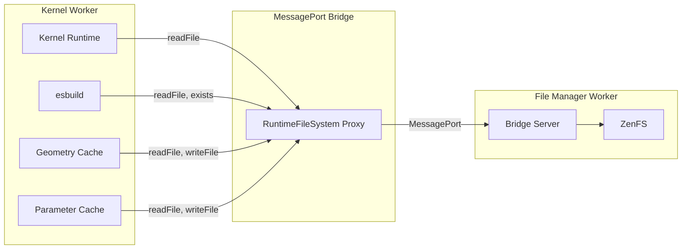

**Access patterns by kernel:**

| Kernel          | Read                             | Write            | Special                                   |
| --------------- | -------------------------------- | ---------------- | ----------------------------------------- |
| Replicad        | Main file (utf8)                 | —                | Dependencies via esbuild                  |
| JSCAD           | Main file (utf8)                 | —                | Dependencies via esbuild                  |
| Manifold        | Main file (utf8)                 | —                | Dependencies via esbuild                  |
| OpenSCAD        | Main + includes (utf8, batch)    | —                | Pre-mounts to Emscripten FS               |
| KCL/Zoo         | Main + imports (utf8)            | —                | Import resolution via kcl-import-resolver |
| Tau             | Main file (binary) + siblings    | —                | Directory preload for assimpjs            |
| Geometry cache  | Cache read (binary, MessagePack) | Cache write      | `.tau/cache/geometry/`                    |
| Parameter cache | Cache read (utf8, JSON)          | Cache write      | `.tau/cache/parameters/`                  |
| Module manager  | —                                | CDN module cache | `node_modules/` within project            |

**Key insight:** Kernel writes are limited to cache files and CDN modules. User project files are read-only from the kernel's perspective. This asymmetry means kernel read throughput is far more critical than write throughput.

## 4. Data Flow Diagrams

### 4.1 Interactive editing (hot path)

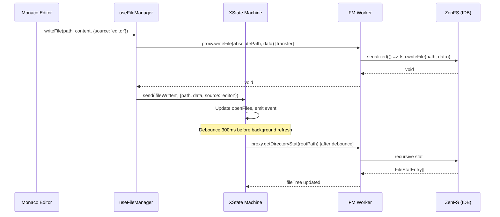

### 4.2 Kernel geometry computation

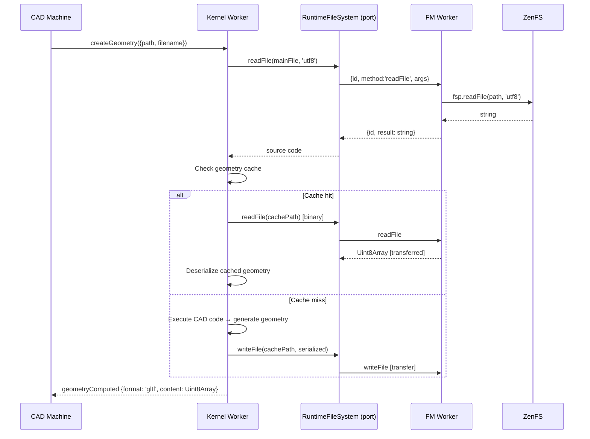

### 4.3 Lazy file tree loading (files route)

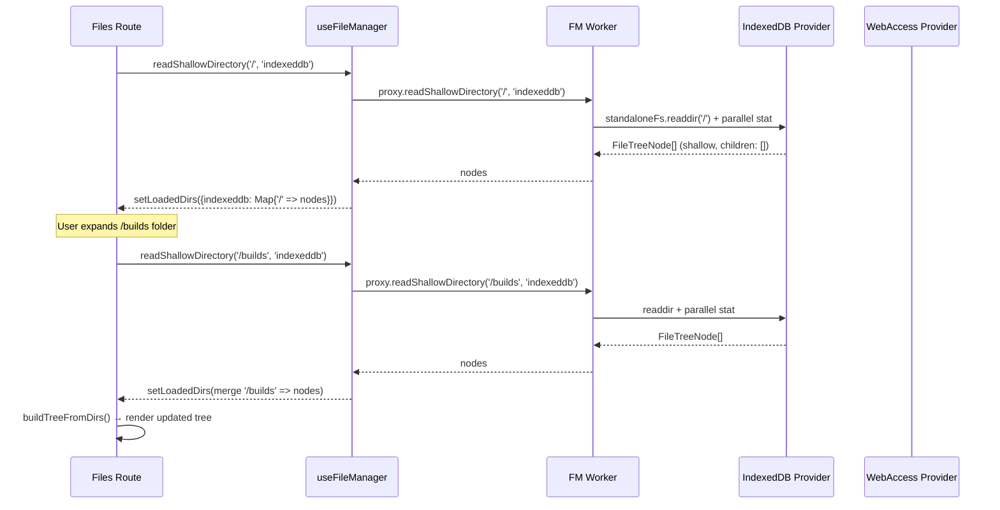

### 4.4 Build import flow

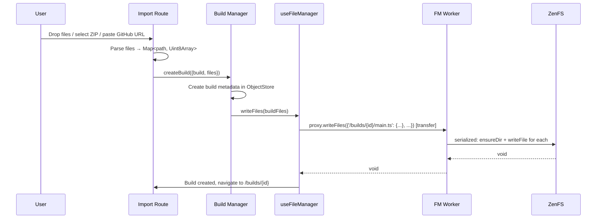

## 5. Performance Architecture

### 5.1 Transfer optimization

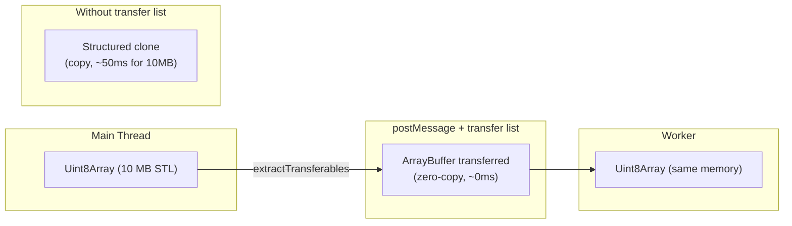

All `Uint8Array` / `ArrayBuffer` payloads must use transfer lists. This is critical for:

- Large binary file reads (STL, STEP, glTF)
- Geometry cache I/O (MessagePack)
- Kernel dependency batch reads
- File import/upload flows

### 5.2 Write throughput

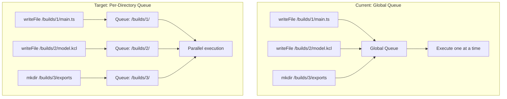

The global queue exists because ZenFS has a TOCTOU race on concurrent writes to the same directory. Once ZenFS fixes this (zen-fs/core#256), per-directory queues will unlock parallel writes to different projects.

### 5.3 Tree refresh optimization

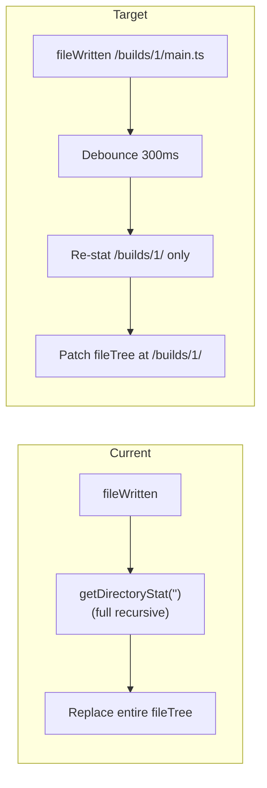

## 6. Future Access Patterns

As Tau grows, the filesystem will need to support additional patterns:

### 6.1 Multi-file CAD assemblies

CAD assemblies reference multiple part files. A top-level assembly file imports sub-assemblies and parts, forming a dependency tree. The kernel must resolve and read the entire dependency graph before compilation.

**Implications:**

- `readFiles` batch read becomes critical — assemblies may reference 50+ parts
- Dependency graph caching prevents redundant resolution
- File watching must detect changes in any part of the assembly tree

### 6.2 Collaborative editing (future)

If Tau adds real-time collaboration, the filesystem needs:

- Conflict resolution for concurrent writes to the same file
- Operation transforms or CRDTs at the file content level
- Change notification across browser tabs (BroadcastChannel)

### 6.3 Version history / undo

Project-level undo requires:

- Snapshots of file state at build/compile boundaries
- Efficient diffing (content-addressable storage)
- Rollback to previous snapshots

### 6.4 Large binary streaming

For CAD files > 10 MB, streaming reads (chunked, 256 KB buffers) would reduce peak memory. VS Code uses this pattern for its `readFileStream` / `readFileBuffered` paths.

### 6.5 Server-side persistence

When Tau adds cloud storage, the filesystem architecture must support:

- A `CloudProvider` that syncs to a remote API
- Offline-first with conflict resolution on reconnect
- Incremental sync (only changed files)
- The provider abstraction in Layer 4 is designed to accommodate this

### 6.6 Cross-tab filesystem access

Multiple browser tabs may access the same IndexedDB store. Currently each tab has its own worker and ZenFS instance. Future options:

- `SharedWorker` for a single FS worker across tabs
- `BroadcastChannel` for change notifications (VS Code's `IndexedDBFileSystemProvider` does this)
- `navigator.locks` for cross-tab write coordination

---

## Appendix A: Current State

### A.1 Current architecture diagram

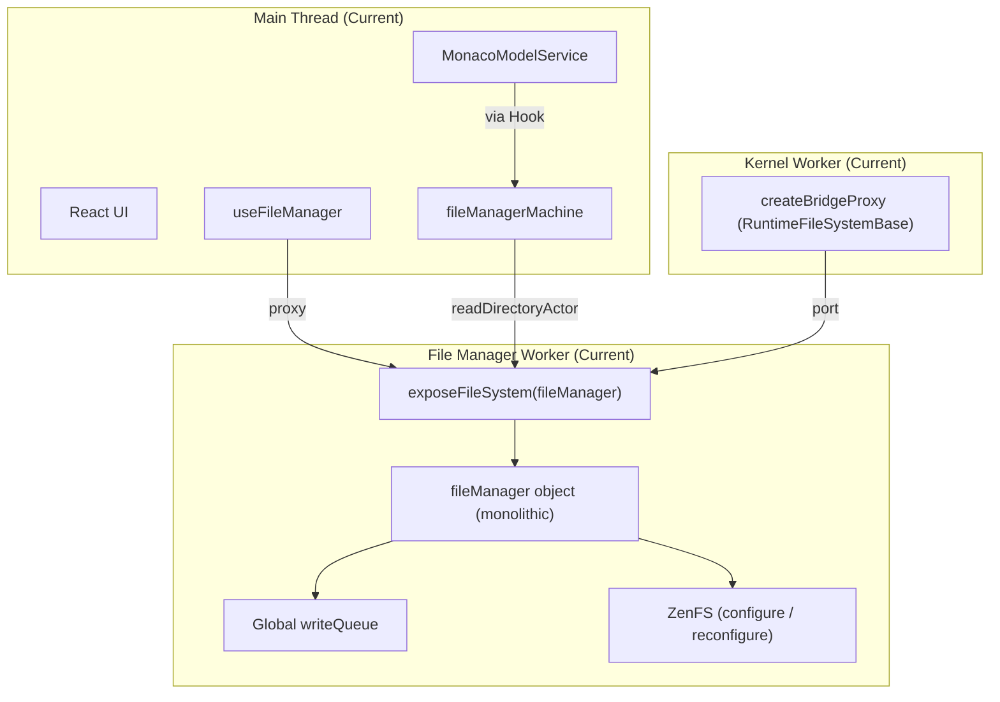

### A.2 Known issues in current state

| #   | Issue                                                  | Severity | Root cause                                |
| --- | ------------------------------------------------------ | -------- | ----------------------------------------- |
| 1   | Full recursive `getDirectoryStat` on every mutation    | P0       | No debounce, no incremental refresh       |
| 2   | `openFiles` Map grows unboundedly                      | P0       | No eviction policy                        |
| 3   | Global write serialization blocks unrelated writes     | P0       | ZenFS TOCTOU workaround is overly broad   |
| 4   | Files route does full recursive tree load              | P0       | No lazy/shallow loading                   |
| 5   | Standalone FS instances created per call, never closed | P1       | No caching in `readBackendFileTree`       |
| 6   | Duplicate `getDirectoryStat` (machine + Monaco)        | P1       | Independent traversals of same tree       |
| 7   | No debounce on background refresh                      | P1       | Every mutation triggers immediate refresh |
| 8   | Worker ports accumulate (never closed on worker side)  | P2       | No disconnect notification                |
| 9   | `handle-store` opens/closes IndexedDB per operation    | P2       | No connection pooling                     |
| 10  | `serializedQueueDepth` dead code                       | P2       | Unused counter                            |
| 11  | `ensureReady` always passes `'indexeddb'`              | P2       | Misleading but functionally correct       |

### A.3 Current consumer map

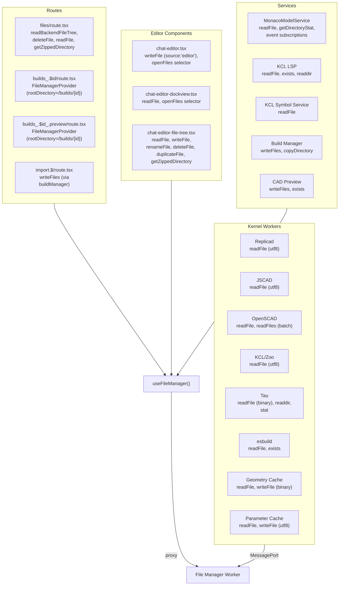

---

## Appendix B: Implementation Roadmap

Components to build in sequence, each delivering incremental value. Each phase can be independently tested and shipped.

### Phase 1: Lazy file tree loading (files route)

**Goal:** Eliminate the full recursive tree load that causes the files route to stall on large filesystems.

**Components:**

1. `readShallowDirectory` worker method — parallel stat, single-level, cached standalone FS
2. Protocol + hook wiring — add to `FileManagerProtocol`, expose in `useFileManager`
3. `Tree.onExpand` callback — useEffect diff pattern in the file tree component
4. Route rewrite — `loadedDirs` Map, `inflightRef` dedup, derived tree, `loadDirectory`/`reloadDirectory`, targeted mutation invalidation, inline loading indicators

**Depends on:** Nothing (self-contained)
**Unblocks:** Usable files route on large projects

### Phase 2: Debounced background refresh

**Goal:** Eliminate redundant full-tree traversals during rapid edits.

**Components:**

1. Debounce timer in `spawnBackgroundRefresh` — 300ms after last mutation
2. Coalescing logic — batch multiple `fileWritten`/`fileDeleted` events into one refresh
3. Optional: incremental refresh — re-stat only the parent directory of the changed file instead of the full tree

**Depends on:** Nothing (independent of Phase 1)
**Unblocks:** Smooth editing experience during AI code streaming

### Phase 3: Bounded `openFiles` cache

**Goal:** Prevent unbounded memory growth in long sessions.

**Components:**

1. LRU eviction policy — max entries (e.g., 100) and max total bytes (e.g., 50 MB)
2. Size tracking — track cumulative `Uint8Array` byte length
3. Eviction trigger — on every `fileRead`/`fileWritten` insertion, evict oldest entries over limit
4. Skip large binaries — files > 1 MB should not be cached in `openFiles`

**Depends on:** Nothing
**Unblocks:** Stable memory usage for long sessions

### Phase 4: Standalone FS instance caching

**Goal:** Stop creating new IndexedDB connections per `readShallowDirectory` / `readBackendFileTree` call.

**Components:**

1. `createStandaloneFs(backend, handle)` helper — creates or returns cached instance
2. Instance `Map<backend, FileSystem>` in the worker module scope
3. Invalidation on `reconfigure` or `setDirectoryHandle`

**Depends on:** Phase 1 (uses the same code path)
**Unblocks:** Fewer IndexedDB connections, faster shallow reads

### Phase 5: Directory tree cache in worker

**Goal:** Replace polling-based `getDirectoryStat` with an event-driven, incrementally updated directory cache.

**Components:**

1. `DirectoryTreeCache` class in the worker — in-memory tree of `{ name, type, size, mtime }`
2. Write operations invalidate affected parent directories
3. New RPC method: `getFileTree()` returns cached tree without hitting storage
4. New RPC event: `fileTreeChanged` pushes incremental updates to main thread
5. `MonacoModelService` subscribes to `fileTreeChanged` instead of calling `getDirectoryStat`

**Depends on:** Phase 2 (debounce must be in place to avoid thrashing the cache)
**Unblocks:** Eliminates duplicate `getDirectoryStat` calls, enables real-time tree updates

### Phase 6: Per-directory write serialization

**Goal:** Unlock parallel writes to different directories.

**Components:**

1. `DirectoryWriteQueue` — keyed by parent directory path
2. Operations acquire a lock on their target directory
3. `ensureDirectoryExistsInternal` acquires locks on each ancestor
4. Queue auto-cleanup when empty (VS Code `ResourceQueue` pattern)

**Depends on:** Validation that ZenFS TOCTOU only affects same-directory writes (or ZenFS fix lands)
**Unblocks:** Faster batch imports, parallel build creation

### Phase 7: Worker port lifecycle

**Goal:** Clean up accumulated ports on the worker side.

**Components:**

1. Worker tracks active ports in a `Set<MessagePort>`
2. Port `close` event or heartbeat timeout triggers cleanup
3. `exposeFileSystem` returns a disposal handle per port
4. Main thread bridge `dispose()` sends a disconnect message before closing `port2`

**Depends on:** Nothing (independent)
**Unblocks:** Reduced memory footprint over long sessions

### Phase 8: Streaming reads for large files

**Goal:** Reduce peak memory for binary CAD files > 1 MB.

**Components:**

1. `readFileStream(path)` method — returns `ReadableStream<Uint8Array>` with 256 KB chunks
2. Bridge support for streaming responses — chunked messages with sequence numbers
3. Consumer adaptation — Three.js loader, converter, ZIP operations
4. Size-based routing — files < 1 MB use `readFile`; files > 1 MB use `readFileStream`

**Depends on:** Phase 7 (clean port lifecycle for stream cleanup on disconnect)
**Unblocks:** Handling of very large CAD assemblies (100+ MB)

---

## Appendix C: Decision Log

| Decision                                 | Rationale                                                                                                                      | Alternative considered                                                                      |
| ---------------------------------------- | ------------------------------------------------------------------------------------------------------------------------------ | ------------------------------------------------------------------------------------------- |
| Single file manager worker               | Eliminates cross-worker ZenFS corruption; simple mental model                                                                  | Multiple workers with SharedArrayBuffer (complex, browser support)                          |
| MessagePort RPC over Comlink             | Lighter weight, no proxy magic, explicit transfer control                                                                      | Comlink (implicit proxy, harder to debug thenable issues)                                   |
| ZenFS over raw IndexedDB                 | Node.js `fs` API compatibility, multiple backend support                                                                       | Raw IndexedDB (faster but no path abstraction)                                              |
| Global write queue                       | Prevents ZenFS TOCTOU; simple correctness guarantee                                                                            | Per-directory queues (optimal but needs ZenFS fix first)                                    |
| Lazy tree loading                        | O(1) initial load vs O(n) full traversal                                                                                       | Virtual scrolling with eager load (still loads all data)                                    |
| Provider abstraction (target)            | Clean separation, testability, future backend extensibility                                                                    | Monolithic fileManager (current, works but rigid)                                           |
| Promise-based RPC (`await`)              | FS ops are one-shot request/response; matches VS Code `channel.call()`                                                         | Event-driven fire-and-forget (kernel pattern; adds complexity without FS benefit)           |
| ISP-narrowed proxy types                 | Kernels get 11 primitives via `RuntimeFileSystemBase`; main thread gets full `FileManagerProtocol`                             | Single shared type (exposes management ops to kernels unnecessarily)                        |
| XState for FS orchestration              | Excellent for lifecycle states (create→init→ready→error), backend coordination, and emitting events; poor for unbounded caches | Custom state machine (more code, less tooling), Redux (less structured for async workflows) |
| Extract `openFiles` from XState          | Machine context is snapshot-serialized; unbounded Maps degrade devtools and memory                                             | Keep in context (current; works but unbounded growth)                                       |
| Read-only standalone FS instances        | Safe: TOCTOU only affects concurrent writers; stale reads handled by try/catch                                                 | Always use main mount (blocks on write queue for reads)                                     |
| Extend bridge with `listen()` for events | Matches VS Code hybrid IPC; enables push-based tree updates without replacing working `call()` pattern                         | Replace all RPC with events (kernel pattern; overkill for FS)                               |
