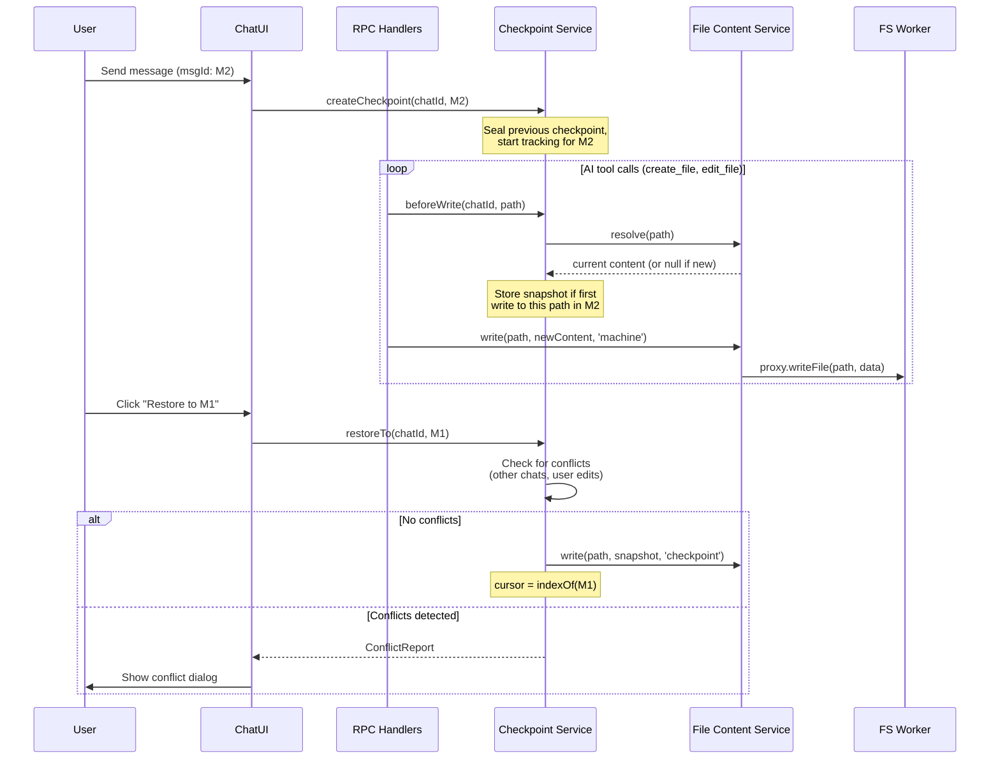
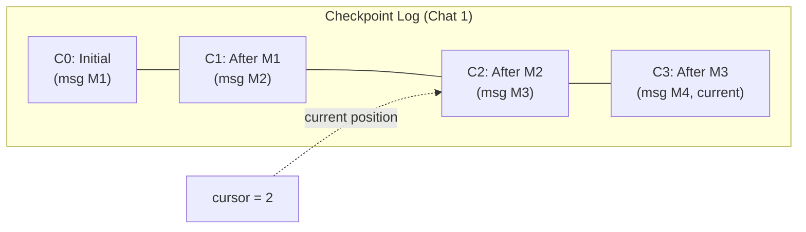

# Filesystem Checkpointing Architecture

Research into chat-scoped filesystem checkpointing: automatically tracking which files are modified between user messages in each chat session, enabling bidirectional checkpoint navigation (restore to a previous state and re-apply to move forward), and handling concurrent chats that may touch overlapping files.

## Executive Summary

Tau's AI chat currently writes files via RPC to the browser filesystem worker, but no mechanism exists to snapshot file state at chat message boundaries or to restore files to a previous point in the conversation. This investigation surveys checkpoint implementations across Cursor, CLI-style coding agents, Codex CLI, Replit, snaprevert, vibetracer, and VS Code local history, then proposes a checkpoint architecture tailored to Tau's browser-based, IndexedDB-backed filesystem. The recommended design is a **per-chat checkpoint log** storing copy-on-first-write file snapshots at each user message boundary, with a bidirectional cursor for forward/backward navigation and a conflict-aware merge strategy for concurrent chats touching the same files.

## Problem Statement

Users need to be able to:

1. **Restore files** to their state at any previous user message boundary in a chat
2. **Move forward** again from a previously restored checkpoint (undo the undo)
3. **Isolate changes per chat** — only files modified in a specific chat should be restored, not unrelated files touched by other chats or manual edits
4. **Handle concurrent chats** — two chats may modify the same file; restoring one chat's checkpoint should not silently discard the other chat's changes without warning

These requirements are driven by `docs/policy/vision-policy.md`: Tau must deliver a professional-grade editing experience where AI-assisted workflows are safely reversible.

## Methodology

- Surveyed documentation and source code for 7 checkpoint/undo systems (Cursor, CLI-style coding agents, Codex CLI, Replit, snaprevert, vibetracer, VS Code local history)
- Explored Tau's current chat-to-filesystem flow via source analysis of `rpc-handlers.ts`, `file-content-service.ts`, `FileService`, `chat-rpc.service.ts`, transcript middleware, and chat persistence
- Analyzed the mount-overlay architecture research for applicability
- Evaluated architectural patterns against Tau's constraints: browser-only runtime, IndexedDB storage, Web Worker filesystem, concurrent multi-chat sessions

## Findings

### Finding 1: Industry Approaches to File Checkpointing

| System                    | Storage                          | Granularity                     | Tracking Scope              | Bidirectional                       | Concurrent Agents                       | Open Source                 |
| ------------------------- | -------------------------------- | ------------------------------- | --------------------------- | ----------------------------------- | --------------------------------------- | --------------------------- |
| **Cursor**                | Local session (ephemeral)        | Per-agent-response              | Files changed by Agent      | Restore only (no re-apply)          | No                                      | No                          |
| **CLI coding agents**     | Session-scoped (30-day TTL)      | Per-user-prompt                 | Write/Edit tool calls only  | Restore code, conversation, or both | No (warns external changes not tracked) | SDK API only                |
| **Codex CLI**             | Git ghost commits                | Per-tool-call                   | Git-tracked files only      | /undo restores latest snapshot      | No                                      | Partially (ghost commit PR) |
| **Replit**                | Copy-on-Write block device + Git | Per-agent-task                  | Full filesystem + database  | Full rollback via manifest swap     | Parallel sampling (isolated forks)      | No                          |
| **snaprevert**            | `.snaprevert/` directory (diffs) | Per-file-change (debounced ~3s) | All file changes (chokidar) | Snapshot branching                  | AI tool detection per-agent             | Yes (npm)                   |
| **vibetracer**            | Content-addressed store + JSONL  | Per-file-edit                   | Per-agent attribution       | Per-file playheads                  | Multi-agent conflict detection          | Yes (crates.io)             |
| **VS Code Local History** | `entries.json` + snapshot files  | Per-save                        | Working copy saves only     | Restore creates new history entry   | No (single editor)                      | Yes (VS Code)               |

Key observations:

- **Copy-on-first-write** is the dominant pattern: save the original content before the first modification, not a diff. Cursor, CLI coding agents, VS Code, and Codex all use this approach.
- **Diff-based** approaches (snaprevert, vibetracer) are more space-efficient but add complexity for restoration — you need to replay diffs in order, and corruption of any intermediate diff breaks the chain.
- **Git-based** approaches (Codex, Replit) provide excellent tooling but require a git repository. Tau's browser filesystem has no git requirement.
- **Bidirectional navigation** (forward after restore) is rare. Only snaprevert explicitly preserves rolled-back snapshots for re-application. Most systems treat restore as a destructive operation.
- **Concurrent agent tracking** is only addressed by vibetracer (conflict detection within 5s window) and Replit (full isolation via forked environments). No system supports non-destructive concurrent chat restoration.

### Finding 2: Per-Prompt Tool-Call-Scoped Checkpointing Is the Most Relevant Reference Pattern

The reference pattern from production CLI coding-agent SDKs provides the closest architectural match to Tau's needs:

- **Per-user-prompt checkpoints** with UUID-based identification
- **Tool-call-scoped tracking** (only file-write tool calls — not shell/bash commands)
- **Session-persisted** checkpoints with configurable TTL
- **Restore is code-only** — conversation history is handled separately

Architectural shape:

```
Enable checkpointing → backup created before each file modification
User messages carry checkpoint UUID → serves as restore point
rewindFiles(checkpointUUID) → restores files to that checkpoint state
Created files are deleted, modified files have content restored
```

This pattern's limitation — tracking only tool-call-driven edits, not shell/external changes — maps directly to Tau's architecture where file writes via RPC carry `source: 'machine'` (AI) vs `source: 'user'` (human) vs `source: 'editor'` (editor auto-save).

### Finding 3: Tau's Current Architecture Has Natural Checkpoint Anchors

The existing architecture provides several integration points:

1. **`FileWriteSource` discrimination**: `file-content-service.ts` already tags every write with `source: 'machine' | 'user' | 'editor'`. AI writes are identifiable.

2. **Chat message boundaries**: Each user message in `Chat.messages: MyUIMessage[]` has a unique `id`. The `messageMetadataSchema` includes `createdAt` timestamps and a `snapshot` of the editor state at submission time.

3. **RPC carries `chatId` + `toolCallId`**: Every file write from the AI passes through `ChatRpcService` → `rpc-handlers.ts` with both identifiers. The `chatId` identifies which chat caused the write; the `toolCallId` identifies which specific tool call.

4. **`ChangeEventBus` emits `fileWritten` events**: Every successful write emits an event with the path and backend. This could be extended to carry checkpoint metadata.

5. **`FileContentService` is the single content authority**: All reads and writes flow through this service on the main thread. It maintains a cache and notifies subscribers. This is the natural interception point for checkpoint capture.

6. **Transcript JSONL**: `.tau/transcripts/{chatId}.jsonl` already records tool calls per chat with timestamps. This could serve as a secondary index for checkpoint metadata.

### Finding 4: The Mount-Overlay Architecture Solves a Different Problem

The `filesystem-mount-overlay-architecture.md` research proposes a `MountTable` for routing different path prefixes to different storage providers (e.g., `.tau/cache/` → MemoryProvider, `/git/` → separate IDB). This is **orthogonal** to checkpointing:

- **Mount-overlay** answers: "Where should this file be stored?" (storage routing)
- **Checkpointing** answers: "What was this file's content at a previous point in time?" (temporal versioning)

However, the mount-overlay architecture has one relevant interaction: checkpoint storage itself could be mounted at a dedicated path (e.g., `.tau/checkpoints/` → MemoryProvider for fast ephemeral snapshots, or a dedicated IDB store for persistence). This would prevent checkpoint data from inflating the project's primary storage and allow independent eviction policies.

**Verdict**: Mount-overlay is not a prerequisite for checkpointing, but could be leveraged for checkpoint storage isolation in a future iteration.

### Finding 5: Concurrent Chat Conflict Scenarios

Tau supports multiple concurrent chats per project. This creates conflict scenarios absent from all surveyed systems:

**Scenario A: Non-overlapping files**

- Chat 1 modifies `main.ts`, Chat 2 modifies `utils.ts`
- Restoring Chat 1's checkpoint only touches `main.ts` — safe, no conflict

**Scenario B: Sequential overlap**

- Chat 1 modifies `main.ts` (checkpoint C1), Chat 2 later modifies `main.ts` (checkpoint C2)
- Restoring C1 would discard Chat 2's changes — conflict

**Scenario C: Interleaved overlap**

- Chat 1 modifies `main.ts` at T1, Chat 2 modifies `main.ts` at T2, Chat 1 modifies `main.ts` again at T3
- Restoring to Chat 1's T1 checkpoint discards both T2 and T3 changes — complex conflict

**Scenario D: User edits between chat messages**

- User manually edits `main.ts` after Chat 1's changes
- Restoring Chat 1's checkpoint would discard the user's manual edits — should warn

vibetracer's approach (conflict indicators when two agents edit the same file within 5s) is informative but insufficient. Tau needs a richer conflict model that:

- Detects when restoring would discard changes from **other chats** or **manual edits**
- Presents a clear UI showing which files have conflicts
- Offers per-file restore (keep some changes, restore others)

### Finding 6: Copy-on-First-Write Is Optimal for Browser IndexedDB

For Tau's IndexedDB-backed filesystem, copy-on-first-write is the optimal checkpoint strategy:

| Approach                                        | Storage Cost                         | Restore Speed                    | Implementation Complexity        | IndexedDB Fit                   |
| ----------------------------------------------- | ------------------------------------ | -------------------------------- | -------------------------------- | ------------------------------- |
| **Copy-on-first-write** (full content snapshot) | O(modified file size) per checkpoint | O(1) per file — direct overwrite | Low                              | Excellent — single IDB put      |
| **Diff-based** (unified diffs)                  | O(diff size) — smaller               | O(n) — must replay diffs         | Medium — need diff/patch library | Poor — diff replay is CPU-heavy |
| **Git-based** (commits/refs)                    | O(pack delta) — most efficient       | O(1) via checkout                | High — need isomorphic-git       | Overkill for browser            |
| **Copy-on-Write blocks** (Replit)               | O(block granularity)                 | O(1) — manifest swap             | Very high — need block layer     | Not applicable to IDB           |

Copy-on-first-write advantages for IndexedDB:

- **Atomic restore**: Each file restore is a single `IDBObjectStore.put()` — same primitive already used by `DirectIdbProvider.writeFile()`
- **No dependency chain**: Each checkpoint is self-contained; corruption of one checkpoint doesn't affect others
- **Efficient with the Throttler**: Checkpoint writes can batch with the P1 Throttler (write batcher) for minimal IDB transaction overhead
- **Simple eviction**: Old checkpoints can be deleted without affecting newer ones (unlike diff chains)

The storage overhead is acceptable: a typical CAD project has 5–50 source files averaging 2–10 KB each. Storing full snapshots of modified files at each message boundary costs 10–500 KB per checkpoint — trivial for IndexedDB.

## Proposed Architecture

### Data Model

```typescript
type FileCheckpoint = {
  chatId: string;
  messageId: string;
  timestamp: number;
  files: Map<string, FileSnapshot>;
};

type FileSnapshot = {
  path: string;
  content: Uint8Array<ArrayBuffer> | null; // null = file did not exist (was created)
  size: number;
};

type CheckpointLog = {
  chatId: string;
  checkpoints: FileCheckpoint[];
  cursor: number; // index into checkpoints; -1 = at latest (no restore active)
};
```

Each `CheckpointLog` is per-chat. The `cursor` enables bidirectional navigation:

- **Restore backward**: Set cursor to the target checkpoint index; restore files from that checkpoint's snapshots
- **Move forward**: Increment cursor; restore files from the _next_ checkpoint's snapshots (which captured the state _before_ those changes, so re-applying means using the current-on-disk content captured at the _later_ checkpoint boundary)

### Checkpoint Lifecycle



### Copy-on-First-Write Interception

The checkpoint capture hooks into `FileContentService` (main thread, single content authority):

```typescript
// Pseudocode for the interception layer
class CheckpointService {
  private logs = new Map<string, CheckpointLog>();
  private activeSnapshots = new Map<string, Map<string, FileSnapshot>>();

  beforeWrite(chatId: string, path: string): Promise<void> {
    const active = this.activeSnapshots.get(chatId);
    if (!active || active.has(path)) return; // already captured

    // Copy-on-first-write: snapshot current content before AI modifies it
    try {
      const content = await this.fileContentService.resolve(path);
      active.set(path, { path, content: new Uint8Array(content), size: content.byteLength });
    } catch {
      // File doesn't exist yet — record as "created" (null content)
      active.set(path, { path, content: null, size: 0 });
    }
  }

  createCheckpoint(chatId: string, messageId: string): void {
    // Seal previous active snapshot set into a checkpoint
    const previous = this.activeSnapshots.get(chatId);
    if (previous && previous.size > 0) {
      const log = this.getOrCreateLog(chatId);
      log.checkpoints.push({
        chatId,
        messageId,
        timestamp: Date.now(),
        files: previous,
      });
    }
    // Start fresh tracking for the new message
    this.activeSnapshots.set(chatId, new Map());
  }
}
```

### Bidirectional Navigation

The `cursor` field on `CheckpointLog` enables forward/backward movement:



- **At head** (cursor = -1): Normal state. User sees latest files. Restore button is available on each message.
- **Restore to C1** (cursor = 1): Files from C2's snapshots are restored (they captured state before M2's changes). C2 and C3 snapshots are preserved — not deleted.
- **Move forward to C2** (cursor = 2): Files from C3's snapshots _before_ state are written, then the actual C2 changes are replayed. Alternatively, a simpler model: each checkpoint also stores the "after" state, so moving forward writes the "after" content.
- **Move to head** (cursor = -1): Restore all files to their content as captured in the latest checkpoint's "after" state.

The simpler model: store both `before` and `after` content per file per checkpoint. This doubles storage but makes forward navigation trivial — no need to "replay" changes.

```typescript
type FileSnapshot = {
  path: string;
  before: Uint8Array<ArrayBuffer> | null; // content before AI modified it
  after: Uint8Array<ArrayBuffer> | null; // content after AI finished modifying it
};
```

### Conflict Detection for Concurrent Chats

When restoring Chat 1 to checkpoint C1, the service must check whether any files in C1's snapshot set have been modified by:

1. **Another chat** since C1's timestamp
2. **The user** (manual edits) since C1's timestamp
3. **The same chat** at a later checkpoint (already handled by bidirectional cursor)

Detection algorithm:

```typescript
type ConflictReport = {
  safe: FileSnapshot[]; // can restore without conflict
  conflicts: FileConflict[]; // need user decision
};

type FileConflict = {
  path: string;
  snapshotContent: Uint8Array<ArrayBuffer> | null;
  currentContent: Uint8Array<ArrayBuffer> | null;
  modifiedBy: ConflictSource[];
};

type ConflictSource =
  | { type: 'chat'; chatId: string; chatName: string; messageId: string }
  | { type: 'user'; timestamp: number };
```

To detect conflicts:

1. For each file in the target checkpoint, read the current on-disk content
2. Compare with the checkpoint's `after` content (what the file looked like when this checkpoint was sealed)
3. If they differ, the file was modified after this checkpoint — scan other checkpoint logs and `FileContentService` write events to identify the source
4. Present the conflict report to the user with per-file restore options

### Storage and Persistence

Checkpoint data should be stored in IndexedDB alongside chat data, not in the project filesystem:

| Storage Location                             | Pros                                                                 | Cons                                             |
| -------------------------------------------- | -------------------------------------------------------------------- | ------------------------------------------------ |
| **IndexedDB (separate store)**               | Fast binary storage, same DB as project files, survives page refresh | Requires cleanup/eviction                        |
| **Project filesystem (`.tau/checkpoints/`)** | Visible in file tree, portable                                       | Pollutes project FS, slower for binary snapshots |
| **In-memory only**                           | Fastest, simplest                                                    | Lost on page refresh (Cursor's limitation)       |

**Recommendation**: IndexedDB with a dedicated object store (`checkpoints`), keyed by `chatId`. Each entry stores the serialized `CheckpointLog`. This provides:

- Persistence across page refreshes (unlike Cursor)
- Fast binary access for file snapshots
- Independent eviction from project files
- Natural key space separation from file storage

Eviction policy: Delete checkpoint logs when the associated chat is deleted. Configurable max-age (default 7 days) for completed chats.

### Integration Points in Tau

| Component                                 | Change Required                                                                                            |
| ----------------------------------------- | ---------------------------------------------------------------------------------------------------------- |
| `FileContentService`                      | Add `beforeWrite` hook for checkpoint interception; new `FileWriteSource: 'checkpoint'` for restore writes |
| `rpc-handlers.ts`                         | Call `checkpointService.beforeWrite(chatId, path)` before `fileManager.writeFile()`                        |
| `use-chat.tsx` / `chatPersistenceMachine` | Call `checkpointService.createCheckpoint(chatId, messageId)` when user sends a message                     |
| `chat-message.tsx`                        | Add "Restore Checkpoint" button on each user/assistant message                                             |
| `chat-history.tsx` or new component       | Add checkpoint timeline UI showing which files changed per message                                         |
| `indexeddb-storage.ts`                    | Add `checkpoints` object store for checkpoint log persistence                                              |
| `Chat` type                               | Optional: Add `checkpointCursor` to track current position (or keep in CheckpointService state)            |
| `ChangeEventBus` / `ChangeEvent`          | Optional: Extend to carry `chatId` and `source` for richer conflict detection                              |

## Recommendations

| #   | Action                                                                                         | Priority | Effort | Impact                                                                |
| --- | ---------------------------------------------------------------------------------------------- | -------- | ------ | --------------------------------------------------------------------- |
| R1  | Implement `CheckpointService` with copy-on-first-write capture and per-chat `CheckpointLog`    | P0       | Medium | High — core checkpoint capability                                     |
| R2  | Hook `beforeWrite` into `rpc-handlers.ts` to capture snapshots before AI file writes           | P0       | Low    | High — enables R1 without changing FileService internals              |
| R3  | Add `createCheckpoint` call to chat message submission flow (`use-chat.tsx`)                   | P0       | Low    | High — creates checkpoint boundaries at message transitions           |
| R4  | Implement restore-backward with single-chat conflict detection                                 | P0       | Medium | High — primary user-facing feature                                    |
| R5  | Add "Restore Checkpoint" UI button per message with file diff preview                          | P1       | Medium | High — user experience                                                |
| R6  | Implement forward navigation (re-apply after restore) with cursor model                        | P1       | Medium | Medium — bidirectional undo                                           |
| R7  | Add multi-chat conflict detection and resolution UI                                            | P1       | High   | High — correctness for concurrent chats                               |
| R8  | Persist checkpoint logs to IndexedDB `checkpoints` store                                       | P1       | Low    | Medium — survive page refresh                                         |
| R9  | Add eviction policy (max-age, on-chat-delete) for checkpoint storage                           | P2       | Low    | Low — storage hygiene                                                 |
| R10 | Extend `ChangeEvent` to carry `chatId` + `source` for automated conflict detection             | P2       | Medium | Medium — enables R7 without scanning logs                             |
| R11 | Consider mount-overlay for checkpoint storage isolation (`.tau/checkpoints/` → MemoryProvider) | P3       | Low    | Low — performance optimization if checkpoint I/O becomes a bottleneck |

## Trade-offs

### Full Snapshot vs Diff Storage

| Dimension          | Full Snapshot                     | Diff-Based                                                  |
| ------------------ | --------------------------------- | ----------------------------------------------------------- |
| **Storage**        | Larger (full file per checkpoint) | Smaller (only changed lines)                                |
| **Restore speed**  | O(1) — direct write               | O(n) — replay patch chain                                   |
| **Reliability**    | Each checkpoint independent       | Chain corruption breaks later checkpoints                   |
| **Implementation** | Simple (`IDB.put()`)              | Complex (need diff/patch library, e.g., `diff-match-patch`) |
| **IndexedDB fit**  | Natural (binary blob storage)     | Awkward (text diffs on binary-capable store)                |

**Verdict**: Full snapshot. Storage cost is negligible for typical CAD projects (5–50 files, 2–10 KB each). Reliability and simplicity outweigh storage savings.

### Before-Only vs Before+After Snapshots

| Dimension              | Before-Only                                               | Before+After                                                    |
| ---------------------- | --------------------------------------------------------- | --------------------------------------------------------------- |
| **Storage**            | 1x per modified file per checkpoint                       | 2x per modified file per checkpoint                             |
| **Backward restore**   | Direct — write `before` content                           | Direct — write `before` content                                 |
| **Forward restore**    | Must read from next checkpoint's `before` or re-read disk | Direct — write `after` content                                  |
| **Conflict detection** | Compare disk vs `before` only                             | Compare disk vs `after` — detects post-checkpoint modifications |

**Verdict**: Before+After. The 2x storage is still negligible (20–1000 KB per checkpoint for typical projects), and it dramatically simplifies forward navigation and conflict detection.

### Checkpoint Per Message vs Per Tool Call

| Dimension             | Per Message                                  | Per Tool Call                                  |
| --------------------- | -------------------------------------------- | ---------------------------------------------- |
| **Granularity**       | Coarse — one restore point per user prompt   | Fine — one restore point per file modification |
| **UI complexity**     | Simple — one restore button per message      | Complex — timeline within each message         |
| **User mental model** | "Undo what the AI did after my last message" | "Undo this specific edit"                      |
| **Storage**           | Lower — fewer checkpoints                    | Higher — more checkpoints                      |

**Verdict**: Per message (matching the dominant reference pattern from F2 and Cursor). Per-tool-call granularity can be added later as a refinement. The per-message model aligns with the user's mental model of chat interaction.

## References

- [Cursor Checkpoints Documentation](https://docs.cursor.com/agent/chat/checkpoints)
- [OpenAI Codex Ghost Commit PR #4608](https://github.com/openai/codex/pull/4608)
- [Replit Snapshot Engine Blog Post](https://blog.replit.com/inside-replits-snapshot-engine)
- [snaprevert: AI Coding Checkpoint Tool](https://www.npmjs.com/package/snaprevert)
- [vibetracer: Multi-Agent Edit Tracking](https://github.com/omeedcs/vibetracer)
- VS Code Local History: `repos/vscode/src/vs/workbench/services/workingCopy/common/workingCopyHistoryTracker.ts`
- VS Code `ResourceQueue`: `repos/vscode/src/vs/base/common/async.ts`
- Tau Filesystem Architecture: `docs/research/filesystem-architecture.md`
- Tau Mount-Overlay Architecture: `docs/research/filesystem-mount-overlay-architecture.md`
