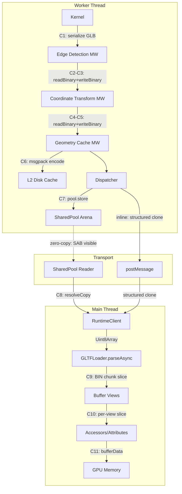
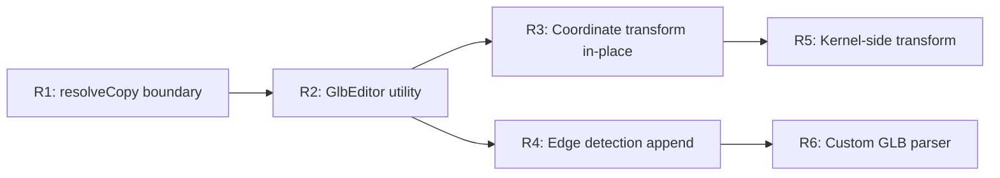

# Geometry Pipeline Copy Audit

Comprehensive catalog of every data copy in the geometry rendering pipeline, from kernel production through middleware, transport, resolution, UI parsing, and GPU upload. Identifies pathways toward full zero-copy middleware and rendering.

## Executive Summary

A deep audit of the geometry pipeline reveals **14 distinct copy points** between kernel output and GPU upload. Of these, 5 are fundamental (kernel serialization, GPU upload), 4 are library-imposed (`@gltf-transform/core` reader/writer, Three.js `GLTFLoader` buffer view slicing), 3 are defensive (msgpack decode, converter normalization, RPC copy), and 2 are architectural (middleware readBinary/writeBinary roundtrips). The two middleware roundtrips are the largest avoidable copies — each performs a full GLB deserialize-transform-reserialize cycle. Moving to direct binary mutation on the GLB BIN chunk would eliminate 2 full-size copies per geometry per render. Three.js `GLTFLoader` performs 2 copies (BIN chunk slice, per-bufferView slice) that are fundamental to its architecture. The `@gltf-transform/core` library copies all accessor data during `readBinary` (acknowledged upstream as a future optimization target, issue #256) and fully re-layouts binary data during `writeBinary`. The recommended strategy is a phased approach: (1) encapsulate the SAB resolution copy inside `RuntimeClient` using `resolveCopy()`, (2) replace middleware `readBinary`/`writeBinary` with direct GLB binary mutation, and (3) evaluate bypassing `GLTFLoader` entirely with a custom zero-copy GLB-to-BufferGeometry parser for the hot rendering path.

## Table of Contents

- [Methodology](#methodology)
- [Pipeline Architecture](#pipeline-architecture)
- [Copy Catalog](#copy-catalog)
- [Library Internals: @gltf-transform/core](#library-internals-gltf-transformcore)
- [Library Internals: Three.js GLTFLoader](#library-internals-threejs-gltfloader)
- [Middleware Copy Analysis](#middleware-copy-analysis)
- [Pathways to Zero-Copy](#pathways-to-zero-copy)
- [Recommendations](#recommendations)
- [Trade-offs](#trade-offs)
- [References](#references)

## Methodology

1. Traced every byte-level copy from kernel geometry production to GPU `bufferData` upload
2. Explored `@gltf-transform/core` source via `repos/glTF-Transform/` — reader, writer, transforms, accessor internals
3. Explored Three.js `GLTFLoader` via `node_modules/three/`
4. Audited all middleware, dispatcher, client resolution, and UI consumer code
5. Classified each copy by size, avoidability, and root cause

## Pipeline Architecture



## Copy Catalog

### Tier 1: Fundamental (unavoidable)

Copies inherent to the domain — serialization from kernel data structures to GLB, and upload to GPU memory.

| ID  | Location                                             | What                                          | Size  | Why unavoidable                                                                                    |
| --- | ---------------------------------------------------- | --------------------------------------------- | ----- | -------------------------------------------------------------------------------------------------- |
| C1  | `packages/runtime/src/utils/glb-writer.ts` (244-402) | Kernel typed arrays assembled into GLB binary | Large | Serialization from mesh data structures to GLB binary format requires building a contiguous buffer |
| C11 | Three.js `WebGLAttributes.createBuffer`              | `gl.bufferData(array)` — JS heap to GPU       | Large | WebGL API fundamentally copies data to GPU-owned memory                                            |

### Tier 2: Library-imposed (requires library changes or bypass)

Copies performed inside `@gltf-transform/core` and Three.js `GLTFLoader` due to their internal architecture.

| ID  | Location                                          | What                                                                | Size   | Root cause                                                                                                                                             |
| --- | ------------------------------------------------- | ------------------------------------------------------------------- | ------ | ------------------------------------------------------------------------------------------------------------------------------------------------------ |
| C2a | `@gltf-transform/core` `reader.ts` (660)          | `bufferView.buffer.slice()` for every accessor                      | Large  | Reader copies all accessor data out of BIN chunk into independent typed arrays ([issue #256](https://github.com/donmccurdy/glTF-Transform/issues/256)) |
| C2b | `@gltf-transform/core` `reader.ts` (583-634)      | Interleaved accessor unpacking via `DataView` reads into new arrays | Large  | De-interleaving requires new dense typed arrays                                                                                                        |
| C5a | `@gltf-transform/core` `writer.ts` (120-131, 573) | `BufferUtils.concat` and buffer layout rebuild                      | Large  | Writer fully re-serializes all accessor arrays into new binary layout                                                                                  |
| C5b | `@gltf-transform/core` `platform-io.ts` (180-195) | GLB assembly: JSON encode + BIN concat                              | Large  | Final GLB must be a single contiguous buffer                                                                                                           |
| C9  | `GLTFLoader.js` `GLTFBinaryExtension` (1980)      | `this.body = data.slice(binOffset, binOffset + binLength)`          | Large  | BIN chunk extracted as independent ArrayBuffer                                                                                                         |
| C10 | `GLTFLoader.js` `loadBufferView` (3153-3156)      | `buffer.slice(byteOffset, byteOffset + byteLength)` per buffer view | Medium | Each buffer view becomes its own ArrayBuffer slice                                                                                                     |

### Tier 3: Middleware roundtrip (avoidable with architectural changes)

Full `readBinary` + transform + `writeBinary` cycles in middleware, each performing Tier 2 copies internally.

| ID    | Location                                           | What                                                           | Size                        | Avoidable?                                                                              |
| ----- | -------------------------------------------------- | -------------------------------------------------------------- | --------------------------- | --------------------------------------------------------------------------------------- |
| C2+C5 | `gltf-edge-detection.middleware.ts` (150, 162)     | Full `readBinary` → add edge primitives → `writeBinary`        | Large (full GLB round-trip) | Yes — edge data is additive; can append to BIN chunk directly                           |
| C4+C5 | `gltf-coordinate-transform.middleware.ts` (16, 20) | Full `readBinary` → coordinate/scale transform → `writeBinary` | Large (full GLB round-trip) | Yes — coordinate transform is a linear operation on position/normal floats in BIN chunk |

### Tier 4: Defensive/normalization (avoidable)

Copies made for safety, format normalization, or API compatibility.

| ID  | Location                                                                    | What                                                                        | Size  | Avoidable?                                                                                      |
| --- | --------------------------------------------------------------------------- | --------------------------------------------------------------------------- | ----- | ----------------------------------------------------------------------------------------------- |
| C6  | `geometry-cache.middleware.ts` (59)                                         | `msgpackEncode(entry)` for L2 disk cache                                    | Large | Only on cache miss (write path); unavoidable for disk persistence                               |
| C6b | `geometry-cache.middleware.ts` (89)                                         | `new Uint8Array(geometry.content)` after msgpack decode                     | Large | Necessary — msgpack may return views into shared decode buffer                                  |
| C7  | `runtime-worker-dispatcher.ts` `toTransportGeometry` via `SharedPool.store` | `target.set(data)` copies into SAB arena                                    | Large | Framework-level pool population; the copy IS the write to shared memory                         |
| C8  | `runtime-client.ts`                                                         | `geometryPool.resolve()` returns SAB view; consumers need standalone buffer | Large | **Encapsulate in RuntimeClient via `resolveCopy()`** (public reader: **`client.geometryPool`**) |
| C12 | `packages/converter/src/export.ts` (56)                                     | `new Uint8Array(glbData)` before exporter                                   | Large | Ensures ArrayBuffer backing; avoidable if exporters accepted SAB                                |
| C13 | `apps/ui/app/hooks/rpc-handlers.ts` (239)                                   | `new Uint8Array(geometry.content)` for RPC                                  | Large | Avoidable with transfer semantics                                                               |

### Full copy count per render (typical cache-miss path)

| Stage                                             | Copies    | Cumulative data moved |
| ------------------------------------------------- | --------- | --------------------- |
| Kernel GLB serialization (C1)                     | 1         | 1x GLB                |
| Edge detection middleware (C2a+C5a+C5b)           | 3         | 4x GLB                |
| Coordinate transform middleware (C2a+C5a+C5b)     | 3         | 7x GLB                |
| Cache write: msgpack + pool store (C6+C7)         | 2         | 9x GLB                |
| Transport (pooled: 0, inline: 1 structured clone) | 0-1       | 9-10x GLB             |
| RuntimeClient resolution (C8)                     | 1         | 10-11x GLB            |
| GLTFLoader parse (C9+C10)                         | 2         | 12-13x GLB            |
| GPU upload (C11)                                  | 1         | 13-14x GLB            |
| **Total**                                         | **13-14** | **13-14x GLB size**   |

For a 5 MB GLB, this is ~65-70 MB of data movement per render on a cache miss.

### Cache-hit path (reduced)

| Stage                         | Copies |
| ----------------------------- | ------ |
| Pool store (already stored)   | 0      |
| Transport (pooled key only)   | 0      |
| RuntimeClient `resolveCopy()` | 1      |
| GLTFLoader parse (C9+C10)     | 2      |
| GPU upload (C11)              | 1      |
| **Total**                     | **4**  |

## Library Internals: @gltf-transform/core

### Reader (`readBinary` path)

Source: `repos/glTF-Transform/packages/core/src/io/reader.ts`, `platform-io.ts`

1. **GLB parsing** (`_binaryToJSON`): Reads JSON chunk via `BufferUtils.decodeText(BufferUtils.toView(...))` — the BIN chunk is kept as a **view** into the original GLB (`toView` creates a `Uint8Array` sharing the same `ArrayBuffer`). No copy at this stage.

2. **Accessor materialization** (`getAccessorArray`, reader.ts 640-661): **Every accessor copies** its data out of the BIN buffer view:

```typescript
// reader.ts:658-660 — the critical copy
return new TypedArray(bufferView.buffer.slice(byteOffset, byteOffset + byteLength));
```

The upstream comment explicitly acknowledges this: _"Might optimize this to avoid deep copy later, but it's useful for now and not a known bottleneck. See https://github.com/donmccurdy/glTF-Transform/issues/256."_

3. **Image data** (reader.ts 178): `bufferData.slice(byteOffset, byteOffset + byteLength)` — copies image binary out of BIN chunk.

### Writer (`writeBinary` path)

Source: `repos/glTF-Transform/packages/core/src/io/writer.ts`, `platform-io.ts`

The writer **fully rebuilds** the binary layout from scratch:

1. Groups accessors by buffer/usage/parent mesh
2. `concatAccessors` / `interleaveAccessors` creates new packed binary segments via `BufferUtils.concat` (allocates new `Uint8Array`, copies each accessor's typed array via `.set()`)
3. JSON chunk: `TextEncoder.encode(JSON.stringify(json))` — new allocation
4. Final GLB: `BufferUtils.concat([header, jsonChunk, binChunk])` — single contiguous buffer, all parts copied

There is **no incremental write, append, or delta mode**. Output is always a complete re-serialization.

### Transform functions

Source: `repos/glTF-Transform/packages/functions/src/transform-primitive.ts`, `transform-mesh.ts`, `compact-primitive.ts`

**`transformMesh`** always calls `compactPrimitive` first, which:

- Allocates **new** index arrays (`createIndicesEmpty`)
- Allocates **new** attribute arrays (`new (srcArray.constructor)(dstVertexCount * elementSize)`)
- Copies vertex data into the new arrays via element-wise remap

**`transformPrimitive`** then operates on these new arrays:

- **POSITION** (float): mutates the accessor's array **in place** (`dstArray === srcArray` when componentType is FLOAT)
- **NORMAL**: mutates in place
- **TANGENT**: mutates in place

The compaction step is the bottleneck — it creates full copies of every attribute even when no vertex reindexing is needed. `transformPrimitive` alone operates in-place for float data.

### Key finding: `Accessor.getArray()` and `setArray()`

- `getArray()` returns a **reference** to the internal typed array — no copy
- `setArray(array)` stores the **reference** — no copy
- The Document model supports zero-copy manipulation of accessor data **if you can avoid `readBinary`** (which copies) and `writeBinary` (which re-serializes)

## Library Internals: Three.js GLTFLoader

Source: `node_modules/three/examples/jsm/loaders/GLTFLoader.js`

### Parse pipeline

1. **Input**: `parseAsync(arrayBuffer, '')` — no copy, same reference passed in
2. **GLB magic/header**: `new Uint8Array(data, 0, 4)` — view (4 bytes, negligible)
3. **JSON chunk**: `TextDecoder.decode(contentArray)` → `JSON.parse(jsonText)` — string + object allocation (small relative to BIN)
4. **BIN chunk**: `this.body = data.slice(byteOffset, byteOffset + chunkLength)` — **full copy of BIN chunk** into new `ArrayBuffer` (C9)
5. **Buffer views**: `buffer.slice(byteOffset, byteOffset + byteLength)` — **per-view copy** into independent `ArrayBuffer` (C10)
6. **Accessors (non-interleaved)**: `new TypedArray(bufferView, byteOffset, count * itemSize)` — **view** into the buffer-view `ArrayBuffer` (no additional copy)
7. **Accessors (interleaved)**: Same typed array view, wrapped in `InterleavedBuffer`/`InterleavedBufferAttribute` — **view**
8. **Sparse accessors**: `bufferAttribute.array.slice()` — **copy** before applying sparse overrides
9. **`BufferAttribute`**: stores typed array by **reference**
10. **`BufferGeometry.setAttribute`**: stores attribute by **reference**

### GPU upload

`WebGLAttributes.createBuffer`: `gl.bufferData(bufferType, array, usage)` — copies from JS `TypedArray` to GPU. CPU-side arrays are **retained** by Three.js after upload (for potential `bufferSubData` updates).

### SAB patch (removed)

A `patches/three.patch` previously added `_toDecodable()` and `SharedArrayBuffer` acceptance to `GLTFLoader`. This patch was removed after R1 encapsulated SAB resolution inside `RuntimeClient` via `resolveCopy()` — consumers (including `GLTFLoader`) now always receive `Uint8Array<ArrayBuffer>`, so SAB-awareness in Three.js is no longer needed.

## Middleware Copy Analysis

### Current state: readBinary/writeBinary roundtrip

Both middleware modules follow the same pattern:

```
geometry.content (Uint8Array)
  → io.readBinary()        [C2a: copies all accessor data from BIN]
  → document.transform()   [operates on copied accessor arrays]
  → io.writeBinary()       [C5a+C5b: rebuilds entire binary from scratch]
  → new geometry.content    [completely new GLB buffer]
```

For a 5 MB GLB with 3 mesh primitives (positions, normals, indices each), `readBinary` alone performs **9 `ArrayBuffer.slice` calls** (3 primitives x 3 attributes) plus the initial BIN-to-accessor copies. `writeBinary` then concatenates everything back.

### Coordinate transform middleware

**What it actually does**: Multiplies every POSITION float by a rotation matrix, multiplies every NORMAL float by the inverse-transpose normal matrix. Both are element-wise linear transformations on `Float32Array` data.

**What it needs**: Read access to position/normal floats in the BIN chunk. Write access to the same floats in place. JSON chunk is unchanged (no new bufferViews, accessors, or materials).

**Minimum viable operation**: Parse the GLB header (12 bytes) and JSON chunk to locate position/normal bufferView byte ranges. Apply the matrix transformation directly on the `Float32Array` data within the BIN chunk. No re-serialization needed.

### Edge detection middleware

**What it actually does**: Reads position/index data from existing triangle primitives, runs edge detection to produce new `Float32Array`/`Uint32Array` line geometry, adds new LINES primitives.

**What it needs**: Read access to position/index data in BIN chunk. Ability to **append** new bufferViews, accessors, primitives, and materials to the JSON chunk, and append new binary data to the BIN chunk.

**Minimum viable operation**: Parse JSON chunk to locate position/index bufferView ranges. Read positions/indices as typed array views into BIN. Run edge detection (produces new arrays). Build new JSON entries for the added primitives, accessors, bufferViews, materials, and extension. Construct a new GLB with the original BIN data plus appended edge data. The original BIN data is included via `Uint8Array` view (not copied), only the new edge data is newly allocated.

## Pathways to Zero-Copy

### Path 1: Direct GLB binary mutation (middleware)

Replace `readBinary`/`writeBinary` with direct GLB binary parsing and manipulation.

**GLB binary layout** (spec-compliant, non-interleaved as produced by `glb-writer.ts`):

```
[12-byte header] [JSON chunk header + JSON data + padding] [BIN chunk header + BIN data + padding]
```

The JSON chunk contains the `bufferViews` array with `byteOffset` and `byteLength` for each attribute. By parsing only the JSON chunk (small, <5KB typically), middleware can locate any attribute's bytes within the BIN chunk.

**Coordinate transform**: Zero-copy feasible.

1. Parse 12-byte GLB header to get JSON chunk length
2. Parse JSON chunk (~2-5KB) to get bufferView offsets for POSITION/NORMAL attributes
3. Create `Float32Array` views directly into the BIN chunk bytes
4. Transform positions/normals in place (mutate the existing buffer)
5. Return the same `Uint8Array` — no re-serialization

**Edge detection**: Near-zero-copy feasible.

1. Parse JSON chunk for position/index bufferView ranges
2. Create typed array views into BIN for reading (no copy)
3. Run edge detection (allocates new edge arrays — unavoidable, this is new data)
4. Build updated JSON with additional bufferViews/accessors/primitives/materials
5. Construct new GLB: `[header][new JSON chunk][original BIN view + appended edge data]`
6. The original BIN data is included via `Uint8Array.set(originalBinView)` — one copy of original BIN, plus the new edge data. Net: 1 copy instead of 3+ copies

**Implementation**: A lightweight `GlbEditor` utility:

```typescript
type GlbParsed = {
  json: GltfJson;
  binView: Uint8Array; // view into original GLB (not a copy)
  binOffset: number; // byte offset of BIN data within original GLB
};

function parseGlbStructure(glb: Uint8Array): GlbParsed;
function writeGlbFromParts(json: GltfJson, binChunks: Uint8Array[]): Uint8Array;
```

### Path 2: RuntimeClient resolution boundary (consumer side)

Change `resolveGeometry` to use `geometryPool.resolveCopy()` instead of `geometryPool.resolve()`:

```typescript
// Current:
const view = geometryPool?.resolve(content.key);
return { format: 'gltf', content: view, hash };

// Proposed:
const copy = geometryPool?.resolveCopy(content.key);
return { format: 'gltf', content: copy, hash };
```

(`geometryPool` is the internal handle; the public `RuntimeClient` surface is **`client.geometryPool`** — there is no `client.pools` map.) This eliminates the `toParseBuffer()` utility and all 6+ per-consumer SAB/offset guards. Single copy at the resolution boundary (~2ms for 10MB). The transport-level zero-copy benefit (no `postMessage` data copy) is fully preserved.

### Path 3: Custom zero-copy GLB parser (future, highest impact)

Replace `GLTFLoader.parseAsync` with a custom parser that:

1. Parses the JSON chunk for buffer view metadata
2. Creates `TypedArray` views directly into the input buffer (no `buffer.slice`)
3. Constructs `BufferGeometry`/`BufferAttribute` objects from these views
4. Passes directly to `gl.bufferData` for GPU upload

This eliminates C9 (BIN chunk copy) and C10 (per-buffer-view copy). Combined with Path 1, the entire pipeline from kernel to GPU would have only 3 unavoidable copies: kernel serialization (C1), consumer resolution (C8 — `resolveCopy`), and GPU upload (C11).

**Complexity**: High. Must handle all glTF features used by Tau (multi-primitive meshes, line primitives, materials, extensions). Testing burden is significant. Only justified if rendering latency becomes a bottleneck.

### Path 4: Kernel-side coordinate system (eliminate transform middleware)

Have kernels produce geometry in the UI coordinate system (Z-up, millimeters) directly, eliminating the coordinate transform middleware entirely. This saves 1 full `readBinary`/`writeBinary` roundtrip.

**Trade-off**: Violates the glTF spec (which mandates Y-up, meters). Exports would need reverse transformation. The clean middleware separation (kernel produces spec-compliant output, middleware adapts for UI) would be lost.

**Alternative**: Apply the coordinate transform in the kernel's `glb-writer.ts` before serialization, transforming positions/normals as they are written. This moves the transform to the serialization stage where data is already being processed element-wise, adding zero additional copies.

## Recommendations

| #   | Action                                                                                                                               | Priority | Effort | Impact                                                       | Copy reduction                                                                                                                                      |
| --- | ------------------------------------------------------------------------------------------------------------------------------------ | -------- | ------ | ------------------------------------------------------------ | --------------------------------------------------------------------------------------------------------------------------------------------------- |
| R1  | ~~Encapsulate SAB resolution in RuntimeClient via `resolveCopy()`, remove per-consumer SAB guards~~                                  | P0       | Low    | High (API cleanliness)                                       | **RESOLVED** — `resolveGeometry` uses `resolveCopy()`, `GeometryGltf.content` tightened to `Uint8Array<ArrayBuffer>`, 7 consumer SAB guards removed |
| R2  | Build `GlbEditor` utility for direct GLB binary mutation                                                                             | P1       | Medium | High                                                         | Saves 6 copies per render (2 middleware x 3 copies each)                                                                                            |
| R3  | Replace coordinate transform middleware with in-place `GlbEditor` mutation                                                           | P1       | Medium | High                                                         | Saves 3 copies: readBinary + writeBinary eliminated                                                                                                 |
| R4  | Replace edge detection middleware with `GlbEditor` append-based approach                                                             | P1       | Medium | High                                                         | Saves 2-3 copies: only original BIN view copy + new edge allocation                                                                                 |
| R5  | Move coordinate transform to kernel `glb-writer.ts` (alternative to R3)                                                              | P2       | Low    | High                                                         | Eliminates middleware entirely, 0 additional copies                                                                                                 |
| R6  | Custom zero-copy GLB-to-BufferGeometry parser (replace GLTFLoader for hot path)                                                      | P3       | High   | Medium                                                       | Saves 2 copies (BIN slice + buffer view slices)                                                                                                     |
| R7  | Contribute zero-copy accessor read to `@gltf-transform/core` ([issue #256](https://github.com/donmccurdy/glTF-Transform/issues/256)) | P3       | High   | Low (only benefits cold paths that still use gltf-transform) | Upstream improvement                                                                                                                                |

### Recommended implementation order



**Phase 1 (R1)**: COMPLETE. `resolveGeometry` uses `resolveCopy()`, `GeometryGltf.content` tightened to `Uint8Array<ArrayBuffer>`, 7 consumer SAB guards removed.

**Phase 2 (R2+R3+R4)**: Build the `GlbEditor` utility and migrate both middleware. This is the highest-ROI work — eliminates 6 copies per render on the hot path. The `GlbEditor` is a pure utility with no dependency on `@gltf-transform/core`.

**Phase 3 (R5, R6)**: Future optimizations. R5 is low-effort but changes the architectural contract. R6 is high-effort and only justified by profiling data showing rendering latency is bottlenecked by GLTFLoader parse time.

## Trade-offs

| Approach                          | Copies saved                | Effort          | Risk                                                             |
| --------------------------------- | --------------------------- | --------------- | ---------------------------------------------------------------- |
| `resolveCopy()` at RuntimeClient  | 0 net (moves copy location) | Trivial         | None — cleaner API                                               |
| Direct GLB mutation (GlbEditor)   | 6 per render                | Medium          | Must handle all GLB layouts Tau produces; test coverage critical |
| Kernel-side coordinate transform  | 3 per render                | Low             | Breaks spec compliance; exports need reverse transform           |
| Custom GLB parser                 | 2 per render                | High            | Must replicate GLTFLoader features; large test surface           |
| Upstream gltf-transform zero-copy | 3 per gltf-transform usage  | High (external) | Depends on upstream acceptance                                   |

### GlbEditor safety constraints

Direct binary mutation requires strict invariants:

- Only mutate data within existing bufferView byte ranges (never grow/shrink attribute data in place)
- When appending data (edge detection), always rebuild the GLB from parts rather than modifying the original buffer
- JSON chunk size may change (new entries added) — the entire GLB must be reconstructed with new offsets
- All mutations must preserve 4-byte alignment per the glTF spec

### gltf-transform dependency retention

Even with `GlbEditor` for the hot middleware path, `@gltf-transform/core` remains valuable for:

- Export pipeline (format conversion, STEP/glTF/etc.)
- Complex document manipulations (welding, optimization, compression)
- Offline tooling and analysis
- Any operation where the Document model's graph semantics are needed

The `GlbEditor` is specifically for the **hot rendering path** where performance matters most.

## References

- [glTF-Transform issue #256](https://github.com/donmccurdy/glTF-Transform/issues/256) — upstream accessor copy avoidance
- `repos/glTF-Transform/packages/core/src/io/reader.ts` — reader copy sites
- `repos/glTF-Transform/packages/core/src/io/writer.ts` — writer re-serialization
- `repos/glTF-Transform/packages/functions/src/compact-primitive.ts` — compaction copies
- `repos/glTF-Transform/packages/functions/src/transform-primitive.ts` — in-place float transforms
- Related: `docs/research/shared-memory-geometry-pipeline.md` — SAB architecture
- Related: `docs/research/geometry-data-transfer-architecture.md` — transfer vs clone analysis
- Related: `docs/research/filesystem-memory-outstanding-items.md` — outstanding items backlog
