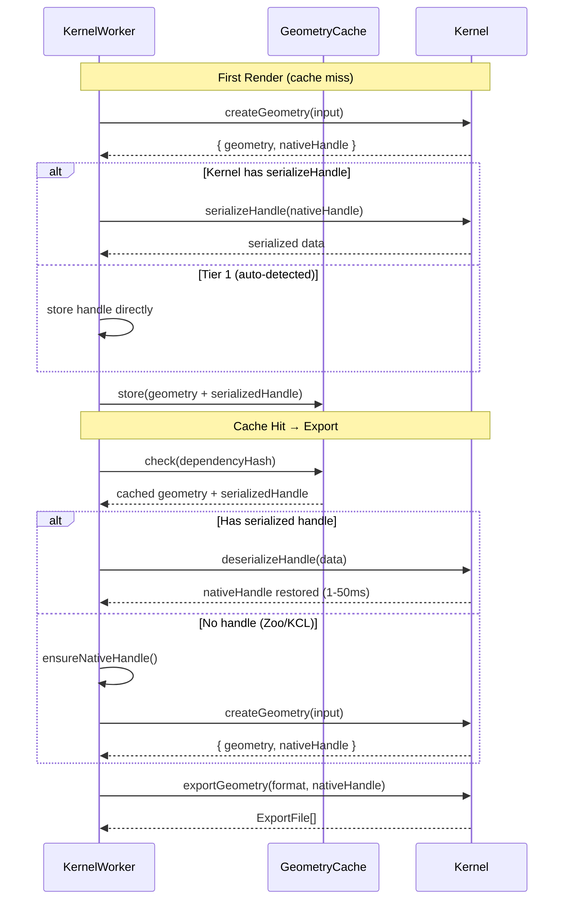

# nativeHandle Serialization and Pipeline Architecture

Comprehensive investigation into what each kernel's nativeHandle represents in the evaluation→tessellation→encoding pipeline, what serialization strategies are available (including newly discovered intermediate representations), and whether a staged pipeline decomposition in `defineKernel` is architecturally sound.

## Executive Summary

Each kernel captures nativeHandle at a different pipeline stage, with fundamentally different implications for caching and export. BRep kernels (replicad, opencascade) capture pre-tessellation geometry — the most valuable cache artifact. Mesh-based kernels (OpenSCAD, JSCAD, Manifold) capture post-tessellation data at varying levels of encoding. Zoo/KCL captures a post-encoding snapshot that is useless for export.

New findings: Manifold exposes a `getMesh()` → `Manifold.ofMesh()` round-trip that could preserve a more valuable intermediate than GLB. Zoo's `exportFromMemory` supports STEP (BRep) export, and caching those bytes is viable as a format-neutral BRep artifact — though no cross-kernel import path exists today.

Critical architectural conclusion: a mandatory staged pipeline decomposition (`evaluate → tessellate → encode`) in `defineKernel` over-fits OCCT-style kernels and under-fits OpenSCAD, Manifold, Tau, and Zoo. The recommended path is monolithic `createGeometry` / `exportGeometry` with targeted improvements: `ensureNativeHandle()` (Strategy B), optional `serializeHandle`/`deserializeHandle` hooks, and kernel-declared capabilities for cache policy.

## Table of Contents

- [Problem Statement](#problem-statement)
- [Finding 1: Pipeline Stage Taxonomy](#finding-1-pipeline-stage-taxonomy)
- [Finding 2: Per-Kernel Pipeline Analysis](#finding-2-per-kernel-pipeline-analysis)
- [Finding 3: Zoo/KCL STEP as Cacheable BRep](#finding-3-zookcl-step-as-cacheable-brep)
- [Finding 4: Manifold MeshGL Round-Trip](#finding-4-manifold-meshgl-round-trip)
- [Finding 5: Staged Pipeline Decomposition Analysis](#finding-5-staged-pipeline-decomposition-analysis)
- [Finding 6: Render-as-Export Viability](#finding-6-render-as-export-viability)
- [Finding 7: Serialization Strategy Matrix](#finding-7-serialization-strategy-matrix)
- [Recommendations](#recommendations)
- [Trade-offs](#trade-offs)

## Problem Statement

The export pipeline audits (v5, v6) identified that `nativeHandle` — the kernel-specific geometry representation — is not cached by the geometry cache middleware, forcing "reheat" (re-running `createGeometry`) before every export after a cache hit. The OCCT BRep serialization investigation confirmed that BRep handles CAN be serialized, and that all seven kernels have some serialization path. Three questions remained:

1. **What pipeline stage does each kernel's nativeHandle represent?** Pre-tessellation, post-tessellation, or post-encoding — and what does that mean for cache reuse with different export settings?
2. **Are there more valuable intermediate artifacts?** Zoo's STEP export, Manifold's MeshGL — can we cache something richer than what we currently store?
3. **Should we decompose `createGeometry` into named stages** (evaluate/tessellate/encode) in `defineKernel` to enable per-stage caching and unify render/export pipelines?

## Methodology

- Source analysis of all 7 kernel implementations in `packages/runtime/src/kernels/`
- Upstream repo exploration: `repos/manifold/` (WASM bindings, `Mesh` type, `getMesh()`/`ofMesh()` API)
- Upstream repo exploration: `repos/zoo-modeling-app/` (KCL WASM bindings, `Context` class, `ExecOutcome`, `OutputFormat3d`)
- Cross-reference with existing research: v5 audit (Strategy B), v6 audit (handle-first critique), OCCT BRep serialization doc
- Type analysis of `KernelDefinition`, `CreateGeometryInput`, `ExportGeometryInput` in `runtime-kernel.types.ts`
- Cache middleware analysis in `geometry-cache.middleware.ts` and reheat mechanism in `kernel-worker.ts` (lines 913–952)

## Finding 1: Pipeline Stage Taxonomy

A kernel's `createGeometry` pipeline progresses through up to four stages:

| Stage            | Description                                          | Output                                                              |
| ---------------- | ---------------------------------------------------- | ------------------------------------------------------------------- |
| **Evaluation**   | Execute user code, compute CSG/BRep operations       | Native geometry objects (BRep shapes, polygon meshes, engine state) |
| **Tessellation** | Approximate parametric surfaces with triangle meshes | Mesh data (vertices, faces, normals)                                |
| **Encoding**     | Serialize mesh data into a wire format               | Bytes (GLB, OFF, etc.)                                              |
| **Transport**    | Framework transfers encoded bytes to main thread     | `GeometryResponse[]`                                                |

The nativeHandle is captured at one of these stages. The stage determines:

- Whether export can reuse the handle with different tessellation settings
- What serialization buys (avoiding re-evaluation vs avoiding re-encoding)
- Whether the geometry cache already covers the same data

## Finding 2: Per-Kernel Pipeline Analysis

### Replicad — Pre-Tessellation BRep (Category A)

```
User code → BRep shapes (InputShape[])
                    ↓
         ┌─── nativeHandle captured here ───┐
         ↓                                  │ beforeRender callback
    Tessellation                            │ (render-output.ts:240)
    └── shape.mesh({ tolerance,             │
        angularTolerance })                 │
         ↓                                  │
    GLTF encoding                           │
    └── convertReplicadGeometriesToGltf()   │
         ↓
    GeometryResponse[]
```

**Handle contents**: `InputShape[]` — BRep `AnyShape` wrappers (WASM `TopoDS_Shape` pointers) plus metadata (name, color, opacity, metallic, roughness, density). Captured at `render-output.ts:240` via `beforeRender(baseShape)`, BEFORE `render()` tessellates at line 242.

**Export behavior**: Each format re-tessellates from BRep. STEP export (`exportSTEP`) uses BRep directly — no tessellation. STL/GLB re-mesh with export-quality tolerances. **Handle is format-agnostic and tessellation-agnostic.**

**Serialization**: `Shape.serialize()` → ASCII BRep string via existing `BRepToolsWrapper`. Metadata → JSON. Deserialization via `deserializeShape()`. **Already functional** in replicad's WASM build.

### OpenCascade — Pre-Tessellation BRep (Category A)

```
User code → TopoDS_Shape objects
                    ↓
    normalizeShapes() → ShapeEntry[]
                    ↓
         ┌─── nativeHandle captured here ───┐
         ↓                                  │ line 329
    meshShapesToGltf()                      │
    ├── BRepMesh_IncrementalMesh             │
    └── RWGltf_CafWriter                    │
         ↓
    GeometryResponse[]
```

**Handle contents**: `ShapeEntry[]` — raw WASM `TopoDS_Shape` pointers plus metadata. Same pre-tessellation BRep as replicad.

**Export behavior**: Identical pattern — GLB/STL re-mesh with export tolerances, STEP writes BRep directly via XCAF/STEPControl.

**Serialization**: Requires `BinToolsWrapper` addition to `opencascade.full.yml`. Not yet available in the WASM build. See `docs/research/occt-brep-serialization-for-handle-caching.md` Finding 6 for the implementation plan.

### OpenSCAD — Post-Tessellation Mesh (Category B)

```
User code → OpenSCAD WASM engine
    ├── $fn/$fa/$fs from render tessellation
    └── callMain(-o file.off --backend=manifold)
                    ↓
    OFF text (triangle mesh at RENDER quality)
                    ↓
         ┌─── nativeHandle captured here ───┐
         ↓                                  │ line 692
    convertOffToGltf(offData, 'glb')        │
         ↓
    GeometryResponse[]
```

**Handle contents**: `string` — OFF format text (vertices + faces). This IS the tessellated mesh. The `$fn/$fa/$fs` values that controlled tessellation quality are **baked into the vertex/face data**. The parametric CSG model inside the WASM engine is gone after `callMain` returns.

**Export behavior**: When export tessellation differs from render, the kernel **re-runs the entire WASM engine** via `runOpenScadBuild()` with new `$fn/$fa/$fs` (lines 726–741). The OFF handle is discarded.

**Critical distinction**: OpenSCAD has **no BRep representation accessible to Tau**. The engine fuses evaluation and tessellation into a single `callMain()` invocation. There is no stage between "parametric model" and "triangle mesh" that Tau can intercept.

**Serialization**: Trivial — already a string. But cache value is limited to same-tessellation scenarios.

### JSCAD — Post-CSG Polygon Mesh (Category E)

```
User code → JSCAD geom3/geom2 objects
    └── CSG operations on polygon meshes
                    ↓
         ┌─── nativeHandle captured here ───┐
         ↓                                  │ line 333
    jscadToGltf(shape) per shape            │
    ├── geom3.toPolygons()                  │
    ├── Triangulation of polygons           │
    └── writeGlb()                          │
         ↓
    GeometryResponse[]
```

**Handle contents**: `unknown[]` — JSCAD geom3/geom2 objects containing polygon arrays. These are **post-CSG** but **pre-triangulation/encoding**. JSCAD does not use BRep — it operates on polygon meshes throughout. The polygon data is the direct output of CSG boolean operations, with mesh quality determined by input geometry and operations, not by a tolerance parameter.

**Export behavior**: `exportGeometry` calls `jscadToGltf(shape)` again — re-triangulates polygons and re-encodes to GLB. The expensive CSG computation is NOT repeated. No export-specific tessellation control exists.

**Serialization**: `@jscad/modeling` provides `geom3.toCompactBinary()` / `fromCompactBinary()` — pure JS compact binary format. Works for geom2 and path2 as well.

### Manifold — Post-Encoding GLB, but MeshGL Available (Category C+)

```
User code → Manifold WASM objects (CSG on indexed meshes)
                    ↓
         ┌─── Manifold.getMesh() available here ───┐
         ↓                                         │ NOT currently captured
    createGlbFromManifoldOutput()                   │
    ├── anyToGLTFNodeList                           │
    ├── GLTFNodesToGLTFDoc                          │
    └── writeBinary (GLB encoding)                  │
                    ↓
    cleanupManifoldRuntime() (WASM objects DELETED)
                    ↓
         ┌─── nativeHandle = { glb } captured here ─┐
         ↓                                           │ line 388
    GeometryResponse[]
```

**Handle contents (current)**: `{ glb: Uint8Array }` — post-encoding GLB. WASM Manifold objects are destroyed by `cleanupManifoldRuntime()` at line 408. The handle IS the final output.

**Key discovery — MeshGL round-trip**: The Manifold WASM API exposes `getMesh(normalIdx?)` → `Mesh` and `Manifold.ofMesh(mesh)` / `new Manifold(mesh)` as a documented lossless round-trip (`manifold-encapsulated-types.d.ts:465–588`).

The `Mesh` type contains plain typed arrays:

| Field             | Type            | Purpose                                  |
| ----------------- | --------------- | ---------------------------------------- |
| `numProp`         | `number`        | Properties per vertex                    |
| `vertProperties`  | `Float32Array`  | Vertex positions + properties            |
| `triVerts`        | `Uint32Array`   | Triangle vertex indices                  |
| `mergeFromVert`   | `Uint32Array?`  | Merge topology (for lossless round-trip) |
| `mergeToVert`     | `Uint32Array?`  | Merge topology                           |
| `runIndex`        | `Uint32Array?`  | Original mesh run boundaries             |
| `runOriginalID`   | `Uint32Array?`  | Original mesh IDs                        |
| `runTransform`    | `Float32Array?` | Per-run transforms                       |
| `faceID`          | `Uint32Array?`  | Face identification                      |
| `halfedgeTangent` | `Float32Array?` | Smooth normals                           |
| `tolerance`       | `number?`       | Geometric tolerance                      |

**If captured before cleanup**, the `Mesh` data would be:

- Strictly more informative than GLB (preserves merge topology, original IDs, half-edge tangents)
- Directly serializable (plain typed arrays → `Uint8Array` via `ArrayBuffer`)
- Reconstructable into a `Manifold` object for future CSG operations

**Current limitation**: The kernel destroys WASM objects at line 408 and stores only GLB. To capture `Mesh`, the kernel would need to call `manifold.getMesh()` BEFORE cleanup and store the typed arrays as nativeHandle instead of (or alongside) GLB bytes.

### Tau — Post-Encoding GLB (Category C)

```
Input file (STEP/STL/OBJ) → readFile()
                    ↓
    importToGlb(files, format, resolver)
                    ↓
         ┌─── nativeHandle = glbData captured here
         ↓
    GeometryResponse[]
```

**Handle contents**: `Uint8Array` — GLB bytes from file format conversion. No user code evaluation, no tessellation control. The handle IS the final output.

**Serialization**: Trivial — already bytes. Cache value is equivalent to existing geometry cache.

### Zoo/KCL — Post-Encoding GLB + Engine-Dependent Export (Category D)

```
KCL source → executeProgram() (cloud/WASM engine)
                    ↓
    Engine maintains BRep state server-side
    (hasExecutedProgram = true)
                    ↓
    exportFromMemory({ type: 'gltf', storage: 'binary' })
                    ↓
         ┌─── nativeHandle = gltf.contents captured here
         ↓                                              │ line 267
    GeometryResponse[]

    SEPARATELY — exportGeometry:
    exportFromMemory({ type: 'step'|'stl'|... })  ← requires hasExecutedProgram
```

**Handle contents**: `Uint8Array` — GLB preview snapshot. The KCL engine's in-memory BRep state is the true geometry source, and it is NOT accessible from Tau.

**Export behavior**: CRITICAL — `exportGeometry` ignores `nativeHandle` bytes entirely. Every format calls `utilities.exportFromMemory()` again, which requires `hasExecutedProgram === true`. The engine's `Context` WASM class has NO save/restore/serialize API for geometry state (`kcl_wasm_lib.d.ts:127–167`). Only configuration serialization exists (`serialize_configuration`, `serialize_project_configuration`).

**`ExecOutcome`**: The engine returns variables, operations, artifact graph, errors — metadata useful for UI/feature tree, NOT a geometry checkpoint (`ExecOutcome.ts:10–39`).

## Finding 3: Zoo/KCL STEP as Cacheable BRep

Zoo's `exportFromMemory` supports six 3D formats via `OutputFormat3d` (`ModelingCmd.ts:2000–2003`):

| Format | Classification             | Options                                              |
| ------ | -------------------------- | ---------------------------------------------------- |
| `step` | **BRep / CAD interchange** | `coords`, optional `created` timestamp               |
| `gltf` | Mesh (glTF 2.0)            | `storage` (binary/standard/embedded), `presentation` |
| `stl`  | Mesh                       | `coords`, `selection`, `storage`, `units`            |
| `obj`  | Mesh                       | `coords`, `units`                                    |
| `ply`  | Mesh                       | `storage`, `coords`, `selection`, `units`            |
| `fbx`  | Mesh                       | `storage`, optional `created`                        |

**STEP is the only BRep-class format.** Tau's Zoo kernel currently wires four exports: `stl`, `step`, `glb`, `gltf` (`zoo.kernel.ts:279–341`).

**Viability as a cache artifact**: After `createGeometry`, we could call `exportFromMemory({ type: 'step' })` to produce STEP bytes and cache them alongside the GLB preview. This captures the **full BRep** from the cloud engine. However:

1. **No cross-kernel import path**: Replicad/OpenCascade kernels do not have STEP import wired for rebuilding solids from imported bytes. STEP re-import would need OCCT's `STEPControl_Reader` — available in the WASM build but not exposed as a kernel import path.
2. **Performance trade-off**: STEP writing adds latency to every `createGeometry` (model-dependent — small parts are fast, assemblies are slower). STEP re-import + re-tessellation may be competitive with KCL re-execution for complex scripts, but needs benchmarking.
3. **Deterministic STEP**: `createExportFormat` supports `deterministic: true` → `created: '1970-01-01T00:00:00Z'` (`kcl-utils.ts:642–645`), enabling byte-stable cache keys.
4. **Incomplete solution**: Even with cached STEP, `exportGeometry` for mesh formats (STL, OBJ, PLY) still needs either (a) re-executing KCL on the engine, or (b) re-importing STEP into an OCCT-based tessellator. Option (b) is architecturally a cross-kernel handoff that does not exist today.

**Verdict**: STEP caching is a **viable future optimization** for Zoo/KCL export but requires significant new infrastructure (STEP import path, cross-kernel tessellation). For the current implementation, `ensureNativeHandle()` (re-running `executeProgram`) remains the pragmatic approach.

## Finding 4: Manifold MeshGL Round-Trip

The Manifold WASM library provides a documented lossless mesh round-trip:

```typescript
const mesh: Mesh = manifold.getMesh(); // Extract mesh data (typed arrays)
const restored = Manifold.ofMesh(mesh); // Reconstruct Manifold from mesh
```

**Evidence**: `manifold-encapsulated-types.d.ts` lines 465–588, `bindings.js` lines 438–440 (getMesh), 577–588 (ofMesh/constructor).

**Round-trip fidelity**: Lossless when full `Mesh` metadata is preserved (including `mergeFromVert`, `mergeToVert`, `runIndex`, `runOriginalID`). Without merge metadata, duplicate vertices at property boundaries may produce a valid but topologically different manifold.

**Comparison to current approach**:

| Aspect             | Current (GLB)                                            | Proposed (MeshGL)                                             |
| ------------------ | -------------------------------------------------------- | ------------------------------------------------------------- |
| Data preserved     | Triangulated mesh + materials (glTF format)              | Raw mesh + merge topology + original IDs + half-edge tangents |
| Reconstructability | Cannot reconstruct `Manifold` object                     | CAN reconstruct `Manifold` for further CSG                    |
| Size (estimated)   | ~same for bare meshes; GLB adds glTF JSON/chunk overhead | Raw typed arrays, slightly more compact                       |
| Serialization      | Already `Uint8Array`                                     | Plain typed arrays → `ArrayBuffer` packing                    |
| Future CSG         | Impossible — source objects destroyed                    | Possible from `Manifold.ofMesh(mesh)`                         |

**Implementation**: Capture `Mesh` data BEFORE `cleanupManifoldRuntime()` destroys WASM objects. Store as nativeHandle instead of (or alongside) GLB bytes.

**Practical value**: Currently marginal — the Manifold kernel only supports GLB export and has no tessellation control. The `Mesh` representation becomes valuable if:

- The kernel adds export formats that need re-tessellation at different qualities
- Future features require post-creation CSG operations on cached geometry
- Multi-step workflows need to compose cached Manifold results

## Finding 5: Staged Pipeline Decomposition Analysis

The proposed staged `defineKernel` API:

```typescript
defineKernel({
  stages: {
    evaluate: (input) => nativeHandle, // Run user code → geometry objects
    tessellate: (handle, opts) => mesh, // Approximate surfaces → triangles
    encode: (mesh, format) => bytes, // Serialize → wire format
  },
});
```

### Per-Kernel Feasibility

| Kernel      | Fits staged model? | Why / Why not                                                                                                                     |
| ----------- | ------------------ | --------------------------------------------------------------------------------------------------------------------------------- |
| Replicad    | **Strong**         | Clean BRep → mesh → GLB separation                                                                                                |
| OpenCascade | **Strong**         | Same OCCT-based pattern                                                                                                           |
| OpenSCAD    | **Weak**           | WASM engine fuses evaluate+tessellate in `callMain()`. Cannot intercept between "CSG model" and "OFF mesh."                       |
| JSCAD       | **Partial**        | Evaluate → geom3[] → triangulate → GLB, but "tessellation" is really polygon triangulation, not surface approximation             |
| Manifold    | **Very weak**      | WASM objects ephemeral; no durable "evaluate" artifact without new `getMesh()` capture. "Tessellation" is not a separate concept. |
| Tau         | **N/A**            | Single-stage file conversion. No user code, no tessellation.                                                                      |
| Zoo/KCL     | **N/A**            | Cloud engine controls everything. Local stages are meaningless.                                                                   |

### Benefits

- **For BRep kernels only**: Per-stage caching — cache evaluation (BRep), skip re-evaluation when only tessellation/format changes
- Unified mesh pipeline for preview and export when handle is pre-tessellation
- Clearer separation of concerns in kernel implementations

### Costs

1. **Not universal**: 4 of 7 kernels cannot meaningfully decompose into stages
2. **API contract freeze**: Named stages become evolution constraints. Adding a stage or changing stage boundaries is a breaking change across all kernel implementations.
3. **2D output gap**: Replicad produces SVG (2D) alongside 3D meshes from the same evaluation. A rigid `tessellate → encode(glb)` spine does not subsume SVG without a parallel branch.
4. **Author burden**: Simple kernels (Tau, Manifold) must implement or stub stages for a pattern that doesn't apply to them. Framework must provide fallback adapters that re-duplicate monolithic logic.
5. **False abstraction**: "Tessellation" means different things for different geometry representations — BRep surface approximation (OCCT), polygon triangulation (JSCAD), engine-controlled `$fn/$fa/$fs` (OpenSCAD), not applicable (Manifold). A shared stage name creates misleading uniformity.

### Verdict

A mandatory staged pipeline over-fits OCCT-style kernels and under-fits the rest. The same goals are achievable through targeted improvements to the monolithic API:

- **ensureNativeHandle()**: Framework-owned reheat at the middleware level (Strategy B from v5 audit)
- **serializeHandle/deserializeHandle**: Optional kernel hooks for BRep/JSCAD serialization
- **Kernel-declared capabilities**: Metadata flags (`preTessHandleSerializable`, `exportRequiresLiveEngine`) to drive cache policy without forcing one pipeline shape

## Finding 6: Render-as-Export Viability

The v6 audit proposed making `createGeometry` return only nativeHandle, with render becoming `exportGeometry('glb')`. The original objection was BRep non-serializability — but we now have serialization paths.

**What serialization changes**: For replicad/opencascade, a serialized BRep handle CAN be cached and restored, making it possible to skip evaluation and jump directly to `exportGeometry('glb', renderOpts)` for preview.

**What remains problematic**:

1. **Zoo/KCL**: Engine state is non-serializable. Preview MUST run `createGeometry` (which calls `executeProgram`). Render-as-export adds a second `exportFromMemory('glb')` call that is redundant with what `createGeometry` already does.
2. **OpenSCAD**: The OFF handle is tessellation-specific. "Export('glb', renderTess)" is equivalent to "decode OFF → GLB" — which is what `createGeometry` already does. No win.
3. **First-render latency**: Unifying render and export means every preview goes through evaluate → tessellate → encode sequentially. Today, `createGeometry` does this monolithically (often with internal optimizations). Routing through `exportGeometry` adds framework dispatch overhead.
4. **SVG**: Replicad 2D shapes produce SVG, not meshes. "Export('svg')" is a different pipeline entirely.

**Verdict**: Render-as-export gains little beyond what handle serialization + the existing geometry cache already provide. The current architecture (monolithic `createGeometry` produces both preview and handle; `exportGeometry` uses handle for export) is the better fit when augmented with handle serialization. The geometry cache stores final GLB for fast repeat renders; serialized handles enable fast export without reheat.

## Finding 7: Serialization Strategy Matrix

Incorporating all new findings, the definitive serialization matrix:

| Kernel          | Handle stage                   | Serialization method                                             | Cache value                                                                   | Export from cached handle?                                 |
| --------------- | ------------------------------ | ---------------------------------------------------------------- | ----------------------------------------------------------------------------- | ---------------------------------------------------------- |
| **Replicad**    | Pre-tess BRep                  | `Shape.serialize()` + JSON metadata                              | **Maximum** — avoids re-evaluation AND enables re-tessellation at any quality | Yes — all formats, any tessellation                        |
| **OpenCascade** | Pre-tess BRep                  | `BinToolsWrapper` (requires WASM build addition) + JSON metadata | **Maximum**                                                                   | Yes — all formats, any tessellation                        |
| **OpenSCAD**    | Post-tess mesh                 | Direct string storage                                            | **Moderate** — avoids reheat only when export uses same tessellation          | Only same tessellation; different tess re-runs WASM engine |
| **JSCAD**       | Post-CSG polygons              | `toCompactBinary()` / `fromCompactBinary()`                      | **Good** — avoids re-running CSG                                              | Yes — re-triangulates + re-encodes (cheap)                 |
| **Manifold**    | Post-encoding GLB (currently)  | Direct byte storage                                              | **Minimal** — geometry cache already stores this                              | GLB only; no re-tessellation possible                      |
| **Manifold**    | Pre-encoding MeshGL (proposed) | Typed array packing                                              | **Good** — preserves topology for potential future CSG                        | GLB re-encoding + potential future multi-format            |
| **Tau**         | Post-encoding GLB              | Direct byte storage                                              | **Minimal** — geometry cache covers this                                      | GLB/GLTF only                                              |
| **Zoo/KCL**     | Post-encoding GLB              | Direct byte storage                                              | **None for export** — engine state required                                   | **No** — export always calls `exportFromMemory()`          |
| **Zoo/KCL**     | STEP bytes (proposed future)   | Cache alongside GLB                                              | **Moderate** — preserves BRep                                                 | Needs STEP import path (does not exist today)              |

## Recommendations

| #   | Action                                                                                                           | Priority | Effort | Impact                                                                 |
| --- | ---------------------------------------------------------------------------------------------------------------- | -------- | ------ | ---------------------------------------------------------------------- |
| R1  | Implement `ensureNativeHandle()` in `kernel-worker.ts` replacing manual reheat block (lines 913–952)             | P0       | Medium | Framework-owned reheat for all kernels; eliminates ad-hoc reheat logic |
| R2  | Add optional `serializeHandle`/`deserializeHandle` hooks to `KernelDefinition`                                   | P0       | Medium | Enables per-kernel handle caching                                      |
| R3  | Implement Tier 1 auto-detection in geometry cache middleware (`string`, `Uint8Array`, `{ glb: Uint8Array }`)     | P0       | Low    | 4 kernels get handle caching with zero kernel changes                  |
| R4  | Implement replicad `serializeHandle` using existing `Shape.serialize()` / `deserializeShape()`                   | P0       | Low    | Highest-value kernel — BRep models are the primary use case            |
| R5  | Add `BinToolsWrapper` to `opencascade.full.yml` + rebuild OCJS tarball                                           | P1       | Medium | Enables opencascade kernel BRep serialization                          |
| R6  | Implement JSCAD `serializeHandle` using `toCompactBinary()` / `fromCompactBinary()`                              | P2       | Low    | Good cache value, low effort                                           |
| R7  | Capture Manifold `Mesh` via `getMesh()` before cleanup as nativeHandle                                           | P3       | Low    | Future-proofing; minimal current benefit                               |
| R8  | Do NOT implement staged pipeline decomposition in `defineKernel`                                                 | —        | —      | Over-fits BRep kernels; monolithic + hooks achieves same goals         |
| R9  | Do NOT implement render-as-export unification                                                                    | —        | —      | Adds complexity without meaningful benefit over current architecture   |
| R10 | For Zoo/KCL, rely on `ensureNativeHandle()` — STEP caching is a future optimization requiring new infrastructure | P2       | High   | STEP import path, cross-kernel tessellation are prerequisites          |

### R2 Detail: KernelDefinition Handle Hooks

```typescript
export type KernelDefinition<...> = {
  // ... existing fields ...

  serializeHandle?(nativeHandle: NativeHandle, context: KernelContext): unknown;
  deserializeHandle?(data: unknown, context: KernelContext): NativeHandle;
};
```

The cache middleware flow becomes:

```
createGeometry → { geometry, nativeHandle }
  ├── kernel has serializeHandle? → serialize + store with geometry
  ├── isDirectlySerializable(nativeHandle)? → store directly
  └── neither? → store geometry only; export will use ensureNativeHandle()

Cache hit:
  ├── stored serialized handle? → deserialize → set this.nativeHandle
  ├── stored raw handle? → set this.nativeHandle directly
  └── no handle stored? → export triggers ensureNativeHandle()
```

### R3 Detail: Tier 1 Auto-Detection

```typescript
function isDirectlySerializable(handle: unknown): boolean {
  if (typeof handle === 'string') return true;
  if (handle instanceof Uint8Array) return true;
  if (handle && typeof handle === 'object' && 'glb' in handle && (handle as { glb: unknown }).glb instanceof Uint8Array)
    return true;
  return false;
}
```

## Trade-offs

### Monolithic vs Staged Pipeline

| Dimension               | Monolithic (recommended)                                   | Staged                                                |
| ----------------------- | ---------------------------------------------------------- | ----------------------------------------------------- |
| Kernel author DX        | Low barrier — implement `createGeometry`, `exportGeometry` | Higher barrier — must understand stage contracts      |
| BRep cache reuse        | Via `serializeHandle` hooks                                | Via `evaluate` stage caching                          |
| Universal applicability | All kernels fit naturally                                  | 4 of 7 kernels need stubs or fallbacks                |
| API evolution           | Change hooks independently                                 | Stage boundary changes are breaking                   |
| Framework complexity    | Targeted middleware hooks                                  | Pipeline orchestrator, stage registry, fallback paths |

### Handle Serialization: Eager vs Lazy

| Strategy                                        | Pro                                                               | Con                                                                 |
| ----------------------------------------------- | ----------------------------------------------------------------- | ------------------------------------------------------------------- |
| **Eager** (serialize on every `createGeometry`) | Handle always available for export; no reheat ever                | Serialization cost on every render; increased cache size            |
| **Lazy** (serialize only when needed)           | No serialization overhead on render-only paths                    | First export after cache hit triggers serialization + re-evaluation |
| **Recommended: Eager for BRep**                 | BRep serialization (1–50ms) is trivial vs evaluation (100ms–10s+) | Slight memory cost; dominated by evaluation savings                 |

### Zoo/KCL STEP Caching: Now vs Later

| Timing                               | Pro                                                                        | Con                                                                   |
| ------------------------------------ | -------------------------------------------------------------------------- | --------------------------------------------------------------------- |
| **Now**                              | Faster export for STEP format specifically                                 | Large infrastructure effort; no import path; only benefits one format |
| **Later** (after STEP import exists) | Full cross-kernel BRep pipeline; multi-format export from cached STEP      | Delays improvement; Zoo/KCL remains reheat-dependent                  |
| **Recommended: Later**               | Focus on `ensureNativeHandle()` now; STEP caching is a separate initiative | —                                                                     |

## Diagrams

### Serialization-Enabled Cache Flow



### Handle Value by Pipeline Stage

```
                    ┌─────────────────────────────────────────────────┐
                    │                 Cache Value                      │
   Evaluation ──────┤ ████████████████████████████ Maximum (BRep)     │
                    │  Replicad, OpenCascade                          │
                    ├─────────────────────────────────────────────────┤
   Post-CSG ────────┤ ██████████████████████ Good (avoids CSG)       │
                    │  JSCAD                                          │
                    ├─────────────────────────────────────────────────┤
   Post-Tess ───────┤ ████████████████ Moderate (same-tess only)     │
                    │  OpenSCAD                                       │
                    ├─────────────────────────────────────────────────┤
   Post-Encode ─────┤ ████ Minimal (geometry cache already covers)   │
                    │  Manifold, Tau                                   │
                    ├─────────────────────────────────────────────────┤
   Engine State ────┤ ░ None for export (preview only)               │
                    │  Zoo/KCL                                        │
                    └─────────────────────────────────────────────────┘
```

## References

- OCCT BRep serialization details: `docs/research/occt-brep-serialization-for-handle-caching.md`
- Strategy B (ensureNativeHandle): `docs/research/export-pipeline-v5-implementation-audit.md`
- Handle-first architecture critique: `docs/research/export-pipeline-v6-implementation-audit.md`
- Manifold WASM bindings: `repos/manifold/bindings/wasm/manifold-encapsulated-types.d.ts` (lines 465–1406)
- Zoo KCL WASM bindings: `repos/zoo-modeling-app/rust/kcl-wasm-lib/pkg/kcl_wasm_lib.d.ts` (lines 127–167)
- Zoo OutputFormat3d: `node_modules/.pnpm_patches/@taucad/kcl-wasm-lib@0.1.130/bindings/ModelingCmd.ts` (lines 2000–2003)
- Zoo export implementation: `repos/zoo-modeling-app/rust/kcl-lib/src/execution/mod.rs` (lines 1649–1675)
- Replicad BRepToolsWrapper: `repos/replicad/packages/replicad-opencascadejs/build-config/custom_build_single.yml` (lines 265–281)
- Replicad Shape.serialize: `repos/replicad/packages/replicad/src/shapes.ts` (lines 179–196)
