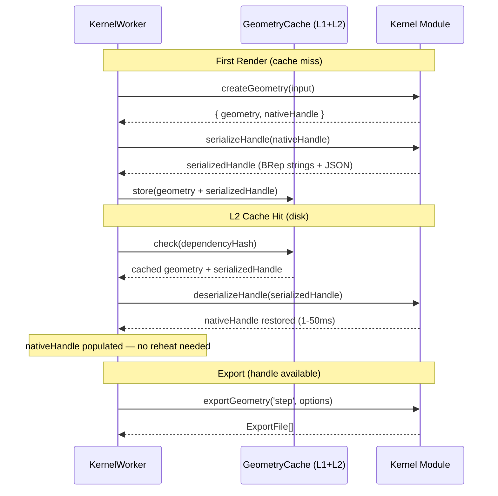
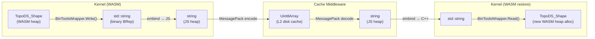
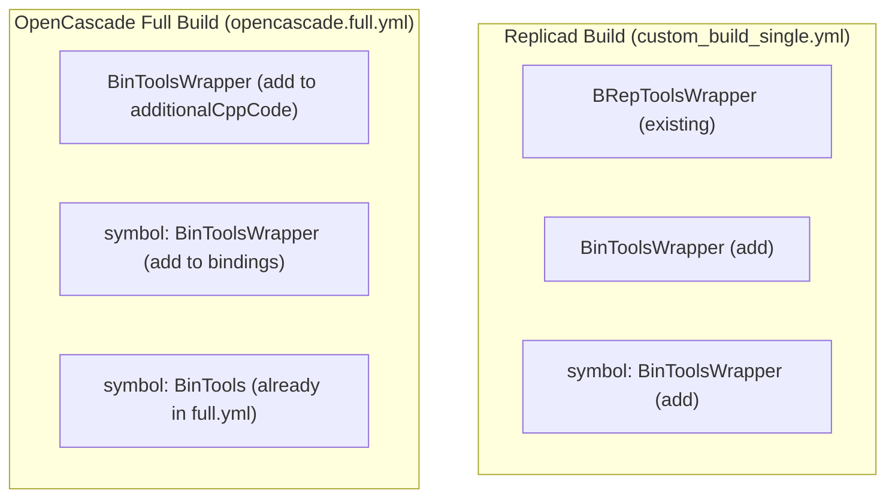

# OCCT BRep Serialization for nativeHandle Caching

Investigation into whether OCCT's built-in BRep persistence can serialize `TopoDS_Shape` objects for caching nativeHandle alongside geometry results, eliminating the reheat problem identified in the export pipeline v5/v6 audits.

## Executive Summary

OCCT provides two native shape serialization formats: ASCII BRep (`BRepTools`) and binary BRep (`BinTools`). Replicad's WASM build **already ships** a `BRepToolsWrapper` with `serialize()`/`deserializeShape()` on every `Shape` instance. The opencascade kernel's full build includes `BRepTools` and `BinTools` symbols but lacks the stream-to-string wrapper. Adding a `BinToolsWrapper` via `additionalCppCode` in the OCJS build config is straightforward and would provide 2–5× smaller serialized payloads with faster parse times. This capability would allow the geometry cache middleware to co-store serialized nativeHandle data alongside cached `GeometryResponse[]`, completely eliminating the reheat problem for both L1 and L2 cache hits.

## Problem Statement

The v6 architecture audit identified a fundamental tension: BRep nativeHandles (WASM heap pointers) cannot be serialized, so the geometry cache cannot preserve them across cache hits. This forces a "reheat" — re-running the full `createGeometry` pipeline — before every export after a cache hit.

This investigation asks: can OCCT's own BRep persistence format serialize `TopoDS_Shape` to bytes and restore it, making nativeHandle cacheable?

## Methodology

- Source analysis of OCCT upstream (`repos/OCCT/src/ModelingData/TKBRep/`) for `BRepTools` and `BinTools` APIs
- Source analysis of the replicad WASM build config (`repos/replicad/packages/replicad-opencascadejs/build-config/custom_build_single.yml`) for existing wrapper patterns
- Source analysis of the opencascade.js bindgen pipeline (`repos/opencascade.js/src/`) for `additionalCppCode` injection
- Source analysis of replicad's `Shape.serialize()`/`deserializeShape()` in `repos/replicad/packages/replicad/src/shapes.ts`
- Analysis of the opencascade kernel's WASM build (`opencascade_full`) and what it includes

## Findings

### Finding 1: OCCT Provides Two Native BRep Serialization Formats

OCCT ships two complementary persistence mechanisms in `TKBRep`:

| Format      | API                     | File            | Output         | Topology preserved                                       | Triangulation                 |
| ----------- | ----------------------- | --------------- | -------------- | -------------------------------------------------------- | ----------------------------- |
| ASCII BRep  | `BRepTools::Write/Read` | `BRepTools.hxx` | Text (`.brep`) | Full — vertex/edge/face sharing, orientations, locations | Optional (`theWithTriangles`) |
| Binary BRep | `BinTools::Write/Read`  | `BinTools.hxx`  | Binary         | Full — same topology graph                               | Optional (`theWithTriangles`) |

Both formats use a `ShapeSet` internally (`BRepTools_ShapeSet` / `BinTools_ShapeSet`) that indexes shared `TShape` handles, preserving the full topological structure including:

- Vertex/edge/face sharing across shells
- `TopoDS_Compound` hierarchy
- Shape orientations and locations (transformations)
- Geometry (curves, surfaces, points)
- Optionally: triangulation mesh data

**Key API signatures** (from `repos/OCCT/src/ModelingData/TKBRep/`):

```cpp
// ASCII — stream-based (BRepTools.hxx:284-316)
static void Write(const TopoDS_Shape& theShape, Standard_OStream& theStream, ...);
static void Read(TopoDS_Shape& Sh, Standard_IStream& S, const BRep_Builder& B, ...);

// Binary — stream-based (BinTools.hxx:62-91)
static void Write(const TopoDS_Shape& theShape, Standard_OStream& theStream, ...);
static void Read(TopoDS_Shape& theShape, Standard_IStream& theStream, ...);
```

**Critical difference**: `BRepTools::Read` requires a `BRep_Builder` parameter; `BinTools::Read` constructs one internally via `BinTools_ShapeSet`.

### Finding 2: Replicad Already Ships BRep Serialization

The replicad WASM build (`custom_build_single.yml`) includes a `BRepToolsWrapper` class in `additionalCppCode` that wraps ASCII BRep stream I/O into a `std::string`-based API:

```265:281:repos/replicad/packages/replicad-opencascadejs/build-config/custom_build_single.yml
  class BRepToolsWrapper {
  public:
    static std::string Write(const TopoDS_Shape& shape) {
      std::ostringstream oss(std::ios::binary);
      oss << std::setprecision(17);
      BRepTools::Write(shape, oss);
      return oss.str();
    }
    static TopoDS_Shape Read(const std::string& data) {
      std::istringstream iss(data, std::ios::binary);
      TopoDS_Shape shape;
      BRep_Builder builder;
      Message_ProgressRange progress;
      BRepTools::Read(shape, iss, builder, progress);
      return shape;
    }
  };
```

Replicad's `Shape` class exposes this as `serialize()` / `deserializeShape()`:

```193:196:repos/replicad/packages/replicad/src/shapes.ts
  serialize(): string {
    const oc = getOC();
    return oc.BRepToolsWrapper.Write(this.wrapped);
  }
```

```179:182:repos/replicad/packages/replicad/src/shapes.ts
export function deserializeShape(data: string): AnyShape {
  const oc = getOC();
  return cast(oc.BRepToolsWrapper.Read(data));
}
```

This wrapper exists because embind cannot bind `std::istream`/`std::ostream` parameters directly — they are listed in `_UNBINDABLE_PATTERNS` in the bindgen (`repos/opencascade.js/src/bindings.py:192-199`). The wrapper sidesteps this by using `std::ostringstream`/`std::istringstream` internally and exposing a `std::string` interface.

### Finding 3: The Two Kernels Use Different WASM Builds

| Kernel      | WASM build         | Package                  | Has BRepToolsWrapper?                 |
| ----------- | ------------------ | ------------------------ | ------------------------------------- |
| Replicad    | `replicad_single`  | `replicad-opencascadejs` | **Yes** — in `additionalCppCode`      |
| OpenCascade | `opencascade_full` | `opencascade.js`         | **No** — only bare `BRepTools` symbol |

The opencascade kernel's full build includes `BRepTools` as a bindgen symbol, but the auto-generated bindings skip `Write`/`Read` methods that take stream parameters (unbindable). The full build's `additionalCppCode` only contains `OCJS` (exception helper) and `Handle_IMeshTools_Context` typedef.

**To enable serialization for the opencascade kernel**, a `BRepToolsWrapper` (or `BinToolsWrapper`) must be added to the opencascade.js full build configuration.

### Finding 4: Binary BRep (BinTools) Offers Significant Size/Speed Advantages

The ASCII format (`BRepTools`) uses text-encoded floating-point numbers with `std::setprecision(17)`, producing strings like `0.12345678901234568`. The binary format (`BinTools`) writes raw `double` values via `write((char*)&theValue, sizeof(double))`.

| Dimension              | ASCII (BRepTools)          | Binary (BinTools)           |
| ---------------------- | -------------------------- | --------------------------- |
| Size per `double`      | ~20 chars (decimal text)   | 8 bytes (raw IEEE 754)      |
| Parse speed            | Text → double conversion   | Direct memory copy          |
| Output type            | Human-readable string      | Opaque binary blob          |
| Estimated ratio        | 1× (baseline)              | ~0.3–0.5× size              |
| `BRep_Builder` on Read | Required (caller provides) | Internal (auto-constructed) |

For caching purposes, binary BRep is strictly superior: smaller cache entries, faster serialize/deserialize, and a simpler Read API (no `BRep_Builder` needed).

### Finding 5: What Needs Serializing per Kernel

**Replicad nativeHandle = `InputShape[]`**

Each `InputShape` contains:

| Field        | Type                              | Serialization                       |
| ------------ | --------------------------------- | ----------------------------------- |
| `shape`      | `AnyShape` (wraps `TopoDS_Shape`) | BRep string via `shape.serialize()` |
| `name`       | `string?`                         | JSON                                |
| `color`      | `string?` (CSS hex)               | JSON                                |
| `opacity`    | `number?`                         | JSON                                |
| `metallic`   | `number?`                         | JSON                                |
| `roughness`  | `number?`                         | JSON                                |
| `density`    | `number?`                         | JSON                                |
| `strokeType` | `string?`                         | JSON                                |

Serialized representation: `Array<{ brep: string, metadata: { name?, color?, ... } }>`.

**OpenCascade nativeHandle = `ShapeEntry[]`**

Each `ShapeEntry` contains the same structure: `TopoDS_Shape` + metadata (name, color, opacity, metallic, roughness, density). Same serialization strategy applies.

**OpenSCAD nativeHandle = `string` (OFF data)**

Already serializable — it's a plain text string. No OCCT involvement needed.

**Tau nativeHandle = `Uint8Array` (GLB bytes)**

Already serializable — it's raw bytes.

### Finding 6: additionalCppCode Injection Pipeline

The opencascade.js build pipeline injects custom C++ through two mechanisms:

1. **`additionalCppCode`** (top-level YAML) — parsed by clang, run through `generateCustomCodeBindings()` in `generateBindings.py`. Classes defined here get full embind codegen (constructors, methods, static methods). The class name must also appear in the `mainBuild.bindings` symbol list.

2. **`additionalBindCode`** (on `mainBuild`) — raw `EMSCRIPTEN_BINDINGS(...)` code merged with `BUILTIN_ADDITIONAL_BIND_CODE`. Bypasses codegen — the developer writes embind registrations directly.

For a `BinToolsWrapper` class, option 1 (`additionalCppCode` + symbol) is the correct approach, consistent with replicad's `BRepToolsWrapper` pattern.

**Required additions to the opencascade.js full build YAML**:

```yaml
additionalCppCode: |
  // ... existing code ...

  #include <BinTools.hxx>
  #include <Message_ProgressRange.hxx>

  class BinToolsWrapper {
  public:
    static std::string Write(const TopoDS_Shape& shape) {
      std::ostringstream oss(std::ios::binary);
      Message_ProgressRange progress;
      BinTools::Write(shape, oss, true, false,
                      BinTools_FormatVersion_CURRENT, progress);
      return oss.str();
    }

    static TopoDS_Shape Read(const std::string& data) {
      std::istringstream iss(data, std::ios::binary);
      TopoDS_Shape shape;
      Message_ProgressRange progress;
      BinTools::Read(shape, iss, progress);
      return shape;
    }
  };

mainBuild:
  bindings:
    - symbol: BinToolsWrapper # Add to symbol list
```

The same class should also be added to the replicad custom build for the binary format advantage, alongside (not replacing) the existing `BRepToolsWrapper`.

### Finding 7: Serialization Round-Trip Fidelity

BRep serialization (`BRepTools` and `BinTools`) round-trips the full `TopoDS_Shape` topology graph:

- **Vertex/edge/face sharing** — preserved via indexed `TShape` references in `TopTools_ShapeSet`
- **Orientations** — each shape records `TopAbs_Orientation` (FORWARD, REVERSED, INTERNAL, EXTERNAL)
- **Locations** — `TopLoc_Location` transformations are serialized
- **Geometry** — curves (`Geom_Curve`, `Geom2d_Curve`), surfaces (`Geom_Surface`), points
- **Compounds** — `TopoDS_Compound` is a first-class shape type in the shape set
- **Triangulation** — optionally included (controlled by `theWithTriangles` parameter)

**Caveat**: The deserialized shape is a new WASM heap allocation. It is structurally identical to the original but is a distinct object (different pointer). `IsSame()` returns false; `IsEqual()` depends on topology comparison. For caching purposes, structural identity is sufficient — exports only need the BRep geometry, not pointer identity.

**Caveat**: BRep serialization does NOT preserve:

- XCAF metadata (colors, names, materials stored on labels) — these are framework-level concerns stored in the `InputShape` metadata, not in the `TopoDS_Shape` itself
- User-defined attributes on shapes
- Construction history (CSG tree)

Since `InputShape` metadata (name, color, opacity, etc.) is stored separately from the `TopoDS_Shape`, this is not a limitation — the metadata is serialized as JSON alongside.

### Finding 8: Performance Characteristics

No benchmarks were run as part of this investigation. However, based on OCCT source analysis:

**Serialization** (`Write`): traverses the topology graph once, writes geometry and structure. Cost is proportional to the number of faces/edges/vertices. For typical CAD models (100–10,000 faces), expected time is 1–50ms.

**Deserialization** (`Read`): parses the format, reconstructs `TShape` objects on the WASM heap, rebuilds the topology graph. Expected time is similar to or slightly faster than serialization (binary format has no text parsing overhead).

**Size**: For a typical solid with 1,000 faces, the ASCII BRep string is approximately 50–500 KB. Binary BRep is estimated at 30–50% of ASCII size.

**Comparison to reheat**: The current reheat re-runs the full `createGeometry` pipeline (code execution + BRep operations), which can take 100ms–10s+. BRep deserialization (1–50ms) is orders of magnitude faster.

**Recommendation**: Benchmark both ASCII and binary serialization for representative CAD models to validate these estimates before committing to a format choice.

## Recommendations

| #   | Action                                                                                             | Priority | Effort | Impact                                                       |
| --- | -------------------------------------------------------------------------------------------------- | -------- | ------ | ------------------------------------------------------------ |
| R1  | Add `BinToolsWrapper` to the opencascade.js full build via `additionalCppCode`                     | P1       | Low    | Enables binary BRep serialization for the opencascade kernel |
| R2  | Add `BinToolsWrapper` to the replicad custom build alongside `BRepToolsWrapper`                    | P1       | Low    | Enables binary BRep serialization for the replicad kernel    |
| R3  | Implement nativeHandle serialization in the geometry cache middleware                              | P0       | Medium | Eliminates reheat for both L1 and L2 cache hits              |
| R4  | Benchmark ASCII vs binary BRep serialization for representative models                             | P1       | Low    | Validates format choice                                      |
| R5  | If binary benchmarks confirm advantage, deprecate ASCII `BRepToolsWrapper` for caching             | P2       | Low    | Simpler codebase                                             |
| R6  | Ensure `BinTools_FormatVersion` and `BinTools_ShapeSet` are in the opencascade.js full symbol list | P1       | Low    | Required for `BinToolsWrapper` compilation                   |

### R3 Detail: Geometry Cache Handle Serialization

The geometry cache middleware (`geometry-cache.middleware.ts`) caches `KernelSuccessResult<GeometryResponse[]>`. To co-store the nativeHandle:

1. **Define a serializable handle format** per kernel:

```typescript
type SerializedHandle = {
  kernelId: string;
  entries: Array<{
    brep: string; // BRep string (ASCII or binary)
    metadata: {
      name?: string;
      color?: string;
      opacity?: number;
      metallic?: number;
      roughness?: number;
      density?: number;
    };
  }>;
};
```

2. **The kernel definition provides serialize/deserialize hooks** (optional, framework falls back to ensureNativeHandle if absent):

```typescript
export type KernelDefinition<...> = {
  // ... existing fields ...

  /** Serialize nativeHandle to a cacheable representation. */
  serializeHandle?(nativeHandle: NativeHandle, context: Context): SerializedHandleData;
  /** Restore nativeHandle from cached serialized data. */
  deserializeHandle?(data: SerializedHandleData, context: Context): NativeHandle;
};
```

3. **The cache middleware stores both geometry and serialized handle**. On cache hit, the framework deserializes the handle — faster than reheat by orders of magnitude.

4. **Kernels without serialization hooks** (JSCAD, Manifold) fall back to `ensureNativeHandle()` (Strategy B from v5 audit).

## Code Examples

### BinToolsWrapper — additionalCppCode for OCJS

```cpp
#include <BinTools.hxx>
#include <Message_ProgressRange.hxx>
#include <sstream>
#include <string>

class BinToolsWrapper {
public:
  static std::string Write(const TopoDS_Shape& shape) {
    std::ostringstream oss(std::ios::binary);
    Message_ProgressRange progress;
    BinTools::Write(shape, oss, true, false,
                    BinTools_FormatVersion_CURRENT, progress);
    return oss.str();
  }

  static TopoDS_Shape Read(const std::string& data) {
    std::istringstream iss(data, std::ios::binary);
    TopoDS_Shape shape;
    Message_ProgressRange progress;
    BinTools::Read(shape, iss, progress);
    return shape;
  }
};
```

### Replicad Handle Serialization (Using Existing API)

```typescript
// In replicad.kernel.ts — serializeHandle hook
serializeHandle(nativeHandle: InputShape[]) {
  return nativeHandle.map((entry) => ({
    brep: entry.shape.serialize(), // Uses existing BRepToolsWrapper.Write
    metadata: {
      name: entry.name,
      color: entry.color,
      opacity: entry.opacity,
      metallic: entry.metallic,
      roughness: entry.roughness,
      density: entry.density,
    },
  }));
},

deserializeHandle(data, context) {
  const { deserializeShape } = context.replicadModule;
  return data.map((entry) => ({
    shape: deserializeShape(entry.brep),
    ...entry.metadata,
  }));
},
```

### OpenCascade Handle Serialization (Requires BinToolsWrapper)

```typescript
// In opencascade.kernel.ts — serializeHandle hook
serializeHandle(nativeHandle: ShapeEntry[], context) {
  const { oc } = context;
  return nativeHandle.map((entry) => ({
    brep: oc.BinToolsWrapper.Write(entry.shape),
    metadata: {
      name: entry.name,
      color: entry.color,
      opacity: entry.opacity,
      metallic: entry.metallic,
      roughness: entry.roughness,
      density: entry.density,
    },
  }));
},

deserializeHandle(data, context) {
  const { oc } = context;
  return data.map((entry) => ({
    shape: oc.BinToolsWrapper.Read(entry.brep),
    ...entry.metadata,
  }));
},
```

## Diagrams

### Serialization-Enabled Cache Flow



### Data Flow: Shape → Bytes → Shape



### Build Config Changes



## Outstanding Questions

1. **Binary format portability across WASM builds**: Are binary BRep payloads produced by the replicad build readable by a future version of the same build? The `BinTools_FormatVersion` enum provides versioning, but WASM memory layout (endianness) must be consistent. Since both builds target Emscripten (little-endian), this should be safe. Verify with a cross-session test.

2. **Memory pressure from deserialized handles**: Restoring nativeHandle from cache creates new WASM heap allocations. For complex models with many shapes, this could increase WASM memory usage. Consider whether deserialized handles should be eagerly released after export completes.

3. **Triangulation in cached BRep**: The `theWithTriangles` parameter controls whether mesh data is included in the BRep serialization. For caching nativeHandle (which is pre-tessellation BRep), triangulation should be **excluded** (`false`) to minimize cache size. Tessellation is re-applied during export with the appropriate tolerances.

4. **Is `std::string` the right transport for binary data?** Embind represents `std::string` as a JavaScript `string` (UTF-16), which may corrupt binary data containing null bytes or invalid code points. For `BinToolsWrapper`, the binary BRep data must survive the C++ → JS → C++ round-trip through `std::string`. Alternative: use `emscripten::val` with `Uint8Array` for binary data. This needs validation.

5. **`BinTools_FormatVersion` availability**: The full build includes `BinTools_FormatVersion` as a symbol. Verify that the replicad custom build either includes it or that `BinTools_FormatVersion_CURRENT` is resolvable at compile time (it's a compile-time constant, not a runtime symbol, so it should work without explicit binding).

## References

- OCCT BRepTools source: `repos/OCCT/src/ModelingData/TKBRep/BRepTools/BRepTools.hxx` (lines 284–355)
- OCCT BinTools source: `repos/OCCT/src/ModelingData/TKBRep/BinTools/BinTools.hxx` (lines 62–126)
- Replicad BRepToolsWrapper: `repos/replicad/packages/replicad-opencascadejs/build-config/custom_build_single.yml` (lines 265–281)
- Replicad Shape.serialize: `repos/replicad/packages/replicad/src/shapes.ts` (lines 193–196)
- Replicad deserializeShape: `repos/replicad/packages/replicad/src/shapes.ts` (lines 179–182)
- OCJS bindgen unbindable patterns: `repos/opencascade.js/src/bindings.py` (lines 192–199)
- OCJS full build config: `repos/opencascade.js/builds/opencascade.full.yml`
- OCJS full symbol list: `repos/opencascade.js/build-configs/full.yml` (BRepTools: 524, BinTools: 582)
- Research: `docs/research/export-pipeline-v6-implementation-audit.md`
- Research: `docs/research/export-pipeline-v5-implementation-audit.md`

## Addendum: All-Kernel nativeHandle Serialization Audit

This addendum evaluates every kernel in the runtime and validates that each has a suitable serialization path for nativeHandle caching.

### Kernel Serialization Matrix

| Kernel          | nativeHandle type                               | Already serializable?                      | Serialization strategy                                                                | Effort | Notes                                                                                      |
| --------------- | ----------------------------------------------- | ------------------------------------------ | ------------------------------------------------------------------------------------- | ------ | ------------------------------------------------------------------------------------------ |
| **Replicad**    | `InputShape[]` (WASM `AnyShape` + metadata)     | **Partially** — `Shape.serialize()` exists | BRep string per shape + JSON metadata                                                 | Low    | `BRepToolsWrapper` already in WASM build; `serialize()`/`deserializeShape()` ready to use  |
| **OpenCascade** | `ShapeEntry[]` (WASM `TopoDS_Shape` + metadata) | **No** — no wrapper in full build          | Add `BinToolsWrapper` to `opencascade.full.yml`; BRep bytes per shape + JSON metadata | Medium | Requires OCJS full build config change + tarball rebuild                                   |
| **OpenSCAD**    | `string` (OFF text)                             | **Yes**                                    | Store string directly                                                                 | None   | Already a plain string — trivially cacheable                                               |
| **Tau**         | `Uint8Array` (GLB bytes)                        | **Yes**                                    | Store bytes directly                                                                  | None   | Already binary — MessagePack handles natively                                              |
| **Manifold**    | `{ glb: Uint8Array }` or `undefined`            | **Yes**                                    | Store GLB bytes                                                                       | None   | Already binary; `undefined` case = no handle to cache                                      |
| **Zoo/KCL**     | `Uint8Array` (GLTF contents)                    | **Yes**                                    | Store bytes directly                                                                  | None   | Handle is only used as presence check; export always re-exports from KCL engine regardless |
| **JSCAD**       | `unknown[]` (JSCAD geom3/geom2 objects)         | **Partially**                              | `@jscad/modeling` provides `geom3.toCompactBinary()`/`fromCompactBinary()`            | Low    | Pure JS POJOs with `Float32Array` polygon data; compact binary format available            |

### Finding A1: Five of Seven Kernels Are Already Serializable

OpenSCAD (`string`), Tau (`Uint8Array`), Manifold (`Uint8Array`), and Zoo/KCL (`Uint8Array`) all store nativeHandle as plain strings or byte arrays that MessagePack can serialize directly. No custom serialization hooks are needed for these kernels — the geometry cache middleware can store them alongside `GeometryResponse[]` without any kernel involvement.

### Finding A2: JSCAD Has a Native Compact Binary Format

`@jscad/modeling` ships `toCompactBinary()` / `fromCompactBinary()` for all geometry types:

- `geometries.geom3.toCompactBinary(shape)` → `Float32Array` (compact polygon representation)
- `geometries.geom3.fromCompactBinary(data)` → `geom3` object
- Same for `geom2` and `path2`

This provides a clean serialization path: each element in `nativeHandle` (an array of JSCAD geometry objects) can be serialized to its compact binary form and restored. The compact binary format preserves polygon data, transforms, and colors.

**Caveat**: The JSCAD kernel treats `nativeHandle` as `unknown[]` — the shapes may be `geom3`, `geom2`, or mixed types. The serialization hook would need to detect the geometry type (via `geometries.geom3.isA()` / `geometries.geom2.isA()`) and dispatch to the appropriate `toCompactBinary`.

### Finding A3: Zoo/KCL Export Ignores nativeHandle Bytes

The Zoo/KCL kernel's `exportGeometry` uses `nativeHandle` only as a presence check (`nativeHandle.length === 0`). All actual export formats call `utilities.exportFromMemory(...)` which re-exports from the KCL engine's in-memory state, not from the cached `nativeHandle` bytes.

This means:

- **For rendering**: nativeHandle caching works normally (GLB bytes are serializable)
- **For export**: nativeHandle serialization provides no benefit — the KCL engine must have active state regardless
- **Reheat impact**: If the geometry cache serves a cached result, the KCL engine state may not exist for export. The `ensureNativeHandle()` hook is still needed for this kernel (it would re-run `createGeometry` to restore KCL engine state). nativeHandle serialization alone does NOT solve the reheat problem for Zoo/KCL — the engine state is the real dependency.

### Finding A4: Two-Tier Strategy Covers All Kernels

The serialization capabilities fall into two tiers:

**Tier 1: Direct byte serialization (no kernel hooks needed)**

Kernels whose nativeHandle is already bytes or strings. The cache middleware can store them directly via MessagePack:

- OpenSCAD (`string`)
- Tau (`Uint8Array`)
- Manifold (`{ glb: Uint8Array }`)
- Zoo/KCL (`Uint8Array`) — with the caveat that export still needs engine state

**Tier 2: Kernel-provided serialize/deserialize hooks**

Kernels whose nativeHandle contains live objects that need custom serialization:

- Replicad — `Shape.serialize()` / `deserializeShape()` (BRep strings, already available)
- OpenCascade — `BinToolsWrapper.Write()` / `Read()` (requires build config addition)
- JSCAD — `geom3.toCompactBinary()` / `fromCompactBinary()` (available in `@jscad/modeling`)

### Updated Recommendations

| #   | Action                                                                                                       | Priority | Effort | Impact                                                             |
| --- | ------------------------------------------------------------------------------------------------------------ | -------- | ------ | ------------------------------------------------------------------ |
| R1  | Implement Tier 1 direct serialization in geometry cache middleware                                           | P0       | Low    | Covers 4 of 7 kernels with zero kernel changes                     |
| R2  | Add optional `serializeHandle`/`deserializeHandle` hooks to `KernelDefinition`                               | P0       | Medium | Enables Tier 2 kernels                                             |
| R3  | Implement replicad serialization hook using existing `serialize()`/`deserializeShape()`                      | P0       | Low    | Most impactful kernel — BRep models are the primary use case       |
| R4  | Add `BinToolsWrapper` to `opencascade.full.yml` and rebuild OCJS tarball                                     | P1       | Medium | Enables opencascade kernel serialization                           |
| R5  | Implement JSCAD serialization hook using `toCompactBinary()`/`fromCompactBinary()`                           | P2       | Low    | Lower priority — JSCAD models are typically fast to re-evaluate    |
| R6  | For Zoo/KCL, keep `ensureNativeHandle()` as the fallback — serialized bytes alone don't restore engine state | P1       | Low    | Document that handle serialization is insufficient for this kernel |

### Tier 1 Detection Heuristic

The framework can auto-detect Tier 1 handles without explicit kernel hooks by checking the type:

```typescript
function isDirectlySerializable(handle: unknown): handle is string | Uint8Array | { glb: Uint8Array } {
  if (typeof handle === 'string') return true;
  if (handle instanceof Uint8Array) return true;
  if (handle && typeof handle === 'object' && 'glb' in handle && (handle as { glb: unknown }).glb instanceof Uint8Array)
    return true;
  return false;
}
```

This eliminates the need for Tier 1 kernels to implement serialization hooks — the framework handles it automatically. Only Tier 2 kernels (replicad, opencascade, JSCAD) need explicit hooks.

## Addendum B: nativeHandle Pipeline Stage Analysis

This addendum catalogs exactly where in the evaluation→tessellation→encoding pipeline each kernel captures its nativeHandle, and what that means for cache-based restoration and export.

### Pipeline Stage Taxonomy

A kernel's `createGeometry` pipeline has up to four stages:

1. **Evaluation** — execute user code, compute CSG/BRep operations, produce native geometry objects
2. **Tessellation** — convert parametric/BRep surfaces to triangle meshes (tolerance-dependent)
3. **Encoding** — convert triangle meshes to a wire format (GLB, OFF, etc.)
4. **Transport** — framework transfers encoded bytes to main thread

The nativeHandle is captured at one of these stages. The stage determines what the serialized cache entry represents and whether export can reuse it without re-computation.

### Per-Kernel Pipeline Analysis

#### Replicad — Pre-Tessellation BRep

```
User code → BRep shapes (InputShape[])
                    ↓
         ┌─── nativeHandle captured here (beforeRender callback)
         ↓
    Tessellation (shape.mesh({ tolerance, angularTolerance }))
         ↓
    GLTF encoding (convertReplicadGeometriesToGltf)
         ↓
    GeometryResponse[] returned to framework
```

**Evidence**: `renderOutput()` calls `beforeRender(baseShape)` at line 240 of `render-output.ts`, which assigns `nativeHandle = shapesArray` in the kernel (line 568). The tessellation step `render(config, tessellation, ...)` happens at line 242 — AFTER the handle is captured.

**Export behavior**: Each export format re-tessellates from the BRep handle with its own tolerances:

- GLB/GLTF: `shape.mesh({ tolerance: linearTolerance, angularTolerance })` (line 639)
- STEP: `replicad.exportSTEP(stepShapes)` — no tessellation needed, direct BRep (line 677)
- STL: `shape.blobSTL(tessellation)` with export-quality settings (line 694)

**Cache implications**: Serializing the BRep handle preserves the full parametric geometry. Export with ANY tessellation settings works from the deserialized handle. Render-quality tessellation is independent of export-quality tessellation. This is the **ideal** cache stage.

#### OpenCascade — Pre-Tessellation BRep

```
User code → TopoDS_Shape objects
                    ↓
    normalizeShapes() → ShapeEntry[]
                    ↓
         ┌─── nativeHandle captured here (shapeEntries)
         ↓
    meshShapesToGltf(oc, shapeEntries, tessellation)
    ├── BRepMesh_IncrementalMesh (tessellation)
    └── RWGltf_CafWriter (encoding)
         ↓
    GeometryResponse[] returned to framework
```

**Evidence**: `shapeEntries` is assigned at line 329 from `normalizeShapes(rawResult)`. The GLTF preview is built by `meshShapesToGltf()` at lines 345–356, which performs `BRepMesh_IncrementalMesh` internally. The nativeHandle is captured before this step.

**Export behavior**:

- GLB/GLTF: re-runs `meshShapesToGltf` with export tessellation (lines 366–382)
- STEP: XCAF document assembly from BRep shapes — no tessellation (lines 385–482)
- STL: `BRepMesh_IncrementalMesh` + `StlAPI_Writer` with export tolerances (lines 485–524)

**Cache implications**: Identical to replicad — pre-tessellation BRep is the ideal cache stage. All export formats work from the deserialized handle.

#### OpenSCAD — Post-Tessellation Mesh (Render Quality)

```
User code → OpenSCAD WASM engine
    ├── $fn/$fa/$fs from render tessellation options
    └── callMain() with --backend=manifold
                    ↓
    OFF text output (triangle mesh, render-quality tessellation)
                    ↓
         ┌─── nativeHandle captured here (offData string)
         ↓
    convertOffToGltf(offData, 'glb', 'y-up')
         ↓
    GeometryResponse[] returned to framework
```

**Evidence**: The render tessellation overrides are injected as `-D$fn=...` args before `callMain` (lines 648–655). The OFF output is the tessellated mesh. `nativeHandle = offData` at line 692.

**Export behavior**: When export tessellation differs from render tessellation, the kernel **re-runs the entire WASM engine** via `runOpenScadBuild()` with export `$fn/$fa/$fs` overrides (lines 726–741). The cached OFF handle is discarded and replaced.

**Cache implications**: The serialized OFF string represents **render-quality tessellation only**. Export with different tessellation CANNOT reuse it — a full WASM re-render is required. Caching the OFF string eliminates reheat only when export uses the same tessellation as render (e.g., GLB export without tessellation overrides). For STEP/IGES export: not applicable — OpenSCAD produces meshes, not BRep.

**Limitation**: OpenSCAD has no BRep representation. The earliest cacheable artifact is the post-tessellation OFF mesh, which is tessellation-quality-specific.

#### JSCAD — Post-CSG Polygon Mesh (Pre-Encoding)

```
User code → JSCAD geom3/geom2 objects (CSG polygon mesh)
                    ↓
         ┌─── nativeHandle captured here (filteredShapes)
         ↓
    jscadToGltf(shape) per shape
    ├── geom3.toPolygons() (polygon extraction, not re-tessellation)
    ├── Triangulation of polygons
    └── writeGlb() (GLB encoding)
         ↓
    GeometryResponse[] returned to framework
```

**Evidence**: `nativeHandle = filteredShapes` at line 333. The JSCAD geometry objects are polygon-based CSG results — they contain faces as polygon vertex arrays, not parametric surfaces. There is no separate "tessellation" step — JSCAD operates on polygon meshes throughout.

**Export behavior**: `exportGeometry` calls `jscadToGltf(shape)` again on each nativeHandle element (line 351). This re-triangulates the polygons and re-encodes to GLB. The polygon data in the geom3 objects is reused — the re-computation is just the triangulation + encoding step, not the CSG evaluation.

**Cache implications**: The geom3 objects represent the CSG result — the expensive computation. Re-encoding from cached geom3 is cheap (triangulation of already-computed polygons). JSCAD has no export tessellation control — there are no tolerance parameters. The same polygon data is used for both render and export.

**Nuance**: JSCAD polygon meshes are not "tessellated" in the OCCT sense (no tolerance-controlled surface approximation). They are the direct output of CSG boolean operations on polygon meshes. The mesh quality is determined by the input geometry and CSG operations, not by a tessellation parameter.

#### Manifold — Post-Tessellation, Post-Encoding GLB

```
User code → Manifold/GLTFNode objects (WASM mesh engine)
                    ↓
    createGlbFromManifoldOutput(model)
    ├── anyToGLTFNodeList (extract mesh data from Manifold objects)
    ├── GLTFNodesToGLTFDoc (build glTF document)
    └── writeBinary (encode GLB)
                    ↓
    cleanupManifoldRuntime() (WASM objects deleted)
                    ↓
         ┌─── nativeHandle = { glb: Uint8Array } captured here
         ↓
    GeometryResponse[] returned to framework
```

**Evidence**: `glb = await createGlbFromManifoldOutput(model)` at line 385, then `nativeHandle: { glb }` at line 388. After this, `cleanupManifoldRuntime()` deletes Manifold WASM objects (line 408). The nativeHandle is the final encoded bytes — the WASM objects are gone.

**Export behavior**: `exportGeometry` returns `nativeHandle.glb` directly for GLB (line 427). No re-tessellation or re-encoding. The kernel only supports GLB export.

**Cache implications**: The GLB bytes are the complete final output. Serialization is trivial (already bytes). There is no separate tessellation control — Manifold operates on meshes natively. The cached bytes are identical for render and export.

#### Tau — Post-Encoding GLB (Format Conversion)

```
Input file (STEP/STL/OBJ/etc.) → readFile()
                    ↓
    importToGlb(files, format, resolver)
    ├── Format-specific parser (assimpjs, gltf-transform)
    └── GLB encoding
                    ↓
         ┌─── nativeHandle = glbData (Uint8Array) captured here
         ↓
    GeometryResponse[] returned to framework
```

**Evidence**: `glbData = await importToGlb(...)` at line 132, `nativeHandle: glbData` at line 138.

**Export behavior**: Returns `nativeHandle` directly for GLB/GLTF (lines 172–178). No re-conversion — the bytes are reused.

**Cache implications**: Trivially serializable. The conversion result is deterministic for the same input file. No tessellation parameters exist — the converter uses fixed quality settings internally.

#### Zoo/KCL — Post-Encoding GLB (Cloud Engine Snapshot)

```
KCL source code → executeProgram() (cloud/WASM engine)
                    ↓
    Engine maintains server-side BRep state
    (hasExecutedProgram = true)
                    ↓
    exportFromMemory({ type: 'gltf', storage: 'binary' })
    └── Engine exports from in-memory state → GLB bytes
                    ↓
         ┌─── nativeHandle = gltf.contents (Uint8Array) captured here
         ↓
    GeometryResponse[] returned to framework
```

**Evidence**: `nativeHandle: gltf.contents` at line 267. The `exportFromMemory` call at line 253 retrieves bytes from the engine's in-memory program state.

**Export behavior**: CRITICAL — `exportGeometry` does NOT use `nativeHandle` bytes for any format. Every export format calls `utilities.exportFromMemory(...)` again (lines 297–333), which requires `hasExecutedProgram === true` on the same `KclUtilities` instance.

**Cache implications**: The serialized GLB bytes in nativeHandle are a **preview snapshot only**. They cannot be used for export — the engine must have active program state. If `createGeometry` was skipped (cache hit), `hasExecutedProgram` is `false` and `exportFromMemory` throws. This kernel ALWAYS needs `ensureNativeHandle()` (Strategy B) for export, regardless of whether the preview bytes are cached.

**Unique constraint**: Zoo/KCL is the only kernel where nativeHandle serialization is insufficient for export. The engine's in-memory program state is the true dependency, and it is fundamentally non-serializable from the Tau side (it lives in Zoo's cloud or WASM runtime).

### Pipeline Stage Summary Matrix

| Kernel      | Pipeline stage         | Tessellation in handle? | Export reuses handle?           | Different export tess?      | Handle = final output? |
| ----------- | ---------------------- | ----------------------- | ------------------------------- | --------------------------- | ---------------------- |
| Replicad    | Pre-tessellation BRep  | No                      | Yes (re-meshes)                 | Yes — export re-tessellates | No                     |
| OpenCascade | Pre-tessellation BRep  | No                      | Yes (re-meshes)                 | Yes — export re-tessellates | No                     |
| OpenSCAD    | Post-tessellation mesh | Yes (render quality)    | Only if same tess               | No — re-runs WASM engine    | No                     |
| JSCAD       | Post-CSG polygons      | N/A (polygon mesh)      | Yes (re-encodes)                | N/A — no tess control       | No                     |
| Manifold    | Post-encoding GLB      | Yes (baked in)          | Yes (bytes reused)              | N/A — no tess control       | Yes                    |
| Tau         | Post-encoding GLB      | N/A (conversion)        | Yes (bytes reused)              | N/A — no tess control       | Yes                    |
| Zoo/KCL     | Post-encoding GLB      | Yes (baked in)          | **No** — re-exports from engine | N/A — engine-controlled     | Render only            |

### Implications for Cache Strategy

**Category A — BRep handles (Replicad, OpenCascade)**: Serialized handle is the most valuable cache artifact. It preserves full parametric geometry, enabling export with any tessellation settings without re-running user code. BRep deserialization (1–50ms) replaces full code evaluation + CSG (100ms–10s+). **Maximum cache benefit.**

**Category B — Post-tessellation mesh (OpenSCAD)**: Serialized handle is useful for same-tessellation export only. Export with different tessellation requires re-running the full WASM engine. Cache benefit is partial — eliminates reheat for same-quality export, but not for quality-upgraded export. **Moderate cache benefit.**

**Category C — Post-encoding bytes (Manifold, Tau)**: Serialized handle IS the final output. No re-computation needed for export in supported formats. Caching these bytes is equivalent to caching the entire `createGeometry` result — which the geometry cache already does via `GeometryResponse[]`. **The nativeHandle serialization adds no value beyond what the existing geometry cache provides**, except for making the handle available as `this.nativeHandle` on the worker (satisfying the reheat contract).

**Category D — Engine-dependent (Zoo/KCL)**: Serialized handle is a preview snapshot only. Export requires active engine state that cannot be serialized from the Tau side. `ensureNativeHandle()` is the only viable strategy. **No cache benefit from handle serialization for export.**

**Category E — Post-CSG polygons (JSCAD)**: Serialized handle preserves the expensive CSG computation. Re-encoding from cached polygons is cheap. No tessellation control exists, so render and export use identical data. **Good cache benefit — avoids re-running CSG.**
