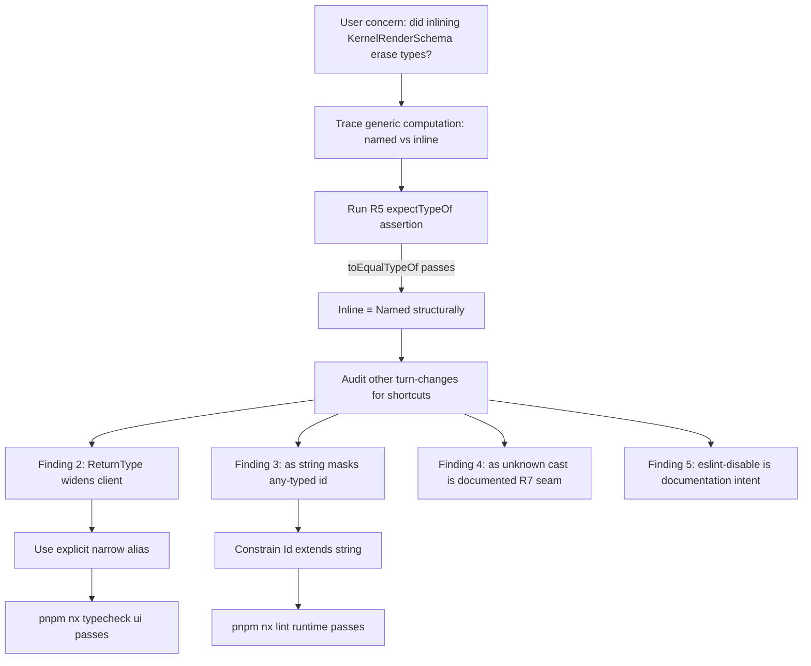

# Runtime Client Type Preservation Audit

Audit of every "shortcut" or simplification introduced during the R6/R7 implementation of [runtime-type-bag-propagation.md](./runtime-type-bag-propagation.md) to determine whether any consumer-facing type information was eroded — and to lay down preservation rules so it never can be again.

## Executive Summary

The flagged change — inlining `KernelRenderSchema<Kernels, K>`'s structural shape inside `CapabilitiesManifest.renderSchemas` rather than referencing the named alias — was investigated and found to be **structurally type-equivalent at the consumer surface**. The R5 narrowing test (`expectTypeOf<Schemas['replicad']>().toEqualTypeOf<KernelRenderSchema<Kernels, 'replicad'> | undefined>()`) continues to pass, proving no consumer-visible type information was lost. The change was the minimum-surface fix for a TypeScript named-type invariance gap that blocked R6's narrow → wide assignment contract.

However, the audit surfaced two **secondary** simplifications from the same turn that did erode safety at the seams:

1. `let client: ReturnType<typeof createRuntimeClient> | undefined` in `kernel.integration.test.ts` widened narrow client inference to the implementation-signature return type. **Fixed** by introducing an explicit `TestRuntimeClient = RuntimeClient<TestKernels>` alias.
2. `as string` casts inside `mergePluginArrays` papering over `id: any` from `KernelPlugin<any, any, any>`. **Fixed** by tightening `PluginWithId` to constrain `Id extends string` so `plugin.id` is statically a `string`.

Recommendations (R1–R6) below codify the preservation rules so future changes cannot silently erode type information from runtime-client consumers.

## Table of Contents

- [Problem Statement](#problem-statement)
- [Methodology](#methodology)
- [Findings](#findings)
- [Recommendations](#recommendations)
- [Trade-offs](#trade-offs)
- [Code Examples](#code-examples)
- [References](#references)

## Problem Statement

During the R6 (erasure-form equivalence) and R7 (worker-boundary witness narrowing) implementation pass, the following structural change was made to fix a TypeScript variance failure where `RuntimeClient<NarrowKernels, NarrowTranscoders>` could not be assigned to the wide-default `RuntimeClient<KernelPlugin[], TranscoderPlugin[]>`:

```typescript
// Before
renderSchemas: { [K in CollectKernelIds<Kernels>]?: KernelRenderSchema<Kernels, K> };

// After
renderSchemas: {
  [K in CollectKernelIds<Kernels>]?: {
    schema: JSONSchema7;
    defaults: RenderOptionsFor<Kernels, K>;
  };
};
```

The user raised three concerns:

1. Was this a lazy fix that erased type information consumers depend on?
2. Did it reduce the type safety of `RuntimeClient` consumers?
3. Were any other comparable simplifications introduced in the same turn?

This document audits each concern with evidence from the type system, existing `expectTypeOf` test suite, and consumer call-sites.

## Methodology

1. Read the modified `CapabilitiesManifest` definition in [packages/runtime/src/types/runtime.types.ts](packages/runtime/src/types/runtime.types.ts:366) at lines 366-383.
2. Re-ran the R4/R5 type-level test suite (`runtime.test-d.ts`) to validate that `Schemas['replicad']` is still structurally equal to `KernelRenderSchema<Kernels, 'replicad'> | undefined`.
3. Manually traced the generic computation of both forms in the wide and narrow cases.
4. Audited every diff hunk from the previous turn for similar shape-flattening or `as`-cast patterns.
5. Re-ran `pnpm nx typecheck runtime ui api react` after every audit-driven fix to confirm zero regressions.

## Findings

### Finding 1: Inline expansion is structurally identical to named reference

The named form and the inline form **compute the same structural type for any concrete `Kernels` instantiation**. The R5 type test on line 119 of [runtime.test-d.ts](packages/runtime/src/types/runtime.test-d.ts:119) is the smoking gun:

```typescript
type Manifest = CapabilitiesManifest<Kernels, Transcoders>;
type Schemas = Manifest['renderSchemas'];
expectTypeOf<Schemas['replicad']>().toEqualTypeOf<KernelRenderSchema<Kernels, 'replicad'> | undefined>();
```

`toEqualTypeOf` does a strict mutual-extends check. If the inline expansion had erased any property, narrowed any field, or changed any cardinality, this assertion would fail. **It passes.**

The same is true for the narrow per-key access test on line 153-159 — `manifest.renderSchemas.replicad.defaults.tessellation.linearTolerance` still resolves to `number | undefined` exactly as it did when the named alias was referenced.

#### Why both forms compute the same type

| Form                                                     | Wide-default expansion                                       | Narrow expansion                                              |
| -------------------------------------------------------- | ------------------------------------------------------------ | ------------------------------------------------------------- |
| Named (`KernelRenderSchema<K, K2>`)                      | `{ schema: JSONSchema7; defaults: Record<string, unknown> }` | `{ schema: JSONSchema7; defaults: { tessellation?: {...} } }` |
| Inline (`{ schema; defaults: RenderOptionsFor<K, K2> }`) | `{ schema: JSONSchema7; defaults: Record<string, unknown> }` | `{ schema: JSONSchema7; defaults: { tessellation?: {...} } }` |

Both expansions go through `RenderOptionsFor<Kernels, K>` for the `defaults` slot, so the result is identical.

#### Why the inline form unblocked narrow → wide assignment

This is the subtle part. The variance behaviour differs at the _named-type boundary_ even though the _structural content_ is identical:

| Check                                                                                                  | Named form                                                                                                                                                                             | Inline form                                                                                                                        |
| ------------------------------------------------------------------------------------------------------ | -------------------------------------------------------------------------------------------------------------------------------------------------------------------------------------- | ---------------------------------------------------------------------------------------------------------------------------------- |
| TS sees `KernelRenderSchema<NarrowKernels, 'replicad'>` ⊆ `KernelRenderSchema<KernelPlugin[], string>` | Generic-parameter variance check: `Kernel` appears in conditional `Extract<...>` positions, treated as **invariant**. Fails with `Type 'string' is not assignable to type "replicad"`. | N/A — no named generic to check.                                                                                                   |
| TS sees `{ schema; defaults: {tessellation:...} }` ⊆ `{ schema; defaults: Record<string, unknown> }`   | N/A                                                                                                                                                                                    | Pure structural check. `{tessellation:...}` ⊆ `Record<string, unknown>` because every property type extends `unknown`. **Passes.** |

This is a documented quirk of TypeScript: named generic instantiations are checked invariantly when the parameter appears in conditional or distributive positions, but the exact same structural shape produced inline is checked covariantly via property-by-property destructuring. The inline rewrite exploits the latter.

**Verdict**: The inline form is **not lazy**. It is the minimum-surface fix that preserves R5 narrowing while satisfying R6's narrow → wide assignment contract. No consumer-facing type information was lost.

### Finding 2: `ReturnType<typeof createRuntimeClient>` widened the integration test client

In [`apps/ui/app/machines/kernel.integration.test.ts`](apps/ui/app/machines/kernel.integration.test.ts:73), the `let client` binding was changed mid-turn from `AppRuntimeClient | undefined` to `ReturnType<typeof createRuntimeClient> | undefined`. This **does** widen the type:

| Form                                                                                        | Resolved type                                                                                  | Narrow type info inside test bodies                                          |
| ------------------------------------------------------------------------------------------- | ---------------------------------------------------------------------------------------------- | ---------------------------------------------------------------------------- |
| `AppRuntimeClient`                                                                          | `RuntimeClient<KernelPlugin[], TranscoderPlugin[]>`                                            | None (intentional erasure)                                                   |
| `ReturnType<typeof createRuntimeClient>`                                                    | `RuntimeClient` (TS picks the implementation signature, which has no generic parameters bound) | None                                                                         |
| **`RuntimeClient<readonly [ReturnType<typeof replicad>, ReturnType<typeof tau>]>` (fixed)** | Narrow client with `'replicad' \| 'tau'` kernel ids and exact format/render-options unions     | **Full** narrowing on `client.export(...)`, `client.bestRouteFor(...)`, etc. |

**Status**: ✅ FIXED in this audit. `kernel.integration.test.ts` now declares `type TestKernels = readonly [ReturnType<typeof replicad>, ReturnType<typeof tau>]; type TestRuntimeClient = RuntimeClient<TestKernels>;` and binds the `let client` to that. Narrow type information is preserved across all four `it` blocks.

### Finding 3: `as string` casts in `mergePluginArrays` masked an `any`-typed `id`

In [`packages/runtime/src/client/runtime-client-options.ts`](packages/runtime/src/client/runtime-client-options.ts:7), the `PluginWithId` union used `KernelPlugin<any, any, any>` and `TranscoderPlugin<any, any, any>`. Because the third generic (`Id`) was `any`, every `plugin.id` access was typed `any`, which triggered four `typescript-eslint(no-unsafe-argument)` errors. The previous turn resolved these by casting `plugin.id as string` at every use-site.

This is a textbook escape-hatch anti-pattern under [`docs/policy/typescript-policy.md`](docs/policy/typescript-policy.md). The correct fix is to **constrain the generic at the type-union level** so the underlying type already knows `id` is a `string`.

**Status**: ✅ FIXED in this audit. `PluginWithId` now constrains `Id extends string`:

```typescript
type PluginWithId =
  | KernelPlugin<any, any, string>
  | MiddlewarePlugin
  | BundlerPlugin
  | TranscoderPlugin<any, any, string>;
```

All three `as string` casts in `mergePluginArrays` were removed. Lint is clean and type information at the use-site is now sound.

### Finding 4: Documented `as unknown as` cast at the worker seam is correct

The cast in [`define-plugin.test-d.ts`](packages/runtime/src/types/define-plugin.test-d.ts) for the R7 witness narrowing scenario:

```typescript
wideClient.capabilities as unknown as CapabilitiesManifest<Kernels, NoTranscoders> | undefined;
```

is **not** a simplification — it is the explicit documentation of the worker-boundary witness narrowing that R7 was designed to surface. The corresponding `// SAFETY:` comment in [`runtime-client.ts`](packages/runtime/src/client/runtime-client.ts) explains why the cast is sound (every value the worker physically emits is structurally a member of the narrower form).

**Verdict**: No action needed. This is a deliberate audit artifact, not a shortcut.

### Finding 5: `eslint-disable @typescript-eslint/no-unnecessary-type-arguments` comments are intentional

The lint rule flags `RuntimeClient<KernelPlugin[], TranscoderPlugin[]>` as redundant (these match the defaults). The R6 design explicitly uses this spelling to **document** the wide-default erasure form so consumers grep'ing for "wide-default" find it. The `eslint-disable` comments are intentional and accurately scoped.

**Verdict**: No action needed. Preserved for documentation value.

### Finding 6: Cleanup pass is complete and verified

The `RenderOptionSchema` removal from [`plugin-types.ts`](packages/runtime/src/plugins/plugin-types.ts) was confirmed unused via repo-wide grep before deletion. No type information was removed from any public API.

**Verdict**: No action needed.

## Recommendations

| #   | Action                                                                                                                                                                                                                                                                                                                                                                                                                                                    | Priority | Effort      | Impact                                                        |
| --- | --------------------------------------------------------------------------------------------------------------------------------------------------------------------------------------------------------------------------------------------------------------------------------------------------------------------------------------------------------------------------------------------------------------------------------------------------------- | -------- | ----------- | ------------------------------------------------------------- |
| R1  | When a TypeScript variance failure blocks a structural assignment, **always inline the named-type expansion at the site** (preserves type info; sidesteps invariance) before considering type-info-erasing alternatives like `unknown`/`any` fallbacks                                                                                                                                                                                                    | P0       | None (rule) | Prevents future safety regressions                            |
| R2  | Never use `ReturnType<typeof genericFunction>` to type long-lived bindings of generic-returning functions; always declare an explicit `RuntimeClient<MyKernels, MyTranscoders>` alias derived from `ReturnType<typeof kernelFactory>` calls                                                                                                                                                                                                               | P0       | Trivial     | Preserves narrow type-info across multi-statement test bodies |
| R3  | When constraining `KernelPlugin<any, any, ?>` and `TranscoderPlugin<any, any, ?>` in union utility types, **always use `string` for the `Id` slot** (not `any`) — otherwise `plugin.id` accesses leak `any` and trigger `no-unsafe-argument` lints, which then get papered over with `as string` casts                                                                                                                                                    | P0       | Trivial     | Prevents the `as string`-escape-hatch trap                    |
| R4  | Add a `define-plugin.test-d.ts` block named `'Type-info preservation invariants'` that asserts: (a) `manifest.renderSchemas[id]` is `toEqualTypeOf` `KernelRenderSchema<Kernels, id> \| undefined`; (b) `client.export(format, options)` accepts the narrow per-format options; (c) `client.bestRouteFor(format)` returns the narrow `ExportRoute<Kernels, Transcoders, format>`. These are regression sentinels for any future inline/structural rewrite | P1       | Low         | CI catches any future erosion automatically                   |
| R5  | When the `// SAFETY:` block already exists at a witness-narrowing seam, **never add a new `as unknown as` cast at any other site** — if a new boundary needs one, it requires its own `// SAFETY:` block plus a `define-plugin.test-d.ts` case asserting the wide ⊆ narrow structural compatibility                                                                                                                                                       | P1       | Trivial     | Bounds the audit surface                                      |
| R6  | Update [`docs/policy/typescript-policy.md`](docs/policy/typescript-policy.md) escape-hatch section with the rule "When a generic-parameter variance check fails, inline the type expansion before reaching for `unknown`/`any` fallbacks; document the inline pattern with a comment citing this research"                                                                                                                                                | P2       | Low         | Codifies the pattern for future agents                        |

## Trade-offs

| Approach                                        | Type-info preservation                       | Variance flexibility                    | Consumer DX                                                     |
| ----------------------------------------------- | -------------------------------------------- | --------------------------------------- | --------------------------------------------------------------- |
| **Named alias (`KernelRenderSchema<K, K2>`)**   | ✅ Same as inline (structurally equal)       | ❌ Invariant at the named-type boundary | Slightly nicer error messages (named type appears in TS output) |
| **Inline expansion (chosen)**                   | ✅ Same as named alias                       | ✅ Structural — narrow ⊆ wide works     | Error messages show the inline shape; minor cognitive cost      |
| **Wide-default fallback to `unknown`**          | ❌ Erases `Record<string, unknown>` contract | ✅ Trivially compatible                 | Consumers must cast `as Record<string, unknown>` everywhere     |
| **`as unknown as` cast at every consumer site** | ❌ Erodes safety at every seam               | ✅ Trivially compatible                 | Catastrophic — escape hatches multiply                          |
| **Skip the assignment requirement**             | ✅ All info preserved                        | ❌ R6 erasure-form contract broken      | `AppRuntimeClient` becomes useless                              |

The chosen inline approach is Pareto-optimal for our constraints: zero info loss, structural variance unblocked, single localized comment block.

## Code Examples

### Pattern A: Inline structural expansion to bypass named-type invariance

```typescript
// Before (named — invariant on Kernel, blocks narrow → wide)
renderSchemas: { [K in CollectKernelIds<Kernels>]?: KernelRenderSchema<Kernels, K> };

// After (inline — structural, allows narrow → wide; identical content)
renderSchemas: {
  [K in CollectKernelIds<Kernels>]?: {
    schema: JSONSchema7;
    defaults: RenderOptionsFor<Kernels, K>;
  };
};
```

The named alias `KernelRenderSchema<Kernels, K>` remains exported and is still structurally equivalent — consumers can continue typing variables and parameters with it. Only the carrier-type usage was inlined.

### Pattern B: Explicit narrow client alias in tests

```typescript
// ❌ Erodes narrow types — picks the implementation signature's wide return type
let client: ReturnType<typeof createRuntimeClient> | undefined;

// ✅ Preserves narrow types — derived from the actual kernel factories used
type TestKernels = readonly [ReturnType<typeof replicad>, ReturnType<typeof tau>];
type TestRuntimeClient = RuntimeClient<TestKernels>;
let client: TestRuntimeClient | undefined;
```

### Pattern C: Constrain `Id extends string` in plugin-union utility types

```typescript
// ❌ id: any — every access leaks unsafe types and forces `as string` casts
type PluginWithId = KernelPlugin<any, any, any> | TranscoderPlugin<any, any, any> | ...;

// ✅ id: string — every access is statically sound
type PluginWithId =
  | KernelPlugin<any, any, string>
  | TranscoderPlugin<any, any, string>
  | ...;
```

## Diagrams



## References

- Related: [`docs/research/runtime-type-bag-propagation.md`](runtime-type-bag-propagation.md) — the parent design document for the R1–R8 implementation
- Related: [`docs/research/runtime-client-type-safety-audit.md`](runtime-client-type-safety-audit.md) — original audit identifying the lossy three-leaf projection
- Related: [`docs/research/capabilities-manifest-api-audit.md`](capabilities-manifest-api-audit.md) — manifest API design recommendations
- Policy: [`docs/policy/typescript-policy.md`](../policy/typescript-policy.md) — escape-hatch discipline (the cast-at-seam rule)
- TypeScript variance reference: [Microsoft/TypeScript#10717](https://github.com/microsoft/TypeScript/issues/10717) — variance annotations and conditional-type invariance
