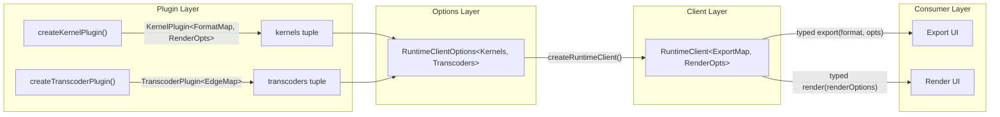

# Runtime Client Type Safety Audit

Audit of compile-time and runtime type safety gaps across the `RuntimeClient` public API, the worker-side render/export pipeline, and all consumer boundaries in the UI and API packages.

## Executive Summary

The `RuntimeClient<FormatMap>` generic pipeline was designed to carry per-format export option types from kernel plugin declarations through to `client.export()` calls. However, **the generic information is universally erased at every consumer boundary** — every site that stores, passes, or re-exports `RuntimeClient` uses the bare unparameterized form, collapsing `FormatMap` to `never` (since there is no default). Additionally, `renderOptions` are completely untyped (`Record<string, unknown>`) at every layer, and the worker-side pipeline has multiple code paths where user-provided options bypass or soft-fail schema validation. The result is that the sophisticated Zod→phantom type inference pipeline built in previous tasks adds weight but delivers **zero compile-time safety to actual consumers**.

## Problem Statement

After completing the kernel-plugin type linkage and generic inference pipeline work, the `RuntimeClient` type requires a generic argument `FormatMap` with no default. This causes TS2314 errors at every consumer site that uses bare `RuntimeClient`. The instinct is to add `= Record<string, unknown>` as a default — but this would mask the real problem: **every consumer already erases the generic**, meaning the type safety infrastructure is inert. A broader audit is needed to determine what the `RuntimeClient` surface should actually carry and enforce.

## Methodology

1. Full read of `RuntimeClient<FormatMap>` type definition, `createRuntimeClient` overloads, and `CollectFormatMap` helper
2. Grep for every `RuntimeClient` usage across all `.ts`/`.tsx` files
3. Traced option flows through `runtime-client.ts` → protocol → dispatcher → `kernel-worker.ts` for both render and export paths
4. Checked Zod validation coverage at each pipeline stage
5. Audited consumer sites for generic preservation vs erasure

## Findings

### Finding 1: FormatMap Generic Is Universally Erased at Consumer Boundaries

`RuntimeClient<FormatMap>` has no default for `FormatMap`. Every consumer stores it as bare `RuntimeClient`, which is currently a TS2314 error and, even if a default were added, would erase the `FormatMap` to `Record<string, unknown>` (making the typed `export()` overload's format/options checking inert).

| Consumer                      | Typing                                     | FormatMap |
| ----------------------------- | ------------------------------------------ | --------- |
| `cad.machine.ts` context      | `kernelClient?: RuntimeClient`             | Erased    |
| `chat-ar-button.tsx` prop     | `kernelClient?: RuntimeClient`             | Erased    |
| `use-ar.ts` param             | `kernelClient?: RuntimeClient`             | Erased    |
| `use-render.ts` ref           | `useRef<RuntimeClient>`                    | Erased    |
| `kernel-testing.utils.ts`     | `createMockRuntimeClient(): RuntimeClient` | Erased    |
| `model-benchmark-geometry.ts` | `client: RuntimeClient`                    | Erased    |
| `cad.machine.test.ts`         | `client: RuntimeClient`                    | Erased    |
| `kernel.integration.test.ts`  | `let client: RuntimeClient`                | Erased    |

**Root cause:** `RuntimeClientOptions.kernels` is typed as `KernelPlugin[]` (line 146 of `runtime-client.ts`), which erases the per-plugin `FormatMap` phantom types. The `createRuntimeClient` narrow overload uses `{ kernels: [...Plugins] }` to recover inference, but consumers don't use the inferred return type — they widen to `RuntimeClient` immediately.

### Finding 2: RuntimeClientOptions Erases the Kernel Tuple

```typescript
// runtime-client.ts:144-146
export type RuntimeClientOptions = {
  kernels: KernelPlugin[]; // <-- erased: KernelPlugin[] not KernelPlugin<M>[]
  // ...
};
```

When options are built separately (e.g. via `createRuntimeClientOptions()`) and stored as `RuntimeClientOptions`, the tuple inference from the `const Plugins` overload is lost. The only way `FormatMap` flows is if `createRuntimeClient` is called inline with a literal `kernels` tuple — but no consumer does this.

### Finding 3: renderOptions Is Completely Untyped

`renderOptions` is `Record<string, unknown>` on all public surfaces:

| Surface                          | Type                                |
| -------------------------------- | ----------------------------------- |
| `CodeInput.renderOptions`        | `Record<string, unknown>`           |
| `FileInput.renderOptions`        | `Record<string, unknown>`           |
| `setFile(file, params, options)` | `options?: Record<string, unknown>` |
| Protocol `render` command        | `options?: Record<string, unknown>` |
| `CreateGeometryInput.options`    | `Record<string, unknown>`           |

No kernel-specific render option typing exists anywhere in the public API. The `renderSchema` Zod schemas defined in `*.schemas.ts` files are only used for worker-side validation — they are not surfaced to consumers via the type system.

### Finding 4: Export Option Type Safety Is Designed but Not Delivered

The third `export()` overload carries `FormatMap`:

```typescript
export<F extends FileExtension & keyof FormatMap>(
  format: F, options?: FormatMap[F]
): Promise<ExportResult>;
```

This would type-check `format` against declared export schemas and constrain `options` per-format. However, since `FormatMap` is erased to `Record<string, unknown>` (or `{}`) at every consumer, the overload either:

- Becomes uncallable (`F extends FileExtension & keyof never` → `never`)
- Accepts any string and any options (`F extends FileExtension & keyof Record<string, unknown>` → `FileExtension`)

The actual call site in `chat-converter.tsx` (line 759) uses `kernelClient.export(format, options)` where both are `FileExtension` / `Record<string, unknown>` — no format-specific option safety.

### Finding 5: Worker-Side Render Validation Soft-Fails

`KernelWorker.validateRenderOptions()` (kernel-worker.ts, ~line 2644):

| Condition                            | Behavior                                              |
| ------------------------------------ | ----------------------------------------------------- |
| No active kernel or no render schema | Returns raw `renderOptions ?? {}` — **no validation** |
| Schema present, parse succeeds       | Returns parsed data with defaults applied             |
| Schema present, parse **fails**      | **Logs warning**, returns **raw unvalidated options** |

Invalid render options always flow through to the kernel. There is no hard-fail path for render option validation.

### Finding 6: Worker-Side Export Validation Has Hard-Fail but Gaps

`KernelWorker.exportGeometry()` (~line 917):

| Condition                                     | Behavior                                                 |
| --------------------------------------------- | -------------------------------------------------------- |
| Zod schema for format exists, parse succeeds  | Uses validated options                                   |
| Zod schema for format exists, parse **fails** | Returns `{ success: false }` with issues — **hard fail** |
| **No Zod schema** for the format              | Uses raw `options ?? {}` — **no validation**             |

Additionally, transcoder routes have gaps:

- Source format re-parse failure falls back to unvalidated `input.options`
- Target options passed to `transcoder.transcode()` have no framework-level Zod validation

### Finding 7: render-input.test-d.ts @ts-expect-error Misplacement

Four tests in `render-input.test-d.ts` have `@ts-expect-error` on the `code:` line instead of the `file:` line. For `CodeInput<T>` where `T = { 'box.ts': string }`, the type error is on `file: 'invalid.ts'` (not a key of `T`), not on the valid `code` object. The `@ts-expect-error` directive only suppresses the immediately following line, so it targets the wrong statement.

### Finding 8: No Transcoder Type Information on RuntimeClient

`TranscoderPlugin` provides no static typing for conversion capabilities. Transcoders declare edges at runtime via `discoverEdges()`, and the `CapabilitiesManifest` carries this at runtime, but:

- No compile-time knowledge of available transcode routes
- No type-checking of transcoder-specific options
- The `export()` method only knows kernel-native formats via `FormatMap`, not transcoded formats

## Recommendations

| #   | Action                                                                                                                                                                                                                                                                | Priority | Effort  | Impact                                                                                                           |
| --- | --------------------------------------------------------------------------------------------------------------------------------------------------------------------------------------------------------------------------------------------------------------------- | -------- | ------- | ---------------------------------------------------------------------------------------------------------------- |
| R1  | **Make `RuntimeClientOptions` generic** over kernel and transcoder plugin tuples to preserve type information through option building and client creation                                                                                                             | P0       | Medium  | Critical — without this, the entire inference pipeline is inert                                                  |
| R2  | **No default on `RuntimeClient`** — consumers that cannot carry generics must use explicit `RuntimeClient<Record<string, unknown>>` annotation to make erasure visible and intentional                                                                                | P0       | Low     | Prevents silent type leakage; makes erasure boundaries auditable                                                 |
| R3  | **Derive render option types from the plugins tuple** — add `__renderSchema` phantom to `KernelPlugin`, infer via `CollectRenderOptions<Plugins>` as a union of all registered kernels' render schemas; no additional generic on `RuntimeClient` needed               | P1       | Medium  | Types `renderOptions` on `CodeInput`/`FileInput`/`setFile` without requiring a kernel discriminator              |
| R4  | **Hard-fail render option validation** in `KernelWorker.validateRenderOptions()` — return `{ success: false }` with issues instead of logging and passing raw options through                                                                                         | P1       | Low     | Prevents invalid render options from silently reaching kernels                                                   |
| R5  | **Validate transcoder target options** in `executeExportWithRoute` against the edge's `optionsSchema` before calling `transcoder.transcode()`                                                                                                                         | P2       | Low     | Closes the transcoder options validation gap                                                                     |
| R6  | **Fix `@ts-expect-error` placement** in `render-input.test-d.ts` — move directives from `code:` line to `file:` line (4 occurrences)                                                                                                                                  | P0       | Trivial | Fixes 4 pre-existing test failures                                                                               |
| R7  | **Thread generics through UI boundaries** — `CadContext.kernelClient`, `useAr`, `chat-ar-button` props — using the inferred client type from `createRuntimeClient`                                                                                                    | P2       | Medium  | Delivers compile-time export/render safety to UI consumers                                                       |
| R8  | **Add hard-fail for missing export schemas** — when a kernel declares no `exportSchemas` for a format, `exportGeometry` should fail rather than pass raw options                                                                                                      | P2       | Low     | Prevents silent pass-through of arbitrary options to kernels                                                     |
| R9  | **Surface transcoder edge types on `TranscoderPlugin`** — add `__transcodeEdges` phantom carrying per-target-format option types; merge with kernel `FormatMap` in `createRuntimeClient` to produce a unified `ExportMap` covering both native and transcoded formats | P1       | High    | Closes the largest gap: transcoded formats (usdz, 3mf, obj, etc.) become compile-time typed on `client.export()` |

### R2 Rationale: No Default, Explicit Annotation

Adding `= Record<string, unknown>` as a default creates a silent escape hatch — any consumer that forgets the generic gets wide typing without the compiler complaining. Instead, every site that deliberately erases type information must annotate explicitly:

```typescript
// Intentional erasure — visible and auditable
const clientRef = useRef<RuntimeClient<Record<string, unknown>>>(undefined);

// Test mock — generic for opt-in typing
function createMockRuntimeClient<FM = Record<string, unknown>>(): RuntimeClient<FM>;
```

This keeps the compiler as an active safety net: if a consumer uses bare `RuntimeClient`, they get a TS2314 error that forces them to either thread the generic or explicitly acknowledge erasure.

### R3 Rationale: Render Options as Union, No Discriminator

A kernel discriminator (`{ kernel: 'replicad', tessellation: { ... } }`) conflicts with the auto-detection model — the user doesn't choose the kernel; the system detects it from imports. Instead, `renderOptions` should be the **union** of all registered kernels' render option types:

| Kernel          | Render Schema                                               |
| --------------- | ----------------------------------------------------------- |
| replicad        | `{ tessellation: { linearTolerance, angularTolerance } }`   |
| opencascade     | Same (shared OCCT schema)                                   |
| openscad        | `{ tessellation: { segments, minimumAngle, minimumSize } }` |
| manifold        | None                                                        |
| jscad, tau, zoo | None                                                        |

- **Single kernel setup** (most common): the union collapses to that kernel's exact type — perfect autocomplete, full safety
- **Multi kernel setup**: the union accepts any registered kernel's options; worker-side Zod validation catches mismatches at runtime

The type derives from the plugins tuple without an additional generic on `RuntimeClient`:

```typescript
type CollectRenderOptions<Plugins> =
  Plugins[number] extends KernelPlugin<any, infer R> ? R : Record<string, unknown>;

// On CodeInput / FileInput / setFile:
renderOptions?: CollectRenderOptions<Plugins>;
```

### R9 Rationale: Transcoder Type Surface

Currently `TranscoderPlugin` is `{ id, moduleUrl, options? }` — no type information at all. Transcoded formats (usdz, 3mf, obj, etc.) are invisible to the type system: `client.export('usdz', { quality: 0.8 })` is completely untyped because `usdz` is not in `FormatMap` (kernel-only).

The fix mirrors the kernel pattern: `TranscoderPlugin` carries a phantom `EdgeMap` declaring per-target-format option types. The `createRuntimeClient` infers both plugin tuples and merges them into a single `ExportMap`:

**Key complexity:** transcoded export options are the **merge** of kernel source format options + transcoder edge options. For a `glb → usdz` route:

- Kernel GLB options: `{ tessellation, coordinateSystem }`
- Transcoder edge options: `{ quality }`
- Merged USDZ options: `{ tessellation, coordinateSystem, quality }`

The manifest already merges these as JSON Schema for the UI — the type system should mirror this at compile time.

### Implementation Strategy

R1, R3, and R9 form a coherent type-level refactoring that should be implemented together. R2 is applied at each consumer boundary as generics are threaded through.



Where `ExportMap = FormatMap & MergedTranscodeMap` — kernel-native formats from `FormatMap`, transcoded targets with merged kernel+edge options from `MergedTranscodeMap`.

R4-R5 are runtime validation fixes that should be implemented independently — they don't require type changes, just behavioral fixes in the worker pipeline.

R6 is a trivial test fix.

R7 depends on R1/R3/R9 being complete and can be done incrementally per consumer.

## Code Examples

### R1: Generic RuntimeClientOptions

```typescript
// Current — erases kernel and transcoder types
export type RuntimeClientOptions = {
  kernels: KernelPlugin[];
  transcoders?: TranscoderPlugin[];
  // ...
};

// Proposed — preserves both plugin tuples
export type RuntimeClientOptions<
  Kernels extends readonly KernelPlugin<any, any>[] = KernelPlugin[],
  Transcoders extends readonly TranscoderPlugin<any>[] = TranscoderPlugin[],
> = {
  kernels: [...Kernels];
  transcoders?: [...Transcoders];
  // ...
};
```

### R2: Explicit annotation at erasure boundaries

```typescript
// WRONG — adding a default hides type leakage
export type RuntimeClient<FormatMap = Record<string, unknown>> = { ... };

// CORRECT — no default; consumers must be explicit
export type RuntimeClient<ExportMap extends Record<string, unknown>> = { ... };

// Consumer that cannot carry generics — intentional, visible erasure
const clientRef = useRef<RuntimeClient<Record<string, unknown>>>(undefined);

// Test mock — generic for opt-in typing
export function createMockRuntimeClient<
  FM extends Record<string, unknown> = Record<string, unknown>,
>(): RuntimeClient<FM> { ... }
```

### R3: Render option types derived from plugins

```typescript
// KernelPlugin gains a second phantom for render options
declare const __renderSchema: unique symbol;

export type KernelPlugin<
  FormatMap extends Record<string, unknown> = {},
  RenderOptions extends Record<string, unknown> = Record<string, unknown>,
> = {
  // ...existing fields...
  readonly [__exportSchemas]?: FormatMap;
  readonly [__renderSchema]?: RenderOptions;
};

// createKernelPlugin infers both phantoms from config
export function createKernelPlugin<
  ES extends Record<string, z.ZodType>,
  RS extends z.ZodType,
>(
  config: KernelPluginConfig<ES> & { renderSchema: RS },
): (options?: ...) => KernelPlugin<ResolveFormatMap<ES>, z.infer<RS>>;

// CollectRenderOptions produces a union across registered kernels
type CollectRenderOptions<Plugins extends readonly KernelPlugin<any, any>[]> =
  Plugins[number] extends KernelPlugin<any, infer R> ? R : Record<string, unknown>;

// CodeInput / FileInput use the derived type
export type CodeInput<T, RenderOpts> = {
  code: T;
  renderOptions?: RenderOpts;  // was Record<string, unknown>
  // ...
};
```

### R4: Hard-fail render validation

```typescript
// Current — soft fail
if (!parseResult.success) {
  this.logger.warn('Render option validation failed, using raw options');
  return renderOptions ?? {};
}

// Proposed — hard fail
if (!parseResult.success) {
  return {
    success: false,
    issues: parseResult.error.issues.map((i) => ({
      message: i.message,
      severity: 'error' as const,
    })),
  };
}
```

### R6: Fix @ts-expect-error placement

```typescript
// Current (wrong — @ts-expect-error on valid `code` line)
void client.render({
  // @ts-expect-error -- missing `invalid.ts` file
  code: { 'box.ts': 'const x = 1;' },
  file: 'invalid.ts',
});

// Fixed (correct — @ts-expect-error on invalid `file` line)
void client.render({
  code: { 'box.ts': 'const x = 1;' },
  // @ts-expect-error -- 'invalid.ts' is not a key of code
  file: 'invalid.ts',
});
```

### R9: Transcoder type surface and merged ExportMap

```typescript
// TranscoderPlugin gains a phantom for edge option types
declare const __transcodeEdges: unique symbol;

export type TranscoderPlugin<EdgeMap extends Record<string, unknown> = {}> = {
  id: string;
  moduleUrl: string;
  options?: Record<string, unknown>;
  readonly [__transcodeEdges]?: EdgeMap;
};

// createTranscoderPlugin infers edge types from static edge declarations
export function createTranscoderPlugin<Edges extends Record<string, z.ZodType>>(
  config: TranscoderPluginConfig<Edges>,
): TranscoderPlugin<InferEdgeMap<Edges>>;

// MergedExportMap combines kernel-native and transcoded formats
// For each transcoder edge (from → to), merged options = FormatMap[from] & EdgeOptions[to]
type MergedExportMap<
  FM extends Record<string, unknown>,
  TM extends Record<string, { from: string; options: unknown }>,
> = FM & {
  [K in keyof TM]: K extends string
    ? TM[K] extends { from: infer F; options: infer O }
      ? F extends keyof FM
        ? FM[F] & O
        : O
      : never
    : never;
};

// createRuntimeClient infers both tuples
export function createRuntimeClient<
  const Kernels extends KernelPlugin<any, any>[],
  const Transcoders extends TranscoderPlugin<any>[],
>(
  options: RuntimeClientOptions<Kernels, Transcoders>,
): RuntimeClient<MergedExportMap<CollectFormatMap<Kernels>, CollectTranscodeMap<Transcoders>>>;
```

## Appendix: Full Consumer Inventory

### Files with bare `RuntimeClient` (TS2314 errors)

| File                                                       | Line(s)     | Usage Pattern              |
| ---------------------------------------------------------- | ----------- | -------------------------- |
| `packages/runtime/src/testing/kernel-testing.utils.ts`     | 840-841     | Return type + mock generic |
| `packages/react/src/hooks/use-render.ts`                   | 101         | `useRef<RuntimeClient>`    |
| `packages/react/src/hooks/use-render.test.ts`              | 39          | Helper return type         |
| `apps/ui/app/machines/cad.machine.ts`                      | 43, 51      | Context + event types      |
| `apps/ui/app/routes/projects_.$id/chat-ar-button.tsx`      | 42          | Component prop             |
| `apps/ui/app/hooks/use-ar.ts`                              | 67          | Hook parameter             |
| `apps/ui/app/machines/cad.machine.test.ts`                 | 23          | Test helper type           |
| `apps/ui/app/machines/kernel.integration.test.ts`          | 73          | Variable declaration       |
| `apps/api/app/benchmarks/model-benchmark-geometry.ts`      | 43, 52, 162 | Function signatures        |
| `apps/api/app/benchmarks/model-benchmark-geometry.test.ts` | 29          | Variable declaration       |
| `apps/ui/content/docs/(runtime)/api/props/client.ts`       | 1-7         | Re-export                  |

### Export call sites (all untyped)

| File                     | Call                                   | Format typing    | Options typing            |
| ------------------------ | -------------------------------------- | ---------------- | ------------------------- |
| `chat-converter.tsx:759` | `kernelClient.export(format, options)` | `FileExtension`  | `Record<string, unknown>` |
| `cad.machine.ts`         | Event-driven `export(format, options)` | `FileExtension`  | `Record<string, unknown>` |
| `use-ar.ts`              | `kernelClient.export('usdz')`          | Literal `'usdz'` | None                      |

### Render option validation gaps

| Pipeline Stage                           | Validation                         | Failure Mode                    |
| ---------------------------------------- | ---------------------------------- | ------------------------------- |
| `RuntimeClient.render()`                 | None                               | Pass-through                    |
| Protocol wire                            | None                               | `Record<string, unknown>`       |
| Dispatcher                               | None                               | Forward as-is                   |
| `KernelWorker.validateRenderOptions()`   | Zod safeParse                      | **Soft fail** — warns, uses raw |
| `KernelRuntimeWorker.onCreateGeometry()` | Zod safeParse (empty options only) | **Soft fail** — uses raw        |
| Kernel `createGeometry()`                | Kernel-specific                    | Varies                          |

### Export option validation gaps

| Pipeline Stage                  | Validation                       | Failure Mode                                                 |
| ------------------------------- | -------------------------------- | ------------------------------------------------------------ |
| `RuntimeClient.export()`        | None                             | Pass-through                                                 |
| Protocol wire                   | None                             | `Record<string, unknown>`                                    |
| Dispatcher                      | None                             | Forward as-is                                                |
| `KernelWorker.exportGeometry()` | Zod safeParse (if schema exists) | **Hard fail** if schema exists; **no validation** if missing |
| Transcode source re-parse       | Zod safeParse                    | **Soft fail** — uses raw on parse failure                    |
| Transcode target options        | None                             | Passed unvalidated to transcoder                             |
