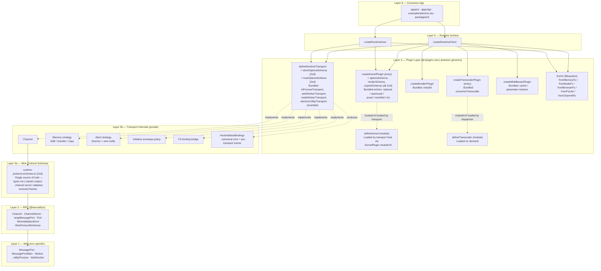
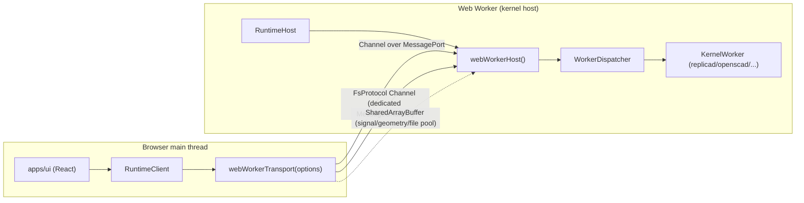
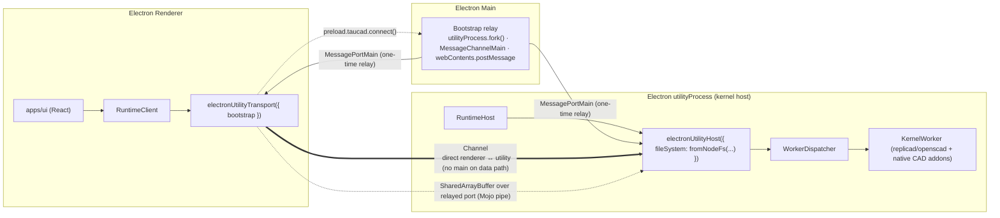
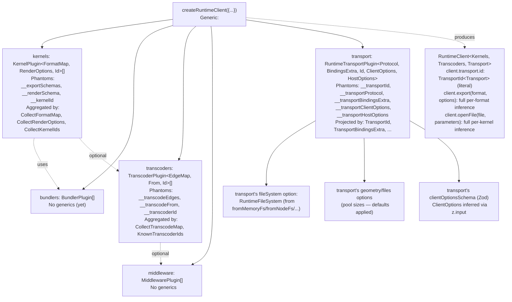
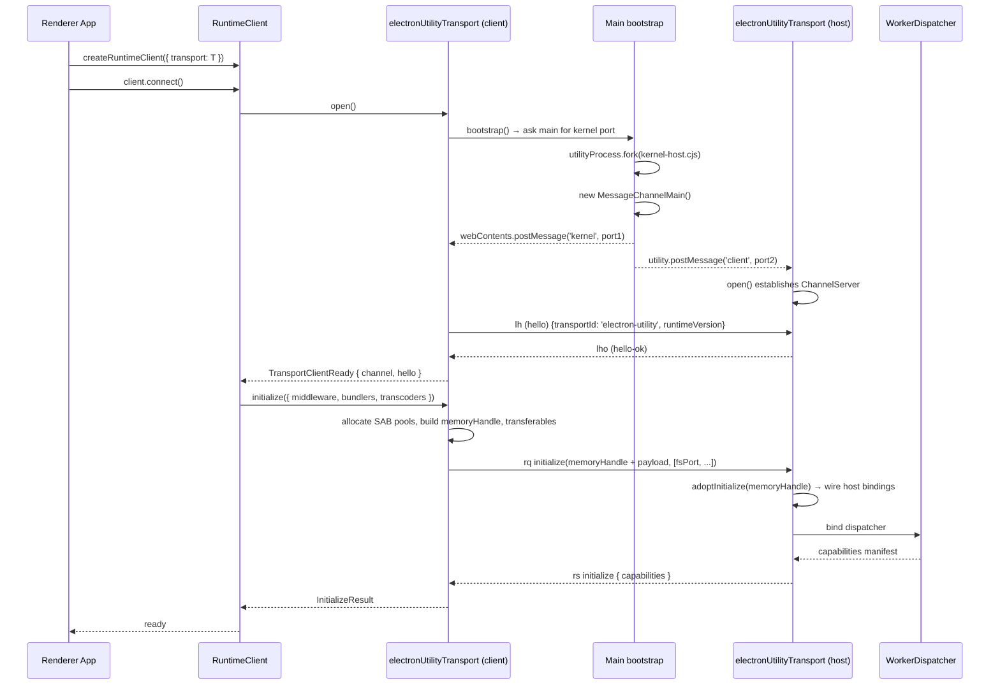
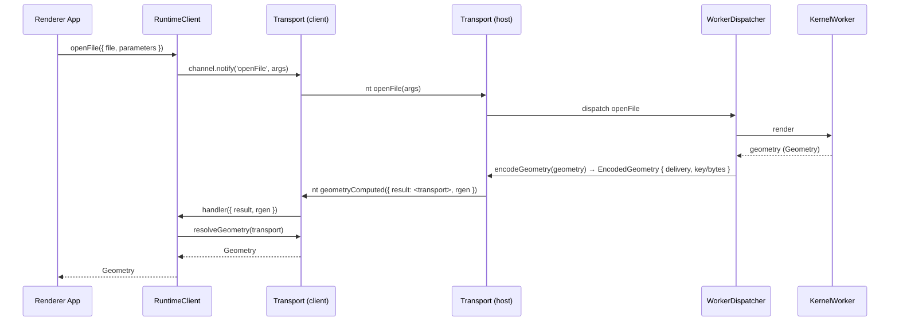

# Runtime Transport Architecture (v6 blueprint)

Canonical primitive set for the Tau runtime: how transports, channels, kernels, filesystems, bundlers, transcoders, and middleware compose into a runtime client/host pair that runs identically across in-process, browser-worker, Node worker, and Electron utility-process topologies.

## Executive Summary

This document is the single, prescriptive blueprint for the next planning cycle. It supersedes both [`electron-rpc-transport-architecture.md`](./electron-rpc-transport-architecture.md) and [`transport-capability-ownership.md`](./transport-capability-ownership.md). The substantive change against those documents is one collapse and four strict rules.

The collapse: the prior architecture had three sibling planes — `Port.capabilities` (wire facts), `BackplaneDeclaration` (domain bindings) and `RuntimeRunner` (where the kernel runs). All three are folded into one primitive, **`defineRuntimeTransport`**. A transport now owns the wire, the channel, the kernel host, the memory strategies (SAB / transferables / copy), the cooperative-abort path, the filesystem bridging, and the `initialize` envelope policy as one composable unit.

The four strict rules:

1. **Each transport maximises its own performance for its wire, only degrading when the consumer explicitly opts out.** Capabilities are no longer negotiated through public API surface — they are an implementation detail of the transport. The consumer picks a transport that fits their environment and the transport silently chooses the fastest path its wire allows. This eliminates the `Port.capabilities` leak that violated [`library-api-policy.md`](../policy/library-api-policy.md) §22 Antipattern 5 and reduces the consumer-facing surface to one decision: "which transport?"

2. **Every plugin layer carries phantom generics for end-to-end type inference.** `RuntimeTransportPlugin<Protocol, BindingsExtra, Id, ClientOptions, HostOptions>` mirrors the existing `KernelPlugin<FormatMap, RenderOptions, Id>` and `TranscoderPlugin<EdgeMap, From, Id>` pattern. `HostInitializeBindings<TExtra>` is generic over the per-transport bindings extension so future transports can add their own bindings without touching the runtime core. Consumer call sites stay zero-annotation: `client.transport.id` narrows to `'web-worker'` literally; `webWorkerTransport({ url, fileSystem })` rejects unknown options at compile time.

3. **The wire protocol is authored as Zod schemas, not hand-written TypeScript.** `runtime-protocol.schemas.ts` is the single source of truth — types derive via `z.input` / `z.output` and the channel server validates received frames at the wire boundary. Mirrors the existing kernel pattern where `optionsSchema` / `renderSchema` / `exportSchemas` drive both compile-time inference and runtime validation. Catches mismatched runtime versions, malformed payloads, and renderer-side type drift loudly at the boundary instead of silently corrupting later.

4. **Kernel and plugin APIs are unchanged.** `createKernelPlugin(...)` produces the plugin entry registered in `createRuntimeClient`; `defineKernel(...)` produces the kernel module loaded inside the worker via the plugin's `moduleUrl`. **There is no `worker` field on `KernelPlugin`** — workers are spawned by the transport, not by the kernel plugin. The v6 transport API extends this two-layer pattern: `defineRuntimeTransport(...)` is the only `defineX` that doubles as a plugin factory because a transport's `client` and `host` factories live in the same source file.

The runtime core (`RuntimeClient`, `RuntimeHost`, `RuntimeWorkerClient`, `WorkerDispatcher`) becomes thin. It composes plugins (kernels, bundlers, transcoders, middleware) and delegates every wire concern to the transport. `@taucad/rpc` stays as a separate package because `Channel<P>` is a non-trivial protocol (correlation, cancel, transferables sidecar, lifecycle, hello/bye, optional schema validation) used by transport authors and by adjacent products like the FS bridge — it is the right reuse boundary, not a wrapper to be inlined.

Topology choices are unchanged from the v5 work and remain the recommended targets:

- **In-process**: single isolate, kernel runs on the main thread.
- **Browser**: main thread ↔ Web Worker, kernel in the worker.
- **Node**: main isolate ↔ `worker_threads`, kernel in the worker.
- **Electron (Topology C)**: renderer ↔ main-mediated `MessageChannelMain` ↔ `utilityProcess` kernel host. Renderer never talks to main for runtime data; the main process is the bootstrap relay only.

The v5 Electron PoC findings (renderer↔main `MessagePort`s drop SAB and silently fail when carrying mixed transferables; `utilityProcess` is the idiomatic Electron analogue of VS Code's Extension Host) are retained verbatim because they are environmental facts, not architectural choices.

## Table of Contents

1. [Problem Statement](#problem-statement)
2. [Methodology](#methodology)
3. [Eigenquestions Resolved](#eigenquestions-resolved)
4. [Findings Carried Forward](#findings-carried-forward)
5. [Target Architecture](#target-architecture)
6. [The Primitives](#the-primitives)
7. [`defineRuntimeTransport` — Concrete TypeScript](#defineruntimetransport--concrete-typescript)
8. [Generic Type Inference Pipeline](#generic-type-inference-pipeline)
9. [Reference Transport Implementations](#reference-transport-implementations)
10. [Wire Protocol Validation (Zod Schemas)](#wire-protocol-validation-zod-schemas)
11. [Channel Messages on the Wire](#channel-messages-on-the-wire)
12. [Mermaid Diagrams](#mermaid-diagrams)
13. [Files to Delete](#files-to-delete)
14. [Files to Add](#files-to-add)
15. [Migration Path from v5](#migration-path-from-v5)
16. [Trade-offs](#trade-offs)
17. [Assumptions](#assumptions)
18. [Open Questions / Deferred](#open-questions--deferred)
19. [References](#references)
20. [Appendix A — Public API Map](#appendix-a--public-api-map)
21. [Appendix B — Conformance Tests](#appendix-b--conformance-tests)

## Problem Statement

The v5 architecture exposed `PortCapabilities` (a wire-fact bag containing `sab`, `transfer`, `pool`, `signalSlot`) on a public type and required the runtime to read those bits to assemble the `initialize` envelope and to pick the geometry-delivery tier. Three problems followed:

1. **Cross-layer leak.** `library-api-policy.md` §22 Antipattern 5 says wire primitives must not appear in cross-layer public option types. `Port.capabilities` _was_ a wire-fact bag exposed on the public `Port<T>` type and read by `runtime-worker-dispatcher.ts` to pick `pool/transfer` tiers — a textbook violation.
2. **Doc/code drift.** `transport-capability-ownership.md` claimed tiering ran inside `@taucad/rpc.Channel`. It does not — the actual tiering lives in `packages/runtime/src/framework/runtime-worker-dispatcher.ts:148` (`readDeliveryCapabilities(port)`). The runtime, not the channel, was reading wire facts.
3. **Two abstractions doing one job.** `RuntimeRunner` ("where does the kernel run") and `Port` ("how is the wire shaped") were sibling concerns in the public API even though every realistic deployment couples them (a Web Worker wire implies a Web Worker kernel host; a `utilityProcess` wire implies a `utilityProcess` kernel host). The consumer was forced to compose two things that always vary together.

The v6 blueprint resolves all three by collapsing both `RuntimeRunner` and `PortCapabilities` into the new `RuntimeTransport` primitive. The transport owns the wire, the kernel host, the memory strategies, and the initialize policy as one unit. The runtime core never reads wire facts; it asks the transport for typed handles and lets the transport pick the fastest path its wire supports.

## Methodology

This blueprint was derived from:

- A line-by-line read of `packages/runtime/src/framework/runtime-worker-{client,dispatcher}.ts`, `packages/runtime/src/framework/runtime-message-adapter.ts`, `packages/runtime/src/runner/*.ts`, `packages/rpc/src/{channel,port,wire,multiplex}.ts`, and the v5 Electron PoC files under `examples/electron-tau/src/main/`.
- Cross-referencing the prior research docs listed in `related:` plus `docs/research/runtime-channel-blueprint-v5.md` for the channel/wire ground truth and `docs/research/runtime-async-event-contract.md` for the async-materialisation rules that bound any new primitive.
- Adversarial review of the previously proposed simplified `defineTransport` model against actual runtime code paths to detect drift between proposal and implementation.
- The four user-confirmed open-question answers: ship a consumer-owned Electron kernel-host script, keep `fromX` factories separate per FS source, use the minimum protocol primitive set, and defer multiplexing.

Where this document refers to existing code by file path it is current as of the working tree at the date in `updated`. Where it refers to **proposed** files (new shape) it uses the explicit prefix "**(NEW)**".

## Eigenquestions Resolved

The eigenquestion of v5 was: _"who owns capability negotiation between the wire, the channel, and the runtime?"_ The v6 answer rejects the framing — there is no negotiation to own because there is nothing to negotiate.

| #   | Question                                                                     | v5 answer                                                                | v6 answer                                                                                                                                                                                                                                                                                                                                                                                                                                                                                                                                     |
| --- | ---------------------------------------------------------------------------- | ------------------------------------------------------------------------ | --------------------------------------------------------------------------------------------------------------------------------------------------------------------------------------------------------------------------------------------------------------------------------------------------------------------------------------------------------------------------------------------------------------------------------------------------------------------------------------------------------------------------------------------- |
| E1  | Who owns capability negotiation?                                             | Split between `Port.capabilities`, `BackplaneRequest`, runtime branching | The transport plugin. There is no negotiation surface; the consumer picks a transport and the transport unconditionally uses the fastest path its wire supports.                                                                                                                                                                                                                                                                                                                                                                              |
| E2  | Should the runtime read `Port.capabilities`?                                 | Yes (current behaviour, but called out as policy violation)              | No. `PortCapabilities` is removed from the public `Port<T>` shape entirely. The runtime never reads wire facts.                                                                                                                                                                                                                                                                                                                                                                                                                               |
| E3  | Should `RuntimeRunner` and the wire be separate primitives?                  | Yes (`runner` + `connect({ port })` as sibling args)                     | No. Both fold into `RuntimeTransport`. The transport spawns the kernel host, opens the wire, and bridges them.                                                                                                                                                                                                                                                                                                                                                                                                                                |
| E4  | Should the consumer ever pass a raw `MessagePort` to `createRuntimeClient`?  | Yes (`fromPort(port)`, `connect({ port })`)                              | No. Wire primitives never appear on the public consumer-facing surface. They appear only inside transport plugin implementations and inside `@taucad/rpc` adapters used by transport authors.                                                                                                                                                                                                                                                                                                                                                 |
| E5  | Where do `BackplaneDeclaration` / `BackplaneRequest` live?                   | New plane in `runner/backplanes.ts`                                      | Deleted. Their job is absorbed by the transport's `describe()` (diagnostic only) and by the consumer-facing transport options (e.g. `geometry: { poolBytes }`).                                                                                                                                                                                                                                                                                                                                                                               |
| E6  | Should `@taucad/rpc` remain a separate package?                              | Yes                                                                      | Yes — confirmed. `Channel<P>` is a substantial protocol used by transport authors and the FS bridge; folding it into `@taucad/runtime` would not reduce surface, only couple unrelated reuse points.                                                                                                                                                                                                                                                                                                                                          |
| E7  | Should the channel ship a built-in multiplexer?                              | Yes (`packages/rpc/src/multiplex.ts`)                                    | No (deferred). Each concern gets a dedicated channel. Revisit when a real second-channel-per-wire requirement appears.                                                                                                                                                                                                                                                                                                                                                                                                                        |
| E8  | Should the runtime ship the Electron transport?                              | Yes                                                                      | No (yet). The Electron PoC ships its own kernel-host script and its own `electronUtilityTransport()` built atop `defineRuntimeTransport`. It moves into the runtime once stable.                                                                                                                                                                                                                                                                                                                                                              |
| E9  | Should each FS source share a single `from(...)` factory?                    | One `from(...)` discriminator                                            | Separate `fromX` factories per source — `fromMemoryFs`, `fromNodeFs`, `fromBrowserFs`, `fromChannelFs`. Each returns the same `RuntimeFileSystem` opaque type.                                                                                                                                                                                                                                                                                                                                                                                |
| E10 | What protocol primitives does the channel need?                              | `call`, `notify`, `onNotify`, `listen`                                   | Minimum needed: `call`, `notify`, `onNotify`. `listen` is retained because the FS bridge already uses it and it costs nothing to keep — it is not part of the runtime protocol surface.                                                                                                                                                                                                                                                                                                                                                       |
| E11 | Should `initialize` carry a structured `memoryHandle`?                       | Yes — runtime assembles it from wire facts                               | Yes — but the **transport** assembles it. The runtime calls `transport.initialize({ middleware, transcoders, ... })`; the transport adds whatever shared memory and ports its wire allows.                                                                                                                                                                                                                                                                                                                                                    |
| E12 | Should `RuntimeTransport` carry phantom generics like `KernelPlugin` does?   | (not addressed)                                                          | Yes — the transport plugin carries `<Protocol, BindingsExtra, Id, ClientOptions, HostOptions>` phantom carriers using the same `unique symbol` pattern as `KernelPlugin`/`TranscoderPlugin`. `HostInitializeBindings<TExtra>` is generic over the transport's per-instance binding shape so each transport contributes its own bindings without coupling the dispatcher to one fixed shape. The runtime client's `RuntimeClient<Kernels, Transcoders, Transport>` carries the transport's phantom so descriptor-typed values flow end-to-end. |
| E13 | Should the wire protocol be authored as Zod schemas (kernel pattern parity)? | (not addressed; protocol typed via TypeScript only)                      | Yes — every call/notify in `RuntimeProtocol` is authored as a Zod schema in `runtime-protocol.schemas.ts`. Types derive via `z.input` / `z.output`; the channel server validates received frames at the wire boundary. Same single-source-of-truth pattern kernels already use for `optionsSchema` / `renderSchema` / `exportSchemas`.                                                                                                                                                                                                        |

## Findings Carried Forward

These findings from prior research are factual / environmental and remain in force.

### Finding 1 — Electron renderer↔main is the weakest wire

`MessageChannelMain` ports that cross the renderer↔main boundary cannot carry `SharedArrayBuffer` and silently drop messages whose payload mixes `MessagePort` transferables with other complex objects. (`event.data === null` was the v5 bug.) The fix is structural, not protocol-level: do not put the kernel runner on this wire.

### Finding 2 — `utilityProcess` is the idiomatic Electron compute host

`utilityProcess.fork()` produces a Node-capable child with a stable `parentPort` and supports direct `MessageChannelMain` port handoff from the renderer (relayed by main). This mirrors VS Code's Extension Host and is the only Electron primitive that simultaneously gives Node addons, off-thread compute, and SAB-capable ports between the renderer and the host.

### Finding 3 — Topology C is the recommended Electron shape

```
renderer  ─── direct MessagePortMain ─── utilityProcess (kernel host)
             ↑
       main process (bootstrap relay only — never on the data path)
```

The main process spawns the utility process, creates a `MessageChannelMain`, and posts one half to each peer. Subsequent runtime traffic flows directly renderer↔utility — main is never woken up for runtime calls.

### Finding 4 — Layered FS authority (VS Code precedent)

Each Electron process holds its own `RuntimeFileSystem` instance pointed at the project root. The renderer and the utility process do **not** share an FS handle over the wire; they each call their own local FS. Cache invalidation flows over a side channel (a thin RPC bridge) when needed. This avoids the v5 trap where the kernel had to read CAD bytes through an `IpcMainInvoke → MessageChannelMain → kernel` round-trip.

### Finding 5 — In-renderer worker topology stays unchanged

Browser topology continues to be `main ↔ Web Worker`, and the kernel runs in the worker. There is no benefit to a "main-worker plus runner-worker" hierarchy because browser main threads do not host CPU-bound work the way Electron's main process does (Tau's main thread is React + dockview, not native bindings).

### Finding 6 — `Channel<P>` is non-trivial and worth keeping

The protocol implements: hello/bye lifecycle, request correlation, cancel, error mapping, transferables sidecar (`WithTransferables`), flow control, stream subscriptions (`listen`), and graceful close. Replacing it with bare `postMessage`/`onMessage` would push every transport author to reimplement these. Conclusion: keep `@taucad/rpc.Channel` as the single typed-RPC primitive transport authors use.

### Finding 7 — `library-api-policy.md` §22 Antipattern 5 binds this design

Wire primitives (`MessagePort`, `SharedArrayBuffer`, `Worker`) must not appear on cross-layer public option objects. The v6 design enforces this by making `RuntimeTransport` the only thing the consumer composes; wire primitives appear only inside transport implementations and the `@taucad/rpc` boundary used by transport authors.

### Finding 8 — Async event materialisation rules apply

Per `runtime-async-event-contract.md`, transports must preserve sync-vs-async boundaries: an `onMessage` handler that returns a promise must not race against the next message dispatch. The transport facade enforces this by serialising message dispatch through the same `Channel<P>` primitive that already passes its async tests.

### Finding 9 — Generic inference must propagate through every plugin layer

The kernel/transcoder plugin layer already implements zero-annotation type inference end-to-end via the patterns documented in [`generic-inference-pipeline.md`](./generic-inference-pipeline.md): unique-symbol phantom carriers (`__exportSchemas`, `__renderSchema`, `__kernelId`, `__transcodeEdges`, `__transcodeFrom`, `__transcoderId`), per-plugin tuple aggregators (`CollectFormatMap`, `CollectKernelIds`, `CollectRenderOptions`, `CollectTranscodeMap`, `KnownTranscoderIds`), and config-as-source inference driven by Zod schemas (`optionsSchema`, `exportSchemas`, `renderSchema`). Three constraints follow for the transport layer:

1. **`RuntimeTransport` must carry phantom generics symmetric to `KernelPlugin`.** Its phantoms are `Protocol` (the wire protocol map), `BindingsExtra` (per-transport host bindings), `Id` (the literal transport id), `ClientOptions` (inferred from `clientOptionsSchema` if present), and `HostOptions` (inferred from `hostOptionsSchema` if present). Without these carriers, `RuntimeClient<Kernels, Transcoders, Transport>` cannot retain transport-specific type information through composition.

2. **`HostInitializeBindings` must be generic.** Hardcoding the bindings shape (`{ geometryPool?, filePool?, abortSignal, fileSystem }`) couples every transport to one fixed contract — a future transport that wants to add bindings (a remote auth context, a GPU device handle, a streaming telemetry sink) cannot extend the type without modifying the runtime core. The canonical core (`fileSystem`, `abort`, `geometryDelivery`, `fileDelivery`) plus a per-transport `BindingsExtra` extension slot is the same pattern `KernelDefinition` uses for `Context`/`NativeHandle`/`SerializedHandle`.

3. **Same partial-inference workarounds apply.** TypeScript's partial inference limitation (any explicit generic parameter forces all others to defaults) means the transport's generics must be fully inferable from the definition object. The `defineRuntimeTransport` factory takes Zod schemas for client/host options so types derive via `z.input`, exactly as `createKernelPlugin` does.

The full chain — `defineRuntimeTransport(definition) → RuntimeTransportPlugin<Protocol, BindingsExtra, Id, ClientOptions, HostOptions> → createRuntimeClient({ transport }) → RuntimeClient<Kernels, Transcoders, Transport>` — preserves type information at every seam.

## Target Architecture

### Layered model

```
┌────────────────────────────────────────────────────────────────────┐
│ Layer 6 — Consumer App                                             │
│   apps/ui, apps/api, examples/electron-tau, packages/cli           │
│   "I want a runtime that runs CAD code"                            │
└────────────────────────────────────────────────────────────────────┘
                              │
                              ▼
┌────────────────────────────────────────────────────────────────────┐
│ Layer 5 — Runtime Surface                                          │
│   createRuntimeClient(...)  ·  createRuntimeHost(...)              │
│   Composes plugins; never touches wires.                           │
└────────────────────────────────────────────────────────────────────┘
                              │
                              ▼
┌────────────────────────────────────────────────────────────────────┐
│ Layer 4 — Plugin Layer (all "defineX" / "fromX" / "createXPlugin") │
│   defineRuntimeTransport, defineKernel, defineTranscoder           │
│   createKernelPlugin, createBundlerPlugin,                         │
│   createTranscoderPlugin, createMiddlewarePlugin                   │
│   fromMemoryFs, fromNodeFs, fromBrowserFs, fromFsLike, fromChannelFs│
│   All plugins carry phantom generics for end-to-end inference.     │
└────────────────────────────────────────────────────────────────────┘
                              │
                              ▼
┌────────────────────────────────────────────────────────────────────┐
│ Layer 3a — Wire Protocol Schemas (Zod)                             │
│   runtime-protocol.schemas.ts  ·  WireProtocolSchemas<P>           │
│   Single source of truth for types AND validation.                 │
└────────────────────────────────────────────────────────────────────┘
                              │
                              ▼
┌────────────────────────────────────────────────────────────────────┐
│ Layer 3b — Transport Internals (private to each transport plugin)  │
│   Channel<RuntimeProtocol>  ·  Memory strategy (SAB/transfer/copy) │
│   Abort strategy (Atomics + wire notify)                           │
│   Initialize envelope policy  ·  FS binding bridge                 │
│   HostInitializeBindings<TExtra>  ·  EncodedGeometry/EncodedFile   │
└────────────────────────────────────────────────────────────────────┘
                              │
                              ▼
┌────────────────────────────────────────────────────────────────────┐
│ Layer 2 — RPC Primitives (@taucad/rpc)                             │
│   Channel<P>, ChannelServer, wrapMessagePort, Port<T>              │
│   WireValidationError (thrown when frame fails schema validation)  │
│   Used only by transport plugin authors                            │
└────────────────────────────────────────────────────────────────────┘
                              │
                              ▼
┌────────────────────────────────────────────────────────────────────┐
│ Layer 1 — Wire Primitives (environment-specific)                   │
│   MessagePort (DOM), MessagePort (Node worker_threads),            │
│   MessagePortMain (Electron), Worker, utilityProcess, WebSocket    │
└────────────────────────────────────────────────────────────────────┘
```

The hard rule between layers: **each layer only depends on the layer immediately below it.** Layer 5 (the runtime surface) never imports from Layer 1 (raw wire primitives). Layer 4 transports import from Layer 2 (`@taucad/rpc`), never expose Layer 1 types on their public option shapes.

### Primitive inventory

| Primitive                  | Factory                                                         | Layer | Owner               | Purpose                                                                                                                                                                                                                                                      |
| -------------------------- | --------------------------------------------------------------- | ----- | ------------------- | ------------------------------------------------------------------------------------------------------------------------------------------------------------------------------------------------------------------------------------------------------------ |
| `RuntimeClient`            | `createRuntimeClient`                                           | 5     | runtime             | Top-level client API the consumer calls. Generic over `<Kernels, Transcoders, Transport>`.                                                                                                                                                                   |
| `RuntimeHost`              | `createRuntimeHost`                                             | 5     | runtime             | Kernel-host API used inside worker / utility-process scripts. Generic over `<Kernels, Transport>`.                                                                                                                                                           |
| `RuntimeTransportPlugin`   | `defineRuntimeTransport`                                        | 4     | runtime/transport   | Author-facing factory for new transports. Returns a `{ id, client, host }` plugin with phantom generics for `<Protocol, BindingsExtra, Id, ClientOptions, HostOptions>`.                                                                                     |
| `inProcessTransport`       | function (built via `defineRuntimeTransport`)                   | 4     | runtime/transport   | Bundled transport for same-isolate kernel hosting.                                                                                                                                                                                                           |
| `webWorkerTransport`       | function (built via `defineRuntimeTransport`)                   | 4     | runtime/transport   | Bundled transport for browser Web Worker kernel hosting.                                                                                                                                                                                                     |
| `nodeWorkerTransport`      | function (built via `defineRuntimeTransport`)                   | 4     | runtime/transport   | Bundled transport for Node `worker_threads` kernel hosting.                                                                                                                                                                                                  |
| `electronUtilityTransport` | function (built via `defineRuntimeTransport`)                   | 4     | example             | Example-owned transport for Electron Topology C. Promotes to runtime once stable.                                                                                                                                                                            |
| `RuntimeFileSystem`        | `fromX` family                                                  | 4     | runtime/filesystem  | Opaque FS handle. `fromMemoryFs`, `fromNodeFs`, `fromBrowserFs`, `fromFsLike`, `fromChannelFs`.                                                                                                                                                              |
| `KernelPlugin`             | `createKernelPlugin` (plugin entry) / `defineKernel` (module)   | 4     | runtime/kernels     | Two-layer kernel: plugin entry (registered in `createRuntimeClient`) + kernel module (loaded by transport via `moduleUrl`). Carries phantom generics `<FormatMap, RenderOptions, Id>`. Bundled examples: `replicad`, `openscad`, `jscad`, `manifold`, `kcl`. |
| `BundlerPlugin`            | `createBundlerPlugin`                                           | 4     | runtime/bundler     | Source-bundler plugin; bundled example: `esbuild`.                                                                                                                                                                                                           |
| `TranscoderPlugin`         | `createTranscoderPlugin` (plugin) / `defineTranscoder` (module) | 4     | runtime/transcoders | Format-conversion plugin. Carries phantom generics `<EdgeMap, From, Id>`. Bundled example: `converterTranscoder`.                                                                                                                                            |
| `MiddlewarePlugin`         | `createMiddlewarePlugin`                                        | 4     | runtime/middleware  | Cross-cutting middleware; bundled examples: cache, parameter-file resolver.                                                                                                                                                                                  |
| `RuntimeProtocol`          | Zod schemas in `runtime-protocol.schemas.ts`                    | 3     | runtime/protocol    | Typed wire protocol — every call/notify is a Zod schema; types derive via `z.input` / `z.output`. The channel server validates received frames at the wire boundary.                                                                                         |
| `Channel<P>`               | `createChannelClient` / `createChannelServer`                   | 2     | rpc                 | Typed RPC primitive used by transport authors and FS bridge. Generic over the protocol shape `P`.                                                                                                                                                            |
| `Port<T>`                  | `wrapMessagePort`                                               | 2     | rpc                 | Thin typed adapter over a `MessagePort`-like primitive. No `capabilities` field.                                                                                                                                                                             |

**Convention recap.** `defineX` produces a definition consumed by infrastructure (the dispatcher loads `defineKernel` definitions inside the worker; the dispatcher loads `defineTranscoder` definitions on demand). `createXPlugin` produces a registerable plugin object consumed by composition (the consumer registers plugins with `createRuntimeClient`). `defineRuntimeTransport` is the only `defineX` that doubles as a plugin factory, because a transport has no separate "module" layer — its `client` and `host` factories run on opposite sides of the wire from one source file.

### Surface counts (consumer vs author)

A first-time consumer of `@taucad/runtime` writes one factory call:

```typescript
const client = createRuntimeClient({
  kernels: [replicad()],
  transport: webWorkerTransport({ url: workerUrl, fileSystem: fromMemoryFs(initialFiles) }),
});
await client.connect();
```

That is the entire consumer surface. Five identifiers, one decision (`webWorkerTransport` vs `inProcessTransport` vs `electronUtilityTransport`).

A transport plugin author imports more — `defineRuntimeTransport`, `Channel`, `wrapMessagePort`, `RuntimeProtocol` — but they are not "consumers" in the policy sense; they are extending the framework.

## The Primitives

Every primitive below uses one of three factory shapes consistently:

- `defineX(...)` — author-facing factory that produces a plugin definition (e.g. `defineKernel`, `defineRuntimeTransport`). Definitions are reused across many client instances.
- `fromX(...)` — instance-producing factory that adapts an external resource into a runtime-owned handle (e.g. `fromNodeFs`, `fromMemoryFs`). One call ↔ one handle.
- `createX(...)` — top-level constructor that composes plugins and handles into a working instance (e.g. `createRuntimeClient`, `createRuntimeHost`, `createChannelClient`).

### `createRuntimeClient` — top-level client

```typescript
import { createRuntimeClient } from '@taucad/runtime';
import { replicad, openscad } from '@taucad/runtime/kernels';
import { esbuild } from '@taucad/runtime/bundler';
import { converterTranscoder } from '@taucad/runtime/transcoders';
import { geometryCacheMiddleware } from '@taucad/runtime/middleware';
import { webWorkerTransport } from '@taucad/runtime/transport';
import { fromMemoryFs } from '@taucad/runtime/filesystem';

const fs = fromMemoryFs({ '/main.ts': sourceCode });

const client = createRuntimeClient({
  kernels: [replicad(), openscad()],
  bundlers: [esbuild()],
  transcoders: [converterTranscoder()],
  middleware: [geometryCacheMiddleware()],
  transport: webWorkerTransport({
    url: new URL('./kernel-worker.ts', import.meta.url),
    fileSystem: fs,
  }),
});

await client.connect();
const geometry = await client.openFile({ file: { path: '/main.ts' }, parameters: {} });
```

The `transport` field is a single value. The runtime never sees a `port`, `runner`, or `capabilities` argument.

### `createRuntimeHost` — kernel-host side

Called inside whatever script the transport's `host` factory is intended to run. For the in-process transport this is unused (the host runs inside the same isolate); for `webWorkerTransport` it lives in the worker entry; for `electronUtilityTransport` it lives in the consumer-owned utility-process script.

```typescript
import { createRuntimeHost } from '@taucad/runtime/host';
import { replicad } from '@taucad/runtime/kernels';
import { electronUtilityTransport } from './electron-utility-transport.js';
import { fromNodeFs } from '@taucad/runtime/filesystem/node';

createRuntimeHost({
  kernels: [replicad()],
  fileSystem: fromNodeFs(process.env.TAU_PROJECT_ROOT!),
  transport: electronUtilityHost(),
});
```

The host script is symmetric with the client: same plugin shape, different transport entry.

### `defineRuntimeTransport` — author factory

The single new primitive. Authors implement `client(options) → RuntimeTransportClient` and `host(options) → RuntimeTransportHost`. The runtime never inspects the transport's internals; it calls a small, stable interface.

Detailed TypeScript follows in the next section.

### Bundled transports

```typescript
// In-process: kernel runs on the calling thread. For tests, CLI single-process, SSR rendering.
inProcessTransport({ fileSystem })

// Browser Web Worker: kernel runs in a Worker created from the bundler-friendly URL.
webWorkerTransport({
  url: new URL('./kernel-worker.ts', import.meta.url),
  fileSystem,
  geometry: { poolBytes?: number },   // default 64 MB
  files: { poolBytes?: number },       // default 8 MB
  abort: { signalSlot?: boolean },     // default true (uses SAB Atomics + wire notify)
})

// Node worker_threads: kernel runs in a Worker created from a file URL.
nodeWorkerTransport({
  url: new URL('./kernel-worker.js', import.meta.url),
  fileSystem,
  geometry?, files?, abort?,
})
```

All three options-shapes follow the same skeleton. The transport defaults to the most aggressive performance path its wire supports; consumer options exist only to **degrade** (e.g. for testing the copy path on a SAB-capable wire) — they never escalate.

### `RuntimeFileSystem` factories (`fromX`)

```typescript
// In-memory FS suitable for testing and lightweight playgrounds.
fromMemoryFs(initialFiles?: Record<string, string | Uint8Array>): RuntimeFileSystem

// Node disk FS rooted at a project path.
fromNodeFs(rootPath: string): RuntimeFileSystem

// Browser File System Access API (origin-private or user-granted handle).
fromBrowserFs(rootHandle: FileSystemDirectoryHandle): RuntimeFileSystem

// Adapter that wraps any FsLike implementation (memfs, ZenFS, etc.).
fromFsLike(fsLike: FsLike): RuntimeFileSystem

// Bridged FS: forwards reads/writes/watches over a Channel<FsProtocol>
// to a remote authority. Only used inside transport implementations and
// in tests; not on the consumer-facing API surface.
fromChannelFs(channel: Channel<FsProtocol>): RuntimeFileSystem
```

The shape `RuntimeFileSystem` is opaque — there is no public `kind` discriminator and no public `port` accessor. The transport, given a `RuntimeFileSystem`, decides how to expose it to the kernel host (inline if same isolate, channel-bridged if different). The legacy `RuntimeFileSystemHandle` discriminated union (`{ kind: 'inline' | 'channel', port }`) is **deleted** because it leaks `MessagePort` (a wire primitive) onto the public option type.

### Kernel plugins (`createKernelPlugin` + `defineKernel`)

Unchanged from current code. Kernels are a two-layer plugin: the **plugin entry** (registered in `createRuntimeClient`) and the **kernel module** (loaded inside the host worker via `moduleUrl`). Both layers stay exactly as they exist today.

```typescript
// replicad.plugin.ts — plugin entry (registered in createRuntimeClient)
import { createKernelPlugin } from '@taucad/runtime';
import {
  replicadOptionsSchema,
  replicadRenderSchema,
  replicadExportSchemas,
  replicadDetectPattern,
} from './replicad.schemas.js';

export const replicad = createKernelPlugin({
  id: 'replicad',
  moduleUrl: new URL('replicad.kernel.js', import.meta.url).href,
  extensions: ['ts', 'js'],
  detectImport: replicadDetectPattern,
  builtinModuleNames: ['replicad'],
  optionsSchema: replicadOptionsSchema, // Options inferred via z.input
  renderSchema: replicadRenderSchema, // RenderOptions inferred via z.input
  exportSchemas: replicadExportSchemas, // FormatMap inferred per-format
});
// Inferred: (options?: ReplicadOptions) => KernelPlugin<FormatMap, RenderOptions, 'replicad'>

const k = replicad({ wasm: 'single' });
```

```typescript
// replicad.kernel.ts — kernel module (loaded inside the host worker via moduleUrl)
import { defineKernel } from '@taucad/runtime/kernels';
import { replicadOptionsSchema, replicadRenderSchema, replicadExportSchemas } from './replicad.schemas.js';

export default defineKernel({
  name: 'Replicad',
  version: '1.0.0',
  optionsSchema: replicadOptionsSchema, // runtime validation + Options generic inference
  renderSchema: replicadRenderSchema, // runtime validation + RenderOptions generic inference
  exportSchemas: replicadExportSchemas, // runtime validation + FormatMap generic inference
  initialize: async (input) => {
    /* ... */
  },
  createGeometry: async (input) => {
    /* ... */
  },
  exportGeometry: async (input) => {
    /* ... */
  },
  // ... lifecycle methods
});
```

Two important corrections to the v5 mental model retained here:

1. There is **no `worker` field on `KernelPlugin`.** Workers are spawned by the **transport**, not the kernel plugin. The plugin only declares `moduleUrl` (the URL the worker should `import()` to load the kernel module). When the consumer picks `webWorkerTransport`, the transport's host-side script imports every registered kernel's `moduleUrl` and constructs the dispatcher against them.
2. `defineKernel` is **not** the plugin factory — it is the kernel module factory used **inside** the worker. `createKernelPlugin` is the plugin entry registered with `createRuntimeClient`. The naming difference is intentional: `defineX` produces a definition consumed by infrastructure (the dispatcher), `createXPlugin` produces a registerable plugin object consumed by composition (`createRuntimeClient`).

The two layers share Zod schemas via the `*.schemas.ts` co-location pattern (per [`generic-inference-pipeline.md`](./generic-inference-pipeline.md)) — one schema declaration, used both for plugin-side type inference and worker-side runtime validation. The same pattern is adopted for transports below (see [Wire Protocol Validation](#wire-protocol-validation-zod-schemas)).

### `defineBundler`, `defineTranscoder`, `defineMiddleware`

Unchanged plugin shapes (`createBundlerPlugin`, `createTranscoderPlugin`, `createMiddlewarePlugin`). They compose into `createRuntimeClient` / `createRuntimeHost` orthogonally to the transport. `TranscoderPlugin` carries phantom generics analogous to `KernelPlugin` (`EdgeMap`, `From`, `Id`); `BundlerPlugin` and `MiddlewarePlugin` are presently un-generic and stay that way.

### Channel primitives (`@taucad/rpc`)

Used only by transport plugin authors (and by the FS bridge).

```typescript
import { wrapMessagePort, createChannelClient, createChannelServer } from '@taucad/rpc';
import type { Channel, ChannelServer } from '@taucad/rpc';

const port = wrapMessagePort<RuntimeProtocol>(messagePort);
const channel = createChannelClient<RuntimeProtocol>(port, { sessionKey: 'tau.runtime/v1' });

const server = createChannelServer<RuntimeProtocol>(port, {
  sessionKey: 'tau.runtime/v1',
  calls: { initialize, export: exportImpl },
  notifies: { abort, render, openFile, stageAndRender },
});
```

Note: **`PortCapabilities` is removed from the public `Port<T>` shape** in v6. `wrapMessagePort` no longer accepts a `capabilities` argument. Every consumer of `Port` (including `Channel`) treats every wire as supporting structured clone only; the _transport_ adds optimisation strategies on top, not the port adapter.

## `defineRuntimeTransport` — Concrete TypeScript

This is the central new primitive. The full proposed type set follows. Every public type carries phantom generics so end-to-end inference works without a single explicit type parameter at the consumer site (per Finding 9 and [`generic-inference-pipeline.md`](./generic-inference-pipeline.md)). Read this section alongside [Generic Type Inference Pipeline](#generic-type-inference-pipeline) and [Wire Protocol Validation](#wire-protocol-validation-zod-schemas) — they explain _why_ the shapes look the way they do.

### Phantom carriers

Five `unique symbol` carriers, mirroring the pattern used by `KernelPlugin` (`__exportSchemas`, `__renderSchema`, `__kernelId`) and `TranscoderPlugin` (`__transcodeEdges`, `__transcodeFrom`, `__transcoderId`). None of the symbols carry runtime values; all are `readonly … ?` properties consumed only by the type system.

```typescript
// packages/runtime/src/transport/runtime-transport.types.ts (NEW)

/** Phantom carrier for the transport's literal id. */
declare const __transportId: unique symbol;

/** Phantom carrier for the transport's wire protocol map. */
declare const __transportProtocol: unique symbol;

/** Phantom carrier for per-transport host bindings extension shape. */
declare const __transportBindingsExtra: unique symbol;

/** Phantom carrier for client-side options shape (inferred from clientOptionsSchema). */
declare const __transportClientOptions: unique symbol;

/** Phantom carrier for host-side options shape (inferred from hostOptionsSchema). */
declare const __transportHostOptions: unique symbol;
```

### Public interface

```typescript
import type { z } from 'zod';
import type { Channel, ChannelServer, RpcProtocol } from '@taucad/rpc';
import type {
  RuntimeProtocol,
  RuntimeInitializeMemoryHandle,
  RuntimeInitializePayload,
  RuntimeInitializeResult,
  GeometryGltfTransport,
  EncodedGeometry,
  EncodedFileBytes,
  AbortReason,
} from '#types/runtime-protocol.types.js';
import type { Geometry } from '#types/runtime-kernel.types.js';
import type { RuntimeFileSystem } from '#filesystem/runtime-filesystem.js';

/**
 * Plugin definition produced by {@link defineRuntimeTransport}. Pairs the
 * client-side and host-side factories that share a wire identity.
 * Phantom generics carry compile-time information end-to-end so consumer
 * sites never need explicit type annotations.
 *
 * @template Protocol      - Wire protocol map (defaults to {@link RuntimeProtocol}).
 * @template BindingsExtra - Per-transport host-bindings extension; intersected with
 *                           {@link HostInitializeBindingsCore} to form
 *                           {@link HostInitializeBindings}. Defaults to no extras.
 * @template Id            - Literal transport id (e.g. `'web-worker'`,
 *                           `'electron-utility'`).
 * @template ClientOptions - Client-side options shape; inferred from
 *                           `clientOptionsSchema` when present, otherwise the
 *                           shape declared on the `client` factory.
 * @template HostOptions   - Host-side options shape; inferred from
 *                           `hostOptionsSchema` when present, otherwise the
 *                           shape declared on the `host` factory.
 *
 * @public
 */
export type RuntimeTransportPlugin<
  Protocol extends RpcProtocol = RuntimeProtocol,
  BindingsExtra extends Record<string, unknown> = Record<string, never>,
  Id extends string = string,
  ClientOptions = Record<string, unknown>,
  HostOptions = Record<string, unknown>,
> = {
  readonly id: Id;
  readonly client: (options: ClientOptions) => RuntimeTransportClient<Protocol, BindingsExtra, Id>;
  readonly host: (options: HostOptions) => RuntimeTransportHost<Protocol, BindingsExtra, Id>;

  // Phantom carriers (compile-time only)
  readonly [__transportId]?: Id;
  readonly [__transportProtocol]?: Protocol;
  readonly [__transportBindingsExtra]?: BindingsExtra;
  readonly [__transportClientOptions]?: ClientOptions;
  readonly [__transportHostOptions]?: HostOptions;
};

/**
 * Runtime-facing transport handle returned by `plugin.client(...)`. The
 * {@link RuntimeClient} consumes this handle and never inspects the
 * implementation. Generic over the wire protocol and the per-transport
 * bindings extras the host side will produce.
 *
 * @public
 */
export type RuntimeTransportClient<
  Protocol extends RpcProtocol = RuntimeProtocol,
  BindingsExtra extends Record<string, unknown> = Record<string, never>,
  Id extends string = string,
> = {
  /** Literal id (matches the plugin's `id`). */
  readonly id: Id;

  /** Human/diagnostic descriptor; never used to branch runtime behaviour. */
  describe(): TransportDescriptor<Id>;

  /**
   * Open the wire, spawn the host (if applicable), exchange hello.
   * Throws {@link TransportConnectError} on failure. Idempotent: calling
   * `open()` twice resolves the same {@link Channel}.
   */
  open(): Promise<TransportClientReady<Protocol>>;

  /**
   * Send the runtime `initialize` call. The transport assembles the
   * {@link RuntimeInitializeMemoryHandle} envelope from its own internal
   * state (allocated SAB pools, FS bridge port, etc.) and chooses
   * transferable vs copy semantics based on what its wire supports. The
   * runtime never sees the wire-level transferables list.
   */
  initialize(input: RuntimeInitializePayload): Promise<RuntimeInitializeResult>;

  /**
   * Cooperative abort. The transport picks the fastest signalling path
   * its wire supports — typically SAB Atomics for in-process / web-worker
   * / node-worker / utilityProcess wires, falling back to wire notify
   * for cross-process wires that cannot share memory. Always also sends
   * a wire notify so the host has receipt regardless of medium.
   */
  abort(reason: AbortReason): void;

  /**
   * Materialise an {@link EncodedGeometry} payload received off the wire
   * back into a usable {@link Geometry}. The transport owns the pool
   * wiring; the consumer never sees `SharedArrayBuffer`.
   */
  resolveGeometry(transport: GeometryGltfTransport): Promise<Geometry>;

  /**
   * Close the wire, terminate the host. After `close()` resolves, the
   * transport is unusable; callers must construct a new instance.
   */
  close(reason?: string): Promise<void>;

  /** Resolves once the transport is closed (for any reason). */
  readonly closed: Promise<void>;

  // Phantom carrier so RuntimeClient can project BindingsExtra in tests
  readonly [__transportBindingsExtra]?: BindingsExtra;
};

/**
 * Snapshot returned by `client.open()`. Carries the typed channel for
 * the runtime client to wire its protocol handlers onto.
 *
 * @public
 */
export type TransportClientReady<Protocol extends RpcProtocol = RuntimeProtocol> = {
  readonly channel: Channel<Protocol>;
  readonly hello: TransportHelloPayload;
};

/**
 * Host-facing transport handle returned by `plugin.host(...)`. Used
 * inside kernel-host scripts (web-worker entry, node-worker entry,
 * Electron utility-process entry).
 *
 * @public
 */
export type RuntimeTransportHost<
  Protocol extends RpcProtocol = RuntimeProtocol,
  BindingsExtra extends Record<string, unknown> = Record<string, never>,
  Id extends string = string,
> = {
  readonly id: Id;

  /**
   * Open the host-side wire, advertise hello. After `open()` resolves
   * the channel is wired and the host can register protocol handlers.
   */
  open(): Promise<TransportHostReady<Protocol>>;

  /**
   * Adopt the {@link RuntimeInitializeMemoryHandle} delivered in the
   * `initialize` request. The host transport reconstructs internal SAB
   * pools, mounts the bridged FS port if present, arms the abort signal
   * slot, and contributes any per-transport extras into the returned
   * {@link HostInitializeBindings}.
   */
  adoptInitialize(handle: RuntimeInitializeMemoryHandle): HostInitializeBindings<BindingsExtra>;

  /**
   * Encode a kernel geometry for transmission. The host transport picks
   * the fastest delivery tier its wire allows (`pool` > `transfer` >
   * `copy`). The dispatcher publishes the returned descriptor over the
   * channel; the transport supplies the matching transferables list at
   * the wire layer.
   */
  encodeGeometry(geometry: Geometry): EncodedGeometry;

  /**
   * Encode a file payload for transmission. Mirrors `encodeGeometry`
   * for the file delivery binding.
   */
  encodeFile(file: Uint8Array): EncodedFileBytes;

  close(reason?: string): Promise<void>;
  readonly closed: Promise<void>;
};

export type TransportHostReady<Protocol extends RpcProtocol = RuntimeProtocol> = {
  readonly channel: ChannelServer<Protocol>;
  readonly peerHello: TransportHelloPayload;
};

/**
 * Diagnostic snapshot of the transport's chosen strategy. Surfaced only
 * in logs / dev panels / conformance tests. Never branched on by
 * runtime code. Generic over the literal transport id so descriptors
 * can be discriminated by id.
 *
 * @public
 */
export type TransportDescriptor<Id extends string = string> = {
  readonly id: Id;
  readonly wire: 'in-process' | 'web-worker' | 'node-worker' | 'electron-utility' | 'cross-process' | 'remote';
  readonly memory: {
    readonly geometryDelivery: 'pool' | 'transfer' | 'copy';
    readonly fileDelivery: 'pool' | 'transfer' | 'copy';
    readonly abortSignal: 'sab-atomics' | 'wire-notify';
  };
  readonly fileSystem: 'inline' | 'bridged' | 'host-local' | 'unbound';
};

/**
 * Hello payload exchanged on `open()`. Carries the runtime version
 * string and the transport id; transports may extend by intersecting
 * additional fields, but the canonical core stays fixed.
 *
 * @public
 */
export type TransportHelloPayload = {
  readonly server: 'kernel-runtime-worker';
  readonly runtimeVersion: string;
  readonly transportId: string;
};

/**
 * Canonical core bindings every transport host produces during
 * `adoptInitialize`. Each field is an interface implementation that the
 * dispatcher uses uniformly; the transport supplies the concrete
 * strategy (SAB-backed, wire-notify-backed, etc.). Per-transport extras
 * extend this shape via the {@link BindingsExtra} generic on
 * {@link HostInitializeBindings}.
 *
 * @public
 */
export type HostInitializeBindingsCore = {
  readonly fileSystem: RuntimeFileSystem;
  readonly abort: HostAbortBinding;
  readonly geometryDelivery: HostGeometryDeliveryBinding;
  readonly fileDelivery: HostFileDeliveryBinding;
};

/**
 * Full bindings shape for a transport — the canonical core intersected
 * with the transport-specific {@link BindingsExtra}. Generic over
 * `BindingsExtra` so each transport contributes its own bindings without
 * coupling the dispatcher to one fixed shape.
 *
 * Examples of valid `BindingsExtra` shapes:
 * - `Record<string, never>` (no extras — most bundled transports)
 * - `{ readonly remoteAuth: AuthContext }` (remote/WebSocket transport)
 * - `{ readonly gpuDevice: GPUDevice }` (a hypothetical WebGPU compute transport)
 *
 * @public
 */
export type HostInitializeBindings<BindingsExtra extends Record<string, unknown> = Record<string, never>> =
  HostInitializeBindingsCore & BindingsExtra;

/**
 * Cooperative-abort binding produced by the host transport. Each
 * transport implements its preferred strategy under one uniform
 * interface so the dispatcher does not branch on strategy.
 *
 * @public
 */
export type HostAbortBinding = {
  /** AbortSignal observed by every kernel call (driven by SAB Atomics or wire notify). */
  readonly signal: AbortSignal;
  readonly strategy: 'sab-atomics' | 'wire-notify';
};

/**
 * Geometry-delivery binding produced by the host transport. The
 * dispatcher hands a {@link Geometry} to `publish()` and receives the
 * matching {@link EncodedGeometry} the wire layer should send.
 *
 * @public
 */
export type HostGeometryDeliveryBinding = {
  publish(geometry: Geometry): EncodedGeometry;
  readonly tier: 'pool' | 'transfer' | 'copy';
};

/**
 * File-delivery binding produced by the host transport. Symmetric with
 * {@link HostGeometryDeliveryBinding}.
 *
 * @public
 */
export type HostFileDeliveryBinding = {
  publish(file: Uint8Array): EncodedFileBytes;
  readonly tier: 'pool' | 'transfer' | 'copy';
};

/**
 * Resolves the inferred options shape from a Zod schema, falling back to
 * `Record<string, unknown>` when no schema is supplied. Mirrors
 * `ResolveRenderOptions` / `ResolveFormatMap` in `plugin-helpers.ts`.
 *
 * @internal
 */
type ResolveOptions<S extends z.ZodType | undefined> = S extends z.ZodType ? z.input<S> : Record<string, unknown>;

/**
 * Author-facing factory. All generics are inferred from the definition
 * object; consumers and authors never write explicit type parameters.
 * Optional Zod schemas drive both compile-time inference (via `z.input`)
 * and runtime validation at the wire boundary (the `client` and `host`
 * implementations call `.parse(options)` themselves).
 *
 * Three overloads — no schemas, client-only schema, and both schemas —
 * mirror the `createKernelPlugin` overload pattern that handles
 * TypeScript's partial-inference limitation (per
 * [`generic-inference-pipeline.md`](../research/generic-inference-pipeline.md)).
 *
 * @public
 */
export function defineRuntimeTransport<
  const Id extends string,
  Protocol extends RpcProtocol = RuntimeProtocol,
  BindingsExtra extends Record<string, unknown> = Record<string, never>,
>(definition: {
  readonly id: Id;
  readonly protocol?: Protocol;
  readonly client: (options: Record<string, unknown>) => RuntimeTransportClient<Protocol, BindingsExtra, Id>;
  readonly host: (options: Record<string, unknown>) => RuntimeTransportHost<Protocol, BindingsExtra, Id>;
}): RuntimeTransportPlugin<Protocol, BindingsExtra, Id, Record<string, unknown>, Record<string, unknown>>;

export function defineRuntimeTransport<
  const Id extends string,
  ClientOptionsSchema extends z.ZodType,
  Protocol extends RpcProtocol = RuntimeProtocol,
  BindingsExtra extends Record<string, unknown> = Record<string, never>,
>(definition: {
  readonly id: Id;
  readonly protocol?: Protocol;
  readonly clientOptionsSchema: ClientOptionsSchema;
  readonly client: (options: z.input<ClientOptionsSchema>) => RuntimeTransportClient<Protocol, BindingsExtra, Id>;
  readonly host: (options: Record<string, unknown>) => RuntimeTransportHost<Protocol, BindingsExtra, Id>;
}): RuntimeTransportPlugin<Protocol, BindingsExtra, Id, z.input<ClientOptionsSchema>, Record<string, unknown>>;

export function defineRuntimeTransport<
  const Id extends string,
  ClientOptionsSchema extends z.ZodType,
  HostOptionsSchema extends z.ZodType,
  Protocol extends RpcProtocol = RuntimeProtocol,
  BindingsExtra extends Record<string, unknown> = Record<string, never>,
>(definition: {
  readonly id: Id;
  readonly protocol?: Protocol;
  readonly clientOptionsSchema: ClientOptionsSchema;
  readonly hostOptionsSchema: HostOptionsSchema;
  readonly client: (options: z.input<ClientOptionsSchema>) => RuntimeTransportClient<Protocol, BindingsExtra, Id>;
  readonly host: (options: z.input<HostOptionsSchema>) => RuntimeTransportHost<Protocol, BindingsExtra, Id>;
}): RuntimeTransportPlugin<Protocol, BindingsExtra, Id, z.input<ClientOptionsSchema>, z.input<HostOptionsSchema>>;

// Implementation
export function defineRuntimeTransport(definition: {
  id: string;
  protocol?: unknown;
  clientOptionsSchema?: z.ZodType;
  hostOptionsSchema?: z.ZodType;
  client: (options: unknown) => RuntimeTransportClient;
  host: (options: unknown) => RuntimeTransportHost;
}): RuntimeTransportPlugin {
  // Strip the schema fields; they're consumed only at type-inference time
  // and (optionally) by the implementation's own .parse() call. Returns
  // the runtime-facing plugin shape.
  const { clientOptionsSchema: _cs, hostOptionsSchema: _hs, protocol: _p, ...rest } = definition;
  return rest as RuntimeTransportPlugin;
}
```

### Per-plugin tuple aggregators

Mirroring `CollectFormatMap` / `CollectKernelIds` / `KnownTranscoderIds`, two aggregators project from a single transport plugin slot. They exist for `RuntimeClient`/`RuntimeHost` to surface the transport's identity and bindings extras through the typed client surface.

```typescript
// packages/runtime/src/transport/transport-projections.ts (NEW)

/** Extracts the literal transport id from a transport plugin. */
export type TransportId<T extends RuntimeTransportPlugin<any, any, any, any, any>> =
  T extends RuntimeTransportPlugin<any, any, infer Id, any, any> ? Id : never;

/** Extracts the bindings-extra shape from a transport plugin. */
export type TransportBindingsExtra<T extends RuntimeTransportPlugin<any, any, any, any, any>> =
  T extends RuntimeTransportPlugin<any, infer B, any, any, any> ? B : never;

/** Extracts the wire protocol map from a transport plugin. */
export type TransportProtocol<T extends RuntimeTransportPlugin<any, any, any, any, any>> =
  T extends RuntimeTransportPlugin<infer P, any, any, any, any> ? P : never;

/** Extracts the client-side options shape from a transport plugin. */
export type TransportClientOptions<T extends RuntimeTransportPlugin<any, any, any, any, any>> =
  T extends RuntimeTransportPlugin<any, any, any, infer O, any> ? O : never;

/** Extracts the host-side options shape from a transport plugin. */
export type TransportHostOptions<T extends RuntimeTransportPlugin<any, any, any, any, any>> =
  T extends RuntimeTransportPlugin<any, any, any, any, infer O> ? O : never;
```

### `RuntimeClient` generic surface

The client carries the transport's phantom into the surface, joining it with the existing `Kernels` / `Transcoders` bag.

```typescript
// packages/runtime/src/client/runtime-client.ts (MODIFIED)

export type RuntimeClient<
  Kernels extends readonly KernelPlugin<any, any, any>[] = readonly KernelPlugin<any, any, any>[],
  Transcoders extends readonly TranscoderPlugin<any, any, any>[] = readonly TranscoderPlugin<any, any, any>[],
  Transport extends RuntimeTransportPlugin<any, any, any, any, any> = RuntimeTransportPlugin<any, any, any, any, any>,
> = {
  // ... existing surface (unchanged) ...

  /** Diagnostic descriptor of the active transport. */
  readonly transport: {
    readonly id: TransportId<Transport>;
    readonly descriptor: TransportDescriptor<TransportId<Transport>>;
  };

  // ... existing methods (export, openFile, etc.) — unchanged ...
};
```

Consumer call sites stay zero-annotation:

```typescript
const client = createRuntimeClient({
  kernels: [replicad(), openscad()], // KernelPlugin tuple inferred
  transcoders: [converterTranscoder()], // TranscoderPlugin tuple inferred
  transport: webWorkerTransport({ url, fileSystem: fromMemoryFs() }),
  // RuntimeTransportPlugin<RuntimeProtocol, {}, 'web-worker', WebWorkerOptions, {}> inferred
});

// client.transport.id has literal type 'web-worker'
// client.transport.descriptor has type TransportDescriptor<'web-worker'>
// client.export('stl', { binary: true }) — full per-format inference unchanged
```

### What the runtime calls

The runtime client interacts with `RuntimeTransportClient` through exactly five methods:

| Method                | Called when                                                                                           |
| --------------------- | ----------------------------------------------------------------------------------------------------- |
| `open()`              | Once, during `client.connect()`.                                                                      |
| `initialize(payload)` | Once, immediately after `open()` resolves. Carries kernel/middleware/bundler/transcoder declarations. |
| `abort(reason)`       | When the consumer cancels a render via `client.abort()`.                                              |
| `resolveGeometry(t)`  | Per `geometryComputed` notify, to materialise the encoded form into a `Geometry`.                     |
| `close(reason?)`      | Once, during `client.terminate()`.                                                                    |

The runtime client also reads `transport.channel` from `TransportClientReady` to issue the application-level calls (`initialize`, `export`, etc.) and notifies (`render`, `openFile`, `stageAndRender`, etc.). Because `Channel<RuntimeProtocol>` is fully typed, the runtime never sees raw envelopes.

### What the host calls

Inside a kernel-host script the dispatcher is constructed against `RuntimeTransportHost`:

```typescript
// Inside a worker / utility-process entry
const hostTransport = electronUtilityHost();
const { channel } = await hostTransport.open();

const dispatcher = createWorkerDispatcher({
  hostTransport,
  channel,
  kernels: [replicad()],
});

// dispatcher registers handlers on the channel, drains initialize, and
// publishes geometry frames using hostTransport.encodeGeometry(...).
```

The dispatcher never directly sees the wire. It calls `hostTransport.encodeGeometry(g)` to produce the typed `EncodedGeometry` and then calls `channel.notify('geometryComputed', { result, rgen })` with the descriptor. The transport intercepts the notify on the way to the wire and supplies the right transferables list. (Concretely: the host transport wraps `channel.notify` to inject the `WithTransferables<T>` envelope; alternatively the dispatcher can call `hostTransport.publishGeometryComputed(rgen, geometry)` and let the transport own the whole frame. The blueprint adopts the second shape for clarity — see Channel Messages below.)

### Initialize envelope policy

The current code path:

```typescript
// Today: runtime-worker-client.ts assembles the envelope
const memoryHandle: InitializeMemoryHandle = { signalBuffer, geometryPoolBuffer, filePoolBuffer, fileSystemPort };
const transferables = fileSystemPort ? [fileSystemPort] : [];
await this.channel.call('initialize', { ...args, memoryHandle }, { transferables });
```

The v6 policy:

```typescript
// Tomorrow: runtime-worker-client.ts asks the transport
await this.transport.initialize({
  options,
  middlewareEntries,
  bundlerEntries,
  transcoderModules,
});

// inside the transport:
//   1. Allocate SAB if the wire supports it (geometry pool, file pool, signal slot).
//   2. Construct an FS bridge port (or pass inline) per the FileSystem source.
//   3. Build memoryHandle and transferables internally.
//   4. Call channel.call('initialize', { ...payload, memoryHandle }, { transferables }).
//   5. Return CapabilitiesManifest from the response.
```

The wire-level facts (which SABs exist, which transferables to pass) never cross back into runtime code.

## Generic Type Inference Pipeline

The transport layer adopts the same generic-inference contract as the kernel and transcoder layers. This section formalises _which_ generics flow _where_ and _what guarantees_ the consumer gets. It is the "shared generics inventory" the user requested — both as a table and as a set of conformance rules.

### Shared generics inventory

| Generic seam                 | Carrier (declaration site)                                                         | Consumed at                                                                | Inferred from                                                                                                           |
| ---------------------------- | ---------------------------------------------------------------------------------- | -------------------------------------------------------------------------- | ----------------------------------------------------------------------------------------------------------------------- |
| **Kernel id**                | `KernelPlugin<_, _, Id>` via `__kernelId`                                          | `client.transport.bestRouteFor(kernelId)`, manifest queries                | `createKernelPlugin({ id: 'replicad' })` — `const Id` slot on the helper.                                               |
| **Kernel format map**        | `KernelPlugin<FormatMap, _, _>` via `__exportSchemas`                              | `client.export(format, options)` per-format options narrowing              | `createKernelPlugin({ exportSchemas: replicadExportSchemas })` — keys & per-key `z.input`.                              |
| **Kernel render options**    | `KernelPlugin<_, RenderOptions, _>` via `__renderSchema`                           | `client.openFile(..., parameters)` render-options narrowing                | `createKernelPlugin({ renderSchema: replicadRenderSchema })` — `z.input`.                                               |
| **Transcoder edge map**      | `TranscoderPlugin<EdgeMap, _, _>` via `__transcodeEdges`                           | `client.export(format, options)` post-merge with kernel formats            | `createTranscoderPlugin({ edges: { usdz: usdzEdgeSchema } })` — keys & per-key `z.input`.                               |
| **Transcoder source format** | `TranscoderPlugin<_, From, _>` via `__transcodeFrom`                               | `MergeExportMap<…>` source-format intersection                             | `createTranscoderPlugin({ from: 'glb' })` — `const From` slot.                                                          |
| **Transcoder id**            | `TranscoderPlugin<_, _, Id>` via `__transcoderId`                                  | `manifest.routes[].transcoderId` typing                                    | `createTranscoderPlugin({ id: 'converter' })` — `const Id` slot.                                                        |
| **Transport protocol**       | `RuntimeTransportPlugin<Protocol, _, _, _, _>` via `__transportProtocol`           | `Channel<Protocol>` typed RPC inside transport implementations             | `defineRuntimeTransport({ protocol })` — explicit when overriding the default `RuntimeProtocol`.                        |
| **Transport bindings extra** | `RuntimeTransportPlugin<_, BindingsExtra, _, _, _>` via `__transportBindingsExtra` | `HostInitializeBindings<BindingsExtra>` returned by `host.adoptInitialize` | Inferred from the `host` factory's return shape; the dispatcher reads the merged bindings at runtime.                   |
| **Transport id**             | `RuntimeTransportPlugin<_, _, Id, _, _>` via `__transportId`                       | `client.transport.id`, `TransportDescriptor<Id>`                           | `defineRuntimeTransport({ id: 'web-worker' })` — `const Id` slot on the factory.                                        |
| **Transport client opts**    | `RuntimeTransportPlugin<_, _, _, ClientOptions, _>` via `__transportClientOptions` | `webWorkerTransport(options)` consumer call site                           | `defineRuntimeTransport({ clientOptionsSchema })` — via `z.input`. When no schema, the `client` factory parameter type. |
| **Transport host opts**      | `RuntimeTransportPlugin<_, _, _, _, HostOptions>` via `__transportHostOptions`     | `webWorkerHost(options)` host script call site                             | `defineRuntimeTransport({ hostOptionsSchema })` — via `z.input`. When no schema, the `host` factory parameter type.     |

Every seam follows the same three-step pattern:

1. **Schema is the source of truth** (Zod, when applicable) — drives both compile-time inference (`z.input`) and runtime validation.
2. **Phantom carrier preserves the type** through generic erasure barriers (e.g. tuple aggregation, plugin registration).
3. **Projection helper reads the carrier** at the consumer surface (e.g. `CollectFormatMap`, `TransportId`).

### End-to-end inference chain

```
*.schemas.ts                    *.plugin.ts                    runtime-client.ts
─────────────                   ───────────                    ─────────────────
replicadOptionsSchema    ─────► createKernelPlugin({           createRuntimeClient({
replicadRenderSchema     ─────►   optionsSchema,                  kernels: [replicad()],
replicadExportSchemas    ─────►   renderSchema,                   transcoders: [converterTranscoder()],
                                  exportSchemas,                  transport: webWorkerTransport({...}),
                                })                              })
                                  │                                │
                                  ▼                                ├─► Kernels tuple inferred
                              () => KernelPlugin<                  │   KernelPlugin<FM,RO,Id>[]
                                FormatMap, RenderOptions, Id>      ├─► Transcoders tuple inferred
                                  │                                │   TranscoderPlugin<EM,From,Id>[]
                                  │                                ├─► Transport plugin inferred
                                  │                                │   RuntimeTransportPlugin<P,B,Id,CO,HO>
                                  ▼                                ▼
                                                              RuntimeClient<Kernels, Transcoders, Transport>
                                                                   │
                                                                   ├─► client.export(format, options)
                                                                   │   format ∈ keyof MergeExportMap<...>
                                                                   │   options: per-format options
                                                                   │
                                                                   ├─► client.openFile(file, parameters)
                                                                   │   parameters: per-kernel render options
                                                                   │
                                                                   └─► client.transport.id: literal 'web-worker'

transport schemas               transport plugin               runtime-client.ts
─────────────                   ───────────                    ─────────────────
webWorkerClientOptionsSchema ─► defineRuntimeTransport({       (same composition site)
webWorkerHostOptionsSchema   ─►   id: 'web-worker',
                                  clientOptionsSchema,
                                  hostOptionsSchema,
                                  client(options) {...},
                                  host(options) {...},
                                })
                                  │
                                  ▼
                              RuntimeTransportPlugin<
                                RuntimeProtocol,
                                {},                              // no bindings extras
                                'web-worker',                    // literal id
                                WebWorkerClientOptions,          // inferred
                                WebWorkerHostOptions             // inferred
                              >
```

The arrow direction is consistent across both the kernel and transport pipelines: schema → factory infers types → plugin carries phantoms → client surfaces narrowed types. **No explicit type parameters at any consumer site.**

### Why phantoms (and not class-style declared fields)

`KernelPlugin` / `TranscoderPlugin` / `RuntimeTransportPlugin` are plain object types, not classes. The phantoms are `readonly [unique symbol] ?: T` properties so:

- Runtime values omit the phantom field (it's optional and never assigned).
- Type-level code reads the phantom via conditional inference (`P extends Plugin<infer X, …> ? X : never`).
- Object spread / clone preserves the phantom (since it's never assigned, it never appears, but the type system tracks it as part of the inferred shape).

Per [`typescript-policy.md`](../policy/typescript-policy.md) §6, phantom information lost at one seam cascades into wide-default unions at every downstream consumer. The sentinel tests in `define-plugin.test-d.ts` lock in the existing kernel/transcoder phantoms; v6 adds `define-transport.test-d.ts` to lock in the transport phantoms (see [Appendix B](#appendix-b--conformance-tests) C12).

### What the consumer sees

Consumer DX after v6:

```typescript
const client = createRuntimeClient({
  kernels: [replicad(), openscad()] as const,
  transcoders: [converterTranscoder()] as const,
  transport: webWorkerTransport({ url, fileSystem: fromMemoryFs() }),
});

// Per-kernel literal id narrowing:
client.transport.id;
//             ^? 'web-worker'

// Per-format options narrowing across kernel + transcoder formats:
await client.export('stl', { binary: true });
//                                ^^^^^^ inferred as boolean from replicadExportSchemas.stl
await client.export('usdz', { units: 'meter' });
//                                    ^^^^^^^ inferred from converter's usdz edge schema, merged with replicad's glb source format
await client.export('xyz');
//                  ^^^ Type error: 'xyz' is not a valid export format

// Per-kernel render options narrowing:
await client.openFile({ file: { path: 'main.ts' }, parameters: { tessellation: { linearTolerance: 0.01 } } });
//                                                                             ^^^^^^^^^^^^^^^^^^^^^^^ from replicadRenderSchema
```

Zero `as` assertions, zero explicit type parameters, full per-position narrowing. This is the contract v6 commits to.

## Reference Transport Implementations

### `inProcessTransport`

Same isolate; no wire crossing. Uses an internal `MessageChannel` so the channel protocol stays uniform — this keeps tests the same shape as production paths. Schemas are co-located (`in-process-transport.schemas.ts`) and drive both type inference and runtime validation.

```typescript
// packages/runtime/src/transport/in-process-transport.schemas.ts (NEW)

import { z } from 'zod';
import { runtimeFileSystemSchema } from '#filesystem/runtime-filesystem.schemas.js';

export const inProcessClientOptionsSchema = z.object({
  fileSystem: runtimeFileSystemSchema,
  geometry: z
    .object({
      poolBytes: z
        .number()
        .positive()
        .default(64 * 1024 * 1024),
    })
    .default({}),
  files: z
    .object({
      poolBytes: z
        .number()
        .positive()
        .default(8 * 1024 * 1024),
    })
    .default({}),
});
```

```typescript
// packages/runtime/src/transport/in-process-transport.ts (NEW)

import { defineRuntimeTransport } from '#transport/define-runtime-transport.js';
import { wrapMessagePort, createChannelClient } from '@taucad/rpc';
import { runWorkerHost } from '#framework/kernel-runtime-worker.js';
import { runtimeProtocolSchemas } from '#types/runtime-protocol.schemas.js';
import { inProcessClientOptionsSchema } from './in-process-transport.schemas.js';

export const inProcessTransport = defineRuntimeTransport({
  id: 'in-process', // const Id slot → 'in-process' literal
  clientOptionsSchema: inProcessClientOptionsSchema, // ClientOptions inferred via z.input
  client(options) {
    // options: z.input<typeof schema>
    // SAB always available in-process (same isolate). All paths fastest tier.
    let opened = false;
    let channel: Channel<RuntimeProtocol> | undefined;
    let signalBuffer: SharedArrayBuffer | undefined;
    let geometryPool: SharedPool | undefined;
    let filePool: SharedPool | undefined;
    const closed = createDeferred<void>();

    return {
      id: 'in-process',
      describe: () => ({
        id: 'in-process',
        wire: 'in-process',
        memory: { geometryDelivery: 'pool', fileDelivery: 'pool', abortSignal: 'sab-atomics' },
        fileSystem: 'inline',
      }),
      async open() {
        if (opened) return { channel: channel!, hello: HELLO };
        opened = true;
        const { port1, port2 } = new MessageChannel();
        signalBuffer = new SharedArrayBuffer(4);
        geometryPool = createSharedPool({ bytes: options.geometry.poolBytes });
        filePool = createSharedPool({ bytes: options.files.poolBytes });

        channel = createChannelClient<RuntimeProtocol>(wrapMessagePort(port1), {
          sessionKey: SESSION_KEY,
          protocolSchemas: runtimeProtocolSchemas, // wire-boundary validation
        });

        const hostTransport = createSymmetricInProcessHost({ fileSystem: options.fileSystem });
        runWorkerHost(port2, hostTransport);

        const hello = await channel.ready;
        return { channel, hello };
      },
      async initialize(input) {
        return channel!.call('initialize', {
          ...input,
          memoryHandle: {
            signalBuffer,
            geometryPoolBuffer: geometryPool!.buffer,
            filePoolBuffer: filePool!.buffer,
          },
        });
      },
      abort(reason) {
        Atomics.store(new Int32Array(signalBuffer!), 0, 1);
        Atomics.notify(new Int32Array(signalBuffer!), 0);
        channel!.notify('abort', { reason });
      },
      async resolveGeometry(t) {
        if (t.delivery === 'pooled') return decodeFromPool(geometryPool!, t.key);
        if (t.delivery === 'transfer' || t.delivery === 'inline') return parseGltf(t.bytes);
        throw new Error(`Unknown delivery ${(t as { delivery: string }).delivery}`);
      },
      async close(reason) {
        channel?.close(reason);
        await closed.promise;
      },
      get closed() {
        return closed.promise;
      },
    };
  },
  host(options) {
    // In-process host shares the same isolate's FS reference; trivial bindings.
    return makeInProcessHost(options.fileSystem);
  },
});
// Inferred:
//   RuntimeTransportPlugin<RuntimeProtocol, {}, 'in-process',
//                          z.input<typeof inProcessClientOptionsSchema>,
//                          { fileSystem: RuntimeFileSystem }>
```

### `webWorkerTransport`

```typescript
// packages/runtime/src/transport/web-worker-transport.schemas.ts (NEW)

import { z } from 'zod';

export const webWorkerClientOptionsSchema = z.object({
  url: z.instanceof(URL),
  fileSystem: runtimeFileSystemSchema,
  workerOptions: z
    .object({
      name: z.string().optional(),
      credentials: z.enum(['omit', 'same-origin', 'include']).optional(),
    })
    .optional(),
  geometry: z
    .object({
      poolBytes: z
        .number()
        .positive()
        .default(64 * 1024 * 1024),
    })
    .default({}),
  files: z
    .object({
      poolBytes: z
        .number()
        .positive()
        .default(8 * 1024 * 1024),
    })
    .default({}),
});
```

```typescript
// packages/runtime/src/transport/web-worker-transport.ts (NEW)

export const webWorkerTransport = defineRuntimeTransport({
  id: 'web-worker', // 'web-worker' literal id
  clientOptionsSchema: webWorkerClientOptionsSchema, // ClientOptions inferred
  client(options) {
    const closed = createDeferred<void>();
    let worker: Worker | undefined;
    let channel: Channel<RuntimeProtocol> | undefined;
    let signalBuffer: SharedArrayBuffer | undefined;
    let geometryPool: SharedPool | undefined;
    let filePool: SharedPool | undefined;
    let fsBridge: FsBridgeClient | undefined;

    return {
      id: 'web-worker',
      describe: () => ({
        id: 'web-worker',
        wire: 'web-worker',
        memory: {
          geometryDelivery: 'pool',
          fileDelivery: 'pool',
          abortSignal: globalThis.crossOriginIsolated ? 'sab-atomics' : 'wire-notify',
        },
        fileSystem: 'bridged',
      }),
      async open() {
        worker = new Worker(options.url, { type: 'module', ...options.workerOptions });
        const port = wrapMessagePort<RuntimeProtocol>(worker as unknown as MessagePortLike);
        channel = createChannelClient<RuntimeProtocol>(port, { sessionKey: SESSION_KEY });

        signalBuffer = globalThis.crossOriginIsolated ? new SharedArrayBuffer(4) : undefined;
        geometryPool = globalThis.crossOriginIsolated
          ? createSharedPool({ bytes: options.geometry?.poolBytes ?? 64 * 1024 * 1024 })
          : undefined;
        filePool = globalThis.crossOriginIsolated
          ? createSharedPool({ bytes: options.files?.poolBytes ?? 8 * 1024 * 1024 })
          : undefined;

        // Build the FS bridge over a dedicated MessageChannel.
        fsBridge = await openFsBridge(options.fileSystem); // returns { hostPort, clientPort }

        const hello = await channel.ready;
        return { channel, hello };
      },
      async initialize(input) {
        const memoryHandle: InitializeMemoryHandle = {
          ...(signalBuffer ? { signalBuffer } : {}),
          ...(geometryPool ? { geometryPoolBuffer: geometryPool.buffer } : {}),
          ...(filePool ? { filePoolBuffer: filePool.buffer } : {}),
          fileSystemPort: fsBridge!.hostPort,
        };
        const transferables: Transferable[] = [fsBridge!.hostPort];
        return channel!.call('initialize', { ...input, memoryHandle }, { transferables });
      },
      abort(reason) {
        if (signalBuffer) {
          Atomics.store(new Int32Array(signalBuffer), 0, 1);
          Atomics.notify(new Int32Array(signalBuffer), 0);
        }
        channel!.notify('abort', { reason });
      },
      async resolveGeometry(t) {
        if (t.delivery === 'pooled') return decodeFromPool(geometryPool!, t.key);
        if (t.delivery === 'transfer' || t.delivery === 'inline') return parseGltf(t.bytes);
        throw new Error(`Unknown delivery ${t.delivery}`);
      },
      async close(reason) {
        channel?.close(reason);
        worker?.terminate();
        fsBridge?.dispose();
        closed.resolve();
        await closed.promise;
      },
      get closed() {
        return closed.promise;
      },
    };
  },
  host() {
    // Used inside the worker entry. Symmetric to client(), but server-side.
    return webWorkerHostFactory();
  },
});
```

### `nodeWorkerTransport`

Mirrors `webWorkerTransport` against `node:worker_threads`. Differences are isolated to the wire setup (`new Worker(filename)` instead of `new Worker(url)`) and the FS bridge — Node always supports SAB and `MessagePort` transfer between workers, so the SAB paths are unconditional.

### `electronUtilityTransport` (example-owned)

Lives in `examples/electron-tau/src/transport/electron-utility-transport.ts`. Authored using `defineRuntimeTransport`. The `bootstrap` option is a callback the renderer-side client invokes to ask the main process for a `MessagePortMain` connected to the utility-process kernel host; the consumer wires `bootstrap` against their own preload bridge.

The Electron transport is also the prototypical case for a non-trivial `BindingsExtra` shape — the host side might want to expose, for example, the parent process's `parentPort` reference for diagnostics or a future native-addon registry. The example below declares an empty extras (`{}`) for now; the type system supports growth without modifying the runtime core.

```typescript
// examples/electron-tau/src/transport/electron-utility-transport.schemas.ts (NEW)

import { z } from 'zod';

export const electronUtilityClientOptionsSchema = z.object({
  bootstrap: z
    .function()
    .args()
    .returns(z.promise(z.instanceof(MessagePort))),
  geometry: z
    .object({
      poolBytes: z
        .number()
        .positive()
        .default(64 * 1024 * 1024),
    })
    .default({}),
  files: z
    .object({
      poolBytes: z
        .number()
        .positive()
        .default(8 * 1024 * 1024),
    })
    .default({}),
});

export const electronUtilityHostOptionsSchema = z.object({
  fileSystem: runtimeFileSystemSchema,
});
```

```typescript
// examples/electron-tau/src/transport/electron-utility-transport.ts (NEW)

import { defineRuntimeTransport } from '@taucad/runtime/transport';
import {
  electronUtilityClientOptionsSchema,
  electronUtilityHostOptionsSchema,
} from './electron-utility-transport.schemas.js';

export const electronUtilityTransport = defineRuntimeTransport({
  id: 'electron-utility', // literal id
  clientOptionsSchema: electronUtilityClientOptionsSchema, // ClientOptions inferred
  hostOptionsSchema: electronUtilityHostOptionsSchema, // HostOptions inferred
  client(options) {
    // Renderer side. Asks `options.bootstrap()` for a relayed
    // MessagePort, wraps it as a Channel, allocates SAB pools (Electron
    // utilityProcess ports support SAB end-to-end once relayed past the
    // renderer↔main boundary), and serves the runtime contract.
    // ...
  },
  host(options) {
    // Utility-process side. Uses process.parentPort to receive the
    // initial port, constructs the channel server, and bridges the
    // local FS supplied via options.fileSystem.
    // ...
  },
});
// Inferred:
//   RuntimeTransportPlugin<
//     RuntimeProtocol, {}, 'electron-utility',
//     z.input<typeof electronUtilityClientOptionsSchema>,
//     z.input<typeof electronUtilityHostOptionsSchema>
//   >
```

The Electron transport is the only bundled-or-example transport that requires a consumer-supplied `bootstrap`, because the relay through `main` is application-specific (preload bridge + `webContents.postMessage` + `utilityProcess.fork`). Browser and Node transports own their entire lifecycle.

## Wire Protocol Validation (Zod Schemas)

The runtime protocol is authored as Zod schemas, mirroring the kernel pattern. This is a deliberate elevation of the existing TypeScript-only `RuntimeProtocol` declarations: schemas become the single source of truth for both compile-time inference and runtime validation, and the channel server validates every received frame at the wire boundary. The cost is small (a few microseconds per frame, dwarfed by the kernel work that follows) and the benefit is large (mismatched runtime versions, malformed payloads, and renderer-side type drift all fail loudly at the boundary instead of silently corrupting later).

### Schema co-location

```typescript
// packages/runtime/src/types/runtime-protocol.schemas.ts (NEW)

import { z } from 'zod';

// ---------- Memory handle (transport-supplied attachments) ----------

export const runtimeInitializeMemoryHandleSchema = z.object({
  signalBuffer: z.instanceof(SharedArrayBuffer).optional(),
  geometryPoolBuffer: z.instanceof(SharedArrayBuffer).optional(),
  filePoolBuffer: z.instanceof(SharedArrayBuffer).optional(),
  fileSystemPort: z.instanceof(MessagePort).optional(),
});

// ---------- Initialize call ----------

export const runtimeInitializeArgsSchema = z.object({
  options: runtimeInitializeOptionsSchema,
  middlewareEntries: z.array(middlewareEntrySchema),
  bundlerEntries: z.array(bundlerEntrySchema),
  transcoderModules: z.array(transcoderModuleSchema),
  memoryHandle: runtimeInitializeMemoryHandleSchema,
});

export const runtimeInitializeResultSchema = z.object({
  capabilities: capabilitiesManifestSchema,
});

// ---------- Export call ----------

export const runtimeExportArgsSchema = z.object({
  format: fileExtensionSchema,
  options: z.record(z.string(), z.unknown()).optional(),
});

export const runtimeExportResultSchema = z.object({
  bytes: z.instanceof(Uint8Array),
  format: fileExtensionSchema,
});

// ---------- Notifies (consumer → host) ----------

export const runtimeRenderArgsSchema = z.object({
  file: geometryFileSchema,
  parameters: z.record(z.string(), z.unknown()),
  options: z.record(z.string(), z.unknown()).optional(),
});

export const runtimeAbortArgsSchema = z.object({
  reason: abortReasonSchema,
});

export const runtimeOpenFileArgsSchema = z.object({
  file: geometryFileSchema,
  parameters: z.record(z.string(), z.unknown()),
  options: z.record(z.string(), z.unknown()).optional(),
});

export const runtimeStageAndRenderArgsSchema = z.object({
  stage: z.record(z.string(), z.instanceof(Uint8Array)),
  file: geometryFileSchema,
  parameters: z.record(z.string(), z.unknown()),
  options: z.record(z.string(), z.unknown()).optional(),
});

export const runtimeGetKernelResultArgsSchema = z.object({
  rgen: z.number().int().nonnegative(),
});

// ---------- Notifies (host → consumer) ----------

export const runtimeProgressArgsSchema = z.object({
  phase: renderPhaseSchema,
  rgen: z.number().int().nonnegative(),
  detail: z.record(z.string(), z.unknown()).optional(),
});

export const runtimeGeometryComputedArgsSchema = z.object({
  result: hashedGeometryResultTransportSchema,
  rgen: z.number().int().nonnegative(),
});

export const runtimeParametersResolvedArgsSchema = z.object({
  result: getParametersResultSchema,
  rgen: z.number().int().nonnegative(),
});

export const runtimeErrorEventArgsSchema = z.object({
  issues: z.array(kernelIssueSchema),
  rgen: z.number().int().nonnegative().optional(),
});

export const runtimeKernelResultArgsSchema = z.object({
  rgen: z.number().int().nonnegative(),
  result: kernelResultSchema,
});

// ---------- Hello payload ----------

export const transportHelloPayloadSchema = z.object({
  server: z.literal('kernel-runtime-worker'),
  runtimeVersion: z.string(),
  transportId: z.string(),
});

// ---------- The protocol map ----------

export const runtimeProtocolSchemas = {
  calls: {
    initialize: { args: runtimeInitializeArgsSchema, result: runtimeInitializeResultSchema },
    export: { args: runtimeExportArgsSchema, result: runtimeExportResultSchema },
  },
  notifies: {
    // consumer → host
    render: runtimeRenderArgsSchema,
    abort: runtimeAbortArgsSchema,
    openFile: runtimeOpenFileArgsSchema,
    stageAndRender: runtimeStageAndRenderArgsSchema,
    getKernelResult: runtimeGetKernelResultArgsSchema,

    // host → consumer
    progress: runtimeProgressArgsSchema,
    geometryComputed: runtimeGeometryComputedArgsSchema,
    parametersResolved: runtimeParametersResolvedArgsSchema,
    errorEvent: runtimeErrorEventArgsSchema,
    kernelResult: runtimeKernelResultArgsSchema,
  },
} as const satisfies WireProtocolSchemas;
```

```typescript
// packages/runtime/src/types/runtime-protocol.types.ts (MODIFIED — derives from schemas)

import type {
  runtimeInitializeArgsSchema,
  runtimeInitializeResultSchema,
  // ...
} from './runtime-protocol.schemas.js';

export type RuntimeInitializeArgs = z.input<typeof runtimeInitializeArgsSchema>;
export type RuntimeInitializeResult = z.output<typeof runtimeInitializeResultSchema>;
export type RuntimeExportArgs = z.input<typeof runtimeExportArgsSchema>;
// ... etc

// Protocol map type derived from the schemas
export type RuntimeProtocol = InferProtocol<typeof runtimeProtocolSchemas>;
```

The runtime protocol type alias **derives from the schemas**, not the other way around. There is no path where a TypeScript `RuntimeProtocol` declaration drifts from a Zod schema implementation — they are the same value, expressed once.

### Channel server validation

The channel server accepts an optional `protocolSchemas` argument; when supplied, it validates received call args, call results, and notify args at the wire boundary using `schema.parse(rawValue)`. Validation throws a `WireValidationError` (with the Zod issue list) which the channel propagates to the caller as a typed RPC error.

```typescript
// packages/rpc/src/channel.ts (MODIFIED)

export type ChannelServerOptions<Protocol extends RpcProtocol> = {
  readonly sessionKey: string;
  readonly calls: { [K in keyof Protocol['calls']]: ProtocolCallHandler<Protocol['calls'][K]> };
  readonly notifies: { [K in keyof Protocol['notifies']]: ProtocolNotifyHandler<Protocol['notifies'][K]> };
  /**
   * Optional Zod schemas for per-call/per-notify validation at the wire
   * boundary. When supplied, the channel parses every received args
   * payload before invoking the handler. When omitted, the channel trusts
   * the wire (used for transports that are within the same trust boundary
   * as the host, e.g. in-process for tests).
   */
  readonly protocolSchemas?: WireProtocolSchemas<Protocol>;
};
```

The channel client similarly accepts an optional `protocolSchemas` argument and validates received call results / notify args on the consumer side.

### Trust-boundary policy

| Wire                       | Validate inbound? | Reasoning                                                                                         |
| -------------------------- | ----------------- | ------------------------------------------------------------------------------------------------- |
| `inProcessTransport`       | Optional          | Same isolate, single build — drift impossible. Default off in prod, on in tests.                  |
| `webWorkerTransport`       | Yes               | Same origin / same build, but the worker is loaded from a URL and could be a stale cached bundle. |
| `nodeWorkerTransport`      | Yes               | Same process, but the worker file may be loaded from a different package version in monorepos.    |
| `electronUtilityTransport` | Yes               | Cross-process. Different binary, different lifetime — version drift is plausible.                 |
| Future remote transports   | Yes               | Untrusted boundary. Validation is mandatory.                                                      |

### Why Zod (and not JSON Schema, ts-runtime, io-ts, ArkType)

- **Already a runtime dep.** Kernels use Zod for `optionsSchema` / `renderSchema` / `exportSchemas`. No new dependency.
- **Single source of truth.** `z.input` / `z.output` derive types directly from the schema.
- **Co-location pattern works.** Schemas live in `*.schemas.ts` next to types, exactly as kernel schemas do.
- **Error UX.** Zod's `issues` array gives precise per-field errors that surface cleanly through `WireValidationError`.
- **Custom checks.** `z.instanceof(SharedArrayBuffer)` / `z.instanceof(MessagePort)` cover the wire-primitive edge cases without bespoke validators.

### What Zod does _not_ validate

- **Transferables list.** Transferables are an out-of-band postMessage argument, not part of the cloneable payload. Channel-layer concern; the channel asserts at construction (e.g. `instanceof MessagePort` for declared transferable slots).
- **SAB content.** SABs are passed through; their internal data is owned by whoever wrote it (typically the SharedPool implementation).
- **Hello version compatibility.** `transportHelloPayloadSchema` validates the _shape_; runtime-version mismatch is detected by the channel hello logic, not by schema validation.

## Channel Messages on the Wire

The channel protocol is unchanged from v5. `Channel<RuntimeProtocol>` provides:

| Primitive            | Wire frame                                                                | Used for                                                                                                                                                                                         |
| -------------------- | ------------------------------------------------------------------------- | ------------------------------------------------------------------------------------------------------------------------------------------------------------------------------------------------ |
| `call`               | `{ k: 'rq', id, n, a }` ↔ `{ k: 'rs', id, ok, v? / e? }`                  | Request/response with a result. Used for `initialize`, `export`.                                                                                                                                 |
| `notify`             | `{ k: 'nt', n, a }`                                                       | Fire-and-forget event. Used for `render`, `abort`, `openFile`, `stageAndRender`, `geometryComputed`, `progress`, `errorEvent`, `parametersResolved`, `getKernelResultRequested`, `kernelResult`. |
| `onNotify`           | (subscription, no wire)                                                   | Receiver-side handler registration.                                                                                                                                                              |
| `listen`             | `{ k: 'sub', id, n, a }` … `{ k: 'snx', id, v }` … `{ k: 'sec', id, e? }` | Streaming subscription. Used by FS bridge `watch`. Not used by the runtime protocol; kept because deletion would force the FS bridge to reimplement queueing.                                    |
| `lh` / `lho` / `lhe` | Hello / hello-ok / hello-error                                            | Lifecycle: protocol version + sessionKey check + transport hello payload.                                                                                                                        |
| `lb`                 | `{ k: 'lb', reason? }`                                                    | Bye / graceful close.                                                                                                                                                                            |

The minimum runtime protocol surface the v6 plan uses:

```typescript
type RuntimeProtocol = {
  calls: {
    initialize: (args: RuntimeInitializeArgs) => RuntimeInitializeResult;
    export: (args: RuntimeExportArgs) => RuntimeExportResult;
  };
  notifies: {
    // Consumer → host
    render: (args: RuntimeRenderArgs) => void;
    openFile: (args: RuntimeOpenFileArgs) => void;
    stageAndRender: (args: RuntimeStageAndRenderArgs) => void;
    abort: (args: { reason: AbortReason }) => void;
    getKernelResult: (args: RuntimeGetKernelResultArgs) => void;

    // Host → consumer
    progress: (args: RuntimeProgressArgs) => void;
    geometryComputed: (args: RuntimeGeometryComputedArgs) => void;
    parametersResolved: (args: RuntimeParametersResolvedArgs) => void;
    errorEvent: (args: RuntimeErrorEventArgs) => void;
    kernelResult: (args: RuntimeKernelResultArgs) => void;
  };
};
```

No `listen` subscriptions live on the runtime protocol. The FS bridge protocol (`FsProtocol`) uses `listen` for `watch` — that lives in `@taucad/runtime/filesystem-bridge`, not in the runtime protocol surface.

### Wire shapes per call

#### `initialize`

```jsonc
// Request (consumer → host)
{
  "k": "rq",
  "id": "init-1",
  "n": "initialize",
  "a": {
    "options": {
      /* RuntimeInitializeOptions */
    },
    "middlewareEntries": [
      /* ... */
    ],
    "bundlerEntries": [
      /* ... */
    ],
    "transcoderModules": [
      /* ... */
    ],
    "memoryHandle": {
      "signalBuffer": "<SharedArrayBuffer>", // structured-clone shared
      "geometryPoolBuffer": "<SharedArrayBuffer>", // structured-clone shared
      "filePoolBuffer": "<SharedArrayBuffer>", // structured-clone shared
      "fileSystemPort": "<MessagePort>", // transferable
    },
  },
}
// Wire envelope additionally carries the transferables list at the
// postMessage layer: postMessage(frame, [fileSystemPort])
```

```jsonc
// Response (host → consumer)
{
  "k": "rs",
  "id": "init-1",
  "ok": true,
  "v": {
    "capabilities": {
      /* CapabilitiesManifest */
    },
  },
}
```

The `memoryHandle` fields are populated by the **transport** based on what its wire supports. A `webSocketTransport` would ship `{}` (no SAB, no port transfer); the dispatcher's `adoptInitialize` returns appropriate fallbacks (`abortSignal` wrapping a wire-notify-driven controller, etc.).

#### `geometryComputed`

```jsonc
// Notify (host → consumer)
{
  "k": "nt",
  "n": "geometryComputed",
  "a": {
    "result": {
      "delivery": "pooled", // OR "transfer" OR "inline"
      "key": "geo-abc123", // OR { delivery: "transfer", bytes: <Uint8Array> }
      // OR { delivery: "inline", bytes: <Uint8Array> }
    },
    "rgen": 7,
  },
}
```

The host transport's `encodeGeometry` decides which delivery to use. The consumer transport's `resolveGeometry` materialises it back into a `Geometry`. The runtime never sees `pooled`/`transfer`/`copy` keywords directly — it just calls `transport.resolveGeometry(t)` and gets a `Geometry`.

#### `abort`

```jsonc
// Notify (consumer → host)
{
  "k": "nt",
  "n": "abort",
  "a": { "reason": "user-cancelled" },
}
```

In addition, transports with a `signalBuffer` perform `Atomics.store(slot, 0, 1); Atomics.notify(slot, 0)` _before_ sending the wire notify so a host blocked inside a `wait()` wakes immediately. Wire-only transports rely on the notify alone.

#### `render`

```jsonc
// Notify (consumer → host)
{
  "k": "nt",
  "n": "render",
  "a": {
    "file": { "path": "/main.ts", "bytes": "<Uint8Array>" },
    "parameters": {
      /* user values */
    },
    "options": {
      /* render options */
    },
  },
}
```

#### Hello

```jsonc
// Wire frame (either side)
{
  "k": "lh",
  "v": "1.0.0", // protocol version
  "s": "tau.runtime/v1", // sessionKey
  "d": {
    "server": "kernel-runtime-worker",
    "runtimeVersion": "1.42.3",
    "transportId": "web-worker",
  },
}
```

Each transport identifies itself in `d.transportId`. The hello payload carries no capability bits — capabilities are not part of the wire contract.

## Mermaid Diagrams

### D1 — Layered architecture (all primitives)



### D2 — Browser topology



### D3 — Electron Topology C



### D4 — Plugin composition (createRuntimeClient call shape)

Highlights how phantom generics propagate through the composition site. Each plugin tuple slot carries its phantom carrier; `createRuntimeClient` aggregates them via the existing `Collect*` helpers and the new `Transport*` projection helpers.



### D5 — Initialize sequence (Topology C example)



### D6 — Geometry frame round trip



## Files to Delete

These files are explicitly slated for deletion in the v6 cutover. The list is exhaustive — anything not in this table or in _Files to Add_ stays as-is.

### Runtime package (`packages/runtime/`)

| Path                                               | Rationale                                                                                                                 |
| -------------------------------------------------- | ------------------------------------------------------------------------------------------------------------------------- |
| `src/runner/index.ts`                              | Runner plane is removed. Its job is absorbed by transport plugins.                                                        |
| `src/runner/runner.types.ts`                       | Same.                                                                                                                     |
| `src/runner/define-kernel-runner.ts`               | Same.                                                                                                                     |
| `src/runner/in-process-runner.ts`                  | Replaced by `inProcessTransport`.                                                                                         |
| `src/runner/web-worker-runner.ts`                  | Replaced by `webWorkerTransport`.                                                                                         |
| `src/runner/node-worker-runner.ts`                 | Replaced by `nodeWorkerTransport`.                                                                                        |
| `src/runner/host-runner.ts`                        | The "kernel runs across the wire" marker is now implicit in any non-`inProcessTransport`.                                 |
| `src/runner/backplanes.ts`                         | `BackplaneDeclaration` plane is removed; its job is absorbed by `TransportDescriptor` (diagnostic) and transport options. |
| `src/runner/backplanes.test.ts`                    | Same.                                                                                                                     |
| `src/runner/backplanes.test-d.ts`                  | Same.                                                                                                                     |
| `src/runner/runner-public-surface.test.ts`         | Replaced by `transport-public-surface.test.ts`.                                                                           |
| `src/types/runtime-capabilities.test-d.ts`         | The `RuntimeCapabilities.transport.backplanes` field is removed; replace with `TransportDescriptor` test-d.               |
| `src/legacy-transport-deletion.test.ts`            | Re-purposed and renamed once v5 transport surface is gone.                                                                |
| `src/filesystem/runtime-filesystem-handle.ts`      | The discriminated `RuntimeFileSystemHandle` (`{ kind, port }`) is removed; `RuntimeFileSystem` becomes opaque.            |
| `src/filesystem/runtime-filesystem-handle.test.ts` | Same.                                                                                                                     |

### RPC package (`packages/rpc/`)

| Path                    | Rationale                                                               |
| ----------------------- | ----------------------------------------------------------------------- |
| `src/multiplex.ts`      | No built-in multiplexer. Transports use dedicated channels per concern. |
| `src/multiplex.test.ts` | Same.                                                                   |

Note: `Port.capabilities` is removed from `packages/rpc/src/port.ts` but the file stays (the `Port<T>` adapter is kept). This is a _modification_, not a deletion.

### Example (`examples/electron-tau/`)

| Path                                         | Rationale                                                                                        |
| -------------------------------------------- | ------------------------------------------------------------------------------------------------ |
| `src/main/electron-port-adapters.ts`         | Capabilities-laden adapters are gone. The example transport authors its own internal port shape. |
| `src/main/create-electron-kernel-channel.ts` | Bootstrap helper is absorbed into `electronUtilityTransport`'s implementation.                   |

### Documentation (`docs/research/`)

| Path                                     | Action                                                                                              |
| ---------------------------------------- | --------------------------------------------------------------------------------------------------- |
| `electron-rpc-transport-architecture.md` | Mark `status: superseded` with `superseded_by: docs/research/runtime-transport-architecture-v6.md`. |
| `transport-capability-ownership.md`      | Mark `status: superseded` with `superseded_by: docs/research/runtime-transport-architecture-v6.md`. |

### Code that stays but materially changes

These files are not deleted but their contents change substantively as part of the v6 cutover. Listed here so planning work knows where the work lands.

- `packages/runtime/src/client/runtime-client.ts` — drops `connect({ port, fileSystem })` shape; gains `transport` field on `RuntimeClientOptions`.
- `packages/runtime/src/framework/runtime-worker-client.ts` — collapses `initialize()` to delegate to `transport.initialize()`.
- `packages/runtime/src/framework/runtime-worker-dispatcher.ts` — `readDeliveryCapabilities(port)` is replaced with `hostTransport.encodeGeometry()`.
- `packages/runtime/src/framework/runtime-message-adapter.ts` — `getWorkerMessagePort()` is removed (its code moves into `webWorkerHost()` and `nodeWorkerHost()`).
- `packages/rpc/src/port.ts` — removes the `capabilities` field from `Port<T>`; `wrapMessagePort` stops accepting `capabilities`.
- `packages/rpc/src/channel.ts` — stops reading `port.capabilities`; tier choices are made by the transport, not the channel.

## Files to Add

| Path                                                                        | Purpose                                                                                                                                                                                  |
| --------------------------------------------------------------------------- | ---------------------------------------------------------------------------------------------------------------------------------------------------------------------------------------- |
| `packages/runtime/src/transport/index.ts`                                   | Subpath barrel — exports `defineRuntimeTransport`, bundled transports, and the public types.                                                                                             |
| `packages/runtime/src/transport/define-runtime-transport.ts`                | The `defineRuntimeTransport` author factory (three overloads, generic-inference driven).                                                                                                 |
| `packages/runtime/src/transport/runtime-transport.types.ts`                 | Public types: `RuntimeTransportPlugin`, `RuntimeTransportClient`, `RuntimeTransportHost`, `TransportDescriptor`, `HostInitializeBindings*`, phantom carrier symbols, projection helpers. |
| `packages/runtime/src/transport/transport-projections.ts`                   | Generic projection helpers: `TransportId`, `TransportBindingsExtra`, `TransportProtocol`, `TransportClientOptions`, `TransportHostOptions`.                                              |
| `packages/runtime/src/transport/in-process-transport.ts`                    | Bundled transport for same-isolate kernel hosting.                                                                                                                                       |
| `packages/runtime/src/transport/in-process-transport.schemas.ts`            | Zod schemas for the in-process transport's client/host options.                                                                                                                          |
| `packages/runtime/src/transport/web-worker-transport.ts`                    | Bundled transport for browser Web Workers.                                                                                                                                               |
| `packages/runtime/src/transport/web-worker-transport.schemas.ts`            | Zod schemas for the web-worker transport's client/host options.                                                                                                                          |
| `packages/runtime/src/transport/node-worker-transport.ts`                   | Bundled transport for Node `worker_threads`.                                                                                                                                             |
| `packages/runtime/src/transport/node-worker-transport.schemas.ts`           | Zod schemas for the node-worker transport's client/host options.                                                                                                                         |
| `packages/runtime/src/transport/transport-public-surface.test.ts`           | Conformance test: the public transport surface matches the documented type set exactly.                                                                                                  |
| `packages/runtime/src/transport/transport-conformance.test.ts`              | Cross-transport behavioural test: each bundled transport satisfies the same `RuntimeTransportClient` contract.                                                                           |
| `packages/runtime/src/transport/define-transport.test-d.ts`                 | Type-conformance sentinel: phantom-carrier preservation across the transport plugin layer (analogue of `define-plugin.test-d.ts`).                                                       |
| `packages/runtime/src/filesystem/runtime-filesystem.ts`                     | New opaque `RuntimeFileSystem` type and the `fromX` factories.                                                                                                                           |
| `packages/runtime/src/filesystem/runtime-filesystem.schemas.ts`             | Zod schema for `RuntimeFileSystem` (used by transport options validation).                                                                                                               |
| `packages/runtime/src/filesystem/from-channel-fs.ts`                        | `fromChannelFs(channel)` factory used by transports that bridge FS over a wire.                                                                                                          |
| `packages/runtime/src/filesystem/from-browser-fs.ts`                        | `fromBrowserFs(rootHandle)` factory for the File System Access API.                                                                                                                      |
| `packages/runtime/src/types/runtime-protocol.schemas.ts`                    | Zod schemas for every call/notify in `RuntimeProtocol` — single source of truth for wire types.                                                                                          |
| `packages/runtime/src/types/runtime-protocol.types.ts` (modified)           | Type aliases derive from the schemas via `z.input` / `z.output` (no hand-written shape declarations).                                                                                    |
| `packages/runtime/src/types/wire-protocol-schemas.types.ts`                 | The `WireProtocolSchemas<P>` mapped type that pairs each protocol entry with its Zod validator.                                                                                          |
| `packages/rpc/src/wire-validation-error.ts`                                 | `WireValidationError` thrown by the channel when a received frame fails schema validation.                                                                                               |
| `examples/electron-tau/src/transport/electron-utility-transport.ts`         | Example-owned transport wired against the `defineRuntimeTransport` factory.                                                                                                              |
| `examples/electron-tau/src/transport/electron-utility-transport.schemas.ts` | Zod schemas for the Electron utility transport's client/host options.                                                                                                                    |
| `examples/electron-tau/src/main/kernel-host.ts`                             | Renamed/expanded utility-process script that uses `electronUtilityHost()`.                                                                                                               |
| `docs/research/runtime-transport-architecture-v6.md`                        | This document.                                                                                                                                                                           |

## Migration Path from v5

The v5 → v6 migration is a single coordinated PR (no shims, no aliases — consistent with the project's "roll forward with breaking changes" preference). Steps in implementation order:

1. **Lift the runtime protocol into Zod schemas.** Author `runtime-protocol.schemas.ts` matching the existing `RuntimeProtocol` shape exactly; rewire `runtime-protocol.types.ts` to derive types via `z.input` / `z.output`. No behaviour changes yet — the schemas are unused by the channel.
2. **Add `WireProtocolSchemas<P>` and channel validation.** Extend `ChannelServerOptions` / `ChannelClientOptions` to accept an optional `protocolSchemas` field; validation at receive becomes one `schema.parse(rawValue)` call. Default off so v5 paths still work.
3. **Add the new primitive surface alongside v5.** New files under `packages/runtime/src/transport/`, new opaque `RuntimeFileSystem` factories, the `defineRuntimeTransport` factory with all phantom generics. v5 paths still work.
4. **Migrate `RuntimeClient` / `RuntimeHost`.** `createRuntimeClient` accepts `transport` _as well as_ the legacy `runner` + `connect({ port })`. Internal client routes through `transport` when present. The `RuntimeClient` type gains the `Transport` generic slot.
5. **Migrate the in-process tests.** Switch `inProcessRunner()` call-sites to `inProcessTransport({ fileSystem })`. Verify the in-process transport test suite passes.
6. **Migrate the web-worker tests.** Switch `webWorkerRunner` + `connect({ port })` to `webWorkerTransport({ url, fileSystem })`.
7. **Migrate the node-worker tests.** Same as above for `nodeWorkerTransport`.
8. **Migrate the example Electron PoC.** Replace the per-file adapter wiring with `electronUtilityTransport`. Verify the e2e Playwright test passes.
9. **Migrate `apps/ui`.** Switch all `createRuntimeClient` call sites to the transport shape.
10. **Enable wire-protocol validation by default.** Flip the bundled transports to pass `protocolSchemas: runtimeProtocolSchemas` through to the channel.
11. **Delete v5 surface.** Remove every file in _Files to Delete_. Remove the `runner` field and `connect({ port })` overload from `createRuntimeClient`.
12. **Remove `Port.capabilities`.** Final mechanical sweep: delete `PortCapabilities`, drop the field from `wrapMessagePort`, drop the `port.capabilities` reads in `runtime-worker-dispatcher.ts` and any remaining adapter sites.
13. **Mark prior research docs as superseded.** Single line in each frontmatter.

Each step lands a small commit; the PR is reviewable serially. The v6 cutover is breaking but bounded.

## Trade-offs

| Decision                                                                                                         | Pros                                                                                                                                                                | Cons                                                                                                                                                                                                                                            |
| ---------------------------------------------------------------------------------------------------------------- | ------------------------------------------------------------------------------------------------------------------------------------------------------------------- | ----------------------------------------------------------------------------------------------------------------------------------------------------------------------------------------------------------------------------------------------- |
| Collapse `Runner` + `Port.capabilities` into `RuntimeTransport`                                                  | Single decision for consumers; eliminates §22 Antipattern 5 leak; collapses three abstractions into one.                                                            | Breaking change to current consumers; transports become heavier (own more concerns).                                                                                                                                                            |
| Each transport maximises its own perf, options only degrade                                                      | Predictable defaults; consumers don't read perf docs to get fast paths; matches the "rust by default" framing.                                                      | Cannot mix-and-match e.g. "SAB on, but copy delivery"; testing the copy path requires explicit options.                                                                                                                                         |
| Keep `@taucad/rpc` as a separate package                                                                         | Reusable typed RPC outside Tau; clear extension point for transport authors; protocol stays small.                                                                  | Two packages to publish; consumers pay one extra dep edge.                                                                                                                                                                                      |
| No built-in multiplexer                                                                                          | Transports stay simple; dedicated channels per concern make debugging trivial.                                                                                      | Each transport that needs N concerns opens N wires; revisit if browser opens too many MessageChannels.                                                                                                                                          |
| Example owns the Electron transport                                                                              | Tau runtime ships zero Electron-specific code; the example proves the API extensibility surface.                                                                    | Promotion to the runtime is a future migration step.                                                                                                                                                                                            |
| Opaque `RuntimeFileSystem` + per-source `fromX`                                                                  | Wire primitives never appear in consumer-facing types; supports infinite future FS sources without changing the consumer API.                                       | Consumers can't reach into the FS object to inspect the underlying handle (use `describe()` for diagnostics).                                                                                                                                   |
| `defineRuntimeTransport` produces both `client` and `host`                                                       | Symmetric API; a transport is a single export from a single file; easy to grep.                                                                                     | Transport authors must implement both even if one side is trivial (in-process host is a no-op).                                                                                                                                                 |
| Phantom generics on `RuntimeTransportPlugin` (`Protocol`, `BindingsExtra`, `Id`, `ClientOptions`, `HostOptions`) | End-to-end inference; consumer call sites have zero `as` assertions and zero explicit type parameters; mirrors `KernelPlugin` pattern.                              | Five generic parameters on the plugin type; harder to skim when reading the type signature. (Mitigated by full defaults — wide-default form is one parameter at the call site.)                                                                 |
| Generic `HostInitializeBindings<TExtra>`                                                                         | Each transport contributes its own host-side bindings without modifying the runtime core; supports future transports cleanly.                                       | Dispatcher needs to project from the generic; one extra layer of indirection in the dispatcher type signature.                                                                                                                                  |
| Zod schemas as wire-protocol source of truth                                                                     | Single source of truth for types and validation; matches kernel pattern; mismatched runtime versions fail loudly at the wire boundary; uses an existing dependency. | Per-frame validation cost (~5–20 µs per object — negligible compared to kernel work but measurable in micro-benchmarks); slightly heavier bundle (Zod schemas in the channel); validators must stay in sync with the transport implementations. |
| `protocolSchemas` is opt-in on the channel                                                                       | Tests that don't care about validation skip the cost; in-process transport defaults off in prod.                                                                    | Two code paths in the channel (validating vs trusting); test matrix must cover both.                                                                                                                                                            |

## Assumptions

These are explicit assumptions the blueprint makes. Each one is testable; if any breaks, the blueprint needs revision.

| #   | Assumption                                                                                                                                                                                    | How to falsify                                                                                                                                                    |
| --- | --------------------------------------------------------------------------------------------------------------------------------------------------------------------------------------------- | ----------------------------------------------------------------------------------------------------------------------------------------------------------------- |
| A1  | Tau will not need a `Browser ↔ Web Worker (main) ↔ Web Worker (kernel)` topology in the next 12 months.                                                                                       | If the main worker becomes CPU-bound, revisit. Today the main thread is React + dockview, not CAD.                                                                |
| A2  | One `RuntimeTransport` per `RuntimeClient` is sufficient. No client needs two simultaneous wires (e.g. one local + one remote).                                                               | If we ship a "remote rendering" tier where the client uses a local web-worker for fast geometry and a remote node-worker for heavy CAD, this assumption breaks.   |
| A3  | Electron renderer ↔ utility-process `MessagePortMain`s relayed via main support `SharedArrayBuffer` and full transferables for the v6 PoC.                                                    | Verified empirically in v5 spike; needs a regression test in the e2e suite.                                                                                       |
| A4  | `crossOriginIsolated === true` is required for SAB on browser wires. The web-worker transport reads this at construction.                                                                     | Web spec requirement. The transport degrades gracefully (no SAB pools) when not crossOriginIsolated.                                                              |
| A5  | The runtime protocol surface (the call/notify list above) is closed for v6. New protocol entries require a transport-version bump.                                                            | If a kernel needs a new top-level call (e.g. `getCapabilities` as a separate call), revisit the protocol map.                                                     |
| A6  | The FS bridge protocol (`FsProtocol`) stays separate from `RuntimeProtocol`. They never share a channel.                                                                                      | Could break if we want FS reads to interleave with kernel calls under a single flow-control window.                                                               |
| A7  | The `signal-slot` SAB Atomics path is correct for cooperative cancellation across all SAB-capable wires (browser worker, node worker, electron utility).                                      | Needs a conformance test that toggles the slot and verifies the host returns from a long render within N ms on every SAB-capable transport.                       |
| A8  | `defineKernel`, `defineBundler`, `defineTranscoder`, `defineMiddleware` shapes do not need changes for v6.                                                                                    | Plugin shapes were stabilised pre-v5 and are orthogonal to transport. Verified by reading current code.                                                           |
| A9  | The consumer never wants to construct a `Channel<RuntimeProtocol>` directly. Only transport authors do.                                                                                       | If a use-case appears (e.g. a custom test harness that wants to inject a fake channel), expose a private test factory; do not weaken the public API.              |
| A10 | The `RuntimeFileSystem` shape is rich enough that the consumer never needs the underlying handle. All access goes through the FS object's typed methods.                                      | Verified by reading current `apps/ui` consumer sites; none reach into the handle.                                                                                 |
| A11 | The Electron Topology C performance numbers from the v5 spike are representative. Renderer ↔ utility-process latency for runtime calls < 1 ms; geometry frames pool-delivered with zero-copy. | Will be re-verified in the v6 e2e benchmark.                                                                                                                      |
| A12 | The bundled transports cover ≥ 99% of consumer needs. Bespoke transports (WebSocket, WebRTC, Cloudflare Workers) are author-extensions, not blockers.                                         | Open question — surfaced if a consumer asks for a remote transport.                                                                                               |
| A13 | Phantom-carrier generics on `RuntimeTransportPlugin` propagate cleanly through `createRuntimeClient`'s tuple inference, exactly like `KernelPlugin`/`TranscoderPlugin` do today.              | Conformance tests C11 + C12 lock this in. If TypeScript regresses partial-inference behaviour, revisit.                                                           |
| A14 | Zod 4 (the version Tau already ships) handles every wire payload shape — including `z.instanceof(SharedArrayBuffer)` and `z.instanceof(MessagePort)` for transferable slots.                  | Author the schemas; if any payload requires a custom validator outside Zod's vocabulary, revisit.                                                                 |
| A15 | Per-frame Zod validation cost is negligible compared to kernel work (≥ 100 ms). The wire-validation overhead never appears in render-latency budgets.                                         | Benchmark on the heaviest wire (`electronUtilityTransport` Topology C) with the largest realistic geometry payload. If validation is > 1% of frame cost, revisit. |
| A16 | The runtime protocol's "calls" and "notifies" maps are stable enough that a Zod schema per entry is maintainable. Adding a new entry is a deliberate API change, not a routine event.         | Track schema-edit frequency over six months. If schemas churn weekly, revisit (might want a code generator).                                                      |

## Open Questions / Deferred

These are explicitly out-of-scope for v6 and will be revisited if and when a real requirement appears.

| #   | Deferred decision                                                 | Trigger to revisit                                                                        |
| --- | ----------------------------------------------------------------- | ----------------------------------------------------------------------------------------- |
| D1  | Built-in channel multiplexer                                      | A transport needs to share one wire across ≥ 3 concerns (FS + runtime + telemetry + ...). |
| D2  | Multi-runtime client (one client, two transports for two kernels) | A consumer wants Python + JS kernels in the same client.                                  |
| D3  | Promote `electronUtilityTransport` into `@taucad/runtime`         | The transport ships unchanged for one release cycle and the API surface is stable.        |
| D4  | Transport-level lifecycle respawn (auto-restart crashed worker)   | Production reliability data shows worker crashes are common.                              |
| D5  | Native-addon support inside `utilityProcess`                      | A native CAD addon needs to ship (today's WASM kernels are sufficient).                   |
| D6  | Remote / WebSocket transport                                      | A "render in the cloud" feature is prioritised.                                           |
| D7  | Consumer-owned `Channel<RuntimeProtocol>` (test injection)        | A test harness needs deterministic message ordering across multiple workers.              |

## References

- [`docs/policy/vision-policy.md`](../policy/vision-policy.md) — Tau's long-term vision; this blueprint advances it by removing API friction.
- [`docs/policy/library-api-policy.md`](../policy/library-api-policy.md) — §22 Antipattern 5 (no wire primitives in cross-layer public types) is the binding constraint.
- [`docs/research/electron-rpc-transport-architecture.md`](./electron-rpc-transport-architecture.md) — superseded by this document; retained for environmental findings (Electron IPC limits, Topology C selection).
- [`docs/research/transport-capability-ownership.md`](./transport-capability-ownership.md) — superseded by this document; the eigenquestion analysis is preserved here in the "Eigenquestions Resolved" section.
- [`docs/research/runtime-channel-blueprint-v5.md`](./runtime-channel-blueprint-v5.md) — wire/channel ground truth; v6 inherits the protocol verbatim.
- [`docs/research/runtime-async-event-contract.md`](./runtime-async-event-contract.md) — async-materialisation rules transports must respect.
- [`docs/research/runtime-worker-bundling-strategy.md`](./runtime-worker-bundling-strategy.md) — `new URL(..., import.meta.url)` worker URL contract; transports inherit it for `webWorkerTransport`/`nodeWorkerTransport`.
- [`docs/research/runtime-runner-primitive.md`](./runtime-runner-primitive.md) — origin of the `RuntimeRunner` plane that v6 collapses into transport.

## Appendix A — Public API Map

The full v6 consumer + author surface, by subpath.

### `@taucad/runtime` (root)

```typescript
export { createRuntimeClient } from './client/create-runtime-client.js';
export type { RuntimeClient, RuntimeClientOptions } from './client/runtime-client.js';
export { fromMemoryFs, fromFsLike } from './filesystem/index.js';
export type { RuntimeFileSystem } from './filesystem/runtime-filesystem.js';
```

### `@taucad/runtime/host`

```typescript
export { createRuntimeHost } from './host/create-runtime-host.js';
export type { RuntimeHost, RuntimeHostOptions } from './host/runtime-host.js';
```

### `@taucad/runtime/transport`

```typescript
export { defineRuntimeTransport } from './transport/define-runtime-transport.js';
export { inProcessTransport } from './transport/in-process-transport.js';
export { webWorkerTransport } from './transport/web-worker-transport.js';
export { nodeWorkerTransport } from './transport/node-worker-transport.js';
export type {
  // Plugin and runtime-facing handles (all generic)
  RuntimeTransportPlugin,
  RuntimeTransportClient,
  RuntimeTransportHost,
  TransportClientReady,
  TransportHostReady,
  TransportDescriptor,
  TransportHelloPayload,
  RuntimeInitializePayload,
  // Bindings (canonical core + per-transport extras)
  HostInitializeBindings,
  HostInitializeBindingsCore,
  HostAbortBinding,
  HostGeometryDeliveryBinding,
  HostFileDeliveryBinding,
  EncodedGeometry,
  EncodedFileBytes,
  // Generic projection helpers
  TransportId,
  TransportProtocol,
  TransportBindingsExtra,
  TransportClientOptions,
  TransportHostOptions,
} from './transport/runtime-transport.types.js';
```

### `@taucad/runtime/filesystem`

```typescript
export { fromMemoryFs, fromFsLike, fromChannelFs } from './filesystem/index.js';
export type { RuntimeFileSystem, FsLike } from './filesystem/runtime-filesystem.js';
```

### `@taucad/runtime/filesystem/node`

```typescript
export { fromNodeFs } from './filesystem/node/index.js';
```

### `@taucad/runtime/filesystem/browser`

```typescript
export { fromBrowserFs } from './filesystem/browser/index.js';
```

### `@taucad/runtime` — kernel author surface

```typescript
// Kernel module factory (used inside the worker module file)
export { defineKernel } from './types/runtime-kernel.types.js';
export type {
  KernelDefinition,
  KernelRuntime,
  CreateGeometryInput,
  CreateGeometryOutput,
  ExportGeometryInput,
  GetParametersInput,
  InitializeInput,
} from './types/runtime-kernel.types.js';

// Plugin entry factory (used in the plugin file consumed by createRuntimeClient)
export { createKernelPlugin } from './plugins/plugin-helpers.js';
export type {
  KernelPlugin,
  CollectFormatMap,
  CollectKernelIds,
  CollectRenderOptions,
  RenderOptionsFor,
  ExportFormatsFor,
  ExportOptionsFor,
} from './plugins/plugin-types.js';
```

### `@taucad/runtime/kernels`

```typescript
// Bundled first-party kernel plugin entries
export { replicad } from './kernels/replicad/replicad.plugin.js';
export { openscad } from './kernels/openscad/openscad.plugin.js';
export { jscad } from './kernels/jscad/jscad.plugin.js';
export { manifold } from './kernels/manifold/manifold.plugin.js';
export { kcl } from './kernels/kcl/kcl.plugin.js';
```

### `@taucad/runtime/bundler`

```typescript
export { createBundlerPlugin } from './plugins/plugin-helpers.js';
export type { BundlerPlugin } from './plugins/plugin-types.js';
export { esbuild } from './bundler/esbuild.plugin.js';
```

### `@taucad/runtime/transcoders`

```typescript
export { createTranscoderPlugin } from './plugins/plugin-helpers.js';
export { defineTranscoder } from './transcoders/define-transcoder.js';
export type {
  TranscoderPlugin,
  CollectTranscodeMap,
  CollectTranscoderTargets,
  KnownTranscoderIds,
  KnownTargetFormats,
  KnownSourceFormats,
  MergeExportMap,
} from './plugins/plugin-types.js';
export { converterTranscoder } from './transcoders/converter.plugin.js';
```

### `@taucad/runtime/middleware`

```typescript
export { createMiddlewarePlugin } from './plugins/plugin-helpers.js';
export type { MiddlewarePlugin } from './plugins/plugin-types.js';
export { geometryCacheMiddleware } from './middleware/geometry-cache.middleware.js';
export { parameterFileResolverMiddleware } from './middleware/parameter-file-resolver.middleware.js';
```

### `@taucad/rpc` (transport authors only)

```typescript
export { wrapMessagePort, createChannelClient, createChannelServer } from './index.js';
export { WireValidationError } from './wire-validation-error.js';
export type {
  Port,
  Channel,
  ChannelServer,
  ChannelServerOptions,
  WithTransferables,
  RpcProtocol,
  WireProtocolSchemas,
} from './index.js';
```

### Example: `electronUtilityTransport`

Lives at `examples/electron-tau/src/transport/electron-utility-transport.ts`. Not part of the runtime's public API surface in v6.

## Appendix B — Conformance Tests

To prevent the v6 architecture from drifting back into v5 patterns, the cutover ships a small set of conformance tests that fail loudly if the rules are violated.

| #   | Test                                                   | What it asserts                                                                                                                                                                                                                                                                                                                         |
| --- | ------------------------------------------------------ | --------------------------------------------------------------------------------------------------------------------------------------------------------------------------------------------------------------------------------------------------------------------------------------------------------------------------------------- |
| C1  | `transport-public-surface.test.ts`                     | Every `defineRuntimeTransport` definition exports both `client` and `host`. The runtime's transport subpath matches the documented exports exactly.                                                                                                                                                                                     |
| C2  | `transport-conformance.test.ts`                        | Each bundled transport (`inProcessTransport`, `webWorkerTransport`, `nodeWorkerTransport`) satisfies the same `RuntimeTransportClient` contract: open → initialize → render → resolveGeometry → close, with identical observable semantics.                                                                                             |
| C3  | `port-capabilities-deletion.test-d.ts`                 | `Port<T>` does not expose a `capabilities` field. Importing `PortCapabilities` from `@taucad/rpc` produces a type error.                                                                                                                                                                                                                |
| C4  | `runtime-imports-no-rpc.test.ts`                       | `packages/runtime/src/{client,framework,host}/**/*.ts` does not import `@taucad/rpc` directly. (Transports may; runtime core may not.)                                                                                                                                                                                                  |
| C5  | `runtime-imports-no-wire-primitives.test.ts`           | `packages/runtime/src/client/**/*.ts` does not reference `MessagePort`, `SharedArrayBuffer`, `Worker`, or `Transferable` types in its public option/return types.                                                                                                                                                                       |
| C6  | `transport-descriptor-snapshot.test.ts`                | Each bundled transport's `describe()` returns the documented descriptor shape, exercised under both crossOriginIsolated=true and false (browser only).                                                                                                                                                                                  |
| C7  | `cooperative-abort-conformance.test.ts`                | For each SAB-capable transport, a long render aborts within 50 ms of `client.abort()` via the SAB Atomics path. For wire-only transports, the render aborts within 200 ms via the wire notify.                                                                                                                                          |
| C8  | `electron-utility-e2e.spec.ts` (Playwright)            | The end-to-end Electron Topology C scenario completes a render and returns a non-empty Geometry, with the renderer ↔ utility wire never carrying a "main on the data path" stack frame.                                                                                                                                                 |
| C9  | `runtime-filesystem-opaque.test-d.ts`                  | `RuntimeFileSystem` has no public `kind` / `port` / `handle` accessor; reaching into it produces a type error.                                                                                                                                                                                                                          |
| C10 | `legacy-runner-deletion.test.ts`                       | Importing from `@taucad/runtime/runner` produces a module-not-found error.                                                                                                                                                                                                                                                              |
| C11 | `define-transport.test-d.ts`                           | Phantom-carrier preservation across the transport plugin layer. Each phantom (`Protocol`, `BindingsExtra`, `Id`, `ClientOptions`, `HostOptions`) survives the `defineRuntimeTransport` → `RuntimeTransportPlugin` → `createRuntimeClient` → `RuntimeClient.transport` chain. Mirrors `define-plugin.test-d.ts` for kernels/transcoders. |
| C12 | `transport-generic-inference.test-d.ts`                | Consumer call sites infer literal transport ids and per-options shapes without explicit type parameters. `client.transport.id` narrows to the literal `'web-worker'` / `'in-process'` / etc.; `webWorkerTransport({ ... })` rejects unknown option keys at compile time.                                                                |
| C13 | `host-initialize-bindings-generic.test-d.ts`           | `HostInitializeBindings<TExtra>` correctly intersects the canonical core with `TExtra`. A transport declaring `BindingsExtra = { remoteAuth: AuthContext }` gets `bindings.remoteAuth` typed as `AuthContext` while still seeing the core fields.                                                                                       |
| C14 | `wire-protocol-validation.test.ts`                     | Channel server with `protocolSchemas` rejects malformed call args / notify args at the wire boundary, throwing `WireValidationError` with the Zod issue list. Channel without `protocolSchemas` skips validation.                                                                                                                       |
| C15 | `runtime-protocol-schema-coverage.test.ts`             | Every entry in `RuntimeProtocol['calls']` and `RuntimeProtocol['notifies']` has a matching Zod schema in `runtimeProtocolSchemas`. New protocol entries fail this test until they ship a validator.                                                                                                                                     |
| C16 | `runtime-protocol-types-derive-from-schemas.test-d.ts` | `RuntimeInitializeArgs`, `RuntimeExportArgs`, etc. are structurally `z.input<typeof xSchema>`. Hand-rewriting any of these type aliases to drift from the schema fails the test.                                                                                                                                                        |
| C17 | `kernel-plugin-api-correctness.test-d.ts`              | `KernelPlugin` does **not** carry a `worker` field. `createKernelPlugin` accepts only the documented config keys. (Sentinel for the v6-doc kernel-API correction — prevents future docs from reintroducing the misconception.)                                                                                                          |

These tests live alongside the production code in their respective packages; they execute in CI on every PR.
