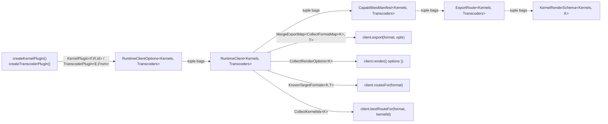

# Runtime Type Bag Propagation

Investigation into reshaping `RuntimeClient` and `CapabilitiesManifest` so that `Kernels` and `Transcoders` flow as top-level "context" type bags from `RuntimeClientOptions` to every leaf type node, with helper generics plucking out `ExportMap`, `RenderOptions`, `KernelId`, declared formats, and transcoder ids on demand.

## Executive Summary

`RuntimeClientOptions<Kernels, Transcoders>` already carries the full plugin tuples, but `RuntimeClient<ExportMap, RenderOptions, KernelId>` projects three pre-aggregated leaves and discards the bags. This early projection forces every other type that wants plugin-derived inference to be re-fed the same projections — and where projections weren't provided, types decay to wide defaults. The result is visible in `CapabilitiesManifest<KernelId>`: `routes[i].targetFormat` is wide `FileExtension` even though only declared kernel/transcoder formats can ever appear, `routes[i].sourceFormat` and `transcoderId` are equally wide, and `renderSchemas[kernelId]?.defaults` is `Record<string, unknown>` instead of the concrete render-option type for that kernel. The proposal is sound: thread `Kernels` and `Transcoders` as the canonical generics through `RuntimeClient`, `CapabilitiesManifest`, `ExportRoute`, and `KernelRenderSchema`, then derive `ExportMap`/`RenderOptions`/`KernelId` via existing helpers (`MergeExportMap`, `CollectRenderOptions`, `CollectKernelIds`) plus three new helpers (`KnownTargetFormats`, `KnownSourceFormats`, `KnownTranscoderIds`, `RenderOptionsFor`). The cost is wider TypeScript type computation at hover/check time and slightly more verbose "wide" storage forms (`RuntimeClient<KernelPlugin[], TranscoderPlugin[]>` instead of `RuntimeClient<Record<string, unknown>>`); the benefit is removing every remaining "wider than reality" gap on the public manifest surface.

## Table of Contents

- [Problem Statement](#problem-statement)
- [Methodology](#methodology)
- [Current Generics Pipeline](#current-generics-pipeline)
- [Proposal: Context Bag Propagation](#proposal-context-bag-propagation)
- [Type Architecture Sketch](#type-architecture-sketch)
- [Helper Inventory](#helper-inventory)
- [Impact Analysis](#impact-analysis)
- [Trade-offs](#trade-offs)
- [Critique](#critique)
- [Recommendations](#recommendations)
- [References](#references)

## Problem Statement

Today the runtime defines three leaf generics on `RuntimeClient` and one leaf generic on `CapabilitiesManifest`:

```285:300:packages/runtime/src/types/runtime.types.ts
export type ExportRoute<KernelId extends string = string> = {
  targetFormat: FileExtension;
  kernelId: KernelId;
  sourceFormat: FileExtension;
  transcoderId?: string;
  fidelity: ExportFidelity;
  schema: JSONSchema7;
  defaults: Record<string, unknown>;
};
```

```254:258:packages/runtime/src/client/runtime-client.ts
export type RuntimeClient<
  ExportMap extends Record<string, unknown>,
  RenderOptions = Record<string, unknown>,
  KernelId extends string = string,
> = {
```

The `RuntimeClientOptions` upstream carries the unprojected bags:

```173:184:packages/runtime/src/client/runtime-client.ts
export type RuntimeClientOptions<
  Kernels extends KernelPlugin<any, any, any>[] = KernelPlugin[],
  Transcoders extends TranscoderPlugin<any, any>[] = TranscoderPlugin[],
> = {
  kernels: [...Kernels];
  middleware?: MiddlewarePlugin[];
  bundlers?: BundlerPlugin[];
  transcoders?: [...Transcoders];
```

`createRuntimeClient` is the projection seam: it consumes `RuntimeClientOptions<Kernels, Transcoders>` and returns `RuntimeClient<MergeExportMap<…>, CollectRenderOptions<Kernels>, CollectKernelIds<Kernels>>`. Once that projection happens, the bags are discarded. Three concrete consequences fall out:

1. **`CapabilitiesManifest<KernelId>` is narrower in name than in fact.** `KernelId` only flows into `route.kernelId` and into the index keys of `renderSchemas`. `route.targetFormat`, `route.sourceFormat`, `route.transcoderId`, and `KernelRenderSchema.defaults` stay wide, so the manifest type advertises support for every `FileExtension` the workspace knows about and erases every render-option default to `Record<string, unknown>`.
2. **`KernelRenderSchema` is structurally detached from its kernel.** Because `KernelRenderSchema` does not take a generic parameter, `manifest.renderSchemas['replicad']?.defaults` and `manifest.renderSchemas['openscad']?.defaults` resolve to identical opaque `Record<string, unknown>` shapes, even though replicad ships `{ tessellation: { linearTolerance, angularTolerance } }` and openscad ships `{ tessellation: { segments, minimumAngle, minimumSize } }`.
3. **Transcoders are absent from the type system at every consumer-facing leaf.** `route.transcoderId?: string` accepts any string, including ids that no transcoder in the configured tuple declares. There is no `KnownTranscoderIds<Transcoders>` helper anywhere in the runtime.

The user's question is whether passing `Kernels` and `Transcoders` as top-level "context" bags to every leaf type — and resolving `ExportMap`, `RenderOptions`, `KernelId`, declared formats, and transcoder ids via helpers at the point of use — is workable, and what it would cost.

## Methodology

1. Read the canonical generics surface in `packages/runtime/src/types/runtime.types.ts`, `runtime-client.ts`, `runtime-client-options.ts`, `plugin-types.ts`, and `plugin-helpers.ts`
2. Audit every site that imports `CapabilitiesManifest<…>`, `ExportRoute<…>`, or `RuntimeClient<…>` (3 files in runtime, plus consumer/test boundaries audited separately)
3. Trace generic flow from `createKernelPlugin`/`createTranscoderPlugin` factories → `RuntimeClientOptions<Kernels, Transcoders>` → `createRuntimeClient<Kernels, Transcoders>` → `RuntimeClient<ExportMap, RenderOptions, KernelId>` → consumer surfaces (`client.export`, `client.render`, `client.bestRouteFor`, `client.capabilities`)
4. Cross-reference how `runtime-client-type-safety-audit.md` recommended R1 (generic `RuntimeClientOptions`) and `capabilities-manifest-api-audit.md` recommended R3/R4/R6 (typed schemas, `KernelId` brand, indexed `renderSchemas`) to identify residual gaps that the bag-propagation approach would close
5. Build a working type sketch (Section ["Type Architecture Sketch"](#type-architecture-sketch)) of the proposed shape and check it against the helper-fallback contract that `CollectKernelIds`/`CollectRenderOptions` already encode for the default `KernelPlugin[]` case
6. Walk the call sites in `kernel-worker.ts buildCapabilitiesManifest()` to confirm the worker (which has no plugin-tuple knowledge) can keep emitting the wide manifest unchanged — only the public client surface narrows

## Current Generics Pipeline

The generics chain today is a four-stage funnel in which each stage reduces what the next stage knows:

| Stage                                                                  | Input generics                               | Output generics                                                                              | What is dropped                                                                                                                 |
| ---------------------------------------------------------------------- | -------------------------------------------- | -------------------------------------------------------------------------------------------- | ------------------------------------------------------------------------------------------------------------------------------- |
| Plugin factory (`createKernelPlugin`, `createTranscoderPlugin`)        | Zod schema literals                          | `KernelPlugin<FormatMap, RenderOptions, Id>`, `TranscoderPlugin<EdgeMap, From>`              | Nothing (phantom-preserved)                                                                                                     |
| Options builder (`RuntimeClientOptions`, `createRuntimeClientOptions`) | Plugin literal tuples                        | `RuntimeClientOptions<Kernels, Transcoders>`                                                 | Nothing (tuple-preserved)                                                                                                       |
| Client constructor (`createRuntimeClient`)                             | `RuntimeClientOptions<Kernels, Transcoders>` | `RuntimeClient<MergeExportMap<…>, CollectRenderOptions<Kernels>, CollectKernelIds<Kernels>>` | **`Kernels` and `Transcoders` themselves** — only three projected leaves survive                                                |
| Manifest carrier (`CapabilitiesManifest<KernelId>`)                    | `KernelId` only                              | `routes[number].kernelId` and `renderSchemas`'s key set                                      | **`Kernels`/`Transcoders` everywhere except `kernelId`** — `targetFormat`, `sourceFormat`, `transcoderId`, `defaults` stay wide |

The rationale for the projection at stage 3 was reasonable in isolation: `RuntimeClient<KernelPlugin[], TranscoderPlugin[]>` is a wordier "wide" form than `RuntimeClient<Record<string, unknown>>`, and methods like `client.export(format, options)` only need the projected `ExportMap` to type-check, not the original bag. But the projection is lossy with respect to anything the original aggregation helpers did not cover, and the manifest is the place where that loss is most visible.

### Specific gaps in the current shape

| Surface                                           | Today's type                                  | Reality                                                                                                                     |
| ------------------------------------------------- | --------------------------------------------- | --------------------------------------------------------------------------------------------------------------------------- |
| `manifest.routes[i].targetFormat`                 | `FileExtension` (workspace-wide union)        | One of the declared kernel-export formats or transcoder-edge `to` formats                                                   |
| `manifest.routes[i].sourceFormat`                 | `FileExtension`                               | A kernel-native export format only (transcoder `from` must equal a kernel format)                                           |
| `manifest.routes[i].transcoderId`                 | `string \| undefined`                         | One of the registered `TranscoderPlugin.id` literals, or `undefined` for direct routes                                      |
| `manifest.renderSchemas[k]?.defaults`             | `Record<string, unknown>`                     | The render-option input type of kernel `k` (e.g. `{ tessellation: { linearTolerance: number; angularTolerance: number } }`) |
| `client.routesFor(format)` parameter              | `FileExtension`                               | Should narrow to `KnownTargetFormats<Kernels, Transcoders>`                                                                 |
| `client.bestRouteFor(format, kernelId)` parameter | `format: FileExtension`, `kernelId: KernelId` | `format` should narrow; `kernelId` already narrowed by R8 of audit                                                          |
| `client.export(format, options)`                  | Already narrowed via `MergeExportMap`         | Correct — this is the exemplar pattern                                                                                      |

The asymmetry is the smoking gun: `client.export` already narrows correctly because `MergeExportMap<CollectFormatMap<Kernels>, Transcoders>` was computed at stage 3 and threaded into `RuntimeClient`. Every leaf that needs a similar projection but that `createRuntimeClient` did not pre-compute is stuck with the wide type. The bag-propagation approach makes the projection **on demand at the leaf**, removing the requirement to anticipate every needed projection at the construction seam.

## Proposal: Context Bag Propagation

Treat `Kernels` and `Transcoders` as the canonical generic context that every plugin-aware type in the runtime carries. Every leaf type that needs a derived view of the bag invokes a helper to project the slice it needs.

### Design rules

| Rule | Statement                                                                                                                                                                                                            |
| ---- | -------------------------------------------------------------------------------------------------------------------------------------------------------------------------------------------------------------------- |
| 1    | The two top-level bags are `Kernels extends KernelPlugin<any, any, any>[]` and `Transcoders extends TranscoderPlugin<any, any>[]`, defaulting to `KernelPlugin[]` and `TranscoderPlugin[]` respectively              |
| 2    | All public types that depend on declared kernels or transcoders take `<Kernels, Transcoders>` in that order; the defaults form the existing wide shape                                                               |
| 3    | All projections (`ExportMap`, `RenderOptions`, `KernelId`, `KnownTargetFormats`, `KnownSourceFormats`, `KnownTranscoderIds`, `RenderOptionsFor<Kernels, K>`) are exported helpers, not generics on the carrier types |
| 4    | The runtime worker (no plugin-tuple knowledge) keeps emitting the wide manifest shape (`CapabilitiesManifest`); the public client surface narrows by re-typing the held value with the consumer's bag                |
| 5    | The wire protocol (`RuntimeResponse.initialized`, `capabilitiesUpdated`) keeps `CapabilitiesManifest` in its default-wide form — narrowing is a main-thread, type-only concern                                       |
| 6    | Storage sites that intentionally erase generics use `RuntimeClient<KernelPlugin[], TranscoderPlugin[]>`, which collapses to today's wide behavior via the helper fallbacks                                           |

### What flows where



The bag stops at `RuntimeClient` boundaries — the `RuntimeWorkerClient`, `RuntimeWorkerDispatcher`, `KernelWorker`, and wire protocol all stay on the wide `CapabilitiesManifest`. Re-typing happens once at the boundary inside `createRuntimeClient`'s public return type (and inside `RuntimeClient.capabilities`/`on('capabilities', …)`), which is the same trick `MergeExportMap` already does today.

## Type Architecture Sketch

The following is a self-consistent sketch of what the proposed shape would look like in TypeScript, using the existing helpers and three new ones.

### Carrier types

```typescript
// Top-level bag carriers — every plugin-aware type takes these two generics
// in this order, defaulting to today's wide shape.
export type RuntimeClient<
  Kernels extends readonly KernelPlugin<any, any, any>[] = KernelPlugin[],
  Transcoders extends readonly TranscoderPlugin<any, any>[] = TranscoderPlugin[],
> = {
  readonly capabilities: CapabilitiesManifest<Kernels, Transcoders> | undefined;
  readonly activeKernelId: CollectKernelIds<Kernels> | undefined;

  routesFor<Format extends KnownTargetFormats<Kernels, Transcoders>>(
    format: Format,
  ): ReadonlyArray<RouteFor<Kernels, Transcoders, Format>>;

  bestRouteFor<
    Format extends KnownTargetFormats<Kernels, Transcoders>,
    Kernel extends CollectKernelIds<Kernels> = CollectKernelIds<Kernels>,
  >(
    format: Format,
    kernelId?: Kernel,
  ): RouteFor<Kernels, Transcoders, Format, Kernel> | undefined;

  export<Format extends keyof MergeExportMap<CollectFormatMap<Kernels>, Transcoders> & string>(
    format: Format,
    options?: MergeExportMap<CollectFormatMap<Kernels>, Transcoders>[Format],
  ): Promise<ExportResult>;

  render<T extends Record<string, string>>(
    input: CodeInput<T> & { options?: CollectRenderOptions<Kernels> },
  ): Promise<HashedGeometryResult>;

  on(event: 'capabilities', handler: (manifest: CapabilitiesManifest<Kernels, Transcoders>) => void): () => void;
  // …other events unchanged
};

export type CapabilitiesManifest<
  Kernels extends readonly KernelPlugin<any, any, any>[] = KernelPlugin[],
  Transcoders extends readonly TranscoderPlugin<any, any>[] = TranscoderPlugin[],
> = {
  routes: ReadonlyArray<ExportRoute<Kernels, Transcoders>>;
  renderSchemas: {
    [K in CollectKernelIds<Kernels>]?: KernelRenderSchema<Kernels, K>;
  };
};

export type ExportRoute<
  Kernels extends readonly KernelPlugin<any, any, any>[] = KernelPlugin[],
  Transcoders extends readonly TranscoderPlugin<any, any>[] = TranscoderPlugin[],
  Format extends KnownTargetFormats<Kernels, Transcoders> = KnownTargetFormats<Kernels, Transcoders>,
  Kernel extends CollectKernelIds<Kernels> = CollectKernelIds<Kernels>,
> = {
  targetFormat: Format;
  kernelId: Kernel;
  sourceFormat: KnownSourceFormats<Kernels>;
  transcoderId?: KnownTranscoderIds<Transcoders>;
  fidelity: ExportFidelity;
  schema: JSONSchema7;
  defaults: MergeExportMap<CollectFormatMap<Kernels>, Transcoders>[Format];
};

export type KernelRenderSchema<
  Kernels extends readonly KernelPlugin<any, any, any>[] = KernelPlugin[],
  Kernel extends CollectKernelIds<Kernels> = CollectKernelIds<Kernels>,
> = {
  schema: JSONSchema7;
  defaults: RenderOptionsFor<Kernels, Kernel>;
};
```

The shape preserves exactly the runtime fields, but every "wider than reality" leaf has been narrowed by an on-demand projection from the bag. `ExportRoute` gains an optional `Format` and `Kernel` discriminator pair so `RouteFor<Kernels, Transcoders, 'glb', 'replicad'>` can resolve to the exact route schema for that combination — and where consumers don't supply discriminators, they get the union over all valid combinations (the existing behavior, but with a narrower union than `FileExtension`).

### New helper types

```typescript
/** Union of every target format declared by any registered kernel or transcoder edge. */
export type KnownTargetFormats<
  Kernels extends readonly KernelPlugin<any, any, any>[],
  Transcoders extends readonly TranscoderPlugin<any, any>[],
> = CollectExportFormats<Kernels> | CollectTranscoderTargets<Transcoders>;

/** Union of every kernel-native export format. Transcoder source formats must be a subset of these. */
export type KnownSourceFormats<Kernels extends readonly KernelPlugin<any, any, any>[]> = CollectExportFormats<Kernels>;

/** Union of every transcoder id literal in the registered tuple. */
export type KnownTranscoderIds<Transcoders extends readonly TranscoderPlugin<any, any>[]> =
  Transcoders[number] extends TranscoderPlugin<any, any> & { id: infer Id extends string } ? Id : never;

/** Per-kernel render-option input type, looked up from the kernel's phantom RenderOptions generic. */
export type RenderOptionsFor<Kernels extends readonly KernelPlugin<any, any, any>[], Kernel extends string> =
  Extract<Kernels[number], KernelPlugin<any, any, Kernel>> extends KernelPlugin<any, infer R, Kernel>
    ? R
    : Record<string, unknown>;

/** Discriminated route shape for a specific (Format, Kernel) pair. */
export type RouteFor<
  Kernels extends readonly KernelPlugin<any, any, any>[],
  Transcoders extends readonly TranscoderPlugin<any, any>[],
  Format extends KnownTargetFormats<Kernels, Transcoders> = KnownTargetFormats<Kernels, Transcoders>,
  Kernel extends CollectKernelIds<Kernels> = CollectKernelIds<Kernels>,
> = ExportRoute<Kernels, Transcoders, Format, Kernel>;
```

Each helper has a graceful fallback under the default `KernelPlugin[]` / `TranscoderPlugin[]` bags:

| Helper                            | Bag is wide default                                                                                | Bag is concrete tuple                                 |
| --------------------------------- | -------------------------------------------------------------------------------------------------- | ----------------------------------------------------- |
| `CollectKernelIds<Kernels>`       | `string` (existing fallback)                                                                       | `'replicad' \| 'openscad' \| …`                       |
| `CollectExportFormats<Kernels>`   | `string` (existing fallback)                                                                       | `'stl' \| 'step' \| 'glb' \| …`                       |
| `CollectRenderOptions<Kernels>`   | `Record<string, unknown>`                                                                          | `ReplicadRenderOptions \| OpenScadRenderOptions \| …` |
| `KnownTranscoderIds<Transcoders>` | `never` (collapses to wide via `[never] extends [infer F]` pattern, similar to `CollectKernelIds`) | `'converter'`                                         |
| `RenderOptionsFor<Kernels, K>`    | `Record<string, unknown>`                                                                          | concrete render-options type for kernel `K`           |

For `KnownTranscoderIds`, the fallback should mirror `CollectKernelIds`: when every contributor is the default-erased `string`, return `string`; otherwise the literal union. This needs the same `FilterDefaultId` trick.

### Worker boundary unchanged

```typescript
// runtime-protocol.types.ts — wire stays wide
export type RuntimeResponse =
  | { type: 'initialized'; requestId: string; capabilities: CapabilitiesManifest /* default-wide */ }
  | { type: 'capabilitiesUpdated'; capabilities: CapabilitiesManifest };

// runtime-client.ts — narrowing happens at the public surface only
export function createRuntimeClient<
  const Kernels extends KernelPlugin<any, any, any>[],
  const Transcoders extends TranscoderPlugin<any, any>[] = [],
>(
  options: RuntimeClientOptions<Kernels, Transcoders>,
): RuntimeClient<Kernels, Transcoders>;

// Inside the implementation, the held _capabilities is wide:
let _capabilities: CapabilitiesManifest | undefined;

// At the get-accessor boundary, cast to the narrow form. This is sound because
// the worker's emit shape is structurally compatible with the narrower carrier
// (every concrete value in the wide manifest also satisfies the narrow leaf
// types — it's a witness narrowing, not a structural lie).
get capabilities(): CapabilitiesManifest<Kernels, Transcoders> | undefined {
  return _capabilities as CapabilitiesManifest<Kernels, Transcoders> | undefined;
}
```

The cast is the same rhetorical move that the current `RuntimeClient` makes implicitly via the `RuntimeClientOptions → RuntimeClient` overload. There is exactly one cast at the boundary; everything downstream is type-clean.

## Helper Inventory

| Helper                           | Status                                   | Source of truth                                             | Used by                                                 |
| -------------------------------- | ---------------------------------------- | ----------------------------------------------------------- | ------------------------------------------------------- |
| `CollectFormatMap<Kernels>`      | exists                                   | per-kernel `FormatMap` phantom                              | `MergeExportMap`, `CollectExportFormats`                |
| `CollectExportFormats<Kernels>`  | exists                                   | per-kernel `FormatMap` phantom keys                         | `KnownTargetFormats`, `KnownSourceFormats`, `RouteFor`  |
| `CollectRenderOptions<Kernels>`  | exists                                   | per-kernel `RenderOptions` phantom                          | `RuntimeClient.render`, `RuntimeClient.setFile`         |
| `CollectKernelIds<Kernels>`      | exists                                   | per-kernel `Id` phantom                                     | `ExportRoute.kernelId`, `KernelRenderSchema` index      |
| `MergeExportMap<F, T>`           | exists                                   | kernel `FormatMap` × transcoder `EdgeMap` × `From`          | `RuntimeClient.export`, `ExportRoute.defaults`          |
| `KnownTargetFormats<K, T>`       | **new**                                  | union of `CollectExportFormats<K>` and transcoder `to` keys | `routesFor`, `bestRouteFor`, `ExportRoute.targetFormat` |
| `KnownSourceFormats<K>`          | **new**                                  | `CollectExportFormats<K>` (alias for clarity)               | `ExportRoute.sourceFormat`                              |
| `KnownTranscoderIds<T>`          | **new**                                  | per-transcoder `id` literal                                 | `ExportRoute.transcoderId`                              |
| `RenderOptionsFor<K, Id>`        | **new**                                  | per-kernel `RenderOptions` phantom selected by `Id`         | `KernelRenderSchema.defaults`                           |
| `RouteFor<K, T, Format, Kernel>` | **new** (alias of generic `ExportRoute`) | discriminated `ExportRoute` slice                           | `routesFor`, `bestRouteFor` return types                |
| `CollectTranscoderTargets<T>`    | **new**                                  | union of all transcoder `EdgeMap` keys                      | `KnownTargetFormats`                                    |

Five new helpers; three of them (`KnownSourceFormats`, `RouteFor`, `CollectTranscoderTargets`) are thin aliases or one-line projections over existing infrastructure. `KnownTransformerIds` and `RenderOptionsFor` need the same `FilterDefaultId` / `Extract` patterns already used by `CollectKernelIds` — proven to work and graceful under wide-default fallbacks.

## Impact Analysis

### Files in the runtime package that change

| File                                                          | Change                                                                                                                                                                                                                      |
| ------------------------------------------------------------- | --------------------------------------------------------------------------------------------------------------------------------------------------------------------------------------------------------------------------- |
| `packages/runtime/src/types/runtime.types.ts`                 | `CapabilitiesManifest`, `ExportRoute`, `KernelRenderSchema` re-generic over `<Kernels, Transcoders>`                                                                                                                        |
| `packages/runtime/src/plugins/plugin-types.ts`                | Add `KnownTargetFormats`, `KnownSourceFormats`, `KnownTranscoderIds`, `RenderOptionsFor`, `RouteFor`, `CollectTranscoderTargets`; export from barrel                                                                        |
| `packages/runtime/src/client/runtime-client.ts`               | `RuntimeClient` re-generic over `<Kernels, Transcoders>`; `routesFor`, `bestRouteFor`, `on('capabilities')`, `capabilities` accessor narrow via the bags; `_capabilities` stays wide internally with a single boundary cast |
| `packages/runtime/src/types/runtime-protocol.types.ts`        | No change — wire stays wide                                                                                                                                                                                                 |
| `packages/runtime/src/framework/kernel-worker.ts`             | No change to `buildCapabilitiesManifest()` — worker has no bag                                                                                                                                                              |
| `packages/runtime/src/framework/runtime-worker-client.ts`     | No change — operates on wide manifest                                                                                                                                                                                       |
| `packages/runtime/src/framework/runtime-worker-dispatcher.ts` | No change                                                                                                                                                                                                                   |
| `packages/runtime/src/types/runtime.test-d.ts`                | New `expectTypeOf` cases for narrowed `targetFormat`, `sourceFormat`, `transcoderId`, `KernelRenderSchema.defaults`                                                                                                         |
| `packages/runtime/src/types/define-plugin.test-d.ts`          | New cases for `KnownTransformerIds`, `KnownTargetFormats`, `RenderOptionsFor`                                                                                                                                               |

### Consumer surfaces

| Consumer                                              | Impact                                                                                                                                                                         |
| ----------------------------------------------------- | ------------------------------------------------------------------------------------------------------------------------------------------------------------------------------ |
| `apps/ui/app/routes/projects_.$id/chat-converter.tsx` | `routesFor(format)` and `bestRouteFor(format, kernelId)` parameters narrow — caller already constrains to declared formats so impact is autocomplete improvement, not breaking |
| `apps/ui/app/routes/_index/hero-viewer.utils.ts`      | `route.targetFormat` narrows to `KnownTargetFormats` — helper currently iterates all routes, no contract change                                                                |
| `apps/ui/app/machines/cad.machine.ts`                 | `kernelClient: RuntimeClient<Record<string, unknown>>` becomes `RuntimeClient<KernelPlugin[], TranscoderPlugin[]>` (intentional erasure form per design rule 6)                |
| `apps/ui/app/hooks/use-render.ts`                     | `clientOptions: RuntimeClientOptions<any, any>` already accepts widened generics; no change                                                                                    |
| `packages/react/src/hooks/use-render.ts`              | Same as above                                                                                                                                                                  |
| `apps/api/app/benchmarks/model-benchmark-geometry.ts` | `client: RuntimeClient<KernelPlugin[], TranscoderPlugin[]>` — switch from `Record<string, unknown>` form                                                                       |
| `apps/ui/app/constants/kernel-worker.constants.ts`    | `createRuntimeClientOptions(base, overrides)` already supports independent `K2`/`T2` — no change                                                                               |

The migration is largely additive. The only "breaking" surface is consumers that wrote `RuntimeClient<Record<string, unknown>>` as the wide form; they switch to `RuntimeClient<KernelPlugin[], TranscoderPlugin[]>`. There are 8 such sites in the workspace.

### Wire protocol and JSON Schema

- **Wire protocol**: Unchanged. The worker emits `CapabilitiesManifest` (default-wide) on `RuntimeResponse.initialized` and `RuntimeResponse.capabilitiesUpdated`. Narrowing is type-only at the public client surface.
- **JSON Schema artifacts**: Unchanged. `route.schema` and `KernelRenderSchema.schema` stay `JSONSchema7`. Only `defaults` narrows from `Record<string, unknown>` to the concrete render-option input type.

## Trade-offs

| Dimension                                                                | Pre-projected leaves (today)                                                      | Bag propagation (proposed)                                                                                  |
| ------------------------------------------------------------------------ | --------------------------------------------------------------------------------- | ----------------------------------------------------------------------------------------------------------- |
| Type expression size at hover                                            | Small (`RuntimeClient<Record<string, unknown>, …>`)                               | Larger (`RuntimeClient<readonly [KernelPlugin<{...}, {...}, 'replicad'>, …], …>`)                           |
| TypeScript check time per file                                           | Lower                                                                             | Higher — every helper invocation re-walks the bag (mitigated by TS structural caching of conditional types) |
| Spelling intentional erasure                                             | `RuntimeClient<Record<string, unknown>>`                                          | `RuntimeClient<KernelPlugin[], TranscoderPlugin[]>`                                                         |
| Adding a new derived view (e.g. `KnownFidelities<Kernels, Transcoders>`) | Requires plumbing a new generic through `createRuntimeClient` and `RuntimeClient` | One new helper, no carrier-shape change                                                                     |
| `manifest.routes[i].targetFormat` narrowing                              | Wide `FileExtension`                                                              | `KnownTargetFormats<Kernels, Transcoders>`                                                                  |
| `manifest.renderSchemas.replicad?.defaults` typing                       | `Record<string, unknown>`                                                         | `RenderOptionsFor<Kernels, 'replicad'>`                                                                     |
| `manifest.routes[i].transcoderId` validation                             | `string \| undefined`                                                             | `KnownTranscoderIds<Transcoders> \| undefined`                                                              |
| Runtime worker shape                                                     | Unchanged                                                                         | Unchanged                                                                                                   |
| Wire protocol                                                            | Unchanged                                                                         | Unchanged                                                                                                   |
| Consumer DX (autocomplete on declared formats)                           | Partial — only `client.export(format, …)` narrows                                 | Complete — every leaf type narrows                                                                          |

The dominant cost is TypeScript compute time. With seven first-party kernels in `presets.all()` and five Zod schemas per kernel, the bag is moderately large. Mitigations:

1. **Structural caching** — TS caches conditional type results structurally, so `KnownTargetFormats<typeof presets.all().kernels, typeof presets.all().transcoders>` resolves once per unique bag-instance.
2. **Default-bag fallback** — Storage sites that erase to `KernelPlugin[]`/`TranscoderPlugin[]` pay no per-helper computation cost; helpers short-circuit to wide-default fallback.
3. **`type` aliases at the project root** — Each app can pre-compute `type AppRuntimeClient = RuntimeClient<typeof presets.all().kernels, typeof presets.all().transcoders>` once and reference the alias everywhere.

The dominant benefit is closing every "wider than reality" leaf on the public manifest surface in one coherent move, including the two specific issues the user identified (detached `KernelRenderSchema`, transcoder absence in types).

## Critique

The proposal is internally consistent and aligns with the existing `MergeExportMap` precedent, but four concerns are worth weighing against the benefit:

### 1. The bag is a "Reader Monad" smell — every consumer pays for the context whether they use it or not

Every type expression that names `CapabilitiesManifest` or `ExportRoute` now mentions `Kernels` and `Transcoders`. This is conceptually clean (one bag, many projections) but it does mean that `import type { CapabilitiesManifest }` no longer gives a useful "self-contained" type — it gives the wide-default form. Consumers who actually want narrowed types must thread the bag, which is more ceremony at the leaf import site.

**Mitigation**: This is what the design-rule-6 storage form is for: `RuntimeClient<KernelPlugin[], TranscoderPlugin[]>` is the semantic equivalent of "any client", and the helper fallbacks ensure it behaves identically to today's `RuntimeClient<Record<string, unknown>>`.

### 2. Worker boundary cast is a narrow-without-witness

The implementation has exactly one type cast at the `client.capabilities` accessor: `_capabilities as CapabilitiesManifest<Kernels, Transcoders>`. This is sound by construction (the worker's emit shape is a structural subtype of the narrowed shape — every literal it produces is a member of the narrower union), but it is a cast nonetheless and violates the spirit of "no escape hatches" from `docs/policy/typescript-policy.md`.

**Mitigation**: The same cast already exists implicitly at the seam between `RuntimeWorkerClient.capabilities` (wide) and `createRuntimeClient`'s return type (narrow). Surfacing it as one explicit, documented cast at one boundary is an improvement over the current implicit projection.

### 3. `KnownTransformerIds` fallback needs the `FilterDefaultId` pattern

`TranscoderPlugin<EdgeMap, From>` does not currently carry an `Id` phantom — `id` is a runtime-typed string field. To get `KnownTranscoderIds<Transcoders>` to extract literal ids, one of two changes is required:

- **Option A**: Add a third `Id` phantom to `TranscoderPlugin` mirroring `KernelPlugin.Id` (and a `const Id` overload to `createTranscoderPlugin`)
- **Option B**: Infer from the runtime `id` field via `Transcoders[number] & { id: infer Id }` (cheaper but only works if the consumer used `as const` somewhere upstream)

Option A matches the existing kernel pattern and is the right move; it's a small but real prerequisite of the proposal.

### 4. R3-style render-options carry already covers the most painful case

The `runtime-client-type-safety-audit.md` R3 already proposed a per-kernel render-options union via `CollectRenderOptions<Kernels>` flowing into `client.render({ options: … })`. That solves the "render-time" leaf. The bag-propagation proposal adds the "manifest read-time" leaf (`manifest.renderSchemas.replicad?.defaults`), which is a smaller benefit because most UIs read defaults to seed forms once, not on every render. If TS compute cost turns out to be the binding constraint, the proposal could be implemented in two stages:

- **Stage 1**: New helpers + narrowed `routesFor`/`bestRouteFor` parameter types (low cost, high autocomplete win)
- **Stage 2**: Re-generic `CapabilitiesManifest`/`ExportRoute`/`KernelRenderSchema` over `<Kernels, Transcoders>` (higher cost, completes the surface)

Each stage is independently shippable and independently revertable.

## Recommendations

| #   | Action                                                                                                                                                                                                                                     | Priority | Effort  | Impact                                                |
| --- | ------------------------------------------------------------------------------------------------------------------------------------------------------------------------------------------------------------------------------------------ | -------- | ------- | ----------------------------------------------------- |
| R1  | Add `Id extends string` phantom to `TranscoderPlugin` (mirroring `KernelPlugin`); add `const Id` overload to `createTranscoderPlugin`. Pre-requisite for narrow `transcoderId` typing.                                                     | P0       | Low     | Unlocks every other transcoder-id narrowing benefit   |
| R2  | Add helpers `KnownTargetFormats`, `KnownSourceFormats`, `KnownTranscoderIds`, `RenderOptionsFor`, `CollectTranscoderTargets`, `RouteFor` to `plugin-types.ts`; export from package barrel; cover with `define-plugin.test-d.ts` cases      | P0       | Medium  | Foundation for every narrowed leaf                    |
| R3  | Re-generic `RuntimeClient<Kernels, Transcoders>` over the bags; derive `ExportMap`, `RenderOptions`, `KernelId` at leaf method signatures via helpers (not at the carrier)                                                                 | P0       | Medium  | Removes the lossy projection at the construction seam |
| R4  | Re-generic `CapabilitiesManifest<Kernels, Transcoders>` and `ExportRoute<Kernels, Transcoders, Format, Kernel>` over the bags; narrow `targetFormat`/`sourceFormat`/`transcoderId` via helpers                                             | P1       | Medium  | Closes the two specific issues raised in the proposal |
| R5  | Re-generic `KernelRenderSchema<Kernels, Kernel>` so `defaults` resolves to `RenderOptionsFor<Kernels, Kernel>`; index `CapabilitiesManifest.renderSchemas` by `CollectKernelIds<Kernels>` mapped to `KernelRenderSchema<Kernels, K>`       | P1       | Low     | Resolves the "detached `KernelRenderSchema`" issue    |
| R6  | Switch all intentional-erasure storage sites from `RuntimeClient<Record<string, unknown>>` to `RuntimeClient<KernelPlugin[], TranscoderPlugin[]>`; verify identical wide-default fallback behavior via `expectTypeOf` cases                | P2       | Low     | Makes erasure spelling consistent with the new shape  |
| R7  | Document the worker-boundary cast at `RuntimeClient.capabilities` accessor with a `// SAFETY:` block citing this research; add a `define-plugin.test-d.ts` case asserting structural compatibility between wide and narrow manifest shapes | P2       | Low     | Audit trail for the one type cast in the seam         |
| R8  | Add a project-root `type AppRuntimeClient = RuntimeClient<typeof presets.all().kernels, typeof presets.all().transcoders>` alias in `apps/ui` and `apps/api` to bound TypeScript compute cost on consumer files                            | P3       | Trivial | Performance hygiene                                   |
| R9  | Stage the rollout — ship R1-R3 first (parameter narrowing wins, low TS compute risk), then R4-R5 (manifest leaf narrowing) once R1-R3 are validated against `pnpm nx typecheck` wall-clock on a full workspace build                       | P2       | —       | Risk management                                       |

The proposal works in practice and in application: every leaf that today decays to wide `FileExtension`, `string`, or `Record<string, unknown>` has a concrete projection from the bag, the helpers all have proven default-fallback behavior, the worker boundary needs no protocol change, and the implementation is one coherent refactor with one explicit boundary cast. The cost is TypeScript compute time and slightly wordier intentional-erasure spellings — both manageable, and both worth paying to retain end-to-end plugin-aware type inference through the entire runtime client surface.

## References

- Related: `docs/research/capabilities-manifest-api-audit.md` — establishes the `KernelId` brand and the `routes` / `renderSchemas` collapse this proposal builds on
- Related: `docs/research/runtime-client-type-safety-audit.md` — R1 (generic options), R3 (render-options union), R9 (transcoder edge types) are prerequisites of this proposal
- Related: `docs/research/transcoder-edge-source-type-merging.md` — `MergeExportMap` precedent for projecting on demand
- Related: `docs/research/generic-inference-pipeline.md` — phantom-property pattern used by `__kernelId`, `__exportSchemas`, `__renderSchema`
- Related: `docs/research/export-pipeline-v5.md` — manifest-driven export route planner that produces the routes this proposal narrows
- Policy: `docs/policy/library-api-policy.md` — surface-area discipline for `@public` types
- Policy: `docs/policy/typescript-policy.md` — escape-hatch discipline (the one boundary cast in R7)
