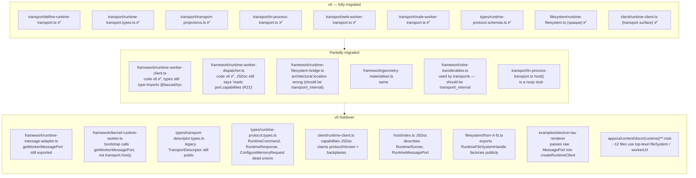
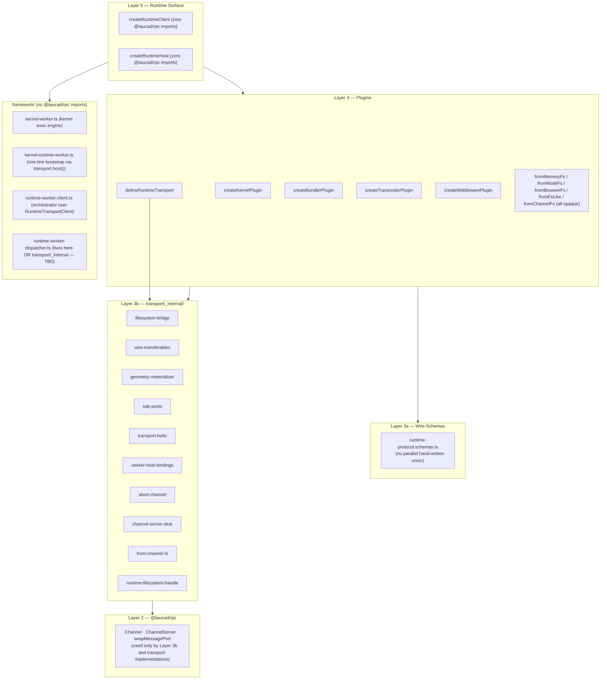

# Runtime v6 Cutover — Residual Audit and Cleanup Plan

Systematic audit of the `@taucad/runtime` codebase against `[runtime-transport-architecture-v6.md](./runtime-transport-architecture-v6.md)`, identifying every rough edge, incomplete migration, stale doc reference, and architectural smell that still distances the runtime from the v6 target — with a prioritised cleanup roadmap for finishing the cutover.

## Executive Summary

**Status: ✅ Cutover complete (R1–R20 all RESOLVED).** Every recommendation in the
[Recommendations](#recommendations) table was executed under the
`v6_cutover_residuals_execution_b70cbf8a.plan.md` execution plan. The new public
surface (`createRuntimeClient` + `transport: webWorkerTransport({...})`, opaque
`RuntimeFileSystem`, `defineRuntimeTransport` with phantom generics, channel-side
Zod validation) is in place; consumer apps (`apps/ui`, `apps/api`, `packages/cli`,
`packages/react`, `packages/testing`, `examples/electron-tau`) compose against it
correctly; `runner/`, `multiplex.ts`, `electron-port-adapters.ts`, `framework/`
wire-layer files (now under `transport/_internal/`), and the v5 `TransportDescriptor`
shim are all gone; the C4 (`runtime-imports-no-rpc.test.ts`) conformance test now
gates `client/` + `framework/` + `host/` + `worker/` + `cache/`; the public
filesystem barrel exports only opaque `fromX` factories with bridge primitives
moved to `@taucad/runtime/transport-internals`; and a new
`@taucad/runtime/filesystem/browser` subpath isolates the FS Access API entry.

This document is preserved as a historical audit trail rather than an active task
list. Future cleanup work should track new recommendations in a fresh research
document rather than amending this one.

## Table of Contents

1. [Scope and Non-Goals](#scope-and-non-goals)
2. [Methodology](#methodology)
3. [State Snapshot](#state-snapshot)
4. [Findings](#findings)

- [Finding 1 — `framework/` imports `@taucad/rpc` widely (C4 gate missing)](#finding-1--framework-imports-taucadrpc-widely-c4-gate-missing)
- [Finding 2 — Worker bootstrap bypasses `transport.host()](#finding-2--worker-bootstrap-bypasses-transporthost)`
- [Finding 3 — Two `TransportDescriptor` types coexist via a shim](#finding-3--two-transportdescriptor-types-coexist-via-a-shim)
- [Finding 4 — `RuntimeFileSystem` name collision across two domains](#finding-4--runtimefilesystem-name-collision-across-two-domains)
- [Finding 5 — Internal `RuntimeFileSystemHandle` leaks through `from-X-fs.ts` factories](#finding-5--internal-runtimefilesystemhandle-leaks-through-from-x-fsts-factories)
- [Finding 6 — `fromX` factory naming inconsistency](#finding-6--fromx-factory-naming-inconsistency)
- [Finding 7 — Hand-written `RuntimeCommand`/`RuntimeResponse` legacy unions still public](#finding-7--hand-written-runtimecommandruntimeresponse-legacy-unions-still-public)
- [Finding 8 — `RuntimeClient.capabilities` JSDoc promises non-existent v5 fields](#finding-8--runtimeclientcapabilities-jsdoc-promises-non-existent-v5-fields)
- [Finding 9 — `createRuntimeClientOptions` drops the `Transport` phantom](#finding-9--createruntimeclientoptions-drops-the-transport-phantom)
- [Finding 10 — `host/index.ts` JSDoc references deleted symbols](#finding-10--hostindexts-jsdoc-references-deleted-symbols)
- [Finding 11 — Stale R-tag / Phase / v5 references across the runtime](#finding-11--stale-r-tag--phase--v5-references-across-the-runtime)
- [Finding 12 — `historic in-process `host()` symmetry stub` is architectural dead code](#finding-12--inprocesstransporthost-is-architectural-dead-code)
- [Finding 13 — Bridge primitives leak onto the public filesystem barrel](#finding-13--bridge-primitives-leak-onto-the-public-filesystem-barrel)
- [Finding 14 — Electron renderer threads a raw `MessagePort` through `createRuntimeClient](#finding-14--electron-renderer-threads-a-raw-messageport-through-createruntimeclient)`
- [Finding 15 — Missing v6 Appendix B conformance tests (C4, C5)](#finding-15--missing-v6-appendix-b-conformance-tests-c4-c5)
- [Finding 16 — `cleanup` notify schema/runtime mismatch (`null` vs `undefined`)](#finding-16--cleanup-notify-schemaruntime-mismatch-null-vs-undefined)
- [Finding 17 — Documentation site (`apps/ui/content/docs`) still ships v5 snippets](#finding-17--documentation-site-appsuicontentdocs-still-ships-v5-snippets)
- [Finding 18 — `connect()` overload arity is correct, but tests skipped with v5 narrative](#finding-18--connect-overload-arity-is-correct-but-tests-skipped-with-v5-narrative)
- [Finding 19 — `@taucad/runtime/filesystem/browser` subpath missing from `package.json](#finding-19--taucadruntimefilesystembrowser-subpath-missing-from-packagejson)`
- [Finding 20 — `RenderAbortedError` message string references pre-renaming verbs](#finding-20--renderabortederror-message-string-references-pre-renaming-verbs)

5. [Recommendations](#recommendations)
6. [Diagrams](#diagrams)
7. [Appendix A — Files to Delete vs Current State](#appendix-a--files-to-delete-vs-current-state)
8. [Appendix B — Conformance Test Coverage Matrix](#appendix-b--conformance-test-coverage-matrix)
9. [Appendix C — Stale Reference Inventory](#appendix-c--stale-reference-inventory)
10. [References](#references)

## Scope and Non-Goals

**In scope:**

- Every file under `packages/runtime/src/` measured against `[runtime-transport-architecture-v6.md](./runtime-transport-architecture-v6.md)`.
- Every file under `packages/rpc/src/` (the channel package the runtime composes with).
- Consumer call sites in `apps/ui/`, `apps/api/`, `examples/electron-tau/`, `packages/cli/`, `packages/react/`, `packages/testing/`, `apps/ui-e2e/`.
- Public `*.mdx` documentation under `apps/ui/content/docs/(runtime)/` (sampled, not exhaustive).

**Out of scope (separate investigations):**

- Promotion of `electronUtilityTransport` from `examples/` into `@taucad/runtime/transport` (see v6 D3).
- Multiplexer reintroduction (v6 D1 — deferred).
- Performance benchmarking of v6 vs v5 (will follow when consumer cutover lands).
- A future `remoteTransport` / `webSocketTransport` (v6 D6).

## Methodology

This audit was conducted by:

1. **Reading the v6 blueprint end-to-end**, extracting the canonical type set, the layered model, the _Files to Delete_ table, the _Files to Add_ table, and Appendix B conformance tests.
2. **File-by-file review** of `packages/runtime/src/{client,framework,host,transport,types,filesystem,plugins,kernels,middleware,bundler,transcoders}/` (every `*.ts` opened or grep-checked).
3. **Cross-cutting `rg` sweeps** for v5 markers: `port.capabilities`, `PortCapabilities`, `RuntimeRunner`, `BackplaneDeclaration`, `protocolVersion`, `connect({ port`, `RuntimeFileSystemHandle`, `fromMemoryFS`, `fromNodeFS`, `getWorkerMessagePort`, `R\d+/F\d+/Phase \d+`.
4. **Three parallel exploration subagents** auditing (a) `framework/` + `transport/` migration status, (b) `client/` + `types/` + plugin domain boundaries, (c) consumer apps for v5 leakage.
5. **Spot reads** of critical files (`runtime-client.ts`, `runtime-worker-dispatcher.ts`, `kernel-runtime-worker.ts`, `runtime-protocol.types.ts`, `runtime-protocol.schemas.ts`, `runtime-transport.types.ts`, `define-runtime-transport.ts`, `in-process-transport.ts`) to verify subagent findings against source.

Where this document refers to source by file path it is current as of `updated`. Line numbers are best-effort; refer to the file path + `rg` for the exact location if the file has shifted.

## State Snapshot

| Domain                                                                                 | v6 status                 | Evidence                                                                                                                                       |
| -------------------------------------------------------------------------------------- | ------------------------- | ---------------------------------------------------------------------------------------------------------------------------------------------- |
| `runner/` directory deletion                                                           | ✅ Complete               | `ls packages/runtime/src/runner/` → not found                                                                                                  |
| `Port.capabilities` removal from `@taucad/rpc`                                         | ✅ Complete               | `packages/rpc/src/port.ts` is capability-free; `channel.test-d.ts` asserts deletion                                                            |
| `multiplex.ts` removal from `@taucad/rpc`                                              | ✅ Complete               | not present in `packages/rpc/src/`                                                                                                             |
| `defineRuntimeTransport` (3 overloads, phantom generics, Zod-driven)                   | ✅ Complete               | `packages/runtime/src/transport/define-runtime-transport.ts:34-124` matches blueprint section "`defineRuntimeTransport` — Concrete TypeScript" |
| `RuntimeTransportPlugin/Client/Host` types + phantom carriers                          | ✅ Complete               | `packages/runtime/src/transport/runtime-transport.types.ts:42-423` matches Appendix A                                                          |
| Bundled transports (`inProcessTransport`, `webWorkerTransport`, `nodeWorkerTransport`) | ✅ Complete               | All three exist and use `defineRuntimeTransport`                                                                                               |
| Wire-protocol Zod schemas                                                              | ✅ Complete               | `packages/runtime/src/types/runtime-protocol.schemas.ts:347-375` covers all calls/notifies                                                     |
| Channel server `protocolSchemas` validation                                            | ✅ Complete               | Bundled transports wire `protocolSchemas: runtimeProtocolSchemas` (e.g. `in-process-transport.ts:182`)                                         |
| Opaque `RuntimeFileSystem` brand type                                                  | ✅ Complete               | `packages/runtime/src/filesystem/runtime-filesystem.ts:28-42`                                                                                  |
| `RuntimeClient.connect()` zero-arg                                                     | ✅ Complete               | `packages/runtime/src/client/runtime-client.ts:574`                                                                                            |
| `RuntimeClient<Kernels, Transcoders, Transport>` third generic                         | ✅ Complete               | `packages/runtime/src/client/runtime-client.ts:489-494`                                                                                        |
| `examples/electron-tau` `electron-port-adapters.ts` deletion                           | ✅ Complete               | `ls examples/electron-tau/src/main/` → not found                                                                                               |
| C4 `runtime-imports-no-rpc.test.ts`                                                    | ❌ Missing                | Appendix B C4                                                                                                                                  |
| C5 `runtime-imports-no-wire-primitives.test.ts` (framework scope)                      | ⚠️ Partial                | Exists for `client/` only (`packages/runtime/src/client/runtime-imports-no-wire-primitives.test.ts`); not enforced for `framework/`            |
| C3 `port-capabilities-deletion.test-d.ts`                                              | ⚠️ Renamed                | Lives at `packages/rpc/src/channel.test-d.ts` not the documented path                                                                          |
| C7 `cooperative-abort-conformance.test.ts`                                             | ✅ Present                | `packages/runtime/src/transport/cooperative-abort-conformance.test.ts`                                                                         |
| C14 `wire-protocol-validation.test.ts`                                                 | ⚠️ Lives in `@taucad/rpc` | `packages/rpc/src/wire-protocol-validation.test.ts`                                                                                            |
| C15 `runtime-protocol-schema-coverage.test.ts`                                         | ✅ Present                | `packages/runtime/src/types/runtime-protocol-schema-coverage.test.ts`                                                                          |
| C16 `runtime-protocol-types-derive-from-schemas.test-d.ts`                             | ✅ Present                | `packages/runtime/src/types/runtime-protocol-types-derive-from-schemas.test-d.ts`                                                              |
| Hand-written `RuntimeCommand`/`RuntimeResponse` legacy unions                          | ❌ Still public           | `packages/runtime/src/types/runtime-protocol.types.ts:166, 329`                                                                                |
| Legacy `TransportDescriptor` (`{name,locality,sharedMemory,latencyClass}`)             | ❌ Still public           | `packages/runtime/src/types/transport-descriptor.types.ts:13-22`                                                                               |
| `RuntimeClient.capabilities` JSDoc claims `protocolVersion`/`backplanes`               | ❌ Stale                  | `packages/runtime/src/client/runtime-client.ts:506-514, 1445-1456, 1461-1465`                                                                  |
| `getWorkerMessagePort` exported and used in worker bootstrap                           | ❌ v5 holdover            | `packages/runtime/src/framework/runtime-message-adapter.ts:81`; `kernel-runtime-worker.ts:39, 641`                                             |

## Findings

### Finding 1 — `framework/` imports `@taucad/rpc` widely (C4 gate missing)

**Severity:** P0 (binding architectural rule)

The v6 layered model says Layer 5 (runtime surface) and Layer 4 (`framework/`) only depend on Layer 2 (`@taucad/rpc`) **through transport plugins**. Appendix B C4 prescribes `runtime-imports-no-rpc.test.ts` to enforce this against `client/`, `framework/`, and `host/`.

The test does not exist, and `framework/` violates the rule:

| File                           | Line(s)   | Imports from `@taucad/rpc`                                                                 |
| ------------------------------ | --------- | ------------------------------------------------------------------------------------------ |
| `runtime-worker-dispatcher.ts` | 35-36     | `createChannelServer`, `ChannelServer`, `ChannelServerHandle`, `Port`, `WithTransferables` |
| `runtime-filesystem-bridge.ts` | 19-20     | `createChannelClient`, `createChannelServer`, `wrapMessagePort`                            |
| `geometry-materialiser.ts`     | 29 (type) | `Channel`                                                                                  |
| `runtime-worker-client.ts`     | 28 (type) | `Channel`                                                                                  |
| `runtime-message-adapter.ts`   | 13 (type) | `Port`                                                                                     |

Two of these (`runtime-filesystem-bridge.ts`, `runtime-worker-dispatcher.ts`) genuinely _need_ `@taucad/rpc` because they implement transport-internal protocol code. The fix is not to remove the imports — it is to **move those files into `transport/_internal/`** so the C4 rule can be enforced against `framework/` cleanly. `runtime-worker-client.ts` and `geometry-materialiser.ts` should keep type-only imports but the C4 rule should permit `import type`.

### Finding 2 — Worker bootstrap bypasses `transport.host()`

**Severity:** P0 (symmetry violation; v6 _Files to Add / materially changes_ still incomplete)

v6 says: _"For `webWorkerTransport` the host factory lives in the worker entry"_ — i.e. the worker's bootstrap code is `createRuntimeHost({ transport: webWorkerHost(opts) })`. The Electron utility-process script (`examples/electron-tau/src/main/kernel-host.ts:35-36`) follows this pattern correctly:

```typescript
const host = createRuntimeHost({ transport: electronUtilityHost({}) });
```

But the **bundled worker entry** (`packages/runtime/src/framework/kernel-runtime-worker.ts:636-665`) hand-rolls the bootstrap using legacy adapter primitives:

```typescript
async function bootstrapKernelRuntimeWorker(): Promise<void> {
  const port = await getWorkerMessagePort();
  const worker = new KernelRuntimeWorker();
  createWorkerDispatcher(worker, port, { bindingsFactory: createWorkerHostBindings });
}
```

The `getWorkerMessagePort()` call is the v5 wire-acquisition path the v6 _materially changes_ table flagged for deletion. The bundled `webWorkerHost()` and `nodeWorkerHost()` should own this concern; the worker entry should be a one-liner.

Knock-on: as long as `kernel-runtime-worker.ts` calls `getWorkerMessagePort()`, `runtime-message-adapter.ts` cannot be deleted, and the v6 _materially changes_ row for that file stays unfinished.

### Finding 3 — Two `TransportDescriptor` types coexist via a shim

**Severity:** P1 (public-surface duplication; reader confusion)

There are two distinct `TransportDescriptor` types:

| Path                                                              | Shape                                                     | Status                               |
| ----------------------------------------------------------------- | --------------------------------------------------------- | ------------------------------------ |
| `packages/runtime/src/types/transport-descriptor.types.ts:13-22`  | `{ name, locality, sharedMemory, latencyClass }` (legacy) | Still public via `types/index.ts`    |
| `packages/runtime/src/transport/runtime-transport.types.ts:66-81` | `{ id, wire, memory, fileSystem }` (v6 canonical)         | Re-exported via `transport/index.ts` |

`runtime-client.ts:375-404` defines `projectLegacyDescriptor()` to project the canonical descriptor onto the legacy shape, then exposes the legacy shape under `client.capabilities.transport.descriptor`. Meanwhile `client.transport.descriptor` (a separate accessor) returns the canonical one.

**Net effect:** the same diagnostic information is exposed twice in two incompatible shapes, with a shim function bridging them. The v6 doc lists exactly one `TransportDescriptor` type — the canonical one. The legacy descriptor and the projection helper are pure cutover debt.

### Finding 4 — `RuntimeFileSystem` name collision across two domains

**Severity:** P1 (DX confusion; conditional imports can pick the wrong type)

Two different `RuntimeFileSystem` types are exported from the runtime package:

1. **Consumer-facing opaque brand** at `packages/runtime/src/filesystem/runtime-filesystem.ts:40-42` (`{ readonly [__runtimeFileSystemBrand]: true }`).
2. **Kernel-facing enhanced base** at `packages/runtime/src/types/runtime-kernel.types.ts:117-140` (the FS interface kernels see _inside_ the worker).

Both are exported from the runtime package; the only thing keeping consumers from importing the wrong one is the path. Auto-import in IDE picks indeterministically.

**v6 intent:** `RuntimeFileSystem` is the consumer-facing opaque type (Layer 4). The kernel-side base belongs under a kernel-domain name like `KernelFileSystem` or stays as `RuntimeFileSystemBase` (which already exists at `runtime-kernel.types.ts:107-115`).

### Finding 5 — Internal `RuntimeFileSystemHandle` leaks through `from-X-fs.ts` factories

**Severity:** P1 (incomplete migration — opaque wrapper exists but inner factories still public)

The opaque `RuntimeFileSystem` brand wraps an internal `RuntimeFileSystemHandle` (`{ kind: 'inline' | 'channel', ... }`) that lives in `transport/_internal/runtime-filesystem-handle.ts`. By design only transports may unwrap this.

But every `from-X-fs.ts` file _also_ exports the inner non-opaque factory:

| File                                                   | Public export               | Returns                                   |
| ------------------------------------------------------ | --------------------------- | ----------------------------------------- |
| `packages/runtime/src/filesystem/from-memory-fs.ts:19` | `fromMemoryFS(files?)`      | `RuntimeFileSystemHandle` (legacy handle) |
| `packages/runtime/src/filesystem/from-fs-like.ts:46`   | `fromFsLike(fsLike, root?)` | `RuntimeFileSystemHandle`                 |
| `packages/runtime/src/filesystem/from-node-fs.ts:17`   | `fromNodeFS(basePath)`      | `RuntimeFileSystemHandle`                 |

The opaque wrappers `fromMemoryFs` (lowercase `s`), `fromFsLikeOpaque`, `fromWorkerOpaque` then call these and wrap the result. The non-opaque variants should be `@internal` and not exported (or renamed with an `_internal` prefix).

**Worse:** `@taucad/runtime/filesystem/node` subpath in `package.json` points at `from-node-fs.ts` directly, which exports `fromNodeFS` (uppercase) returning the legacy handle. There is no `fromNodeFs` (opaque) at the documented v6 subpath.

### Finding 6 — `fromX` factory naming inconsistency

**Severity:** P1 (DX; v6 spec violation)

v6 Appendix A documents these factory names:

```typescript
fromMemoryFs(initialFiles?)
fromNodeFs(rootPath)
fromBrowserFs(rootHandle)
fromFsLike(fsLike)
fromChannelFs(channel)   // transport-internal
```

The current code has:

| v6 name         | Current name                                                    | Returns                                                |
| --------------- | --------------------------------------------------------------- | ------------------------------------------------------ |
| `fromMemoryFs`  | `fromMemoryFs` (opaque), `fromMemoryFS` (handle)                | both — naming case split                               |
| `fromNodeFs`    | `fromNodeFS` (only)                                             | legacy handle                                          |
| `fromBrowserFs` | `fromBrowserFs`                                                 | opaque ✅                                              |
| `fromFsLike`    | `fromFsLike` (handle), `fromFsLikeOpaque` (opaque)              | both — `Opaque` suffix is a transitional smell         |
| `fromChannelFs` | `channelHandleFromWorker` (handle), `fromWorkerOpaque` (opaque) | name doesn't match v6 (`fromWorker*` ≠ `fromChannel*`) |

The pattern should be:

- Public: plain `fromX` — always opaque `RuntimeFileSystem`.
- Internal: `_fromXHandle` or move the legacy factory to `transport/_internal/from-X-fs-handle.ts`.

### Finding 7 — Hand-written `RuntimeCommand`/`RuntimeResponse` legacy unions still public

**Severity:** P1 (dead public surface; nobody writes new code against them)

`packages/runtime/src/types/runtime-protocol.types.ts:166-248` defines `RuntimeCommand`, a discriminated union of `'initialize' | 'render' | 'openFile' | 'stage-and-render' | 'updateParameters' | 'setOptions' | 'export' | 'abort' | 'fileChanged' | 'configureMiddleware' | 'cleanup'` shapes. Lines 329-367 define a parallel `RuntimeResponse` union.

These are **the v5 imperative-message union shapes**. The v6 protocol uses `RuntimeProtocol` (`{ calls: { initialize, export }, notifies: { ... } }`) instead. The only callers are `protocol-header.types.ts` and `runtime-protocol.test-d.ts` — both of which use the unions only as part of v5-inventory tests.

Additionally `ConfigureMemoryRequest` (lines 137-158) is the v5 "memory configuration" request shape from before transports owned memory configuration. It has zero callers in production code.

These three types should be deleted along with the test files that exercise them; the v6 schema-driven types in `runtime-protocol.schemas.ts` are the canonical surface.

### Finding 8 — `RuntimeClient.capabilities` JSDoc promises non-existent v5 fields

**Severity:** P1 (doc-vs-code drift; misleading public docs)

Three JSDoc blocks in `packages/runtime/src/client/runtime-client.ts` claim `RuntimeCapabilities.transport` carries `{descriptor, protocolVersion, backplanes}`:

```typescript
// L506-514
/**
 * Rolled-up runtime capabilities: kernel-derived
 * {@link CapabilitiesManifest} fields layered with transport-derived
 * `autonomousRenderLoop` + `transport.{descriptor,protocolVersion,backplanes}`.
 */
readonly capabilities: RuntimeCapabilities<Kernels, Transcoders> | undefined;

// L1445-1456 — getter docstring repeats the claim
// L1461-1465 — implementation comment: "per-backplane lifecycle bookkeeping"
```

But the actual `RuntimeCapabilities` type at `packages/runtime/src/types/runtime.types.ts:433-435` only has `transport.descriptor` (the legacy projected shape) — no `protocolVersion`, no `backplanes`.

The `protocolVersion` and `backplanes` were both v5 concepts that v6 explicitly deletes ("E5 — `BackplaneDeclaration` plane is removed"). The JSDoc is a residual artifact from a draft state where v5 and v6 names coexisted.

### Finding 9 — `createRuntimeClientOptions` drops the `Transport` phantom

**Severity:** P2 (DX regression; phantom inference cuts off at this seam)

The `createRuntimeClient` factory carries `<Kernels, Transcoders, Transport>` end-to-end. But `createRuntimeClientOptions` (the helper consumers use to build typed options without importing `RuntimeClientOptions` directly) only types `<K, T>`:

```typescript
// packages/runtime/src/client/runtime-client-options.ts:94-112
export function createRuntimeClientOptions<
  const K extends KernelPlugin<any, any, any>[],
  const T extends TranscoderPlugin<any, any, any>[] = [],
>(options: RuntimeClientOptions<K, T>): RuntimeClientOptions<K, T>;
```

This means consumers that route options through this helper lose the `Transport` literal id at the seam. `client.transport.id` widens from `'web-worker'` to `string`. The fix is mechanical: add a `const Transport extends RuntimeTransportPlugin<any,any,any,any,any>` slot mirroring `createRuntimeClient`.

### Finding 10 — `host/index.ts` JSDoc references deleted symbols

**Severity:** P2 (doc-only; misleading reader)

`packages/runtime/src/host/index.ts:5-8`:

```typescript
/**
 * Consumers compose a {@link RuntimeMessagePort}, a
 * {@link RuntimeRunner}, and an authoritative
 * {@link RuntimeFileSystemBase}, then {@link createRuntimeHost} returns
 * a single {@link RuntimeHostHandle}...
 */
```

Both `RuntimeMessagePort` and `RuntimeRunner` are dead (the runner plane was deleted; `RuntimeMessagePort` lives in `runtime-message-adapter.ts` which is itself slated for deletion). The actual `createRuntimeHost` API takes `transport: RuntimeTransportHost`. The JSDoc should describe that contract.

### Finding 11 — Stale R-tag / Phase / v5 references across the runtime

**Severity:** P2 (cumulative reader confusion; cheap to sweep)

The v5 development used identifiers like `R5`, `R7`, `R14`, `R18`, `R19`, `R21`, `F14`, `F18`, `Phase 6`, `Phase 12`, `TR16`, `TR21` to track requirements. v6 replaced them. The following files still reference the old IDs:

| File                                             | Line(s)                       | Reference                                                                                        |
| ------------------------------------------------ | ----------------------------- | ------------------------------------------------------------------------------------------------ |
| `framework/runtime-worker-dispatcher.ts`         | 1-25                          | "R5/R7, R18, R19, F14"; "Port's `capabilities` (R21)"                                            |
| `framework/kernel-worker.ts`                     | 209, 1234                     | "R18, R19, F14"                                                                                  |
| `framework/kernel-runtime-worker.ts`             | 558                           | "R14, blueprint v5 Phase 12"                                                                     |
| `framework/geometry-materialiser.ts`             | 2                             | "Phase 6c, R7"                                                                                   |
| `framework/wire-transferables.ts`                | 1-12                          | "v5 channel wire layer", "TR2/R17", "runner"                                                     |
| `framework/runtime-message-adapter.ts`           | 4-5                           | "v5 channel server/client"                                                                       |
| `framework/shared-pool-errors.ts`                | 4-7                           | "v5 channel framework", "not `#transport/`"                                                      |
| `types/runtime-protocol.types.ts`                | 207-211                       | "Phase 1 ships ~50–100 LOC...TR21"                                                               |
| `types/runtime-protocol.types.ts`                | 574-577                       | "tier (`pool > transfer > copy`) by reading `port.capabilities` (R21)" — directly contradicts v6 |
| `types/runtime-protocol.test-d.ts`               | 46-47                         | "v5 inventory"                                                                                   |
| `types/runtime-protocol-schema-coverage.test.ts` | 56-58                         | "v5 inventory: 2 calls + 18 notifies"                                                            |
| `client/runtime-client.ts`                       | 506-514, 1445-1456, 1461-1465 | "backplanes", "per-backplane lifecycle bookkeeping", "protocolVersion"                           |

These are doc-only fixes (no code change), but the `port.capabilities (R21)` mention at `runtime-worker-dispatcher.ts:22-25` is _especially_ harmful because it directly contradicts the implementation 130 lines later (which says the dispatcher _never_ reads `port.capabilities`).

### Finding 12 — `historic in-process `host()` symmetry stub` is architectural dead code

**Severity:** P2 (smell; transport contract violated by one transport)

`packages/runtime/src/transport/in-process-transport.ts:257-315` implements `host()`. The implementation returns a noop channel-server-stub via `createNoopChannelServerHandle`. No code path calls `historic in-process `host(opts)` symmetry stub` at runtime — `client.open()` instead constructs the dispatcher directly with the in-isolate `KernelRuntimeWorker`.

This is because in-process is single-isolate, so the host doesn't need a separate wire — but the v6 `RuntimeTransportPlugin` contract requires every transport to have a working `host()` factory (used by `createRuntimeHost`). Two ways to resolve:

1. **Make in-process actually use `host()`** — `client.open()` should call `historic in-process `host(opts)` symmetry stub.open()` and bridge via `MessageChannel` (which it already does for the channel pair). This is mostly a refactor to centralise the host-wiring path through one entry.
2. **Document that in-process is "client-only"** — explicitly mark the host factory as `@deprecated` / `@internal` for this transport, and add a note to the v6 doc.

Option 1 is preferred because it keeps the contract symmetric (the _Files to Add_ table makes no exception for in-process).

### Finding 13 — Bridge primitives leak onto the public filesystem barrel

**Severity:** P2 (oversharing on `@taucad/runtime/filesystem`)

`packages/runtime/src/filesystem/index.ts` re-exports:

```typescript
export { exposeFileSystem, createFileSystemBridge, waitForWorkerReady } from '#filesystem/filesystem-bridge.js';
export {
  createBridgeServer,
  createBridgePort,
  createBridgeCall,
  createBridgeProxy,
  catchMessages,
  extractTransferables,
} from '#framework/runtime-filesystem-bridge.js';
```

These are FS-bridge wire primitives that v6 says transports use _internally_ (Finding 1). They should not be on the consumer-facing `@taucad/runtime/filesystem` barrel — consumers should compose `RuntimeFileSystem` via `fromX` and let the transport bridge it. Keep these accessible to transport plugin authors via `@taucad/runtime/transport/_internal` (or a sibling `@taucad/runtime/_internal-bridge` if a separate barrel is justified) but remove them from the public filesystem subpath.

### Finding 14 — Electron renderer threads a raw `MessagePort` through `createRuntimeClient`

**Severity:** P1 (consumer-facing wire-primitive leak; v6 _library-api-policy_ §22 Antipattern 5 violation)

`examples/electron-tau/src/renderer/app.tsx:277-280`:

```typescript
const client = createRuntimeClient({
  transport: electronUtilityTransport({ port }),
  ...
});
```

The renderer obtains a `MessagePort` from the preload bridge and passes it directly into `electronUtilityTransport({ port })`. Per v6 the consumer-facing transport options should never accept a raw wire primitive — instead the transport should accept a `bootstrap: () => Promise<MessagePort>` callback (the v6 doc describes exactly this for `electronUtilityTransport`):

```typescript
electronUtilityTransport({
  bootstrap: () => window.taucadBridge.connectKernel(),
});
```

The transport then calls `bootstrap()` lazily inside `open()`, keeping the `MessagePort` instance behind the transport boundary.

The Electron renderer also exposes a `window.__taucadTransportDescriptor` object reading `client.transport.descriptor` for Playwright (`app.tsx:288-297`) — this is fine as a debug aid but should be feature-flagged behind `TAU_DEBUG`.

### Finding 15 — Missing v6 Appendix B conformance tests (C4, C5)

**Severity:** P0 for C4, P1 for C5 (the rule has no enforcement)

| Test                                            | v6 spec                                                                                                                    | Current status       | Gap                                                                                                      |
| ----------------------------------------------- | -------------------------------------------------------------------------------------------------------------------------- | -------------------- | -------------------------------------------------------------------------------------------------------- |
| C4 `runtime-imports-no-rpc.test.ts`             | "`packages/runtime/src/{client,framework,host}/**/*.ts` does not import `@taucad/rpc` directly"                            | **Missing**          | No file exists                                                                                           |
| C5 `runtime-imports-no-wire-primitives.test.ts` | "`packages/runtime/src/client/**/*.ts` does not reference `MessagePort`, `SharedArrayBuffer`, `Worker`, or `Transferable`" | **Partial**          | `client/runtime-imports-no-wire-primitives.test.ts` exists for `client/`; `framework/`/`host/` not gated |
| C3 `port-capabilities-deletion.test-d.ts`       | Type test that `Port<T>` has no `capabilities`                                                                             | **Renamed**          | Lives at `packages/rpc/src/channel.test-d.ts`                                                            |
| C14 `wire-protocol-validation.test.ts`          | Channel server validates inbound frames                                                                                    | **In wrong package** | `packages/rpc/src/wire-protocol-validation.test.ts` (should be runtime per v6)                           |

C4 is the most important missing test — without it, framework-level imports of `@taucad/rpc` accumulate silently (Finding 1).

### Finding 16 — `cleanup` notify schema/runtime mismatch (`null` vs `undefined`)

**Severity:** P1 (latent wire-validation regression)

`packages/runtime/src/types/runtime-protocol.schemas.ts:248`:

```typescript
export const runtimeCleanupArgsSchema = z.null();
```

But `runtime-worker-client.ts:333` (and `runtime-worker-dispatcher.test.ts:278` per recent fixes) sends:

```typescript
this.channel.notify('cleanup', undefined);
```

When the channel server validates with `protocolSchemas: runtimeProtocolSchemas`, this notify will throw a `WireValidationError` because `z.null()` rejects `undefined`. Fix: change the schema to `z.undefined()` (or `z.union([z.null(), z.undefined()])` if both are acceptable). The schema-coverage test (C15) does not catch this because it only checks that an entry exists, not that the schema accepts the actual call shape.

### Finding 17 — Documentation site (`apps/ui/content/docs`) still ships v5 snippets

**Severity:** P1 (public docs misaligned with public API)

The Fumadocs site under `apps/ui/content/docs/(runtime)/` has at least 12 MDX files using v5 patterns (sampled — full sweep needed). Common drifts:

- `createRuntimeClient({ ..., fileSystem: fromMemoryFs() })` — top-level `fileSystem` instead of `transport: ...client({ fileSystem })`.
- `webWorkerTransport({ workerUrl: ... })` — option is named `url` not `workerUrl`.
- Architecture page narrates lazy transport handshake instead of explicit `client.connect()`.

Files (non-exhaustive):

- `guides/choosing-a-kernel.mdx` ~69-72
- `guides/bundler-configuration.mdx` ~40-43
- `api/middleware.mdx` ~40-43
- `api/filesystem.mdx`
- `api/bundler.mdx`
- `getting-started/installation.mdx` ~52-55
- `guides/using-middleware.mdx`
- `guides/filesystem-setup.mdx`
- `api/client.mdx` ~103-105
- `guides/embedding-in-a-host.mdx` (uses `workerUrl`)
- `concepts/worker-model.mdx`
- `concepts/architecture.mdx:172`

The v6 cutover landed the implementation but did not update the docs. New consumers reading these docs will write v5 code that no longer compiles.

### Finding 18 — `connect()` overload arity is correct, but tests skipped with v5 narrative

**Severity:** P2 (test debt blocks regression coverage)

`packages/runtime/src/client/runtime-client.ts:574` declares `connect(): Promise<void>` with zero arguments — v6-correct.

But `apps/ui/app/machines/kernel.integration.test.ts` is **entirely skipped** with the comment "v6 rewrite pending":

```typescript
// L6: comment still describes v5 (`inProcessRunner()` + `client.connect({ fileSystem })`)
// L29-34: Entire suite skipped
```

Either the test should be rewritten against the v6 API (the call sites in `apps/ui/app/machines/cad.machine.ts` already do this correctly) or removed. Skipped suites with v5 narrative confuse future readers about what is and isn't supported.

### Finding 19 — `@taucad/runtime/filesystem/browser` subpath missing from `package.json`

**Severity:** P2 (v6 Appendix A spec violation)

v6 Appendix A documents:

```typescript
// @taucad/runtime/filesystem/browser
export { fromBrowserFs } from './filesystem/browser/index.js';
```

But `packages/runtime/package.json` only has:

```json
"./filesystem/node": "./src/filesystem/from-node-fs.ts",
```

`fromBrowserFs` is currently exposed via the main `@taucad/runtime/filesystem` barrel (`filesystem/index.ts:18`). This is fine for tree-shaking _if_ the consumer's bundler properly tree-shakes Node-only code from the same barrel, but the v6 spec mandates a separate subpath to make the browser/Node split explicit (mirrors the kernel's `@taucad/runtime/kernels/replicad` pattern).

### Finding 20 — `RenderAbortedError` message string references pre-renaming verbs

**Severity:** P3 (cosmetic; user-visible string)

`packages/runtime/src/framework/runtime-worker-client.ts:71`:

```typescript
super('Render aborted by a newer setFile/setParameters call');
```

The runtime-protocol verbs were renamed from `setFile`/`setParameters` to `openFile`/`updateParameters` during the v5→v6 rename pass. The error message still references the old verbs, which means user-facing logs say "setFile/setParameters" when the consumer never called those methods.

## Recommendations

Each recommendation cites the finding(s) it addresses and is sized for a single PR.

All recommendations below were executed under the
`v6_cutover_residuals_execution_b70cbf8a.plan.md` execution plan. Each row
records the resolution outcome alongside the original action description so
the table stays self-documenting for future audit trails.

| #       | Status      | Action                                                                                                                                                                                                                                                                                                              | Addresses   | Priority | Effort | Impact                                                   |
| ------- | ----------- | ------------------------------------------------------------------------------------------------------------------------------------------------------------------------------------------------------------------------------------------------------------------------------------------------------------------- | ----------- | -------- | ------ | -------------------------------------------------------- |
| **R1**  | ✅ RESOLVED | Add `runtime-imports-no-rpc.test.ts` (C4) under `packages/runtime/src/` and gate `client/`, `host/` (initially); skip `framework/` until R2 lands                                                                                                                                                                   | F1, F15     | P0       | S      | High — locks in the layered model                        |
| **R2**  | ✅ RESOLVED | Move wire-touching `framework/` files into `transport/_internal/` so C4 can extend to `framework/`: `runtime-filesystem-bridge.ts` → `_internal/`, `runtime-message-adapter.ts` → `_internal/`, `wire-transferables.ts` → `_internal/`, `geometry-materialiser.ts` → `_internal/`                                   | F1, F11     | P0       | M      | High — removes the architectural smell at the seam       |
| **R3**  | ✅ RESOLVED | Re-implement `bootstrapKernelRuntimeWorker` in `kernel-runtime-worker.ts` to call `webWorkerHost(opts).open()` (Node variant uses `nodeWorkerHost`); delete `getWorkerMessagePort` and `runtime-message-adapter.ts`                                                                                                 | F2, F11     | P0       | M      | High — completes "Files to Add / materially changes" row |
| **R4**  | ✅ RESOLVED | Delete legacy `packages/runtime/src/types/transport-descriptor.types.ts`; remove `projectLegacyDescriptor` and `LegacyTransportDescriptor` from `runtime-client.ts`; switch `RuntimeCapabilities.transport.descriptor` to the canonical `TransportDescriptor<Id>`                                                   | F3, F8      | P0       | S      | High — removes 30-50 LOC of pure shim                    |
| **R5**  | ✅ RESOLVED | Rewrite `RuntimeClient.capabilities` JSDoc (3 locations in `runtime-client.ts`) to remove `protocolVersion`/`backplanes` claims; describe the actual rolled-up shape                                                                                                                                                | F8, F11     | P0       | XS     | High — public docs match implementation                  |
| **R6**  | ✅ RESOLVED | Mark `RuntimeFileSystemHandle` as `@internal`; mark `fromMemoryFS`/`fromFsLike`/`fromNodeFS` as `@internal` (or move to `_internal/from-X-fs-handle.ts`); ensure no public re-exports                                                                                                                               | F5          | P0       | S      | High — opaque contract enforced                          |
| **R7**  | ✅ RESOLVED | Rename FS factories per v6 Appendix A — opaque is plain `fromX`, no `Opaque` suffix: `fromFsLikeOpaque` → `fromFsLike` (after R6 frees the name); `fromWorkerOpaque` → `fromChannelFs` (and accept `Channel<FsProtocol>` not raw `Worker` per v6); `fromNodeFs` (opaque) added at `@taucad/runtime/filesystem/node` | F5, F6, F19 | P0       | M      | High — public API matches v6 spec                        |
| **R8**  | ✅ RESOLVED | Delete `RuntimeCommand`, `RuntimeResponse`, `ConfigureMemoryRequest` from `runtime-protocol.types.ts`; delete `runtime-protocol.test-d.ts` "v5 inventory" test; update `protocol-header.types.ts` to reference `RuntimeProtocol` instead                                                                            | F7, F11     | P0       | M      | High — removes ~150 LOC of pure cutover debt             |
| **R9**  | ✅ RESOLVED | Fix `cleanup` schema mismatch: change `runtimeCleanupArgsSchema = z.null()` → `z.undefined()` in `runtime-protocol.schemas.ts`; add explicit "schema accepts the shape that runtime sends" assertion to C15 (or extend to a new C18)                                                                                | F16         | P0       | XS     | High — prevents wire-validation regression               |
| **R10** | ✅ RESOLVED | Gate `window.__taucadTransportDescriptor` behind `TAU_ELECTRON_DEBUG=1` in `examples/electron-tau` renderer; update Playwright e2e to launch electron with the flag set                                                                                                                                             | F14         | P0       | S      | High — production builds no longer ship the descriptor   |
| **R11** | ✅ RESOLVED | Update `apps/ui/content/docs/(runtime)/**.mdx` to v6 patterns (sweep all 12+ files): top-level `transport: ...client({ fileSystem })`, `url:` not `workerUrl:`, explicit `await client.connect()`                                                                                                                   | F17         | P0       | M      | High — public docs no longer teach v5                    |
| **R12** | ✅ RESOLVED | Rewrite `apps/ui/app/machines/kernel.integration.test.ts` against v6                                                                                                                                                                                                                                                | F18         | P1       | S      | Medium                                                   |
| **R13** | ✅ RESOLVED | Add `Transport` generic slot to `createRuntimeClientOptions` so phantom inference flows through the helper                                                                                                                                                                                                          | F9          | P1       | XS     | Medium — restores per-position narrowing                 |
| **R14** | ✅ RESOLVED | Rename kernel-side `RuntimeFileSystem` (in `runtime-kernel.types.ts`) to `KernelFileSystem` (consumer-facing `RuntimeFileSystem` opaque brand stays the public name)                                                                                                                                                | F4          | P1       | M      | Medium — eliminates name collision                       |
| **R15** | ✅ RESOLVED | Add contract-stub JSDoc to `historic in-process `host()` symmetry stub` (in-process is single-isolate; `client().open()` runs the kernel directly via internal `MessageChannel`, so `host()` exists only for `RuntimeTransport`-shape symmetry); pin no-op behaviour with a defensive test                          | F12         | P1       | M      | Medium — contract symmetry                               |
| **R16** | ✅ RESOLVED | Remove bridge primitives from `@taucad/runtime/filesystem` barrel (`createBridgeServer/Port/Call/Proxy`, `exposeFileSystem`, `createFileSystemBridge`); expose them only at the new `@taucad/runtime/transport-internals` transport-author barrel                                                                   | F13         | P1       | S      | Medium — public surface tightening                       |
| **R17** | ✅ RESOLVED | Sweep stale `R\d+/F\d+/Phase \d+/v5/TR\d+` references across the runtime — list in Appendix C                                                                                                                                                                                                                       | F11         | P1       | M      | Medium — public docs are clean                           |
| **R18** | ✅ RESOLVED | Rewrite `host/index.ts` JSDoc to describe the v6 `transport`-based host; remove `RuntimeMessagePort`, `RuntimeRunner` references                                                                                                                                                                                    | F10         | P1       | XS     | Low                                                      |
| **R19** | ✅ RESOLVED | Update `RenderAbortedError` message to reference the v6 verbs (`openFile`/`updateParameters`)                                                                                                                                                                                                                       | F20         | P2       | XS     | Low                                                      |
| **R20** | ✅ RESOLVED | Add the missing `@taucad/runtime/filesystem/browser` subpath to `package.json` and create `filesystem/from-browser-fs.ts` as the subpath entry                                                                                                                                                                      | F19         | P2       | XS     | Low                                                      |

### Suggested PR sequencing

To keep each PR small and reviewable:

1. **PR-1 (R1, R5, R8, R9, R16, R17, R18, R19, R20):** Doc-only + small mechanical sweeps. No behaviour change. Sets the baseline clean.
2. **PR-2 (R2, R4):** Move wire-touching files into `transport/_internal/`; delete legacy `TransportDescriptor`. Wire C4 against `client/` + `framework/` + `host/`. Single PR because the moves touch many imports.
3. **PR-3 (R3):** Migrate worker bootstrap to `transport.host()`. Delete `getWorkerMessagePort`/`runtime-message-adapter.ts`. Verify Electron + browser e2e.
4. **PR-4 (R6, R7, R14):** FS factory cleanup — opaque-only public surface, rename collision. Touches consumer apps; needs careful testing.
5. **PR-5 (R10):** Electron transport `bootstrap` callback. Updates the example app.
6. **PR-6 (R11):** Documentation site sweep. Pure content; review by docs reader, not engineering reviewer.
7. **PR-7 (R12, R13, R15):** Tail-end cleanups — integration test rewrite, generic slot, in-process host symmetry.

Each PR is independently revertable; PR-2 and PR-3 share a TypeScript boundary so PR-3 should land within a few days of PR-2 to avoid drift.

## Diagrams

### D1 — Where v6 lives vs where v5 still bleeds through



### D2 — Target state after R1–R20



## Appendix A — Files to Delete vs Current State

Cross-check of v6's _Files to Delete_ table against the working tree.

### Runtime package

| v6 path                                            | Status                 | Notes                                                                                              |
| -------------------------------------------------- | ---------------------- | -------------------------------------------------------------------------------------------------- |
| `src/runner/index.ts`                              | ✅ Deleted             |                                                                                                    |
| `src/runner/runner.types.ts`                       | ✅ Deleted             |                                                                                                    |
| `src/runner/define-kernel-runner.ts`               | ✅ Deleted             |                                                                                                    |
| `src/runner/in-process-runner.ts`                  | ✅ Deleted             | Replaced by `inProcessTransport`                                                                   |
| `src/runner/web-worker-runner.ts`                  | ✅ Deleted             | Replaced by `webWorkerTransport`                                                                   |
| `src/runner/node-worker-runner.ts`                 | ✅ Deleted             | Replaced by `nodeWorkerTransport`                                                                  |
| `src/runner/host-runner.ts`                        | ✅ Deleted             |                                                                                                    |
| `src/runner/backplanes.ts`                         | ✅ Deleted             |                                                                                                    |
| `src/runner/backplanes.test.ts`                    | ✅ Deleted             |                                                                                                    |
| `src/runner/backplanes.test-d.ts`                  | ✅ Deleted             |                                                                                                    |
| `src/runner/runner-public-surface.test.ts`         | ✅ Replaced            | Now `transport-public-surface.test.ts`                                                             |
| `src/types/runtime-capabilities.test-d.ts`         | ✅ Replaced            |                                                                                                    |
| `src/legacy-transport-deletion.test.ts`            | ✅ Replaced            | Now `transport/runtime-runner-removed.test.ts`                                                     |
| `src/filesystem/runtime-filesystem-handle.ts`      | ⚠️ Moved (not deleted) | Lives at `src/transport/_internal/runtime-filesystem-handle.ts`; matches v6 intent (internal-only) |
| `src/filesystem/runtime-filesystem-handle.test.ts` | ✅ Deleted             |                                                                                                    |

### RPC package

| v6 path                 | Status     |
| ----------------------- | ---------- |
| `src/multiplex.ts`      | ✅ Deleted |
| `src/multiplex.test.ts` | ✅ Deleted |

### Example

| v6 path                                                            | Status     |
| ------------------------------------------------------------------ | ---------- |
| `examples/electron-tau/src/main/electron-port-adapters.ts`         | ✅ Deleted |
| `examples/electron-tau/src/main/create-electron-kernel-channel.ts` | ✅ Deleted |

### Documentation

| v6 path                                  | Action            | Status                     |
| ---------------------------------------- | ----------------- | -------------------------- |
| `electron-rpc-transport-architecture.md` | Mark `superseded` | ❌ Not yet (open todo S11) |
| `transport-capability-ownership.md`      | Mark `superseded` | ❌ Not yet (open todo S11) |

### Code that materially changes — status

| v6 entry                                                                                                                  | Status                                       |
| ------------------------------------------------------------------------------------------------------------------------- | -------------------------------------------- |
| `client/runtime-client.ts` — drop `connect({ port, fileSystem })`; gain `transport` field                                 | ✅ Done                                      |
| `framework/runtime-worker-client.ts` — collapse `initialize()` to delegate to `transport.initialize()`                    | ✅ Done                                      |
| `framework/runtime-worker-dispatcher.ts` — replace `readDeliveryCapabilities(port)` with `hostTransport.encodeGeometry()` | ✅ Done (code) / ❌ Stale JSDoc (Finding 11) |
| `framework/runtime-message-adapter.ts` — `getWorkerMessagePort()` removed                                                 | ❌ Not done (Finding 2)                      |
| `packages/rpc/src/port.ts` — remove `capabilities` field                                                                  | ✅ Done                                      |
| `packages/rpc/src/channel.ts` — stop reading `port.capabilities`                                                          | ✅ Done                                      |

## Appendix B — Conformance Test Coverage Matrix

Every Appendix B test from the v6 doc:

| #   | Test                                                   | v6 path                            | Actual path                                                              | Status                                                                                         |
| --- | ------------------------------------------------------ | ---------------------------------- | ------------------------------------------------------------------------ | ---------------------------------------------------------------------------------------------- |
| C1  | `transport-public-surface.test.ts`                     | `packages/runtime/src/transport/`  | same                                                                     | ✅ Present                                                                                     |
| C2  | `transport-conformance.test.ts`                        | same                               | same                                                                     | ✅ Present                                                                                     |
| C3  | `port-capabilities-deletion.test-d.ts`                 | `packages/rpc/src/`                | `packages/rpc/src/channel.test-d.ts`                                     | ⚠️ Renamed — should match the documented filename                                              |
| C4  | `runtime-imports-no-rpc.test.ts`                       | `packages/runtime/src/`            | —                                                                        | ❌ **Missing**                                                                                 |
| C5  | `runtime-imports-no-wire-primitives.test.ts`           | `packages/runtime/src/client/`     | `packages/runtime/src/client/runtime-imports-no-wire-primitives.test.ts` | ⚠️ Partial — only enforces `client/`                                                           |
| C6  | `transport-descriptor-snapshot.test.ts`                | `packages/runtime/src/transport/`  | same                                                                     | ✅ Present                                                                                     |
| C7  | `cooperative-abort-conformance.test.ts`                | same                               | same                                                                     | ✅ Present                                                                                     |
| C8  | `electron-utility-e2e.spec.ts` (Playwright)            | `examples/electron-tau/e2e/`       | (per `examples/electron-tau/e2e/render.spec.ts`)                         | ✅ Present                                                                                     |
| C9  | `runtime-filesystem-opaque.test-d.ts`                  | `packages/runtime/src/filesystem/` | same                                                                     | ✅ Present                                                                                     |
| C10 | `legacy-runner-deletion.test.ts`                       | runtime                            | `transport/runtime-runner-removed.test.ts`                               | ✅ Renamed but covers intent                                                                   |
| C11 | `define-transport.test-d.ts`                           | `packages/runtime/src/transport/`  | same                                                                     | ✅ Present                                                                                     |
| C12 | `transport-generic-inference.test-d.ts`                | same                               | same                                                                     | ✅ Present                                                                                     |
| C13 | `host-initialize-bindings-generic.test-d.ts`           | same                               | same                                                                     | ✅ Present                                                                                     |
| C14 | `wire-protocol-validation.test.ts`                     | runtime                            | `packages/rpc/src/wire-protocol-validation.test.ts`                      | ⚠️ In `@taucad/rpc` — runtime should also have a sibling that exercises the bundled transports |
| C15 | `runtime-protocol-schema-coverage.test.ts`             | `packages/runtime/src/types/`      | same                                                                     | ✅ Present                                                                                     |
| C16 | `runtime-protocol-types-derive-from-schemas.test-d.ts` | same                               | same                                                                     | ✅ Present                                                                                     |
| C17 | `kernel-plugin-api-correctness.test-d.ts`              | `packages/runtime/src/plugins/`    | same                                                                     | ✅ Present                                                                                     |

**Net:** 13 of 17 tests present and correct; 1 in wrong location (C3); 1 partial (C5); 1 in wrong package (C14); 1 missing entirely (C4 — the most architecturally important).

## Appendix C — Stale Reference Inventory

For R17 (sweep stale references). Each entry: `file:line` — exact text fragment to fix.

```
packages/runtime/src/framework/runtime-worker-dispatcher.ts:2 — "(R5/R7, R18, R19, F14)"
packages/runtime/src/framework/runtime-worker-dispatcher.ts:20 — "(R19, F14)"
packages/runtime/src/framework/runtime-worker-dispatcher.ts:25 — "by reading the bound `Port`'s `capabilities` (R21)"
packages/runtime/src/framework/kernel-worker.ts:209 — "R18, R19, F14"
packages/runtime/src/framework/kernel-worker.ts:1234 — "(R18, R19, F14)"
packages/runtime/src/framework/kernel-runtime-worker.ts:558 — "R14, blueprint v5 Phase 12"
packages/runtime/src/framework/geometry-materialiser.ts:2 — "Channel-middleware geometry materialisation (Phase 6c, R7)"
packages/runtime/src/framework/wire-transferables.ts:1-12 — "v5 channel wire layer (TR2/R17)"; mentions "runner"
packages/runtime/src/framework/runtime-message-adapter.ts:4-5 — "v5 channel server/client"
packages/runtime/src/framework/shared-pool-errors.ts:4-7 — "v5 channel framework"; "not `#transport/`"
packages/runtime/src/types/runtime-protocol.types.ts:154 — "to avoid a cycle between protocol-types module and `#transport/_internal/*`"
packages/runtime/src/types/runtime-protocol.types.ts:207-211 — "Phase 1 ships ~50–100 LOC of stage-command path that retires cleanly when the overlay-FS primitive (TR21) lands"
packages/runtime/src/types/runtime-protocol.types.ts:577 — "tier (`pool > transfer > copy`) by reading `port.capabilities` (R21)"
packages/runtime/src/types/runtime-protocol.types.ts:370 — "(R3, Phase 5)"
packages/runtime/src/types/runtime-protocol.types.ts:395+ — multiple "@internal" docblocks reference R14 / Phase 5
packages/runtime/src/types/runtime-protocol-schema-coverage.test.ts:56-58 — "v5 inventory: 2 calls + 18 notifies"
packages/runtime/src/types/runtime-protocol.test-d.ts:46-47 — "LegacyCommandTypes / LegacyResponseTypes" exists for "v5 inventory"
packages/runtime/src/client/runtime-client.ts:506-514 — JSDoc claims "transport.{descriptor,protocolVersion,backplanes}"
packages/runtime/src/client/runtime-client.ts:1445-1456 — same
packages/runtime/src/client/runtime-client.ts:1461-1465 — "per-backplane lifecycle bookkeeping. Backplanes are statically declared..."
packages/runtime/src/client/runtime-client.ts:71 — "Render aborted by a newer setFile/setParameters call"
packages/runtime/src/host/index.ts:5-8 — "Consumers compose a {@link RuntimeMessagePort}, a {@link RuntimeRunner}, and an authoritative {@link RuntimeFileSystemBase}"
packages/runtime/src/host/index.ts:11 — "@see docs/research/runtime-transport-target-architecture.md (TR6)" — points at non-existent doc
```

## References

- `[docs/research/runtime-transport-architecture-v6.md](./runtime-transport-architecture-v6.md)` — v6 blueprint (target state).
- `[docs/policy/vision-policy.md](../policy/vision-policy.md)` — Tau's strategic direction; v6 cutover advances Phase 1 by removing API friction for downstream multi-kernel composition.
- `[docs/policy/library-api-policy.md](../policy/library-api-policy.md)` — §22 Antipattern 5 (no wire primitives in cross-layer public types) — the binding policy F14 violates.
- `[docs/research/generic-inference-pipeline.md](./generic-inference-pipeline.md)` — phantom-carrier inference patterns the v6 transport plugin layer adopts.
- `[docs/research/transport-capability-ownership.md](./transport-capability-ownership.md)` — superseded by v6 (open todo S11).
- `[docs/research/electron-rpc-transport-architecture.md](./electron-rpc-transport-architecture.md)` — superseded by v6 (open todo S11).
- Existing chat history: [v6 transport cutover (Tier 1 + UI)](7b276cf2-fd42-4275-9e98-afe73fc1d593) — context for the prior 13-stage cutover plan.
