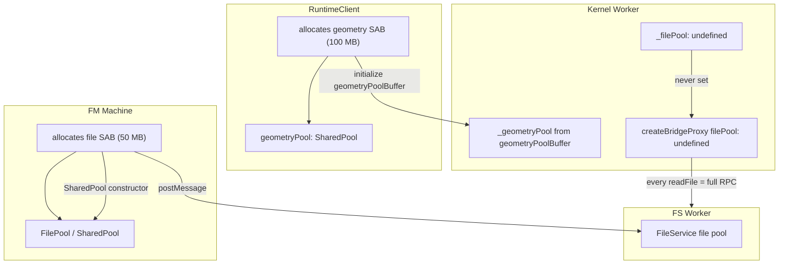
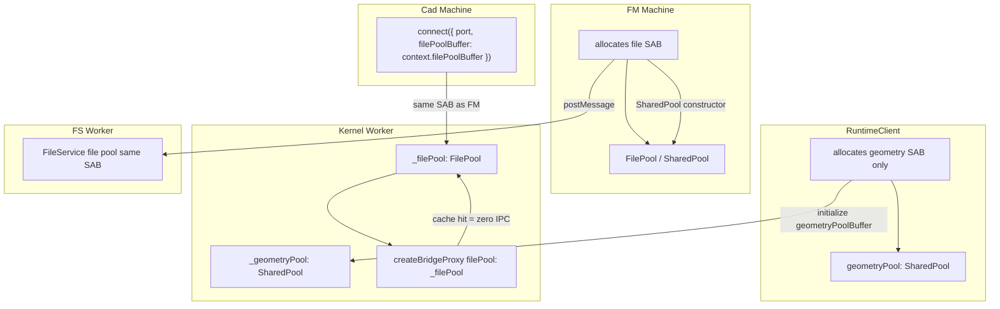

# Shared Memory Pool API Audit

Audit of the shared memory pool infrastructure across the runtime and filesystem layers, tracing the intended architecture against actual wiring, identifying gaps that left performance on the table, and recommending a type-safe API — **now implemented**, with a domain-driven file pool ownership pivot (see executive summary).

## Executive Summary

The Pool API tidy-up is **complete**. The runtime exposes typed configuration via `RuntimeClientOptions.sharedMemory.geometry` (geometry pool only), a public `RuntimeClient.geometryPool` getter, and **`ConnectOptions.filePoolBuffer`** for passing an externally allocated file-pool `SharedArrayBuffer` into `connect()` (including port-based connect). The kernel `initialize` command carries `geometryPoolBuffer` and optional `filePoolBuffer`; `KernelWorker` uses named `_geometryPool` / `_filePool` fields (no string-keyed pool map).

**Domain-driven pivot:** File pool SAB allocation is owned by the **file manager machine** (filesystem domain), not `RuntimeClient`. `RuntimeClient` allocates and owns **only** the geometry pool. `cad.machine` bridges `snapshot.context.filePoolBuffer` from the FM machine through to `client.connect({ port, filePoolBuffer })`, so the kernel worker shares the same SAB as the FS worker and main-thread readers.

The historical audit below records the pre-fix gaps (half-wired file pool, `sharedMemory.pools` / `Record<string, …>` API issues). Those recommendations are **resolved**; see [Recommendations](#recommendations).

## Table of Contents

- [Problem Statement](#problem-statement)
- [Methodology](#methodology)
- [Findings](#findings)
- [Recommendations](#recommendations)
- [Diagrams](#diagrams)
- [References](#references)

## Problem Statement

This document captures the audit that informed the Pool API tidy-up (now shipped). During the planned tidy-up to simplify the `pools: Map<string, SharedPool>` infrastructure to a single `geometryPool` field, the investigation revealed that:

1. The plural pool design was **intentionally architected** in `shared-memory-geometry-pipeline.md` (Finding 3, Finding 11) for unified management of geometry AND file pools.
2. The file pool **had** a **real wiring gap** that left kernel-worker file reads unoptimized (since fixed; see Findings 2 and 4).
3. Simplifying to a single `geometryPool` field would have made it harder to fix that gap.

This audit determined the intended state of shared memory across all layers, cataloged gaps, and recommended an API that covers all missing parts while complying with `library-api-policy.md` — now **implemented**, with the file pool allocation pivot described in the executive summary.

## Methodology

1. Full read of 4 primary research docs: `shared-memory-geometry-pipeline.md` (644 lines), `filesystem-memory-outstanding-items.md` (241 lines), `geometry-pipeline-copy-audit.md`, `shared-worker-fs-architecture.md`
2. Keyword search across 11 additional research docs for SharedPool/SAB/pool references
3. Source-level trace of file pool wiring across `file-manager.machine.ts`, `file-manager.worker.ts`, `file-service.ts`, `kernel-worker.ts`, `runtime-filesystem-bridge.ts`, `runtime-client.ts`, `cad.machine.ts`
4. Evaluation of API alternatives against `library-api-policy.md` sections 3, 5, 12, 13, 16, 17

## Findings

### Finding 1: The Plural Pools Design Was Intentional

The `shared-memory-geometry-pipeline.md` research doc (Finding 11) explicitly designed the unified model:

> "One class, one package, one API. Domain specificity lives in configuration, not in class hierarchy or package boundaries."

The intended consumer API at the time used a plural `pools` record (since replaced). The **current** shape is: geometry configured under `sharedMemory.geometry`; file pool bytes remain in the FM domain with the SAB passed through `connect({ filePoolBuffer })`.

```typescript
const client = createRuntimeClient({
  sharedMemory: {
    geometry: { maxEntries: 20, bytes: 100 * 1024 * 1024, eviction: 'lru' },
  },
});
// File pool: FM machine allocates SAB; cad.machine passes it via connect({ port, filePoolBuffer })
```

The runtime allocates the geometry `SharedArrayBuffer`, passes `geometryPoolBuffer` (and optional `filePoolBuffer`) to the kernel worker via `initialize`, and exposes `client.geometryPool` on the main thread. The kernel worker's file pool in `kernel-worker.ts` bridges to the filesystem bridge proxy; wiring was incomplete at audit time and is **resolved** (see Finding 2).

### Finding 2: File Pool Wiring Gap — Three-Worker Architecture

The file pool requires the same `SharedArrayBuffer` to be shared across three locations:

| Location                                       | Role                                                                                    | Current Status                                  |
| ---------------------------------------------- | --------------------------------------------------------------------------------------- | ----------------------------------------------- |
| FS Worker (`file-service.ts`)                  | Writer: stores file data after `readFile`, invalidates on `writeFile`/`rename`/`unlink` | Wired via `file-manager.machine.ts`             |
| Main Thread (`file-content-service.ts`)        | Reader: main-thread file reads check pool before RPC                                    | Wired via `file-manager.machine.ts`             |
| Kernel Worker (`runtime-filesystem-bridge.ts`) | Reader: bridge proxy checks pool before sending `readFile` RPC to FS worker             | **Was NOT WIRED** — `_filePool` was `undefined` |

**Resolution (implemented):** The file pool buffer is allocated by `file-manager.machine.ts` and shared with the FS worker and main thread as before; `cad.machine` now forwards the same `SharedArrayBuffer` via `client.connect({ port, filePoolBuffer: snapshot.context.filePoolBuffer })`, so the kernel worker receives `filePoolBuffer` on `initialize` and constructs `_filePool` for the bridge proxy.

The historical gap was that the kernel worker never received the buffer through **any** path until this bridge was added.

### Finding 3: Two Separate Allocation Paths Prevent Unification

Pool allocation remains split across two domains by design after the pivot:

| Pool     | Allocator                                             | Buffer Size                            | Recipient Workers                                                                         |
| -------- | ----------------------------------------------------- | -------------------------------------- | ----------------------------------------------------------------------------------------- |
| Geometry | `createRuntimeClient` / `connect()`                   | Configured via `sharedMemory.geometry` | Kernel worker (via `initialize` `geometryPoolBuffer`)                                     |
| File     | `file-manager.machine.ts` (e.g. `connectWorkerActor`) | FM-owned                               | FS worker (via `postMessage`); kernel worker (same SAB via `connect({ filePoolBuffer })`) |

**Resolution (implemented):** The `cad.machine.ts` coordinator bridges the FM machine’s `filePoolBuffer` into `RuntimeClient.connect`, so both workers share one file-pool SAB without `RuntimeClient` allocating it. Unification of _allocation authority_ was intentionally not pursued for the file pool — ownership stays in the filesystem domain.

### Finding 4: Bridge Infrastructure Is Already Built

Both sides of the file pool bridge were fully implemented; at audit time only kernel-side buffer delivery was missing. **Resolution (implemented):** `filePoolBuffer` is now supplied on `initialize`, so `_filePool` is constructed and passed into `createBridgeProxy`.

**Writer side** (`runtime-filesystem-bridge.ts` bridge server, lines 176-178):

```typescript
if (options?.filePool && method === 'readFile' && result instanceof Uint8Array) {
  options.filePool.store(filePath, result as Uint8Array<ArrayBuffer>);
}
```

**Reader side** (`runtime-filesystem-bridge.ts` bridge call, lines 398-405):

```typescript
if (options?.filePool && method === 'readFile') {
  const cached = options.filePool.resolveCopy(filePath);
  if (cached) {
    return encoding === 'utf8' ? new TextDecoder().decode(cached) : new Uint8Array(cached);
  }
}
```

**Kernel worker hookup** (`kernel-worker.ts`, lines 437-440):

```typescript
this.fileSystem = createBridgeProxy<RuntimeFileSystemBase>(input.transferables.fileSystemPort, {
  filePool: this._filePool as FilePool | undefined,
});
```

The bridge proxy on the kernel worker will use the pool if it's provided. It just never receives one.

### Finding 5: Performance Impact of the Gap

Every `readFile` call from the kernel worker currently takes the full RPC path:

```
Kernel Worker                     FS Worker
readFile(path) →
  bridgeCall.call('readFile')
    → postMessage({ method: 'readFile', args: [path] })
                                  → FileService.readFile(path)
                                  → filePool.store(path, data)  ← writes to pool
    ← postMessage({ result: data })
  ← transfered Uint8Array
```

With the pool wired, repeated reads would hit the zero-IPC fast path:

```
Kernel Worker
readFile(path) →
  bridgeCall checks filePool.resolveCopy(path)
    → cache hit: return immediately (zero IPC)
```

This is the hot path during re-renders: the kernel re-reads source files, dependencies, and `.tau/parameters.json`. Each re-read is an avoidable round-trip.

### Finding 6: API Policy Violations in Current Design

The **pre-tidy-up** `sharedMemory.pools` / string-keyed `Record<string, SharedMemoryPoolConfig>` API had three `library-api-policy.md` violations regardless of pool count:

| Policy Section                | Violation                                                                                             | Impact                                   |
| ----------------------------- | ----------------------------------------------------------------------------------------------------- | ---------------------------------------- |
| Section 3 (Flat Options)      | `sharedMemory.pools.geometry.bytes` was 4 levels deep                                                 | Hard to read, hard to autocomplete       |
| Section 12 (TypeScript-First) | `Record<string, SharedMemoryPoolConfig>` erased pool identity — `pools.get('typo')` compiled silently | Runtime errors instead of compile errors |
| Section 5 (Naming)            | `pools` was ambiguous — did not describe what the pools were for                                      | Discoverability issue                    |

**Resolution (implemented):** Geometry uses `sharedMemory.geometry` (3 levels: `sharedMemory.geometry.bytes`). The public client surface is `client.geometryPool` (not `client.pools` / `pools.get('geometry')`). File pool configuration is not duplicated on `RuntimeClient`; the buffer is supplied at connect time as `ConnectOptions.filePoolBuffer`.

### Finding 7: API Alternatives Evaluation

Four API designs were evaluated for the multi-pool case:

**Option A: Historical (`Record<string, Config>`)** — generic, untyped

```typescript
// Pre-tidy-up (historical)
sharedMemory: {
  pools: {
    geometry: { bytes: 100MB, maxEntries: 20, eviction: 'lru' },
    file:     { bytes: 50MB, maxEntries: 200, eviction: 'none' },
  },
}
// client.pools.get('geometry') — replaced by client.geometryPool
```

| Criterion         | Score          | Notes                                |
| ----------------- | -------------- | ------------------------------------ |
| Nesting depth     | 4              | `sharedMemory.pools.geometry.bytes`  |
| Type safety       | None           | String keys, typos compile           |
| Discoverability   | Low            | No autocomplete on pool names        |
| Extensibility     | High           | New pool = new entry, no type change |
| Policy compliance | Fails 3, 5, 12 |                                      |

**Option B: Named typed fields under `sharedMemory`**

```typescript
// Implemented: geometry-only on options; file SAB via connect (see Finding 8)
sharedMemory: {
  geometry: { bytes: 100MB, maxEntries: 20, eviction: 'lru' },
}
// client.geometryPool; file pool buffer → connect({ filePoolBuffer })
```

| Criterion         | Score      | Notes                                      |
| ----------------- | ---------- | ------------------------------------------ |
| Nesting depth     | 3          | `sharedMemory.geometry.bytes`              |
| Type safety       | Full       | Named fields, typos caught at compile time |
| Discoverability   | High       | Autocomplete shows `geometry` and `file`   |
| Extensibility     | Medium     | New pool = new optional field on type      |
| Policy compliance | Passes all | Flat enough, typed, descriptive            |

**Option C: Top-level pool fields**

```typescript
geometryPool: { bytes: 100MB, maxEntries: 20, eviction: 'lru' },
filePool:     { bytes: 50MB, maxEntries: 200, eviction: 'none' },
// client.geometryPool / client.filePool
```

| Criterion         | Score      | Notes                                       |
| ----------------- | ---------- | ------------------------------------------- |
| Nesting depth     | 2          | `geometryPool.bytes`                        |
| Type safety       | Full       | Named fields                                |
| Discoverability   | High       |                                             |
| Extensibility     | Medium     | New pool = new top-level option             |
| Policy compliance | Passes all | But clutters root options with SAB concerns |

**Option D: Single pool + separate file pool source**

```typescript
sharedMemory: { bytes: 100MB, maxEntries: 20, eviction: 'lru' },
// Only geometry pool via runtime; file pool stays in FM machine
```

| Criterion     | Score   | Notes                                    |
| ------------- | ------- | ---------------------------------------- |
| Nesting depth | 2       | `sharedMemory.bytes`                     |
| Type safety   | Full    | Only one pool, no ambiguity              |
| Extensibility | None    | Cannot add file pool without new field   |
| File pool fix | Blocked | Separate allocation prevents unification |

**Verdict: Option B** provides the best balance. **Implemented:** `sharedMemory.geometry` matches Option B’s named-field pattern for the runtime-owned pool. The file pool is not configured alongside geometry on `RuntimeClient`; instead, the FM-allocated SAB is passed through **`ConnectOptions.filePoolBuffer`** (domain-driven ownership; see Finding 8).

### Finding 8: File Pool Allocation Strategy

Two approaches can fix the file pool wiring:

**Approach 1: Runtime-first allocation**

The runtime client would allocate all pool SABs; the app layer would bridge the file pool buffer to the FM machine. This was evaluated as a single allocation authority and one config surface for both pools.

**Approach 2: FM-first allocation (implemented)**

The FM machine allocates the file pool SAB. The cad machine bridges it into the runtime via **`connect({ filePoolBuffer })`** (and port-based connect). `RuntimeClient` does **not** allocate the file pool; it only forwards the external SAB to the kernel worker next to `geometryPoolBuffer`.

```
file-manager.machine.ts connectWorkerActor
  → allocates file SAB
  → posts to FM worker
  → stores on context.filePoolBuffer

cad.machine.ts connectKernelActor
  → await client.connect({ port, filePoolBuffer: snapshot.context.filePoolBuffer })
  → runtime forwards filePoolBuffer on initialize
```

**Resolution (implemented):** **Approach 2** was chosen for domain-driven ownership (filesystem owns **FilePool** lifecycle and buffer sizing). Geometry remains runtime-owned via `sharedMemory.geometry` and `client.geometryPool`. The audit’s earlier “recommended” label on Approach 1 was superseded by this pivot.

### Finding 9: Additional Documented Pool Opportunities

The research docs identify two additional pool candidates beyond geometry and file:

| Pool       | Purpose                                      | Priority | Source                                                           |
| ---------- | -------------------------------------------- | -------- | ---------------------------------------------------------------- |
| Parameters | Cache `getParameters` JSON across re-renders | Low      | geometry-pipeline Finding 8: "Marginal (avoids stringify/parse)" |
| Export     | Share export pipeline bytes                  | Low      | geometry-pipeline Finding 8: "Could share pool — future"         |

Neither justifies immediate implementation. The API should accommodate them without requiring structural changes.

### Finding 10: Wire Protocol Implications

With two pools (geometry + file), the wire protocol needs to carry two buffer fields. Two approaches:

**Approach A: Generic record (historical)**

```typescript
// RuntimeCommand initialize (superseded)
sharedPools?: Record<string, SharedArrayBuffer>;
```

Flexible but untyped. Same policy issues as the options API. **Not used** in the shipped protocol.

**Approach B: Named fields**

```typescript
// RuntimeCommand initialize
geometryPoolBuffer?: SharedArrayBuffer;
filePoolBuffer?: SharedArrayBuffer;
```

Type-safe, discoverable, matches the options API. Adding a new pool means adding a field — acceptable for an internal protocol type that changes rarely.

**Verdict: Approach B** for consistency with the options API. The wire protocol is internal to the runtime framework and changes are non-breaking.

**Resolution (implemented):** `initialize` uses `geometryPoolBuffer` and optional `filePoolBuffer` as named fields.

## Recommendations

All items below are **RESOLVED** as of the Pool API tidy-up and domain-driven file pool pivot.

| #   | Action                                                                     | Priority | Status       | Resolution / implementation notes                                                                                               |
| --- | -------------------------------------------------------------------------- | -------- | ------------ | ------------------------------------------------------------------------------------------------------------------------------- |
| R1  | Adopt Option B API: named typed fields under `sharedMemory`                | P0       | **RESOLVED** | `sharedMemory.geometry` for the geometry pool; no string-keyed `Record` on options.                                             |
| R2  | Fix file pool wiring                                                       | P0       | **RESOLVED** | FM-allocated SAB bridged by `cad.machine` via `connect({ port, filePoolBuffer })` (not runtime-first allocation).               |
| R3  | Use named fields in wire protocol (`geometryPoolBuffer`, `filePoolBuffer`) | P0       | **RESOLVED** | `initialize` carries named buffers; matches API.                                                                                |
| R4  | Remove FM machine's independent SAB allocation                             | P1       | **RESOLVED** | **Superseded by pivot:** FM **retains** file pool allocation; ownership is domain-driven.                                       |
| R5  | Pass file pool SAB into connect for FM ↔ kernel sharing                    | P1       | **RESOLVED** | `ConnectOptions.filePoolBuffer` passes external SAB; `client.geometryPool` is the public pool getter (geometry only).           |
| R6  | Update `KernelWorker` to accept named pool buffers                         | P1       | **RESOLVED** | `_geometryPool` / `_filePool` and named buffers; bridge uses **FilePool** type.                                                 |
| R7  | Update plan to reflect multi-pool architecture                             | P0       | **RESOLVED** | Two pools, two ownership domains (runtime geometry + filesystem file).                                                          |
| R8  | Update all research docs with new API shape                                | P2       | **RESOLVED** | This doc and related research updated to match `sharedMemory.geometry`, `client.geometryPool`, `ConnectOptions.filePoolBuffer`. |

### R1: Target API Shape

**Status: Implemented** (with file pool config living in the FM domain, not duplicated on `RuntimeClient`).

**Options type:**

```typescript
type SharedMemoryConfig = SharedPoolOptions & { bytes: number };

type RuntimeClientOptions = {
  // ... existing fields ...
  sharedMemory?: {
    geometry?: SharedMemoryConfig;
  };
};
```

**Client interface:**

```typescript
type RuntimeClient = {
  // ... existing fields ...
  readonly geometryPool: SharedPool | undefined;
};
```

**Consumer wiring:**

```typescript
const client = createRuntimeClient({
  kernels: [...],
  sharedMemory: {
    geometry: { bytes: 100 * 1024 * 1024, maxEntries: 20, eviction: 'lru' },
  },
});
await client.connect({ port, filePoolBuffer: externalFilePoolSab });
```

### R2: File Pool Wiring Fix

**Status: Implemented** — `cad.machine` `connectKernelActor` calls `await client.connect({ port, filePoolBuffer: snapshot.context.filePoolBuffer })`. The FM machine keeps allocating the file pool SAB; the cad machine does **not** pull a buffer from `RuntimeClient` to send to the FM worker.

### R3–R6: Wire Protocol and Framework Changes

**Status: Implemented.**

**Wire protocol** (`runtime-protocol.types.ts`):

```typescript
// Initialize command
geometryPoolBuffer?: SharedArrayBuffer;
filePoolBuffer?: SharedArrayBuffer;

// GltfContentDelivery (geometry-specific, no pool name needed)
| { readonly delivery: 'pooled'; readonly key: string }
```

**KernelWorker** (`kernel-worker.ts`):

```typescript
private _geometryPool: SharedPool | undefined;
private _filePool: SharedPool | undefined;

get geometryPool(): SharedPool | undefined;
get filePool(): SharedPool | undefined;
// Buffers applied during initialize from named fields
```

The file pool is the real, typed `this._filePool`, passed to `createBridgeProxy({ filePool: this._filePool })`.

**Middleware context**: generic `pools` map removed in favor of typed geometry/file handling where applicable.

### R7: Plan Update Impact

**Status: Implemented.** The shipped design replaces generic `Map<string, SharedPool>` / string-keyed options with:

- Geometry pool: `sharedMemory.geometry`, `client.geometryPool`, `geometryPoolBuffer` on initialize
- File pool: FM-owned SAB, **`ConnectOptions.filePoolBuffer`**, kernel `filePool` + FS worker sharing the same buffer
- Bridge the FM buffer through `cad.machine` into `connect`, without moving file allocation into `RuntimeClient`

## Diagrams

### Baseline (audit): Split allocation and broken kernel file-pool reader

Historical state documented by this audit before the wiring fix:



### Implemented architecture: Domain-driven file pool + runtime geometry pool

FM owns file SAB allocation; `RuntimeClient` allocates only geometry; `cad.machine` passes `filePoolBuffer` into `connect`.



## References

- `docs/research/shared-memory-geometry-pipeline.md` — Finding 3 (generic pool), Finding 11 (unified architecture), R4-R5 (wiring)
- `docs/research/filesystem-memory-outstanding-items.md` — O1/O2 (resolved), O16 (offscreen rendering)
- `docs/research/geometry-pipeline-copy-audit.md` — Copy catalog, C7 pool.store
- `docs/policy/library-api-policy.md` — Sections 3, 5, 12, 13, 16, 17
- `packages/runtime/src/framework/runtime-filesystem-bridge.ts` — Bridge server/call filePool code
- `packages/runtime/src/framework/kernel-worker.ts` — `_filePool` wiring to bridge proxy
- `apps/ui/app/machines/cad.machine.ts` — Bridges FM `filePoolBuffer` into `client.connect({ port, filePoolBuffer })`
- `apps/ui/app/machines/file-manager.machine.ts` — Owns file pool SAB allocation (domain-driven)
