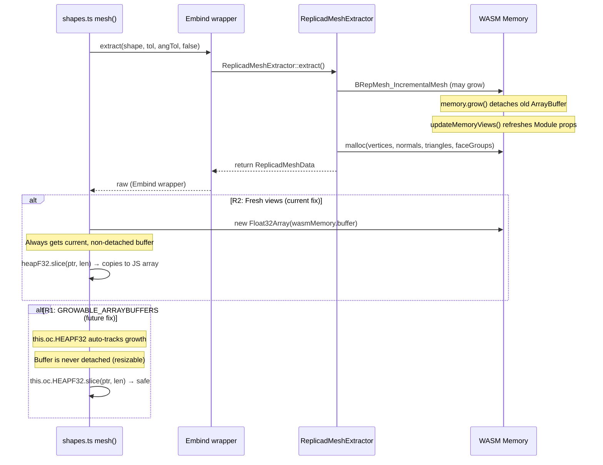

# WASM Heap View Detachment in Replicad Mesh Extraction

Investigation into the intermittent `Cannot perform %TypedArray%.prototype.slice on a detached or out-of-bounds ArrayBuffer` error that occurs during replicad mesh extraction, and evaluation of zero-copy strategies to maintain direct WASM memory access without introducing copies.

## Executive Summary

The error occurs because `ReplicadMeshExtractor.extract()` triggers `WebAssembly.Memory.grow()` internally (via OCCT meshing + `malloc`), which detaches the `ArrayBuffer` underlying all existing `TypedArray` views. Although Emscripten's `updateMemoryViews()` refreshes `Module["HEAPF32"]` etc., the `this.oc.HEAPF32` property lookup in JavaScript may evaluate to a stale view due to expression evaluation order or JIT caching. Several zero-copy strategies exist: (1) **Resizable ArrayBuffer (RAB)** integration via Emscripten's `GROWABLE_ARRAYBUFFERS` flag — TypedArray views auto-track growth, eliminating detachment entirely; (2) **pre-growing memory** before extraction to prevent growth during the critical section; (3) **`wasmMemory.buffer` fresh subarray** creation immediately after `extract()` returns. The RAB approach is the architecturally correct long-term fix; pre-grow is the practical immediate fix.

## Table of Contents

- [Problem Statement](#problem-statement)
- [Methodology](#methodology)
- [Findings](#findings)
  - [Finding 1: Memory growth inside extract()](#finding-1-memory-growth-occurs-inside-extract)
  - [Finding 2: updateMemoryViews correctly refreshes Module](#finding-2-updatememoryviews-correctly-refreshes-module-properties)
  - [Finding 3: Expression evaluation order hazard](#finding-3-javascript-expression-evaluation-order-hazard)
  - [Finding 4: malloc buffers hold valid WASM pointers](#finding-4-the-malloc-buffers-hold-raw-wasm-heap-pointers)
  - [Finding 5: meshEdges has the same vulnerability](#finding-5-the-meshedges-method-has-the-same-vulnerability)
  - [Finding 6: Parameter changes increase growth likelihood](#finding-6-the-error-is-more-frequent-after-parameter-changes)
  - [Finding 7: Resizable ArrayBuffer eliminates detachment](#finding-7-resizable-arraybuffer-eliminates-detachment)
  - [Finding 8: Pre-grow prevents growth during critical section](#finding-8-pre-grow-prevents-growth-during-critical-section)
  - [Finding 9: typed_memory_view is NOT zero-copy safe](#finding-9-typed_memory_view-is-not-zero-copy-safe)
  - [Finding 10: Fresh subarray from wasmMemory.buffer](#finding-10-fresh-subarray-from-wasmemorybuffer)
- [Recommendations](#recommendations)
- [Trade-offs](#trade-offs)
- [Code Examples](#code-examples)
- [Diagrams](#diagrams)
- [References](#references)

## Problem Statement

After parameter changes in the Tau editor, the replicad kernel intermittently fails with:

```
Cannot perform %TypedArray%.prototype.slice on a detached or out-of-bounds ArrayBuffer

Stack trace:
  1 | Compound.mesh (/.../replicad.js:2817:47)
```

The error is intermittent — it only occurs when WASM memory growth happens to be triggered during the mesh extraction call. This is more likely after parameter changes because the previous geometry is cleaned up and new geometry is built, creating allocation pressure on the WASM heap.

The original motivation for direct WASM heap access (`this.oc.HEAPF32.slice(ptr, len)`) was to avoid the overhead of copying data through embind's `val` layer. The question is whether zero-copy access can be preserved while eliminating the detachment risk.

## Methodology

1. Analyzed the C++ `ReplicadMeshExtractor` and `ReplicadEdgeMeshExtractor` implementations in `custom_build_single.yml` (lines 299–683)
2. Examined the JavaScript `mesh()` and `meshEdges()` methods in `repos/replicad/packages/replicad/src/shapes.ts` (lines 358–446)
3. Decompiled the generated `replicad_single.js` to verify `updateMemoryViews()` behavior
4. Reviewed Emscripten documentation and issue tracker for `ALLOW_MEMORY_GROWTH` interactions with typed array views
5. Traced the allocation path from `extract()` through `malloc`, OCCT meshing APIs, and back to JavaScript heap reads
6. Researched TC39 Resizable ArrayBuffer proposal (Stage 4 / ES2024) and its WebAssembly spec integration
7. Reviewed Emscripten PR #24684 (`GROWABLE_ARRAYBUFFERS` flag) and issue #24287
8. Analyzed `WebAssembly.Memory.toResizableBuffer()` spec and browser shipping status
9. Evaluated `typed_memory_view`, `SharedArrayBuffer`, pre-grow, and `DataView` strategies against zero-copy requirements

## Findings

### Finding 1: Memory growth occurs inside `extract()`

The `ReplicadMeshExtractor::extract()` static method performs multiple operations that can trigger `WebAssembly.Memory.grow()`:

| Operation                                  | Allocation risk                 | Location (YAML lines) |
| ------------------------------------------ | ------------------------------- | --------------------- |
| `BRepTools::Clean(shape)`                  | OCCT internal allocations       | 358                   |
| `BRepMesh_IncrementalMesh(...)`            | Major OCCT mesh data structures | 359                   |
| `std::malloc` for vertices buffer          | Direct heap allocation          | 381–383               |
| `std::malloc` for normals buffer           | Direct heap allocation          | 387–389               |
| `std::malloc` for triangles buffer         | Direct heap allocation          | 392–394               |
| `std::malloc` for faceGroups buffer        | Direct heap allocation          | 396–398               |
| `BRepAdaptor_Surface`, `BRepLProp_SLProps` | OCCT surface evaluation         | 433–441               |

The build configuration enables memory growth:

```yaml
- -sALLOW_MEMORY_GROWTH=1
- -sINITIAL_MEMORY=100MB
- -sMAXIMUM_MEMORY=4GB
```

When current WASM memory is insufficient for any of these allocations, `memory.grow()` is called, which **detaches** the `ArrayBuffer` underlying all existing `TypedArray` views.

### Finding 2: `updateMemoryViews()` correctly refreshes Module properties

Analysis of the generated `replicad_single.js` confirms that `updateMemoryViews()` does update the three exported HEAP views on the Module object:

```javascript
function updateMemoryViews() {
  var b = wasmMemory.buffer;
  HEAP8 = new Int8Array(b);
  HEAP16 = new Int16Array(b);
  HEAPU8 = new Uint8Array(b);
  HEAPU16 = new Uint16Array(b);
  Module['HEAP32'] = HEAP32 = new Int32Array(b);
  Module['HEAPU32'] = HEAPU32 = new Uint32Array(b);
  Module['HEAPF32'] = HEAPF32 = new Float32Array(b);
  HEAPF64 = new Float64Array(b);
}
```

This function is called both during `growMemory()` and during initial instantiation. After growth, `Module["HEAPF32"]` etc. point to fresh views on the new buffer. The `this.oc` field in replicad's `Shape` class is a direct reference to this Module object (set via `this.oc = getOC()` in `WrappingObj` constructor, `register.ts:33`).

### Finding 3: JavaScript expression evaluation order hazard

The current code evaluates `this.oc.HEAPF32` and the embind method calls in a single expression:

```typescript
this.oc.HEAPF32.slice(raw.getVerticesPtr() / 4, ...)
```

JavaScript evaluation order (ECMAScript spec §13.3.2):

1. `this.oc.HEAPF32` evaluates — captures a `Float32Array` reference
2. `.slice` is resolved from the prototype
3. `raw.getVerticesPtr()` is evaluated — calls into WASM via embind
4. `raw.getVerticesSize()` is evaluated — calls into WASM via embind
5. `.slice(start, end)` is called on the view from step 1

If any WASM call in steps 3–4 triggers memory growth (e.g., the embind trampoline allocates stack or exception-handling structures), the `Float32Array` from step 1 would be backed by a detached `ArrayBuffer` when `.slice()` is invoked in step 5. While simple `getVerticesPtr()` accessors are unlikely to allocate, the embind ABI includes `dynCall` indirection and potential `try/catch` instrumentation (when `-fwasm-exceptions` is enabled) that could trigger minor allocations.

### Finding 4: The `malloc` buffers hold raw WASM heap pointers

`ReplicadMeshData` stores `float*`, `uint32_t*`, and `int32_t*` pointers into the WASM linear memory:

```cpp
int getVerticesPtr() const {
  return static_cast<int>(reinterpret_cast<uintptr_t>(verticesPtr_));
}
```

These pointers remain valid after `memory.grow()` — memory growth extends the buffer but does not relocate existing allocations. The pointers are fine; it is only the JavaScript `TypedArray` views that become stale.

### Finding 5: The `meshEdges()` method has the same vulnerability

The edge extractor follows an identical pattern, reading `this.oc.HEAPF32` and `this.oc.HEAP32` after `ReplicadEdgeMeshExtractor.extract()`. Additionally uses `std::vector<CurveTessInfo>::push_back` which can trigger reallocations, further increasing memory growth likelihood.

### Finding 6: The error is more frequent after parameter changes

Parameter changes trigger: (1) `BRepTools::Clean()` — deallocates old mesh data, (2) new code execution creating new geometry, (3) `ReplicadMeshExtractor::extract()` — allocates fresh OCCT mesh + output buffers. This sequence maximizes allocation pressure because old mesh data may have been freed (fragmenting the heap) while new, potentially larger geometry requires fresh allocations.

### Finding 7: Resizable ArrayBuffer eliminates detachment

The TC39 Resizable ArrayBuffer (RAB) proposal reached **Stage 4** and is part of **ES2024**. TypedArray views created on a resizable `ArrayBuffer` **auto-track** the buffer's size — they are never detached by `resize()` / growth. The WebAssembly spec integrates with RAB via `Memory.toResizableBuffer()` ([WebAssembly JS API Editor's Draft](https://webassembly.github.io/spec/js-api/)).

| Component                          | Status                                                                               | Reference                                                                                                                          |
| ---------------------------------- | ------------------------------------------------------------------------------------ | ---------------------------------------------------------------------------------------------------------------------------------- |
| Resizable ArrayBuffer (JS)         | Baseline 2024, shipped all browsers                                                  | Chrome 111, Firefox 128, Safari 16.4                                                                                               |
| `Memory.toResizableBuffer()`       | In spec, behind `--experimental-wasm-rab-integration` in Chrome/Node as of July 2025 | [WebAssembly/spec PR #1300](https://github.com/WebAssembly/spec/pull/1300), [#1871](https://github.com/WebAssembly/spec/pull/1871) |
| Emscripten `GROWABLE_ARRAYBUFFERS` | Merged July 2025, behind flag                                                        | [PR #24684](https://github.com/emscripten-core/emscripten/pull/24684)                                                              |
| WebKit implementation              | Shipped                                                                              | [WebKit commit e65b587](https://commits.webkit.org/298955@main)                                                                    |
| Interop 2025 inclusion             | Accepted                                                                             | [web-platform-tests/interop #876](https://github.com/web-platform-tests/interop/issues/876)                                        |

When RAB is active, `memory.grow()` updates the buffer **in place**. The "refresh buffer" algorithm in the spec updates `[[ArrayBufferData]]` / `[[ArrayBufferByteLength]]` without detaching, so all existing `TypedArray` views remain valid. This is a **zero-copy, zero-detachment** solution — no changes needed to the `mesh()` / `meshEdges()` code at all.

**Emscripten integration:** PR #24684 adds `GROWABLE_ARRAYBUFFERS` flag. When enabled, Emscripten calls `Memory.toResizableBuffer()` during init, and `updateMemoryViews()` becomes a no-op (views auto-update). The PR was merged July 14, 2025 but noted that `toResizableBuffer()` was still behind a flag in Chrome/Node at that time. As of April 2026, with Interop 2025 acceptance and webkit shipping, the API is likely unflagged in current stable browsers.

### Finding 8: Pre-grow prevents growth during critical section

`WebAssembly.Memory.grow(pages)` can be called from JavaScript to proactively expand memory before entering a critical section. If the WASM heap is pre-grown to accommodate the upcoming `extract()` allocations, no growth occurs during extraction, and existing views remain valid.

The Emscripten-generated `growMemory` function is accessible internally. Alternatively, we can call `wasmMemory.grow(pages)` directly from the Module instance, followed by `updateMemoryViews()` to refresh views:

```typescript
const wasmMemory = this.oc.wasmMemory;
const currentPages = wasmMemory.buffer.byteLength / 65536;
const targetPages = Math.ceil(estimatedBytes / 65536);
if (targetPages > currentPages) {
  wasmMemory.grow(targetPages - currentPages);
}
```

This is practical for mesh extraction because the shape's bounding box and face/edge count provide reasonable heuristics for memory needs. The `extract()` C++ code already performs a counting pass (`totalNodes`, `totalTriangles`, `totalFaces`) before allocation — the same count could be exposed via a separate `estimateSize()` method.

### Finding 9: `typed_memory_view` is NOT zero-copy safe

`emscripten::typed_memory_view(size, ptr)` creates a JavaScript TypedArray **view** (not a copy) on the current WASM buffer. However, this view is subject to the same detachment hazard as any other view on a non-resizable buffer:

- If `memory.grow()` is called **after** `typed_memory_view` creates the view, the view's buffer is detached
- [Emscripten issue #17524](https://github.com/emscripten-core/emscripten/issues/17524) documents this: `typed_memory_view` with large arrays can yield empty views when memory growth occurs during the call
- The Emscripten documentation explicitly warns: do not hold `typed_memory_view` references across calls that may grow memory

The view IS safe if consumed immediately (single expression) because JavaScript is single-threaded and no other WASM code can run between the C++ return and JS consumption. But calling `.slice()` on the view defeats the zero-copy purpose — it copies. Using the view directly (e.g., passing to `WebGL.bufferData`) is zero-copy but only safe within the same synchronous call frame.

### Finding 10: Fresh subarray from `wasmMemory.buffer`

Instead of relying on the Module's `HEAPF32` property (which may be stale in edge cases), we can create a fresh `TypedArray` view directly from the live `wasmMemory.buffer` after each `extract()` call:

```typescript
const buf = this.oc.wasmMemory.buffer;
const heapF32 = new Float32Array(buf);
const heapU32 = new Uint32Array(buf);
const heapI32 = new Int32Array(buf);
```

This is zero-copy (the TypedArray views are windows into the same buffer, not copies) and guaranteed fresh because `wasmMemory.buffer` always returns the current buffer. The `.slice()` call that follows does copy the data into JS arrays, but that copy is inherent to the use case (we need JS-owned arrays for GLTF construction).

**Key distinction:** Creating a `new Float32Array(buf)` is O(1) — it only creates a view descriptor, not a data copy. The subsequent `.slice(start, end)` performs the only copy. This is equivalent to the current approach in terms of copy overhead, but eliminates the detachment risk by constructing the view on the provably-current buffer.

## Recommendations

| #   | Action                                                        | Priority | Effort | Impact | Zero-copy?          | Status         |
| --- | ------------------------------------------------------------- | -------- | ------ | ------ | ------------------- | -------------- |
| R1  | Enable `GROWABLE_ARRAYBUFFERS` in Emscripten build            | P0       | Low    | High   | Yes                 | ❌ Rejected    |
| R2  | Create fresh views from `wasmMemory.buffer` after `extract()` | P0       | Low    | High   | Yes (view creation) | ✅ Implemented |
| R3  | Pre-grow memory before extraction                             | P1       | Medium | High   | Yes                 | Deferred       |
| R4  | Expose C++ `estimateSize()` for pre-grow heuristics           | P2       | Medium | Medium | Yes                 | Deferred       |
| R5  | Add defensive try/catch with retry                            | P2       | Low    | Medium | N/A                 | Deferred       |

### R1: Enable Resizable ArrayBuffer (rejected — Node LTS gap)

**Status**: ❌ Rejected (2026-04-17). The path was attempted in `replicad-opencascadejs` 0.21.0-v8.50 by adding `-sGROWABLE_ARRAYBUFFERS=1` to `custom_build_single.yml`. At runtime Emscripten emits `wasmMemory.toResizableBuffer()`, which is gated behind Node.js's `--experimental-wasm-rab-integration` flag. Worse, that flag is rejected when set via `NODE_OPTIONS` (`--experimental-wasm-rab-integration is not allowed in NODE_OPTIONS`), so it cannot be propagated to consumer Node toolchains (Tau CLI, Vitest workers, downstream apps) without intrusive launcher changes. See `wasm-rab-integration-node-status.md` for the full Node/V8 status investigation. The flag was reverted in v8.51 in favor of R2.

Add `-sGROWABLE_ARRAYBUFFERS` to the Emscripten build flags in `custom_build_single.yml`:

```yaml
emccFlags:
  - -sGROWABLE_ARRAYBUFFERS=1
```

This makes `memory.grow()` update the buffer in-place. All `TypedArray` views auto-track the resize. No code changes needed in `shapes.ts` — the existing `this.oc.HEAPF32.slice(...)` pattern becomes safe because `HEAPF32`'s backing buffer is never detached.

**Browser requirements:** `Memory.toResizableBuffer()` must be available unflagged. As of April 2026, it is part of Interop 2025 with shipping implementations in WebKit. Chrome/Node status should be verified before deploying. Emscripten falls back gracefully if the API is unavailable (uses traditional fixed buffers).

### R2: Fresh views from `wasmMemory.buffer` (implemented)

**Status**: ✅ Implemented in `replicad` 0.21.0-v8.52 (`repos/replicad/packages/replicad/src/shapes.ts`, `mesh()` and `meshEdges()`). Requires `wasmMemory` to be in `EXPORTED_RUNTIME_METHODS` of `custom_build_single.yml` (added in `replicad-opencascadejs` 0.21.0-v8.51). The `buildFromYaml.py` `.d.ts` generator emits a typed `wasmMemory: WebAssembly.Memory` field on `OpenCascadeInstance` when the runtime method is requested, so consumers get type-safe access without `as any` casts.

```typescript
const raw = this.oc.ReplicadMeshExtractor.extract(...);

// Take fresh views off the live WebAssembly.Memory buffer AFTER extract()
// has returned, so any internal memory growth cannot leave us with a
// detached view.
const buffer = this.oc.wasmMemory.buffer;
const heapF32 = new Float32Array(buffer);
const heapU32 = new Uint32Array(buffer);
const heapI32 = new Int32Array(buffer);

const vertices = Array.from(heapF32.subarray(raw.getVerticesPtr() / 4, ...));
```

This is zero-copy at the view level (creating a `Float32Array` from an existing buffer is O(1)). The subsequent `Array.from(...)` copy is inherent to the use case (we need JS-owned arrays for GLTF construction).

**Proxy gotcha**: `replicad.kernel.ts` wraps the OC instance in `wrapOcForExceptions` (and optionally `wrapOcWithTracing`). The wrapper's `isOcNamespace` heuristic originally treated any non-callable object without a `delete()` method as an OC namespace and proxied it. `WebAssembly.Memory` matched this heuristic, and `Reflect.get(wasmMemory, 'buffer', proxy)` invokes the `WebAssembly.Memory.prototype.buffer` accessor with the Proxy as `this` — which throws `WebAssembly.Memory.buffer: Receiver is not a WebAssembly.Memory`. Fix: tighten `isOcNamespace` to require a plain prototype (`Object.prototype` or `null`) so host-platform objects (`WebAssembly.Memory`, typed array `HEAP*` views) are returned unwrapped. See `packages/runtime/src/kernels/replicad/oc-tracing.ts`.

### R3: Pre-grow memory before extraction

Estimate the required memory before calling `extract()` and pre-grow:

```typescript
const currentBytes = (this.oc as any).wasmMemory.buffer.byteLength;
const shapeSize = this.boundingBox.volume * DENSITY_HEURISTIC;
const estimatedNeed = currentBytes + shapeSize;
const neededPages = Math.ceil((estimatedNeed - currentBytes) / 65536);
if (neededPages > 0) {
  (this.oc as any).wasmMemory.grow(neededPages);
}
```

This prevents growth during `extract()`, making all existing views safe. Combined with R2, this provides defense-in-depth.

### R4: Expose C++ `estimateSize()` method

Add a lightweight C++ method that performs only the counting pass (no meshing, no allocation) and returns the estimated byte requirement:

```cpp
static int estimateMemory(const TopoDS_Shape& shape, double tolerance, double angularTolerance) {
  BRepMesh_IncrementalMesh mesher(shape, tolerance, Standard_False, angularTolerance, Standard_False);
  int totalNodes = 0, totalTriangles = 0, totalFaces = 0;
  for (TopExp_Explorer ex(shape, TopAbs_FACE); ex.More(); ex.Next()) {
    TopLoc_Location loc;
    Handle(Poly_Triangulation) tri = BRep_Tool::Triangulation(TopoDS::Face(ex.Current()), loc);
    if (tri.IsNull()) continue;
    totalNodes += tri->NbNodes();
    totalTriangles += tri->NbTriangles();
    totalFaces++;
  }
  return (totalNodes * 3 * 4) + (totalNodes * 3 * 4) + (totalTriangles * 3 * 4) + (totalFaces * 3 * 4) + (1 << 20);
}
```

**Note:** `BRepMesh_IncrementalMesh` itself allocates, so this method also triggers growth. The pre-grow strategy in R3 is more practical without this — use bounding box heuristics instead. This recommendation is lower priority and mainly useful if precise pre-sizing is needed.

### R5: Defensive retry

As belt-and-suspenders, wrap the mesh extraction in a try/catch that detects detached buffer errors and retries once. The retry works because the C++ `extract()` succeeded (data is in the heap), only the JS read failed:

```typescript
mesh(options = {}): ShapeMesh {
  try {
    return this._meshImpl(options);
  } catch (e) {
    if (e instanceof TypeError && String(e.message).includes('detached')) {
      return this._meshImpl(options);
    }
    throw e;
  }
}
```

## Trade-offs

| Strategy                                | Zero-copy  | Eliminates root cause            | Effort        | Browser dependency              | Risk                                        |
| --------------------------------------- | ---------- | -------------------------------- | ------------- | ------------------------------- | ------------------------------------------- |
| **R1: GROWABLE_ARRAYBUFFERS**           | Yes        | Yes — no detachment possible     | Low (1 flag)  | `toResizableBuffer()` unflagged | Graceful fallback available                 |
| **R2: Fresh `wasmMemory.buffer` views** | Yes (view) | Yes — always uses current buffer | Low (4 lines) | None                            | None — universally safe                     |
| **R3: Pre-grow**                        | Yes        | Prevents (not eliminates) growth | Medium        | None                            | Over-allocation waste; heuristic inaccuracy |
| **R5: Try/catch retry**                 | N/A        | No — band-aid                    | Low           | None                            | Doubles worst-case latency                  |

**Recommended approach:** Implement R2 immediately (zero risk, solves the bug). Add R1 when `toResizableBuffer()` is confirmed unflagged in target browsers (eliminates the entire class of bugs). R5 as optional defense-in-depth.

## Code Examples

### Current vulnerable pattern (shapes.ts lines 358-405)

```typescript
mesh({ tolerance = 1e-3, angularTolerance = 0.1 } = {}): ShapeMesh {
  const raw = this.oc.ReplicadMeshExtractor.extract(
    this.wrapped, tolerance, angularTolerance, false,
  );
  // this.oc.HEAPF32 may reference a detached buffer if growth occurred
  const vertices = Array.from(
    this.oc.HEAPF32.slice(raw.getVerticesPtr() / 4, ...),
  );
}
```

### Fixed pattern (R2 — fresh views from wasmMemory.buffer)

```typescript
mesh({ tolerance = 1e-3, angularTolerance = 0.1 } = {}): ShapeMesh {
  const raw = this.oc.ReplicadMeshExtractor.extract(
    this.wrapped, tolerance, angularTolerance, false,
  );

  // Create fresh views from the provably-current buffer (O(1), no data copy)
  const buf = (this.oc as any).wasmMemory.buffer;
  const heapF32 = new Float32Array(buf);
  const heapU32 = new Uint32Array(buf);
  const heapI32 = new Int32Array(buf);

  const vertices = Array.from(
    heapF32.slice(
      raw.getVerticesPtr() / 4,
      raw.getVerticesPtr() / 4 + raw.getVerticesSize(),
    ),
  );
  const normals = Array.from(
    heapF32.slice(
      raw.getNormalsPtr() / 4,
      raw.getNormalsPtr() / 4 + raw.getNormalsSize(),
    ),
  );
  const trianglesRaw = heapU32.slice(
    raw.getTrianglesPtr() / 4,
    raw.getTrianglesPtr() / 4 + raw.getTrianglesSize(),
  );
  const triangles = Array.from(trianglesRaw);
  const groupsRaw = heapI32.slice(
    raw.getFaceGroupsPtr() / 4,
    raw.getFaceGroupsPtr() / 4 + raw.getFaceGroupsSize(),
  );
  // ... parse faceGroups from groupsRaw ...
  raw.delete();
  return { triangles, vertices, normals, faceGroups };
}
```

### Future pattern (R1 — GROWABLE_ARRAYBUFFERS, no code changes needed)

With `-sGROWABLE_ARRAYBUFFERS=1`, the existing `this.oc.HEAPF32.slice(...)` code becomes safe because the backing buffer is a resizable `ArrayBuffer` that is never detached. No TypeScript changes required — only a build flag change.

## Diagrams



## References

- [TC39 Resizable ArrayBuffer Proposal (Stage 4)](https://github.com/tc39/proposal-resizablearraybuffer) — ES2024 spec
- [WebAssembly JS API — `Memory.toResizableBuffer()`](https://webassembly.github.io/spec/js-api/) — Editor's Draft
- [WebAssembly/spec #1292 — RAB/GSAB integration](https://github.com/WebAssembly/spec/issues/1292)
- [WebAssembly/spec PR #1300 — Integrate with RAB](https://github.com/WebAssembly/spec/pull/1300)
- [Emscripten PR #24684 — Enable growable array buffers](https://github.com/emscripten-core/emscripten/pull/24684) — `GROWABLE_ARRAYBUFFERS` flag
- [Emscripten issue #24287 — RAB/GSAB integration tracking](https://github.com/emscripten-core/emscripten/issues/24287)
- [Emscripten `ALLOW_MEMORY_GROWTH` docs](https://emscripten.org/docs/tools_reference/settings_reference.html#allow-memory-growth)
- [MDN `WebAssembly.Memory.prototype.grow()` — Detachment](https://developer.mozilla.org/en-US/docs/Web/JavaScript/Reference/Global_Objects/WebAssembly/Memory/grow)
- [Emscripten issue #6747 — Detached ArrayBuffer after memory growth](https://github.com/emscripten-core/emscripten/issues/6747)
- [Emscripten issue #17524 — typed_memory_view with large arrays](https://github.com/emscripten-core/emscripten/issues/17524)
- [web-platform-tests/interop #876 — WASM RAB integration in Interop 2025](https://github.com/web-platform-tests/interop/issues/876)
- [Web Features Explorer — Resizable buffers](https://web-platform-dx.github.io/web-features-explorer/features/resizable-buffers/)
- Related: `docs/research/brep-edge-mesh-regression.md`
